London sells dinner and a show in two very different shapes. In one, a restaurant has a band in the corner and the music is either free or a few pounds on the bill. In the other, you buy a ticket for a production and dinner comes with it, at a price closer to a West End seat plus a restaurant meal.

The difference decides the evening. A restaurant with a band lets you book a table for two on a Thursday, talk through the set and pay for what you eat. A dinner show fixes the start time, the menu, often the dress code, and sometimes who you sit with. Every entry below says which it is, what the show adds to the bill, and which nights it runs.

> 💡 **The Short Version:** For a band while you eat and nothing extra on the bill, book **Brasserie Zédel**: its house band plays every day and two courses are £16.95. For a jazz gig with dinner at your table, the **606 Club** in Chelsea is £16–£23 a head for the music. **Quaglino's** is the dressed-up one, with a band Monday to Saturday and no music charge. For a full production, **The London Cabaret Club** does three courses and a show from £99.50, and **58th Street** in Peckham does six courses and three sets of jazz. **The Blues Kitchen** is named by more of the sources than anything else on this page, and its nightly music is free. For the cheapest ticket in town, **Dalston Superstore's drag brunch** is £8.

> 📊 **The evidence behind this guide.**
> Nothing here is ranked on one visit, and nothing is ranked at all: no award body judges dinner shows, so the page is grouped by the kind of night instead. This pass reads **33 independent sources** naming **207 venues** — the mastheads (Time Out, DesignMyNight, SquareMeal, The Sauce, The Handbook, Luxury London, Country & Town House), the specialists and blogs (Secret London, The Nudge, London x London, London The Inside, Flying Fluskey), TikTok and YouTube creators, and the Reddit threads where people ask where to eat with music. **64 are named by two or more.** Every venue below was checked against its own website on 29 September 2026.
> *Evidence rebuilt 29 September 2026 · [How we rank →](/how-we-rank/)*

**Price guide** (food plus the show, per head, before drinks): **£** under £40 · **££** £40–£100 · **£££** over £100.

## Pick by the night you want

| Venue | Area | Price | Show nights | What the show is |
| --- | --- | --- | --- | --- |
| **[Brasserie Zédel](#brasserie-zédel-piccadilly)** | Piccadilly | £ | Every day | Swing and jazz house band in an Art Deco basement brasserie; no music charge |
| **[The Blues Kitchen](#the-blues-kitchen-camden-shoreditch-and-brixton)** | Camden, Shoreditch, Brixton | £ | Every night | Blues, soul and R&B bands; free entry for the music |
| **[606 Club](#606-club-chelsea)** | Chelsea | ££ | Every night | Two jazz, Latin or soul sets in a basement; £16–£23 music charge |
| **[Ronnie Scott's](#ronnie-scotts-soho)** | Soho | ££ | Every night | Two ticketed jazz shows a night, food served at your table |
| **[PizzaExpress Jazz Club](#pizzaexpress-jazz-club-soho)** | Soho | ££ | See listings | A ticketed act in a basement, the PizzaExpress menu on top |
| **[Toulouse Lautrec](#toulouse-lautrec-kennington)** | Kennington | ££ | Thu–Sat | French brasserie with live music; £5–£7 on the bill |
| **[Quaglino's](#quaglinos-st-jamess)** | St James's | ££ | Mon–Sat | A duo to quartet from 7pm, a house band late on Fri and Sat |
| **[The Parlour at The Ned](#the-parlour-at-the-ned-bank)** | Bank | ££ | Wed–Sat | Jazz and cabaret; £80 set menu or a £20 cover |
| **[The London Cabaret Club](#the-london-cabaret-club-holborn)** | Holborn | £££ | Most nights | A full themed production, dinner in the top tiers |
| **[The Maine Mayfair](#the-maine-mayfair-mayfair)** | Mayfair | £££ | Tue–Sat | Jazz on the brasserie stage, burlesque Thu–Sat |
| **[58th Street](#58th-street-by-the-lost-estate-peckham)** | Peckham | £££ | Evenings and matinees | 1930s speakeasy show, three jazz sets, six courses |
| **[Faulty Towers The Dining Experience](#faulty-towers-the-dining-experience-russell-square)** | Russell Square | ££ | Wed–Sun | Basil, Sybil and Manuel serve a three-course dinner |
| **[Dalston Superstore](#dalston-superstore-dalston)** | Dalston | £ | Sat and Sun | Drag brunch, £8 with a drink |

## How far ahead to book

* **Weeks ahead:** 58th Street, Mamma Mia! The Party, The London Cabaret Club on a Friday or Saturday, Faulty Towers on a Saturday, and any named artist at Ronnie Scott's. Le Petit Chef and the Kit Kat Club's stageside tables sell in pairs and go early.
* **A few days:** Quaglino's, The Parlour at The Ned, Toulouse Lautrec, Oriole, Mu and the 606 Club, which asks you to confirm your booking by 3pm on the day or loses the table.
* **Bookable but walk-ins work:** Brasserie Zédel, Café Bohème and The Blues Kitchen, where the music is free after 9.45pm and the queue is for the bar, not the table.
* **Walk-in with a risk:** Dalston Superstore's drag brunch takes walk-ins but will not promise a table, so book the £8 slot if you are more than two.

---

## Jazz clubs with dinner at the table

Here the music comes first and the kitchen serves the audience. Expect to be asked to stop talking during the set.

### Ronnie Scott's, Soho

*££ · Soho · 47 Frith Street, W1D · Cited by 7 sources · #1 of 10, Time Out · [what's on](https://www.ronniescotts.co.uk/find-a-show)*

The Frith Street room runs two shows every evening, and you watch them from a small table with dinner from the club's own menu served through the set. Main-room tickets usually run £40 to £65 (September 2026), and the food is on top. It is the club Time Out puts first on its jazz list, and the one Reddit threads about dining with jazz name more than any other, with two warnings repeated in them: it is "more a club that serves meals than a restaurant", and talking during the music gets you a warning and then asked to leave. Another reviewer was told no photos while the band is on.

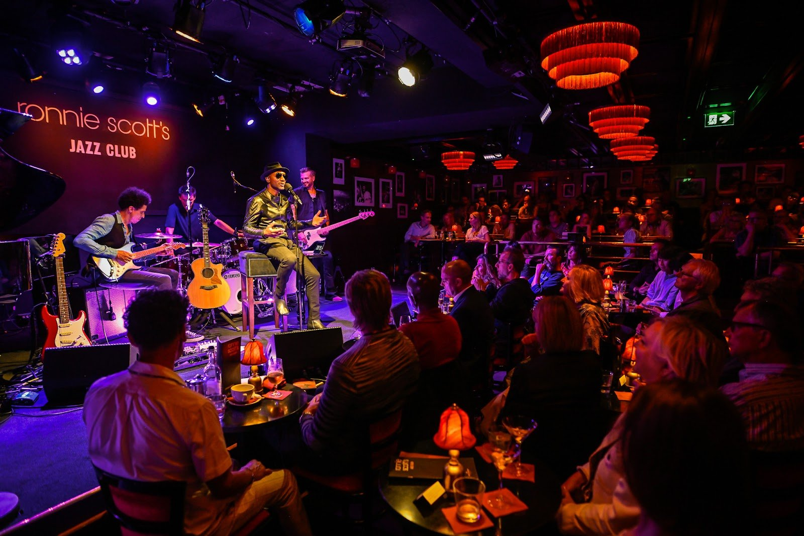

The £12 Late Late Show is the cheap way into the same room, and the full history of the club, its Upstairs bar and the Monday jam is in [our live music venues guide](/articles/best-live-music-venues-london/). Book the main show ahead for any name you have heard of.

### PizzaExpress Jazz Club, Soho

*££ · Soho · 10 Dean Street, W1D · Cited by 5 sources · #3 of 10, Time Out · [its site](https://www.pizzaexpresslive.com/pizzaexpress-jazz-club-soho)*

A basement under the Dean Street PizzaExpress with a ticketed act on its stage and the full PizzaExpress menu served to your table. The ticket buys the table: it is reserved from doors-open for the number you booked, and there are no paper tickets, you give your name at the door. **Food and drink are on top of the ticket**, and a £2 booking fee is added per ticket.

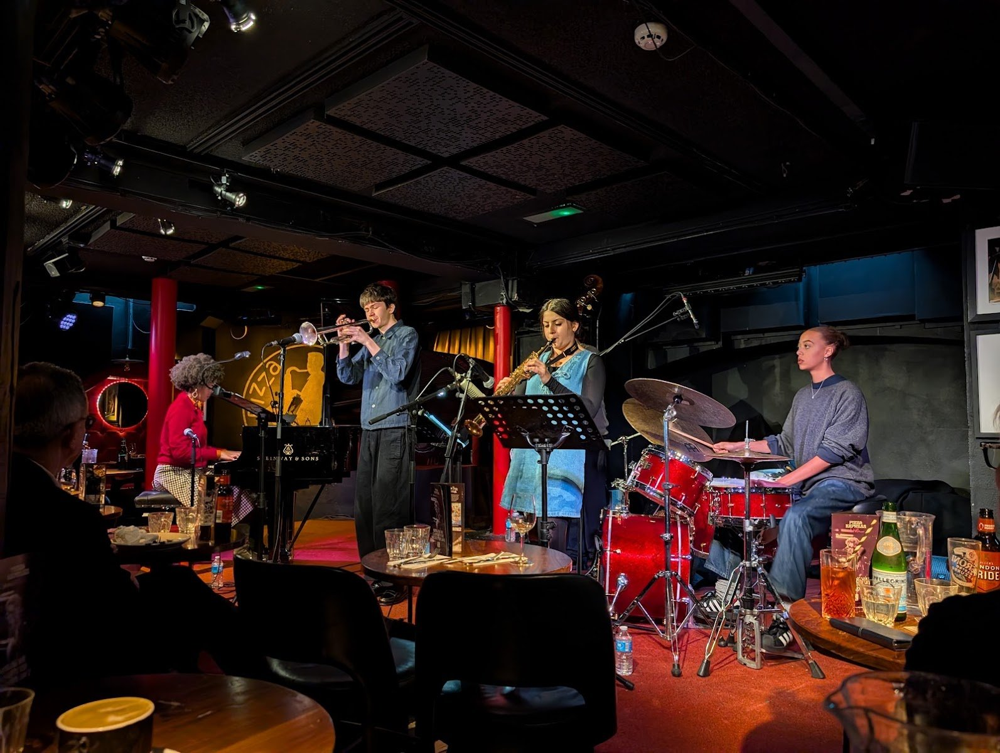

The rooms are small and the tables close together; one Reddit regular describes eating "in a cramped restaurant" with the band a few feet away, and the room is built that way. Two sister rooms work the same way with an act every night of the week: PizzaExpress Live Holborn at 99 High Holborn, and The Pheasantry at 152 King's Road in Chelsea, which [our cabaret guide](/articles/best-cabaret-london/) covers in full. Smart casual is the norm.

### 606 Club, Chelsea

*££ · Chelsea · 90 Lots Road, SW10 · Cited by 4 sources · #2 of 10, Time Out · [times and prices](https://www.606club.co.uk/times-prices/)*

A basement club seating about 100, owned and run by musician Steve Rubie since 1976, which makes 2026 its fiftieth year. It publishes its whole price list: **£18 a head for the music Sunday to Thursday evenings, £23 on Friday and Saturday, and £16 for Sunday lunch** (doors 12.30pm, music 1.30 to 3.30pm). Evenings are two sets of jazz, Latin or soul by UK players, from 8pm in the week and 9pm at weekends.

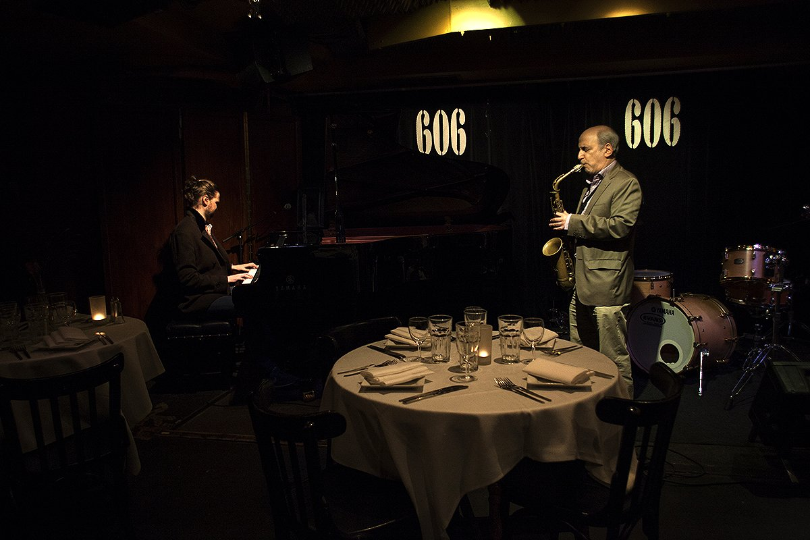

The kitchen is à la carte and cooked to order: grilled sea bream with ratatouille at £23.95, a rib-eye with chips at £29.35, slow-cooked duck leg with a honey, soy and ginger glaze at £20.75. It is licensed as a restaurant, so non-members drink only if they eat. Book by phone, then **confirm by 3pm on the day** or the table goes to the waiting list. Smart casual, no shorts.

### Jazz Cafe, Camden

<!-- evidence: Jazz Cafe Camden -->
*££ · Camden · 5 Parkway, NW1 · Cited by 5 sources · #9 of 10, Time Out · [restaurant tickets](https://thejazzcafe.com/restaurant-bookings/)*

A two-level music venue where the first-floor restaurant is a mezzanine looking down on the stage. You do not book a table separately: each gig sells **restaurant tickets** beside standing ones, at £15 to £50 against £15 to £20 standing for the acts listed in late September 2026, and the ticket is the table. The menu that month ran from a birria taco at £11.50 and a dry-aged cheeseburger at £17 to a rib-eye with chimichurri at £34.

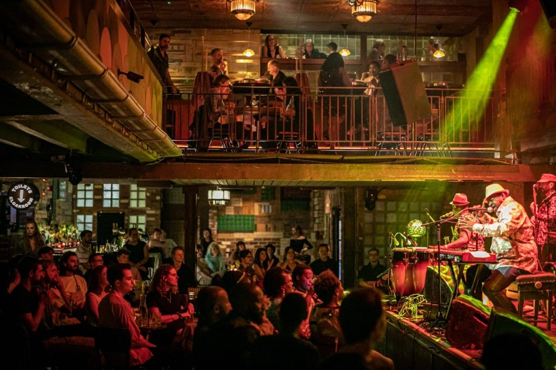

The music is soul, Afrobeat, jazz and singer-songwriters, not a jazz house style, and it usually starts 60 to 90 minutes after doors. **It is strictly 18+ with photo ID**, and the restaurant is up 16 steps with no step-free access. [Our live music guide](/articles/best-live-music-venues-london/) has the rest of the building.

### Toulouse Lautrec, Kennington

*££ · Kennington · 140 Newington Butts, SE11 · Cited by 6 sources · [book a table](https://toulouselautrec.co.uk/restaurant/#book)*

A French brasserie with live music in the dining room **every Thursday, Friday and Saturday from 7pm**, and a separate jazz club upstairs with its own ticketed programme. In the restaurant you eat the full menu: seared foie gras with prune jam at £17, cassoulet with confit duck, Toulouse sausage and pork belly at £26, a 32-day rib-eye at £36. A music charge goes on the bill at the end: **£5 a head on Thursdays, £7 on Fridays and Saturdays**.

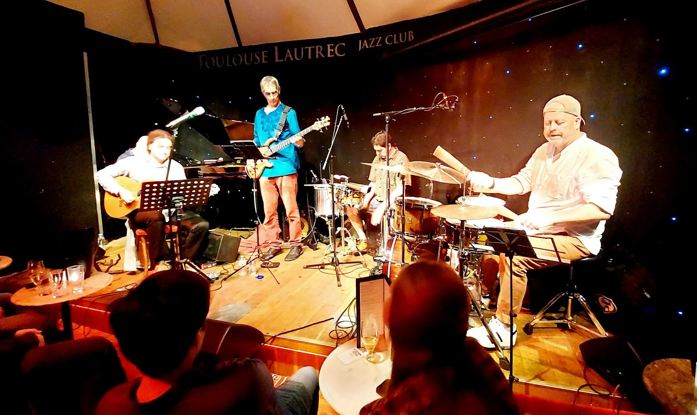

The upstairs club serves small plates and sharing boards only, so the house advice is to buy the club ticket separately and eat downstairs 90 minutes before the show. Reddit's r/Jazz thread on dining with music lays out the rooms the same way. Tables for up to 12 book online.

### Oriole, Covent Garden

*££ · Covent Garden · 7–9 Slingsby Place, St Martin's Courtyard, WC2E · Cited by 4 sources · [book a table](https://www.oriolebar.com/#reservations)*

Oriole has moved from Smithfield and now plays **jazz, blues and world music Tuesday to Saturday** in St Martin's Courtyard, usually two sets from 8pm, with a Global Tuesdays slot for Cuban and other bands. It is closed on Sundays and Mondays. The menu is Latin and Asian-leaning: seabream ceviche with peach and leche de tigre at £15, a miso-gochujang pork chop at £25, a 34-day sirloin with triple-cooked chips at £45.

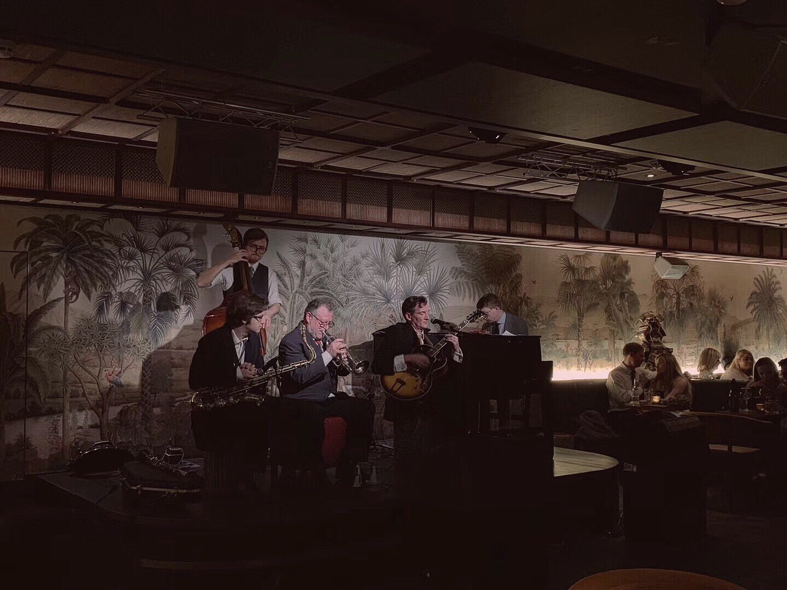

A cover charge of **£4 to £12** goes on the bill and is paid to the band; each night's figure is printed in the listing, and special nights can be ticketed. The downstairs room sometimes closes for private events, which shows in the same listings, so check the night before you plan around it.

### Mu, Dalston

*££ · Dalston · 432–434 Kingsland Road, E8 · Cited by 4 sources · [book a table](https://www.sevenrooms.com/explore/mu/reservations/create/search/)*

A Japanese robata restaurant with jazz five nights a week, Wednesday to Sunday, and closed Mondays and Tuesdays. Sets start at 7.30pm and 9pm on Wednesday, Thursday and Sunday, and at 9pm, 10pm and 11pm on Friday and Saturday, when it stays open until 2am. From the grill: seabass with miso garlic butter at £32, black cod at £35, a 350g dry-aged striploin with chimichurri at £48, and gyoza from £12.

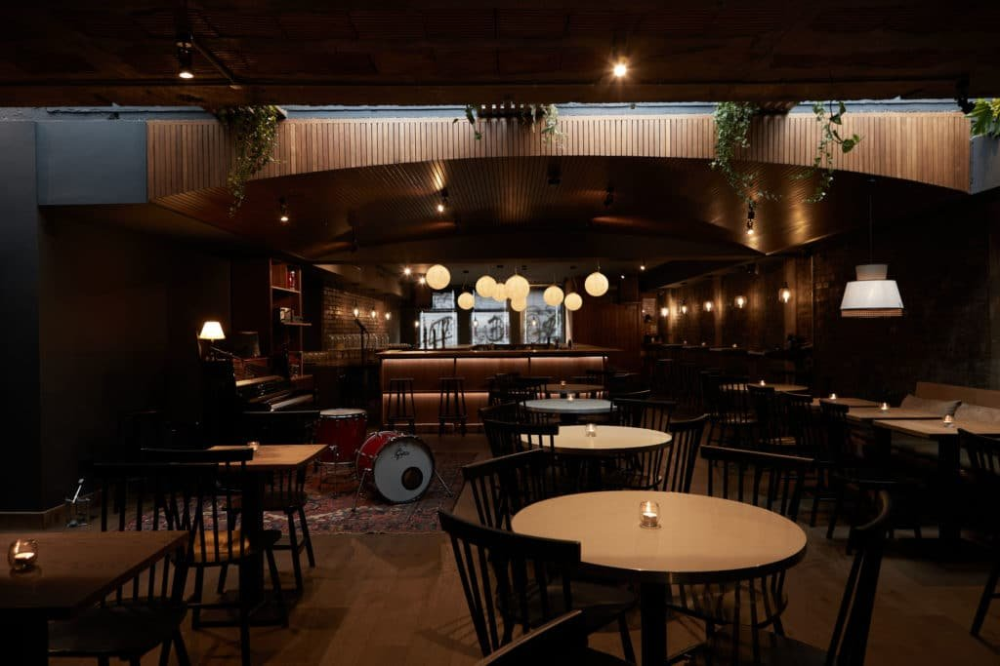

The **£8 music charge is optional**, paid to the musicians and added only for guests seated during a performance; the house says it made it optional so people who do not care about the music can still eat. The Nudge puts it on both its live-music and its fun-restaurants lists, and a Reddit reply sums it up as "Japanese food and jazz. Good drinks."

### Ladbroke Hall, North Kensington

*££ · North Kensington · 79 Barlby Road, W10 · Cited by 2 sources · [book](https://www.sevenrooms.com/explore/ladbrokehall/reservations/create/search)*

A Grade II-listed building with jazz **every Friday** in its Sunbeam Theatre. Tickets start at £15, doors are 7.30pm and the music starts at 8pm; a dinner ticket gets you a table and you order from Pollini's jazz set menu, which arrives while the band plays. Pollini is the building's Italian restaurant, and its à la carte runs from tagliatelle with lamb ragù at £32 to its signature spaghetti with red prawn, pesto and stracciatella at £48.

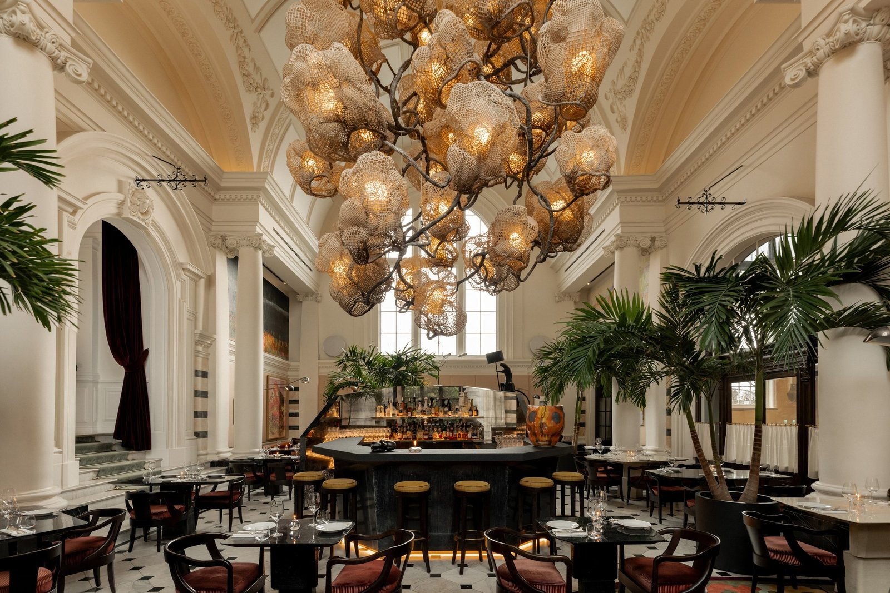

Standing tickets are sold on the door if there is room. It is a ten-minute walk from Ladbroke Grove, further out than anything else in this section.

### Dalston Jazz Bar, Dalston

*£ · Dalston · 4 Bradbury Street, N16 · Cited by 2 sources · [its site](https://www.dalstonjazzbar.com)*

A small room open **Thursday, Friday and Saturday nights only**, from 6pm to 1am on Thursdays and to 3am at weekends, where the band plays among the tables. Both TikTok creators who filmed it describe the same format: a menu with no prices, a run of seafood (baked and fresh oysters, mussels, prawns, a whole fish) and paying what you think it was worth. One suggests taking a late table and staying for when the tables are moved and it turns into a party. Book through the link on its site.

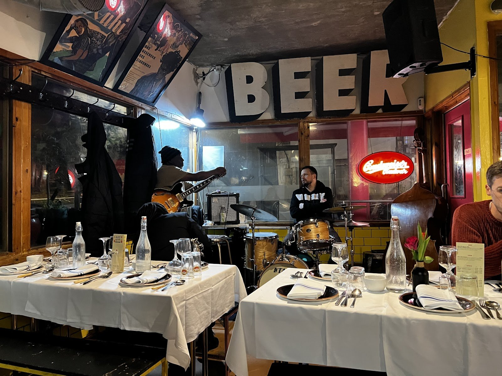

---

Powered by <a target="_blank" rel="sponsored" href="https://www.getyourguide.com/london-l57/">GetYourGuide</a>

## Restaurants with a band while you eat

The restaurant comes first here. You book a table as normal, the music is background you can talk over, and it costs little or nothing extra.

### Brasserie Zédel, Piccadilly

*£ · Piccadilly · 20 Sherwood Street, W1F · Cited by 7 sources · [book a table](https://www.sevenrooms.com/explore/brasseriezedellondon/reservations/create/search/?venues=brasseriezedellondon)*

A gilded Art Deco basement brasserie off Piccadilly Circus where a house band plays **every day of the week**: 7 to 10.30pm Monday to Wednesday, 8 to 11.15pm Thursday to Saturday, and at lunch as well at the weekend (12.30 to 3.30pm, plus 6 to 9pm on Sundays). The week starting 28 September 2026 is La Bouche Manouche, a vintage swing band. **There is no music charge**, and the prix fixe is £16.95 for two courses or £19.95 for three, vichyssoise then steak haché; à la carte runs to boeuf bourguignon at £27.25 and coq au vin at £25.50.

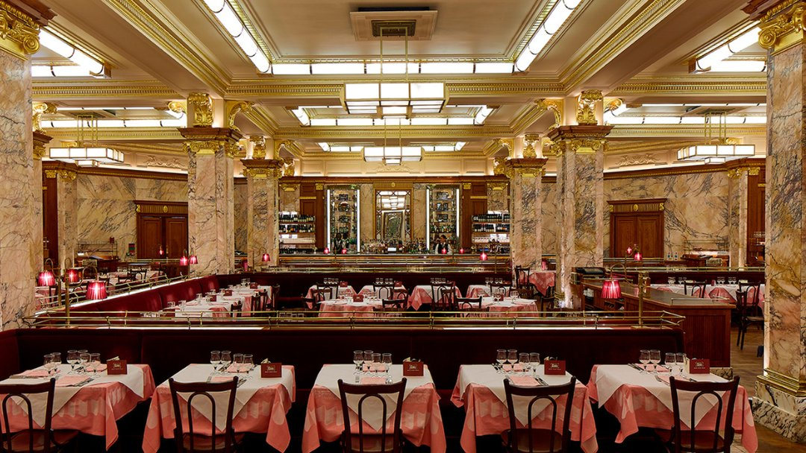

A 15% service charge is added to every bill. Walk-ins are taken but booking is advised. Crazy Coqs, the cabaret room in the same building, sells its own tickets and does not bundle dinner; [our cabaret guide](/articles/best-cabaret-london/) covers it.

### Quaglino's, St James's

*££ · St James's · 16 Bury Street, SW1Y · Cited by 7 sources · [book a table](https://quaglinos-restaurant.co.uk/#book)*

A big St James's dining room with live music **Monday to Saturday**: a duo, trio or quartet from 7pm to 10.30pm, and on Fridays and Saturdays the house band takes over from 9.30pm to past midnight. The acts rotate weekly and are listed day by day. There is **no music charge**. The menu is grand brasserie: prawn cocktail at £18, turbot at £48, poulet sauté at £32, Chateaubriand for two at £65 a head.

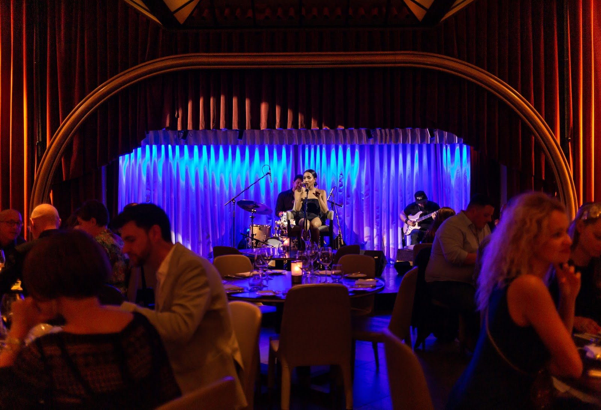

There is no dress code, though the room is dressed-up. Children are not allowed in the bar after 6pm, and **Saturday brunch, with a five-piece band from 1.15pm, is adults only**. A Reddit r/Jazz reply describes the balance: "less of a focus on the quality of the jazz and more on the atmosphere".

### The Parlour at The Ned, Bank

<!-- evidence: The Ned -->
*££ · Bank · 27 Poultry, EC2R · Cited by 5 sources · [its site](https://www.thened.com/london/restaurants/the-parlour)*

The only one of The Ned's restaurants with live music, a jazz and cabaret room open **Wednesday to Saturday**, from 6pm to 11pm midweek and to midnight at weekends. The October 2026 bill has a Black Cat Cabaret show on Saturdays and soul on Fridays. The **"Jazz It Up" set menu is £80** for three courses and a welcome drink, with the entertainment included; book off the à la carte instead and **a £20 a head entertainment cover** goes on the bill. The kitchen does caviar, shellfish, fillet steak au poivre and a chicken Kiev with black truffle.

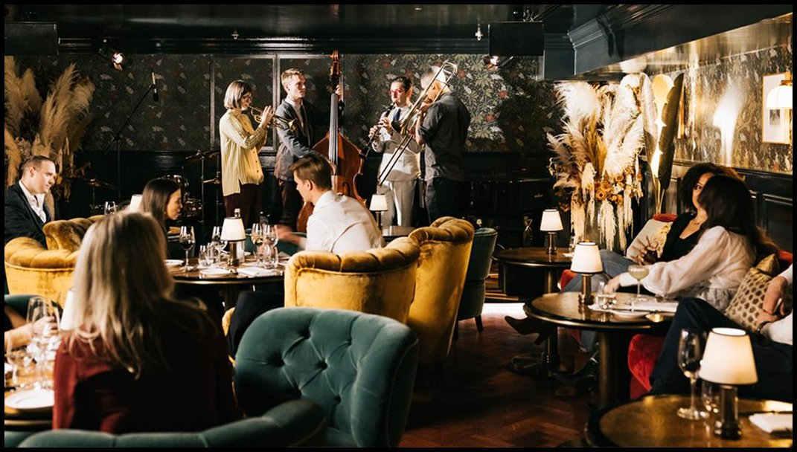

Either way you get access to The Vault bar after dinner, space allowing. Ned's Club members pay no cover.

### Boisdale, Belgravia and Canary Wharf

*££ · Belgravia and Canary Wharf · 13–15 Eccleston Street, SW1W and Cabot Square, E14 · Cited by 6 sources · [dinner and show tickets](https://boisdaletickets.co.uk/calendar)*

A Scottish restaurant with live music **Monday to Saturday nights** in Belgravia, programmed by its patron of music, Jools Holland, and a jazz Sunday lunch. The music is mostly tribute and residency nights: Stephen Triffitt as Frank Sinatra every Monday, from 9pm, is £59 standard or £79 VIP for dinner and the show, plus a £3 booking fee. The dinner-and-show menu runs to Cullen skink, venison carpaccio and a pheasant, rabbit and tarragon pie.

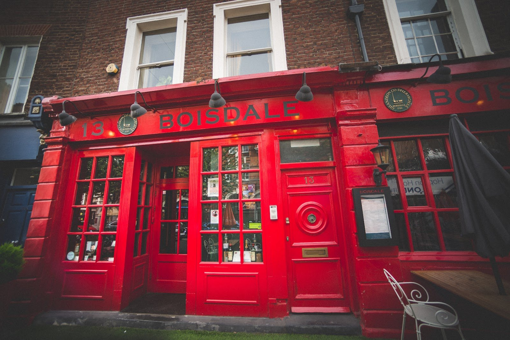

**A table in the restaurant does not include the show** unless you buy the ticket, and the 14.5% service charge applies to the dinner part. Evening music is 13+. The Belgravia building has stairs throughout and no lift. Canary Wharf runs weekend lunch-and-show sittings and shows booked through the same calendar; a Reddit commenter's warning applies to both: "more of a jazz-themed show than a proper gig".

### Louie, Covent Garden

*£££ · Covent Garden · 13–15 West Street, WC2H · Cited by 4 sources · [its site](https://thehouseoflouie.com/restaurants-bar/louie-restaurant/)*

A French brasserie between Soho and Covent Garden where **a pianist and a singer play every night it is open**, Tuesday to Saturday, lunch from noon and dinner to 11pm; it is closed on Sundays and Mondays. The menu is Parisian: beef carpaccio at £19, seared tuna Niçoise-style from £18, sea bass with white wine velouté at £38, and a kilo côte de boeuf for two at £125. A 15% service charge is added. The building also holds the Alligator Bar, which is a separate DJ and guest-list bar, not the restaurant.

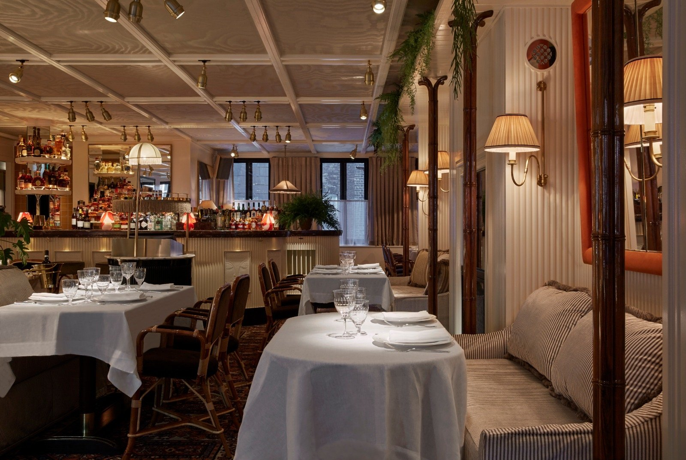

### 28°-50° by Night, Marylebone

*££ · Marylebone · 76 Jason Court, Wigmore Street, W1U · Cited by 3 sources · [its site](https://2850bynight.co.uk)*

A wine bar and kitchen off Wigmore Street that turns into a jazz room **Thursday to Saturday, 8pm to 2am**, playing Dixieland, trad jazz, blues and swing; Sunday to Wednesday it is private hire only. The food is bistro: seared tuna with ratatouille and romesco at £27.95, confit duck leg at £28.95, a 28-day rib-eye at £38.95, a cheeseburger at £19.95. There is no music charge for a normal table. Dress is smart casual. A TikTok creator filming London jazz rooms called it "relaxed, proper jazzy environment and delicious food".

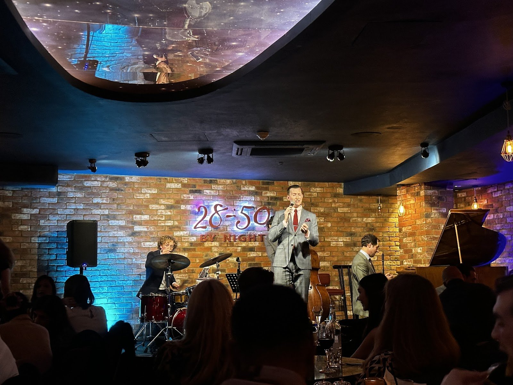

### Dishoom Kensington, High Street Kensington

<!-- evidence: Dishoom -->
*£ · Kensington · 4 Derry Street, W8 · Cited by 4 sources · [book a table](https://www.sevenrooms.com/explore/dishoomkensington/reservations/create/search)*

The Kensington branch of the Bombay café chain has live music **on Wednesdays, Thursdays and Fridays**. It is the ordinary Dishoom menu, with no cover charge: samosas, chicken ruby, house black daal and the nalli nihari biryani. The Sauce, The Handbook, The Nudge and London The Inside all single out this branch for it. Times are not published; book an evening table and the music comes with it. It is three minutes from High Street Kensington station.

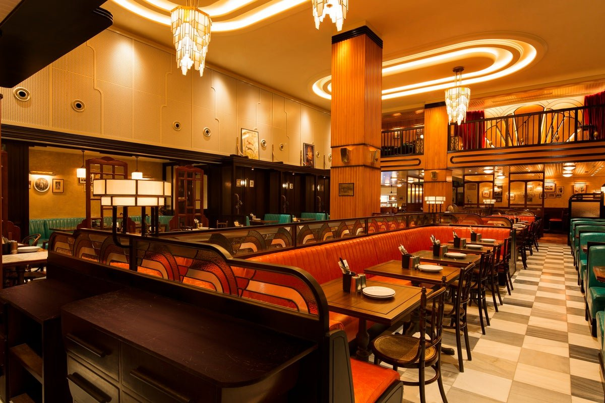

### Plaquemine Lock, Islington

*Angel · 139 Graham Street, N1 · Cited by 2 sources · [book a table](https://www.sevenrooms.com/reservations/plaqueminelock)*

A Cajun and Creole pub with live jazz, blues and brass **on Friday nights, Saturday brunch and dinner, and Sunday brunch** — music from around 8.30pm at dinner and 12.30pm at brunch. The bands are named week by week; Ewan Bleach has the Saturday brunch slot through October 2026. The kitchen does shrimp and okra gumbo, po'boys and Eggs Sardou with artichoke, spinach and cornbread at brunch, and a happy hour (4 to 5.45pm, Tuesday to Friday) with £1 oysters. A 13.5% service charge applies. Reddit threads recommend it for exactly this, "a Saturday jazz brunch".

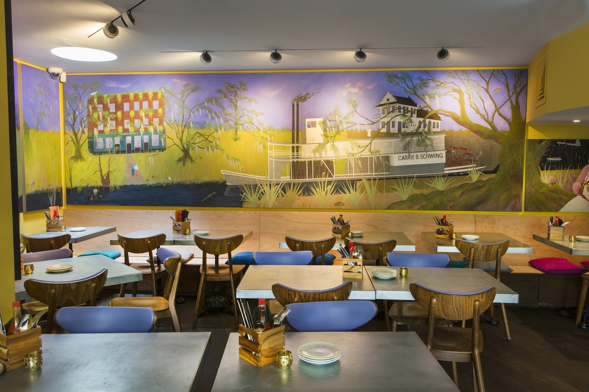

### The Blues Kitchen, Camden, Shoreditch and Brixton

<!-- evidence: The Blues Kitchen -->
*£ · Camden, Shoreditch and Brixton · 111–113 Camden High Street, NW1 · Cited by 9 sources · [book a table in Camden](https://theblueskitchen.com/camden/bookings/)*

Three American-style bar-restaurants with **live music every night**, a different named night each evening (soul, R&B, blues, a Sunday blues jam), and **free entry for the music from 9.45pm**. It is named by more of the sources on this page than anything else. From the Camden menu: Korean fried chicken at £9.50, a birria taco at £11.50, a dry-aged cheeseburger at £13, a Hereford fillet at £35. A 12.5% service charge goes on food.

**Under-18s are not allowed in the bar or stage-side areas**, and in the restaurant only until 6pm on Fridays and Saturdays. Shoreditch adds a Saturday brunch with an eight-piece hip-hop orchestra, below.

### The Piano Works, Farringdon and Covent Garden

*££ · Farringdon and Covent Garden · 113–117 Farringdon Road, EC1R · Cited by 5 sources · [book a table](https://www.pianoworks.bar/book)*

A piano bar where the band plays **only what the audience requests**, so the night is whatever the room asks for. Farringdon runs Tuesday to Saturday; the Covent Garden bar, inside the Gillian Lynne Theatre on Parker Street, runs Wednesday to Saturday, with musical theatre songs on Wednesdays. Dinner is a two-course set menu with a glass of Prosecco (smoked cheeseburger, aged sirloin for a £5 supplement), and **7.30pm dinner bookings carry a £5 a head entertainment fee**.

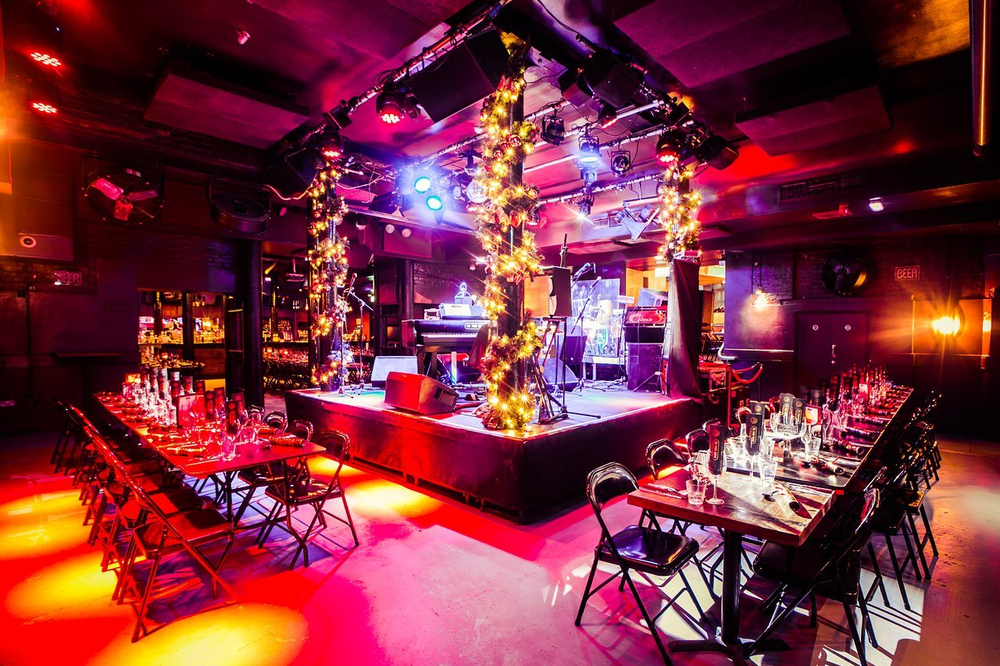

Dinner tables are held for about two hours, and booked tables get priority over the queue. **It is 18+**, and football shirts and sportswear are refused. Farringdon also runs a Saturday bottomless brunch at £55 with two courses.

### The Tiroler Hut, Bayswater

*££ · Bayswater · 27 Westbourne Grove, W2 · Cited by 2 sources · [its site](https://www.tirolerhutrestaurant.co.uk)*

An Austrian restaurant open since 1967, where the owner, Josef Friedmann, has been playing his cowbell show for more than 30 years, alongside yodelling and an accordion "Do-Re-Mi". Time Out ranks it fifth of 19 on its quirky restaurants list. Groups eat a party menu at £49 a head. The show nights are not published, and bookings are by phone (020 7243 9277), so ask when the cowbells are on as you book.

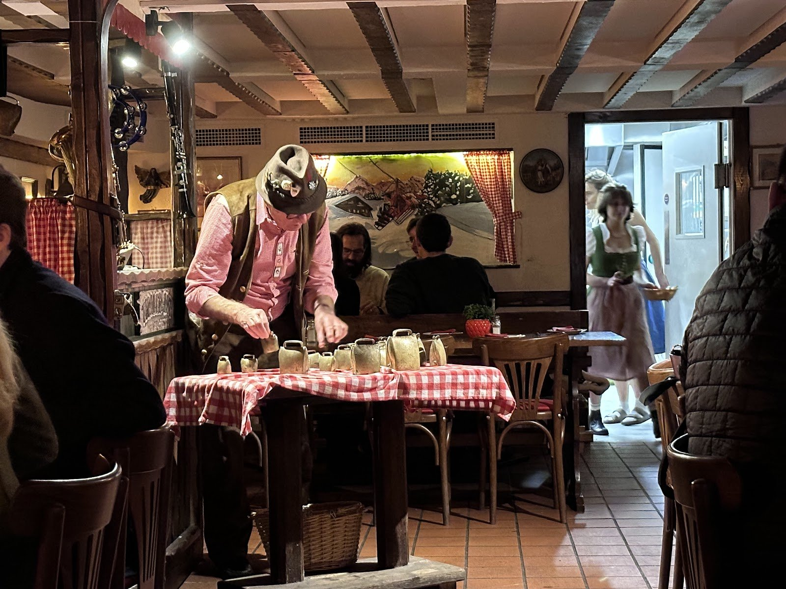

---

## Cabaret, burlesque and dinner shows

These sell a show first. You buy a ticket at a set time, and dinner is either in the ticket or a tier above it.

### 58th Street by The Lost Estate, Peckham

<!-- evidence: 58th Street -->
*£££ · Peckham · 133 Rye Lane, SE15 · Cited by 4 sources · [book](https://58thstreet.co.uk/reservations/)*

A recreation of Belle Livingstone's 1930s New York speakeasy, three minutes from Peckham Rye station, with **three sets of live jazz** from The 58th Street Stompers, burlesque and a story told around you. It lasts about three hours 45 minutes. **Experience-only tickets are £74.85 and the six-course "Park Avenue" dining tickets from £119.85**, so you can see the whole show without the dinner. Evenings start at 6pm (first course 6.30pm, no admission after 7pm), with matinees from noon.

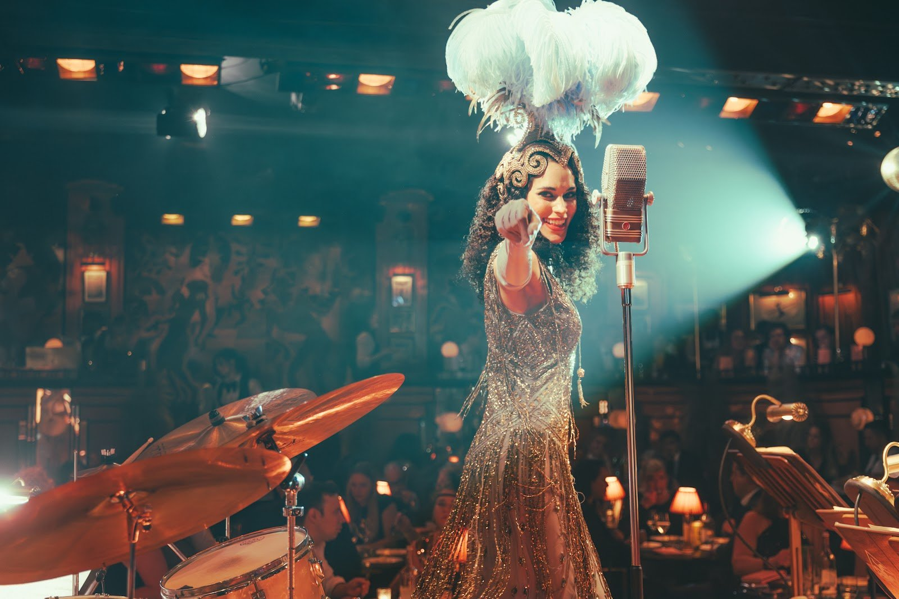

The dress code is "1930s luxe" — black, white and metallics — and it is best suited to over-18s. No photography inside, and late arrivals are held until a break. [Our cabaret guide](/articles/best-cabaret-london/) covers The Lost Estate's other productions, including its Christmas feast.

GetYourGuide sells <a href="https://www.getyourguide.com/activity/-t888396?partner_id=WWP7I0R&amp;cmp=dinner-and-a-show-london" target="_blank" rel="sponsored nofollow noopener" data-affiliate="gyg">the dinner show ticket</a> from £120, rated 4.3 from 31 reviews; the calendar below shows which dates have seats.

Powered by <a target="_blank" rel="sponsored" href="https://www.getyourguide.com/london-l57/">GetYourGuide</a>

### The London Cabaret Club, Holborn

*£££ · Holborn · Victoria House, Bloomsbury Square, WC1B · Cited by 7 sources · [book](https://www.thelondoncabaretclub.com/book-tickets/)*

A full themed production in an Art Deco room, with pre-show entertainment from 6.30pm, the main show around 7pm to 7.30pm and an after-party. The current show is **Roxie Rocks Chicago**, a 1920s speakeasy story; El Dia of the Dead takes over at Halloween and Christmas in Chicago in December. Tiers start at **Silver from £49.50, which includes no food at all**, then Gold from £99.50 with three courses, Diamond from £154.50 with a VIP three-course menu, and Royal Diamond from £199.50 with half a bottle of Moët. Fridays and Saturdays cost far more than weekdays, and Thursdays are 25% off through October 2026.

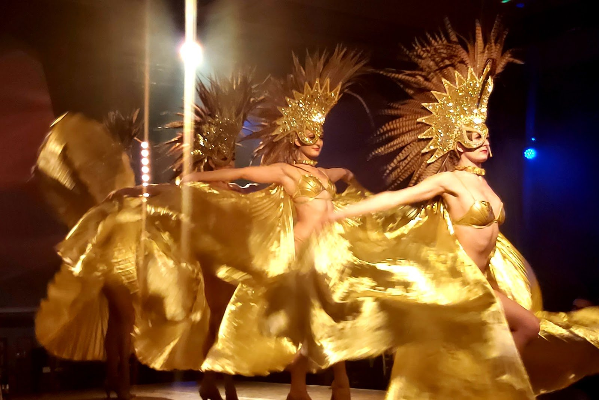

The dress code is "smart elegance", and the minimum age is 7; under-18s leave before the after-party. Tickets are non-refundable, and changing the date costs £20 a head. [Our cabaret guide](/articles/best-cabaret-london/) has the full breakdown.

### INCA, Oxford Circus

*Minimum spend · Oxford Circus · 8–9 Argyll Street, W1F · Cited by 4 sources · [book a table](https://www.sevenrooms.com/reservations/incalondon)*

A Latin American restaurant built around a central stage, where singers, dancers and acrobats perform through dinner and come to the tables: samba, tango and a story of the Inca world. It opens from 8pm on Wednesday, Thursday and Sunday and from 7pm on Friday and Saturday. The kitchen is South American with a Nikkei streak: ceviches, tiraditos, maki rolls and a charcoal-grilled T-bone brought to the table in flames.

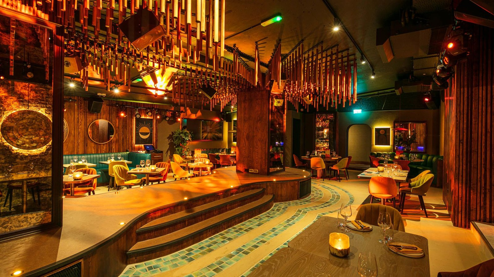

**INCA runs a minimum spend**, tables are held for two hours, and groups of nine or more eat a set menu. **It is 18+** and the dress code is "smart elegant" — no sportswear, shorts or caps.

### The Maine Mayfair, Mayfair

*£££ · Mayfair · 6 Medici Court, W1S · Cited by 2 sources · [book a table](https://www.sevenrooms.com/reservations/themainemayfair)*

A Mayfair brasserie with **live jazz on the brasserie stage Tuesday to Saturday and a burlesque show Thursday to Saturday**, then DJs in the Powder Room from 11pm at weekends. It opens every day from 5.30pm. The food is big-ticket: fried buttermilk chicken with Oscietra caviar at £75, sticky short ribs at £30, an angry lobster pasta with a whole lobster at £80, a 1.2kg dry-aged tomahawk at £165. A 15% service charge is added. **It is 18+**, and dress is "smart elegant". For less, weekday lunch in its tavern is £24 for two courses, without the show.

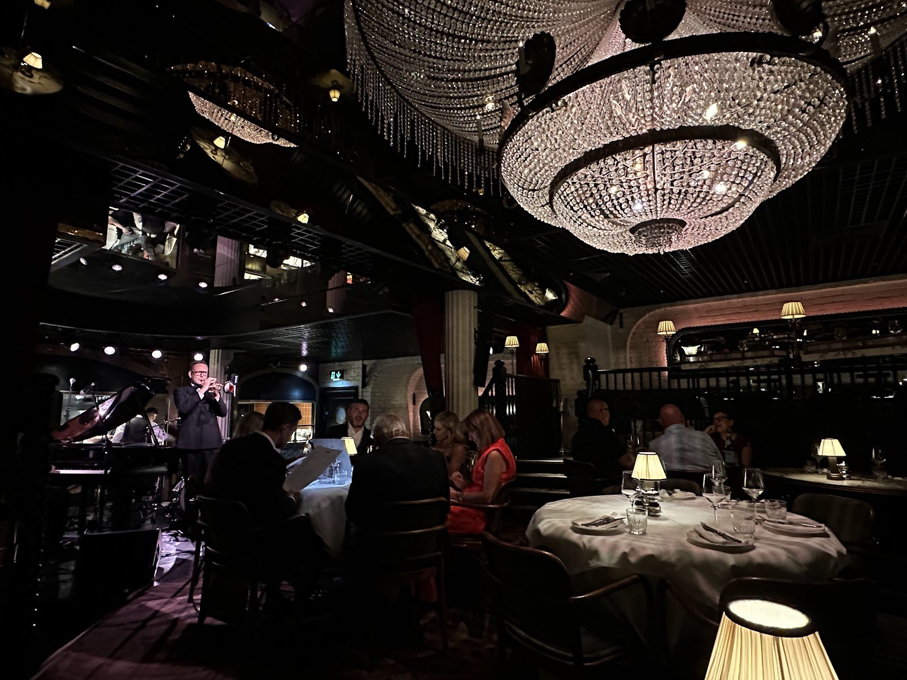

### Cabaret at the Kit Kat Club, Embankment

*£££ · Embankment · Playhouse Theatre, Northumberland Avenue, WC2N · [stageside dining](https://kitkat.club/tickets/)*

The West End production of *Cabaret* sells **stageside dining at £85 a head on top of the show ticket**, in pairs, at evening performances: canapés and cocktails at a table in the stalls 45 minutes before curtain, cleared before the show starts. It is a meal before the show, not during it, and [our cabaret guide](/articles/best-cabaret-london/) covers the production.

### Sarastro, Drury Lane

*££ · Covent Garden · 126 Drury Lane, WC2B · Cited by 5 sources · #19 of 19, Time Out · [book a table](https://cloudeu01.avenista.net/SarastroRestaurant/Bookings/sarastro)*

A theatrical Turkish-Mediterranean restaurant behind the Theatre Royal, with its tables in gilded opera boxes, and live acts **Thursday to Sunday evenings**: 70s and 80s nights, a Marilyn Monroe tribute and gypsy swing on Thursdays, Latin on Fridays, Rat Pack or ABBA tributes on Saturdays, and **opera with a string quartet on Sundays**. Shows start at 8pm, 8.30pm for the tributes. There is no entertainment charge, but on music nights tables under six must order at least two courses from the menu, which runs from Akçaabat köfte at £26.95 to rack of lamb at £37.50.

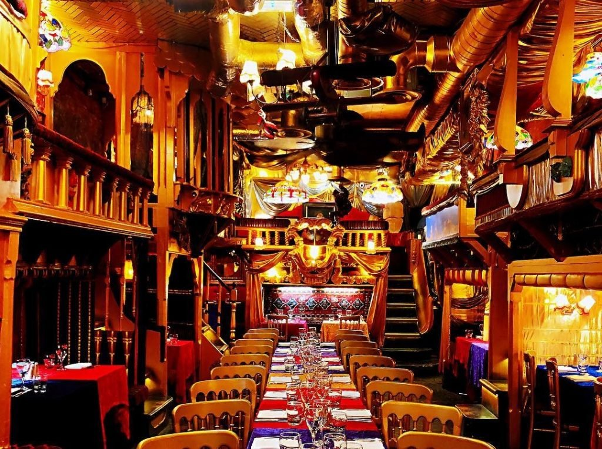

It is over-14s only from 7pm on Thursday to Saturday. The balcony is up a narrow staircase unsuited to heels. [Our cabaret guide](/articles/best-cabaret-london/) has more on it.

---

## Dining theatre: comedy, a murder and a tiny chef

A cast, a script and dinner as part of the plot. Several of these want you to join in; the entries say which.

### Faulty Towers The Dining Experience, Russell Square

*££ · Bloomsbury · President Hotel, 56–60 Guilford Street, WC1N · Cited by 2 sources · [its site](https://www.interactivetheatre.com.au/faulty-towers-the-dining-experience/)*

Basil, Sybil and Manuel serve you a three-course set menu in a Bloomsbury hotel over two hours, in a show now in its thirteenth year here. You are a hotel guest, not an audience, so you will be spoken to and roped in. Prices rise through the week: **from £65.50 on a Wednesday to £88.50 on a Saturday evening**, dinner included and drinks extra. Nut allergies must be flagged 72 hours ahead, and the show contains a peanut gag. Book on [Ticketmaster](https://theatre.ticketmaster.co.uk/book/1GLTR-faulty-towers-the-dining-experience-in-londons-west-end-2024/). [Our immersive guide](/articles/immersive-experiences-london/) has more on how much it asks of you.

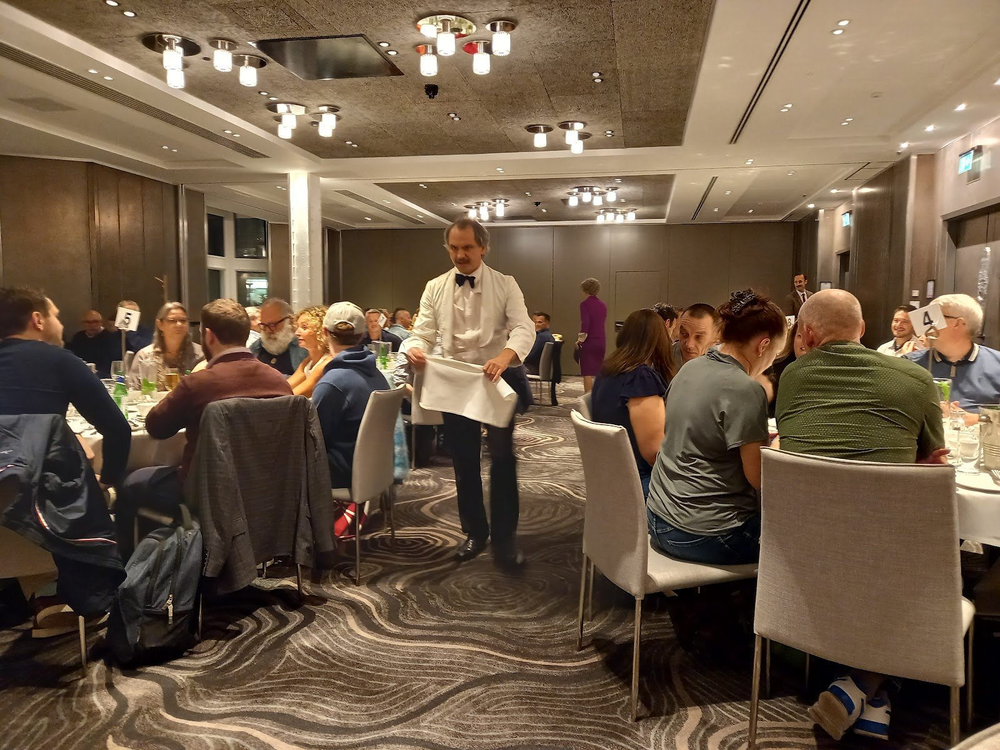

### The Murdér Express, Bethnal Green

*££ · Bethnal Green · Arch 63, Pedley Street, E1 · Cited by 2 sources · [its site](https://themurderexpress.com/bethnalgreen/)*

A 1937 dining car in a railway arch, seven minutes from Bethnal Green station, where the current production, *Part Deux: The Jewel of the Empire*, puts a diamond on board and you solve the murder over three courses — the published example is asparagus velouté, chicken breast with peppercorn sauce and a chocolate brownie. It lasts two hours. Tickets run from £74 a head in a carriage for six to £94.60 in a private booth, plus a £4.90 booking fee; drinks are extra. The producers want you in character, so dress for dinner. **Children from 5 are allowed only at shows before 8pm.** There are three steps up into the train, with a ramp for most wheelchairs if you ask ahead.

### Le Petit Chef, Victoria

*£££ · Victoria · Taj 51 Buckingham Gate, SW1E · Cited by 3 sources · [book](https://booking.lepetitchef.com/londont/)*

A projection, not a performer: an animated chef six centimetres tall cooks each course on your plate before the real one arrives, over about two hours. The Classic and Vegetarian menus are £139 a head, the Grand menu £149, and a Juniors menu for 6 to 12-year-olds £69, all plus 12.5% service. Arrive 30 minutes early; you may share a table with other guests, and gluten-free needs 48 hours' notice. Dress is smart casual with closed shoes. It runs at Taj 51 Buckingham Gate.

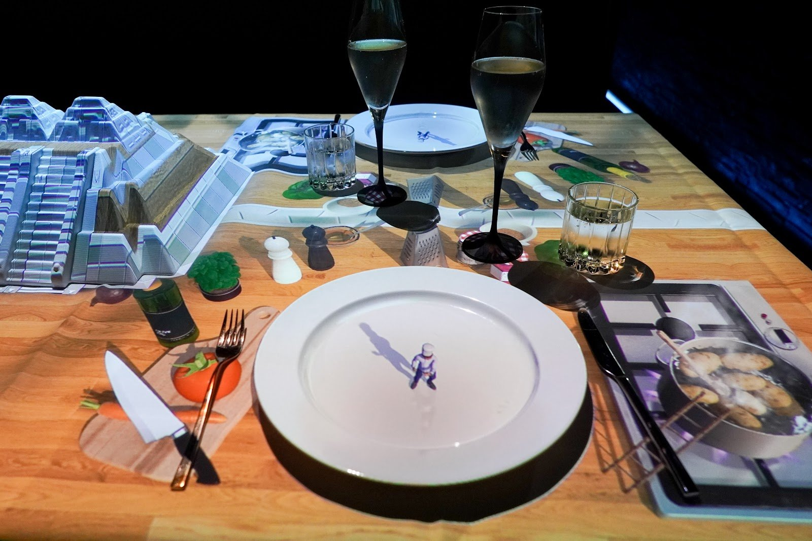

### Taste Film, Kensal Green and Moorgate

*££ · Kensal Green and Moorgate · Parlour, 5 Regent Street, NW10 · Cited by 2 sources · [tickets](https://www.tastefilm.co.uk/get-tickets)*

A film on screen and a multi-course menu cooked to match it, course by course, as the scenes arrive: burgers, shakes and "an adrenaline shot" for *Pulp Fiction* at £87.50 for five courses, or six courses for *The Nightmare Before Christmas*, *Sinners* or *The Fellowship of the Ring* at £99.95. It runs at Parlour, Jesse Dunford Wood's gastropub in Kensal Green, and at The Refinery Citypoint opposite Moorgate station. There is no live cast. *Pulp Fiction* carries its film's 18 rating.

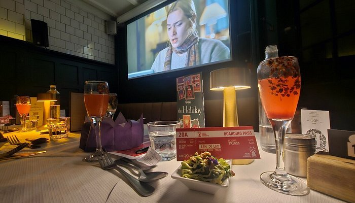

### Mamma Mia! The Party, North Greenwich

*£££ · North Greenwich · The O2 · Cited by 3 sources · [book](https://mammamiatheparty.com/london/tickets/)*

A Greek taverna set inside The O2, where a Sandi Toksvig story plays out around, above and below the tables over a four-course Greek sharing menu — mezze, lamb stifado and slow-cooked beef, a dessert plate with baklava and orange ravani — and then the room becomes an ABBA disco. It lasts about four hours. **Tier C, with a view restricted by pillars, is £120 off-peak and £154 peak; Tier A is £213 to £246.** Drinks are extra, tables are pre-allocated and you may share with strangers. Minimum age 5. Tickets are on sale to April 2027.

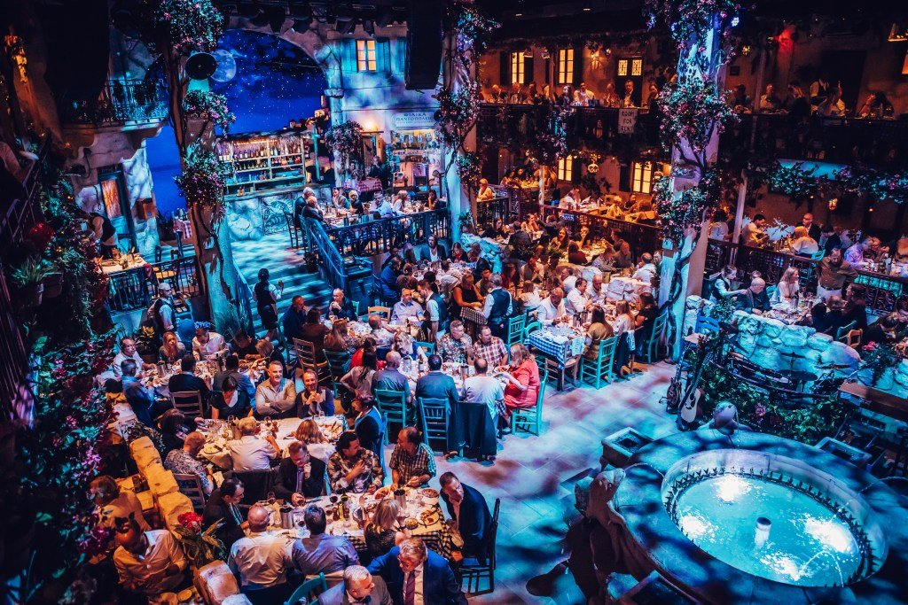

GetYourGuide sells <a href="https://www.getyourguide.com/activity/-t1064445?partner_id=WWP7I0R&amp;cmp=dinner-and-a-show-london" target="_blank" rel="sponsored nofollow noopener" data-affiliate="gyg">the same dinner show ticket</a> from £120, rated 4.7 from 148 reviews; the calendar below shows which dates have seats.

Powered by <a target="_blank" rel="sponsored" href="https://www.getyourguide.com/london-l57/">GetYourGuide</a>

### Comedy with dinner

None of London's comedy clubs is a restaurant, so these are the ways to eat and laugh on one booking. [Our comedy clubs guide](/articles/best-comedy-clubs-london/) covers the clubs themselves.

| Where | Area | Price | What you get |
| --- | --- | --- | --- |
| **[The Comedy Store](https://london.thecomedystore.co.uk/food-and-drink)** | Piccadilly Circus | £ | Pizza and burgers served before the show and in the interval, eaten in the auditorium or a 25-seat diner; pre-order deals Thursday to Sunday, any pizza £11, on top of the show ticket |
| **[The 99 Club meal package](https://www.99clubcomedy.com/meal-package/)** | Leicester Square | ££ | Two courses at Steak & Co at 6pm from £46.15, or Flesh & Buns from £62, then the 8.30pm show; booked by phone on 020 3627 8955 |
| **[inamo comedy night](https://www.inamo-restaurant.com/inamo-experiences/comedy-night-3-dish-dinner/)** | Covent Garden | — | Three dishes from the pan-Asian set menu, then Mirth Control Comedy in the Onyx Bar, weekly on Thursdays and often Tuesdays and Sundays; pre-booked and pre-paid by email, up to 10 guests |

---

## Brunch and Sunday lunch with a show

### Dalston Superstore, Dalston

*£ · Dalston · 117 Kingsland High Street, E8 · Cited by 2 sources · [book](https://dalstonsuperstore.com/drag-brunch/)*

A drag brunch **every Saturday and Sunday**, with rotating hosts performing through the afternoon, for **£8 a head including a mimosa cocktail or a soft drink** on arrival. Walk-ins are welcome but not guaranteed a table, and the booking widget takes parties up to 14. A Reddit thread on drag brunches calls the drag "very quirky, fun and often hilarious", and adds that a lot of the *Drag Race UK* queens have roots there. It is the cheapest ticket on this page.

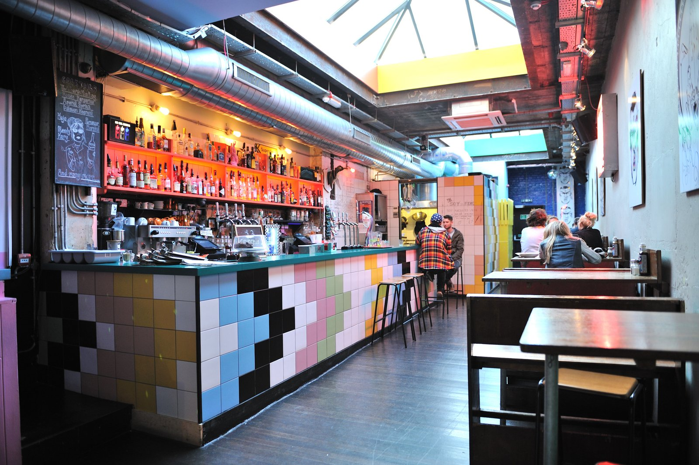

### Ginger's Big Drag Brunch, Liverpool Street

<!-- evidence: Ginger's Big Drag Brunch -->
*££ · City · Balls Brothers, 10–11 Austin Friars, EC2N · Cited by 2 sources · [book](https://www.designmynight.com/london/whats-on/daytime/gingers-big-drag-bottomless-brunch)*

Ms Ginger Phlappage and her drag squad run games, quizzes and dance numbers **every Saturday from 1pm to 4pm**, five minutes from Liverpool Street. The ticket is two courses with 90 minutes of bottomless Prosecco, mimosas or bellinis, **£53.94 upstairs or £59.34 downstairs**; dessert is vanilla cheesecake or a chocolate pot. It is over-18s only. Saturdays sell out, and groups of ten or more should email to avoid booking fees. If you are planning a hen party, [our hen do guide](/articles/hen-do-london/) prices the alternatives.

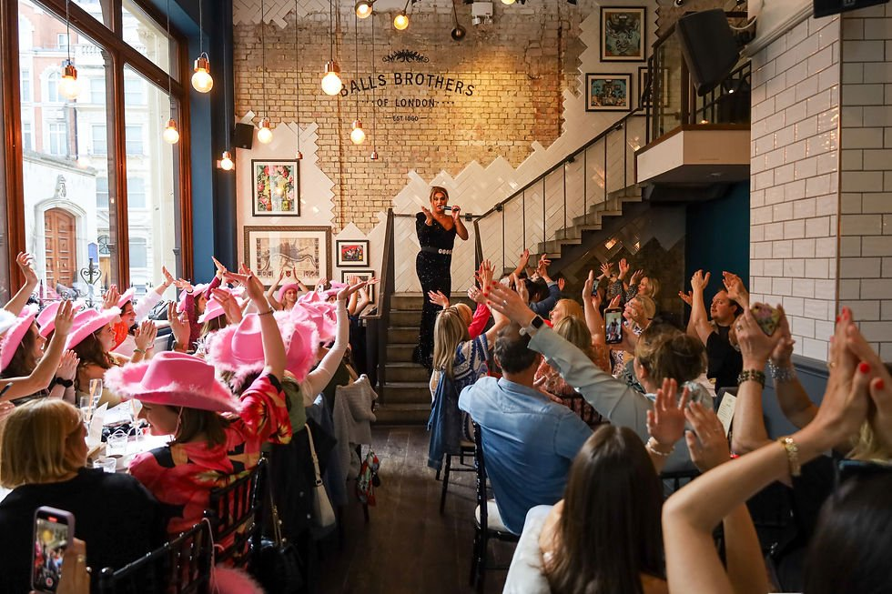

### Queen of Hoxton, Shoreditch

*££ · Shoreditch · 1–5 Curtain Road, EC2A · Cited by 2 sources · [book](https://www.designmynight.com/london/bars/shoreditch/queen-of-hoxton/drag-bingo-bottomless-brunch)*

A drag bingo brunch across three floors of a Shoreditch bar with a rooftop, **every Saturday from 2pm to 6pm**, with drag hosts, bingo, games and bottomless bubbles or mimosa cocktails from £43.20. A later drag and disco day party, from 4.30pm, is £5.50 entry without the brunch. It is 18+, with no hoodies, trainers or sportswear. [Our bottomless brunch guide](/articles/bottomless-brunch-london/) compares it with the brunches that come without a show.

### Soul Mama's House Gospel Choir brunch, Islington

*££ · Angel · Angel Central, 21 Parkfield Street, N1 · [its brunches](https://www.soulmama.co.uk/brunches)*

The House Gospel Choir performs at Soul Mama in Angel Central on selected Sundays, with **two sittings, noon to 2.30pm and 3pm to 5.30pm**. The dates on sale are **11 October, 8 November, 13 December and 20 December 2026**. Soul Mama runs other themed brunches on Saturdays, from soca to Afrobeats, so check you are booking the choir.

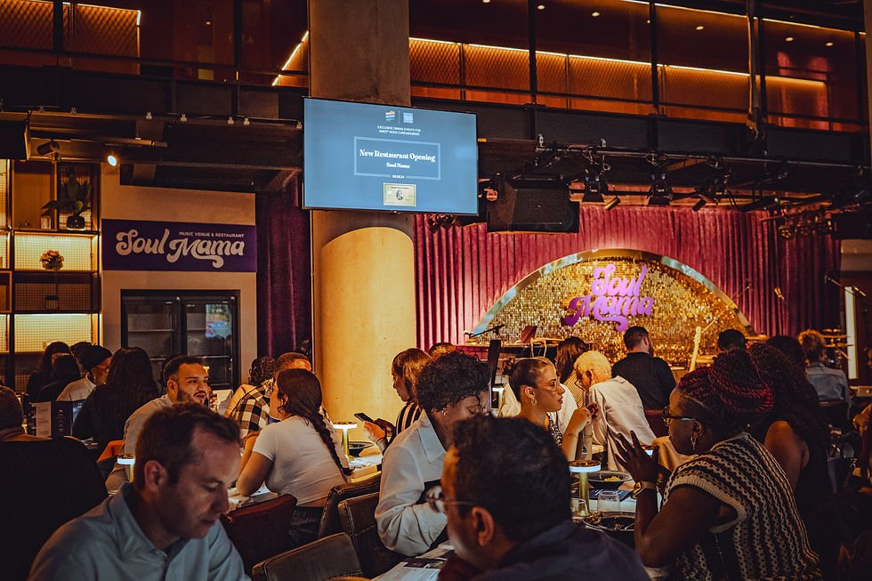

### Amazing Grace, London Bridge

*££ · London Bridge · St Thomas's Church, 9a St Thomas Street, SE1 · Cited by 3 sources · [its site](https://amazinggraceldn.com/london-bridge/)*

A bar and restaurant inside a Grade II-listed former church. Its brunch is not a gospel brunch: the weekend **Born Again Brunch, Saturday and Sunday from noon to 4pm**, is a two-course set menu with bottomless drinks and **live acoustic sets from 2pm to 4pm**, from £22 on a Saturday. The Canary Wharf branch runs its own Saturday brunch with live entertainment. It is 18+ and casual.

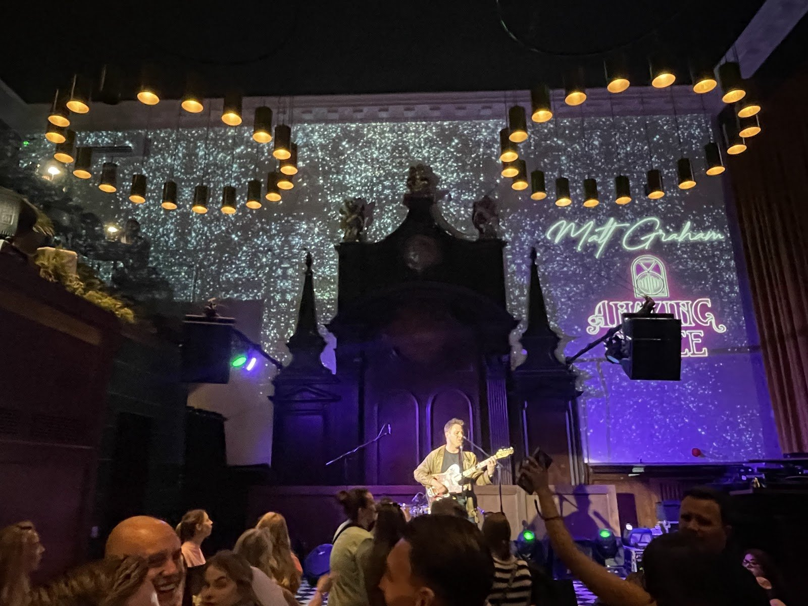

### Sunday lunch and weekend jazz

| Where | Area | Price | When, and what it costs |
| --- | --- | --- | --- |
| **[606 Club](https://www.606club.co.uk/times-prices/)** | Chelsea | ££ | Sunday lunch, doors 12.30pm, music 1.30 to 3.30pm; £16 music charge plus à la carte |
| **[J Sheekey](https://j-sheekey.co.uk/live-music/)** | Covent Garden | £££ | A jazz duo every Sunday, noon to 4pm, over the full seafood menu: fish pie, Dover sole, Cornish fish stew; £2 cover plus 13.5% service |
| **[Brasserie Zédel](https://www.brasseriezedel.com/late-night-music/)** | Piccadilly | £ | The house band at lunch on Saturdays and Sundays, 12.30 to 3.30pm, with no charge |
| **[Boisdale](https://boisdaletickets.co.uk/calendar)** | Belgravia and Canary Wharf | ££ | Sunday jazz lunch in Belgravia; Saturday and Sunday lunch-and-show sittings at Canary Wharf, from £39.50 for two courses |
| **[Plaquemine Lock](https://plaqlock.com/live-music-islington/)** | Angel | — | Jazz or brass at Saturday and Sunday brunch from about 12.30pm |
| **[The Blues Kitchen Shoreditch](https://www.designmynight.com/london/bars/shoreditch/blues-kitchen-shoreditch/hip-hop-orchestra-brunch?t=tickets)** | Shoreditch | £ | An eight-piece hip-hop orchestra every Saturday, 1 to 5pm; tickets from £15, bottomless drinks £19.95 extra |
| **[Quaglino's](https://quaglinos-restaurant.co.uk/whats-on/live-music/)** | St James's | ££ | A five-piece band at Saturday brunch from 1.15pm; adults only |
| **[Café Bohème](https://www.cafeboheme.co.uk/live-music)** | Soho | £ | Live music every afternoon, 4 to 6.30pm Monday to Wednesday and 3 to 5.30pm Thursday to Sunday; card only, no under-18s after 9.30pm |

---

## On the river

### City Cruises, Westminster Pier

*££ · Westminster · Westminster Pier, SW1A · [its site](https://www.cityexperiences.com/london/city-cruises/)*

City Cruises runs the Thames dinner sailings from Westminster Pier. Its **dinner cruise** sails nightly at 7.45pm for three hours, three British courses with live singers and dancing, from £99 in late September 2026; a VIP upgrade adds Champagne, front seats, canapés and a cheeseboard. Its **jazz dinner cruise** puts a jazz band on the same route over three courses, on selected dates, not nightly, at £119 in late September 2026. The **murder mystery dinner cruise**, with actors running a whodunnit at your table, leaves from **Tower Millennium Pier, not Westminster**, and has one date on sale, 31 October. All three are for ages 13 and over.

GetYourGuide sells a <a href="https://www.getyourguide.com/activity/-t5275?partner_id=WWP7I0R&amp;cmp=dinner-and-a-show-london" target="_blank" rel="sponsored nofollow noopener" data-affiliate="gyg">three-hour Thames dinner cruise with a live performance and dancing</a> from £81. [Our Thames cruises guide](/articles/thames-river-cruises-london/) compares every sailing, including the cheaper lunch cruise that passes the same landmarks.

Powered by <a target="_blank" rel="sponsored" href="https://www.getyourguide.com/london-l57/">GetYourGuide</a>

---

## What to know before you book

* **Check whether the music is on the bill.** Toulouse Lautrec (£5–£7), Oriole (£4–£12), Mu (£8, optional), The Parlour (£20 off the set menu), The Piano Works (£5 at 7.30pm) and the 606 Club (£16–£23) all add it at the end. Zédel, Quaglino's, Dishoom Kensington and The Blues Kitchen do not.
* **A dinner booking is not always a show booking.** At Boisdale the restaurant and the music are separate tickets; at Crazy Coqs the show and Brasserie Zédel's dinner are separate; at the Kit Kat Club, food is cleared before the curtain.
* **The cheapest tier may have no food in it.** The London Cabaret Club's Silver and 58th Street's experience-only tickets are the show without dinner.
* **Age limits vary widely.** Jazz Cafe, INCA, The Maine, The Piano Works and the drag brunches are 18+. Sarastro is over-14s from 7pm Thursday to Saturday, Boisdale's evening music 13+, the Thames cruises 13+. The London Cabaret Club takes children from 7, Mamma Mia! The Party and The Murdér Express from 5.
* **Keep quiet in the jazz clubs.** Ronnie Scott's and the PizzaExpress rooms are listening rooms. For somewhere you can talk over the music, choose a restaurant from the second section.
* **Dress up for the shows.** 58th Street asks for "1930s luxe", The London Cabaret Club for "smart elegance", INCA and The Maine for "smart elegant". The jazz clubs are smart casual, and the 606 turns away shorts.
* **November is jazz month.** The EFG London Jazz Festival runs 13 to 22 November 2026; [our festival guide](/articles/london-jazz-festival/) has what is on where.

For a pre-theatre meal before a separate show, [our theatre guide](/articles/london-theatre-guide/) has the timings. For a celebration where the room counts for more than the entertainment, try [our special occasion restaurants](/articles/special-occasion-restaurants-london/), and for rooms where the building is the show, [London's most unusual restaurants](/articles/unusual-restaurants-london/).

---

## Continue planning your London trip

- 🍽️ **[Eat in London: Restaurants, Food Markets & Quick Bites](/articles/eat-in-london-guide/)**
- 🎭 **[The Best Cabaret in London](/articles/best-cabaret-london/)**
- 🎪 **[The Best Immersive Experiences in London](/articles/immersive-experiences-london/)**
- 🎷 **[The Best Live Music Venues in London](/articles/best-live-music-venues-london/)**
- 🎤 **[The Best Comedy Clubs in London](/articles/best-comedy-clubs-london/)**
- 🥂 **[Bottomless Brunch in London](/articles/bottomless-brunch-london/)**
- 🥳 **[Special Occasion Restaurants in London](/articles/special-occasion-restaurants-london/)**
- ⛴️ **[Thames River Cruises](/articles/thames-river-cruises-london/)**
- 🗺️ **[The Soho Area Guide](/articles/soho-area-guide/)**
