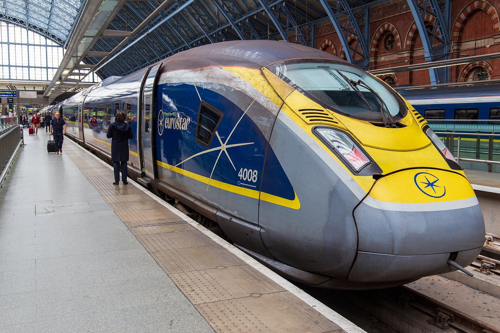
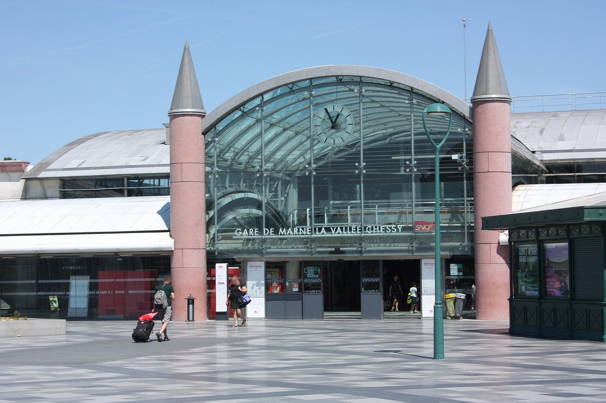

**There is no direct train from London to Disneyland Paris. Eurostar sells one ticket with a change at Lille Europe; the alternative is Eurostar to Paris Gare du Nord and about an hour on the RER, and for a day trip the second is the one that works.** On the fares Eurostar was showing for Tuesday 10 November, the Paris route with the 06:01 reached the gates at about 10:30 for roughly £103 return in Standard. The single ticket via Lille arrived at 12:09 at the earliest and cost about £201.

This guide starts at St Pancras rather than in Paris: the two routes, what each leaves you at the park, the cost of the whole trip so you can set it against a package, and when a night is the better plan.

> 💡 **The Short Version:** **No direct train.** Eurostar's **through ticket via Lille Europe** is one booking and Eurostar quotes **2h59** at best, but the four departures on Tuesday 10 November took **3h to 4h05** and cost **£82 to £170** one way in Standard. **Eurostar to Gare du Nord, then the RER B and A**, takes about **an hour** from the Paris station to **Marne-la-Vallée–Chessy**, a **2-minute walk** from the gates, on a **€2.55** ticket. On that Tuesday the lowest Standard fares to Paris were **£53 out and £49.50 back**. **A day trip works by way of Paris**: the 06:01 puts you at the gates about **10:30**, and the 21:02 home leaves you about **7 hours 45 minutes** in the park; via Lille it is about **6 hours**, and on a **Sunday** there is no through train before 11:04. **Book a park ticket with a date on it**: Disneyland Paris does not sell at the gate except for cash, vouchers or gift cards, and only while the parks have room. **Or book a package or ticket instead** — the <a href="https://www.getyourguide.com/activity/-t395320?partner_id=WWP7I0R&amp;cmp=disneyland-paris-from-london" target="_blank" rel="sponsored nofollow noopener" data-affiliate="gyg">GetYourGuide 1-day ticket</a> is from **£45** and cancellable up to 3 days ahead, and Disney's own Eurostar packages bundle train, hotel and tickets, which saves you working out the connection and the three bookings. **Both parks in one day is a squeeze**; Disney's own advice for a first visit is two days.

## Two Eurostar routes to the gates

**Route 1: the through ticket via Lille.** One booking on [Eurostar's London to Disneyland Paris page](https://www.eurostar.com/uk-en/train/london-to-disneyland-paris) takes you from St Pancras to Lille Europe on a direct Eurostar (1h22), then onto a TGV to Marne-la-Vallée–Chessy (a little over an hour). Eurostar puts the fastest journey at 2 hours 59 minutes and sells through tickets up to 180 days before the return date. These are the departures and lowest Standard fares on its booking engine on 30 September for Tuesday 10 November, with arrival times in French time:

| Leave St Pancras | Reach Chessy | Journey | Standard, lowest fare |
| --- | --- | --- | --- |
| 07:04 | 12:09 | 4h05 | £82 |
| 11:04 | 15:09 | 3h05 | £170 |
| 13:01 | 17:01 | 3h00 | £125 |
| 15:04 | 20:09 | 4h05 | £115 |

Coming back on the same date there were six departures from Chessy, from 08:58 to 18:50, with Standard from £69 to £119; the 18:50 reaches St Pancras at 21:57. Saturday 14 November had the same 07:04 out and an 18:50 back reaching London at 21:27. On Sunday 15 November the first through train from London was the 11:04.

At Lille Europe, platforms are normally shown 20 minutes before departure and the TGV doors close 2 minutes before it leaves. If you miss the connection, Eurostar says you can take the next available train at no extra cost.

*A Eurostar at St Pancras. Photo: Bailey Amiss, [CC BY-SA 4.0](https://creativecommons.org/licenses/by-sa/4.0/), via [Wikimedia Commons](https://commons.wikimedia.org/wiki/File:374008_at_St_Pancras_2026-06-11.jpg).*

**Route 2: Eurostar to Paris, then the RER.** Take a direct Eurostar to Gare du Nord (2h28 or 2h29; [the Paris guide](/articles/paris-day-trip/) has the check-in rules and how fares climb towards the day). [Disneyland Paris's directions](https://www.disneylandparis.com/en-gb/guest-services/how-to-get-to-disneyland-paris) from Gare du Nord are the RER B to Châtelet–Les Halles, then the RER A to Marne-la-Vallée–Chessy, about an hour in total. The fare is a €2.55 Ticket Métro-Train-RER, valid across Île-de-France (Île-de-France Mobilités, 30 September), on your phone or a Navigo Easy pass, and a change between RER lines within two hours needs no second ticket.

The Eurostar fares are the difference. The lowest Standard fare on Tuesday 10 November was £53 to Paris and £49.50 coming back. Across November the lowest outbound fare ran from £53 to £180 and the inbound from £49.50 to £115.50; across October the outbound ran from £90 to £264, the top on 24 and 25 October. These are the lowest seats of each day, not necessarily the train you want at the hour you want.

At Chessy the station is a 2-minute walk from the gates of Disneyland Park, Disney Adventure World and Disney Village, and a free shuttle links it with the Disney hotels.

*Marne-la-Vallée–Chessy station. Photo: Sneeuwvlakte, [CC BY-SA 4.0](https://creativecommons.org/licenses/by-sa/4.0/), via [Wikimedia Commons](https://commons.wikimedia.org/wiki/File:Gare_de_Marne-la-Vall%C3%A9e_-_Chessy_(2026-08-02)-14.jpg).*

## Tickets, or a package instead

If you would rather not build the trip yourself, there are three ways to hand part of it to someone else:

- **From £45** — <a href="https://www.getyourguide.com/activity/-t395320?partner_id=WWP7I0R&amp;cmp=disneyland-paris-from-london" target="_blank" rel="sponsored nofollow noopener" data-affiliate="gyg">Disneyland Paris 1-day ticket, one or two parks</a>: a mobile ticket, free cancellation up to 3 days ahead, rated 4.6 from 59,155 reviews. That is GetYourGuide's starting price for one adult on 30 September; the widget below shows the price for your date.
- **From £125** — <a href="https://www.getyourguide.com/activity/-t395319?partner_id=WWP7I0R&amp;cmp=disneyland-paris-from-london" target="_blank" rel="sponsored nofollow noopener" data-affiliate="gyg">Disneyland Paris 2, 3 or 4-day ticket</a>, both parks, rated 4.6 from 6,266 reviews.
- **Train, hotel and tickets together.** Disney's Walt Disney Travel Company packages send Eurostar to Lille Europe and on to Chessy, and Eurostar's partner MagicBreaks sells park tickets, hotel and train in one booking. Eurostar's own page pitches its train-and-hotel package as a way to save on your stay. What you save is the RER change, three separate bookings and, if you stay at a Disney hotel, carrying your bags: the paid Disney Express service takes them from a counter at the station to your room.

Powered by <a target="_blank" rel="sponsored" href="https://www.getyourguide.com/london-l57/">GetYourGuide</a>

Disney runs a price match: book on its site and if you find the same ticket cheaper within 24 hours, for the same parks, dates and guests, it refunds the difference. Compare its price for your date with the one above before you pay.

## A day trip, or a night?

Three plans from a Tuesday, with the hours before any queue. The Paris plans leave the park at about 18:25 to be at Gare du Nord 75 minutes before the 21:02 (Eurostar's advice for Standard, in the [Paris guide](/articles/paris-day-trip/)); the Lille plan leaves about 18:15 for the 18:50.

| Plan | Eurostar from St Pancras | At the gates | In the park | Travel cost, one adult |
| --- | --- | --- | --- | --- |
| **Paris, early start** | 06:01, home on the 21:02 | About 10:30 | About 7h45 | £103 plus €5.10 RER |
| **Paris, later start** | 07:01, home on the 21:02 | About 11:30 | About 7h | £103 plus €5.10 RER |
| **Lille through ticket** | 07:04, home on the 18:50 | About 12:15 | About 6h | £201 |

The 21:02 is the last Eurostar from Gare du Nord on that Tuesday; the last was 20:02 on Saturday 14 November and 20:58 on Sunday 15 November. Disney publishes the park's hours by date, so set the train home by them.

**A day trip is realistic by way of Paris, and it is a long one.** For the 06:01 you need to be inside St Pancras by about 04:45, before the first Tube, so a room at King's Cross is part of the cost: [where to stay in King's Cross and St Pancras](/articles/where-to-stay-kings-cross/) covers it. The through ticket costs twice as much and leaves less time.

**Stay a night** if you take the through ticket, if you travel on a Sunday, or if you want both parks. Disney recommends two days for a first visit, and calls a single day a first taste, best with a plan built around one night-time show.

Powered by <a target="_blank" rel="sponsored" href="https://www.getyourguide.com/london-l57/">GetYourGuide</a>

## Park tickets

> ⚠️ **An undated ticket is not a way in.** Disneyland Paris sells tickets at the gate only for cash, holiday vouchers or gift cards, and only while the parks are below capacity; without a ticket bought in advance you can be turned away. A ticket with no date printed on it must have a visit date [registered online](https://www.disneylandparis.com/en-gb/register-tickets) first, subject to capacity. Buy a dated ticket, or register before you leave London.

At the gate, on 30 September, [Disneyland Paris's](https://tickets.disneylandparis.com/en-gb/tickets) standard prices for an adult (a child aged 3 to 11 pays €10 to €40 less) were:

| Ticket | Adult |
| --- | --- |
| 1 day, 1 park | €139 |
| 1 day, 2 parks | €174 |
| 2 days, 2 parks | €347 |
| 3 days, 2 parks | €521 |
| 4 days, 2 parks | €695 |

Visits that include 14 July, 31 October or 31 December cost more. Children under 3 go free. Tickets bought online are priced by date, and Disney's [price estimate calendar](https://www.disneylandparis.com/en-gb/price-estimate-calendar-disneyland-paris) lets you compare dates before you choose. A dated ticket can be cancelled and refunded up to 3 days before the visit, and the parks are Disneyland Park, with the castle, and Disney Adventure World. The <a href="https://www.getyourguide.com/activity/-t395320?partner_id=WWP7I0R&amp;cmp=disneyland-paris-from-london" target="_blank" rel="sponsored nofollow noopener" data-affiliate="gyg">GetYourGuide ticket</a> is dated too: you pick the day in the widget above. The second park costs €35 more at the gate.

## Staying the night

Disney's hotels stand within a walk of the parks, and a free shuttle runs every 15 to 20 minutes from 06:30 to 23:45, until 1:00 in summer. Guests get Extra Magic Time, entry before the official opening, and need no advance date registration. You can check in any time on the day you arrive and leave bags until the room is ready from 3pm; check-out is before 11:00. Disney's partner hotels are 10 to 20 minutes from the parks by the same free shuttle.

- **[Disneyland Hotel](hotelscom:230008)** — a five-star hotel at the entrance to Disneyland Park.
- **[Disney Hotel New York – The Art of Marvel](hotelscom:230033)** — a 10-minute walk from the parks, or 8 minutes on the shuttle.
- **[Disney Newport Bay Club](hotelscom:230007)** — a 1900s-style coastal mansion beside Lake Disney, a 15-minute walk from the parks.
- **[Disney Hotel Cheyenne](hotelscom:230011)** — a 20-minute walk, or an 8-minute shuttle ride.
- **[Hôtel L'Élysée Val d'Europe](hotelscom:212020)** — a partner hotel near the Val d'Europe shopping centre and RER stop, 10 to 20 minutes from the parks on the free shuttle.
- **[Aparthotel Adagio Val d'Europe](hotelscom:413241)** — a partner aparthotel in the same area, with the same free shuttle to the parks.

## By air or by car

Disneyland Paris lists Charles de Gaulle, Orly and Beauvais as the airports for the park. From Charles de Gaulle or Orly its Magical Shuttle coach runs to the parks and the Disney hotels in about 45 minutes. A flight adds airport check-in and security at the London end and a coach at the other; the train runs from a central London station to the gates.

By car, Disney's figures are LeShuttle from Folkestone to Calais in about 35 minutes then about 3.5 hours' drive, or the Dover to Calais ferry in about 1.5 hours and the same drive. Parking is free at the Disney hotels and in the parks for guests staying in them, and paid for everyone else.

## Passport and border

The passport and border rules are the same as for Paris: your passport must be issued within 10 years and valid for 3 months after you leave, and the exit and entry checks happen at St Pancras before you board. [The Paris guide](/articles/paris-day-trip/) has them in full. Eurostar also asks you to complete your Advance Passenger Information well before you travel. Eurostar lists free travel for children under four.

## Inside the gates

There are two parks side by side, and a 1-day ticket covers one or both. Disney's advice for one day is to write a short list of must-do rides in its app and plan the day around one night-time show. Opening hours change with the date, so read [Disney's park hours calendar](https://www.disneylandparis.com/en-gb/calendars/park-hours) for your day.

Powered by <a target="_blank" rel="sponsored" href="https://www.getyourguide.com/london-l57/">GetYourGuide</a>

## What people get wrong

- **Buying the through ticket for a day trip.** It costs about twice the Paris route on the dates above and arrives after noon.
- **Booking an undated ticket and not registering it.** Nothing is sold at the gate except for cash, vouchers or gift cards, and only while the parks have room.
- **Planning a Sunday day trip on the through ticket.** The first train from London on 15 November was 11:04, arriving 15:09.
- **Forgetting the hour on the RER.** The last Eurostar leaves Gare du Nord at 21:02 on that Tuesday, but you need to be at the station 75 minutes before it.
- **Assuming the Paris fare is fixed.** The lowest Standard fare to Paris was £53 on 10 November and £264 on 24 October.
- **Trying both parks in one day.** Disney recommends two days for a first visit.

*Fares, times and prices checked on 30 September 2026.*

## Continue planning your trip

- 🇫🇷 **[Paris day trip](/articles/paris-day-trip/)** — the Eurostar fares, the border checks and what to do in the city if you have a day rather than a park.
- 🗺️ **[Day trips from London](/articles/day-trips-from-london/)** — what the others cost, how long they take, and which days they are shut.
- 🛏️ **[Where to stay in King's Cross and St Pancras](/articles/where-to-stay-kings-cross/)** — a room you can walk from for a 06:01 train.
- 🇧🇪 **[Brussels day trip](/articles/brussels-day-trip/)** — a shorter Eurostar than Paris, and more hours in the city for the same early start.
- 🍫 **[Bruges from London](/articles/bruges-day-trip/)** — another Eurostar day trip, with a change at Brussels-Midi onto a Belgian train.
- 🇳🇱 **[Amsterdam from London](/articles/amsterdam-from-london/)** — the longer Eurostar, and the case for a night over a day.
