London hotels that take dogs differ more than the label suggests. The fee runs from nothing to £100 a stay and the weight limit from 9kg to none, and some hotels let the dog into every restaurant and bar while others keep it in the bedroom.

The rule most of them share is the one that shapes the trip: **you cannot leave the dog alone in the room.**

> 💡 **The Short Version:** **[Rosewood London](hotel:rosewood-london)** and **[Kimpton Fitzroy London](hotel:kimpton-fitzroy-london)** charge nothing, and Rosewood lets pets into every restaurant and bar. For a Royal Park on the doorstep, **[Mandarin Oriental Hyde Park](hotel:mandarin-oriental-hyde-park)** is two minutes from Hyde Park and **[Royal Lancaster London](hotel:royal-lancaster-london)**, at £25 a pet per day, three minutes from Kensington Gardens. On a budget, **[Travelodge](https://www.travelodge.co.uk/about/pet-friendly-hotels/)** takes pets in every room for a cleaning fee, while **Premier Inn and hub take none**. Most of these hotels forbid leaving a dog alone in the room, so plan museums and dinners around it, or book the hotel's sitter.

| Hotel | Area | Fee | Limits | The catch |
| --- | --- | --- | --- | --- |
| **Rosewood London** | Holborn | Free | Cats and dogs; no weight limit published | Pets stay out of the spa and gym |
| **Kimpton Fitzroy** | Bloomsbury | Free, no deposit | 35kg | Kimpton's brand page says no limit; the hotel's FAQ says 35kg |
| **Treehouse** | Oxford Circus | Free | None published | Not in dining areas, never left alone |
| **South Place** | City | Free, booked direct | None published | Free only when you book with the hotel |
| **Bermondsey Square** | Bermondsey | £20 a night per pet | None published | Superior, Family and Terrace rooms only |
| **Royal Lancaster** | Lancaster Gate | £25 a pet per day | Cats and other pets on request | Not in its three restaurants |
| **Dog & Fox** | Wimbledon | £25 a night, one or two dogs | Two dogs | Zone 3; no dogs on the beds |
| **The Stafford** | St James's | £35 a pet per day | 15kg | Bedroom only: no bars or restaurants |
| **Sea Containers** | South Bank | £35 a stay, £100 deposit | 9kg; not the Cabin Suites | The lowest weight limit here |
| **Red Carnation's five** | Victoria, Bloomsbury, Kensington, Mayfair, Knightsbridge | £50 a night | One to three dogs, by room | A £500 damage deposit at four of the five |
| **Bankside Hotel** | Bankside | £75 supplement | Two dogs | Pet-friendly rooms only |
| **The Langham** | Regent Street | £100 per dog per stay | One dog, 20kg | Allowed in only two of its restaurants and bars |
| **Mandarin Oriental Hyde Park** | Knightsbridge | Not published | Two under 10kg or one under 20kg; cats too | Not in Dinner by Heston or the spa |
| **The Beaumont** | Mayfair | Not published | None published | Ask the fee when you book |
| **Wilde aparthotels** | Four London sites | £20 a night plus £50 clean | One dog, 20kg | Seven-night minimum stay |
| **Travelodge** | Across London | Cleaning fee per pet, per booking | Two pets | Not in the Bar Café |
| **ibis London Blackfriars** | Southwark | Not published | None published | Accor sets pet rules hotel by hotel |

## The rules that decide the trip

**Leaving the dog in the room.** Most of these hotels forbid it in writing. The exceptions: The Langham allows it while you eat in one of its restaurants or bars, if you have told the hotel. Egerton House asks only that dogs are not left "for extended periods". Wilde lets you leave a dog that is comfortable, crated if necessary, but never at night. Otherwise a day out without the dog needs a sitter, which Kimpton Fitzroy, Royal Lancaster, The Chesterfield, The Rubens, Egerton House and Treehouse all arrange.

**Where the dog can eat with you.** Rosewood, The Beaumont, Bankside Hotel and South Place let dogs into every bar and restaurant. The Langham, Mandarin Oriental, Royal Lancaster, Sea Containers, Egerton House and Bermondsey Square let them into some. The Stafford, The Milestone, Treehouse, Wilde and Travelodge keep them out of the dining rooms.

**Tell the hotel before you arrive.** Most need notice to assign a pet-friendly room: South Place asks you to email reservations after booking, Wilde and Staycity take dog bookings by phone only, and Travelodge adds the pet as an extra when you book on its site.

## Five-star

### Rosewood London: free, and welcome in every restaurant

*252 High Holborn, WC1V 7EN · Lincoln's Inn Fields, 5 min · Free*

**[Rosewood London](hotel:rosewood-london)** welcomes cats and dogs free of charge, and its [hotel policy](https://www.rosewoodhotels.com/en/london/hotel-policy) lets pets into every food and drink outlet in the building. Pets stay on a lead, out of the spa and fitness rooms, and the hotel asks you to keep barking to a minimum. Holborn is the station.

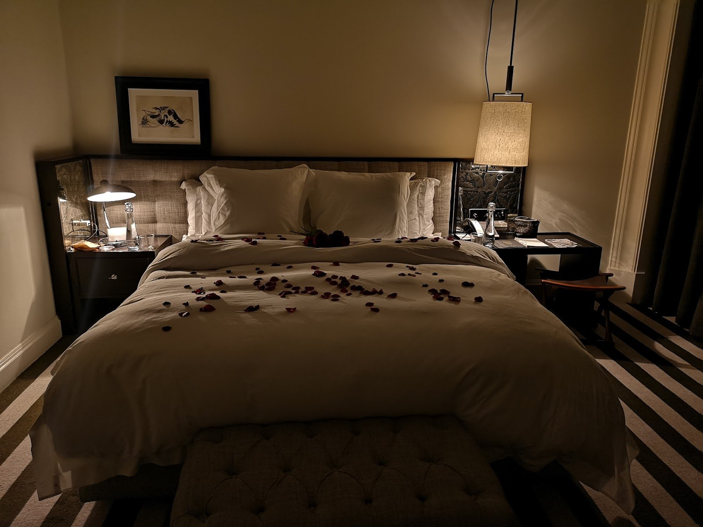

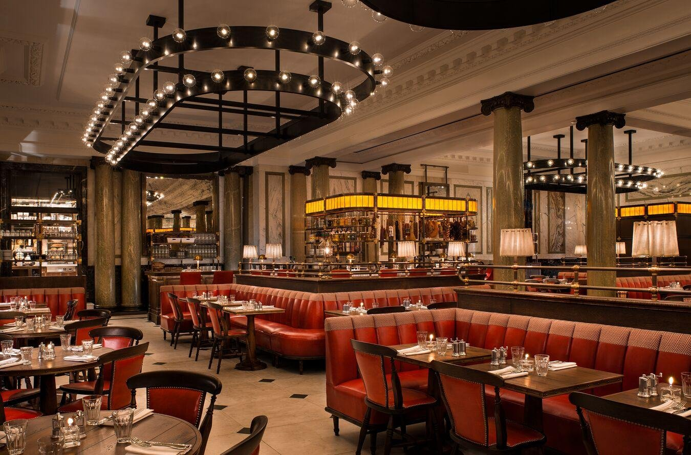

*A room and the bar at Rosewood London.*

### The Langham: two restaurants, and 20kg

*1c Portland Place, W1B 1JA · Regent's Park, 13 min · £100 per dog per stay*

**[The Langham](hotel:the-langham-london)** takes one dog per room or suite, up to 20kg, for [£100 per dog per stay](https://www.langhamhotels.com/en/the-langham/london/discover/family-experiences/). Dogs can come into The Wigmore and Sale e Pepe Mare but not the other restaurants, the Langham Club Lounge or the spa. It is the one hotel here that lets you leave the dog in the room while you dine downstairs, as long as you have told Langham Service.

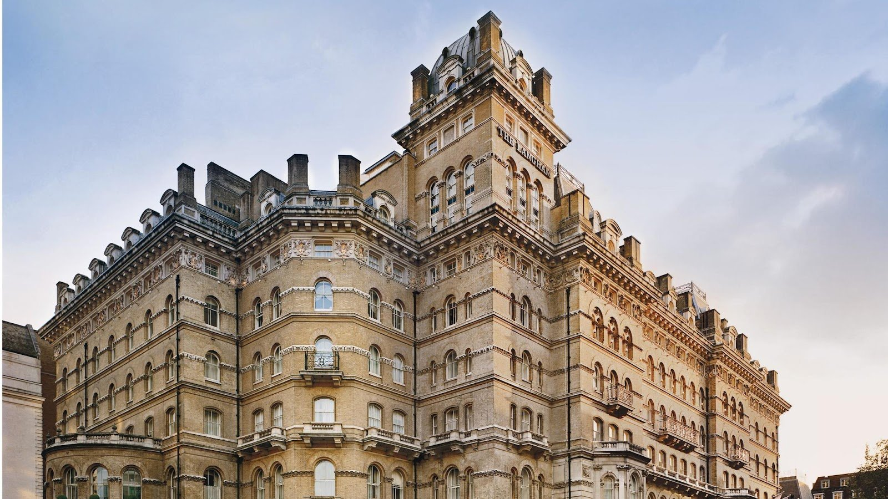

*The Langham, Portland Place.*

### Mandarin Oriental Hyde Park: two minutes from the park

*66 Knightsbridge, SW1X 7LA · Hyde Park, 2 min · Fee not published*

**[Mandarin Oriental Hyde Park](hotel:mandarin-oriental-hyde-park)** takes two dogs under 10kg or one under 20kg, and cats. Its [FAQ](https://www.mandarinoriental.com/en/london/hyde-park/about) lets pets into every public space except Dinner by Heston Blumenthal, the spa and the event rooms, and The Aubrey has a dog menu at brunch. Bowls are supplied, dogs stay on the lead indoors and are not left alone. Knightsbridge is the station.

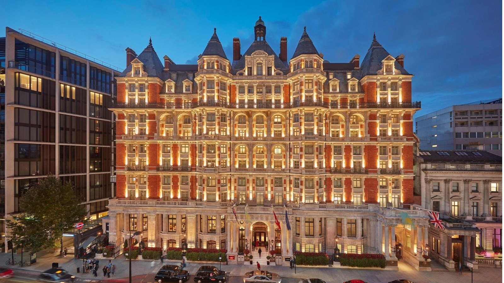

*Mandarin Oriental Hyde Park's facade and a suite.*

### The Beaumont: every outlet, fee on request

*8 Balderton Street, Brown Hart Gardens, W1K 6TF · Hyde Park, 8 min · Fee not published*

**[The Beaumont](hotel:the-beaumont-mayfair)** lets dogs into [every outlet of the hotel](https://thebeaumont.com/stay/dog-friendly-stays/), not only the rooms. Every room and suite has a dog bed, a drying coat, bowls and treats from Ruff and Tumble, and a pet concierge will point you to parks and groomers. The hotel publishes no fee or weight limit, so ask both when you book. Bond Street station is about five minutes away.

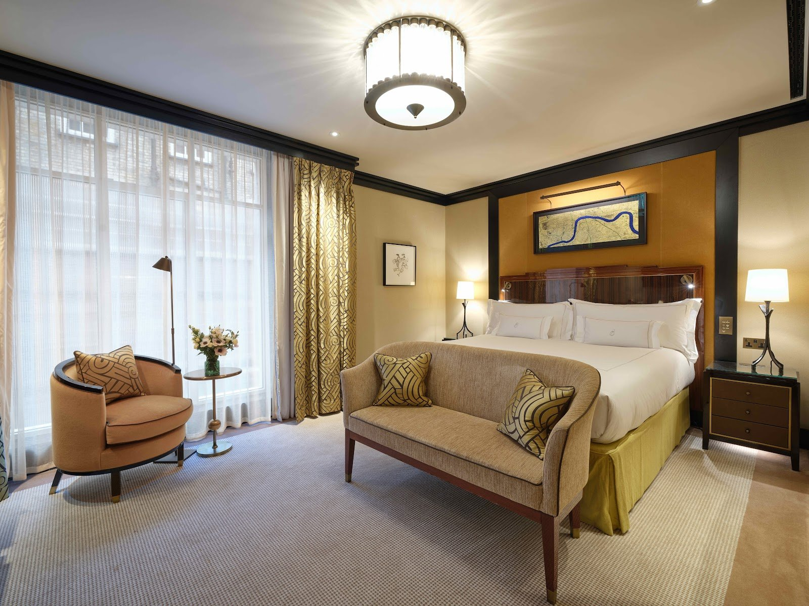

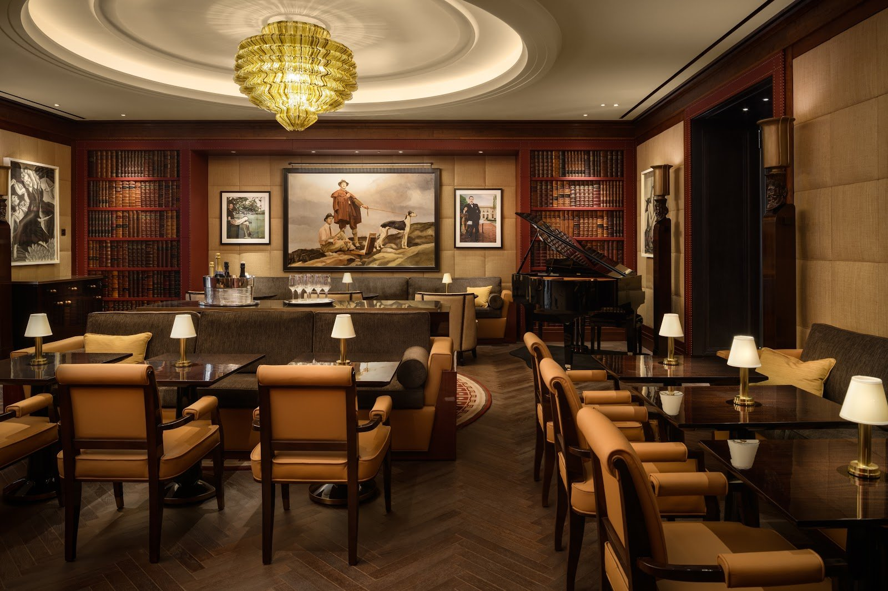

*A room and the bar at The Beaumont.*

### The Stafford: small dogs, bedroom only

*16–18 St James's Place, SW1A 1NJ · Green Park, 3 min · £35 per pet per day*

**[The Stafford](hotel:the-stafford-london)** takes dogs of 15kg or less at £35 per pet per day, [by its FAQ](https://thestaffordlondon.com/faqs/). They are restricted to the bedrooms, kept out of anywhere serving food or drink, and cannot be left alone in the room.

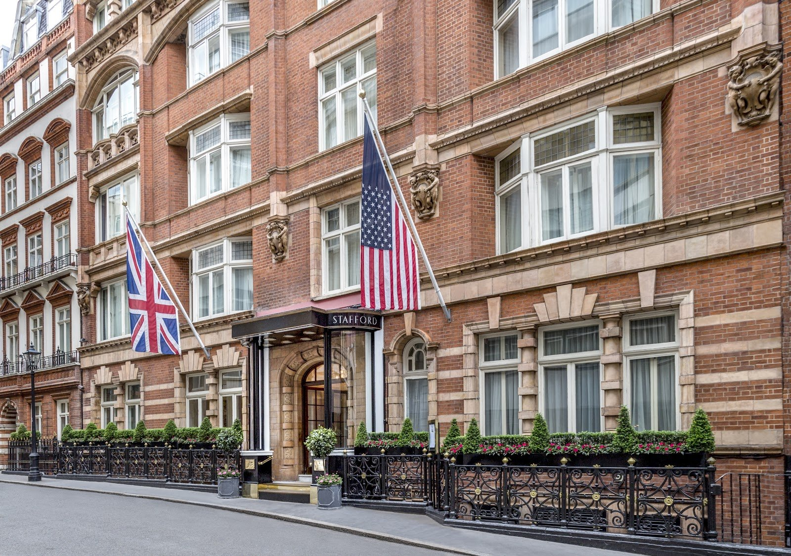

*The Stafford London's entrance.*

## Red Carnation's five: £50 a night

The Red Carnation group runs five London hotels on one pet policy: **£50 a night per room**, waived for service dogs, a **£500 damage deposit** held on arrival (The Chesterfield charges damage to your card instead), a lead of no more than 6ft outside the room, and no leaving the dog alone. What differs is the room and the restaurant.

### The Milestone, Kensington

*1 Kensington Court, W8 5DL · Kensington Gardens, 4 min*

**[The Milestone](hotel:the-milestone-hotel)** takes [cats as well as dogs](https://milestonehotel.com/about/pets): one small pet up to two medium ones, with large dogs in some rooms. **Pets are not allowed in any restaurant, bar or lounge.**

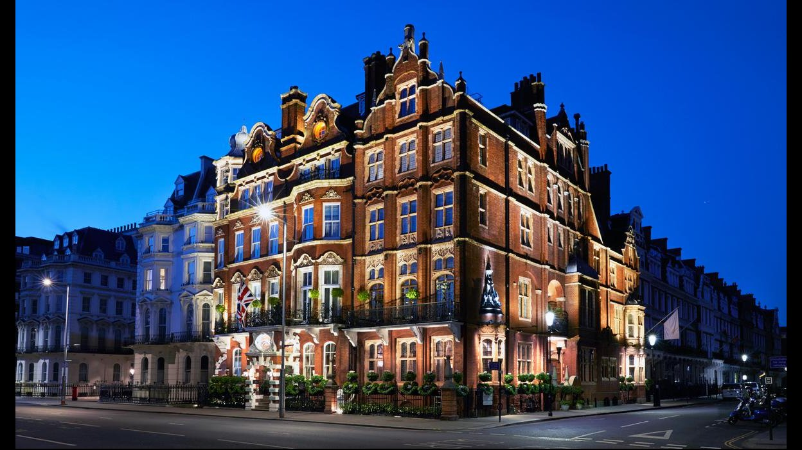

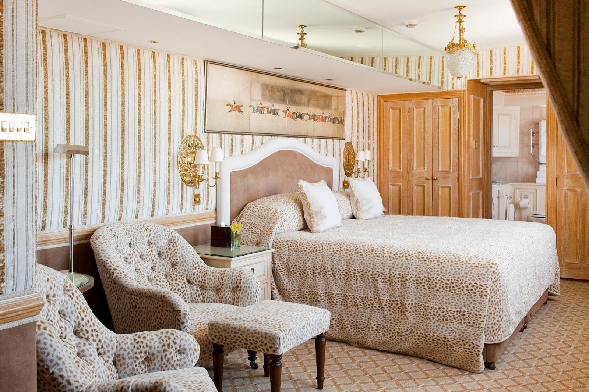

*The facade and a room at The Milestone.*

### The Egerton House Hotel, Knightsbridge

*17–19 Egerton Terrace, SW3 2BX · Hyde Park, 15 min*

**[The Egerton House Hotel](hotelscom:h49091)** is the one for a big dog: it names the Great Dane, and takes two large or medium dogs or three small ones per room. A bed, bathrobe, bowls, blankets, a toy and a welcome gift come in every room category. Breakfast and dinner with the dog are served in the ground-floor Drawing Room and bar, not the downstairs dining room. Grooming can be booked through Love My Human nearby.

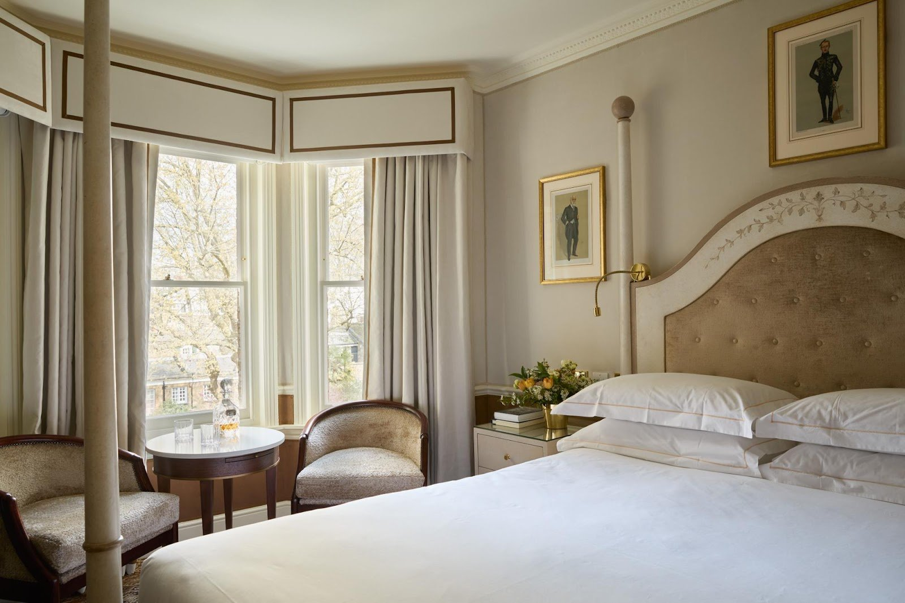

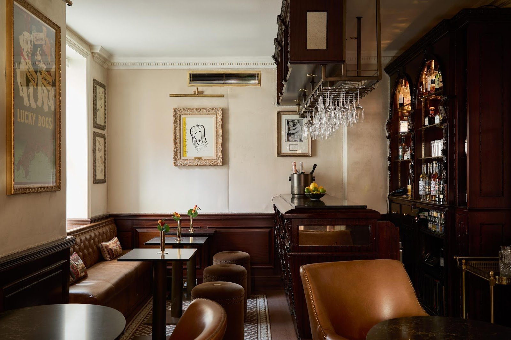

*A room and the bar at Egerton House.*

### The Chesterfield Mayfair

*35 Charles Street, W1J 5EB · Green Park, 4 min*

**[The Chesterfield Mayfair](hotelscom:h2276)** takes two small dogs or one medium or large one per room, and sometimes three small ones in an Executive Suite. It lists a **dog-walking service** as well as pet sitting, both bookable 48 hours ahead.

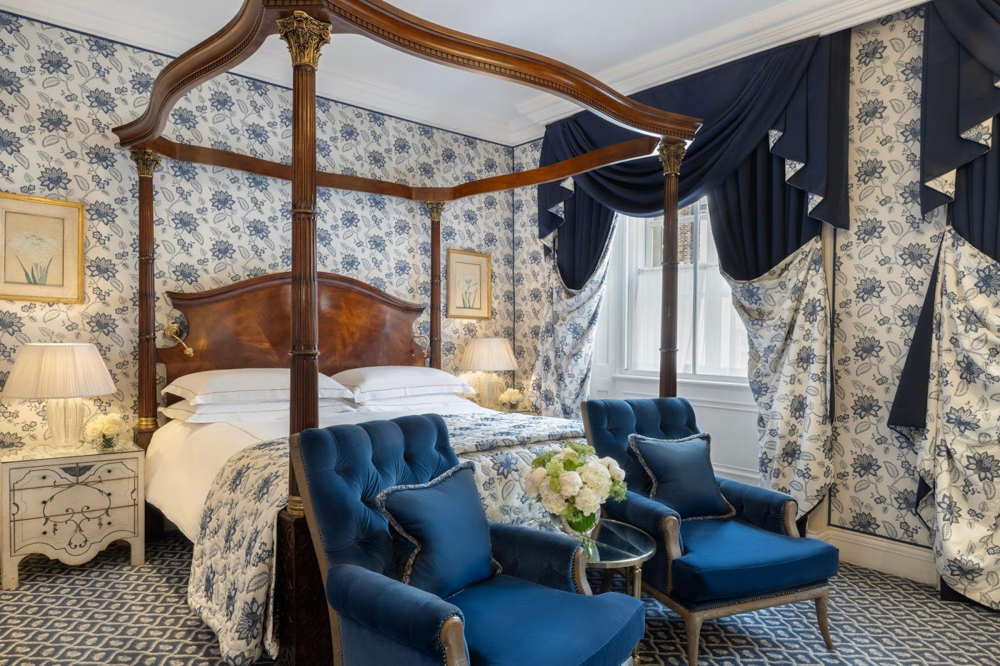

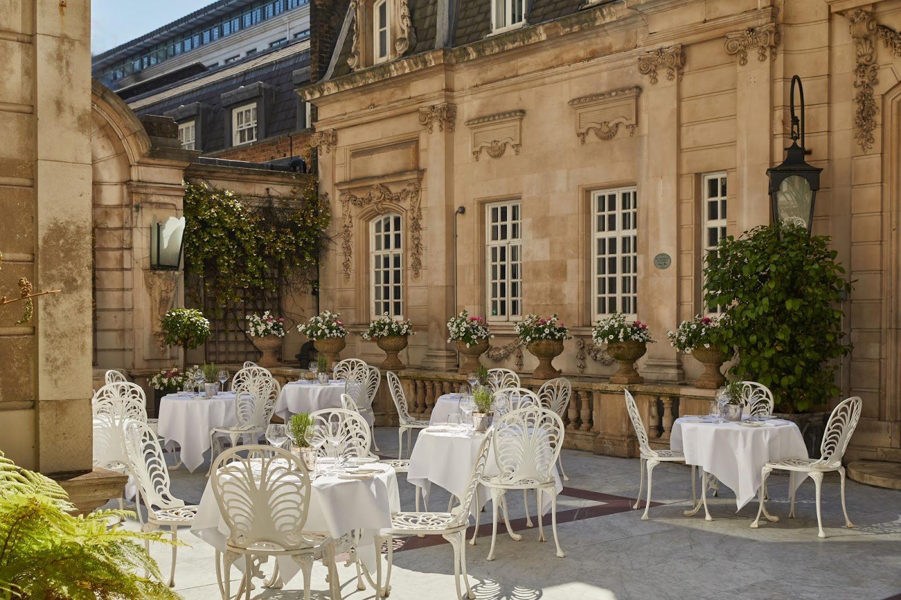

*A room and the terrace at The Chesterfield.*

### The Rubens at the Palace, Victoria

*39 Buckingham Palace Road, SW1W 0PS · St James's Park, 9 min*

**[The Rubens at the Palace](hotel:the-rubens-at-the-palace)** takes pets in [Superior King rooms and above](https://rubenshotel.com/about/pets): one or two large dogs or two or three small ones. Dogs can join you in the restaurants if you tell the restaurant team so they can seat you, and the pet menu uses Butternut Box. Pet sitting needs 24 hours' notice.

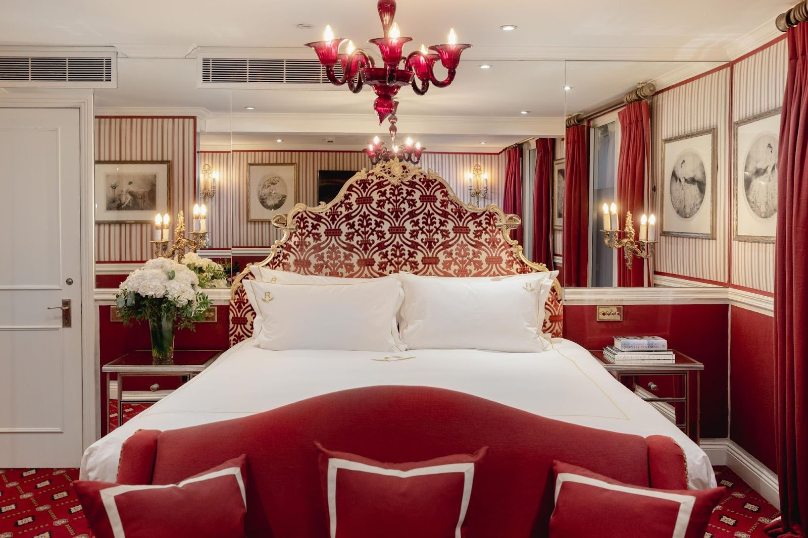

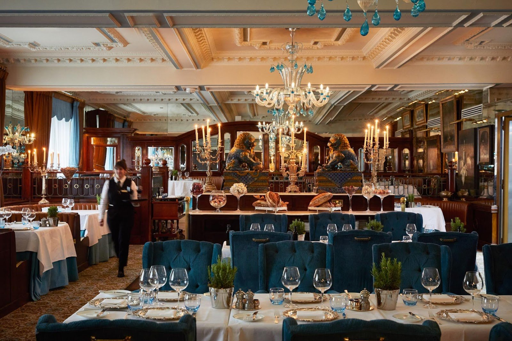

*A suite and the restaurant at The Rubens.*

### The Montague on the Gardens, Bloomsbury

*15 Montague Street, WC1B 5BJ · Russell Square, 2 min*

**[The Montague on the Gardens](hotel:montague-on-the-gardens)** has rooms that take one small or medium dog and others that take two of any size, [by its pets page](https://montaguehotel.com/about/pets). The restaurant team will seat you with your dog if told in advance, and the hotel will make up a pet bed from blankets on request.

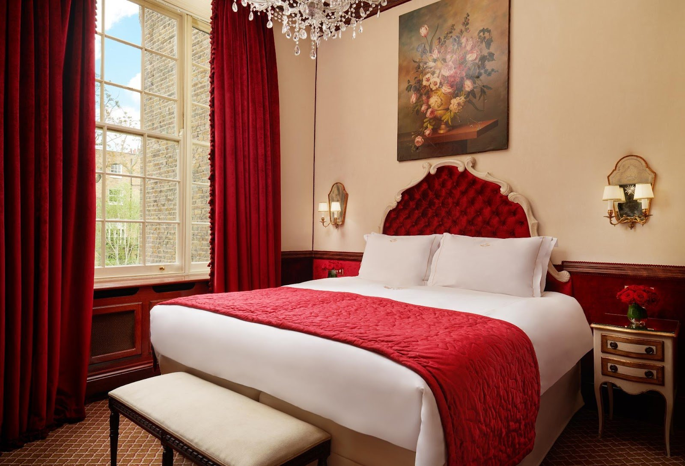

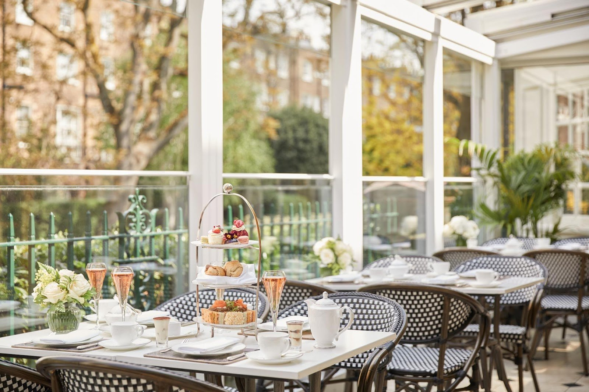

*A room and the conservatory at The Montague.*

## Four-star and boutique

### Kimpton Fitzroy London: free, with a 35kg ceiling

*1–8 Russell Square, WC1B 5BE · Russell Square garden, 3 min · Free*

**[Kimpton Fitzroy London](hotel:kimpton-fitzroy-london)** charges no fee and takes no deposit. Kimpton's [pet page](https://www.kimptonfitzroylondon.com/pet-friendly) promises no size, weight or number limit, but **the hotel's own FAQ caps dogs at 35kg**, so ring ahead with a large dog. A loan pet bed, bowls, a mat and poo bags are supplied, a door hanger warns staff, and Marleybones dog food can be ordered to the room. Paws Galore runs walks and day care, from one hour to a whole evening.

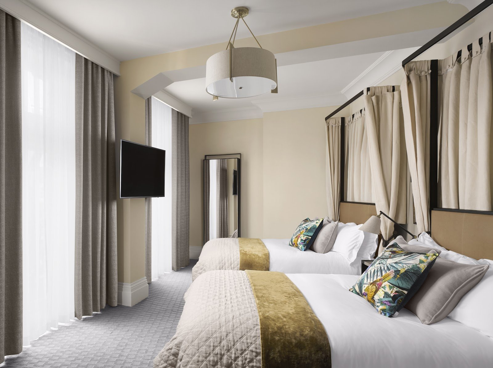

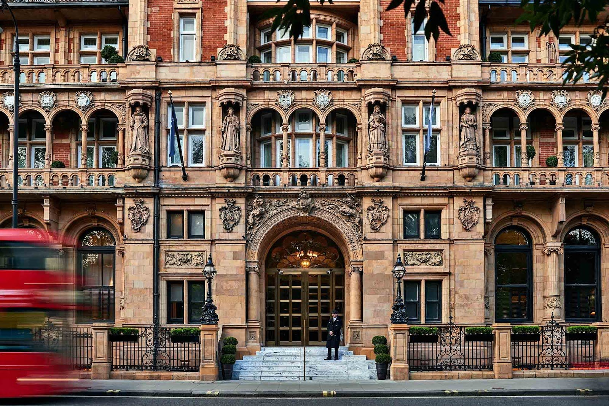

*A room and the facade at Kimpton Fitzroy.*

### Treehouse Hotel London: free, never alone

*14–15 Langham Place, W1B 2QS · Regent's Park, 15 min · Free*

**[Treehouse](hotel:treehouse-hotel-london)** charges [no pet fee](https://www.treehousehotels.com/london/pet-friendly). Every dog gets a welcome amenity, and beds, bowls, poo bags and food are kept on hand. Dogs stay on a lead or in a carrier in public areas, out of the dining areas and gym, and someone must be in the room whenever staff come in. They are never to be left alone. It is next door to The Langham, by Oxford Circus.

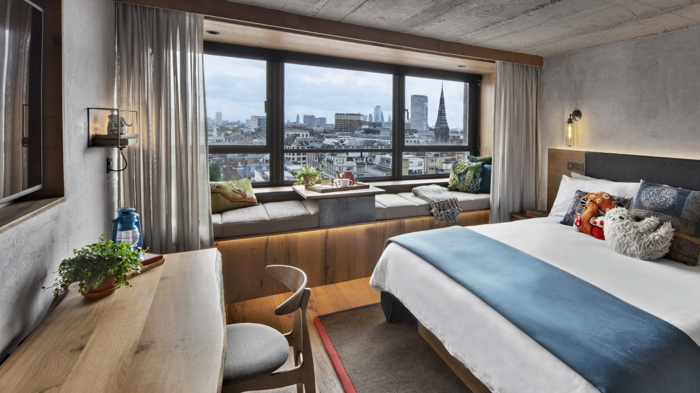

*A room at Treehouse.*

### South Place Hotel: free if you book direct

*3 South Place, EC2M 2AF · Moorgate and Liverpool Street stations · Free, booked direct*

**[South Place](hotel:south-place-hotel)** is dog-friendly throughout, **including the Angler and Bluebird City restaurants and the bars**, with the dog on a lead. [Dogs stay free when you book with the hotel](https://southplacehotel.com/dog-friendly/), then email reservations to say one is coming. The room has a king-size dog bed, a toy, bowls and a mat, with the hotel's list of local parks.

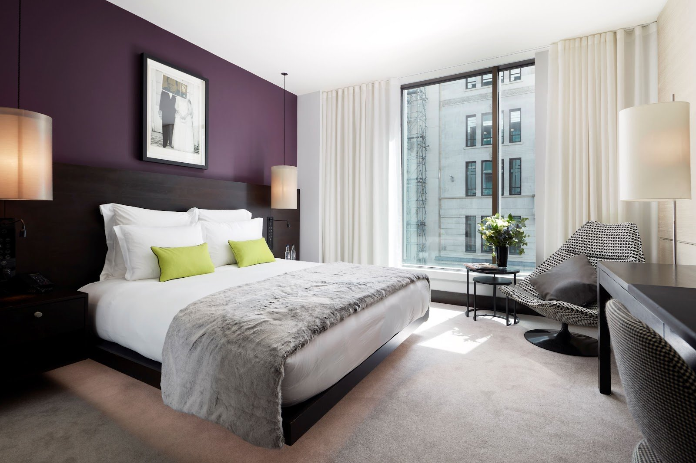

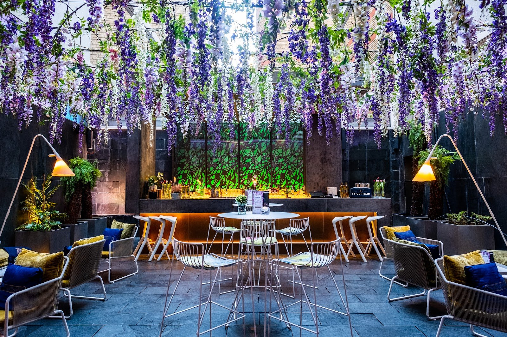

*A room and the courtyard bar at South Place.*

### Royal Lancaster London: across the road from Kensington Gardens

*Lancaster Terrace, W2 2TY · Kensington Gardens, 3 min · £25 per pet per day*

**[Royal Lancaster](hotel:royal-lancaster-london)** charges [£25 per pet per day](https://www.royallancaster.com/facilities/our-pet-policy/), nothing for members of its Friends club, and takes cats and, on request, other pets. Dogs can use the Park Lounge Bar and Living Lounge but not Park Restaurant, Nipa Thai or Hyde Café. **Staff will not enter a room with an unsupervised dog inside**, and the Paw-Cierge sitter costs £40 an hour with 24 hours' notice. The Italian Gardens are three minutes away, where dogs go on the lead around the fountains.

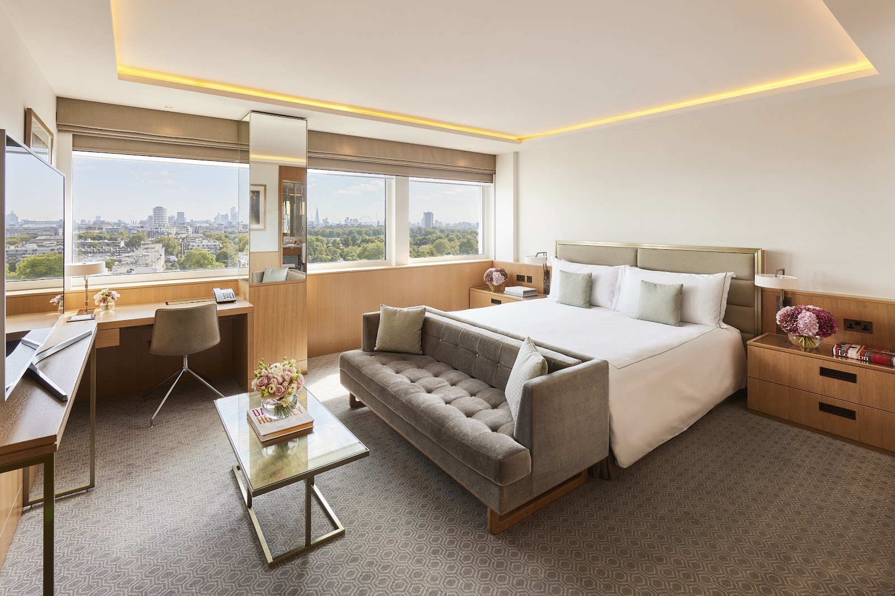

*A room and the facade at Royal Lancaster.*

### Sea Containers London: £35 a stay, small dogs only

*20 Upper Ground, SE1 9PD · Bernie Spain Gardens, 3 min · £35 per stay*

**[Sea Containers](hotel:sea-containers-london)** charges [£35 per stay](https://www.seacontainerslondon.com/about/dog-friendly/) and takes a £100 deposit against a signed damage waiver. The limit is **9kg**, and dogs cannot stay in the Cabin Suites. They are allowed in the bedrooms and in Gordon Ramsay at Sea Containers, if shorter than the table and lying on the floor. A blanket, a bowl and a treat are provided. The Thames Path runs past the door.

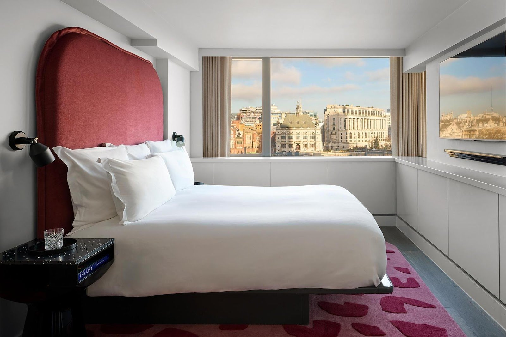

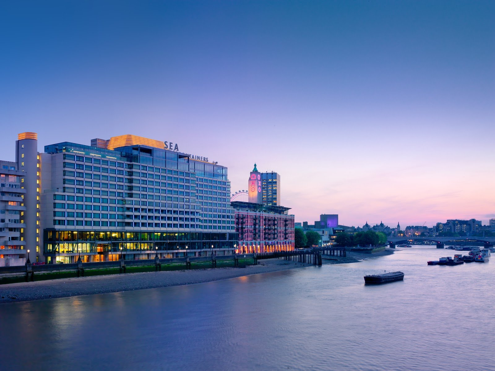

*A room and the facade at Sea Containers.*

### Bankside Hotel: two dogs, anywhere in the building

*2 Blackfriars Road, SE1 9JU · Christ Church Gardens, 5 min · £75 supplement*

**[Bankside Hotel](hotelscom:h27347295)** takes up to two dogs in its pet-friendly rooms for a £75 supplement. Dogs are welcome throughout the hotel, including the bar, restaurant and terraces, with Lily's Kitchen food on hand and your own brand if you ask ahead. Beds, bowls and treats are supplied. It publishes no weight limit.

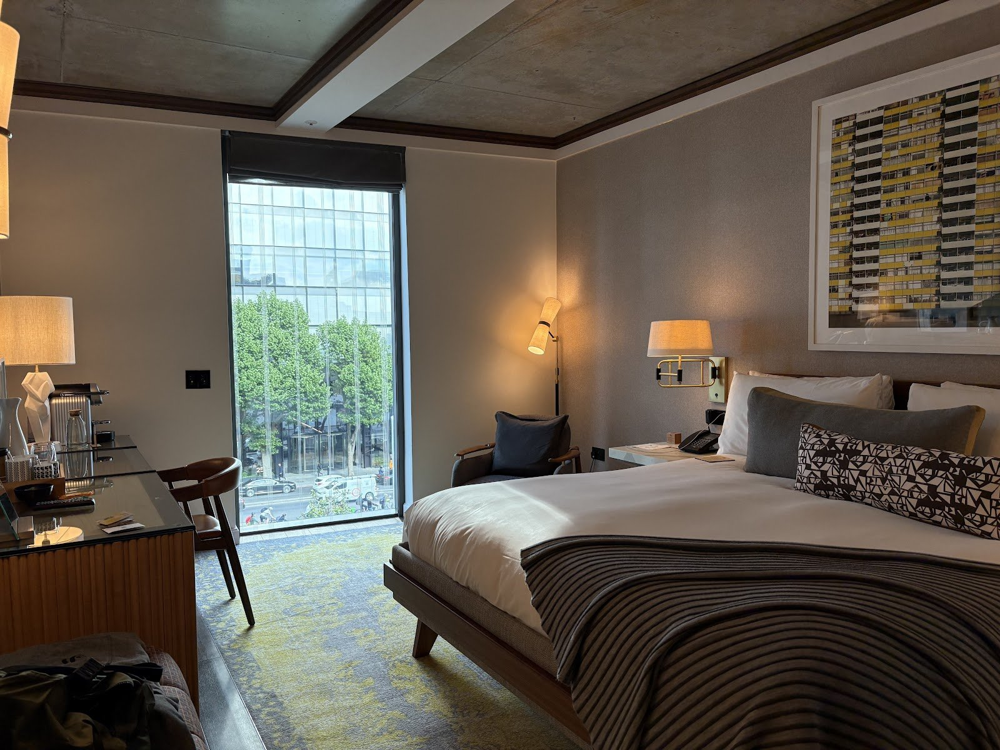

*A room at Bankside Hotel.*

### Bermondsey Square Hotel: £20 a night, and breakfast together

*Bermondsey Square, SE1 3UN · Leathermarket Gardens, 6 min · £20 per pet per night*

**[Bermondsey Square Hotel](hotel:bermondsey-square-hotel)** charges [£20 per pet per night](https://www.bermondseysquarehotel.co.uk/room/pet-friendly/) for bowls, a bed and treats, in its Superior, Family and Terrace rooms. Dogs can join you at breakfast in b2 At Home, but not on the chairs. The Friday antiques market fills the square outside.

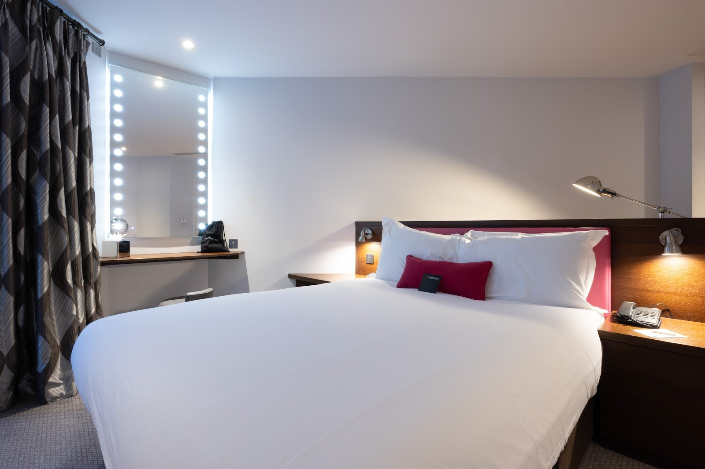

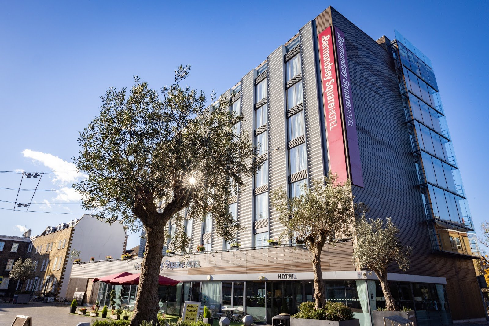

*A room and the facade at Bermondsey Square.*

## Cheaper, and longer stays

**Premier Inn and hub by Premier Inn take [assistance dogs only](https://www.premierinn.com/gb/en/faq/smoking-and-pets.html).** The budget chain that takes pets is Travelodge.

### Travelodge: every room, every London hotel

*Across London · Cleaning fee per pet, per booking*

**[Travelodge](https://www.travelodge.co.uk/about/pet-friendly-hotels/)** says every room in every hotel is pet-friendly, for any domesticated animal, up to two per room. Add the pet as an extra when you book; the cleaning fee is charged per pet at booking, and assistance dogs are exempt. Pets cannot be left alone in the room and are not allowed in the Bar Café. Its central London branches include Covent Garden, Waterloo and King's Cross.

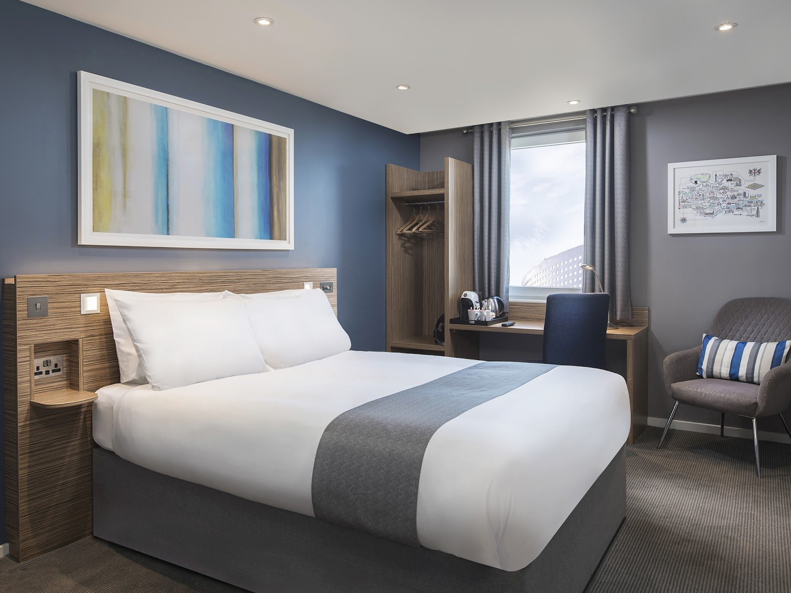

*A room at a Travelodge.*

### ibis London Blackfriars

*49 Blackfriars Road, SE1 8NZ · Christ Church Gardens, 1 min · Fee not published*

**[ibis London Blackfriars](hotel:ibis-london-blackfriars)** lists "Pets welcome" on its Accor page but no fee or limit. Accor decides pet rules hotel by hotel, so another ibis may say no; call this one about the fee. Southwark station is 140 metres away.

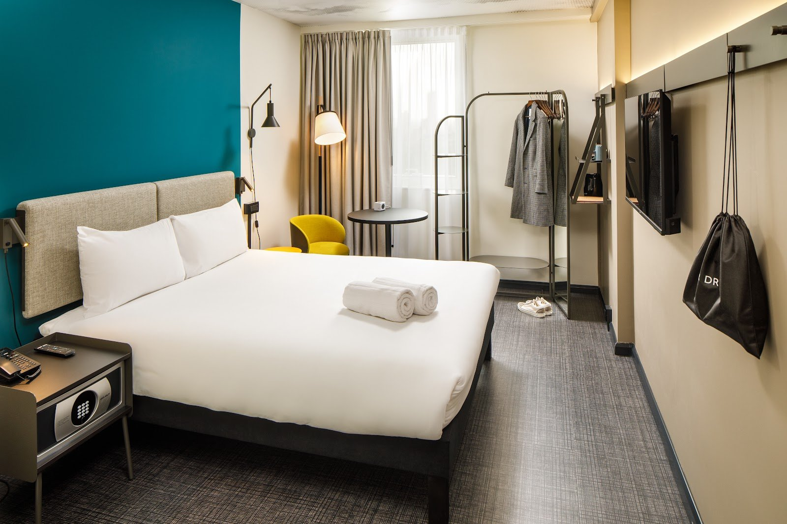

*A room at ibis London Blackfriars.*

### Dog & Fox, Wimbledon: a pub by the Common

*24 High Street, SW19 5EA · Wimbledon Common, 4 min · £25 per night*

**[Dog & Fox](hotel:dog-and-fox-wimbledon)**, a Young's pub in Wimbledon Village, has dog-friendly rooms taking up to two dogs for [£25 a night](https://www.dogandfoxwimbledon.co.uk/dog-friendly-hotel-wimbledon/), whether you bring one or two. A hamper of treats, a bed or blanket and a bowl come with the room, and dogs are welcome in the pub. They stay off the beds and furniture, on a lead in shared areas, and are never left unsupervised. Wimbledon station has the District line and trains to Waterloo.

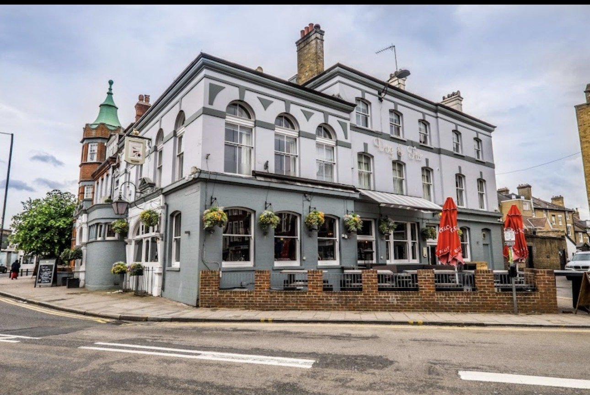

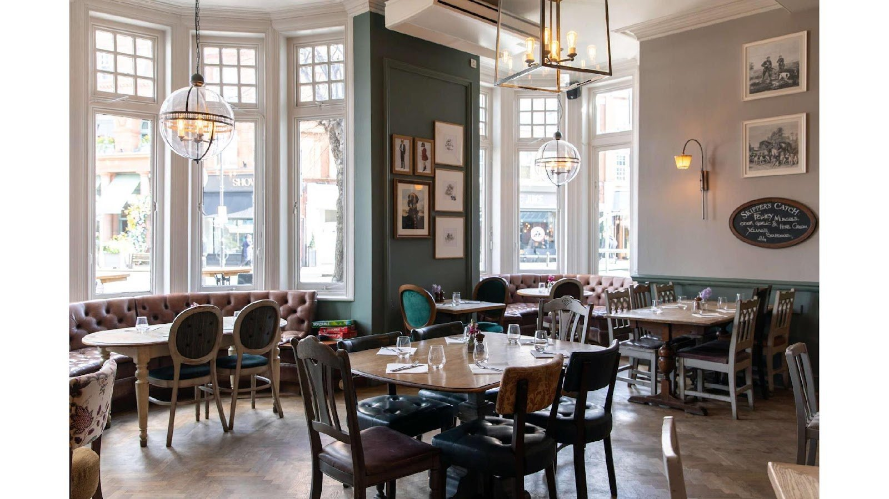

*The pub and dining room at Dog & Fox.*

### Wilde aparthotels: a kitchen, and a seven-night minimum

*Covent Garden, Paddington, Liverpool Street, Aldgate Tower Bridge · £20 per night plus £50*

**[Wilde](https://www.wilde.com/dog-friendly-stays)** takes one dog of up to 20kg at four London aparthotels, including [Covent Garden](hotel:wilde-aparthotels-covent-garden) and [Paddington](hotel:wilde-paddington). **The minimum stay with a dog is seven nights**, at £20 a night up to 28 nights and £8 after that, plus a one-off £50 deep clean; you book by phone. A dog can be left in the apartment by day, crated if necessary, but not at night. Dogs are allowed in the lobby and bar, not the restaurants. Victoria Embankment Gardens is a minute from the Covent Garden building. Sister brand Staycity runs the same scheme at £15 a night; our [aparthotels guide](/articles/aparthotels-london/) compares both.

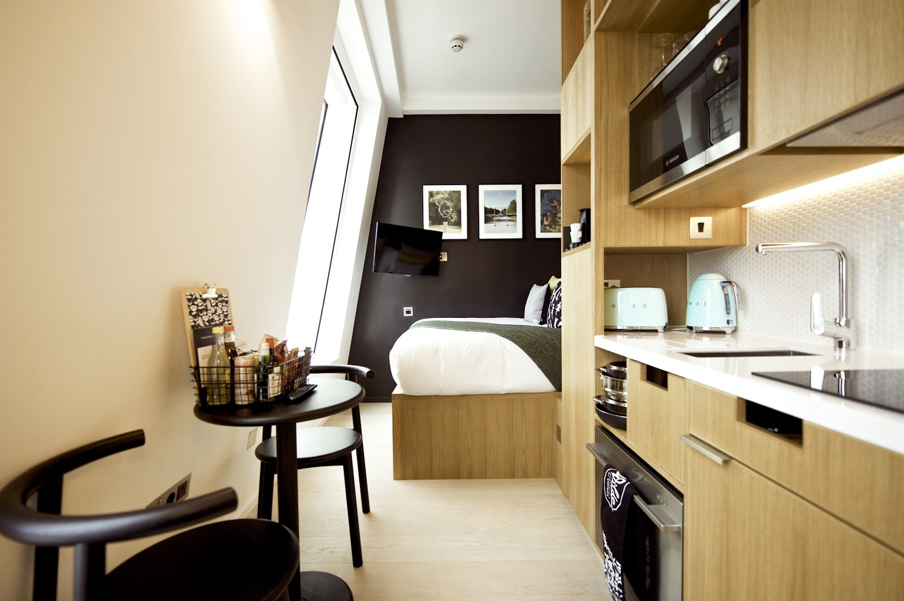

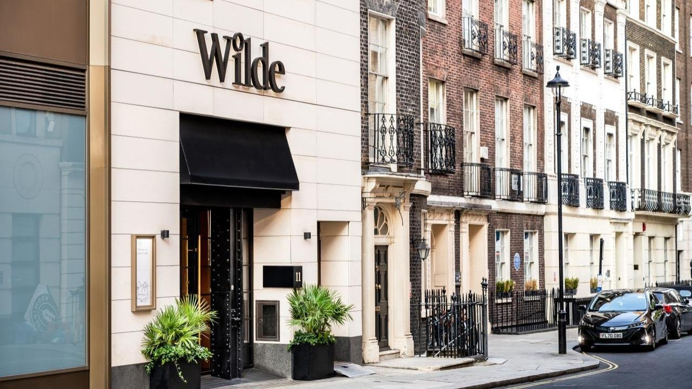

*A studio and the entrance at Wilde Covent Garden.*

## Getting around London with a dog

**Tube, bus, Overground, DLR, tram and Elizabeth line:** dogs travel free under [TfL's conditions of carriage](https://tfl.gov.uk/corporate/terms-and-conditions/ticketing-and-travel-conditions-of-carriage), on a lead or in a carrier and never on a seat. Use the wide gate. Take the stairs or lift where a station has them; on an escalator you must carry the dog, and if it is too big, staff will stop the escalator when it is safe, which generally means outside the rush hour. Staff can refuse a dog that seems dangerous or out of control.

**Trains:** National Rail lets you bring [up to two animals free](https://www.nationalrail.co.uk/on-the-train/train-travel-with-pets/), on a lead or in a rigid carrier, and not on seats.

**Uber Boat by Thames Clippers:** [dogs are allowed on board](https://www.thamesclippers.com/info/faq) on a lead.

**The Royal Parks:** dogs can generally be off the lead if under control, but [the Royal Parks' dog policy](https://www.royalparks.org.uk/sites/default/files/2025-12/Dogs%20In%20The%20Royal%20Parks.pdf) bans them from children's playgrounds and toilets and wants them on a lead near roads and water. The local rules:

- **Hyde Park:** no dogs in the Diana Memorial Fountain, the Lido or the Serpentine; leads in the Rose Garden and along the lake edge.
- **Kensington Gardens:** leads by the Round Pond, the Long Water, the Italian Gardens fountains and the Flower Walks.
- **The Green Park:** restricted in the Memorial Gardens in front of Buckingham Palace.
- **St James's Park:** kept off the fenced grass around the lake.
- **The Regent's Park:** restricted in Avenue Gardens, the English Gardens, Queen Mary's Gardens and St John's Lodge Garden, and around the boating lake.
- **Richmond Park and Bushy Park:** dogs on leads throughout from 1 May to 31 July, the deer birthing season.

Our [guide to London's parks](/articles/best-parks-gardens-london/) covers what each is like to walk.

## Continue planning your London trip

- 🧭 **[Best Areas to Stay in London](/articles/best-areas-to-stay-in-london/)** - which part of the city to sleep in
- 👨‍👩‍👧 **[Best Family Hotels in London](/articles/best-family-hotels-london/)** - Royal Lancaster, The Rubens and Mandarin Oriental are there too
- 🏊 **[London Hotels With a Pool](/articles/hotels-with-pool-london/)** - The Langham and Mandarin Oriental Hyde Park have pools as well as a dog policy; the length and the children's hours at every hotel pool
- 🏨 Area stay guides for the hotels above: [Bloomsbury](/articles/where-to-stay-bloomsbury/), [Marylebone](/articles/where-to-stay-marylebone/), [Mayfair](/articles/where-to-stay-mayfair/), [Westminster and Victoria](/articles/where-to-stay-westminster/), [Kensington](/articles/where-to-stay-kensington/), [City of London](/articles/where-to-stay-city-of-london/), [South Bank](/articles/where-to-stay-south-bank/), [Bermondsey](/articles/where-to-stay-bermondsey/), [Covent Garden](/articles/where-to-stay-covent-garden/) and [Paddington](/articles/where-to-stay-paddington/)

*Pet fees, weight limits and house rules are from each hotel's own pet page, policy or FAQ, checked on 27 September 2026; hotels change them without notice, so confirm when you book. Walking times are from TfL's journey planner.*
