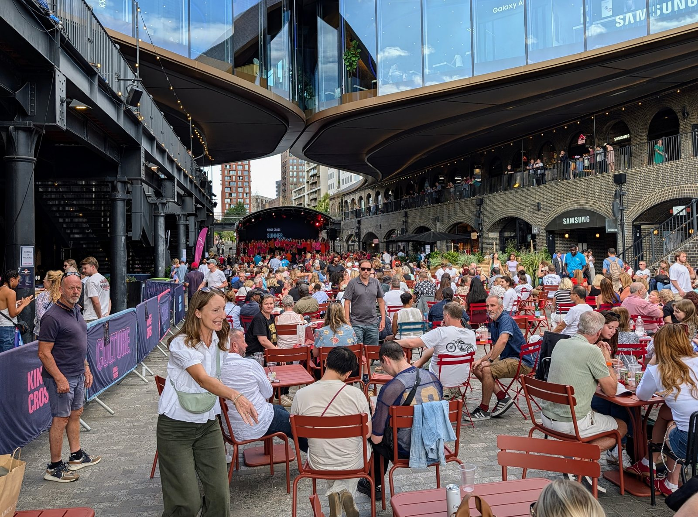
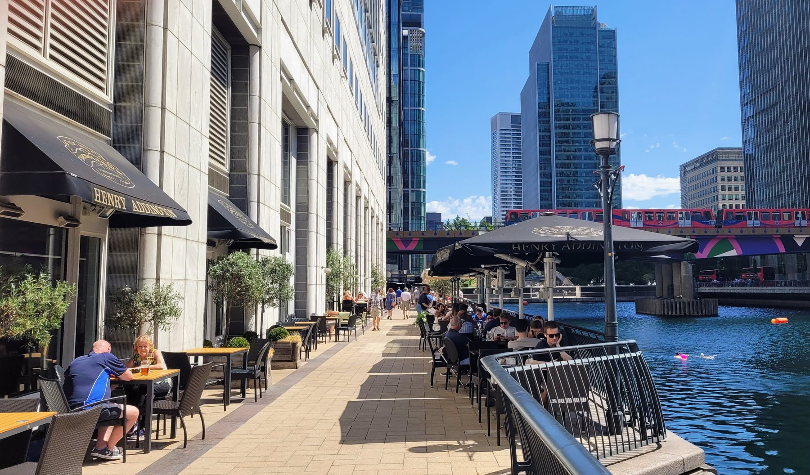
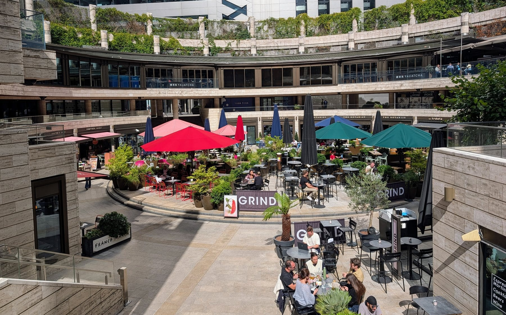
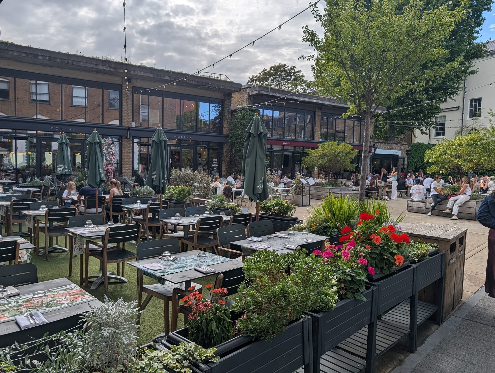
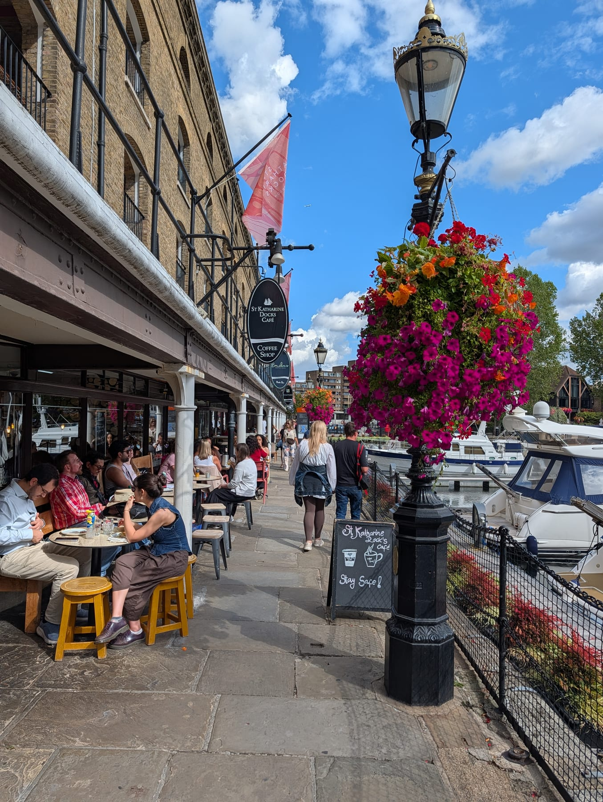
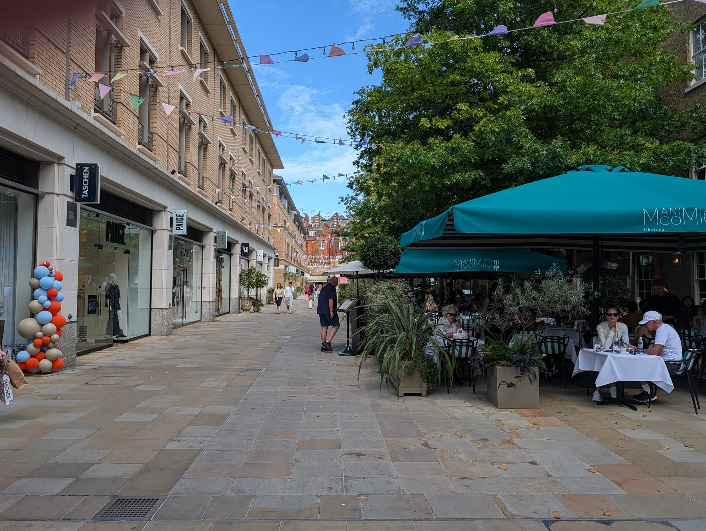
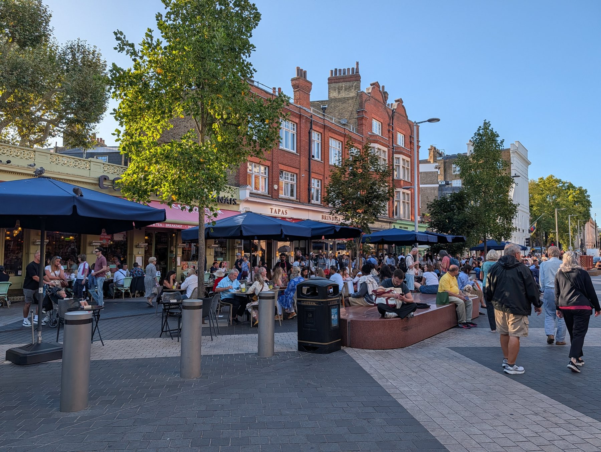
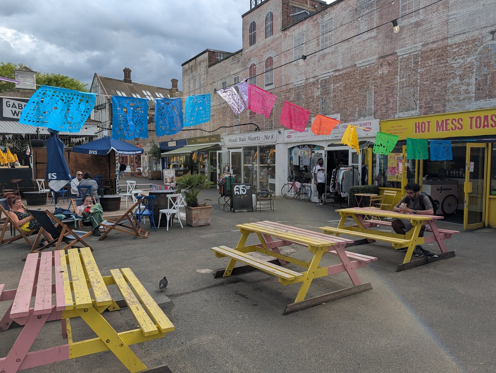
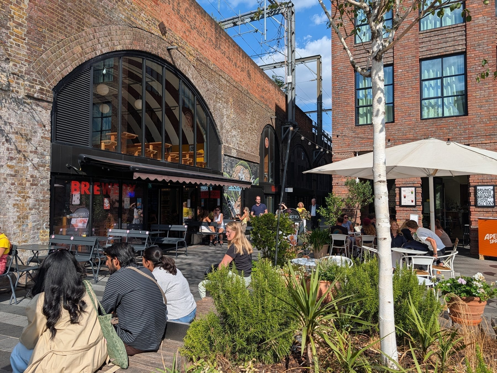

Ask where to eat outside in London and most answers give you a list of restaurants with terraces, which is the wrong shape of answer. A terrace is one table. What you actually want is somewhere you can spend three hours: arrive without a plan, walk between a dozen options, sit down in the sun, and still be there when it goes dark.

That means precincts — the yards, squares and waterfronts where the outdoor tables are concentrated rather than scattered. London has more of these than it did five years ago, because a decade of developers all had the same idea at once: convert an industrial ruin, put a courtyard in the middle, and line it with restaurants.

Two things separate them, and almost nobody prints either. **The first is whether the roof is real.** Several of the places on every alfresco list are covered halls with glass over the top — pleasant, but not eating outside. **The second is whose chairs they are.** In some of these places you can buy a sandwich and sit down on the grass. In others every seat belongs to a restaurant and the answer to "can we just sit here" is no.

Both are settled below, place by place.

> 💡 **The Short Version:** **Coal Drops Yard** is the one that still works in October — its terraces are covered and heated by design rather than by patio umbrella. **Canary Wharf** is the largest of them: waterside terraces on Water Street, new steps down to the water at Eden Dock, and three parks you can picnic in. **Exchange Square** at Broadgate is 420 square metres of free lawn on a deck above the railway. **Eccleston Yards** is a single courtyard five minutes from Victoria, and you cannot hear the station from it. For bring-your-own, go to **Battersea Power Station**, which puts out free deck chairs. And **Crossrail Place Roof Garden is indoors** — Canary Wharf's own website says so.

## Where they are

| If you are near… | Where to sit outside |
| --- | --- |
| **King's Cross** | Coal Drops Yard, Granary Square steps, Bagley Walk, Lower Stable Street |
| **Liverpool Street** | Exchange Square, Broadgate Circle, Finsbury Avenue Square |
| **Canary Wharf** | Water Street, Eden Dock, Harbour Quay, Jubilee Park, Montgomery Square |
| **Victoria** | Eccleston Yards |
| **Tower Bridge** | St Katharine Docks |
| **London Bridge & Borough** | Vinegar Yard, Flat Iron Square, Maltby Street |
| **Soho & Covent Garden** | Kingly Court, St Martin's Courtyard, Slingsby Place, Neal's Yard |
| **Chelsea** | Duke of York Square (Saturdays) |
| **Battersea** | Circus West Village, the Coaling Jetty, Power Station Park |
| **South Bank** | Gabriel's Wharf, Bernie Spain Gardens |
| **South London** | Pop Brixton, Mercato Metropolitano, Frank's Café in Peckham |
| **Camden** | Hawley Wharf's canal side |

**Price guide:** **£** under £15 a head · **££** £15–£30 · **£££** £35+.

---

## The one distinction that decides your afternoon

Every place on this page falls into one of two camps, and the difference matters more than the food does.

**You can bring your own and sit down** at the Granary Square steps and Bagley Walk in King's Cross; Exchange Square's lawn and amphitheatre at Broadgate; Jubilee Park, Canada Square Park, Harbour Quay and the Eden Dock steps at Canary Wharf; Power Station Park, Malaysia Square and the riverside walk at Battersea; Bernie Spain Gardens on the South Bank; Duke of York Square's lawn in Chelsea; and Rembrandt Gardens beside the canal at Little Venice. Every one is free to walk into with the seating open to anyone, and Battersea's estate goes further, putting out free deck chairs and publishing its own guide to where the picnic spots are.

**Every chair belongs to a restaurant** at Kingly Court, Eccleston Yards, Broadgate Circle, the Coal Drops Yard terraces, the St Katharine Docks quaysides, Vinegar Yard, Flat Iron Square and Pop Brixton. You can walk through all of them without buying anything. You cannot sit down in them without buying something.

The best afternoons use both. Buy lunch from a counter in the precinct, carry it fifty metres to the grass, and go back for a drink at a table afterwards.

---

## The big precincts

### Coal Drops Yard and King's Cross

*Coal Drops Yard on a summer evening. The tables in the middle are the venues'; the steps down to the canal at Granary Square are not.*

*££ · King's Cross · 5 min from King's Cross St Pancras · shops Mon–Sat 11am–7pm, Sun 11am–5pm; restaurants later · [Coal Drops Yard](https://www.kingscross.co.uk/coal-drops-yard)*

Two Victorian coal drops — the eastern one built in 1851, the western in 1860 — where coal from South Yorkshire was tipped from trains into canal boats and carts below. They opened as a shopping and eating yard on 26 October 2018, joined by Thomas Heatherwick's "kissing roof": two slate roofs pulled up and across a 35-metre gap until they touch.

**This is the one that works in the cold**, because the terraces here were built as permanent outdoor rooms rather than pavement overspill. **Plaza Pastor** is a covered, heated terrace sitting outside Casa Pastor — tacos, tostadas, quesadillas and rotisserie chicken, with DJs Wednesday to Saturday nights. **Parrillan**, from the Barrafina team, is a covered and heated terrace on the viaduct level, planted with Mediterranean shrubs and looking down at the Regent's Canal; you order meat, seafood and vegetables raw and cook them yourself on a mini charcoal grill set into the table. **Coal Office** has a heated ground-floor terrace on Bagley Walk. Barrafina, The Drop in the brick arches, and Morty & Bob's are the rest of the yard.

**Down on Lower Stable Street**, a cobbled lane under the arches, the food gets cheaper and smaller: Hiden for Japanese curry, OKAN and OTON for Osaka cooking, Matchado for matcha, House of Cans for beer. A market runs there at weekends.

**And then there is the free half.** **Bagley Walk** is an elevated park on the old railway viaduct above the yard, planted by Dan Pearson with liquorice, strawberries and figs, with seats and viewing points looking over the canal and Camley Street Natural Park; it runs from Granary Square to Gasholder Park. **Granary Square** has more than a thousand choreographed fountains and, better, wide south-facing steps sweeping down to the canal, grassed over in the warmer months. Nobody minds what you eat on them.

> ⚠️ **Parrillan takes a winter break.** The terrace closes for part of the winter and reopens for spring, so check before making the journey for the grills specifically. Plaza Pastor and the Coal Office terrace stay open.

Around Granary Square itself: **Caravan** has a sunny terrace, **Granary Square Brasserie** runs a heated one with cushions, umbrellas and blankets, and **The Lighterman** has three separate outdoor options — a wraparound first-floor terrace, tables on Granary Square, and a bar down on the canal towpath.

📍 More on the neighbourhood in our **[King's Cross area guide](/articles/kings-cross-area-guide/)**.

---

### Canary Wharf

*West India Quay. The tables run right along the water, and a DLR train crosses the dock every couple of minutes.*

*£–£££ · Canary Wharf · Elizabeth line, Jubilee line and DLR · [Canary Wharf](https://canarywharf.com/)*

Sixteen acres of landscaped squares, docksides and parks with about eighty cafés, bars and restaurants scattered through them — which is why nobody ever finds all of it. Split it into three.

**Water Street and Wood Wharf** is where the big-name restaurants went. **Hawksmoor Wood Wharf** sits in a floating pavilion at 1 Water Street that rises and falls with the tide, with a 120-seat waterside bar, The Lowback, on the dock level below the dining room — British beef and sustainable seafood upstairs, cocktails and a terrace on the water downstairs. **Dishoom** at 13 Water Street has a verandah over the water with a retractable awning, which is the single most useful piece of engineering in the whole estate. **Feels Like June** at number 15 does West Coast-inspired tacos, small plates and rice bowls, with blankets when it turns. **Roe**, from the Fallow team, runs across three floors on Park Drive with a wrap-around terrace. **Mallow** is the plant-based one.

**Eden Dock** is the new part and the reason to come back. Opened in October 2024 with the Eden Project, it turns the Grade I-listed Middle Dock into a run of floating pontoons and planted islands, and — the important bit — steps and ramps bring the public down to water level for the first time. The new terraces face south and west, which in a district of towers is the whole game. It is more decking and seating than planting, which suits eating.

**And the parks are yours.** **Jubilee Park** is designed for lying on the grass at lunchtime. **Canada Square Park** hosts open-air film screenings in summer and big-screen sport, ringed by bars and by The Ivy in the Park's terraces. **Harbour Quay** is a waterside boardwalk with trees, and the estate itself recommends it for picnics. **Montgomery Square** has free ping pong and minigolf, and **The Lunch Market** brings a rotating line-up of street food traders in on Thursday lunchtimes through the warmer months.

> ⚠️ **Crossrail Place Roof Garden is not an outdoor garden.** It sits under Foster + Partners' timber lattice roof and Canary Wharf's own website calls it "the indoor space". It is free, open daily until 9pm or sunset in summer, planted by hemisphere either side of the Meridian line, and has an 80-seat amphitheatre. Somewhere to sit, then, but not somewhere outside. **Big Easy** and **Pergola on the Wharf** lead off it.

Elsewhere on the estate: **ROKA** has a heated terrace over Canada Square Park, **Caravan** at Reuters Plaza is a summer sun trap that hands out blankets in winter, **Boisdale** runs a garden terrace with heaters and blankets, **Ibérica's La Terraza** on Cabot Square is spring and summer only, and **The Sipping Room** at West India Quay puts igloos on its Thames-side terrace in winter.

📍 More on the estate in our **[Canary Wharf area guide](/articles/canary-wharf-area-guide/)**.

---

### Broadgate: Exchange Square and Broadgate Circle

*Broadgate Circle, sunken and enclosed. Every seat here belongs to a restaurant - the free lawn is up at Exchange Square.*

*£–£££ · Liverpool Street · 2 min from Liverpool Street · [Broadgate](https://broadgate.co.uk/eatdrinkshop/)*

Broadgate is the largest pedestrianised estate in central London, and it has two very different outdoor spaces sitting a hundred metres apart.

**Exchange Square** is the free one. It reopened in January 2022 after DSDHA rebuilt it for British Land: 1.5 acres of park on a deck over the railway approach to Liverpool Street, between the Grade II listed trainshed and Exchange House. There are 420 square metres of lawn, amphitheatre seating cut into the slope, water running through it, and more than fourteen thousand plants and trees — four times the green space Broadgate had before. Because the tracks are underneath, nothing tall stands on that side, so light gets to the grass in a way it does not anywhere else in the City. **Back to Mine** at 5 Exchange Square is the bar in the corner of it: natural wine, draught beer, proper coffee and grazing boards, a heated terrace, dogs welcome and a daily happy hour. In winter the Broadgate ice rink sets up here, having moved from Broadgate Circle after nearly thirty years.

**Broadgate Circle** is the other model entirely — a sunken ring of restaurants around a circular open-air terrace, and every chair in it belongs to somebody. **Yauatcha City** does dim sum and patisserie; **Lina Stores**, **Gaucho**, **Notto**, **Shiro**, **Bar Kroketa** and **Franco Manca** fill the rest of the ring, with **The Botanist**, **Grind**, **Poolhouse** and **Mr Fogg's City Tavern** doing the drinking. It is a sunken ring surrounded by office towers, so it holds warmth in the evening and loses the sun early in the afternoon. **Finsbury Avenue Square** next door is the weekday-lunch version: **Bar Douro**, **Baraka**, **Yolk** and **Redemption Roasters**, with tables straight out onto the paving.

> 📍 **The thing you have probably photographed.** Standing at the Broadgate entrance to Liverpool Street is Richard Serra's *Fulcrum*, installed in 1987 — five leaning plates of weathered steel about 17 metres high that you can walk inside. It has been the local meeting point, and rain shelter, for nearly forty years.

---

### Battersea Power Station and Circus West Village

*£–£££ · Battersea · 2 min from Battersea Power Station · public areas free to walk · [Battersea Power Station](https://batterseapowerstation.co.uk/eat-and-drink/)*

The one big development that actively tells you to bring your own. Its own guide points people at **Power Station Park**, the **riverside walk** and the benches in **Malaysia Square**, which it describes as a real sun trap, and there are free deck chairs to use in the park.

**The Coaling Jetty** is the piece worth walking out onto: 110 metres of Grade II\* listed jetty built between 1929 and 1932 to unload coal into the power station, decommissioned in 1983 and now open to the public with wildflower planters, seating and festoon lighting strung above the Thames.

For a table rather than a bench, the riverside strip has **Fiume** on its Riverside Terrace, **Brindisa Tapas**, **Wright Brothers** for seafood and a **Searcys** champagne bar. **Circus West Village**, the first phase to open, runs from the river along to **Arches Lane**, where the cheaper and better eating is: **Roti King**, **Tonkotsu**, **Cinnamon Kitchen**, **Gordon Ramsay Street Pizza** and **Battersea Brewery** under the railway. **TOZI Pizzeria** is on Electric Boulevard.

Buy from any of those, walk two minutes, and eat on the river. That is the trip.

📍 More in our **[Battersea area guide](/articles/battersea-area-guide/)**.

---

### Eccleston Yards, Belgravia

*Eccleston Yards. Every seat here belongs to a venue, which is the trade for the quiet.*

*££–£££ · Belgravia · 5 min from Victoria · [Eccleston Yards](https://www.belgraviavillage.com/eccleston-yards)*

Eighty thousand square feet of industrial buildings behind Victoria station — including a five-storey former ice factory at 27 Eccleston Place — arranged around a single courtyard. Grosvenor rebuilt it as about nineteen units of independent food, fashion and wellbeing, and the whole thing revolves around that yard: the tables spill into it, and the programme of Sunday farmers' markets, live music, yoga and outdoor screenings happens in the same space.

It is also the smallest precinct here, and that is the reason to come: one courtyard, five minutes' walk from one of the busiest stations in Britain, and you cannot hear the station from it.

**What to eat.** **Wild by Tart** is the anchor — a restaurant, bar, coffee kiosk and shop in one, in the Michelin Guide since 2022, with festoon lights over the outside tables. **Cornus**, upstairs on the roof, holds a Michelin star awarded in the 2025 guide; it comes from David O'Connor and Joe Mercer Nairne of Medlar with Gary Foulkes cooking, and the set lunch is the way in. **Weezie's** opened in April 2026 in the old Biscuiteers unit, from the pair behind amie wine studio next door: thin-crust pizza, a couple of small plates, Guinness and good wine, walk-ins only, seven days a week from noon to 11pm. **Morena** does brunch on green-striped chairs and a £6 happy hour Monday to Friday. **The Jones Family Kitchen** does grass-fed British steak dry-aged at least 28 days.

📍 More in our **[Belgravia area guide](/articles/belgravia-area-guide/)**.

---

### St Katharine Docks

*The restaurants line one side of the dock. The walk round it is free and open at all hours.*

*££ · Wapping · 8 min from Tower Hill · [St Katharine Docks](https://www.skdocks.co.uk/cats/bars-restaurants/)*

Opened in 1828 as one of the busiest ports in Britain, now central London's only marina, sitting immediately east of Tower Bridge and largely ignored by the crowds photographing the bridge two hundred metres away. Yachts and barges instead of towers, cobbles instead of paving, and the water is the whole point.

**Traders Wine Bar** has a terrace right at the water's edge and does cheese and charcuterie boards, which is the low-effort way to spend two hours here. **The Dickens Inn** is a rebuilt eighteenth-century warehouse with balcony dining and a beer garden looking at Tower Bridge; the food is pizza and pub, and you are paying for the view. **Bravas Tapas** does modern Basque small plates on the waterside, **Kilikya** is the Turkish one with an outdoor area, and **Zizzi**, worth naming for once, has one of the largest outdoor seating areas in the docks. **Emilia's Crafted Pasta**, **Fatto a Mano**, **Côte** and the seafood-led **Melusine** fill in the rest.

The quaysides are public and you can walk the whole basin for nothing. The tables on them are not.

---

Powered by <a target="_blank" rel="sponsored" href="https://www.getyourguide.com/london-l57/">GetYourGuide</a>

## Yards and courtyards

### Kingly Court, Soho

*££ · Soho · 3 min from Oxford Circus · [Kingly Court](https://www.thisissoho.co.uk/eat-and-drink/kingly-court/)*

Three storeys of balconies around a courtyard behind Carnaby Street, with entrances on Carnaby Street, Beak Street and Kingly Street. **Be clear about what it is:** the courtyard is open air through the summer and then covered for the winter with a seasonal roof, with outdoor heaters running underneath. That hedge is the reason to choose it — you are never quite rained off, and you are never quite outside in January either. Shaftesbury Capital consulted in March 2026 on replacing that seasonal cover with a proper retractable roof.

Twenty-odd kitchens across the three levels. **ALTA** does Basque cooking on the ground floor, alongside **Bar Kroketa**, **Goldies**, **Paradiso** and **Pizza Pilgrims**. Upstairs: **Imad's Syrian Kitchen**, **Le Bab**, **Señor Ceviche**, **Donia** for Filipino, **Liu Xiaomian** for Chongqing noodles, **Shoryu** for ramen and **The Life Goddess** for Greek. **Cahoots**, **Disrepute** and **Two Floors** are underneath it.

Ground-floor tables in the middle of the courtyard get whatever sun there is; the balcony tables get the noise and the view down.

### Duke of York Square, Chelsea

*Duke of York Square. Restaurant tables down one side, and a lawn off the other end that is yours to sit on.*

*£–££ · Chelsea · 3 min from Sloane Square · market Saturdays 10am–4pm · [Duke of York Square](https://dukeofyorksquare.com/food-and-dining/categories/duke-of-york-square-market)*

An open square off the King's Road beside the Saatchi Gallery, with a lawn in the middle, and every Saturday since 2004 around 45 stalls arrange themselves around it from 10am to 4pm. Cheese, charcuterie, oysters, fresh pasta, sourdough and hot plates from most of the world, with the lawn and the steps to eat it on.

It is genuinely open-air, genuinely free to sit in, and genuinely only one day a week — a Tuesday visit gets you a pleasant square with restaurant terraces on it and no market at all.

### Exhibition Road, South Kensington

*Exhibition Road at about six on a September evening. The whole street is a shared surface, so the tables spill into it.*

Not a yard or a precinct but a **street that behaves like one**. Exhibition Road was rebuilt as a shared surface - no kerbs, no separated pavement - between South Kensington station and the museums, and the practical effect is that the restaurants along it put their tables out into what would otherwise be road.

It runs past the **V&A, the Natural History Museum and the Science Museum**, which is the densest run of museums in the country, so the crowd is a mix of people who have spent the day in one and people who live in South Kensington and never go.

**Casa Brindisa** does Spanish tapas from a terrace directly on the street, and **Comptoir Libanais** is a few doors up. The parasols are the restaurants’, so this is venue seating rather than anywhere to bring your own - but the width of the street means the tables are not squeezed against a wall, which is unusual in central London.

**It faces roughly north-south and the light arrives late**, so the terrace end of the day here runs well into the evening in summer - the photograph above was taken at about six in September.
### The Yards, Covent Garden

*££ · Covent Garden · 4 min from Covent Garden · [The Yards](https://theyardscoventgarden.co.uk/)*

The Covent Garden back streets — Slingsby Place, St Martin's Courtyard, Mercer Walk — where the tables sit away from the main tourist channel and traffic. **UKIYO** on Slingsby Place does hand rolls, cocktails and a weekday caviar hour from 4pm to 6pm. **Brother Marcus** has an outdoor terrace on St Martin's Courtyard doing Eastern Mediterranean sharing plates. **Lahpet** is one of very few London restaurants cooking Burmese food and runs a summer terrace. **Dalla Terra**, **Dishoom**, **L'ETO** and **Bill's** all put seating out into the courtyards.

Two minutes north, **Neal's Yard** is a twenty-metre courtyard of painted walls and hanging plants with cafés and wine bars round the edge. It is about the size of a tennis court, so a dozen people with cameras fills it; come before 10am if you want a table in it.

📍 More in our **[Covent Garden area guide](/articles/covent-garden-area-guide/)**.

### Gabriel's Wharf and the South Bank

*Gabriel's Wharf. The painted picnic tables are not any one venue's, which makes this the rare central yard you can sit in with food from anywhere.*

*£–££ · South Bank · 8 min from Waterloo · [Gabriel's Wharf](https://southbank.london/see-and-do/gabriels-wharf)*

A low-rise courtyard of independent shops, galleries and small kitchens set back one block from the river between Queen's Walk and Upper Ground, and one of the few places on the South Bank where you are not paying river-frontage prices. **Limin'** does Trinidadian food, **The Gourmet Pizza Company** and **Hola Guacamole** cover the obvious, **Fed By Plants** the vegan end, **Hot Mess Toasties** the cheap one. In summer the tables spread into a sand-covered area in the middle of the courtyard.

**Bernie Spain Gardens** sits immediately next door between the Oxo Tower and the wharf — a riverside park laid out in the 1980s across two halves of Upper Ground, and the obvious place to take food you bought rather than food you sat down for.

📍 More in our **[South Bank area guide](/articles/south-bank-area-guide/)**.

### Camden Market Hawley Wharf

*The arches at Hawley Wharf. A working railway runs directly overhead, which you notice about once a minute.*

*£–££ · Camden Town · 4 min from Camden Town · [Camden Market Hawley Wharf](https://camdenmarket.com/journal/camden-market-hawley-wharf)*

The newest part of Camden Market, reopened in stages from 2021 into restored railway arches and waterside halls on the edge of the Regent's Canal. **The food courts themselves are covered** — worth knowing, because the whole reason to choose Hawley Wharf over the rest of Camden is the water. The canal-side spaces and rooftops around the halls are the outdoor half, and they are where to take the food. It is also the accessible corner of Camden Market: step-free throughout, with a Changing Places facility.

📍 More in our **[Camden area guide](/articles/camden-area-guide/)**.

---

Powered by <a target="_blank" rel="sponsored" href="https://www.getyourguide.com/london-l57/">GetYourGuide</a>

## Street food that is genuinely outdoors

### Vinegar Yard, London Bridge

*£ · London Bridge · 1 min from London Bridge · Wed 5–10.30pm, Thu–Fri 4–11pm, Sat noon–11pm · [Vinegar Yard](https://www.vinegaryard.london/)*

A yard of food traders, bars, art and a weekend flea market wedged beside London Bridge station on St Thomas Street. Its own booking notes are unusually honest about the weather, and worth quoting as a model for the whole category: from spring, about a third of the outdoor space is under cover; from late autumn most of the site goes under stretch tents; in winter there are heaters, and an indoor space that runs all year.

**The thing that ruins a visit: it is closed Sunday, Monday and Tuesday.** Every other yard on this page trades most days; this one does not.

### Flat Iron Square, Borough

*£ · Borough · 4 min from London Bridge · Mon 4–10pm, Tue noon–11pm, Wed–Sat noon–midnight, Sun noon–8pm · [Flat Iron Square](https://flatironsquare.co.uk/)*

Railway arches off Southwark Street converted into a taproom and a garden, with a handful of resident food traders — flame-grilled Greek souvlaki, buttermilk fried chicken, Neapolitan pizza — and a serious number of screens. The outdoor garden is heated and runs through the winter, and there is a large outdoor screen with heaters above it plus indoor screens for when that fails. It is a sport venue as much as a food one: pick a different night if you want to hear the person opposite you.

### Maltby Street Market, Bermondsey

*£ · Bermondsey · 8 min from London Bridge · Sat 10am–5pm, Sun 11am–4pm, plus Fri 5.30–9pm in summer · [Maltby Street Market](https://www.maltbystreetmarket.co.uk/)*

A narrow alley called the Ropewalk running between the brick arches of the 1836 London-to-Greenwich viaduct, strung with flags, with traders down both sides and no roof over any of it. Of all the markets on this page it is the one with the least shelter, which cuts both ways. Raclette, confit, bavette steak and tacos are the standing order; the arches either side hold the bars.

**Weekends only**, apart from the summer Friday evenings, and it is small enough that turning up at 1pm on a Saturday means queuing.

📍 More in our **[Bermondsey area guide](/articles/bermondsey-area-guide/)**.

### Pop Brixton

*£ · Brixton · 3 min from Brixton · free entry · [Pop Brixton](https://www.popbrixton.org/)*

Shipping containers stacked two high on Brixton Station Road, opened in 2015 on council land, filled with independent kitchens and bars around an open yard. It trades all year: open-air through the summer, weather-proofed to keep people warm and dry in winter. Free to walk in, and the traders change often enough that naming them dates quickly — go and read the boards.

### Mercato Metropolitano, Elephant & Castle

*£ · Elephant & Castle · 5 min from Elephant & Castle · [Mercato Metropolitano](https://mercatometropolitano.com/locations/elephant-and-castle/)*

Seventeen thousand square feet of former paper factory on Newington Causeway with more than forty independent traders. The reason it belongs here rather than in the covered list is that it is genuinely both: indoor warehouses with sheltered dining, and an outdoor piazza and garden area with its own bars and seating. On a warm evening the outside fills first.

### Frank's Café, Peckham

*£ · Peckham · 5 min from Peckham Rye · mid-May to mid-September, Wed–Sun 11am–11pm · [Bold Tendencies](https://boldtendencies.com/franks-cafe/)*

The top of the multi-storey car park at 95a Rye Lane, floors seven to ten, run by the Bold Tendencies arts organisation. Frank's opened in 2009, designed by Practice Architecture, and it is nothing but a bar and some benches on a roof — which is the point, because the view runs from the London Eye across to the O2 and Crystal Palace. Entry is first come, first served, so arrive early on a clear evening.

**Peckham Levels, on the floors below, is indoors** — a converted car park with kitchens and studios in it, and a completely different proposition. If you came for sky, keep going up.

📍 More in our **[Peckham area guide](/articles/peckham-area-guide/)**.

---

Powered by <a target="_blank" rel="sponsored" href="https://www.getyourguide.com/london-l57/">GetYourGuide</a>

## The markets, settled

The honest answer to "do London's food markets have good outdoor seating" is: mostly no, and the famous ones least of all. Here is what is actually under a roof.

| Market | Days | Outdoors? |
| --- | --- | --- |
| **Borough Market** | Tue–Fri 10am–5pm, Sat 9am–5pm, Sun 10am–4pm, **closed Monday** | No. Borough Market Kitchen — the street-food end, behind Roast — is a large covered space with communal tables and stepped bench seating |
| **Old Spitalfields** | Mon–Wed & Fri 10am–8pm, Thu 8am–6pm (antiques), Sat 10am–6pm, Sun 10am–5pm | No. A covered Victorian hall under an iron-and-glass roof |
| **Seven Dials Market** | Mon–Tue noon–10pm, Wed–Sat 11am–11pm, Sun 11am–9pm | Mostly no. Indoors in the old Thomas Neal banana warehouse; a limited number of tables on Earlham Street outside are first come, first served, uncovered, and close at 10pm |
| **Canopy Market, King's Cross** | Wed–Thu noon–7/8pm, Fri noon–8pm, Sat–Sun 11am–6pm | No. Under the steel-and-glass West Handyside Canopy |
| **Camden, Hawley Wharf** | Daily | Halfway. Covered food courts, open canal-side space beside them |
| **Boxpark Wembley** | Daily 9am–11pm | No. An indoor food hall on Olympic Way |
| **Maltby Street** | Sat 10am–5pm, Sun 11am–4pm, summer Fri evenings | **Yes.** An open alley between the arches |
| **Duke of York Square** | Sat 10am–4pm | **Yes.** Open square, around a lawn |
| **Broadway Market** | Sat 9am–5pm, Sun 10am–4pm | **Yes**, but it is a street with no seating — take it to London Fields at one end or the Regent's Canal at the other |
| **Mercato Metropolitano** | Daily | **Partly.** Outdoor piazza and garden, indoor warehouse |
| **The Lunch Market, Canary Wharf** | Thursdays, warmer months | **Yes.** Montgomery Square, rotating traders |

> ⚠️ **Borough Market is shut on Mondays.** And because its seating is covered anyway, a wet Tuesday gets you more than a sunny Monday does.

---

## What works in October

Everything on this page is pleasant in July. This is the shorter list that survives a cold, bright afternoon.

- **Coal Drops Yard** — Plaza Pastor and the Coal Office terrace are both covered and heated, and Parrillan's terrace is too, when it is open for the season.
- **Kingly Court** — the courtyard goes under cover for winter and the heaters come on.
- **Vinegar Yard** — most of the site under stretch tents from late autumn, with heaters.
- **Flat Iron Square** — a heated garden that runs through the winter, plus a heated outdoor screen.
- **Pop Brixton** — weather-proofed to stay open all year.
- **Broadgate Circle** — deep, enclosed and heated by the restaurants around it; the ice rink at Exchange Square gives you a reason to be there in December.
- **Canary Wharf** — ROKA, Boisdale and Caravan all run heaters or hand out blankets, and The Sipping Room puts up igloos.
- **Crossrail Place Roof Garden** — indoors, warm and free, which is the honest reason to keep it on the list.

**Summer only, or effectively so:** Ibérica's La Terraza on Cabot Square, Frank's Café in Peckham (mid-May to mid-September), Maltby Street's Friday evenings, the Granary Square steps, and every lawn on this page.

---

## What to know before you go

* **Check the day, not just the hours.** Borough Market is closed Mondays. Vinegar Yard is closed Sunday to Tuesday. Duke of York Square's market is Saturday only. Maltby Street is weekends plus summer Fridays. Broadway Market is Saturday, with a smaller Sunday.
* **Two of the most-recommended "outdoor" spaces are indoors.** Crossrail Place Roof Garden and Borough Market Kitchen are both under a roof. They are good; they are not alfresco.
* **Bring-your-own works in the parks and squares, not in the yards.** Granary Square, Bagley Walk, Exchange Square, Jubilee Park, Harbour Quay, Power Station Park and Bernie Spain Gardens are all free to sit in with your own food. Kingly Court, Eccleston Yards, Broadgate Circle and the Coal Drops terraces are not.
* **The waterside beats the square for sun.** In the tower districts the light goes off the paving early. Eden Dock's new terraces face south and west; Granary Square's steps face south; Malaysia Square at Battersea is the estate's own nominated sun trap.
* **Book the restaurants, not the precincts.** Hawksmoor Wood Wharf, Dishoom, Roe, Cornus and Yauatcha all take reservations and fill on a warm evening. The market yards and food halls do not take bookings at all, and Weezie's at Eccleston Yards is walk-in only.
* **Service charge** of 12.5% is discretionary and standard on London restaurant bills. Market counters and street-food stalls generally do not add it.

---

Powered by <a target="_blank" rel="sponsored" href="https://www.getyourguide.com/london-l57/">GetYourGuide</a>

## Continue planning your London trip

- 🍽️ **[Eat in London: Restaurants, Food Markets & Quick Food Hub](/articles/eat-in-london-guide/)**
- 🌭 **[The Best Street Food in London](/articles/best-street-food-london/)**
- 🛍️ **[The Best Markets in London](/articles/best-london-markets/)**
- 🌳 **[The Best Parks and Gardens in London](/articles/best-parks-gardens-london/)**
- 🚂 **[King's Cross Area Guide](/articles/kings-cross-area-guide/)**
- 🏙️ **[Canary Wharf Area Guide](/articles/canary-wharf-area-guide/)**
- ☔ **[London in the Rain](/articles/london-in-the-rain/)**
