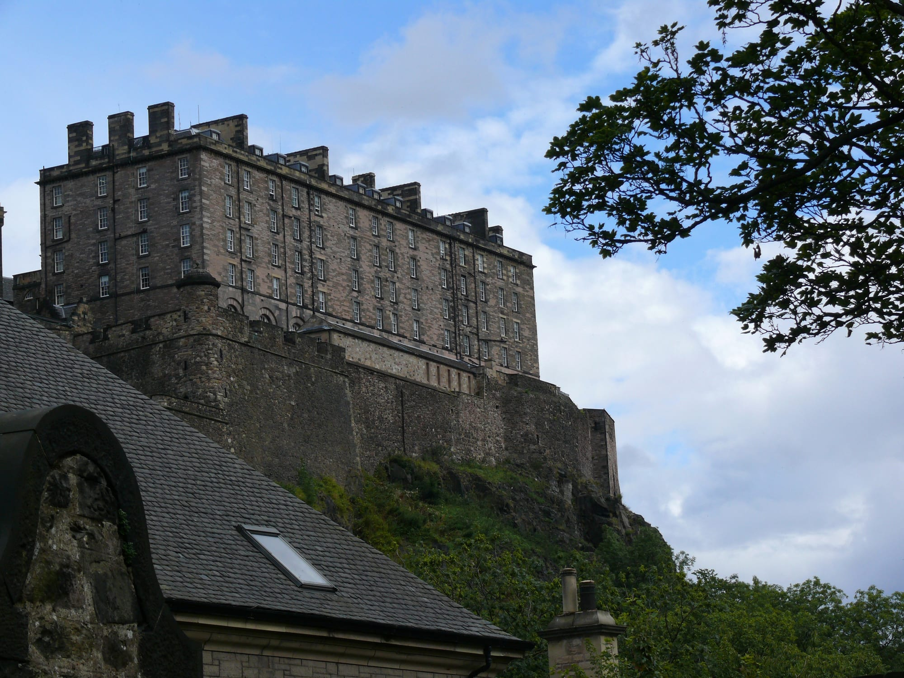

**King's Cross to Edinburgh Waverley is from 4 hours 8 minutes on LNER's fastest trains — though that pace runs on only around a quarter of weekday departures, so most trains take closer to 4 hours 30.** Advance singles start at £41.40 booked around three weeks out, and Lumo runs the same East Coast Main Line route from £31.90. Both numbers matter, because the other honest number is this: even on the fastest scheduled service, the round trip alone eats more than 8 hours of your day.

That's the maths this guide works through properly — what a same-day return to Edinburgh actually costs you in hours, what the Caledonian Sleeper changes about that equation, and why, once you've priced it all out, a single night in the city beats doing it in a day.

> 💡 **The Short Version:** **King's Cross to Edinburgh Waverley, roughly hourly, from 4h08** on LNER's fastest trains (most take nearer **4h30**). **Advance singles from £41.40** (**£27.55** with a railcard), booked about three weeks out; **Lumo runs the same route from £31.90**, calling at Stevenage, Newcastle and Morpeth. **Edinburgh Castle is £23.50 online, £26.00 at the gate** — book ahead, it sells out in summer. **A same-day return means 8 to 9 hours of travel alone**, so the honest verdict is **one night beats a day trip**. **The Caledonian Sleeper**, from London Euston, is the trick that makes a short trip feel longer: board by 22:30, **vacate your room in Edinburgh by 08:00**, no travel day lost. **Or book it as one trip** — the <a href="https://www.getyourguide.com/activity/-t16135?partner_id=WWP7I0R&amp;cmp=edinburgh-day-trip" target="_blank" rel="sponsored nofollow noopener" data-affiliate="gyg">£219 rail day trip with castle entry</a> bundles the train, a bus tour and the castle ticket, though doing it yourself costs less. **Staying over?** Four hotels below, all Old Town or by Waverley.

**Book a tour direct:**

- **£219** — <a href="https://www.getyourguide.com/activity/-t16135?partner_id=WWP7I0R&amp;cmp=edinburgh-day-trip" target="_blank" rel="sponsored nofollow noopener" data-affiliate="gyg">Day Trip to Edinburgh by Rail with Castle Entry</a> — the train, a hop-on-hop-off bus tour and Edinburgh Castle entry bundled into one 15-hour day, 3.8 from 87 reviews
- **£239** — <a href="https://www.getyourguide.com/activity/-t2275?partner_id=WWP7I0R&amp;cmp=edinburgh-day-trip" target="_blank" rel="sponsored nofollow noopener" data-affiliate="gyg">Edinburgh: The Royal City Tour from London</a> — an unescorted full-day rail trip, no castle entry included, 4.4 from 35 reviews

Powered by <a target="_blank" rel="sponsored" href="https://www.getyourguide.com/london-l57/">GetYourGuide</a>

*Edinburgh Castle above the Old Town. Photo: Ad Meskens, Wikimedia Commons.*

## Getting there: the trains

### LNER from King's Cross

| | London King's Cross → Edinburgh Waverley |
| --- | --- |
| **Operator** | LNER, direct |
| **Fastest** | **4h08** (around a quarter of weekday services) |
| Typical | Closer to **4h30** |
| Frequency | **29 direct trains every weekday**, roughly hourly |
| **Advance single, ~3 weeks out** | **£41.40** |
| Advance single, with a railcard | **£27.55** |
| Booking window | Released around **12 weeks** ahead |

LNER's own figures, checked 28 September 2026. The 4h08 fastest time only applies to the newer, faster hourly trains introduced with the 14 December timetable change — LNER's own route page is explicit that this covers about a quarter of weekday departures, so don't assume every train you can book runs that fast. Book as far ahead as the 12-week Advance window allows for the cheapest fare; both figures above are one-way, so a return is roughly double.

### Lumo, the budget alternative

**Lumo is the open-access operator on the same line, and its lead-in fare to Edinburgh is £31.90 one-way — about £10 less than LNER's Advance fare.**

| | London King's Cross → Edinburgh Waverley |
| --- | --- |
| **Operator** | Lumo, direct |
| **Journey time** | **4h20–4h30**, depending on the service |
| Calls at | Stevenage, Newcastle, Morpeth |
| **Fare, one-way** | **From £31.90** |
| Frequency | **4 direct trains a day** to Edinburgh, 5 back |
| Booking window | Up to **24 weeks** ahead |
| Class | Standard only — no first class |

> ⚠️ **Lumo's own homepage advertises fares "from £9.90" — that's not the Edinburgh fare.** It's the price to a shorter leg on the same line, such as Stevenage or Newcastle. The fare specific to the full London–Edinburgh trip starts at £31.90, checked on Lumo's own Edinburgh route page.

Lumo runs all-electric trains with free Wi-Fi and no first class, which is the trade-off for the lower fare — you're paying less for the same East Coast Main Line route and a broadly similar journey time to LNER's typical (not fastest) service.

## The Caledonian Sleeper: sleep there, don't lose the day

**The Caledonian Sleeper's Lowland route runs overnight between London Euston — not King's Cross — and Edinburgh Waverley, and it changes the maths on a short trip more than either day train does.**

| | London Euston → Edinburgh Waverley |
| --- | --- |
| Boarding, priority (Caledonian Double & Club) | **22:15** |
| Boarding, all other guests | **22:30** |
| Rooms vacated by | **08:00** |
| Return: board Edinburgh Waverley by | **22:30** |
| Return: rooms vacated at Euston by | **07:30** |
| Timetable runs | **17 May – 12 December 2026** |

Take the sleeper up and you go to bed in London and wake up in Edinburgh with a full day still ahead of you — no train journey eating into your waking hours. Rooms range from a Seated Coach ticket up to Classic Rooms with twin bunks, Club En-Suite rooms and a Caledonian Double; fares are dynamically priced through the booking engine rather than published as a fixed figure, so check your date directly on Sleeper's own site. Book the sleeper back as well as out and you get a genuine full day in Edinburgh without paying for a hotel room at either end — the closest this route comes to a free night's accommodation.

## Is Edinburgh actually doable as a day trip?

**Only in the most technical sense.** Even LNER's fastest scheduled service — 4h08, and only on a quarter of weekday trains — means over 8 hours of travel for the round trip alone. Run the typical journey time instead, 4h30 each way, and you're at 9 hours before you've left the train.

> 💡 **A real day-tour operator books almost exactly this pattern.** GetYourGuide's own escorted rail day trip to Edinburgh (see above) sets a 15-hour day door-to-door, and even at that length its itinerary only stretches to Edinburgh Castle and a hop-on-hop-off bus loop of the city — not the Royal Mile at a walking pace, not Holyroodhouse, not Arthur's Seat. That's an independent match for how little slack the timetable really leaves.

Compare that with Bath or Oxford, where the train is just over an hour each way and a day trip is genuinely comfortable — see [Bath from London](/articles/bath-day-trip/) for what that maths looks like when the travel time is small. Edinburgh doesn't work the same way. **One night, rather than a same-day return, is what actually lets you see the castle, walk the Royal Mile without watching the clock, and eat somewhere properly** — the [Where to stay](#where-to-stay-old-town-and-around-waverley) section below covers four options, all Old Town or a few minutes from Waverley.

## The day-trip products, compared

Two GetYourGuide products cover the London–Edinburgh route as a single booking, and they're genuinely different products, not just different prices.

| | Price | Rating | What's included |
| --- | --- | --- | --- |
| <a href="https://www.getyourguide.com/activity/-t16135?partner_id=WWP7I0R&amp;cmp=edinburgh-day-trip" target="_blank" rel="sponsored nofollow noopener" data-affiliate="gyg">Day Trip to Edinburgh by Rail with Castle Entry</a> | **£219** | 3.8 (87 reviews) | Return train, hop-on-hop-off bus tour, **Edinburgh Castle entry** |
| <a href="https://www.getyourguide.com/activity/-t2275?partner_id=WWP7I0R&amp;cmp=edinburgh-day-trip" target="_blank" rel="sponsored nofollow noopener" data-affiliate="gyg">Edinburgh: The Royal City Tour from London</a> | £239 | 4.4 (35 reviews) | Return train only — **unescorted**, no castle ticket |

**The £219 trip is the more honest package.** It's cheaper and it actually includes the castle ticket and a city bus tour, which is most of what a first-time visitor wants done for them. Its 3.8-star average, from a much larger 87-review base, is the fairer read of what booking it is actually like — a very long day, which is true of the route itself, not a flaw specific to the product. The £239 trip rates higher, but on a sample a quarter the size, and its own listing describes it as an unescorted rail day: you're paying £239 largely for organised train tickets and nothing else guaranteed.

**Doing it yourself costs less than either.** An LNER Advance return (about £83, two £41.40 singles) plus an online Edinburgh Castle ticket (£23.50) comes to roughly £107 — cheaper than the £219 bundle — and you set your own train times rather than the tour operator's. The trade-off is that you're doing your own planning and, per the section above, still working within the same brutal same-day arithmetic. If convenience is worth £112 to you, book the £219 trip; if not, book LNER or Lumo and the castle direct.

Powered by <a target="_blank" rel="sponsored" href="https://www.getyourguide.com/london-l57/">GetYourGuide</a>

## Edinburgh Castle

This is the reason most people make the trip, and it's the one attraction in this guide worth pricing out properly.

| Ticket | Online | At the gate |
| --- | --- | --- |
| **Adult (16–64)** | **£23.50** | **£26.00** |
| Concession (65+, unemployed — not students) | £19.00 | £21.00 |
| **Child (7–15)** | **£14.00** | £15.50 |
| Adult Flexi Ticket | £38.00 | n/a |
| Concession Flexi Ticket | £30.50 | n/a |
| Child Flexi Ticket | £22.50 | n/a |
| Family (1 adult, 2 children) | £48.50 | £54.00 |
| Family (2 adults, 2 children) | **£67.50** | £74.50 |
| Family (2 adults, 3 children) | £80.00 | £88.50 |

**A Flexi Ticket skips the timed slot entirely** — book it for any day within a 7-day window starting from your chosen visit date, rather than a fixed date and time. Useful if your travel plans might shift; everyone else books a specific timed entry.

> ⚠️ **Tickets sell out in advance, especially over summer.** Edinburgh Castle's own advice is to book online ahead of your visit — once online tickets are gone, there are no further tickets available at the gate on the day.

**Set aside at least 2 hours** — the castle's own recommendation for seeing the main attractions, which include the Honours of Scotland (the Scottish Crown Jewels), the Stone of Destiny, the Great Hall and the One O'Clock Gun.

| Season | Opens | Last entry | Closes |
| --- | --- | --- | --- |
| **1 April – 30 September** | 9:30am | 5pm | 6pm |
| **1 October – 23 December** | 9:30am | 4pm | 5pm |
| 24 December | 9:30am | 3pm | 4pm |
| 25–26 December | **Closed** | — | — |
| 27–31 December | 9:30am | 4pm | 5pm |
| 1 January | 11am | 4pm | 5pm |
| 2 January – 31 March | 9:30am | 4pm | 5pm |

Checked on the castle's own site, 28 September 2026 — the castle switches from summer to winter hours on 1 October, so check which season applies to your date.

## The rest of the Old Town

Edinburgh Waverley sits between the Old Town and the New Town — **it's a 10-minute walk from the station up to Edinburgh Castle**, and everything below sits along or just off that same route.

**The Royal Mile** runs from the castle esplanade down to the Palace of Holyroodhouse, the spine of the Old Town and free to walk in either direction. **The Palace of Holyroodhouse**, the King's official residence in Scotland at the foot of the Mile, is £22.00 online for an adult (£26.00 at the door), £14.00 for a young person aged 18–24, and £11.00 for a child aged 5–17 or a disabled visitor — a family ticket is a flat £55.00, checked on the Royal Collection Trust's own site.

**The National Museum of Scotland** is free to enter, with charges only for some special exhibitions, open 10:00–17:00 daily — a straightforward stop if the weather turns or you want an hour that doesn't need booking.

**Arthur's Seat**, the extinct volcano behind Holyroodhouse, is free to climb and the closest thing Edinburgh has to a viewpoint over the whole city — worth the detour only if your day allows for it, since it adds a couple of hours you won't have on a same-day return.

## Where to stay: Old Town and around Waverley

Staying Old Town or immediately by Waverley station means the castle, the Royal Mile and your platform home are all within a few minutes of each other.

- **[The Balmoral](hotelscom:h9339)** — 1 Princes Street, directly above Waverley station, its clock tower one of the city's landmarks. Rocco Forte's flagship, with the Michelin-starred Number One restaurant downstairs. £££, the splurge pick if you want to step off the platform straight into the hotel.
- **[Old Waverley Hotel](hotelscom:h24919)** — on Princes Street, directly opposite Waverley station and the Scott Monument. A Victorian building with rooms looking across to the castle. ££.
- **[Apex Grassmarket Hotel](hotelscom:h62750)** — 31–35 Grassmarket, in the Old Town itself, with castle-view rooms and a pool. ££.
- **[Motel One Edinburgh-Royal](hotelscom:h5333965)** — 18–21 Market Street, a few minutes from both Waverley and the Royal Mile. A modern, budget-friendly base. £, the cheapest of the four.

## What people get wrong

- **Assuming every LNER train runs the advertised 4h08.** That's the fastest scheduled time, on around a quarter of weekday departures — most trains take closer to 4h30.
- **Booking Lumo's advertised "from £9.90" fare expecting it to cover Edinburgh.** That price is for a shorter leg on the same line; the Edinburgh fare starts at £31.90.
- **Looking for the Caledonian Sleeper at King's Cross.** It leaves from London Euston, a different station entirely.
- **Trying to fit Edinburgh Castle, the Royal Mile, Holyroodhouse and Arthur's Seat into one day trip.** Even a 15-hour escorted day only manages the castle and a bus loop — pick one or two, or stay the night.
- **Turning up at Edinburgh Castle without a ticket booked.** It sells out, especially in summer, and there's nothing left to buy at the gate once online tickets are gone.
- **Booking a coach-and-castle bundle without checking what "unescorted" means.** One of the two GetYourGuide products here is a rail-only booking with no guide and no castle ticket — read the includes list, not just the title.

## Continue planning your trip

- 🗺️ **[Day trips from London](/articles/day-trips-from-london/)** — what the others cost, how long they take, and which days they are shut.
- 🇳🇱 **[Amsterdam from London](/articles/amsterdam-from-london/)** — the other guide on this site that makes the case for a night over a same-day return, and why.
- 🛁 **[Bath from London](/articles/bath-day-trip/)** — the day trip where the maths works the other way, because the train is barely an hour.
- 🎒 **[Luggage storage in London](/articles/luggage-storage-london/)** — where to leave a bag before an early train or after an overnight sleeper.
- 🚇 **[Getting around London: the transport guide](/articles/getting-around-london-transport-guide/)** — for the King's Cross and Euston end of the trip.
