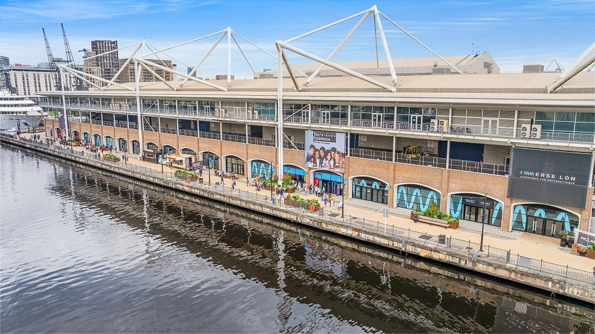
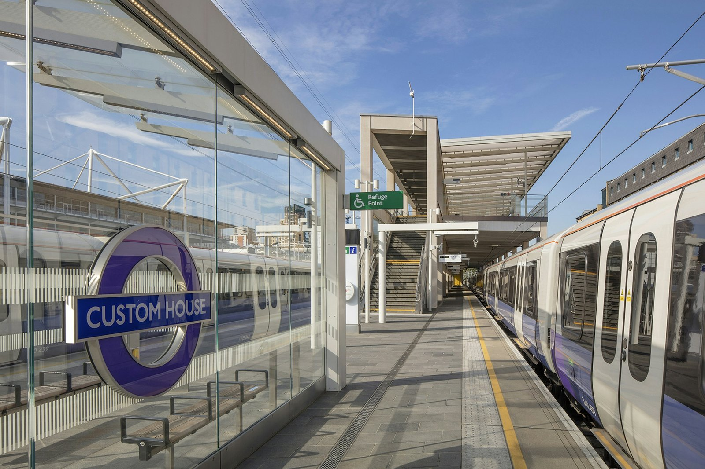
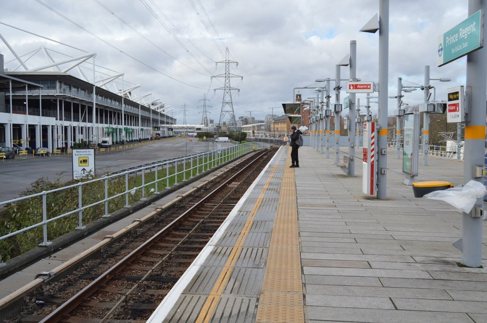
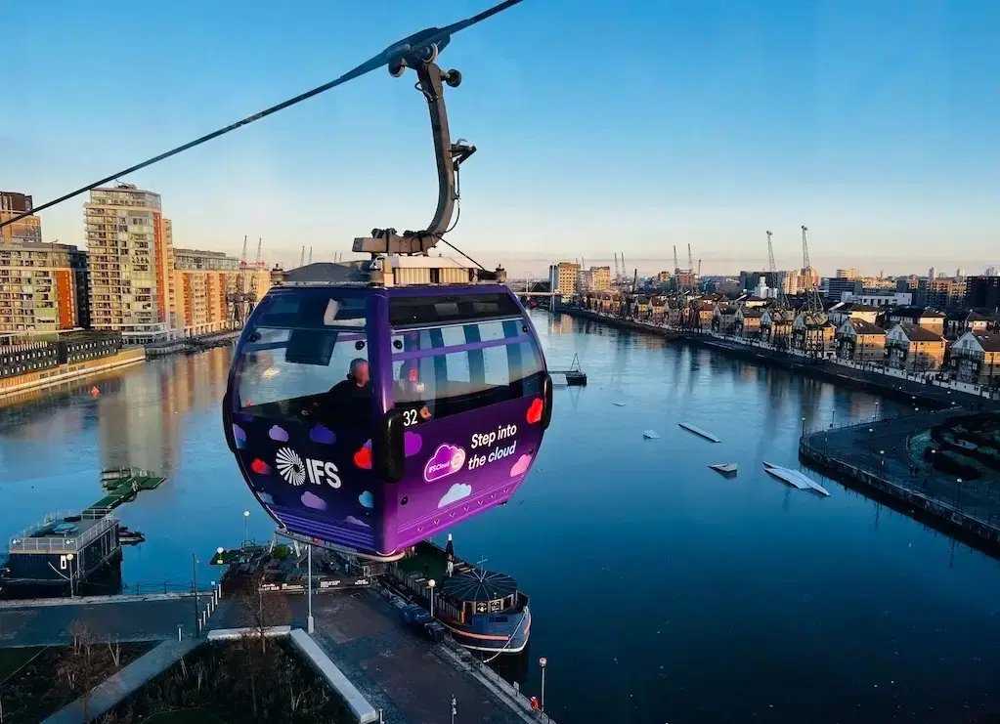
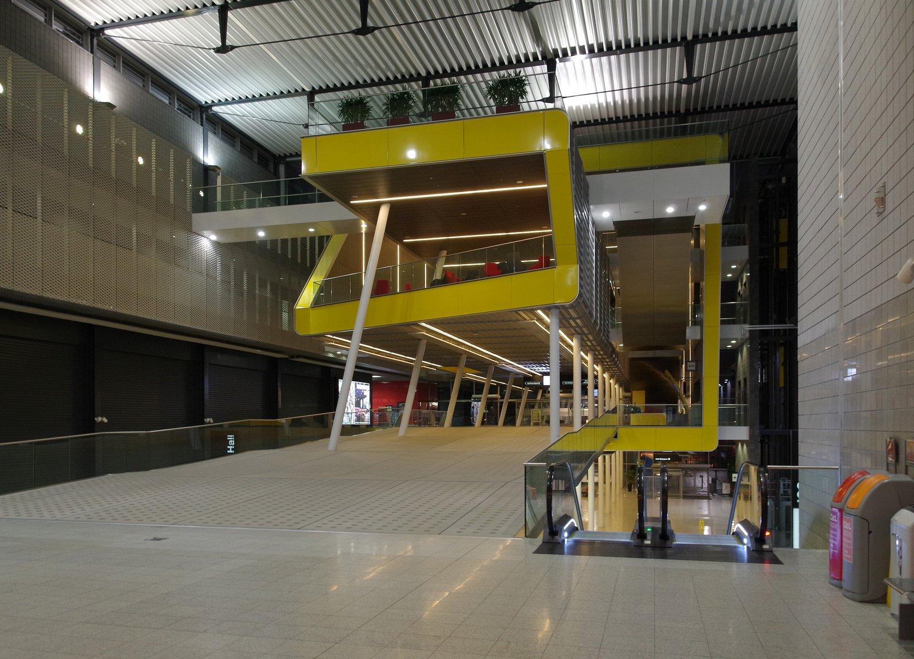

ExCeL London is a single building nearly a kilometre long, sitting between two DLR stations, with an Elizabeth line stop at one end and a cable car terminal a short walk from the other. Which of those you use depends entirely on which hall your event is in — get that wrong and the "five-minute walk" from the station becomes a fifteen-minute walk through the building.

*ExCeL's Waterfront side, on Royal Victoria Dock.*

> 💡 **The Short Version:** Custom House (Elizabeth line and DLR) serves the **West Entrance**; Prince Regent (DLR only) serves the **East Entrance and the ICC**. They're about a kilometre apart on foot. Parking is **£27.50 pre-booked / £30 on the day**, same price for Blue Badge holders, and the venue sits inside the **ULEZ** but outside the Congestion Charge zone. Cloakrooms are **free** but not guaranteed — it's down to the organiser of your event. Everything inside is **cashless**. For the show calendar, expect a different organiser and a different bag policy every time; there's no one venue-wide rule.

---

## Which station for which end

ExCeL was built long and thin along the north quay of Royal Victoria Dock, and the venue's own walking-distance guide for visitors makes the geometry explicit:

*Custom House station.*

*Prince Regent station.*

| Between | Distance |
| --- | --- |
| West Entrance and East Entrance | About 600m |
| Custom House station and Prince Regent station | About 1km, walking through the venue |
| Custom House and the West Entrance | About 200m |
| Prince Regent and the East Entrance | About 200m |
| Custom House and the Waterfront (Immerse LDN) | About 420m |

**Custom House** is the station for the West Entrance — it carries both the **Elizabeth line** and the **DLR**, and ExCeL's own advice is blunt about it: alight here for the west halls. **Prince Regent** is DLR only, and serves the **East Entrance and the ICC suites** (the Capital and Platinum Suites, used for conferences). Confirm which hall or suite your event is in before you travel — a west-hall show reached via Prince Regent means walking the better part of the building's length rather than the couple of hundred metres either station promises.

---

## Getting there from central London and the airports

Checked live against TfL's own journey planner, on a Sunday:

| From | Route | Time |
| --- | --- | --- |
| **Liverpool Street** | Elizabeth line, direct | **10 minutes** |
| **Tottenham Court Road** | Elizabeth line, direct | **16 minutes** |
| **Paddington** | Elizabeth line, direct | **21–24 minutes** |
| **Canary Wharf** | Elizabeth line, one stop | **About 3 minutes** (ExCeL's own figure) |
| **Bank** | DLR, changing at Poplar | **About 25 minutes** |
| **London City Airport** | Elizabeth line or DLR/bus | **5–13 minutes**, depending on the connection used |
| **Heathrow** | Elizabeth line, direct | **43 minutes** (ExCeL's own figure) |

The Elizabeth line is the quickest option from almost anywhere in central London, and it's a single train with no change from Liverpool Street, Paddington, Tottenham Court Road, Bond Street or Heathrow. Coming from the south or from stations only the DLR reaches, expect a change: the fastest route from Bank runs via the Northern line to Moorgate and a walk to Liverpool Street rather than straight through on the DLR, and a same-line DLR route via Poplar takes about 25 minutes.

**London City Airport** is close enough that ExCeL's own site calls it a 15-minute walk; by rail it's a handful of stops on the DLR or Elizabeth line, whichever a live journey planner offers first. International rail (Eurostar, Le Shuttle) and the other five London airports are all a further connection away — see our [London City Airport transport guide](/articles/london-city-airport-to-london/) for the full comparison.

Powered by <a target="_blank" rel="sponsored" href="https://www.getyourguide.com/london-l57/">GetYourGuide</a>

---

## The cable car and the river

**The London Cable Car** (sold and signed by ExCeL as the IFS Cloud Cable Car; TfL's own pages now just call it the London Cable Car) crosses the Thames from Greenwich Peninsula, by The O2, to a terminal in the Royal Docks a short walk from ExCeL's Waterfront. ExCeL's own site offers every exhibitor and visitor **50% off a walk-up fare** — £3.50 single instead of £7 — on presentation of a ticket or confirmation email. TfL's opening hours:

*The cable car crossing the docks.*

| Day | Hours |
| --- | --- |
| Mon–Thu | 08:00–21:00 (to 22:00 on Thursdays until 16 October 2026) |
| Friday | 09:00–22:00 |
| Saturday | 09:00–23:00 |
| Sunday and bank holidays | 09:00–21:00 |

> ⚠️ **It's an arrival option, not a reliable way home.** It closes before most evening events finish clearing the building, and it doesn't run all night on any day of the week.

**Uber Boat by Thames Clippers** calls at Royal Wharf Pier, opened in 2019 specifically to serve ExCeL, City Airport and the Royal Docks. It's on the East zone of the river network. Checked against the operator's own published timetable, the last **westbound** sailing towards central London leaves at **21:41 on weekdays** and **22:17 at weekends** — earlier than North Greenwich Pier further downstream, so it suits an early finish rather than a normal evening one. The pier is step-free, with a 162m² river-view platform; the nearest DLR stations for onward travel are West Silvertown or Pontoon Dock, not Custom House.

---

## Driving, parking and the low-emission zones

ExCeL runs its own on-site car park, pre-booked through the venue's own booking platform — the only way to guarantee a space. For the entrance, use postcode **E16 1FR** or what3words `///cheer.events.began`; access is via the A13 and Royal Albert Way only, not from Western Gateway or Seagull Lane.

| | Price |
| --- | --- |
| **Pre-booked, per day** | £27.50 |
| **Pay on the day** | £30 |
| **Blue Badge** | Same as standard — £27.50 pre-booked / £30 on the day |
| **Coach and minibus** (pre-booked only, west taxi rank) | £50 flat rate |
| **Motorcycles** | Free, not pre-bookable |

The car park takes vehicles up to **1.9m** without booking an over-height space, with a limited number of bays for vehicles up to **2.8m**. There are 134 Blue Badge bays across the west, east and waterfront zones, each 5.9m by 3.6m, and an £80 fine for a car parked in one without displaying a badge.

Two river crossings serve the car park's approach roads: the **Blackwall Tunnel**, the older and more delay-prone of the two, and the **Silvertown Tunnel**, which opened in April 2025 and gives an additional, tolled crossing from the Greenwich Peninsula side.

**Congestion Charge and ULEZ.** ExCeL sits well outside the Congestion Charge zone, which covers only central London and charges £18 a day (£21 if paid late) between 07:00–18:00 on weekdays and 12:00–18:00 at weekends. ULEZ is different: since 2023 it has covered every London borough with no boundary gap, so a car that doesn't meet the emissions standard pays the standard **£12.50 daily charge** to be anywhere near ExCeL, exactly as it would anywhere else in London.

---

## Inside ExCeL: bags, cash, food and wifi

Because ExCeL hosts a different organiser's event in every hall, there's no single venue-wide bag or security policy the way a single-tenant arena like The O2 has — check the specific event's own page for what it allows in. What does hold across the whole venue:

*Inside ExCeL's boulevard.*

- **Cashless throughout.** ExCeL's own food and drink pages state plainly that none of its outlets take cash — bring a contactless card or phone. Market Express, an Amazon "tap in, walk out" convenience store by hall entrance N10, works the same way.
- **Cloakrooms are free**, on Level 0 between hall entrances N4 and S4 and at the east end of Level 0, plus dedicated cloakrooms in the ICC's Capital and Platinum Suites — but availability depends on your event's organiser, and nothing can be stored overnight. Cameras, laptops and other electronics aren't accepted.
- **Free visitor wifi** covers the whole venue — look for "_Excel VISITOR ONLY Free Wi-Fi" and accept the terms. It's fine for browsing and messaging, not for anything that needs a stable connection like streaming or large uploads.
- **Water refill points** are by the East and West Entrances and near halls S4 and S7.
- **Food**: the sit-down option is **Waterfront Street Kitchen & Bar** on the dockside Waterfront, plus more than 20 counter-service kitchens along the boulevard — Habanero, Detroit City Burger, Chozen Noodle, Bagel Factory, Costa Coffee and Subway among them. Outside the gates, the Royal Victoria Dock waterfront and Custom House both have further options within a few minutes' walk.
- **Power banks** can be rented from Joos units along the boulevard: £2 for the first hour, capped at £4 a day, or £30 to buy outright.

---

## Accessibility

Both stations serving ExCeL are step-free — TfL's own step-free map confirms Custom House and Prince Regent — and inside the venue, every floor is level once you're through the entrance ramps.

- **Wheelchairs and mobility scooters** can be hired free of charge, subject to availability, booked through ExCeL's own mobility-aid site.
- **Changing Places** facilities, with a toilet, sink and hoist, are at the East (Prince Regent) end on Level 1 and in the Maritime Suite on Level 0, both on a RADAR key.
- **Hearing loops** are fitted at information desks, cloakrooms and the security and traffic offices.
- **Blue Badge parking** is available across all zones of the car park at the standard rate (see above), with dedicated wide bays and step-free routes into the building.
- ExCeL recognises the **Hidden Disabilities Sunflower** scheme, and assistance dogs are welcome throughout.

---

## Big shows here through the year

ExCeL runs almost entirely on trade and B2B events, but a handful of shows each year are open to the public: [MCM Comic Con](/articles/mcm-comic-con-london/) in October, New Scientist Live, the London International Horse Show in December and Grand Designs Live in spring among them. The [upcoming public shows](#whats-on-excel-london) are listed at the foot of this page with their dates, and our [exhibitions and conventions calendar](/articles/exhibitions-conventions-london/) covers every London venue.

Powered by <a target="_blank" rel="sponsored" href="https://www.getyourguide.com/london-l57/">GetYourGuide</a>

---

## Where to stay

A handful of hotels sit on the ExCeL campus itself or across Royal Victoria Dock, all trading on prices that track the exhibition calendar rather than the season — a quiet week is cheap, a big trade show is not.

- **[Aloft London ExCeL](hotel:aloft-london-excel)** — a minute's walk from the East Entrance and the ICC on the Eastern Gateway, with an indoor pool.
- **[DoubleTree by Hilton London – ExCeL](hotelscom:218082)** — the other hotel ExCeL's own site names as part of the campus.
- **[Novotel London ExCeL](hotelscom:h992650)** — on Western Gateway, three minutes' walk from Custom House, with sofa-bed rooms for families.
- **[Premier Inn London Docklands (ExCeL)](https://www.premierinn.com/gb/en/hotels/england/greater-london/london/london-docklands-excel.html)** — at 2 Festoon Way, Royal Victoria Dock, and pitched by Premier Inn itself as the pit-stop for ExCeL, City Airport or Canary Wharf.
- **[Sunborn London](hotelscom:463416)** — a superyacht moored for good on the dock, with 133 rooms and five suites, every one facing the river or the dock.
- **[Good Hotel London](hotel:good-hotel-london)** — a floating, social-enterprise hotel on the Western Gateway, under five minutes from Royal Victoria DLR and Custom House.

Our [hotels near ExCeL guide](/articles/where-to-stay-near-excel/) sorts the hotels by the entrance they're nearest, adds Canary Wharf and Woolwich one Elizabeth line stop away and the cheapest chains a few DLR stops out, and gives the last train back after an evening event.

---

## Before or after: the Royal Docks and Canary Wharf

- **Royal Victoria Dock** itself is the view from ExCeL's Waterfront side — a working dock turned public space, with the cable car's Royal Docks terminal at one end.
- **The London Cable Car** (see above) makes a short, scenic crossing to North Greenwich and The O2 — see our [O2 travel guide](/articles/the-o2-travel-guide/) for what's on the other side.
- **WakeUp Docklands**, a cable wakeboard park in the Royal Docks, runs from the water ExCeL backs onto.
- **Immerse LDN**, an immersive exhibitions venue on the Waterfront about 400m from the West Entrance, runs a changing programme of ticketed shows.
- **City Hall** — the striking glass-and-steel building on the dock that many guides still call by its old name, The Crystal, isn't the sustainability exhibition it once was. The Greater London Authority moved its headquarters there in January 2022, and it's now the Mayor and London Assembly's base rather than a visitor attraction.
- **Canary Wharf** is one Elizabeth line stop away — about 3 minutes — for the roof garden, Eden Dock and the restaurants at Wood Wharf; see our [Canary Wharf area guide](/articles/canary-wharf-area-guide/).
- **London City Airport** is a 15-minute walk or a couple of DLR stops, if you're flying in or out around your visit.

---

## Small print that catches people out

- **Postcodes:** ExCeL and its car park, **E16 1FR**; the venue's management office, **E16 1XL**.
- **Custom House serves the west halls, Prince Regent the east halls and the ICC** — a kilometre apart, so check which end your event is in before you travel.
- **The whole venue is cashless.** Bring a contactless card.
- **Bag and cloakroom policy is set per event, not by ExCeL as a whole** — check your specific show's own page.
- **Blue Badge parking costs the same as standard parking here** — £27.50 pre-booked, £30 on the day.
- **ULEZ applies; the Congestion Charge doesn't.**

---

## Continue planning your London trip

- ✈️ **[London City Airport to London](/articles/london-city-airport-to-london/)** — the full transport comparison for the nearest airport
- 🏙️ **[Canary Wharf Area Guide](/articles/canary-wharf-area-guide/)** — one Elizabeth line stop from Custom House
- 🎤 **[The O2 Travel Guide](/articles/the-o2-travel-guide/)** — the cable car's other terminal, and London's other major venue
- 🛏️ **[Where to Stay Near ExCeL](/articles/where-to-stay-near-excel/)** — hotels by entrance, and the last train back
- 🛏️ **[Where to Stay Near Canary Wharf](/articles/where-to-stay-canary-wharf/)**
- 🛏️ **[Where to Stay Near The O2](/articles/where-to-stay-near-the-o2/)** — covers the Royal Docks side too
- 🎟️ **[Exhibitions and Conventions in London](/articles/exhibitions-conventions-london/)** — the year-round calendar
- 💷 **[London Transport Costs and Fares](/articles/london-public-transport-costs-and-fares/)**

---

*Figures come from ExCeL London's own site (getting here, parking, accessibility, food and drink and FAQ pages), Transport for London's journey planner and its published Congestion Charge and ULEZ pages, Uber Boat by Thames Clippers' own pier and timetable pages, and each show's own organiser site, checked the week of 27 September 2026. Journey times were checked live against TfL's journey planner on a Sunday and will vary by day and disruption. Show dates and prices are set by each organiser and change; check before booking.*
