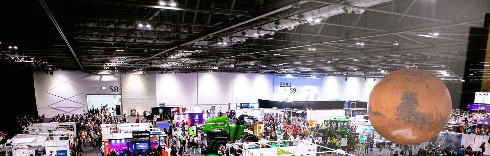
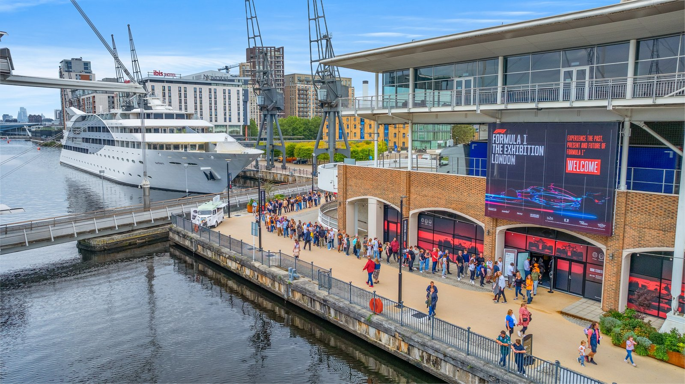
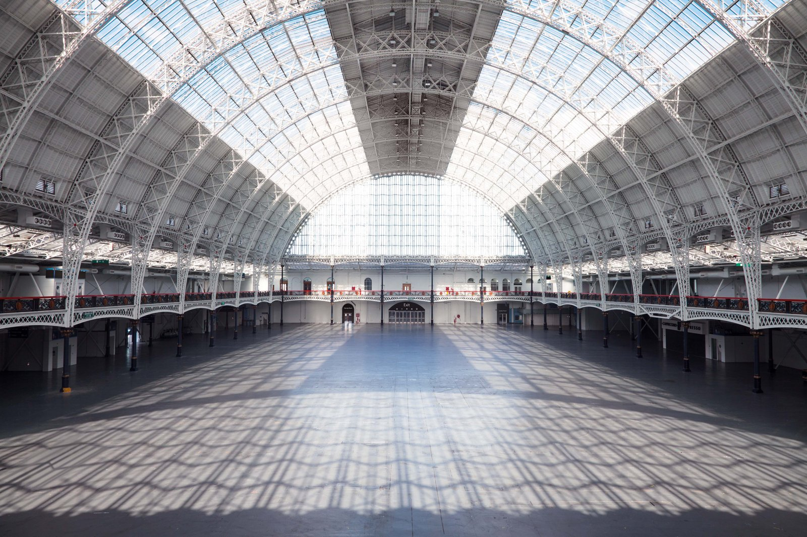
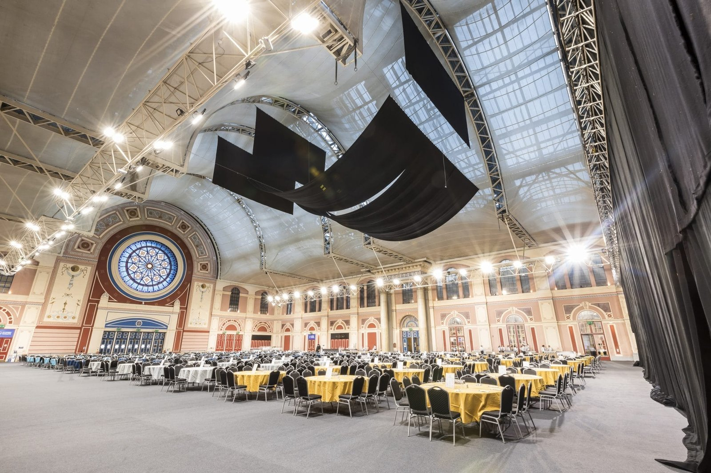
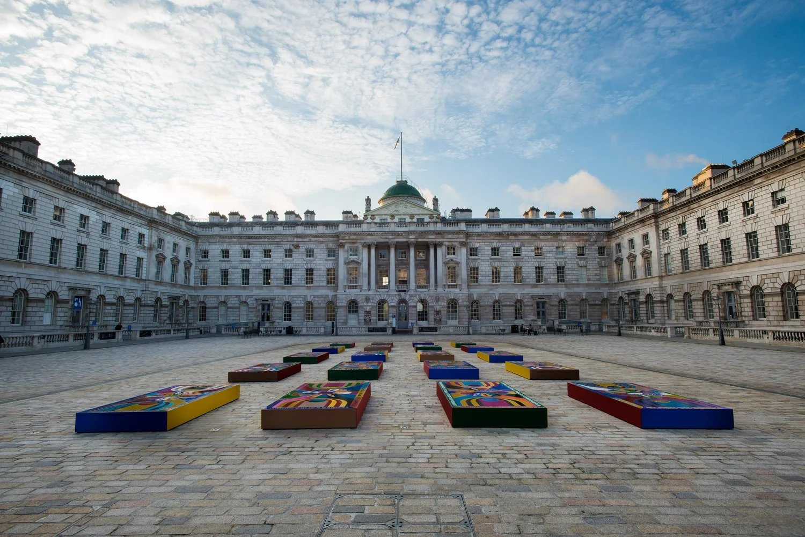
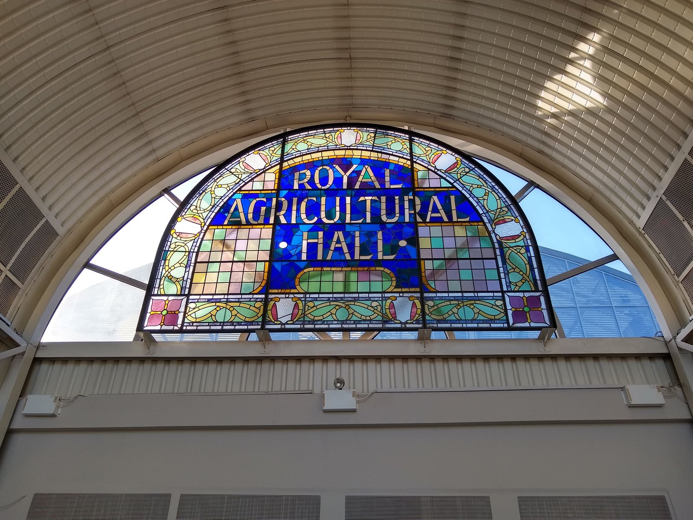

MCM Comic Con sells its Weekend ticket and both VIP tiers more than a month before the doors open. Frieze Week puts five ticketed art fairs across two royal parks and a Georgian courtyard on the same four days. New Scientist Live tells you on its own site how much you save by not leaving it to the day. This is the calendar behind all of it — every public exhibition, convention, consumer show and fair in Greater London from October 2026 to September 2027, at ExCeL, Olympia, Alexandra Palace, Somerset House and beyond.

> 💡 **The Short Version:** **[MCM Comic Con London](https://www.mcmcomiccon.com/london/en-us.html)** — billed by its organiser as the UK's biggest — runs **23 to 25 October** at **ExCeL**, from £29; its Weekend and VIP tiers are already sold out. **[Frieze London & Frieze Masters](https://www.frieze.com/fairs/frieze-london)** take over **Regent's Park 14 to 18 October**. **[New Scientist Live](https://live.newscientist.com/)** is at ExCeL **10 to 11 October**, and its own site advertises up to **44% off** final-release tickets against paying on the door. The **[Ideal Home Show](https://www.idealhomeshow.co.uk/)** returns to **Olympia 2 to 11 April 2027**. For ExCeL, use **Custom House** (Elizabeth line and DLR) for the west halls or **Prince Regent** (DLR) for the east halls and the ICC; for Olympia, use **Kensington (Olympia)** — London Overground's Mildmay line, plus a District line shuttle from High Street Kensington at weekends.

## The calendar, month by month

Dates and prices come from each show's own organiser site, checked the week of 27 September 2026. A show that sells tiered tickets — MCM Comic Con, Musical Con — can have its cheapest tickets gone well before the date below; check the organiser's own page before you plan around a specific tier.

### October 2026

| Show | Venue | Dates | From | What it is |
| --- | --- | --- | --- | --- |
| **AnimeCon London** | Olympia London | 3–4 Oct | £25 | The UK's biggest anime and manga convention, per its organiser: anime, manga, J-Pop, K-Pop and fashion, two days. |
| **Knit + Stitch** | Alexandra Palace | 8–11 Oct | £15.50 | The venue's own billing calls it the UK's biggest textile craft exhibition — 300-plus specialist suppliers under one roof. |
| **New Scientist Live** | ExCeL London | 10–11 Oct (public days); Schools' Day 12 Oct | — | Four stages of talks and a show floor; see [science events in London](/articles/science-events-london/) for the full speaker list. |
| **Open Studios** | Alexandra Palace & artists' own studios | 10–11 Oct | Free | Seventy-plus Muswell Hill and Alexandra Park artists open their studios for the weekend. |
| **Frieze London & Frieze Masters** | The Regent's Park | 14–18 Oct | ~£38 weekend | Two ticketed fairs at opposite ends of the park — contemporary work at Frieze London, antiquity to the late 20th century at Frieze Masters — linked by a free shuttle. |
| **Affordable Art Fair — Battersea Autumn** | Battersea Park | 14–18 Oct | — | One of Frieze Week's satellite fairs, aimed at collectors buying their first pieces rather than six-figure lots. |
| **1-54 Contemporary African Art Fair** | Somerset House | 15–18 Oct (15th is a ticketed preview) | £18–£32 | Its 14th edition: contemporary African and diaspora galleries filling Somerset House's wings and courtyard. |
| **National Wedding Show** | ExCeL London | 17–18 Oct | — | Wedding suppliers and showcases under one roof. |
| **Musical Con** | ExCeL London | 17–18 Oct | £45–£49 day | Meet-and-greets and masterclasses with West End cast members; several ticket tiers already sold out. |
| **Home, Life & You LIVE** | ExCeL London | 17–18 Oct | — | Home, lifestyle and gardening exhibitors and demonstrations. |
| **London Snow Show** | Olympia London | 17–18 Oct | — | A ski and snowsports consumer show. |
| **Vegan Life Live / OM Yoga Show / Mind Body Soul Experience** | Alexandra Palace | 16–18 Oct | — | Three co-located shows on one ticket: plant-based food, yoga and wellbeing. |
| **UK Black Business Week & Show** | ExCeL London | 13–17 Oct (public day: Sat 17) | £45–£65 | A week of business networking and awards; the Saturday alone is open on a consumer day pass. |
| **AI LIVE** | Olympia London | 20–21 Oct | £295 | AI industry talks and a show floor, openly ticketed rather than trade-gated. |
| **MCM Comic Con London** | ExCeL London | 23–25 Oct | £29 | See the Short Version above; full detail in [things to do in London in October](/articles/things-to-do-in-london-in-october/). |
| **The Baby Show** | Olympia London | 23–25 Oct | — | Pregnancy through to toddler care, exhibitors and talks. |

### November 2026

| Show | Venue | Dates | From | What it is |
| --- | --- | --- | --- | --- |
| **Spirit of Christmas Fair** | Olympia London | 2–8 Nov | £25.75 | Independent traders, festive shopping and food under the Grand Hall's roof. |
| **The Luxury Travel Fair** | Olympia London | 5–8 Nov | £25.75 | High-end travel operators and destination showcases. |
| **Wundrful World of Christmas** | ExCeL London | 11 Nov–24 Dec | £29.90–£34.90 | A meet-Santa experience rather than a market — off-peak and peak pricing tiers. |
| **What University? & What Career? Live** | Olympia London | 13–14 Nov | Free | Careers and university-choice advice for school leavers. |
| **Collectors Showcase** | Olympia London | 21–22 Nov | £5 | Rare cards, comics and memorabilia. |
| **The Ideal Christmas Show** | Olympia London | 26–29 Nov | £14 | Festive shopping, run alongside the Cake & Bake Show, whose own 2026 dates aren't confirmed yet. |

### December 2026

| Show | Venue | Dates | From | What it is |
| --- | --- | --- | --- | --- |
| **London Perfume Exhibition** | ExCeL London | 10–13 Dec | — | Fragrance brands and independent perfumers; the first London edition of this show. |
| **London International Horse Show** | ExCeL London | 17–21 Dec | £37.95 | The traditional Christmas showjumping fixture. |
| **Scrooge: Cirque Extravaganza** | ExCeL London | 23–28 Dec | £23–£28 off-peak | A festive circus and theatre show, minimum four tickets for family pricing. |

*Winter Funland London, Olympia's own indoor Christmas experience, last ran 19 to 24 December 2025; its 2026 dates aren't announced yet — see the table below.*

### January 2027

| Show | Venue | Dates | From | What it is |
| --- | --- | --- | --- | --- |
| **MegaCon Live (London)** | ExCeL London | 23–24 Jan | £24–£25 | A gaming, anime and pop-culture convention; weekend tickets cover ages 10 and up. |

*Destinations: The Holiday & Travel Show and The British & International Franchise Exhibition both usually run at Olympia in late January; neither has announced 2027 dates yet.*

### February 2027

| Show | Venue | Dates | From | What it is |
| --- | --- | --- | --- | --- |
| **Motorsport Expo** | ExCeL London | 26–28 Feb | £20 (race-licence holder) | Billed by its organiser as the UK's biggest indoor live motorsport experience; 200-plus exhibitors. |
| **Car Culture UK** | ExCeL London | 27–28 Feb | — | A curated indoor automotive showcase, run by the same organiser as Motorsport Expo on overlapping dates. |

*London Career Forum and London Comic Con Spring both usually run at Olympia in late February; neither has announced 2027 dates yet.*

### March 2027

| Show | Venue | Dates | From | What it is |
| --- | --- | --- | --- | --- |
| **MOVE IT** | ExCeL London | 19–21 Mar | £34.65 | Billed by its organiser as the UK's largest dance exhibition — a class programme plus performances across four stages. |
| **Agentic Expo** | Olympia London | 23–24 Mar | £99 + VAT | Billed by its organiser as the world's first trade exhibition for market-ready AI agents; openly ticketed. |

*Affordable Art Fair's Battersea Park spring edition returns "Coming March 2027" per the organiser's own site, which hasn't published exact dates yet — its 2026 run was 4 to 8 March.*

### April 2027

| Show | Venue | Dates | From | What it is |
| --- | --- | --- | --- | --- |
| **Ideal Home Show** | Olympia London | 2–11 Apr | — | A long-running annual fixture at Olympia, billed by its organiser as the UK's biggest home, garden and lifestyle consumer show. |
| **Grand Designs Live (London)** | ExCeL London | 30 Apr–3 May | £16 | Self-build, renovation and home-improvement, running into the first days of May. |

### Dates not announced yet

These recur every year, but the organiser hadn't set next in-window dates as of 27 September 2026. Check the link before planning around any of them.

| Show | Venue | Last confirmed | What it is |
| --- | --- | --- | --- |
| **[The Cake & Bake Show](https://www.olympia.co.uk/events/the-cake-bake-show)** | Olympia London | 26–30 Nov 2025 | Baking demonstrations and exhibitors, usually alongside the Ideal Christmas Show. |
| **[Winter Funland London](https://www.olympia.co.uk/events/winter-funland)** | Olympia London | 19–24 Dec 2025 | An indoor Christmas experience. |
| **[Destinations: The Holiday & Travel Show](https://www.olympia.co.uk/events/destinations-the-holiday-travel-show)** | Olympia London | 29 Jan–1 Feb 2026 | Travel inspiration, advice and deals. |
| **[The British & International Franchise Exhibition](https://www.franchiseinfo.co.uk/franchise-exhibitions/the-british-international-franchise-exhibition/)** | Olympia London | 30–31 Jan 2026 | Free entry, for aspiring business owners. |
| **[London Career Forum](https://careerforum.net/en/event/ldn/)** | Olympia London | 21–22 Feb 2026 | Free careers and job fair. |
| **[London Comic Con Spring](https://www.londoncomicconspring.com/)** | Olympia London | 28 Feb–1 Mar 2026 | The spring counterpart to ExCeL's autumn MCM Comic Con. |
| **[Collect](https://www.craftscouncil.org.uk/collect-fair)** | Somerset House | 27 Feb–1 Mar 2026 | The Crafts Council's fair for museum-quality contemporary craft and design; 14th edition, up to 40 galleries. |
| **[Affordable Art Fair — Battersea Spring](https://affordableartfair.com/fairs/london-battersea-spring/)** | Battersea Park | 4–8 Mar 2026 | Confirmed for "March 2027" on the organiser's site; exact dates to follow. |
| **[Ceramic Art London](https://www.olympia.co.uk/events/ceramic-art-london)** | Olympia London | 8–10 May 2026 | 120-plus exhibitors, a contemporary ceramics fair. |
| **[Photo London](https://www.olympia.co.uk/events/photo-london)** | Olympia London | 13–17 May 2026 | A contemporary and classic photography fair. |
| **[Affordable Art Fair — Hampstead](https://affordableartfair.com/fairs/london-hampstead/)** | Hampstead Heath | 6–10 May 2026 | Confirmed for "May 2027" on the organiser's site; exact dates to follow. |
| **[London Tech Week](https://londontechweek.com/)** | Olympia London | 8–10 Jun 2026 | A London-wide tech festival; Olympia hosts part of the programme. |
| **[Hyper Japan](https://hyperjapan.co.uk/festival/)** | Olympia London | 24–26 Jul 2026 | Billed by its organiser as the UK's biggest J-Culture celebration — anime, manga, cosplay, J-Pop and street food. |
| **[British Art Fair](https://www.saatchigallery.com/exhibition/british-art-fair-2026)** | Saatchi Gallery | 24–27 Sep 2026 | Billed by its organiser as the only UK fair dedicated exclusively to Modern and Contemporary British art. |
| **[London Design Festival](https://www.londondesignfestival.com/)** | V&A and design districts citywide | 12–20 Sep 2026 | Its 24th edition; most of the programme is free, covered for 2026 in [things to do in London in September](/articles/things-to-do-in-london-in-september/). |

## The shows, by type

### Comics, gaming and anime

**[MCM Comic Con London](https://www.mcmcomiccon.com/london/en-us.html)** at ExCeL (23–25 October) is the big one — the organiser's own billing calls it the UK's biggest, and its cheapest tickets go first. **AnimeCon London** at Olympia (3–4 October) is the dedicated anime and manga event, and **MegaCon Live** at ExCeL (23–24 January) covers gaming and pop culture in the new year. EGX, the sister gaming show once held separately, appears to have been folded into MCM for London — its own site now lists no standalone London date.

### Tech and science

**New Scientist Live** at ExCeL (10–11 October) is the consumer science event, four stages of talks with a show floor. **AI LIVE** (Olympia, 20–21 October) and **Agentic Expo** (Olympia, 23–24 March) are both openly ticketed AI conferences rather than trade-gated, despite Olympia listing them as trade shows.

*New Scientist Live's show floor.*

### Home, garden and food

**The Ideal Home Show** at Olympia (2–11 April 2027) is the fixture — a long-running annual show there, billed by its organiser as the UK's biggest for home, garden and lifestyle. **Grand Designs Live** follows straight after at ExCeL (30 April–3 May), and **Home, Life & You LIVE** (ExCeL, 17–18 October) covers the same ground earlier in the year.

### Art and design fairs

**Frieze London and Frieze Masters** (Regent's Park, 14–18 October) are the ones the rest of Frieze Week orbits, with the free **Frieze Sculpture** running for weeks either side with no ticket needed. **1-54 Contemporary African Art Fair** (Somerset House, 15–18 October) and the **Affordable Art Fair** (Battersea Park, 14–18 October, plus spring and a third London edition on Hampstead Heath) are the other two fixtures worth building a weekend around.

### Crafts

**Knit + Stitch** at Alexandra Palace (8–11 October) is the one the venue itself calls the UK's biggest textile craft exhibition, 300-plus specialist suppliers. **Ceramic Art London** (Olympia, last run 8–10 May 2026) and **Collect** (Somerset House, the Crafts Council's museum-quality craft and design fair) are the other two, though neither has 2027 dates yet.

### Travel, careers and weddings

**The National Wedding Show** (ExCeL, 17–18 October) and **The Luxury Travel Fair** (Olympia, 5–8 November) cover weddings and travel respectively. **What University? & What Career? Live** (Olympia, 13–14 November) is free and aimed at school leavers.

### Christmas fairs

**Spirit of Christmas Fair** (Olympia, 2–8 November) and **The Ideal Christmas Show** (Olympia, 26–29 November, alongside the Cake & Bake Show) are the shopping fairs. **Wundrful World of Christmas** (ExCeL, 11 November–24 December) is a meet-Santa experience rather than a market, and **Scrooge: Cirque Extravaganza** (ExCeL, 23–28 December) is a festive circus. Our [Christmas shows in London guide](/articles/christmas-shows-london/) covers the theatre and lights side of the season.

## The venues

- **[ExCeL London](/articles/excel-london-guide/)** — Royal Docks. **Custom House** (Elizabeth line and DLR) serves the west halls, **Prince Regent** (DLR) the east halls and the ICC — a kilometre apart, so check which end your show is in before you travel. Almost entirely trade and B2B events; the consumer shows above are the exceptions. For a room, our [hotels near ExCeL guide](/articles/where-to-stay-near-excel/) sorts them by the entrance they're nearest and gives the last train back after an evening session.
- **Olympia London** — Kensington. **Kensington (Olympia)** station: London Overground's Mildmay line calls regularly, and the District line runs a shuttle from High Street Kensington every 20 minutes at weekends and public holidays, plus some weekdays when a show is on.
- **Alexandra Palace** — Muswell Hill/Wood Green, north London. Nearest stations are **Alexandra Palace** (Great Northern rail from Moorgate or King's Cross) and **Wood Green** tube (Piccadilly line); the W3 bus also stops at the Palace itself.
- **Somerset House** — the Strand. Nearest stations **Temple** (District and Circle lines, closed Sundays) and **Embankment**; the fairs use the courtyard and the wings around it.
- **Business Design Centre** — Islington, in the former Royal Agricultural Hall. Nearest station **Angel** (Northern line). Runs a dense year-round mix of trade and public exhibitions across sectors from art and design to fashion — check its own listings, filterable by public or trade, before booking.

*ExCeL London, on the Royal Docks.*

*Olympia London's Grand Hall.*

*The Great Hall at Alexandra Palace.*

*The courtyard at Somerset House.*

*The Business Design Centre's Royal Agricultural Hall window.*

---

> 🧭 **Plan the rest of it:** [Things to do in October](/articles/things-to-do-in-london-in-october/) · [Things to do in September](/articles/things-to-do-in-london-in-september/) · [Science events in London](/articles/science-events-london/) · [Christmas shows in London](/articles/christmas-shows-london/) · [What's On in London](/whats-on/) · [ExCeL London travel guide](/articles/excel-london-guide/) · [Where to stay near ExCeL](/articles/where-to-stay-near-excel/) · [Where to stay near Kensington](/articles/where-to-stay-kensington/) · [Where to stay near Canary Wharf](/articles/where-to-stay-canary-wharf/)

*Dates, prices and ticket availability come from each show's own organiser site and, for shows at Olympia, Somerset House and Alexandra Palace, the venue's own listings, checked the week of 27 September 2026. Shows change their dates and sell out tiers without much notice — check the organiser's own page before you book.*
