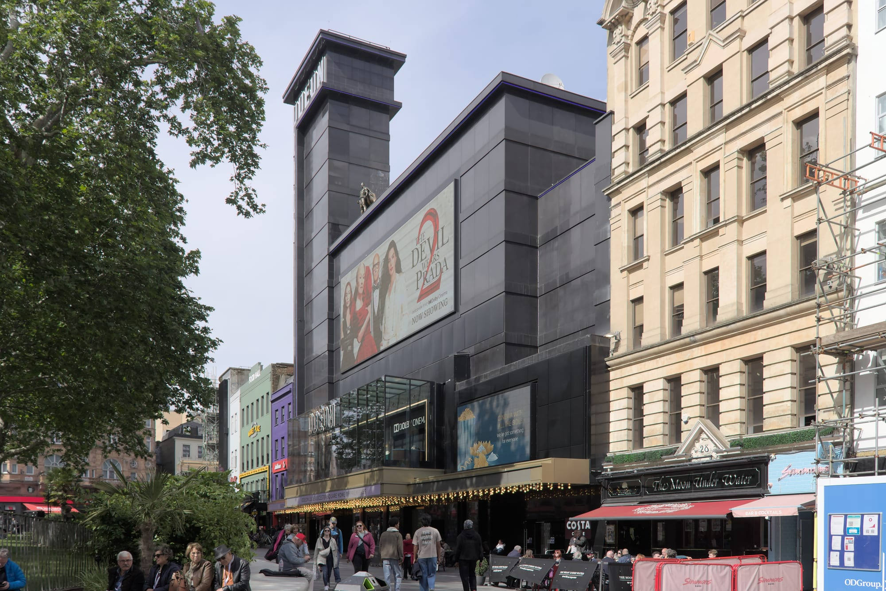

**Most London film premieres are invitation only, and a few are not.** The public routes in are free fan-pen places released one premiere at a time, ballots some studios run, and the handful of premieres that sell tickets.

> 💡 **The Short Version:** The main free route is **Applause Store**, which posts **fan-pen invitations beside the red carpet** for individual premieres. **Photo ID** is usually checked for **everyone in the party**, and the London examples were **16+ or 18+**. Some studios run their own **fan-zone ballot**. To see the film too, the **Royal Film Performance** (from **£150**) and the **London Film Festival galas** (**£21 to £30**) sell tickets. Resellers advertise premiere access at **£1,999 to £4,000**. The working habit is to **register interest on Applause Store** and watch for the email.

*Prices, ages and ID rules are the 2026 figures from Applause Store, the Film and TV Charity and the BFI.*

---

## Where London premieres happen

**Leicester Square** is the home of the big ones. Odeon, Cineworld and Vue each have a cinema on the square, and a gated-off section of the square usually means a premiere that evening, according to [London World](https://www.londonworld.com/whats-on/leicester-square-movie-premieres-london-tickets-times-fan-zones-4949033). Applause Store's listings show the pattern:

- **Cineworld Leicester Square (IMAX)** hosted the London global premiere of *Your Fault*, with dedicated fan pens alongside the red carpet. Winners also got a seat in the IMAX screening. Minimum age 16.
- **Curzon Mayfair** hosted the world premiere of the Victoria Beckham Netflix documentary series. The fan-pen invitations were for the red carpet only, and the minimum age was 18.
- **Royal Festival Hall**, on the South Bank, hosts the BFI London Film Festival galas. See the [London Film Festival guide](/articles/london-film-festival/).

Not every Applause premiere is in London: the world premiere of *Peaky Blinders: The Immortal Man* was in Birmingham. Check the venue before you accept.

*Odeon Luxe Leicester Square. Photo: [Aethonatic](https://commons.wikimedia.org/wiki/File:Odeon_Leicester_Square_-_17_May_2026.jpg), [CC0](https://creativecommons.org/publicdomain/zero/1.0/).*

## Four ways in

### 1. Free fan-pen places from Applause Store

[Applause Store](https://www.applausestore.com/) is a free ticket site best known for TV audiences, and its **Film Premiere and Events team** also runs red carpet fan pens. A fan pen is a viewing area beside the carpet, where you watch the stars arrive and the press interview them. A listing shows the film, the venue, the minimum age and whether winners also get a seat in the screening.

On a listing, choose **Register Interest**: Applause emails you when it releases more red carpet events. Create the account first, with the name exactly as it appears on your ID. Applause allows one account each and bans duplicates.

### 2. Studio fan-zone ballots

Some studios run their own. London World reported in January 2025 that for the Warner Bros premieres of *Beetlejuice Beetlejuice* and *Joker: Folie à Deux* in Leicester Square, fans could sign up to a ballot for fan-zone access, with winners drawn at random. Follow a film's official accounts to catch its ballot.

### 3. Premieres with tickets

- **The Royal Film Performance** is the charity premiere in Leicester Square. The 2026 edition, the world premiere of *Digger* on Tuesday 22 September 2026, sold tickets from **£150 before fees** through the [Film and TV Charity](https://filmtvcharity.org.uk/get-involved/royal-film-performance/) on Eventbrite. It was black tie, with no photography in the screens and no cloakroom.
- **BFI London Film Festival galas** are on public sale through the BFI. In 2026 they were **£21 to £30**, and the Opening Night Gala was a £1,000 ticket with red carpet arrival included. The full price list is in the [London Film Festival guide](/articles/london-film-festival/).

### 4. Resellers

Resellers such as Cornucopia Events advertise premiere access at **£1,999 to £4,000**.

## On the day

**Timings.** Applause sets the arrive-by time on your ticket. For a weekday premiere, London World's Leicester Square guide gives the shape: the carpet fills from about 5pm, and the main stars walk it from about 5.45pm to 6.30pm.

**How early.** Entry to a pen is first come, first served, and Applause says you cannot save a place: your whole party must be there to join the queue. An independent premiere guide puts the arrival at three to six hours early for a major blockbuster, two to three for a popular film and one to two for a smaller one.

**ID.** Applause says every guest must bring photo ID at higher-profile events such as premieres. It accepts a passport, driving licence, PASS card, Freedom Pass, Biometric Residence Permit or Citizen's Card. Photos and scans are refused, and an out-of-date ID passes if the photo still clearly looks like you.

**Age.** Set per premiere: 16+ for *Your Fault*, 18+ for the Victoria Beckham series. Applause requires 12 to 17-year-olds to be with an adult.

**Resale.** Applause says anyone found selling or advertising a free ticket has it voided, and may face formal proceedings.

**Autographs.** Applause's FAQ says a handshake or autograph from a star cannot be promised.

**What a viewing area can ban.** BAFTA's red carpet area in 2024 had no cover, no seating, no toilets and no bag storage, and allowed no re-entry. The [BAFTA red carpet guide](/articles/bafta-red-carpet/) has the full list.

## Finding the next one

- **Applause Store**: register interest on every premiere listing, and on the BAFTA red carpet listing.
- **Leicester Square itself**: a gated-off section means an event that evening.
- **The film's official accounts**: the place to catch a studio ballot.

More London ceremonies and big nights, and which ones the public can get into, are in [award ceremonies in London](/articles/award-ceremonies-london/).

---

## Continue planning your London trip

- 🏆 **[Award ceremonies in London](/articles/award-ceremonies-london/)** — which nights the public can get into, and how
- 🎞️ **[BFI London Film Festival](/articles/london-film-festival/)** — galas, prices and sold-out routes
- 🌟 **[BAFTA Red Carpet Tickets](/articles/bafta-red-carpet/)** — free fan-pen places outside the Royal Festival Hall
- 📺 **[Free TV and Radio Tickets in London](/articles/free-tv-show-tickets-london/)** — the same Applause Store account, for studio audiences
- 🎬 **[The Best Cinemas in London](/articles/best-cinemas-london/)** — where to watch the film once it is out
