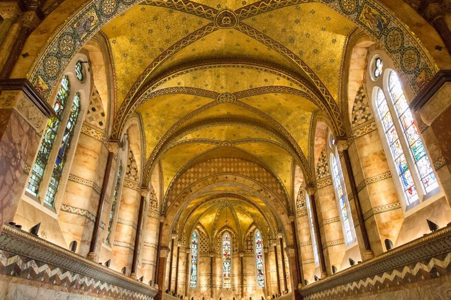
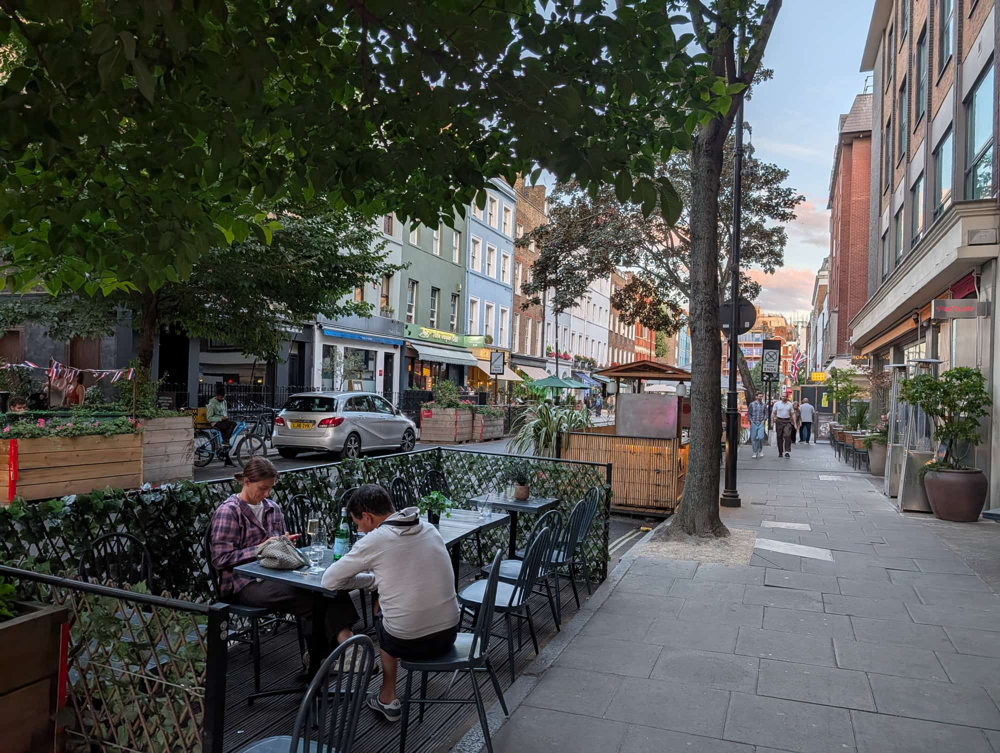
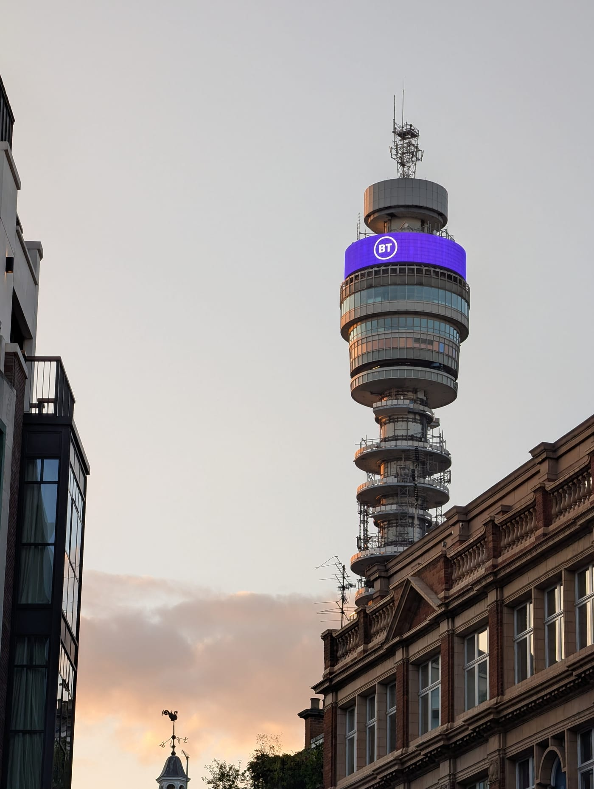
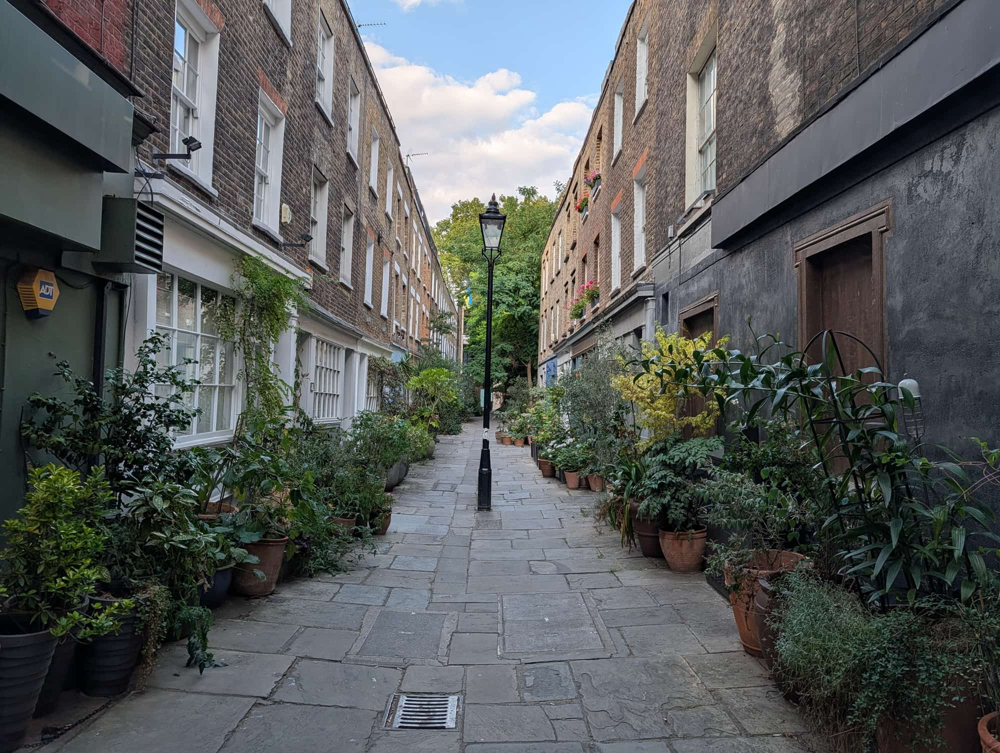
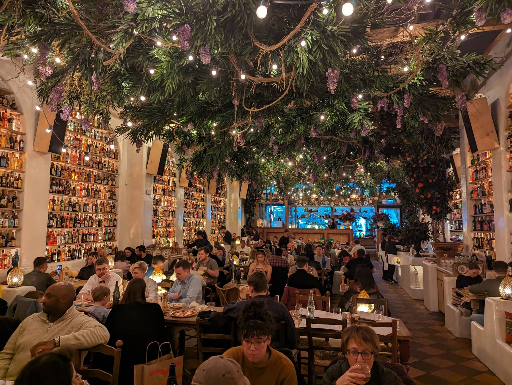

Fitzrovia has no famous sight, no market and no reason to appear on a first-time itinerary. It is also, street for street, the best place to eat in central London.

The area is a rough square between [Oxford Street](/articles/shopping-in-london/#oxford-street-and-the-big-three) and Euston Road, walked through constantly by people going somewhere else. Look up and it is Georgian terraces and the BT Tower. Look at street level on Charlotte Street or Goodge Street and it is thirty years of restaurant history stacked side by side.

Fitzrovia has its own share of the commemorative plaques marking where notable people lived or worked - see them on our [interactive map](/plaques/?area=fitzrovia).

## Why visit — and who should skip it

**Come here if** you want dinner. Fitzrovia holds more good restaurants across more cuisines than any comparable patch of central London, and unlike Soho you can usually get a table.

**Skip it if** you are on a three-day trip and want sights. There is no headline attraction here. Walk through it on your way between Oxford Street and the British Museum, note where you would like to eat, and come back in the evening.

## Top sights and activities

1. **Charlotte Street** — The restaurant street, and the reason most people come. Pavement tables in summer, and a run of dining rooms that goes back decades.
2. **The BT Tower** — London's tallest building from 1964 to 1980, and still the thing you navigate by. Closed to the public; sold in 2024 with plans to become a hotel.
3. **Fitzroy Square** — A Georgian square with Robert Adam frontages on two sides, pedestrianised and almost always empty. Virginia Woolf and George Bernard Shaw both lived on it.
4. **The Fitzroy Tavern** — The pub that gave the area its name. George Orwell and Dylan Thomas drank here in its bohemian heyday.
5. **The Fitzrovia Chapel** — The last surviving fragment of the Middlesex Hospital, which was demolished around it. A plain brick exterior on Pearson Square hides a ceiling of gold mosaic. Free, no booking, but open only about three days a week.

*Nothing on the plain brick exterior gives this away. Photo: [The wub](https://commons.wikimedia.org/w/index.php?curid=44693137), [CC BY-SA 4.0](https://creativecommons.org/licenses/by-sa/4.0/).*
6. **All Saints, Margaret Street** — A Victorian Gothic church by William Butterfield, and one of the most intensely decorated interiors in London. Small, free, and easy to walk straight past.
7. **Goodge Street** — The other eating street, and the more casual of the two.
8. **The Wellcome Collection** — Technically on the Bloomsbury edge at Euston Road, free, and genuinely strange. Worth the ten-minute walk.

## Key streets and micro-districts

### Charlotte Street

*Charlotte Street in the evening. The pavement widens here specifically to take the tables.*

The spine. Restaurants along most of its length, pavement seating in summer, and the Charlotte Street Hotel at the southern end.

### Goodge Street
Running east to west across the middle. More casual than Charlotte Street — counters, cafes and lunch places rather than dining rooms.

### Fitzroy Square and the north

*The BT Tower from street level. It is the landmark you navigate Fitzrovia by, and you cannot go up it.*

Quiet Georgian streets between the square and Euston Road. Almost entirely residential and worth a short detour for the architecture.

### Rathbone Place and Newman Street

*Colville Place, a pedestrian lane of 1760s houses running between Charlotte Street and Whitfield Street.*

The southern edge, running down to Oxford Street. Increasingly where the newer openings land.

### Great Titchfield Street
The western side, towards Great Portland Street. Small independent shops and the coffee end of the neighbourhood.

Powered by <a target="_blank" rel="sponsored" href="https://www.getyourguide.com/london-l57/">GetYourGuide</a>

## Where to eat and drink

The point of Fitzrovia. This is a small selection — see the [full restaurant list](/articles/eat-in-london-guide/) for more.

| Spot | Style | Price | Why go |
| --- | --- | --- | --- |
| **Kitchen Table** | Tasting menu | ££££ | Two Michelin stars at a horseshoe counter; no menu given out in advance |
| **Chishuru** | West African | ££££ | Michelin-starred West African cooking on a fixed menu |
| **Akoko** | West African | ££££ | Michelin star; Nigeria, Ghana and Senegal over a grill and clay oven |
| **Roka** | Robatayaki | ££££ | The robata grill in the middle of the room; open since 2003 |
| **Hakkasan** | Cantonese | ££££ | The Hanway Place basement that made high-end Chinese food fashionable |
| **Berners Tavern** | Modern British | ££££ | A vast Edwardian ballroom hung floor to ceiling with pictures |
| **Sushi Atelier** | Sushi counter | £££ | The best-value serious omakase in central London |
| **Khao So-i** | Northern Thai | £££ | Built around the coconut curry noodle it is named after |
| **Cometa** | Mexican seafood | £££ | Tostadas, ceviche and aguachile rather than a meat-led menu |
| **Motorino** | London-Italian | £££ | Luke Ahearne and Stevie Parle; the distinction in the name is the point |
| **Rovi** | Vegetable-led | £££ | The Ottolenghi group's fermentation-and-fire room |
| **Salt Yard** | Spanish-Italian tapas | £££ | Courgette flowers with goat's cheese and honey; one of the originals |
| **Meraki** | Modern Greek | £££ | From the Roka and Zuma group, at that group's volume |
| **Plaza Khao Gaeng** | Thai curry shop | ££ | Curries over rice from a counter display, inside Arcade |
| **Circolo Popolare** | Sicilian | ££ | Thousands of bottles on the walls; book weeks out |
| **The Life Goddess** | Greek deli | ££ | You can buy the cheese you just ate |
| **PaStation** | Fresh pasta | £ | Made in front of you, eaten standing up |
| **Shree Krishna Vada Pav** | Mumbai street food | £ | Vada pav for the price of a coffee |
| **Kaffeine** | Coffee | £ | Australian-run, and the food counter is as good as the espresso |
| **The Attendant** | Coffee | £ | Inside a restored Victorian public lavatory; the urinals are the counter |

*Circolo Popolare on Rathbone Place. The room is the reason it books weeks out.*

**Seventeen different cuisines sit within a ten-minute walk here** — West African, Thai, Japanese, Mexican, Greek, Spanish, Chinese, Italian, Indian, Turkish, French and more. No other central district comes close to that range in the same space.

## Suggested two-hour walking route

1. **Start:** Goodge Street station. South down Charlotte Street.
2. **Charlotte Street:** The full run, past the restaurants, to the Charlotte Street Hotel.
3. **Percy Street and Rathbone Place:** East towards Tottenham Court Road.
4. **The Fitzrovia Chapel:** West along Mortimer Street to Pearson Square for the gold ceiling. Three days a week only — check before you build the walk around it.
5. **All Saints, Margaret Street:** South for the Butterfield interior.
6. **Fitzroy Square:** North for the Georgian frontages and the quiet.
7. **The Fitzroy Tavern:** Back down Charlotte Street for a drink where the name came from.
8. **Finish:** Dinner anywhere in the table above.

## Common mistakes to avoid

1. **Walking through it without stopping.** Most visitors cross Fitzrovia between Oxford Street and the British Museum without noticing they are in it.
2. **Trying Soho first on a Friday.** Fitzrovia is eight minutes north and you will get a table.
3. **Assuming you can go up the BT Tower.** You cannot, and have not been able to since 1980.
4. **Only looking at Charlotte Street.** Goodge Street, Rathbone Place and Great Titchfield Street all have as much on them.
5. **Booking nothing.** The best rooms here — Kitchen Table, Chishuru, Akoko — need weeks or months, not an evening.
6. **Missing All Saints.** It is thirty seconds off Oxford Street and almost nobody goes in.
7. **Turning up at the Fitzrovia Chapel on a weekend.** It is generally open Monday to Wednesday plus one Sunday a month, so the two days most visitors have free are the two it is most likely to be shut. Check the What's On page first.

Powered by <a target="_blank" rel="sponsored" href="https://www.getyourguide.com/london-l57/">GetYourGuide</a>

## Where to stay

Central, quiet at night, and usually better value than Soho for the same walk.

- **Charlotte Street and Percy Street** — Boutique hotels in the middle of the restaurants.
- **Great Portland Street** — Larger hotels on the western edge, close to Regent's Park.
- **Tottenham Court Road** — Cheaper and better connected, with the Elizabeth line.
