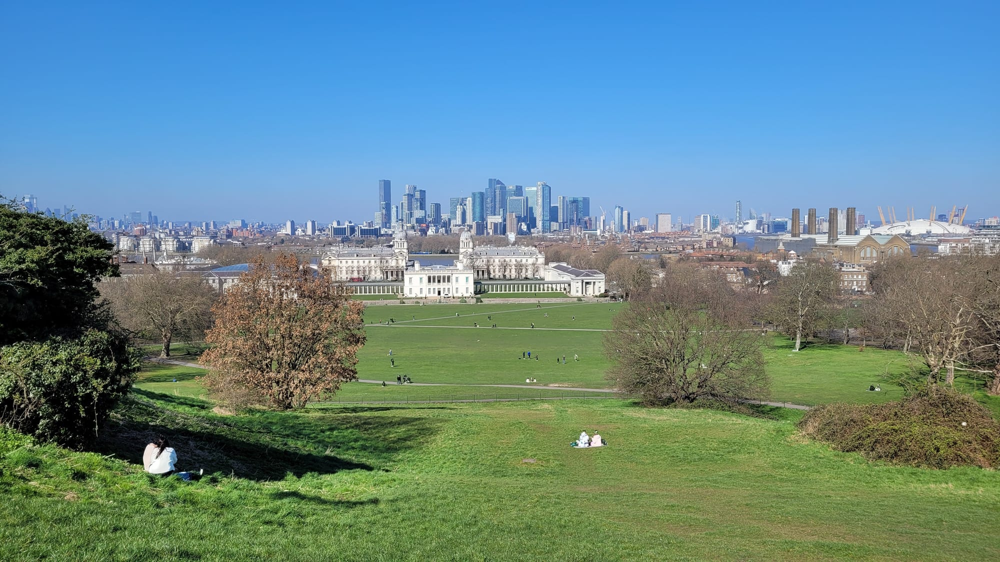

Three days in London is a forced march: the Tower and the whole South Bank land on the same day, and one museum district has to stand in for all of them.

Five days fixes that by splitting, not by adding. The Tower gets an afternoon and the City an evening. The South Bank gets its own day. Greenwich gets a whole one, reached by boat. And the fifth day is one district and nothing else, which is the day most people remember.

Every walking time below is [TfL's](https://tfl.gov.uk/plan-a-journey/), which runs slower than most people walk. Prices and opening hours are the operators' own, read on 21 September 2026.

> 💡 **The Short Version:** **Day 1** Westminster and the West End — the Abbey (£31, shut to sightseers on Sundays) and the Churchill War Rooms (£34, timed entry only). **Day 2** the Tower (£37) on an afternoon slot, Tower Bridge, then the City and a free view from Sky Garden or Horizon 22. **Day 3** the South Bank end to end, Borough Market to the London Eye. **Day 4** Greenwich by river — £11.40 by contactless, 56 to 60 minutes from Westminster. **Day 5** one district and nothing else — a free museum morning and the neighbourhood around it, or a market day in the east.

## Book these before you leave

| Book | How far ahead | What it costs, and why it sells out |
| --- | --- | --- |
| **[Tower of London](/articles/tower-of-london-guide/)** | 2–3 weeks in peak season | £37 adult, £18.50 child (5–15) and young person (16–17), £29.50 concession. Timed entry |
| **[Westminster Abbey](/articles/westminster-abbey-guide/)** | 1–2 weeks | £31 adult, £28 over-65s and students, £14 children 6–17. Closed to sightseers on Sundays |
| **[Churchill War Rooms](/articles/churchill-war-rooms-guide/)** | 1–2 weeks | £34 adult, £17 child. IWM does not guarantee walk-up entry |
| **Sky Garden** | Free tickets release weekly, up to three weeks ahead | Free, 35 floors up. They go |
| **A West End show** | 2–4 weeks for anything popular | Cheaper direct from the theatre. See the [theatre guide](/articles/london-theatre-guide/) |
| **One proper dinner** | 2–4 weeks | Five nights is enough to eat properly once. See [special occasion restaurants](/articles/special-occasion-restaurants-london/) |

> ⚠️ **Four closures decide the order of these five days.** Westminster Abbey and St Paul's do no sightseeing on Sundays. Borough Market is closed on Mondays. The British Library's Treasures Gallery is closed on Sundays. Check which day of the week you land on before you fix anything else.

---

## Day 1: Westminster and the West End

*Just over two miles of point-to-point walking on TfL's routes, flat throughout, plus whatever you do inside.*

We have this half of the day as an [eleven-stop Westminster walk](/articles/westminster-walk/) with a map and a Google Maps link. What follows is the timing and the money.

### Westminster Abbey

**[Open 9.30am to 3.30pm Monday to Friday and 9.30am to 3.00pm on Saturday](https://www.westminster-abbey.org/visit-us/prices-and-entry-times); Sunday is worship only.** **£31 an adult, £28 for over-65s and students, £14 for a child aged 6 to 17, free under 6.** A government VAT reduction cut those to £27.13, £24.50 and £12.25 between 25 June and 1 September 2026. Every ticket includes a multimedia guide.

**Allow two hours rather than the ninety minutes a three-day plan can afford.** Poets' Corner, the royal tombs, the Lady Chapel and the Cosmati Pavement are the four things people miss at speed.

With five days you can take both add-ons, which is the real difference from a shorter trip:

- **The verger tour is your entry price plus £10**, runs about 90 minutes, is capped at 20 people and goes [Monday to Saturday](https://www.westminster-abbey.org/visit-us/guided-tours/). **It is the only public access to the Shrine of Edward the Confessor**, and **it cannot be booked in advance** — you sign up on arrival, so book your entry slot about 30 minutes before you want the tour.
- **The Queen's Diamond Jubilee Galleries add £5 for adults and are free for under-18s**, on a timed ticket bought with your entry. They run along the 13th-century triforium, high above the Abbey floor, and they shut at 3pm — half an hour before the Abbey does.

**Choral Evensong is free and needs no ticket**, sung at [5.00pm on weekdays](https://www.westminster-abbey.org/worship-and-music/services-and-times/) in the Quire. The Abbey's own words are that everyone is welcome, free of charge. On a five-day trip you can come back for it on a different evening rather than choosing between the two.

### Churchill War Rooms

*Seven minutes' walk, 480 metres, to the Clive Steps entrance on King Charles Street.*

**[Open 9.30am to 6pm, last entry 5pm](https://www.iwm.org.uk/visits/churchill-war-rooms), every day except 24 to 26 December. £34 adult, £17 child 5–15, £30.60 concession, under-5s and carers free.** IWM adds no donation on top.

The Cabinet War Rooms are left as they were in 1945 — the Map Room clocks, the pins still in the Atlantic convoy charts — with the Churchill Museum built alongside. **Admission is a timed slot booked online and walk-ups are not guaranteed.** The handheld audio guide in thirteen languages is already in the ticket price; a paid "exclusive audio tour" from a reseller is the same handset. [Our guide](/articles/churchill-war-rooms-guide/) has the detail.

### Lunch, then the park

Walk into St James's or two stops to Covent Garden rather than eating on the bridge approaches. The [cheap eats guide](/articles/cheap-eats-london/) covers both.

*Fifteen minutes and one kilometre from the Clive Steps to Buckingham Palace* across St James's Park. The bridge over the lake carries the postcard view of the palace one way and the London Eye the other.

**Changing the Guard at Buckingham Palace is 11am on Monday, Wednesday and Friday** on the Household Division's own [calendar](https://www.householddivision.org.uk/changing-the-guard-calendar). There is also a **Sunday Parade at 10am**, and on Tuesday, Thursday and Saturday a **Captain's Inspection at 3pm** — shorter, far less crowded, band on most days, and the one that fits a day with an Abbey ticket in it. The view worth standing for is from the Victoria Memorial steps.

### The Mall, Trafalgar Square and the evening

*Twenty-one minutes and 1.3km down The Mall and through Admiralty Arch.*

**The National Gallery is free, open daily 10am to 6pm and until 9pm on Fridays**, closed 24 to 26 December and 1 January. **The free entrance is the Sainsbury Wing.** A free general-admission ticket gets fast-track entry; walk-ups are fine. The **cloakroom is £3 an item and takes no wheeled luggage at all**, whatever the size.

*Covent Garden is nine minutes from the square and Chinatown ten.* Dinner in [Soho](/articles/soho-area-guide/), [Covent Garden](/articles/covent-garden-area-guide/) or Chinatown — the [dim sum guide](/articles/best-dim-sum-london/) for the last of those — and a show if you booked one. Two hours between sitting down and curtain-up, and tell the restaurant the time.

---

## Day 2: The Tower, Tower Bridge and the City

*Under two miles, and the shortest walking day of the five. The City rewards looking up rather than covering ground.*

### Tower of London, after midday

**£37 an adult, £18.50 for a child aged 5 to 15 and for a young person aged 16 to 17, £29.50 for seniors, students and disabled visitors, free under 5.** Historic Royal Palaces prices by age band with one optional 10% donation, and there is no family ticket. **£1 a head for anyone on Universal Credit, Pension Credit, ESA, Income Support, Jobseeker's Allowance or Working Tax Credit**, up to four people, booked online in advance; Tower Hamlets residents pay £1 year-round. HRP's own prices, published 19 September 2026 — the [full list is in our Tower guide](/articles/tower-of-london-guide/).

**Allow two and a half to three hours.** The Crown Jewels, the White Tower and the ramparts are three separate visits inside one wall.

> 💡 **Take the late-morning slot, not the first one.** Historic Royal Palaces' own guidance is that the Tower is quieter after midday, and on a five-day trip you can afford to believe it. The constraint is the free **Yeoman Warder tour**, which runs roughly every half hour and is the best hour in the place: on 19 September 2026 the last one included in the ticket left at 15:15. An 11:00 or 12:00 entry clears the morning crush and still catches a Beefeater.

### Tower Bridge

*Six minutes, 470 metres, from the Tower gate.* **Walking across is free.** The Exhibition — the high walkways with the glass floor, and the Victorian engine rooms below the south approach — is ticketed and **[open daily 09:30 to 18:00, last entry 17:00](https://www.towerbridge.org.uk/plan-your-visit)**. Its ticket office is on the north-west side and everyone queues on arrival. On the **second Saturday of the month it runs a low-capacity Relaxed Opening, 09:30 to 11:30**, last entry 11:10, designed for neurodivergent visitors.

### The City, on foot

*Thirteen minutes and 870 metres from the Tower to 20 Fenchurch Street.* This is the stretch a three-day plan skips entirely: Wren churches, Roman remains and glass towers stacked against each other inside one square mile. Our [City of London walk](/articles/city-of-london-walk/) has it as numbered stops, and the [area guide](/articles/city-of-london-area-guide/) has where to eat in it.

**[Sky Garden](https://skygarden.london/visit/getting-here-hours/) is free**, on the 35th floor of 20 Fenchurch Street. **Monday to Friday 10am–6pm; Saturday, Sunday and bank holidays 11am–9pm.** Free tickets are released weekly and bookable up to three weeks ahead. The weekend hours are the longer ones, which inverts the usual advice: a Saturday visit can be at dusk, a Tuesday one cannot.

**[Horizon 22](https://horizon22.co.uk/) is free and higher**, on Level 58 of 22 Bishopsgate — its own description is London's highest free viewing gallery, 41 seconds up by lift. *Eleven minutes and 690 metres from Sky Garden.* **Weekdays 10.00–18.00, Saturday 10.00–17.00, Sunday 10.00–16.00.** The [views guide](/articles/best-views-london/) puts both against the paid ones.

> ⚠️ **The Square Mile empties at the weekend, and so do its kitchens.** Sky Garden and Horizon 22 both open on Saturday and Sunday, but a lot of the City's eating and drinking is built for a weekday office crowd and does not trade. For a Saturday or Sunday evening, walk fifteen minutes north into [Shoreditch](/articles/shoreditch-area-guide/) or east into Spitalfields instead.

---

Powered by <a target="_blank" rel="sponsored" href="https://www.getyourguide.com/london-l57/">GetYourGuide</a>

## Day 3: The South Bank, end to end

*About 3 miles, all of it flat and signposted. The Thames Path needs no navigation.*

This is the day a three-day trip has to bolt onto the Tower. Given a whole day you can stop at every one of these properly instead of photographing them on the way past. We also have it as a [numbered South Bank walk](/articles/south-bank-walk/), which runs the other way.

*Borough is a lunch, not a dinner. It shuts at 5pm most days and 4pm on Sunday, and it is closed on Mondays.*

### Borough Market, early

> ⚠️ **Borough Market is closed on Mondays.** [Tuesday to Friday 10am–5pm, Saturday 9am–5pm, Sunday 10am–4pm](https://boroughmarket.org.uk/visit-us/). Entry is free. Saturday is the fullest day and the only one that opens at nine; go at opening rather than at one, when the office lunch trade lands.

The [markets guide](/articles/best-london-markets/) has what to eat there and [best street food](/articles/best-street-food-london/) has the stalls worth a queue. If your Day 3 falls on a Monday, run Day 5 here instead and move this to the Tuesday.

### Shakespeare's Globe

*Nine minutes, 680 metres, west along the river.* The reconstructed open-air theatre at 21 New Globe Walk. **[The guided tour is £31 for adults and £14 for under-16s](https://www.shakespearesglobe.com/whats-on/globe-theatre-guided-tour/) and runs about 1 hour 30 minutes** — 50 minutes guided, the rest self-guided in the exhibition. **Pre-booking is essential.** The theatre is roofless and tours run in all weather, the cloakroom charges £2.50 an item, and **there is no luggage storage on site**, which catches people on a check-out day.

### Tate Modern

*Five minutes, 400 metres.* **Free, and open Sunday to Thursday 10.00–18.00 and Friday to Saturday 10.00–21.00** — which puts Friday and Saturday evenings on the table when the rest of this walk has shut. The Turbine Hall, in the old Bankside power station, costs nothing and is worth going in for on its own. Bags are checked on the way in, and the only bag storage is a paid locker.

### St Paul's, over the Millennium Bridge

*Thirteen minutes and 980 metres from the Tate doors to the cathedral steps*, over the footbridge that lands you square on the west front.

**[Sightseeing is £27 an adult and £10.50 a child, Monday to Saturday only.](https://www.stpauls.co.uk/visits/visits/visiting-information)** The cathedral opens for sightseeing from 8.30am with last entry usually 4pm, and sightseeing ends half an hour after that. **The Dome Galleries open at 9.30am with last entry at 4.15pm**, so a late-afternoon arrival gets you the floor and the crypt and not the view. The climb is [528 steps with no lift at any point](/articles/city-of-london-area-guide/): 257 to the Whispering Gallery, 376 to the Stone, 528 to the Golden. **There is no sightseeing on a Sunday**; services are free to attend.

### West to the London Eye

*Twenty-four minutes and 1.8km from Tate Modern*, past Gabriel's Wharf, the Oxo Tower, the National Theatre and the Southbank Centre. The second-hand book market under Waterloo Bridge costs nothing to browse.

Walk-up tickets for the **London Eye** are £39 an adult and £35 a child aged 2 to 15; booked online in advance they start at £29 and £26. One rotation is 30 minutes. Book a slot about half an hour before sunset and you board in daylight and come off with the bridges lit — the [London Eye guide](/articles/london-eye-guide/) has the Fast Track arithmetic and where to leave a suitcase.

> **If one of the five days is wet, make it this one that moves.** Tate Modern, the Globe's exhibition and Borough's covered sections hold up in rain; two miles of open riverside does not. [London in the rain](/articles/london-in-the-rain/) has the swaps.

---

## Day 4: Greenwich, and go by river

*About 2 miles on foot, one of them uphill. Half a day at a sprint, a full day comfortably.*

**Take the boat.** The DLR is faster; the river is the reason to go. Uber Boat by Thames Clippers runs from **Westminster, Embankment and Tower** piers, and the approach past Wapping and the Isle of Dogs, with the Old Royal Naval College opening out ahead of you, is what you are paying the £11.40 for.

| From | Scheduled to Greenwich | Contactless off-peak | Contactless peak |
| --- | --- | ---: | ---: |
| **Westminster** | 56–60 min | **£11.40** | **£13.70** |
| **Tower** | about 25 min | **£11.40** | **£13.70** |

Journey times are from the operator's weekend eastbound timetable; the fares are the [Central and East zone rate](https://www.thamesclippers.com/plan-your-journey/ticket-information), effective until 31 October 2026.

> ⚠️ **Saturdays, Sundays and bank holidays are charged at the peak river fare all day, and river fares are not capped.** Touching in and out on the Uber Boat sits outside the Tube and bus daily cap, so a river day costs whatever the boat costs on top of everything else. A **TfL Travelcard gets a third off** the boat, which is one of the few cases where the paper ticket beats plain contactless. Touch in *and* out at the pier readers, with the same card or device both ends. Full detail in our [river boats guide](/articles/how-to-use-london-river-boats/).

A **Hop-on Hop-off river day ticket is £29.30 online or £32.60 at the pier**, £14.65 and £16.30 for a child or concession, and £58.70 online for a family of two adults and up to three children. It only pays if you are making three or more hops.

### What Greenwich costs once you arrive

Greenwich Pier lands you a minute from the Cutty Sark, and everything below is within a ten-minute walk of the next thing.

| Place | Hours | Adult | Child |
| --- | --- | ---: | ---: |
| **[Cutty Sark](https://www.rmg.co.uk/cutty-sark)** | Daily 10am–5pm, last entry 4.15pm | **£18** | **£9** |
| **[Painted Hall](https://ornc.org/)**, Old Royal Naval College | Daily 10am–5pm | **£19** | **Free** |
| **[Royal Observatory](https://www.rmg.co.uk/royal-observatory)** | Daily 10am–6pm, last entry 5pm | **£18** | **£9** |
| **[National Maritime Museum](https://www.rmg.co.uk/national-maritime-museum)** | Daily 10am–5pm, last entry 4.15pm | **Free** | **Free** |
| **Queen's House** | Daily 10am–5pm, last entry 4.15pm | **Free** | **Free** |
| **[Greenwich Market](https://www.greenwichmarket.london/)** | Daily 10am–5.30pm | **Free** | **Free** |

**Cutty Sark** is, in the museum's own words, the world's only surviving tea clipper. The part that surprises people is that the ship is raised clear of its dock, so you walk about underneath the copper hull rather than only on the decks. **£3 tickets** go to visitors on Universal Credit, Pension Credit, ESA, Income Support, Jobseeker's Allowance and Tax Credits, and a carer accompanying a disabled visitor goes free.

**The Painted Hall** is *three minutes and 290 metres* from the Cutty Sark. Sir James Thornhill and his team painted it **between 1707 and 1726**, and the Old Royal Naval College is marking its **300th birthday through 2026**. **The £19 ticket converts to an annual pass for nothing** — ask when you buy it. Children go free. The **grounds are open daily 8am to 11pm** and cost nothing, so the Wren domes and the river frontage are free whatever you decide about the ceiling.

**The National Maritime Museum** is *five minutes and 320 metres* further, free, and booking is only recommended rather than required.

**The Royal Observatory** is *ten minutes and 790 metres* uphill through Greenwich Park from the Maritime Museum, and the climb is short and steep. **The view from the top of the hill is free.** The Observatory itself, with the Prime Meridian line and Harrison's chronometers, is ticketed, and it is the one Greenwich site that stays open until 6pm. **The Peter Harrison Planetarium is closed for renovation**, so do not plan a show into the day.

*The view from the Observatory hill, which costs nothing. It is the reason to give Greenwich a whole day rather than a morning.*

### Getting back

**Walk under the river.** The Greenwich Foot Tunnel starts beside the Cutty Sark and comes up at Island Gardens, directly opposite the Naval College — *eleven minutes and 670 metres on TfL's route*, and free. From Island Gardens the DLR runs north through the docks on a viaduct with no driver, so sit at the front.

That drops you in [Canary Wharf](/articles/canary-wharf-area-guide/), which is worth an hour. If you would rather walk the whole thing, we have it as a [numbered route from Canary Wharf to Greenwich](/articles/canary-wharf-greenwich-walk/) and as a [Wapping to Canary Wharf walk](/articles/wapping-canary-wharf-walk/) along the north bank.

The [Greenwich guide](/articles/greenwich-area-guide/) has the pubs and the rest of the park.

---

Powered by <a target="_blank" rel="sponsored" href="https://www.getyourguide.com/london-l57/">GetYourGuide</a>

## Day 5: One district, properly

By day five the mistake is going back to the middle. You have seen the middle.

Pick one district and stay in it — eat there, walk it, sit in its park, use its pubs. Two of the four below pair a free museum district with the neighbourhood around it, so the afternoon is a walk rather than a journey. Two are neighbourhood days with no museum in them at all.

### Option A — South Kensington, then Chelsea or Notting Hill

Three national museums, all free, within a few minutes of each other.

| Museum | Hours | Last entry | What it is for |
| --- | --- | --- | --- |
| **Natural History Museum** | Daily 10:00–17:50 | 17:30 | Specimens, and the building. Free ticket advised, walk-ups admitted. **Closed 9 October 2026** |
| **V&A** | Daily 10.00–17.45, **Friday to 22.00** | — | Design, fashion and objects. The Friday late runs four hours past the other two |
| **Science Museum** | Daily 10.00–18.00 | 17.15 | Its own figure for an average visit is **around two hours**. **Closed 11 November 2026** |

**Do two, not three.** *The V&A to the Science Museum is five minutes and 370 metres.* Use the **Exhibition Road entrances**, which are quieter than the grand ones on Cromwell Road, and note the Science Museum's own warning that galleries start closing 30 minutes before the museum does.

Then south into [Chelsea](/articles/chelsea-area-guide/) for the King's Road and the Physic Garden, or north through Kensington Gardens to [Notting Hill](/articles/notting-hill-area-guide/). **[Portobello Road Market's own published trading hours are Monday to Sunday, 8am to 7pm](https://visitportobello.com/)**; the painted terraces are a short walk off it and we have them mapped in [Notting Hill's colourful houses](/articles/notting-hill-colourful-houses/).

### Option B — Bloomsbury, then King's Cross and the canal

- **British Museum** — **free, daily 10.00–17.00 and Fridays to 20.30, last entry 16.45 (20.15 on Fridays).** A free ticket buys priority entry when it is busy; walk-ups are admitted daily. Pick three things — Sutton Hoo, the Egyptian mummies, the Islamic world galleries — and leave while you still like it. **The museum closes at 16.00 on 28 and 30 September 2026** for events.
- **Lunch on Lamb's Conduit Street** — *sixteen minutes and 1.1km north-east*, a pedestrianised Georgian street of independents.
- **British Library** — *twenty-six minutes and 1.5km from the museum.* **[The Treasures Gallery is free and needs no booking](https://events.bl.uk/exhibitions/treasures-of-the-british-library)**: Magna Carta and *Beowulf* sit in the same room as Shakespeare and Monty Python. **Monday to Thursday 09.30–17.45, Friday 09.30–16.15, Saturday 09.30–16.45 — and closed all day Sunday**, even though the building itself opens 11.00–17.00. It is kept cool and dark to protect the manuscripts, so take a layer.
- **Coal Drops Yard and the Regent's Canal** — *fifteen minutes and 1.1km on*, then the towpath. See [King's Cross](/articles/kings-cross-area-guide/) and the [King's Cross to Camden canal walk](/articles/kings-cross-camden-canal-walk/).

### Option C — East London, on a Sunday

No museum, and the only option that is genuinely day-specific.

**[Columbia Road Flower Market runs on Sundays only, from 8am until about 3pm.](https://www.columbiaroad.info/)** **[Spitalfields' traders market is 10am to 6pm on a Sunday](https://www.spitalfields.co.uk/opening-times/)** against 11am to 5pm on a Saturday, so Sunday is both longer and fuller. Brick Lane sits between the two. Together they make the one day of the week when the whole area is running at once.

Street art, a beigel at the top of Brick Lane, curry houses below it — the [street art guide](/articles/london-street-art/), the [Shoreditch guide](/articles/shoreditch-area-guide/) and the [Shoreditch and Spitalfields walk](/articles/shoreditch-spitalfields-walk/) between them cover it.

### Option D — Camden, Regent's Park and Hampstead

**[Camden Market opens Monday to Sunday, 10am to 7pm, including bank holidays](https://www.camdenmarket.com/visit)**, so it is the option that does not care which day you have left. Combine it with the [canal towpath](/articles/best-canal-walks-london/) west to Little Venice, or Regent's Park and Primrose Hill for the skyline. See [Camden](/articles/camden-area-guide/).

Further out, **[Kenwood House](https://www.english-heritage.org.uk/visit/places/kenwood/) is free, open daily 10am to 5pm with last entry at 4.30pm**, and holds Rembrandt's *Self-Portrait with Two Circles* at the top of Hampstead Heath. The [Hampstead guide](/articles/hampstead-area-guide/) and the [Heath and Primrose Hill walk](/articles/hampstead-heath-primrose-hill-walk/) have the rest.

---

## Spread the evenings out

**Five nights is enough to eat properly rather than incidentally**, and it is the part of a long trip most people waste on whatever is nearest the hotel. The mistake is stacking the good nights at the end, when you are too tired to enjoy them.

One night in a neighbourhood you are not staying in — Peckham, Hackney, Brixton — beats another West End chain. Book one thing that needs booking and leave the rest loose.

- **A West End show** — booked before you fly. See the [theatre guide](/articles/london-theatre-guide/).
- **One proper dinner** — [special occasion restaurants](/articles/special-occasion-restaurants-london/). Lunch at the same restaurant is dramatically cheaper for the same kitchen.
- **A free view at dusk** — Sky Garden at a weekend runs to 9pm, and it is the only one of the free City views open late enough for a summer sunset. Horizon 22 shuts at 6pm on a weekday and 4pm on a Sunday.
- **Live music** — from the [100 Club to a jazz late set](/articles/best-live-music-venues-london/).
- **A genuinely old pub** — [historic pubs and dining rooms](/articles/historic-pubs-dining-rooms-london/).

Do not put the big dinner after Day 3. That is the longest walking day of the five.

---

## Should you take a day trip instead?

Windsor, Oxford, Cambridge, Bath and Brighton are all reachable, and on five days **each one costs you a London day you have not had yet**.

Our view: on five days, don't. Greenwich gives you the change of scene, an hour on the water and a completely different London for £11.40 without leaving the fare zone. Save the day trips for a second visit or a longer one — and when you do, [Bath is 1h15 from Paddington](/articles/bath-day-trip/) and the rest are compared in [day trips from London](/articles/day-trips-from-london/).

---

## Common mistakes

1. **Taking the DLR to Greenwich because it is faster.** The river is the experience; the DLR is the way back.
2. **Forgetting river fares are not capped.** A day on the boat sits outside the Tube and bus daily cap, and weekends are peak all day.
3. **Planning Greenwich around a planetarium show.** The Peter Harrison Planetarium is closed for renovation.
4. **Buying the Painted Hall ticket and walking out.** It converts to a year's annual pass for nothing if you ask.
5. **Landing at Borough Market on a Monday.** Closed. Move Day 3.
6. **Putting the British Library on a Sunday.** The Treasures Gallery is shut even when the building is open.
7. **Taking the Tower's first slot out of habit.** HRP's own line is that it is quieter after midday; the constraint is the last included Yeoman Warder tour, not the gate.
8. **Doing both museum districts.** Day 5 is one of them. The other keeps.
9. **Planning a Saturday night in the Square Mile.** Sky Garden is open; most of the City is not.
10. **Stacking every special evening at the end of the trip.**

---

## Continue planning your London trip

- 🗓️ **[Three Days in London](/articles/three-days-in-london-itinerary/)** — the same ground, compressed, if five days is not what you have
- 🧭 **[How to Plan a London Itinerary](/articles/london-itineraries-by-days-and-interests/)** — how many days you actually need
- 🎯 **[One-Day Plans by Interest](/articles/one-day-london-itineraries-by-interest/)**
- ⛵ **[How to Use London's River Boats](/articles/how-to-use-london-river-boats/)** — the zones, the fares and which pier
- 🏘️ **[Best London Areas to Visit](/articles/best-areas-to-visit-london/)**
- 🏛️ **[The Best Museums in London](/articles/best-museums-london/)**
- 👀 **[The Best Views in London](/articles/best-views-london/)**
- 🎪 **[Free Things to Do in London](/free/)**
- 🧳 **[Luggage Storage in London](/articles/luggage-storage-london/)** — where to leave a bag between checking out and flying home

---

*Prices and opening hours are the operators' own, read on 21 September 2026. Walking times are TfL's. River fares hold until 31 October 2026. Attractions close for ceremonies and services at short notice, and hours move around public holidays.*
