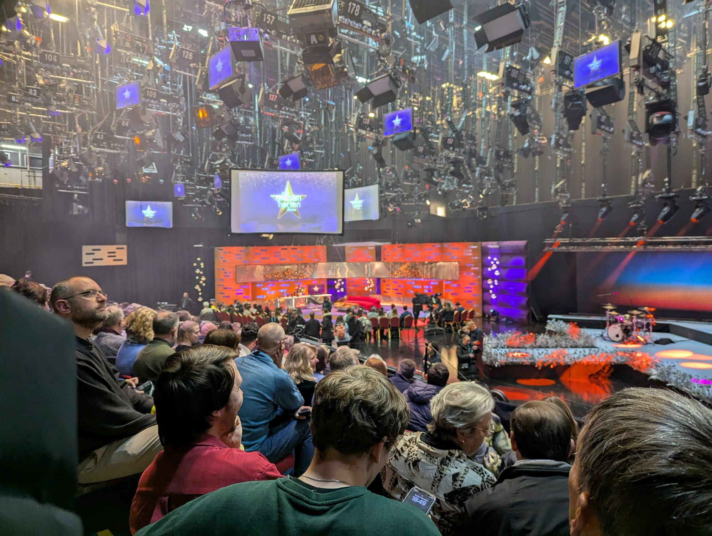
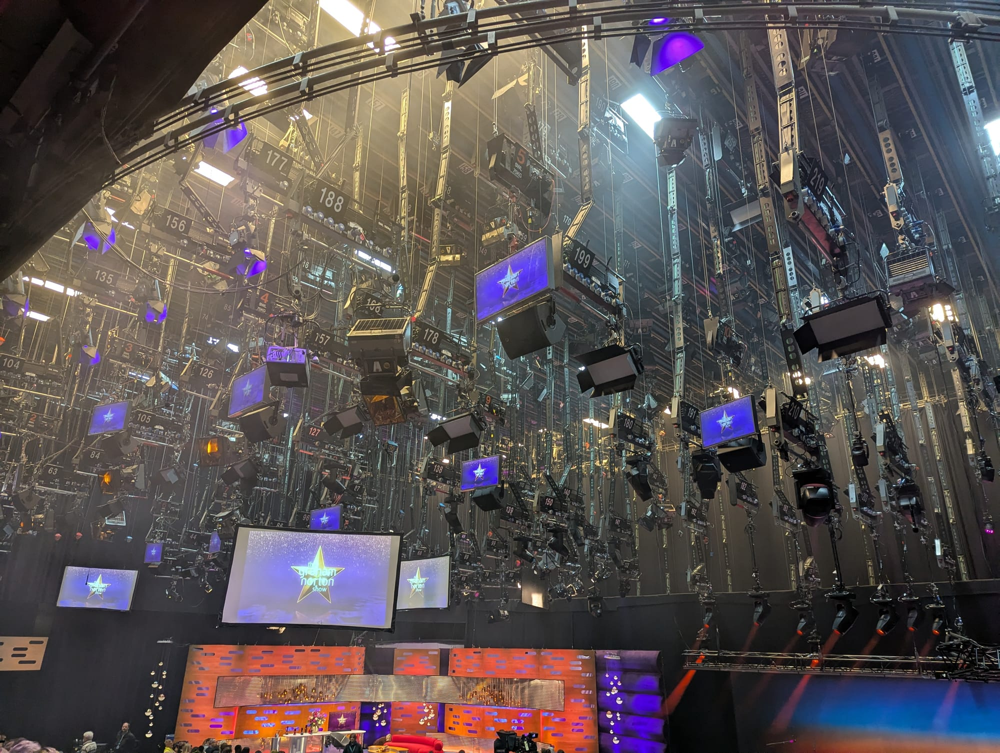

**Television and radio audiences in London are free.** Not cheap, not discounted — free, with no booking fee, for programmes you would otherwise watch at home. The BBC alone calls itself the largest provider of free television and radio tickets in the UK.

The catch is not money. It is that **a ticket does not get you in.**

Agencies deliberately issue more tickets than there are seats, because a proportion of people who claim a free ticket never turn up. That is a reasonable way to fill a studio and a miserable surprise if nobody has told you. Almost no guide to this says it plainly, so here it is first.

> 💡 **The Short Version:** Tickets are free from **five agencies** — the BBC, SRO Audiences, Applause Store, Lost in TV and Standing Room Only. They are **over-issued on purpose**, so entry is first come, first served and **a ticket is a place in a queue**. Wristbands are numbered in arrival order, so **arriving early is the whole game**. Expect **three to four hours** for a half-hour show, **18+** at most studios, **photo ID**, and **no food, drink or large bags** past security.

> 📊 **How this guide is put together**
> The mechanics here come from an **actual issued ticket** — a Graham Norton Show recording at Television Centre — read alongside each agency's own site, rather than from other guides. Where a rule is quoted, it is that show's rule, and the specifics vary by production.
> *Checked 1 September 2026 · [How we rank →](/how-we-rank/)*

---

## The five places tickets come from

There is no single box office. Each production hires an audience agency, so the show you want dictates the site you use — and the only way to catch everything is to be on several mailing lists.

| Agency | Books for | How it releases |
| --- | --- | --- |
| **[BBC Shows and Tours](https://www.bbc.co.uk/showsandtours/)** | All BBC television and radio | Random draw for big shows, first-come for smaller ones |
| **[SRO Audiences](https://www.sroaudiences.com/)** | Chat shows and panel shows, incl. Graham Norton | Application form, tickets emailed |
| **[Applause Store](https://www.applausestore.com/)** | ITV entertainment, premieres, red carpets | Booking now / register interest |
| **[Lost in TV](https://lostintv.com/)** | ITV, Channel 4, Sky, plus casting calls | Direct booking, optional paid membership |
| **[Standing Room Only](https://standingroomonly.tv/)** | Audience and casting work | Free membership, then invitations |

**Two things worth knowing about that table.** The BBC's system is a **random draw** for anything popular — Strictly Come Dancing runs one, and being quick is no help. And **Standing Room Only is a different proposition**: it is an audience *and casting* company, some of its work is paid rather than free, and it operates well beyond London.

Note also that **SRO Audiences and Standing Room Only are not the same organisation**, despite SRO standing for exactly that. If you are after a London chat show, sroaudiences.com is the one.

---

## What is actually recording

The line-up turns over constantly, but the shape of it does not. In early September 2026 the BBC alone was taking applications for **Strictly Come Dancing** (Elstree and Blackpool, random draw), **The News Quiz**, **The Today Debate** from the Radio Theatre, **The Kitchen Cabinet** and **BBC Singers** concerts. Lost in TV was booking **Unacceptable** with Ed Gamble, **Millionaire Hot Seat** with Jeremy Clarkson at MediaCity, and an ITV quiz with Mel and Sue.

**Radio is the underrated half of this.** Panel shows, comedy pilots and Radio 4 recordings are far easier to get into than a Saturday-night entertainment format, they take an hour rather than four, and you are often in a proper theatre — the BBC Radio Theatre at Broadcasting House — rather than a shed in Elstree.

**Where the studios actually are** matters more than people expect. Television Centre in White City is central and on the Tube. **Elstree, Pinewood and MediaCity in Salford are not** — a Strictly ticket is a day out of London, and a Millionaire Hot Seat ticket is a trip to Manchester.

---

## The over-issue, and what it means for you

This is the part that decides whether your evening works.

**SRO's own ticket says it in capitals:** they over-issue regular tickets by a percentage to compensate for the inevitable no-shows, the over-issue is calculated from how many tickets were actually used at recent recordings of that show, and *"sometimes we don't manage to squeeze everyone in."*

Here is how a night actually runs, using the Graham Norton recording as the worked example:

- **Wristbands are numbered in arrival order.** Not booking order, not application order — the order you physically turn up.
- **Priority ticket holders have until 5.30pm** to check in; **production guests until 6.20pm**. Their unclaimed places are only released after those times.
- **Regular ticket holders are admitted in wristband order**, first come first served, until the studio is full.
- **Doors at 6pm. No admittance after 6.15pm.**

*What the queue buys you. The audience is seated on tiers a few metres from the sofa, and this is a good hour before the recording starts.*

So the queue forms long before the stated check-in time, and the people at the front are the ones who are definitely getting in. SRO will tell you at check-in whether you are safely in or in what their own ticket calls the **"fingers crossed" part of the line** — which is a fair way to handle it, and a phrase worth knowing before you hear it.

> ⚠️ **Do not build an occasion around it.** SRO says this outright: because tickets do not guarantee entry, they do not recommend using them as the focus of a birthday or anniversary, and the birthday person queues like everyone else. If you want a guaranteed seat for something, buy a theatre ticket.

**If you do not get in**, the compensation is real but conditional: SRO rescan your ticket and issue **priority tickets to a future show of your choice**, subject to availability. You have to **leave your details at the event** to get that. Walking away in disgust forfeits it.

---

Powered by <a target="_blank" rel="sponsored" href="https://www.getyourguide.com/london-l57/">GetYourGuide</a>

## What gets you turned away

Every one of these is a rule someone finds out about at the barrier.

**Photo ID.** Ticket holders and guests may both be asked. **Copies and photographs of ID are not accepted** — a picture of your passport on your phone is not ID. Driving licence, passport or Freedom Pass are the recommended forms.

**Age.** Public tickets for the Graham Norton recording were **18 and over**, checked on ID, and production guests are the only exception. Limits are set per show, so check yours, but do not assume a sixteen-year-old will be admitted.

**Food and drink.** No snacks, no food, no drinks past security. You may bring a **non-glass, non-metal** bottle, but **it will be emptied at the security desk** — you refill it from a water cooler inside. Eat before you join the queue.

**Bags.** At that show there was **no cloakroom at all**. Anything that will not fit under your seat is at security's discretion to store or refuse. Travelling to a recording with luggage is a bad plan.

**Phones** go in, but must be **switched off before filming begins**.

**Clothes.** There is a genuine dress code, and it is about how you look on camera rather than smartness: **avoid floral patterns, avoid black, avoid prominent brand names**, and block colours are preferred. Brand-heavy clothing is not permitted.

---

## Getting the evening right

**Arrive earlier than feels necessary.** Everything above resolves to this. The stated check-in time is when staff start working down a line that already exists.

**Dress for two temperatures.** You wait outside — at Television Centre, under a group of trees on Wood Lane opposite the Tube station — and the studio may be a completely different climate. Layers, and an umbrella.

**Sort the toilet before you queue in earnest.** Facilities in the waiting area may be portaloos, and leaving the line costs you your place unless you time it around check-in.

**You can leave after checking in.** Once you have your wristband you may go — for food, or a sit down — as long as you are back through security before your number is called. This is the most useful thing on the ticket and almost nobody uses it.

**Arrive together.** Members of a party who turn up separately **cannot join each other in the queue** or collect wristbands for one another. If you want to sit together, either arrive as a group or wait until the last of your wristband numbers is called.

**Expect three to four hours** for a half-hour programme. Audiences typically watch **one episode**; retakes, resets and technical stops fill the rest.

*The waiting is most of it. Crew reset the floor, a camera crane swings into position, and the audience sits tight.*

**You may well be on television.** Cameras face the audience, and some shows deliberately show or talk to them.

---

*Look up. The rig is the part television never shows you — every lamp numbered, and the show's title bouncing off two dozen monitors.*

## The bits that are genuinely a treat

For all the queueing, the return is good and there is no equivalent way to buy it.

**You see how it is made** — the floor manager warming up the room, the retakes, the pieces that never air. Studio audiences routinely see more than the broadcast contains.

**Some shows invite you into the programme.** Graham Norton's production emails ticket holders a few days beforehand asking whether anyone wants to do the red chair, which is a genuinely open invitation to be in the show rather than just at it.

**And the perks are small but real.** SRO negotiates discounts near Television Centre — The Broadcaster, right by the studio, takes **20% off your food bill** on the day you attend if you show your ticket.

---

Powered by <a target="_blank" rel="sponsored" href="https://www.getyourguide.com/london-l57/">GetYourGuide</a>

## Is it worth it?

**Yes, for a radio recording, almost unreservedly.** An hour, a central venue, a low-key queue, and often a show you already listen to.

**Yes for television, if you go in clear-eyed.** You are trading an evening — three or four hours, much of it standing — for something free that you cannot otherwise buy. Treat it as the day's plan rather than a thing you drop into.

**No, if you need certainty.** A ticket is not a seat, the over-issue is deliberate, and the studio is full when it is full.

---

## Continue planning your London trip

- 💷 **[London on a Budget](/articles/london-on-a-budget/)** — the free museums, viewpoints and set pieces, and where the money actually goes
- 🎭 **[The Best Immersive Experiences in London](/articles/immersive-experiences-london/)** — what is still open, checked venue by venue
- 🎤 **[The Best Comedy Clubs in London](/articles/best-comedy-clubs-london/)** — where the panel show regulars work the rest of the week
- 🎩 **[The Best Cabaret in London](/articles/best-cabaret-london/)** — the other end of the live-audience business
