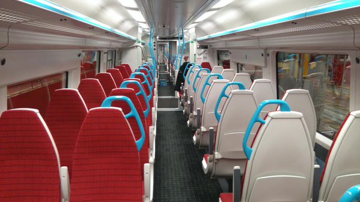

London Gatwick (LGW) is London's second-busiest airport, located 28 miles (45 km) south of Central London. While it has a single central railway station (located at **South Terminal**), three different train operators run from Gatwick into different parts of London.

> 💡 **Quick Verdict: Gatwick to London (2026)**  
> - **Best for Victoria & West End:** **Southern Rail** (£10.70 off-peak PAYG / £19.20 peak). Takes 32–40 mins directly to London Victoria—saving almost **50% over Gatwick Express** for essentially the exact same journey time!  
> - **Best for London Bridge, St Paul's, Farringdon & St Pancras:** **Thameslink Rail** (£10.70 off-peak PAYG / £19.20 peak). Direct cross-London train to London Bridge (30 mins), Blackfriars (35 mins), Farringdon (40 mins), and St Pancras (45 mins).  
> - **Why Avoid Gatwick Express?** Gatwick Express costs **£24.10 single** (vs £10.70 on Southern/Thameslink off-peak) to save only ~2–4 minutes to Victoria.  
> - **Cheapest Budget Option:** **National Express / Megabus** (from **£6.00** advance, 75–120 mins to Victoria Coach Station).  
> - **Contactless Accepted:** Tap your contactless card, Apple Pay, or Oyster card at the station turnstiles for Southern and Thameslink.

---

## Gatwick Transport Options Compared

*Fares and travel times checked on **2 August 2026**.*

| Transport Option | Central London Destination | Journey Time | Single Adult Fare (Contactless / PAYG) | Best Used For |
| --- | --- | --- | --- | --- |
| **Southern Rail** | London Victoria & Clapham Junction | 32–40 mins | **£10.70** *(Off-Peak)* / **£19.20** *(Peak)* | **Best overall value** for Victoria & West End |
| **Thameslink Rail** | London Bridge, Blackfriars, Farringdon, St Pancras | 30–45 mins | **£10.70** *(Off-Peak)* / **£19.20** *(Peak)* | **Best cross-London route** (Central, City, Eurostar) |
| **Gatwick Express** | London Victoria *(Non-stop)* | 31 mins | **£24.10** single | Non-stop journey with dedicated luggage racks |
| **National Express / Megabus** | Victoria Coach Station | 75–120 mins | From **£6.00** *(Advance)* | Tight travel budgets & late-night transfers |
| **Taxi / Uber / Private Hire** | Door-to-door anywhere in London | 60–120 mins | **£80.00 – £120.00+** | Families, large luggage, door-to-door comfort |

> ⏰ **Peak vs. Off-Peak Fares:** Pay-as-you-go peak rates apply weekdays **06:30–09:30** and **16:00–19:00**. Off-peak fares apply all day weekends, bank holidays, and outside peak weekday hours.

---

## Which train route is best for your hotel area?

| Hotel Area or Landmark | Recommended Train Route | Why Take This Route? |
| --- | --- | --- |
| **Victoria, Belgravia, Westminster, Pimlico** | **Southern Rail** | Direct to Victoria in 32–40 mins for £10.70 off-peak. |
| **London Bridge, Borough, Tower Bridge** | **Thameslink** | Direct to London Bridge in just 30 mins. |
| **Blackfriars, South Bank, St Paul's Cathedral** | **Thameslink** | Direct to Blackfriars in 35 mins (station spans the river). |
| **Farringdon, Clerkenwell, The City** | **Thameslink** | Direct to Farringdon in 40 mins; step-free Elizabeth line interchange. |
| **King's Cross, St Pancras (Eurostar), Bloomsbury** | **Thameslink** | Direct to St Pancras International in 45 mins. |
| **Paddington, Bayswater, Notting Hill** | **Thameslink ➔ Farringdon ➔ Elizabeth Line** | Faster than taking Southern to Victoria and transferring to Tube. |
| **Soho, Covent Garden, Mayfair** | **Southern to Victoria** OR **Thameslink to Farringdon** | Take Tube or short taxi from Victoria or Farringdon. |
| **Canary Wharf & Docklands** | **Thameslink to Farringdon ➔ Elizabeth Line** | Fast cross-city connection without entering Zone 1 congestion. |
| **Clapham Junction & South-West London** | **Southern Rail** | Direct trains call at Clapham Junction. |
| **Brighton & South Coast** | **Southern / Thameslink** | Direct southbound trains (buy National Rail ticket outside Oyster zone). |

---

## Book Airport Transfers & Experiences

---

Powered by <a target="_blank" rel="sponsored" href="https://www.getyourguide.com/s/%3Fq=London&amp;lc=57&amp;et=292175&amp;searchSource=3&amp;src=search_bar">GetYourGuide</a>

## Detailed Train Breakdowns

### 1. Southern Rail (Best Value for Victoria)
* **Route:** Gatwick ➔ Clapham Junction ➔ London Victoria.
* **Frequency:** Every 15 minutes.
* **Payment:** Tap in/out at gatelines with contactless card, Apple/Google Pay, or Oyster card.
* **Victoria Platform Warning:** At Victoria Station, use standard Southern platforms (**Platforms 15–19**). Walking through Gatwick Express barriers (**Platforms 13 & 14**) triggers the higher £24.10 Express fare!

### 2. Thameslink (Best Direct Route Across London)
* **Route:** Gatwick ➔ East Croydon ➔ London Bridge ➔ Blackfriars ➔ Farringdon ➔ St Pancras International.
* **Frequency:** Every 10–15 minutes.
* **Features:** Modern air-conditioned trains with walk-through carriages. Farringdon provides an effortless step-free interchange to the Elizabeth Line.

### 3. Gatwick Express (Non-Stop Premium Option)
* **Route:** Gatwick ➔ London Victoria *(Non-stop)*.
* **Journey Time:** 31 minutes.
* **Fare:** **£24.10** single (10% discount if bought online in advance at gatwickexpress.com).
* **Is it worth it?** For most travelers, no. Southern trains arrive at the exact same Victoria station just 2 to 4 minutes later for less than half the price (£10.70 off-peak).

---

## Gatwick Terminals & Station Access

Gatwick has two passenger terminals: **North Terminal** and **South Terminal**.

*Inside a Gatwick Express train. Photo: [Ameerali786](https://commons.wikimedia.org/wiki/File:2_Gatwick_Express_interior.jpg), [CC BY-SA 4.0](https://creativecommons.org/licenses/by-sa/4.0/).*

### Getting to the Train Station
* **South Terminal Arrivals:** Gatwick Airport railway station is located **directly inside South Terminal**, a 2-minute signed walk from arrivals.
* **North Terminal Arrivals:** If your flight lands at North Terminal, follow signs to the **Free Inter-Terminal Shuttle**. The automated shuttle runs **24/7 every 3 minutes** and takes just 2 minutes to reach South Terminal and the train station.

---

## 8 Common Gatwick transit mistakes to avoid

1. **Paying £24.10 for Gatwick Express:** Take Southern Rail to Victoria instead—it takes 32 mins and costs **£10.70 off-peak** with contactless.
2. **Tapping through Gatwick Express barriers at Victoria:** Passing through platforms 13/14 at Victoria triggers the high Express fare. Use platforms 15–19 for Southern trains.
3. **Taking Victoria trains when heading to Central/North London:** Take Thameslink directly to London Bridge, Blackfriars, or St Pancras instead of changing at Victoria.
4. **Switching payment devices between taps:** Tapping in with a bank card and out with Apple Pay results in two maximum fare penalties.
5. **Not allowing time for the North Terminal shuttle:** Add 10–15 minutes if your flight arrives at North Terminal.
6. **Using Oyster south to Brighton:** Oyster cards are accepted between London and Gatwick, but NOT further south towards Brighton (buy National Rail tickets).
7. **Buying paper single tickets:** Contactless or Oyster is automatic, cheaper, and avoids ticket machine queues.
8. **Hailing unlicensed airport taxis:** Always use the official terminal taxi rank or pre-booked licensed private hire.

---

## Related London Transport Guides

* ✈️ [Heathrow Airport to London: Every Transport Option Compared](/articles/heathrow-airport-to-london/)
* 🚊 [Getting Around London: Complete Transport Overview](/articles/getting-around-london-transport-guide/)
* 💷 [London Transport Fares and Costs 2026](/articles/london-public-transport-costs-and-fares/)
* 💳 [Oyster Card vs. Contactless Guide](/articles/oyster-card-guide-london/)
* 🚇 [How to Use the London Underground](/articles/how-to-use-the-london-underground/)

---

*Fares and travel times checked on 2 August 2026. Always verify live train departures with [National Rail Enquiries](https://www.nationalrail.co.uk/).*
