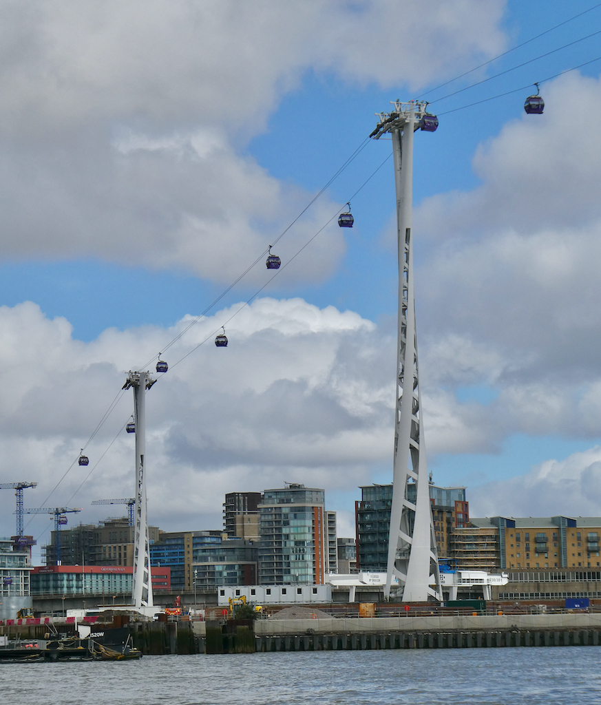

London's transit network is best understood as a web of interconnected, world-class transport systems. While the London Underground (the "Tube") is the most famous, buses, commuter trains, river boats, trams, taxis, cable cars, and walking each offer unique advantages depending on your route.

> 💡 **Master Transport Snapshot:**  
> - **Fastest Central Travel:** Take the Underground or the high-speed Elizabeth line.  
> - **Sightseeing & Short Hops:** Use London's iconic red double-decker buses (£1.75 flat fare with 60-minute unlimited Hopper transfers).  
> - **Airports:** Heathrow, Gatwick, and London City are linked by train/DLR. Stansted and Luton accept contactless cards, but **do NOT accept Oyster cards**.  
> - **Paying:** Always tap in and out using the exact same contactless card or Oyster card for automatic daily capping.

---

## London transport modes at a glance

| Transport Mode | Best For | Oyster / Contactless Accepted? | Main Limitation |
| --- | --- | --- | --- |
| **Underground (Tube)** | Fast central journeys across 11 lines | Yes (Both accepted) | Can be hot, crowded, and not 100% step-free |
| **Elizabeth Line** | Rapid east-west travel & Heathrow Airport | Yes (Contactless to Reading) | Central platforms can get very busy during peak hours |
| **London Overground** | Orbital routes avoiding Central London (Zone 1) | Yes (Both accepted) | Complex network with multiple splitting branches |
| **DLR (Docklands Light Railway)** | Docklands, Greenwich & London City Airport | Yes (Both accepted) | Primarily serves East and Southeast London |
| **National Rail** | Suburbs, airports & long-distance UK travel | Contactless accepted to outer hubs; Oyster limits apply | Payment boundaries vary by line |
| **London Bus** | Short trips, night travel & street-level views | Yes (Cashless: tap in only) | Road traffic can cause unpredictable journey times |
| **London Trams** | Croydon & South London suburban travel | Yes (Tap validator on platform) | Limited to South London districts |
| **River Bus (Uber Boat)** | Scenic Thames transit between piers | Yes (Separate fares; 33% Travelcard discount) | Higher fares than Tube and less frequent |
| **IFS Cloud Cable Car** | Scenic river views between Greenwich & Royal Docks | Yes (Billed separately outside caps) | Short specialist route; 50% off for O2 show ticket holders |
| **Black Cabs & Uber** | Door-to-door transit & accessible journeys | Card / In-App payment | Expensive during peak traffic congestion |

> 📱 **Navigation Tip:** Use the **TfL Go App** or **Citymapper** for live transit routing, platform directions, and real-time disruption alerts across all London networks.

For detailed pricing, peak hours, and capping rules, read our companion guide to [How Much Does London Public Transport Cost?](/articles/london-public-transport-costs-and-fares/). To compare payment options, check our [Oyster Card & Contactless Guide](/articles/oyster-card-guide-london/).

---

## London Underground (The Tube)

The London Underground covers **11 color-coded lines** serving 272 stations. It is almost always the fastest option for travelling within Central London (Zone 1 and Zone 2).

* **Operating Hours:** Trains run from ~05:30 to midnight Monday through Saturday, with reduced hours on Sunday. The **Night Tube** operates 24 hours on Friday and Saturday nights across the Central, Jubilee, Northern, Piccadilly, Victoria and Windrush lines.
* **Tapping In & Out:** Always tap your contactless card or Oyster card on the yellow reader at the ticket gates when entering AND exiting the station.
* **Accessibility:** Newer stations (and Elizabeth line stations) have full step-free lift access, but many historic deep-level stations rely on stairs and escalators.

> 🚀 **Tube Pro Tip:** Walking between close stations in Central London (such as Leicester Square to Covent Garden) is often faster than going down into the Tube station!

* **Comprehensive Guide:** [How to Use the London Underground](/articles/how-to-use-the-london-underground/)
* **Choosing a Line:** [London Tube and Rail Lines Guide](/articles/london-tube-and-rail-lines-guide/)

---

## Elizabeth Line (High-Speed Cross-London Rail)

Opened in 2022, the **Elizabeth line** (line color: purple) is London's newest rail network, linking Shenfield and Abbey Wood in the east to Central London, Heathrow Airport, and Reading in the west.

* **Comfort & Speed:** Trains are fully air-conditioned, spacious, feature free Wi-Fi, and offer step-free access at all stations.
* **Airport Transit:** Provides a direct, high-speed connection from Heathrow Airport to Central London hubs like Paddington, Tottenham Court Road, Farringdon, and Liverpool Street in under 40 minutes.
* **Payment Limits:** Oyster cards are accepted as far west as West Drayton (including Heathrow), but **are not valid** past West Drayton towards Reading. Contactless cards are accepted across the entire line to Reading.

---

## London Overground & DLR

### London Overground (Orange Network)
The **London Overground** consists of six named orbital rail lines that connect inner and outer London suburbs without requiring you to travel through Central London (Zone 1).

* **Avoid Zone 1 Fares:** Travelling on the Overground between outer suburbs is often significantly cheaper than Tube journeys because it bypasses Zone 1. Tap the **pink route validators** on interchange platforms to prove you avoided Zone 1!
* **Features:** All trains feature walk-through air-conditioned carriages and full Oyster/contactless acceptance.

### DLR (Docklands Light Railway)
The **DLR** is an automated, driverless light-rail network serving East London, Docklands, Greenwich, Stratford, and **London City Airport**.

* **Front Seat View:** DLR trains have no driver cabin! Passengers can sit in the very front seat for an unobstructed view of the elevated tracks and skyscrapers.
* **Step-Free Access:** Every single DLR station features 100% step-free street-to-train access.

---

Powered by <a target="_blank" rel="sponsored" href="https://www.getyourguide.com/london-l57/">GetYourGuide</a>

## National Rail (Suburban Trains & Express Lines)

National Rail lines link London's major terminal stations (Waterloo, Victoria, London Bridge, Paddington, Kings Cross, Euston, Liverpool Street) to suburbs and regional cities across Great Britain.

* **Thameslink Cross-London Line:** Thameslink commuter trains run directly north-to-south through Central London (St Pancras, Farringdon, City Thameslink, Blackfriars, London Bridge), offering a fast alternative to the Tube.
* **Oyster vs. Contactless Boundaries:** Contactless payment is accepted far beyond the Oyster zone. For example, contactless is accepted to Gatwick, Luton, and Stansted airports, but **Oyster cards are NOT valid to Stansted or Luton**.

---

## London Buses & Trams

### Iconic Red Double-Decker Buses
London buses reach every corner of the capital 24 hours a day. They are completely **cashless** and cost a flat **£1.75 per ride**.

* **Touch In Only:** Always tap your contactless card or Oyster card on the yellow reader when boarding. **Never touch out** when alighting a bus.
* **Hopper Fare:** Make unlimited bus and tram transfers within **60 minutes** of your first tap for just **£1.75**.
* **Sightseeing:** Sit on the top deck at the front window for cheap, panoramic city sightseeing (e.g. Route 11, 15, or 24).

### London Trams
Operating in South London around Croydon, Wimbledon, and Beckenham, London Trams connect with Overground and National Rail services. Fares match the bus network (£1.75 flat fare). Tap in on the platform reader before stepping onto the tram.

### Hop-On Hop-Off Sightseeing Buses

If you want live or audio commentary while travelling directly between major tourist landmarks (Buckingham Palace, Big Ben, Tower of London, St Paul's), open-top **Hop-On Hop-Off Sightseeing Buses** (operated by Big Bus, Tootbus, and Golden Tours) offer 24-hour, 48-hour, or 72-hour unlimited passes.

* **Audio Commentary & Guides:** Includes multi-language audio commentary, live tour guides, and designated stops right outside top attractions.
* **TfL Differences:** Hop-On Hop-Off buses are private sightseeing tours, not part of TfL. They **do not accept Oyster or contactless taps** and require a pre-booked tour pass.
* **Bonus Inclusions:** Most 24-hour and 48-hour pass options include a free Thames river cruise ticket.

* **Full Bus & Tram Guide:** [How to Use London Buses and Trams](/articles/how-to-use-london-buses-and-trams/)

---

## River Bus & London Cable Car

### River Bus (Uber Boat by Thames Clippers)
Scheduled river boats run frequently along the Thames between Putney, Westminster, Tower Pier, Greenwich, and Barking Riverside.

* **Scenic & Comfortable:** Offers climate-controlled indoor seating, open-air back decks, and a licensed coffee/bar onboard.
* **Fares & Discounts:** Oyster and contactless cards are accepted at pier gates (billed separately outside Tube caps). Holding a valid Travelcard gives you a **33% discount (1/3 off)** on standard fares.
* **Full River Guide:** [How to Use London River Boats](/articles/how-to-use-london-river-boats/)

### IFS Cloud Cable Car
Crosses the Thames between Greenwich Peninsula (The O2) and Royal Docks. Offers dramatic views of East London from 90 metres in the air.

*The cable car runs at 90 metres, well above anything else in the area. Contactless and Oyster both work at the gate.*

* **Ticket Perks:** Presenting a show ticket for **The O2 Arena** at the terminal office qualifies you for a **50% discount** on cable car flights.

---

## Black Cabs & Private Hire (Uber & Taxis)

* **Official Black Cabs:** Can be hailed on the street or picked up at ranks. Fully metered, wheelchair-accessible, and driven by licensed drivers who have passed "The Knowledge". Fares start at **£4.40**.
* **Private Hire (Uber, Bolt, FreeNow):** Must be pre-booked via mobile app. App shows an exact upfront fare quote before booking.
*(Visiting from abroad? Ensure your phone has active mobile data for ride-hailing apps with our [UK Travel SIM & eSIM Guide](/articles/travel-sim-esim-guide/).)*

---

## Travelling to and from London's 6 Airports

London is served by six commercial airports. Choose your airport transfer based on your hotel's location rather than defaulting to expensive express trains:

| Airport | Primary Transport Options | Oyster / Contactless Accepted? | Complete Guide Link |
| --- | --- | --- | --- |
| **Heathrow (LHR)** | Elizabeth Line, Piccadilly Line (Tube), Heathrow Express | **Both Accepted** | [Heathrow Airport Transport Guide](/articles/heathrow-airport-to-london/) |
| **Gatwick (LGW)** | Thameslink, Southern Trains, Gatwick Express | **Both Accepted** *(Special fares apply)* | [Gatwick Airport Transport Guide](/articles/gatwick-airport-to-london/) |
| **Stansted (STN)** | Stansted Express, National Express Coach | **Contactless ONLY** *(Oyster NOT valid)* | [Stansted Airport Transport Guide](/articles/stansted-airport-to-london/) |
| **Luton (LTN)** | Thameslink Train + Luton DART Shuttle | **Contactless ONLY** *(Oyster NOT valid)* | [Luton Airport Transport Guide](/articles/luton-airport-to-london/) |
| **London City (LCY)** | DLR (Docklands Light Railway) | **Both Accepted** | [London City Airport Transport Guide](/articles/london-city-airport-to-london/) |
| **Southend (SEN)** | Greater Anglia National Rail | **Contactless ONLY** *(Oyster NOT valid)* | [Southend Airport Transport Guide](/articles/southend-airport-to-london/) |

---

Powered by <a target="_blank" rel="sponsored" href="https://www.getyourguide.com/london-l57/">GetYourGuide</a>

## Comprehensive London Transport Library

Explore our in-depth guides for specific networks, airport transfers, and ticket options:

### Core Transport & Payment Guides
* 🚆 **[How to Use the London Underground](/articles/how-to-use-the-london-underground/)** – Line guides, etiquette, and peak hours.
* 🚌 **[How to Use London Buses and Trams](/articles/how-to-use-london-buses-and-trams/)** – Boarding rules, routes, and the 60-min Hopper.
* 🚢 **[How to Use London River Boats](/articles/how-to-use-london-river-boats/)** – Pier maps, Uber Boat zones, and scenic cruises.
* 💳 **[Oyster Card & Contactless Guide](/articles/oyster-card-guide-london/)** – Oyster fees vs contactless bank cards.
* 🗺️ **[London Tube and Rail Lines Guide](/articles/london-tube-and-rail-lines-guide/)** – Every line rated for crowding and comfort, with the best exit for each attraction.
* 💷 **[London Transport Fares & Costs 2026](/articles/london-public-transport-costs-and-fares/)** – Peak rates, caps, and Travelcard comparisons.

### Airport Transfer Guides
* ✈️ **[Heathrow Airport to London](/articles/heathrow-airport-to-london/)** – Tube vs Elizabeth Line vs Express.
* ✈️ **[Gatwick Airport to London](/articles/gatwick-airport-to-london/)** – Thameslink vs Southern vs Express.
* ✈️ **[Stansted Airport to London](/articles/stansted-airport-to-london/)** – Express train vs coach options.
* ✈️ **[Luton Airport to London](/articles/luton-airport-to-london/)** – Luton DART & Thameslink connections.
* ✈️ **[London City Airport to Central London](/articles/london-city-airport-to-london/)** – Direct DLR routes.
* ✈️ **[Southend Airport to London](/articles/southend-airport-to-london/)** – Rail connections to Liverpool Street.

---

*Information checked on 2 August 2026. Always verify real-time routing and service status using [Transport for London](https://tfl.gov.uk/).*
