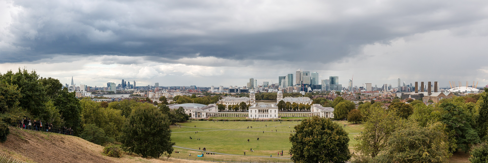

Greenwich and Docklands showcase East London's spectacular maritime heritage and modern waterfront skyline. Stretching along the eastern bend of the River Thames, this UNESCO World Heritage precinct pairs royal parks, the historic Prime Meridian Line, and the *Cutty Sark* clipper ship with the soaring skyscrapers of Canary Wharf, concert venues at The O2 Arena, and cable car flights high above the river.

> 💡 **At a Glance: Greenwich, Canary Wharf & Docklands**  
> - **Vibe:** Maritime village charm, sleek waterfront architecture, and entertainment hubs.  
> - **Walkability:** 5 / 5 (Pedestrianized parklands, river walks, and dockside promenades).  
> - **Nearest Stations:** Greenwich (Rail & DLR), Cutty Sark (DLR), Canary Wharf (Elizabeth Line, Jubilee, DLR), North Greenwich (Jubilee Line for The O2).  
> - **Best For:** Royal Observatory, Prime Meridian Line, Cutty Sark, Thames river cruises, Cable Car rides, and The O2 concerts.

---

## Top 6 Sights & Activities

1. **Royal Observatory & Prime Meridian Line:** Stand with one foot in the Eastern Hemisphere and one foot in the Western Hemisphere at Longitude 0°, and enjoy breathtaking views over London from Greenwich Park.
2. **Explore the Cutty Sark:** Step aboard the world's last surviving tea clipper ship, suspended above a glass pavilion in Greenwich Pier.
3. **Experience The O2 Arena & Up at The O2:** Attend major international concerts, shop at ICON Outlet, or climb over the roof of the dome on the **Up at The O2** guided expedition.
4. **Ride the IFS Cloud Cable Car:** Take a scenic flight 90 meters above the Thames in London's only cable car, connecting Greenwich Peninsula to Royal Victoria & ExCeL.
5. **Discover Canary Wharf & Crossrail Place Roof Garden:** Wander through modern glass skyscrapers, outdoor public art sculptures, and visit the tropical indoor **Crossrail Place Roof Garden**.
6. **Feast at Greenwich Market:** Browse international street food stalls, vintage jewelry, and handmade crafts inside the historic covered market hall.

---

## Key Micro-Districts & Waterfront Precincts

*View from Greenwich Park over Canary Wharf. Photo: [Dietmar Rabich](https://commons.wikimedia.org/wiki/File:London,_Greenwich,_Blick_vom_H%C3%BCgel_des_Royal_Greenwich_Observatory_--_2016_--_4728-31.jpg), [CC BY-SA 4.0](https://creativecommons.org/licenses/by-sa/4.0/).*

### 1. Historic Maritime Greenwich
UNESCO-listed precinct containing **Greenwich Park**, the **Royal Observatory**, **Old Royal Naval College** (with its breathtaking Painted Hall), **National Maritime Museum**, and **Cutty Sark**.

### 2. Greenwich Peninsula & The O2
Home to **The O2 Arena**, **North Greenwich Jubilee Line station**, and the terminal for the **IFS Cloud Cable Car**.

### 3. Canary Wharf & Wood Wharf
London's financial skyscraper hub, offering luxury waterfront dining, indoor shopping malls, the Elizabeth Line station, and **Wood Wharf** boardwalks.

### 4. Royal Docks & ExCeL London
Connected via the Cable Car or DLR, home to the **ExCeL London** exhibition center and London City Airport.

---

## Book Greenwich Tours & River Cruises

Powered by <a target="_blank" rel="sponsored" href="https://www.getyourguide.com/s/%3Fq=London&amp;lc=57&amp;et=292175&amp;searchSource=3&amp;src=search_bar">GetYourGuide</a>

---

## Where to Eat & Drink

| Spot | Style / Specialty | Why Visit |
| --- | --- | --- |
| **Greenwich Market Food Stalls** | International Street Food | Dozens of hot food vendors serving dim sum, churros, Ethiopian curries & ramen |
| **The Gipsy Moth** | Historic Pub & Beer Garden | Classic pub right beside the Cutty Sark with a large outdoor garden |
| **Hawksmoor Wood Wharf** | Waterside Steakhouse | Floating restaurant on the water at Canary Wharf serving grass-fed steaks |
| **Trapeze / Up at The O2 Dining** | Concert Dining | Casual bars and restaurants inside The O2 dome before a concert |

---

## Suggested 3-Hour Self-Guided Exploration Route

1. **Start:** Arrive at **Greenwich Pier** via the **Uber Boat by Thames Clippers** river boat from Central London.
2. **Cutty Sark & Market:** Walk past the **Cutty Sark** ship into **Greenwich Market** for lunch.
3. **Painted Hall & Royal Observatory:** Visit the **Old Royal Naval College Painted Hall**, then walk up Greenwich Park hill to the **Royal Observatory** for panoramic photos.
4. **IFS Cloud Cable Car:** Take a short bus or Jubilee Line ride to **North Greenwich**, and board the **IFS Cloud Cable Car** across the Thames.
5. **Finish at Canary Wharf:** Take the DLR or Elizabeth Line to **Canary Wharf** to explore the **Crossrail Place Roof Garden** and waterfront bars!

---

## 5 Common Visitor Mistakes to Avoid

1. **Taking the Tube when you could take the River Bus:** Taking the **Uber Boat by Thames Clippers** from Westminster or Tower Bridge down to Greenwich Pier is far more scenic than sitting underground!
2. **Walking up Greenwich Park hill without checking Observatory ticket times:** The view from the top of Greenwich Park hill is 100% free, but standing directly on the brass Meridian Line requires a Royal Observatory ticket.
3. **Confusing Greenwich DLR station with Cutty Sark DLR station:** **Cutty Sark DLR station** is right in the town center next to the market and ship; Greenwich station is a 10-minute walk west.
4. **Not tapping in/out on the Cable Car:** Touch your contactless bank card or Oyster card at the Cable Car turnstiles for automatic pay-as-you-go entry!
5. **Missing the Painted Hall at the Old Royal Naval College:** Described as "London's Sistine Chapel", the Baroque ceiling inside the Painted Hall is one of Europe's greatest interiors.

---

## Related London Guides

* 🏨 [Exploring London's Best Neighbourhoods: Master Guide](/articles/best-areas-to-stay-and-visit-london/)
* 🚢 [How to Use London River Boats](/articles/how-to-use-london-river-boats/)
* ✈️ [London City Airport to London Transport Guide](/articles/london-city-airport-to-london/)
* 🚊 [Getting Around London: Complete Transport Overview](/articles/getting-around-london-transport-guide/)

---

*Exploration guide checked on 2 August 2026. Always check Cable Car operating hours and event schedules at The O2.*
