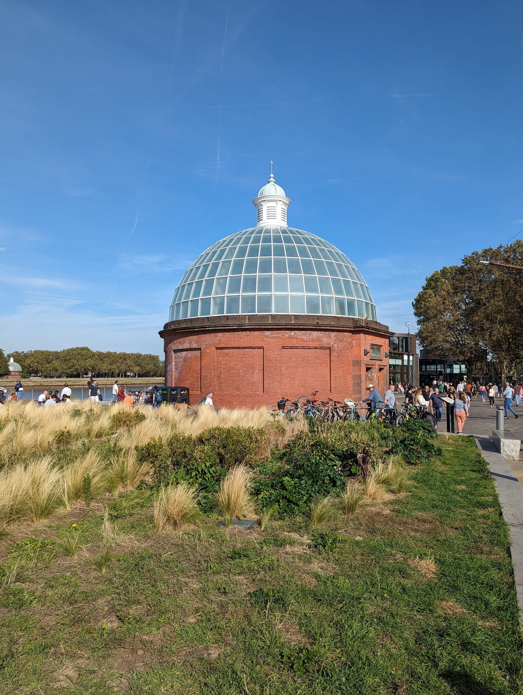
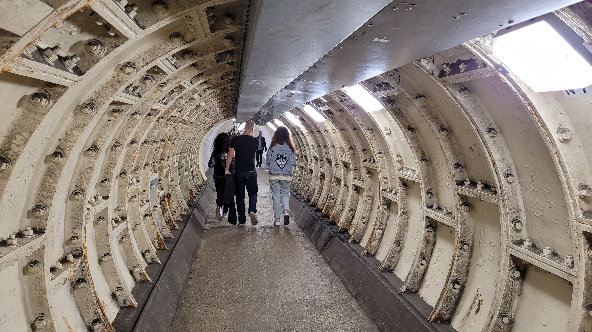
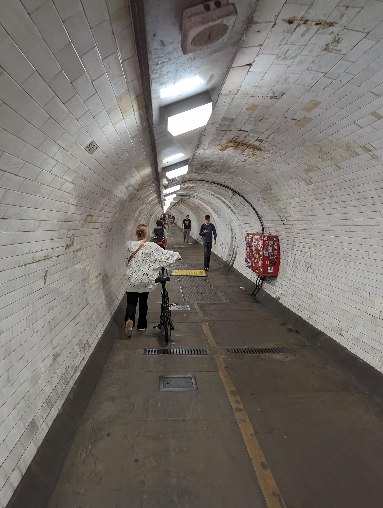

Greenwich is a UNESCO World Heritage Site and the only part of London where the sightseeing, the park and the view all sit on top of each other. From the hill outside the Royal Observatory you look down over Christopher Wren's Naval College, across the river to Canary Wharf, and on to the City beyond.

It also holds the line the world sets its clocks by. Greenwich Mean Time and longitude zero are both defined here.

Greenwich has its own share of the commemorative plaques marking where notable people lived or worked - see them on our [interactive map](/plaques/?area=greenwich).

## Why visit — and who should skip it

**Come here if** you want a full day out of central London that still feels essential. Greenwich has the best free view in the city, a genuine village centre, a market, a park with deer, and enough maritime history to fill a day.

**Skip it if** you have only two or three days in London and have not yet done Westminster or the South Bank. Greenwich is 30 to 60 minutes each way, so it costs you an entire day. Save it for a longer trip — and if you do come, arrive by boat.

## Top sights and activities

1. **Royal Observatory and the Prime Meridian** — Longitude zero, the Harrison marine chronometers, and the red time ball that has dropped at 13:00 since 1833. Ticketed.
2. **The view from Observatory Hill** — Free, and the best panorama in London: the Naval College, the river, Canary Wharf and the City. Go up even if you skip the Observatory itself.
3. **Cutty Sark** — The last surviving tea clipper, dry-docked and raised so you can walk beneath the hull.
4. **The Painted Hall** — Thornhill's ceiling in the Old Royal Naval College, nineteen years in the painting. Separate ticket; the chapel opposite is free.
5. **National Maritime Museum** — Free. Nelson's coat with the bullet hole from Trafalgar, and a good children's gallery.
6. **Greenwich Park and the deer** — 183 acres, London's oldest enclosed royal park, with a wild deer herd in The Wilderness.
7. **Greenwich Market** — Covered, daily, fullest Wednesday to Sunday. Food, crafts and antiques.
8. **The Greenwich Foot Tunnel** — An 1902 tiled tunnel under the Thames to the Isle of Dogs. Free, open always, and the classic view back at Greenwich from the far side.

## North Greenwich is a different place

This is the single most common Greenwich mistake, so it is worth stating plainly.

| | Greenwich | North Greenwich |
|---|---|---|
| **What is there** | Observatory, Cutty Sark, park, market | The O2 arena, cable car, Design District |
| **Station** | Cutty Sark or Greenwich (DLR/Rail) | North Greenwich (Jubilee) |
| **Distance apart** | — | About two miles |

They are on opposite sides of the Greenwich Peninsula and are **not walkable from one another** in any sensible way. If you have a concert ticket, you want **North Greenwich** on the Jubilee line. If you want the Observatory, you want **Cutty Sark** on the DLR. Arriving at the wrong one costs you half an hour.

What is at North Greenwich: **The O2**, one of the busiest arenas in the world, with the **Up at The O2** roof climb over the dome; the **IFS Cloud Cable Car** across the river to the Royal Docks; and the **Design District**, a cluster of small studios and a good canteen.

*The southern rotunda of the Greenwich Foot Tunnel, beside the Cutty Sark. The lifts run during staffed hours; the stairs are always open.*

## Key streets and micro-districts

*The Greenwich Foot Tunnel. Opened in 1902, free, and open at all hours.*

### Maritime Greenwich
The UNESCO core: Naval College, Queen's House, National Maritime Museum and Cutty Sark, all within five minutes of each other.

### Greenwich town centre
Around the covered market. Church Street, Nelson Road and College Approach — pubs, bookshops and the market hall.

### Greenwich Park and the hill
Up behind the Maritime Museum. The Observatory at the top, the deer in The Wilderness, and the rose garden.

### The riverside and the Foot Tunnel
West past the Cutty Sark to the tunnel entrance and the Trafalgar Tavern.

### Greenwich Peninsula and North Greenwich
Two miles north. The O2, the cable car and the Design District.

## Where to eat and drink

| Spot | Style | Price | Why go |
| --- | --- | --- | --- |
| **Greenwich Market** | Food stalls | £ | Covered, and the easiest lunch in the area |
| **The Trafalgar Tavern** | Historic riverside pub | ££ | Regency pub on the Thames, associated with Dickens |
| **The Gipsy Moth** | Pub with garden | ££ | Beside the Cutty Sark, with a large beer garden |
| **Goddards at Greenwich** | Pie and mash | £ | Serving since 1890; the traditional London plate |
| **The Old Brewery** | Brewery and dining | ££ | In the Naval College grounds |
| **Design District Canteen** | Food hall | £ | At North Greenwich, and useful before an O2 event |

*Inside the tunnel. It opened in 1902, runs under the Thames to Island Gardens, and is free at any hour.*

## Getting there

**By river.** The best way. **Uber Boat by Thames Clippers** runs from Westminster, Embankment, Bankside, Tower and Canary Wharf to Greenwich Pier. Thirty to sixty minutes depending on the start point. Oyster and contactless work, but river fares sit outside the daily cap — see the [river boats guide](/articles/how-to-use-london-river-boats/).

**By DLR.** **Cutty Sark** station is the one you want — it is in the middle of the town centre. Greenwich station is a little further out.

**For the O2.** **North Greenwich** on the Jubilee line, not Greenwich. Roughly 15 minutes from Waterloo.

**On foot.** Through the **Greenwich Foot Tunnel** to Island Gardens and the DLR for Canary Wharf.

## How long to spend, and when to go

| If you have | Do this |
| --- | --- |
| **Half a day** | Cutty Sark, the market, and the free view from Observatory Hill |
| **A full day** | Add the Royal Observatory, the Painted Hall and the Maritime Museum |
| **A full day plus** | Add the cable car from North Greenwich, or the Foot Tunnel walk |

**Best time:** Arrive by boat in the morning and walk up the hill before the coach parties. The hill view is best in afternoon light looking back towards the City.

**Note:** The Observatory, Cutty Sark and Painted Hall are three separate tickets. A combined ticket exists and is worth it if you plan on two or more.

## Suggested full-day route

1. **Arrive:** By **Uber Boat** to Greenwich Pier.
2. **Cutty Sark:** Walk under the hull, then into the covered **Greenwich Market**.
3. **Naval College:** The **Painted Hall**, and the free chapel opposite.
4. **Maritime Museum:** Free, and a good hour.
5. **Up the hill:** Through **Greenwich Park** to the **Royal Observatory** and the view.
6. **Finish:** The **Trafalgar Tavern** on the river, or the **Foot Tunnel** for the view back.

## Common mistakes to avoid

1. **Going to North Greenwich for the Observatory.** Two miles and a different Tube line. Cutty Sark on the DLR is the one you want.
2. **Taking the Tube when you could take the boat.** The river journey is the best part of the day.
3. **Paying for the Observatory just for the view.** The famous panorama from the hill outside is free.
4. **Underestimating the hill.** It is a genuine climb from the Maritime Museum. There is a gentler path from Blackheath Gate.
5. **Buying three separate tickets.** A combined ticket covers the Observatory, Cutty Sark and Maritime Museum attractions.
6. **Coming on a Monday or Tuesday for the market.** It runs, but reduced. Wednesday to Sunday is the full version.

## Where to stay

A pleasant, village-like base if you do not need to be central every day, and much cheaper than Zone 1.

- **Greenwich town centre** — Small hotels and inns near the market. Quiet and walkable.
- **North Greenwich** — Modern hotels by the O2, on the Jubilee line and 15 minutes from Waterloo.
- **Canary Wharf** — Twenty minutes north, with the Elizabeth line into central London in six minutes.
