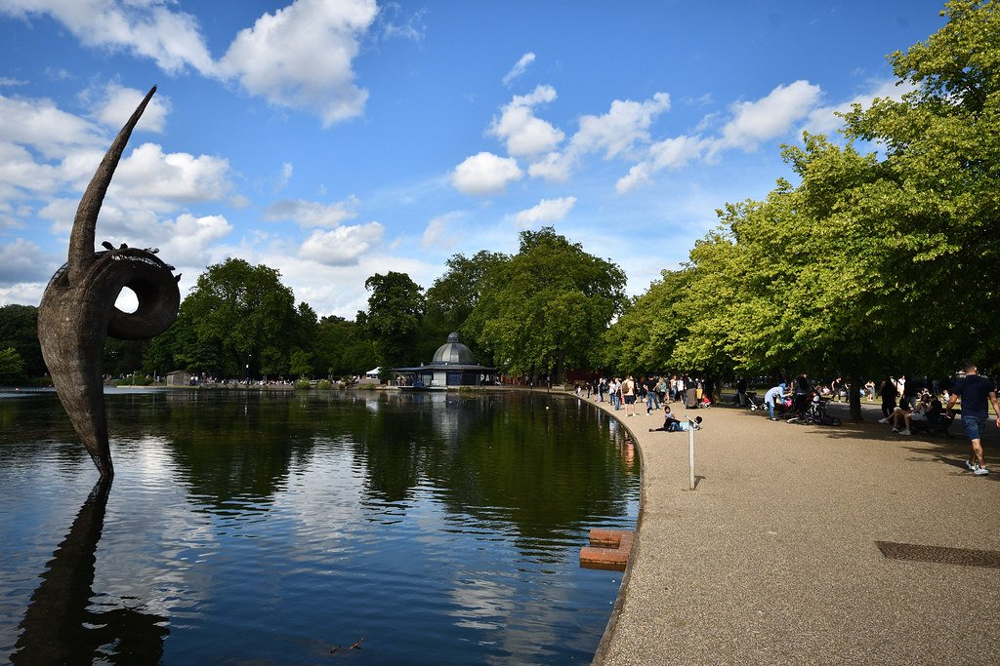

Hackney has no Underground station, no major museum and no monument. What it has is three parks, two canals, a 50-metre outdoor pool and one of the best Saturday markets in London.

This is residential London — the version most visitors never see, and the one that rewards a Saturday rather than a sightseeing itinerary.

Hackney has its own share of the commemorative plaques marking where notable people lived or worked - see them on our [interactive map](/plaques/?area=hackney).

## Why visit — and who should skip it

**Come here if** it is Saturday and you like food. Broadway Market, London Fields and the canal make an easy, genuinely good half day, and it is fifteen minutes from Liverpool Street on the Overground.

**Skip it if** you are on a short trip, or it is a Tuesday. There is nothing to tick off here, and midweek Hackney is simply a place where people live.

## Top sights and activities

1. **Broadway Market** — Saturdays only, 09:00 to 17:00. A single street of food and produce traders between London Fields and the canal. Go before 11:00.
2. **London Fields Lido** — A heated 50-metre outdoor pool, open all year including winter. Book a session; it fills fast in summer.
3. **London Fields** — The park itself, with a cricket pitch, a good pub on each corner and barbecues permitted in designated areas.
4. **Victoria Park** — 213 acres east of the canal, opened in 1845 as London's first public park. Boating lake, deer enclosure and a good canal-side pub.
5. **Regent's Canal towpath** — Runs west to Islington and King's Cross, east to Hackney Wick and the Olympic Park. Flat and traffic-free throughout.
6. **Hackney Wick** — Converted warehouses, artists' studios and canal-side breweries opposite the Olympic Park. Best on a summer afternoon.
7. **Hackney Empire** — A restored 1901 music hall on Mare Street, still programming comedy, pantomime and variety.

*Victoria Park's boating lake. It opened in 1845 as the first public park in Britain built for the working poor. Photo: [martin_vmorris](https://www.flickr.com/photos/24108242@N05/50050092236), [CC BY-SA 2.0](https://creativecommons.org/licenses/by-sa/2.0/).*

## Key streets and micro-districts

### Broadway Market and London Fields
The centre of visitor Hackney. The Saturday market, the park, the lido and Netil Market just off it.

### Mare Street and Hackney Central
The everyday high street. The Hackney Empire, the Picturehouse cinema and the Overground station.

### Victoria Park and the canal
East. The park, the towpath and the run of canal-side pubs along the Hertford Union.

### Hackney Wick
Further east on the canal. Warehouse studios, breweries and the footbridges over to the Olympic Park.

### Clapton and the marshes
North. Hackney Marshes — famous for its Sunday football pitches — and the River Lea navigation.

## Where to eat and drink

| Spot | Style | Price | Why go |
| --- | --- | --- | --- |
| **Broadway Market stalls** | Food market | £ | Saturdays; oysters, salt beef, cheese and produce |
| **Netil Market** | Food yard | £ | Just off Broadway Market, with a rooftop bar above |
| **Pophams** | Bakery | £ | Bostock and pastries; queues out the door at weekends |
| **Mangal 2** | Turkish ocakbasi | ££ | Dalston end; charcoal grill, long-standing local favourite |
| **The Pembury Tavern** | Pub | ££ | Large, family-friendly, good beer near Hackney Central |
| **Crate Brewery** | Brewery and pizza | ££ | Canal-side at Hackney Wick, with tables on the water |

## Getting there

**By Overground.** There is no Tube in Hackney. The **London Overground** is the way in: **London Fields** for Broadway Market, **Hackney Central** for Mare Street, **Hackney Wick** for the warehouses and the Olympic Park. A few minutes from Liverpool Street or Highbury & Islington.

**Best exit.** From London Fields station, turn left and walk south — Broadway Market is five minutes down the far side of the park.

**By canal.** The Regent's Canal towpath runs west to King's Cross in about 35 minutes and east to the Olympic Park in 20. Flat and traffic-free.

**By bus.** The 55 and 388 run from central London and are useful in the evening when the Overground thins out.

## How long to spend, and when to go

| If you have | Do this |
| --- | --- |
| **Two hours** | Broadway Market and London Fields |
| **Half a day** | Add the canal walk east to Victoria Park |
| **A full day** | Continue to Hackney Wick and the Olympic Park |

**Best time:** Saturday morning, before 11:00. The market is the reason to come and it gets very full.

**Combine it:** Columbia Road Flower Market is Sunday morning and twenty minutes south-west — an easy weekend pairing with Shoreditch.

## Suggested half-day route

1. **Start:** London Fields Overground. Walk south through **London Fields** past the lido.
2. **Broadway Market:** The full length of the street, then **Netil Market** just off it.
3. **The canal:** Join the **Regent's Canal** at the bottom of Broadway Market and head east.
4. **Victoria Park:** Through the park to the boating lake.
5. **Finish:** East along the Hertford Union to **Hackney Wick** and a canal-side brewery.

## Common mistakes to avoid

1. **Coming for Broadway Market on the wrong day.** Saturday only.
2. **Looking for a Tube station.** There isn't one. Hackney is Overground and buses.
3. **Turning up at the lido without booking.** It is a 50-metre pool and sessions sell out in summer.
4. **Arriving at the market after midday.** It is shoulder to shoulder by then.
5. **Expecting sights.** There is no museum or monument. Come for the market, the parks and the canal.
6. **Missing Victoria Park.** It is fifteen minutes east of Broadway Market and one of the best parks in London.

## Where to stay

Cheap by London standards and genuinely local, with the trade-off of Overground-only transport.

- **London Fields and Broadway Market** — Small guesthouses and rentals, walkable to everything here.
- **Hackney Wick** — Warehouse conversions near the Olympic Park.
- **Shoreditch** — Twenty minutes south-west, with far better transport and more hotels.
