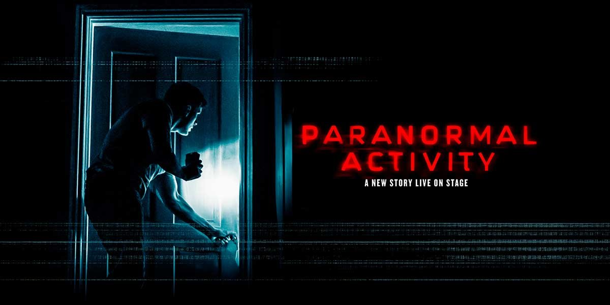

**Halloween 2026 lands on a Saturday** — the one date on the calendar that turns London's Halloween up to full volume. Scare attractions, club nights, ghost walks and one-off parties all run at full strength instead of being squeezed into the nearest weekend, which means more is on, and the best of it will sell out earlier than usual. Here's what's actually worth booking, from genuine scares to where to find a costume at this notice.

---

## Scare attractions

Most of London's big scare attractions are a train ride out — Thorpe Park and Chessington are in Surrey, Tulleys is in Sussex. If you want a proper scare without leaving the city, there is now one option.

### The Nightmare Realm, Avery Hill Mansion

The Gatehouse to Avery Hill, Bexley Road, London SE9 2PQ. **9 October to 1 November 2026**, on **18 selected nights** through the season.

An Irish attraction making its first London appearance, built inside a genuine Victorian mansion in Greenwich, with two headline immersive experiences plus five smaller "secret" ones hidden around the building. Allow **1.5–2 hours**, and arrive 15 minutes before your slot.

**Recommended for ages 13 and over**; under-16s need a responsible adult with them. It runs a strict no-touch policy, bans alcohol and full-face masks, and warns of strobe lighting, theatrical smoke and sudden scares.

**Getting there:** Jubilee line to North Greenwich, then the 132 bus (a two-to-five-minute walk from the stop), or Southeastern rail to New Eltham or Falconwood, both a 15–20 minute walk. Free on-site parking if you are driving.

Prices are not published on the event's own pages — book through [the official ticketing site](https://thenightmarerealmuk.rezgo.com/) to see the current tiers.

For the traditional theme-park scare, three are genuinely worth the train fare.

### Thorpe Park: Fright Nights

Chertsey, Surrey. Runs on selected dates from **2 October through to 1 November 2026**, park open 10am–9pm on event nights. Five mazes for 2026 — Tenement is new — plus scare zones including Rebel Ball and The Crows.

**Book online in advance**: park entry from **£39**, or entry plus the four-maze package from **£71**. Buying at the gate roughly doubles the price. Thorpe Park's own site warns that popular dates sell out — and **Saturday 31 October, Halloween itself, is the one to book earliest.** Mazes are recommended for **13 and over**; The Conjuring 4D Experience needs **15 and over**.

### Chessington: Howl'o'ween

Surrey, next to Thorpe Park. Runs on selected dates **3 October to 1 November 2026**. This is the family-friendly version — no scare mazes, just Halloween shows, a "Vampire's Lair" zone and trick-or-treat trails, pitched at all ages rather than teenagers and adults.

Advance tickets from **£39**; under-90cm children go free.

**The choice between this and Thorpe Park is really a choice about age.** Thorpe Park's Fright Nights is a 16+ event built on scare mazes and actors who chase you; Chessington deliberately has none of that, and the theme park rides run as normal alongside the Halloween dressing. If you have children under about twelve, Chessington is the one that works and Thorpe Park is the one that ends in tears.

Both are in Surrey and both are a train plus a shuttle or a walk, so neither is a quick evening out from central London — budget most of a day.

### Tulleys Farm: Shocktober Fest

Crawley, West Sussex, near Gatwick. Billed as Europe's largest scream park. Open nightly from **13 October to 1 November 2026** (plus preview nights earlier in October), gates 4.30pm, haunts running 5.30pm–11.30pm.

Prices are dynamic and rise toward peak dates — expect **£43–£70** for a standard pass, more with Fast Track add-ons. This is a genuinely **16+ event**: expect strong language, adult themes and one show (Carnevil Cabaret) that admits nobody under 16 regardless of who they are with. Under-16s who are admitted to the rest of the park need a paying adult with them, and 16–21-year-olds need photo ID at the gate.

---

## Cinema

If a maze is not your thing, London's independent cinemas run entire seasons around it.

**The Prince Charles Cinema** in Leicester Square is the main event. Its **HorrOctober** season runs across the whole of October 2026, with horror films programmed in the schedule most days, building to two all-night marathons on **Saturday 24 October** — a Mystery Horror Marathon and a Classic Horror Marathon, both from around £20 — and the main event on **Saturday 31 October itself**: a Halloween Marathon running the *Halloween* franchise back to back through the night, **18+, on 35mm film**. Halloween day is also programmed with individual horror screenings from mid-morning onward, including *Nosferatu* with a live score.

A few independents run smaller Halloween-night screenings worth knowing about: **Genesis Cinema** in Bethnal Green shows the original 1978 *Halloween* on the night itself, and **Rio Cinema** in Dalston runs a midnight *Rocky Horror Picture Show* singalong with a live shadow cast on 31 October.

---

## Theatre and immersive experiences

One West End show is a horror title outright, two long-running shows do the job without needing a Halloween theme at all, and one production is a genuine immersive experience built for the season.

### Paranormal Activity, Ambassadors Theatre

A stage adaptation of the horror film franchise, running at the Ambassadors until **7 November 2026** — so it covers Halloween but closes shortly after, unlike the longer-running shows on this list. It is a small venue, and a good fit for the night alongside the other shows here.

It's a popular show, so it is likely to fill up over Halloween — book early.

**The closing date is the thing to watch.** Because it finishes on 7 November, the Halloween week performances are the last chance rather than the middle of a long run, and they price and sell accordingly. If you specifically want it on the 31st, that is the most contested date in the run.

The Ambassadors is a small West End house, which is the right scale for this — a horror premise in a thousand-seat theatre does not work the same way.

### Stranger Things: The First Shadow, Phoenix Theatre

Booking through **Sunday 27 December 2026**, so it comfortably covers Halloween. A prequel to the Netflix series, set in Hawkins in 1959, following young Jim Hopper, Bob Newby and Joyce Maldonado.

Performances run Tuesday to Saturday at 7pm, with matinees Friday and Saturday at 1pm and Sunday at 3pm. **Three hours including an interval.**

**Recommended for ages 12 and over**; under-5s are not admitted, and under-16s need an accompanying adult. Contains gunfire audio, loud noises, explosions, haze, strobe lighting and strong language.

### Beetlejuice, Prince Edward Theatre

*Curtain call at the Prince Edward. The sandworm on the left and the tipping house behind give you the tone in one frame — this is a comedy with a ghost in it, not a horror show.*

The stage musical of the film, currently running as a **limited West End engagement** — worth checking the closing date before you book, since it may not run right through to Halloween.

**Look out for Netherworld performances**, a cheaper way in: fixed pricing at **£30, £40 or £50** a ticket, rather than the usual dynamic pricing that climbs closer to the show and toward Halloween itself.

That distinction is worth understanding, because it is unusual. Most West End pricing rises as a date fills, so a Halloween-week ticket bought late is the worst-value seat in the run. Netherworld performances are set at a fixed band regardless, which means they are the one part of the schedule that does not punish you for booking late — and they sell out first as a result.

It is also the least frightening thing in this section by a distance: a comedy musical with a ghost in it rather than a horror show, and fine for children who would not sit through the others.

### Silence, COLAB Theatre

A **Halloween-specific immersive production** rather than a running show — you investigate a Southwark murder with Rev. Stanley Park, working through clues, a ritual and a puzzle while a vengeful spirit stalks the building. The premise is built around staying quiet: making a sound draws the spirit toward you.

COLAB is a genuine immersive theatre company with a back catalogue of similar shows, rather than a seasonal pop-up — worth checking their site for exact October dates and prices before booking, since these productions tend to run for a fixed, short window.

### The Halloween Cabaret, The Scarlet Lotus

*31 October only · 18+ · about 3.5 hours*

**The grown-up option, and the only thing in this guide that combines a Halloween theme with dinner and a full cabaret bill.** Burlesque, circus, aerial and fire performance, in a room styled for the night.

**Two sittings on Saturday 31 October — an early show at 4.30pm and an evening show at 7.15pm** — which is worth knowing, because the early one is the easier ticket and the same show.

**Silver seats £49, down from £69**, with premium and front-row VIP tiers above that. **Cocktails are included**; roaming welcome canapés are a £40 supplement added after you have chosen seats, so the headline price is not the final one if you want food on arrival.

**Recommended 18+.** Dressing up is encouraged rather than required, and the best-dressed guest wins a bottle of wine. Allow the full three and a half hours — this is an evening rather than a show you drop into. [Book via the London Cabaret Collective](https://londoncabaretcollective.co.uk/products/the-halloween-cabaret).

### The Halloween Lecture, Royal Institution

A spooky-science live show for families rather than a scare — eerie fog, pumpkins turned into light sources, and other demonstrations from the Ri's own team. Doors 6.45pm, talk from 7pm. **£16/£10 for the general theatre audience, £7 for Ri Members and Patrons.** Green Park is the nearest station, with step-free access throughout. The exact October date was not yet listed at the time of writing — check the [Royal Institution's own listing](https://www.rigb.org/whats-on/halloween-lecture) closer to the time.

It is worth knowing what this is not: there are no actors, no jump scares and nothing chasing anybody. It is a demonstration lecture in the Ri's famous tiered theatre, the same room the Christmas Lectures are filmed in, pitched at families who want the season without the fright. For a child who wants to join in with Halloween but would be genuinely upset by a scare maze, it is the best thing on this page.

---

Powered by <a target="_blank" rel="sponsored" href="https://www.getyourguide.com/london-l57/">GetYourGuide</a>

## Ghost tours

Jack the Ripper walks are a genuine London institution, not just a Halloween novelty — the two best have been running year-round for decades. A couple of things to know before booking: **the Ripper walks don't all run every night**, so check the schedule against 31 October specifically, and the walking-tour trade has its share of copycats trading on famous names, so stick to operators with a long track record and a real review history.

### Jack the Ripper Walking Tour, London Walks

Run by London's oldest walking-tour company for more than 50 years, and the closest thing to a definitive version. The guides are the draw — London Walks uses professional guides, several of them actors and historians, rather than a script handed to whoever is available.

**£20, nightly at 7.30pm plus a Saturday 3pm matinee**, and it runs on Halloween night itself. **No need to book ahead — just turn up at Tower Hill station.**

That last point is the practical difference between this and the Ripper-Vision walk below. This one you can decide on at six o'clock and still do; that one you cannot. If Halloween night is already busy and you want something you can slot in without committing in advance, this is the one.

### The Jack the Ripper Tour ("Ripper-Vision")

A more theatrical version: the guide carries a projector and puts **crime-scene photographs onto the actual walls where the murders happened**, which is the gimmick and, by most accounts, an effective one.

**£18 adult, £10 child** — cheaper than London Walks and the only one of the two with a child price. Thursday to Sunday at 5pm and 7.30pm, Monday to Wednesday at 7.30pm only, and it runs on the night itself. It meets at **Aldgate East** rather than Tower Hill.

**Booking is required**, which is the trade-off: you get the better-reviewed walk — over 3,000 Tripadvisor reviews at 4.6 — but you have to commit in advance, and Halloween night sells out. The 5pm slot is the one people forget about, and in late October it is dark by then anyway.

### Ghost Bus Tours

Not a walk — a 75-minute comedy-horror ride around London's landmarks on a converted 1960s Routemaster double-decker. **£25 adult, £17 child, £63 family.** Meets near **Embankment**. Book through [theghostbustours.com](https://theghostbustours.com/london/buy-tickets/) — the old ghostbustours.com domain has changed hands and no longer belongs to this operator.

Two more worth knowing about, though neither falls on Halloween night itself this year: **Serial Killers: The Blood and Tears Walk**, a well-reviewed look at the Ripper and nine other London murder cases, runs Wednesday to Friday only, so the closest date is Friday 30 October; and London Walks' own **Haunted London** walk runs Sundays only, landing on 1 November.

**The London Dungeon** has a Jack the Ripper scene among its scare-actor sets, but its Halloween 2026 page is still just a "coming soon" placeholder with no dates or prices live yet — worth checking [their listing](https://www.thedungeons.com/london/whats-inside/events/halloween/) again nearer the time.

---

Powered by <a target="_blank" rel="sponsored" href="https://www.getyourguide.com/london-l57/">GetYourGuide</a>

## Genuinely creepy London, no theming required

London does not need a Halloween season to be macabre — these places are unsettling all year round, and October just happens to be the right mood for visiting them.

**Highgate Cemetery**, Swain's Lane, N6 6PJ. Both the East and West sides are open to explore in your own time — you have not needed a guided tour for the West Cemetery since 2020, whatever older guides tell you. Open daily, 10am–5pm March to October and 10am–4pm the rest of the year.

**The Old Operating Theatre Museum**, 9a St Thomas Street, SE1 9RY. A genuine Victorian surgical theatre above a church, reached by a spiral staircase. Thursday to Sunday, 10.30am–5pm. **Adult £10, concession £8, child £6.50.**

**Hunterian Museum**, Royal College of Surgeons, 38–43 Lincoln's Inn Fields, WC2A 3PE. Anatomical specimens and surgical history, **free**, Tuesday to Saturday 10am–5pm.

**Crossbones Graveyard**, Redcross Way, SE1. An unmarked burial ground for medieval sex workers and the poor, now a community shrine with ribbons tied to the gates. Free, always accessible, with a vigil held on the 23rd of every month.

**Viktor Wynd Museum of Curiosities**, 11 Mare Street, E8 4RP. Taxidermy, shrunken heads and genuine oddities in Hackney. **Adult £12**, with a **£4 walk-in Thursday** discount. Booking ahead is recommended, especially if you are travelling any distance.

**Sir John Soane's Museum**, 13 Lincoln's Inn Fields, WC2A 3BP. A house crammed with antiquities including an Egyptian sarcophagus, **free**, no booking needed, Wednesday to Sunday.

**Dennis Severs' House**, 18 Folgate Street, E1 6BX. A "still-life drama" through ten rooms frozen mid-scene, lit by candlelight — not gory, but genuinely eerie. Booking required. **£16 daytime, £25 for a Silent Night visit.**

**The Clink Prison Museum**, 1 Clink Street, SE1 9DG, on the site of one of England's oldest prisons. **Adult £10**, open daily 10am–6pm, near London Bridge station.

**Bethlem Museum of the Mind**, Monks Orchard Road, Beckenham BR3 3BX — the museum of the former Bethlem Royal Hospital, the original "Bedlam." **Free**, Wednesday to Saturday. It is out in Beckenham rather than central London, so it is a deliberate trip rather than something to fold into a day elsewhere.

---

## Club nights and parties

Halloween falling on a Saturday means the big club nights are running at full strength, and several are already selling through their early ticket tiers months out — worth booking ahead for anything specific.

**Drumsheds** hosts **elrow Horroween**, a daytime-into-night festival back after a two-year hiatus, 1pm–10.30pm, 18+, from £41.95 rising through already-sold-out early tiers to £56.95 general admission. [Book via Drumsheds](https://drumshedslondon.com/event/elrow-horroween-festival/).

**Fabric** runs its regular Saturday techno booking on the night itself — not Halloween-branded, but a hot ticket regardless, 11pm–7am. A separate, student-oriented Nightmare Rave happens two nights earlier, on Thursday 29 October.

**Studio 338** runs **Release Halloween**, 7pm–6am, 18+, from £17.50 rising to £30.

**Club de Fromage**, the long-running Camden indie and pop night, does its Halloween special at Dingwalls, 11pm–3am, 18+.

**On the river**, two Halloween boat parties cruise the Thames on the night: **Ghost Ship Boat Party** (from Westminster, 7.30pm–6am, from £21.94) and the **Silent Halloween Disco Boat** (from Tower Millennium Pier, 6.45–11pm, from £25.30, silent-disco headphones instead of a PA).

For something cheaper and looser, **93 Feet East** in Shoreditch and **Electric Ballroom** in Camden both run big Halloween nights from a few pounds on the door — both have sold out in previous years, so don't leave it too late.

**London's LGBTQ+ scene usually goes big for Halloween**, but as of publication Heaven, G-A-Y and The Glory hadn't yet announced their October programming — check back in September for line-ups.

---

Powered by <a target="_blank" rel="sponsored" href="https://www.getyourguide.com/london-l57/">GetYourGuide</a>

## Where to get a costume

Skip Angels on Shaftesbury Avenue — that shop closed in 2014, and most of London's famous theatrical costumiers are trade-only. Two places will genuinely hire to a member of the public.

### Prangsta Costumiers, New Cross

**Appointment only** — Monday to Friday 11am–7pm, Saturday 10am–6pm.

The serious option, and the one to book early. A fully accessorised costume is **£130–£350 plus VAT** depending on how elaborate you go, with a **£300 refundable deposit** on top and a **£20 per person styling consultation**. Individual pieces start around £15, with statement headpieces £35–£100 plus VAT.

Standard hire is four days, **dropping to three over Halloween** because demand is so high. They will also fit you remotely from photographs if you cannot get to New Cross. Specialisms run to burlesque, circus, fantasy creatures, the eighteenth century, the 1920s and Venetian masquerade.

> ⚠️ **No children's sizes.** Some of the range fits teenagers, but they do not stock or make child costumes.

### Costume Studio, Islington

Monday to Friday 9.30am–6pm, **Saturday 10am–5pm**.

The walk-in option, and much less formal. Their own wording is the useful part: *"You are welcome to visit to see exactly what we have and goods can be selected and hired there and then"* — and they are explicit that a single costume is as welcome as a production order. Prices depend on what you take and how long for, and you pay in full before you leave. Saturday opening makes them the realistic choice if you have left it late.

**For make-up and prosthetics**, go to **Screenface** in Covent Garden (Mon–Wed 10am–6pm, Thu–Sat 10am–7pm) — stage make-up, SFX and prosthetics, hair effects, face and body paint.

**Outside London**, the RSC hires to the public from Stratford-upon-Avon at around **£90 plus VAT** for a full costume, though the minimum hire is a week and it is appointment-only through an online form.

---

## Free Halloween things

Be honest with yourself about this one: **London does not have a strong trick-or-treat culture**, and there is no single marquee free citywide event the way there is for Bonfire Night. What free Halloween activity exists is scattered and hyperlocal — library events, community centres, and a handful of neighbourhood trails.

**High Street Kensington runs the best-known free one.** Halloween Happenings is an annual, non-ticketed trail through the shopping district, typically running from around 24 to 31 October, with shop workshops, a gothic vintage flea market and a Halloween takeover of Holland Park on the day itself. Check [highstreetkensington.co.uk](https://highstreetkensington.co.uk/) closer to the date for the 2026 programme, since it is not published this far ahead.

**The free museums are your reliable fallback.** The British Museum, Natural History Museum, Wellcome Collection, Hunterian Museum and Sir John Soane's Museum are all free year-round, and several run half-term activity programmes that land right across Halloween week — the British Museum has previously run storytelling and Day of the Dead performances during the October half term. None of these had confirmed 2026 dates at the time of writing, so check each museum's own listings in October.

---
