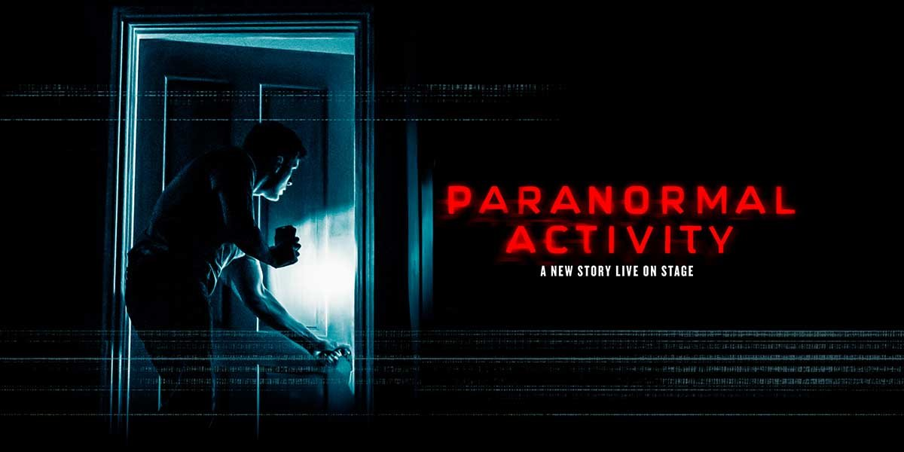
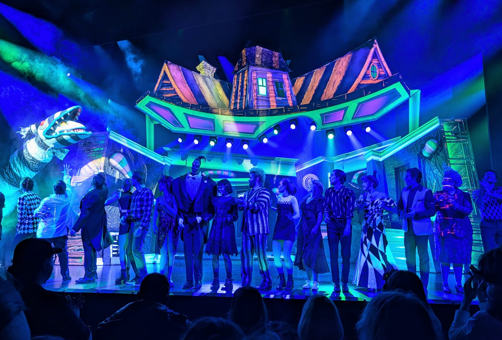

**Halloween 2026 lands on a Saturday** — the one date on the calendar that turns London's Halloween up to full volume. Scare attractions, club nights, ghost walks and one-off parties all run at full strength instead of being squeezed into the nearest weekend, which means more is on, and the best of it will sell out earlier than usual. Here's what's actually worth booking, from genuine scares to where to find a costume at this notice.

---

> 🧭 **Plan the rest of it:** [Bonfire Night, the week after](/articles/bonfire-night-london/) · [Immersive experiences](/articles/immersive-experiences-london/) · [London theatre guide](/articles/london-theatre-guide/) · [Things to do in London in October](/articles/things-to-do-in-london-in-october/)

## Scare attractions

Most of London's big scare attractions are a train ride out: Thorpe Park is in Surrey, Tulleys is in Sussex, and Chessington is the Zone 6 exception. If you want a proper scare without leaving the city, there are two walk-through attractions, in Greenwich and Bethnal Green.

### The Nightmare Realm, Avery Hill Mansion

The Gatehouse to Avery Hill, Bexley Road, London SE9 2PQ. **9 October to 1 November 2026**, on **18 selected nights** through the season.

An Irish attraction making its first London appearance, built inside a genuine Victorian mansion in Greenwich. Your ticket covers two headline walk-through horror experiences, Avery Hill Asylum and Sundown Manor, plus Halloween Town, an outdoor village of performers, and five hidden "secret" experiences. Allow **at least two hours**, arrive 15 minutes before your slot, and book an earlier slot: the headline attractions start closing from 10pm and everything shuts by 10.30pm.

**Recommended for ages 13 and over**; under-16s need a responsible adult with them. It runs a strict no-touch policy, bans alcohol and full-face masks, and warns of strobe lighting, theatrical smoke and sudden scares.

**Getting there:** Jubilee line to North Greenwich, then the 132 bus (a two-to-five-minute walk from the stop), or Southeastern rail to New Eltham or Falconwood, both a 15–20 minute walk. Free on-site parking if you are driving.

Fridays, Saturdays and the final week before Halloween are peak nights and sell out first; Sunday to Thursday is off-peak. Prices are not published on the event's own pages; [The Nightmare Realm's own site](https://thenightmarerealm.com/) links to the official ticketing site, where the tiers show.

### Hell's Waiting Room, The Curiosity Shop, Bethnal Green

*23 October to 1 November 2026 · from £25 · ages 12+*

A live-actor Halloween walk-through behind a curiosity shop at 261 Paradise Row, E2 9LE, run by ScreamWorks. It runs through nine rooms of the underworld's overflow queue: a medical department where you may be sealed in a coffin, a canteen serving your "last meal", a court of moral trials and a descent to the lower levels. Expect darkness, crawl spaces, one-on-one encounters and sudden scares.

**Recommended for ages 12 and over**; under-16s need an adult who stays with them throughout. ScreamWorks calls it an intense horror experience, not a family attraction, and it is not suitable for anyone pregnant or with epilepsy. Standard tickets queue first come, first served, with groups of up to eight admitted every five minutes; Fast Track tickets cut the wait. [Book with ScreamWorks](https://screamworks.co.uk/experience-hells-waiting-room-scare-maze/).

For the traditional theme-park scare, three are worth the train fare.

### Thorpe Park: Fright Nights

Chertsey, Surrey, KT16 8PN. Runs **2–4 and 9–11 October, then 15 October to 1 November 2026**, park open 10am–9pm on event days. Five mazes for 2026 — Tenement is new — plus scare zones including Rebel Ball and The Crows.

**Book online in advance** on [Thorpe Park's own site](https://www.thorpepark.com/explore/events/halloween-fright-nights/): park entry from **£39** (£66 at the gate), or entry plus the Fearsome Four maze package from **£71** (£98 at the gate). That package covers four of the five mazes, not the new Tenement, which is sold separately. Thorpe Park warns that popular dates sell out, and **Saturday 31 October, Halloween itself, is the one to book earliest.** Mazes are recommended for **13 and over**; The Conjuring 4D Experience needs **15 and over**.

**Getting there:** train from Waterloo to Staines, then the 950 bus to the park. Contactless works to Staines but Oyster does not, and the 950 takes cash or contactless only. Our [Thorpe Park guide](/articles/thorpe-park-day-trip/) has the times, the fares and every ride's height limit.

### Chessington: Howl'o'ween

Leatherhead Road, Chessington, KT9 2NE. Runs **3–4 and 10–11 October, then 17 October to 1 November 2026**. This is the family-friendly version — no scare mazes, just Halloween shows and a "Vampire's Lair" zone, pitched at all ages, not teenagers and adults. The Enchanted Hollow trick-or-treat trail is an extra, from £9 a head.

Advance day tickets from **£34** (£66 at the gate); under-90cm children go free. Book on [Chessington's own site](https://www.chessington.com/explore/events/halloween/).

**Getting there:** trains from Waterloo, Clapham Junction and Wimbledon run to Chessington South, in Zone 6 so Oyster works, about 35 minutes from central London and a 10-minute walk from the station. Our [Chessington guide](/articles/chessington-world-of-adventures-day-trip/) has the rest: heights, Fastrack and the days it is shut.

**The choice between this and Thorpe Park is really a choice about age.** Thorpe Park's Fright Nights is built for teenagers and adults (mazes 13 and over), with scare mazes and actors who chase you; Chessington deliberately has none of that, and the theme park rides run as normal alongside the Halloween dressing. If you have children under about twelve, Chessington is the one that works and Thorpe Park is the one that ends in tears. For younger children still, [LEGOLAND Windsor's Brick or Treat](/articles/legoland-windsor-day-trip/) (from £37) and [Paultons Park's Halloween Spooktacular](/articles/paultons-park-day-trip/) (in the normal ticket, with late openings to 7.30pm) dress up the rides with shows and characters, not scares.

Chessington is the easier journey from central London. Thorpe Park needs the Staines change and a bus, so budget most of a day.

### Tulleys Farm: Shocktober Fest

Crawley, West Sussex, near Gatwick. Billed as Europe's largest scream park. Open on **26 nights from 2 October to 1 November 2026** — long weekends to start with, then most nights from 13 October and every night from 20 October — gates 4.30pm, haunts running 5.30pm–11.30pm.

Book on [Tulleys' own site](https://www.shocktoberfest.co.uk/). Prices are dynamic and rise toward peak dates — expect **£43–£70** for a standard pass, more with Fast Track add-ons. This is a **16+ event**: expect strong language, adult themes and one show (Carnevil Cabaret) that admits nobody under 16 regardless of who they are with. Under-16s who are admitted to the rest of the park need a paying adult with them, and 16–21-year-olds need photo ID at the gate.

### Tulleys Pumpkin Festival

*3 and 4 October, 9–11 October, then daily 15–31 October 2026 · 9.30am–5.30pm to 24 October, 9.30am–5pm from 25 October*

The daytime, family side of the same farm in Crawley (sat-nav RH10 4PD, Turners Hill Road): a field of 1.5 million pumpkins and gourds, a wheelbarrow per group, and a new Pumpkin Valley of giant pumpkin sculptures for 2026, plus street theatre, a vintage carousel and a 33-metre observation wheel. You pay for each pumpkin you pick by its size ring, from **£1 to £25**, on top of the entry ticket you book online. Wellies are advised, as the fields are open to the weather. Under-16s need a paying adult.

Thursday 15 October is Pooches & Pumpkins, the dog day. On Sunday 1 November the farm reopens from 4pm to 11pm for the Pumpkin Nights fireworks finale, with fireworks at 7.15pm. Tickets and dates are on [Tulleys Pumpkin Festival's site](https://www.pumpkinfarm.co.uk/dates-times).

---

## Cinema

If a maze is not your thing, London's independent cinemas run entire seasons around it.

**The Prince Charles Cinema** in Leicester Square is the main event. Its **HorrOctober** season runs across the whole of October 2026, building to two all-night marathons on **Saturday 24 October** — a Mystery Horror Marathon (five unannounced films, from 11pm, **£22.50, or £20 for members**) and a Classic Horror Marathon (*The Thing*, *The Exorcist*, *The Shining*, *A Nightmare on Elm Street* and *The Texas Chain Saw Massacre*, from 11.30pm) — and the main event on **Saturday 31 October itself**: a Halloween Marathon running the first six *Halloween* films back to back from 11.15pm, with a second screening from 11.45pm, **18+**. The original 1978 *Halloween* also plays there at 3.10pm that day. Doors are shut to new arrivals after midnight on the marathon nights.

A few independents run smaller Halloween-night screenings: **Genesis Cinema** on Mile End Road shows the original 1978 *Halloween* at 9pm on the night itself, and **Rio Cinema** in Dalston runs Queer Horror Nights, a midnight *Rocky Horror Picture Show* sing-along with a live Shadow Cabaret Cast on 31 October, **18+**, with the bar open from 10.30pm.

---

Powered by <a target="_blank" rel="sponsored" href="https://www.getyourguide.com/london-l57/">GetYourGuide</a>

## Theatre and immersive experiences

One West End show is a horror title outright, and two long-running shows do the job without needing a Halloween theme at all. After them come the one-off Halloween performances and nights across the city, from a candlelit ghost story to a hotel taken over by Dante's Inferno.

### Paranormal Activity, Ambassadors Theatre

A stage adaptation of the horror film franchise, booking at the Ambassadors until **2 January 2027**. The Ambassadors is one of the smallest West End houses, which suits a horror premise; book early for Halloween night itself.

### Stranger Things: The First Shadow, Phoenix Theatre

The London run **ends on Wednesday 23 December 2026**, so it comfortably covers Halloween. A prequel to the Netflix series, set in Hawkins in 1959, following young Jim Hopper, Bob Newby and Joyce Maldonado.

Performances run Tuesday to Saturday at 7pm, with matinees Friday and Saturday at 1pm and Sunday at 3pm. **Three hours including an interval.**

**Recommended for ages 12 and over**; under-5s are not admitted, and under-16s need an accompanying adult. Contains gunfire audio, loud noises, explosions, haze, strobe lighting and strong language. Tickets from **£38.80**, plus a £3.80 transaction charge, on [the official site](https://uk.strangerthingsonstage.com/tickets/).

### Beetlejuice, Prince Edward Theatre

The stage musical of the film, running as a **limited West End engagement** with its final performance on **2 January 2027**, so it comfortably covers Halloween.

**Look out for Netherworld performances**, a cheaper way in: fixed pricing at **£30, £40 or £50** a ticket, rather than the usual dynamic pricing that climbs closer to the show and toward Halloween itself.

That distinction is worth understanding, because it is unusual. Most West End pricing rises as a date fills, so a Halloween-week ticket bought late is the worst-value seat in the run. Netherworld performances are set at a fixed band regardless, which means they are the one part of the schedule that does not punish you for booking late — and they sell out first as a result.

It is also the least frightening thing in this section by a distance: a comedy musical with a ghost in it, not a horror show, and fine for children who would not sit through the others.

### GrimFest, Old Red Lion Theatre, Angel

*13 to 31 October 2026 · more than a dozen shows · most tickets £13 to £16.50*

**London's horror theatre festival, in its fifth year, in the theatre above the Old Red Lion pub at 418 St John Street, near Angel station.** More than a dozen shows, each playing for a few nights only, and most run about an hour, from ghost stories and folk horror to black comedy. [Dating the Dead](https://weareoldred.co.uk/whats-on/grimfest/dating-the-dead/) (23 to 26 October) is a comedy about a stage medium who gets a few hours in the afterlife to choose between an old flame and a new one.

The curtain-raiser, 'Twas the Fright Before GrimFest on Monday 12 October, is a 90-minute taster at **£6.66**. Prices on the venue's site include the booking fee. [See the GrimFest programme](https://weareoldred.co.uk/whats-on/grimfest/).

### The Séance, Greenwich Theatre

*Saturday 31 October 2026 · 7.30pm · 1 hour 40 minutes · ages 12+*

A theatrical Halloween experience in the theatre's main house at Greenwich Theatre, Crooms Hill, SE10 8ES. Four siblings gather at the family home after their father's suspicious death, and a séance that starts as a game turns darker. There is one performance, on Halloween night. [Book via Greenwich Theatre](https://greenwichtheatre.org.uk/events/the-seance/).

### A Ghost Story by Candlelight, Dennis Severs' House

*24, 25, 29, 30 and 31 October 2026 · 6pm or 8pm · £58 plus a £2 booking fee · ages 12+*

Walter de la Mare's short story "Out of the Deep", read by a flickering fire in the candlelit Withdrawing Room of 18 Folgate Street, Spitalfields, E1 6BX. You are served a glass of Crémant or a soft drink in the Dining Room first, and the reading (performed by Lisa D'Agostino, with music and sound by Dominic Stokes) is limited to **16 guests**. Latecomers cannot be admitted, tickets are non-refundable and there is no photography. [Book via Dennis Severs' House](https://www.dennissevershouse.co.uk/event/a-ghost-story-by-candlelight).

### Dante's Inferno, The Mandrake

*Saturday 31 October 2026 · 8.30pm to 3am, last entry 11pm · 21+ · from £140*

A hotel-wide immersive night at the Mandrake, 20–21 Newman Street, Fitzrovia, W1T 1PG: nine circles of Hell told through installations, opera, live performance and tableaux vivants, with DJs until 3am. **21+, with government photo ID checked at the door.** The dress code is "Dolce Morte", and there are strobes, flashing lights and loud sound throughout. An optional nine-course dinner runs from 7.30pm to 10pm with a strict last entry of 8pm; VIP tables carry a minimum spend of £1,500 to £3,000, and stay packages are on sale. [Book via the Mandrake](https://themandrake.com/halloween/).

### Halloween Ball, The Candlelight Club

*Saturday 31 October 2026 · 7pm to 1am · 18+ · secret location in south London*

A 1920s speakeasy party in an abandoned ballroom whose location is emailed after you buy. Sinister songbird Elise Roth and her band the High Spirits play 1920s and 1930s songs, Suri Sumatra performs burlesque, and there is a resident tarot reader. The dress code is Jazz Age with a Halloween twist. The entry ticket covers entry and entertainment only; a table, a three-course dinner and a £50 wristband for unlimited drinks until 11pm are optional extras. Tickets go through Design My Night, which adds an admin fee, and the club's events often sell out. [Book via the Candlelight Club](https://www.thecandlelightclub.com/events/halloween-party-2026).

### The Halloween Cabaret, The Scarlet Lotus

*31 October only · 18+ · 2 to 3 hours*

**The grown-up option: a Halloween cabaret bill of burlesque, circus, aerial and fire performance, with cocktails.**

**Two shows on Saturday 31 October — an early show at 4pm and an evening show at 7pm.** The early one is the same show and the easier ticket.

**Silver seats £59, down from £69**, with Premium (closer seats, tables may be shared), VIP private-table and front-row VIP LUX tiers above that. Roaming welcome canapés are a £40-a-head supplement added after you have chosen seats.

**Recommended 18+.** Dressing up is encouraged, not required, and the best-dressed guest wins a bottle of wine. Allow two to three hours. [Book via the London Cabaret Collective](https://londoncabaretcollective.co.uk/products/the-halloween-cabaret).

### Ghost House with Fern Brady and Tom Rosenthal, Union Chapel

*Saturday 31 October 2026 · doors 6.30pm, show 7.45pm, finish by 10.30pm · 16+ (under-18s with an adult) · Islington*

A Halloween comedy bill in the Victorian chapel on Compton Terrace, with Fern Brady, Tom Rosenthal, Kiran Saggu, Horatio Gould and John Tothill. Early-dinner ticket holders can eat with Margins Cafe from 6pm. [Book via Union Chapel](https://unionchapel.org.uk/whats-on/ghost-house-with-fern-brady-tom-rosenthal).

### Dina Martina: Halloweena!, Soho Theatre

*19 to 31 October 2026 · 60 minutes · 16+ · from £16 · Soho Downstairs*

A cabaret and comedy show from Dina Martina, whom Soho Theatre calls its favourite "funny ghoul", in the basement room on Dean Street. Prices move with demand. [Book via Soho Theatre](https://sohotheatre.com/events/dina-martina-halloweena/).

### The Tiger Lillies: Songs for the Dead, Soho Theatre Walthamstow

*Sunday 1 November 2026 · 110 minutes · 16+ · from £15*

The cabaret trio play a concert of their songs about death on the Day of the Dead, the day after Halloween, in the 960-seat auditorium of the restored Granada cinema on Hoe Street. [Book via Soho Theatre](https://sohotheatre.com/events/the-tiger-lillies-songs-of-the-dead/).

### Halloween at Kew, Royal Botanic Gardens

Kew, Richmond, London, TW9 3AE — enter at Victoria, Elizabeth or Brentford Gate only. **16 October to 1 November 2026**, 6pm–10pm until 24 October then 4pm–10pm for the final week. Returning for a third year.

An after-dark trail through the Gardens: Dracula among the trees, fire performers, the Headless Horseman, and a new cursed tomb for 2026. Entry is timed into three tiers that get scarier through the evening — **Daylight** sessions before 6pm suit younger children, **Twilight** (6–7.30pm) "ramps up a notch," and **Moonlight** (after 7.30pm) is, in Kew's own words, as scary as it gets, though still billed as suitable for all ages. Food and drink cost extra.

**Non-member tickets from £19.50 off-peak or £24 peak for an adult**, with family and child pricing and a limited run of Anytime entry also on sale. Kew's own site warns the event sells out, with no exchanges or refunds once booked. Book via [kew.org](https://www.kew.org/kew-gardens/whats-on/halloween-at-kew).

### Paddington Bear Experience, County Hall

South Bank, inside County Hall. **17 October to 1 November 2026**, across all time slots. Standard admission is from **£34 adult (16+) and from £24 child (2–15), free for babes in arms**, with an optional Halloween add-on on top.

The regular walk-through — Paddington-themed rooms leading to the Brown family's home in Windsor Gardens — gets an autumnal dressing for the season. **The £15-per-child trick-or-treat add-on** brings a souvenir pumpkin bucket, sweet treats throughout the experience, a Paw Biscuit, a pair of Paddington ears and a Halloween postcard; you need a standard ticket to buy it.

Fancy dress is encouraged, and it's aimed squarely at small children, not anyone chasing a scare. **Booking ahead is required**, through [the experience's own site](https://paddingtonbearexperience.com/halloween).

### Tales from the Haunted House, Charles Dickens Museum

*Thursday 29 October 2026 · 10.30am, 12.15pm and 2pm · £8 child, £14 adult · ages 7+*

A 45-minute ghost story told in the creepy kitchen of the Dickens family home at 48 Doughty Street, Bloomsbury, WC1N 2LX, by storyteller Emily of Dragonfly Tales, with a look at why the Victorians loved spectres. Every ticket includes admission to the rest of the house. Children must be accompanied, and the museum asks adults without children not to book. Special events are non-refundable. [Book via the Charles Dickens Museum](https://dickensmuseum.com/blogs/all-events/tales-from-the-haunted-house-halloween-2026).

---

## Ghost tours

Jack the Ripper walks are a genuine London institution, not just a Halloween novelty — the two best have been running year-round for decades. A couple of things to know before booking: **the Ripper walks don't all run every night**, so check the schedule against 31 October specifically, and the walking-tour trade has its share of copycats trading on famous names, so stick to operators with a long track record and a real review history.

Outside Halloween, our [guide to the best walking tours in London](/articles/best-walking-tours-london/#jack-the-ripper) compares the Ripper and ghost walks you can book on GetYourGuide.

### Jack the Ripper Walking Tour, London Walks

Run by London's oldest walking-tour company for more than 50 years, and the closest thing to a definitive version. Go for the guides: London Walks uses professional guides, several of them actors and historians, rather than a script handed to whoever is available.

**£20 adult, £15 students and seniors, £5 children; nightly at 7.30pm plus a Saturday 3pm matinee**, and it runs on Halloween night itself. **No need to book ahead — just turn up at Tower Hill station.**

That last point is the practical difference between this and the Ripper-Vision walk below. This one you can decide on at six o'clock and still do; that one you cannot. If Halloween night is already busy and you want something you can slot in without committing in advance, this is the one.

### The Jack the Ripper Tour ("Ripper-Vision")

A more theatrical version: the guide carries a projector and puts **crime-scene photographs onto the actual walls where the murders happened**, which is the gimmick and, by most accounts, an effective one.

**£18 adult, £10 child** — £2 less than London Walks for an adult. Thursday to Sunday at 5pm and 7.30pm, Monday to Wednesday at 7.30pm only, and it runs on the night itself. It meets at **Aldgate East** rather than Tower Hill.

**Booking is required**, which is the trade-off: you get the better-reviewed walk — over 3,000 Tripadvisor reviews at 4.6 — but you have to commit in advance, and Halloween night sells out. The 5pm slot is the one people forget about, and in late October it is dark by then anyway.

### Barbican Ghost Tours

*From £25 plus a £1.50 fee · 75 to 90 minutes · 12+ · meet on Level G*

An after-dark walk through the Barbican estate: Roman ruins, plague pits and the ghost stories its staff tell, finishing in the Library Stack Rooms. It takes place partly outdoors, includes steps and uneven surfaces, and is not wheelchair accessible. Tours run on selected evenings, with extra departures from 4pm to 9pm on Saturday 31 October. [Book via the Barbican](https://www.barbican.org.uk/whats-on/2026/event/ghost-tours-the-barbican-after-dark).

### Ghost Bus Tours

Not a walk — a 75-minute comedy-horror ride around London's landmarks on a converted 1960s Routemaster double-decker. **£25 adult, £17 child, £63 family.** Departs daily from **8 Northumberland Avenue**, just off Trafalgar Square outside the Grand Hotel. Book through [theghostbustours.com](https://theghostbustours.com/london/buy-tickets/) — the old ghostbustours.com domain has changed hands and no longer belongs to this operator.

Two more, though neither falls on Halloween night itself in 2026: **Serial Killers: The Blood and Tears Walk**, a well-reviewed look at the Ripper and nine other London murder cases, runs Wednesday to Friday only, so the closest date is Friday 30 October; and London Walks' own **Haunted London** walk runs Sundays only, landing on 1 November.

**The London Dungeon** has a Jack the Ripper scene among its scare-actor sets, and its Halloween show, **Curse of the Mummy**, runs **17 October to 1 November 2026**, included in a standard ticket — from **£27** adult and **£22** child (5–15) online, or £35 and £29 on the door. [See the listing](https://www.thedungeons.com/london/whats-inside/events/halloween/).

---

Powered by <a target="_blank" rel="sponsored" href="https://www.getyourguide.com/london-l57/">GetYourGuide</a>

## Creepy London, no theming required

London does not need a Halloween season to be macabre — these places are unsettling all year round, and October just happens to be the right mood for visiting them.

**Highgate Cemetery**, Swain's Lane, N6 6PJ. Both the East and West sides are open to explore in your own time — you have not needed a guided tour for the West Cemetery since 2020. Open daily, 10am–5pm March to October and 10am–4pm the rest of the year.

**The Old Operating Theatre Museum**, 9a St Thomas Street, SE1 9RY. A genuine Victorian surgical theatre above a church, reached by a spiral staircase. Thursday to Sunday, 10.30am–5pm. **Adult £10, concession £8, child £6.50.**

**Hunterian Museum**, Royal College of Surgeons, 38–43 Lincoln's Inn Fields, WC2A 3PE. Anatomical specimens and surgical history, **free**, Tuesday to Saturday 10am–5pm.

**Crossbones Graveyard**, Redcross Way, SE1. An unmarked burial ground for medieval sex workers and the poor, now a community shrine with ribbons tied to the gates. Free. The gates and shrine are on the street and there to see at any hour; the garden behind them opens Wednesday to Friday and the first Saturday of the month, 12–2pm. A vigil is held at the gates at 7pm on the 23rd of every month. It is stop 3 on our [Bankside and Borough walk](/articles/bankside-borough-walk/).

**Viktor Wynd Museum of Curiosities**, 11 Mare Street, E8 4RP. Taxidermy, shrunken heads and genuine oddities in Hackney. **Adult £12**, with a **£4 walk-in Thursday** discount. Open from 3pm Tuesday to Friday and from noon on Saturday and Sunday, closed Monday. Booking ahead is recommended, especially if you are travelling any distance.

**Sir John Soane's Museum**, 13 Lincoln's Inn Fields, WC2A 3BP. A house crammed with antiquities including an Egyptian sarcophagus, **free**, no booking needed, Wednesday to Sunday.

**Dennis Severs' House**, 18 Folgate Street, E1 6BX. A "still-life drama" through ten rooms frozen mid-scene, lit by candlelight — not gory, but eerie. Booking required. **£16 daytime, £25 for a Silent Night visit.**

**The Clink Prison Museum**, 1 Clink Street, SE1 9DG, on the site of one of England's oldest prisons. **Adult £10**, open daily 10am–6pm, near London Bridge station.

**Bethlem Museum of the Mind**, Monks Orchard Road, Beckenham BR3 3BX — the museum of the former Bethlem Royal Hospital, the original "Bedlam." **Free**, Wednesday to Saturday. It is out in Beckenham rather than central London, so it is a deliberate trip, not something to fold into a day elsewhere.

---

## Club nights and parties

Halloween falling on a Saturday means the big club nights run at full strength, and several have already sold their early ticket tiers, so book ahead for anything specific.

**Drumsheds** hosts **elrow Horroween**, a daytime-into-night festival back after a two-year hiatus, Saturday 31 October, 1pm–10.30pm, 18+, from £40 plus booking fee. [Book via Drumsheds](https://drumshedslondon.com/event/elrow-horroween-festival/).

**Fabric** runs its regular Saturday techno night on 31 October, 11pm–7am, with Rødhåd, FJAAK, Demi Riquisimo and Desireé. It is not Halloween-branded. [See the line-up](https://www.fabriclondon.com/event/fabric-rodhad-demi-riquisimo-desiree-kamma-masalo-more-tba).

**Studio 338** in Greenwich runs **Release Halloween**, 7pm–6am, 18+, with Bontan, Ida Engberg and Matthias Tanzmann; bring physical photo ID, as screenshots and printouts are refused at the door. [See the event](https://www.studio338.co.uk/events/release-halloween-28-raves-later).

**Club de Fromage**, the long-running Camden pop night, does its Halloween special at Dingwalls on 31 October, 11pm–3am, 18+. [Tickets from Club de Fromage](https://clubdefromage.com/club-de-fromage/).

**On the river**, London Boat Parties runs a four-hour Halloween cruise on the Thames on 31 October, 7pm–11pm, from Temple Pier (a minute from Temple station). It is 18+, **£32.99** (the early-bird tickets have sold out), and every ticket includes free entry to an after party at Embargo in Chelsea, open until 3am. [Book via London Boat Parties](https://boatpartylondon.com/products/halloween-boat-party-london-saturday-31st-october-2026).

For something cheaper and looser, **93 Feet East** in Shoreditch runs Boat Club Halloween (house and tech house, 5pm–1am) and The Halloween Disco (9pm–1.30am) on 31 October, both 18+, and **Electric Ballroom** in Camden has its Halloween Rave from 11pm, with tickets from £3.

## More Halloween nights out

Other Halloween nights booking across London in the week of 31 October.

---

## Where to get a costume

Skip Angels on Shaftesbury Avenue — that shop closed in 2014, and most of London's famous theatrical costumiers are trade-only. Two places will hire to a member of the public.

### Prangsta Costumiers, New Cross

**Appointment only** — Monday to Friday 11am–7pm, Saturday 10am–6pm.

The serious option, and the one to book early. A fully accessorised costume is **£130–£350 plus VAT** depending on how elaborate you go, with a **£300 refundable deposit** on top and a **£20 per person styling consultation**. Individual pieces start around £15, with statement headpieces £35–£100 plus VAT.

Standard hire is four days, **dropping to three over Halloween** because demand is so high. They will also fit you remotely from photographs if you cannot get to New Cross. Specialisms run to burlesque, circus, fantasy creatures, the eighteenth century, the 1920s and Venetian masquerade.

> ⚠️ **No children's sizes.** Some of the range fits teenagers, but they do not stock or make child costumes.

### Costume Studio, Islington

Monday to Friday 9.30am–6pm, **Saturday 10am–5pm**.

The walk-in option, and much less formal. Their own wording is the useful part: *"You are welcome to visit to see exactly what we have and goods can be selected and hired there and then"* — and they are explicit that a single costume is as welcome as a production order. Prices depend on what you take and how long for, and you pay in full before you leave. Saturday opening makes them the realistic choice if you have left it late.

**For make-up and prosthetics**, go to **Screenface** in Covent Garden (Mon–Wed 10am–6pm, Thu–Sat 10am–7pm) — stage make-up, SFX and prosthetics, hair effects, face and body paint.

**Outside London**, the RSC hires to the public from Stratford-upon-Avon at around **£90 plus VAT** for a full costume, though the minimum hire is a week and it is appointment-only through an online form.

---

Powered by <a target="_blank" rel="sponsored" href="https://www.getyourguide.com/london-l57/">GetYourGuide</a>

## The week after

**Bonfire Night is five days later**, on Thursday 5 November, though most of the big displays are on Saturday 7 November. The two are effectively one season in London — several venues run Halloween until the 2nd and switch straight to fireworks. Our [Bonfire Night guide](/articles/bonfire-night-london/) has the display dates, what each one costs and where to book.

## Free Halloween things

**London does not have a strong trick-or-treat culture**, and there is no single marquee free citywide event the way there is for Bonfire Night. What free Halloween activity exists is scattered and hyperlocal — library events, community centres, and a handful of neighbourhood trails.

**High Street Kensington runs the best-known free one.** A Halloween trail through the shops runs from 23 to 31 October 2026, following a map with clues and treats. On Saturday 31 October the Big Kensington Vintage Flea goes gothic from 10am to 4.30pm, and from 4.30pm to 7.30pm Holland Park becomes the **Playful Park of Peculiar**, a walk-through of characters, performers and lit installations. It is free, but you need a timed ticket from [High Street Ken's Halloween page](https://highstreetkensington.co.uk/halloween/playful-park-of-peculiar/): the first release has sold out and more tickets go on sale on 15 October 2026. Enter by the Holland Park gates on Kensington High Street, W8 7RG. Earlier sessions suit younger families; the park gets darker as the light fades.

**The free museums are your reliable fallback.** The British Museum, Natural History Museum, Wellcome Collection, Hunterian Museum and Sir John Soane's Museum are all free year-round, and several run half-term activity programmes that land right across Halloween week — the British Museum has previously run storytelling and Day of the Dead performances during the October half term. Each museum lists its half-term programme on its own site.

**Planning the rest of your trip around October?** [Best Time to Visit London](/articles/best-time-to-visit-london/) covers the month's weather, crowds and cost against the rest of the year.

---

