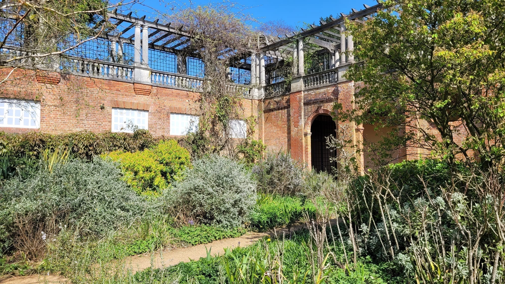
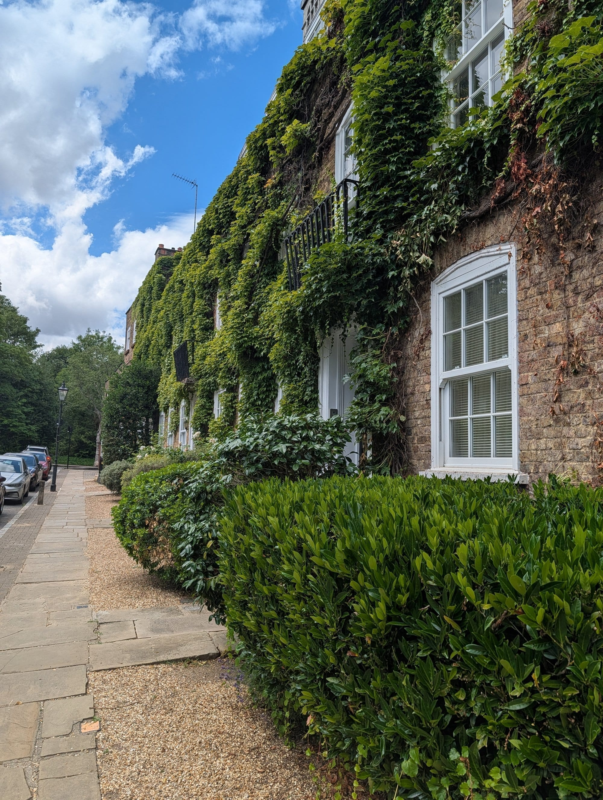
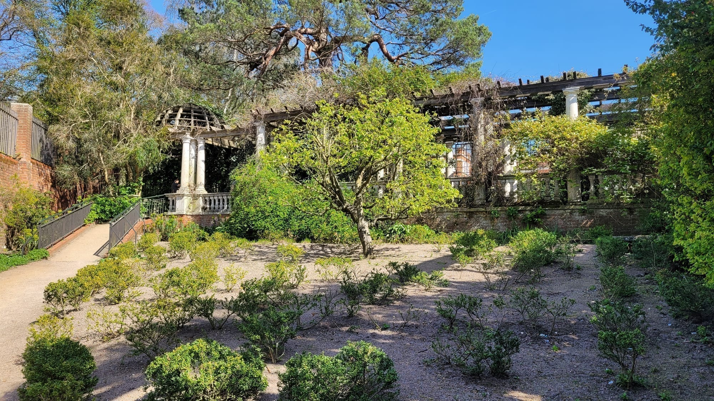
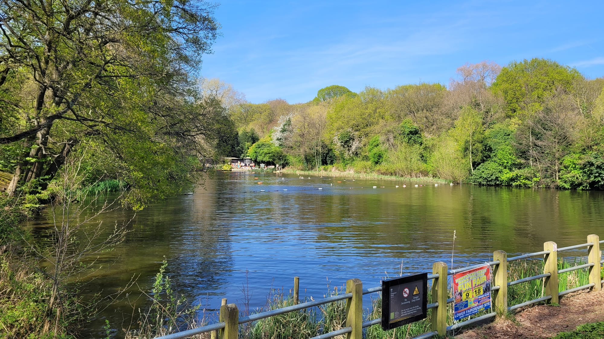
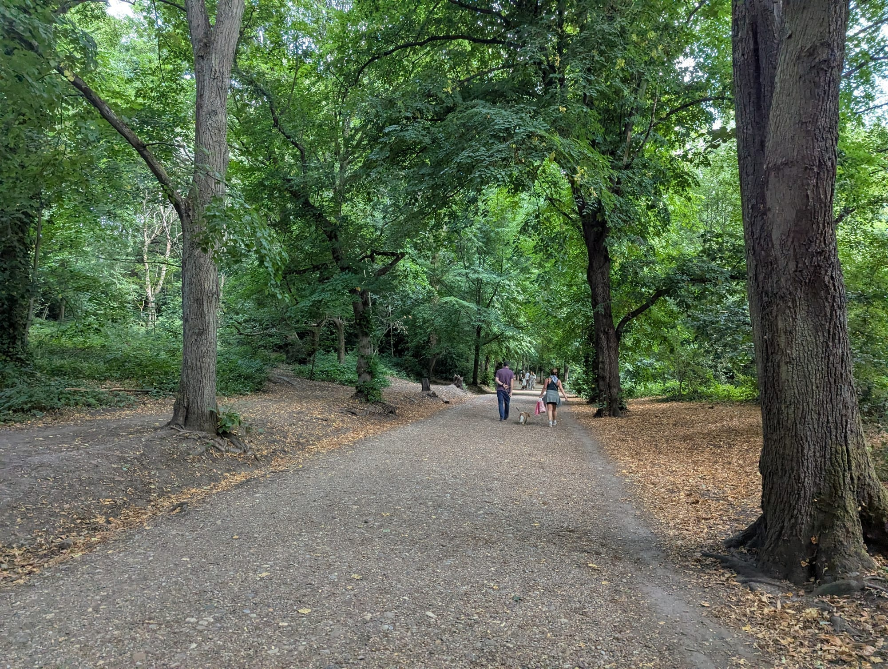

Hampstead is a hilltop village that London grew around without ever quite absorbing. It has Georgian lanes too narrow for buses, a pub the highwayman Dick Turpin is supposed to have used, and behind it 800 acres of half-wild heath — three times the size of Hyde Park.

It also has a free house full of Old Masters, and three ponds you can legally swim in year-round.

Hampstead has its own share of the commemorative plaques marking where notable people lived or worked - see them on our [interactive map](/plaques/?area=hampstead).

## Why visit — and who should skip it

**Come here if** you want a day outdoors that still feels like London. The Heath is the best walking in the city, Parliament Hill has a legally protected view over the whole skyline, and Kenwood House at the top is free and holds a Rembrandt and a Vermeer.

**Skip it if** you have three days in London. Hampstead is Zone 2–3 and takes most of a day to do properly. It is also genuinely hilly — the walkability rating here is lower than anywhere else in this guide for a reason.

## Top sights and activities

1. **Hampstead Heath** — 800 acres of woodland, meadow and pond, deliberately left semi-wild. Easy to get lost in.
2. **Parliament Hill** — The protected view south over the City, the Shard and St Paul's. A short but real climb.
3. **Kenwood House** — Free. A Robert Adam interior and a collection including a **Rembrandt self-portrait**, a **Vermeer**, Gainsboroughs and a Turner. The grounds run down to a lake.
4. **The bathing ponds** — Men's, Ladies' and Mixed, all lifeguarded and open year-round. Small charge. Unheated and properly cold in winter.
5. **Hampstead village** — Georgian lanes off the high street: Flask Walk, Well Walk, Church Row. Narrow, quiet and largely unchanged.
6. **The Spaniards Inn** — A 1585 coaching inn on the Heath's northern edge, associated with Dick Turpin and mentioned in *Dracula*. Big garden.
7. **Keats House** — The Hampstead villa where Keats wrote *Ode to a Nightingale*. Small, ticketed and quiet.

Powered by <a target="_blank" rel="sponsored" href="https://www.getyourguide.com/london-l57/">GetYourGuide</a>

*The Hill Garden and Pergola, built as a private Edwardian folly and now free to walk. Most visitors to the Heath never find it.*

## Key streets and micro-districts

### Hampstead village and the high street
Around the Northern line station. Shops, cafes and the lanes running off it.

### Flask Walk and Well Walk
Narrow Georgian passages east of the high street, leading down towards the Heath.

### Parliament Hill and the south Heath
The south-east corner. The view, the ponds and the lido. Closest to Hampstead Heath Overground.

### Kenwood and the north Heath
The top. Kenwood House, the lake and the Spaniards Inn beyond.

### Church Row
A single street of unbroken early-Georgian terrace, generally reckoned the finest in London outside Bloomsbury.

*One of Hampstead's Georgian terraces — this is the general character of the village's back streets, not only Church Row itself.*

### The Vale of Health
A genuine hamlet marooned inside the Heath itself, near North End — a handful of ivy-covered cottages down a single lane, easy to walk past without noticing the turning.

*One of the Vale of Health's cottages. D.H. Lawrence lived here in 1915, at 1 Byron Villas — reportedly the only London address he ever called home.*

*The pergola walkway. It is at its best in late spring when the wisteria is out.*

## Where to eat and drink

| Spot | Style | Price | Why go |
| --- | --- | --- | --- |
| **The Holly Bush** | Historic pub | ££ | 18th-century, gas-lit, up an alley off Heath Street |
| **The Spaniards Inn** | Historic pub | ££ | 1585 coaching inn with a large garden on the Heath edge |
| **Kenwood House Kitchen** | Cafe | £ | In the old brew house; terrace over the grounds |
| **Ginger & White** | Cafe | £ | Small, good coffee, popular with locals |
| **Parliament Hill Cafe** | Park cafe | £ | At the foot of the hill, useful before or after the climb |
| **The Wells Tavern** | Gastropub | ££ | Between the village and the Heath |

*One of the Heath's bathing ponds. They are open year-round, and there are separate men's, ladies' and mixed ponds.*

## Getting there

**By Tube.** **Hampstead** on the Northern line serves the village. It is the **deepest station on the Underground** at 58.5 metres, served by lifts rather than escalators — allow a few extra minutes.

**By Overground.** **Hampstead Heath** puts you at the south-east corner, closest to Parliament Hill and the ponds. This is the better choice if the Heath is your main target.

**Best approach.** Arrive at Hampstead Heath Overground, walk up Parliament Hill for the view, cross the Heath north to Kenwood, then down into the village and out via the Northern line. That way the climbing is front-loaded.

*The Heath is 790 acres and genuinely easy to get lost in, which is the point.*

## How long to spend, and when to go

| If you have | Do this |
| --- | --- |
| **Two hours** | Parliament Hill and the south Heath |
| **Half a day** | Add Kenwood House and the walk across |
| **A full day** | Add the village, Keats House and a pub on the Heath edge |

**Best time:** A clear morning, for the view. Autumn for the colour across the Heath.

**Note:** The Heath is unlit and genuinely dark after sunset. Plan to be off it by dusk.

## Suggested full-day route

1. **Start:** Hampstead Heath Overground.
2. **Parliament Hill:** Up for the protected view over the City.
3. **The ponds:** North past the bathing ponds — swim if you have brought a towel.
4. **Kenwood House:** Across the Heath to the free collection and the lake.
5. **The Spaniards Inn:** North-west for a drink in the garden.
6. **Finish:** South into **Hampstead village** for Flask Walk and Church Row, then the Northern line.

## Common mistakes to avoid

1. **Using the wrong station.** Hampstead for the village, Hampstead Heath for Parliament Hill and the ponds.
2. **Underestimating the hills.** This is the steepest area in this guide. Wear proper shoes.
3. **Missing Kenwood House.** Free, and holds a Rembrandt and a Vermeer.
4. **Turning up to swim without checking.** The ponds charge, and the Mixed Pond fills up in summer.
5. **Staying on the Heath after dark.** It is unlit and easy to get lost in.
6. **Trying to combine it with central sightseeing.** Hampstead needs most of a day on its own.

## Where to stay

Quiet, green and expensive, with a slow commute into the centre — a good base for a longer trip.

- **Hampstead village** — A few small hotels and inns. Charming and pricey.
- **Belsize Park and Swiss Cottage** — One or two stops south on the Northern and Jubilee lines, cheaper and better connected.
- **Camden** — Twenty-five minutes south, much cheaper, and lively in the evening.
