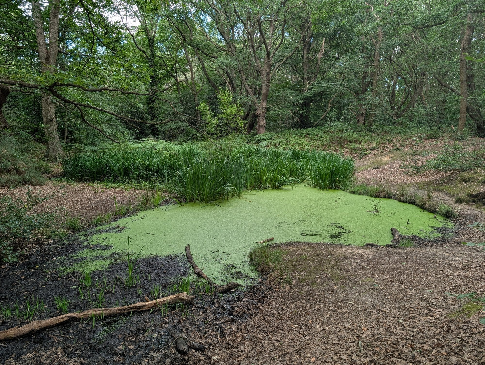
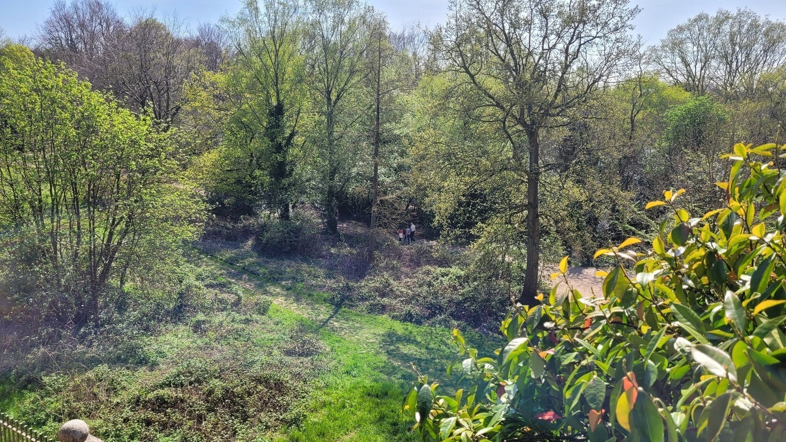

Not every good walk in London needs a river. Hampstead sits on one of the few real hills the city has, and this route uses two of them — Hampstead Heath and Primrose Hill — for two free skyline views that most visitors never plan around, plus a stately home most people don't realise costs nothing to walk into.

> 💡 **The Short Version:** **Kite Hill** on Hampstead Heath is the best free skyline view in north London — Canary Wharf, the City and St Paul's in one panorama, legally protected from being built out. **Kenwood House** is free to enter and holds a Vermeer and a Rembrandt. **Primrose Hill** is the second, smaller view on the way back. All of it costs nothing.

---

## Hampstead Heath to Primrose Hill

*About an hour · hilly · free*

**The route:** Hampstead village → up onto **the Heath** → **Kenwood House** → **Parliament Hill**, known locally as **Kite Hill**, for the protected skyline view → down through **the Vale of Health** → Belsize Park → up again to **Primrose Hill** for the second view.

Hampstead Heath is 320 hectares of genuinely wild-feeling ground in the middle of a capital city — heathland, ancient woodland, and a sandy ridge that puts most of it well above the rooftops around it. It has been common land since at least 1312, and it looks it: paths fork without warning, and the woods swallow the sound of the city within a couple of minutes of leaving the street.

*One of the smaller ponds threaded through the Heath's woodland near North End — not the famous bathing ponds, just one of the quiet ones you pass between them.*

**Kenwood House** sits on the Heath's northern edge, and it is the walk's one genuine surprise: a stately home, free to enter, holding 63 Old Master paintings donated to the nation in 1927 by Edward Guinness, 1st Earl of Iveagh. That includes Vermeer's *The Guitar Player* and a late Rembrandt self-portrait, hung inside a library Robert Adam considered one of his own best rooms. English Heritage runs it on a free-ticket system now — book ahead online or just turn up.

**Parliament Hill**, the Heath's south-east corner, is the destination. Its highest point is known locally as **Kite Hill** for the obvious reason, and at 98 metres up it gives a panorama that takes in Canary Wharf, the City and St Paul's Cathedral in one sweep — part of it a legally protected view, meaning nothing can be built tall enough in between to block it. It is one of the very few skyline views in London that cannot be developed away.

On the way down, the route drops through **the Vale of Health** — a genuine hamlet, entirely surrounded by the Heath and reachable only by a single lane off East Heath Road. It began in 1714 as a harness maker's workshop and was known, unglamorously, as Hatchett's Bottom, before being renamed the Vale of Health in 1801 in what might be London's most successful piece of place-branding.

*The wooded dip just below the Vale of Health — the hamlet itself sits a few minutes up the slope, and this stretch of the Heath is easy to have to yourself.*

**Finish at Primrose Hill**, on the far side of Belsize Park. At 64 metres it is lower than Kite Hill, but the second view is different rather than repeated — central London straight ahead, Hampstead and Belsize Park behind you, and a William Blake quotation engraved into the paving at the summit. A footbridge at the bottom connects straight into Regent's Park and London Zoo, if you want to keep walking.

**Worth knowing:** both hills flood with picnickers and kite-flyers on a warm weekend, and both are at their best either early or at golden hour, when the skyline view actually has definition instead of haze.

More in our [Hampstead guide](/articles/hampstead-area-guide/).

---

Powered by <a target="_blank" rel="sponsored" href="https://www.getyourguide.com/london-l57/">GetYourGuide</a>

## Short walks you don't need the Tube for

The Tube map is drawn for clarity rather than scale, and it makes central London look considerably bigger than it is. Learning which "stops" are actually walkable is one of the quickest upgrades to a London trip — no ticket, no waiting on a platform, and you see the city in between instead of a tunnel wall.

* **Covent Garden → Leicester Square** — 4 minutes. One Tube stop, and slower than walking through the station tunnels to make the change.
* **Covent Garden → Soho** — 5 minutes, straight across Seven Dials.
* **Westminster → South Bank** — 10 minutes over Westminster Bridge, with the Houses of Parliament behind you the whole way.
* **St Paul's → Tate Modern** — 8 minutes over the Millennium Bridge, arguably the best 8 minutes of walking in the city.
* **King's Cross → Bloomsbury** — 12 minutes down Judd Street, past the British Library.

As a rule: if a Tube journey involves a change, it is very often faster and always more interesting to just walk it, especially anywhere inside Zone 1.

---

## What it costs

**Nothing for the walking.** Hampstead Heath, Parliament Hill and Primrose Hill are public, free and open at all hours, managed by the City of London Corporation and the Royal Parks respectively.

* **Kenwood House is free**, including the paintings — book a free ticket online in advance if you want to guarantee a slot on a busy day.
* **The bathing ponds** on the Heath's east side charge a small admission for a swim, but walking past them costs nothing.
* **Food is where you spend.** Hampstead village has the cafes; there is very little on the Heath itself beyond a couple of kiosks.

---

## What to know

* **It's genuinely hilly**, which is rare for a London walk — wear shoes that can handle a slope, not just flat pavement.
* **Kenwood House keeps shorter hours than the grounds.** Check before you go if the house itself is the reason for the trip.
* **The Heath is easy to get turned around in.** Paths are not signposted the way a park's are; downloading an offline map before you set off saves a lot of backtracking.
* **Weekends get busy** on both hills, especially in good weather. Weekday mornings are close to empty.
* **There is no shortage of dogs.** Hampstead Heath is one of London's most popular off-lead areas.

---

Powered by <a target="_blank" rel="sponsored" href="https://www.getyourguide.com/london-l57/">GetYourGuide</a>

## Continue planning your London trip

- 🏘️ **[Hampstead Area Guide](/articles/hampstead-area-guide/)**
- 🌳 **[Best Parks and Gardens in London](/articles/best-parks-gardens-london/)**
- 🚶 **[London Walks Along the Thames](/articles/london-walks-along-the-thames/)**
- 🛶 **[Best Canal Walks in London](/articles/best-canal-walks-london/)**
- 👀 **[The Best Views in London](/articles/best-views-london/)**
- 🎪 **[Free Things to Do in London](/free/)**

---

*Distances and times are approximate. Kenwood House's opening hours and Hampstead Heath's swimming facilities change seasonally — check before a trip built around either.*
