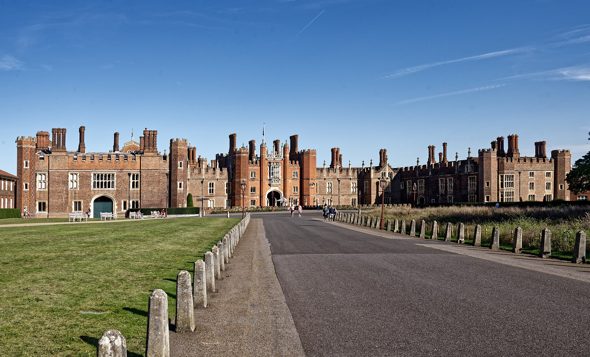
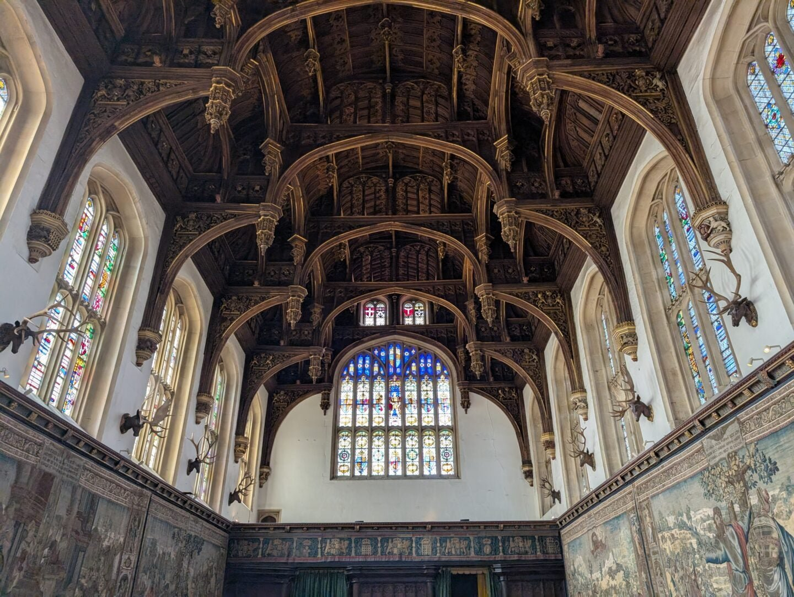
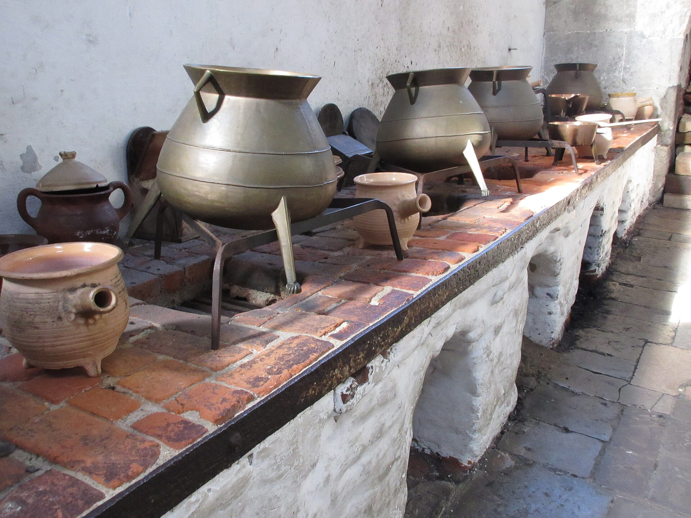
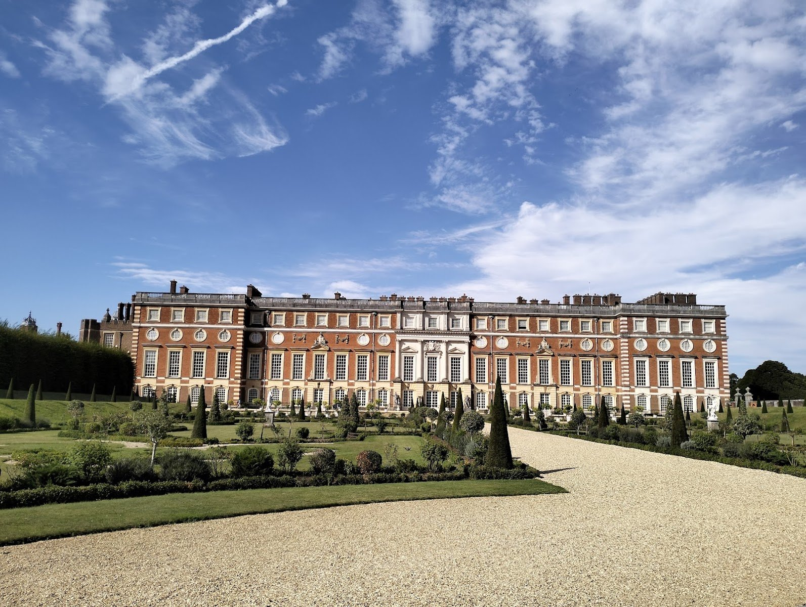
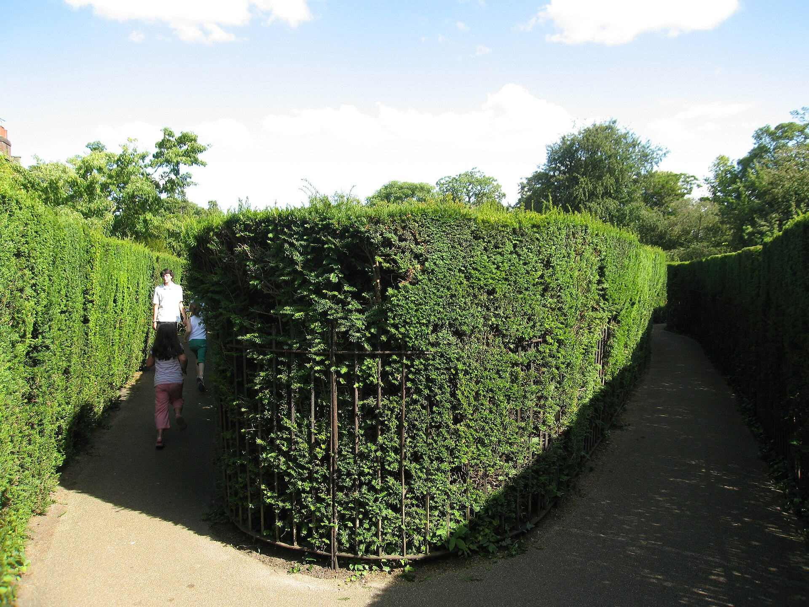
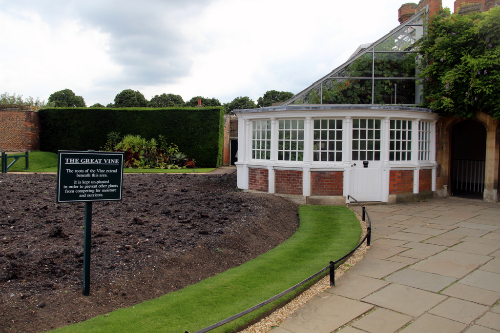

Hampton Court Palace is two palaces sharing one address on the Thames in East Molesey: Henry VIII's redbrick Tudor courts on one side, Christopher Wren's Baroque state apartments for William III and Mary II on the other. Historic Royal Palaces, the independent charity that also runs the Tower of London, receives no government funding and prices tickets by season rather than a flat rate.

It's an easy palace to under-plan. The Tudor Kitchens alone cover half an acre, the gardens run to 60 acres, and the hedge maze has been catching visitors out since the 1690s — treating it as a two-hour add-on to a day in London leaves you rushing past most of it.

> 💡 **The Short Version:**
> - **Price:** Adult £30.00 online off-peak / £33.00 peak from 1 October 2026. Children (5–17) £15.00–£16.50; under-5s free. An optional 10% donation is added at checkout. Book direct through [Historic Royal Palaces](https://www.hrp.org.uk/hampton-court-palace/visit/tickets-and-prices/) or skip arranging transport with the <a href="https://www.getyourguide.com/london-l57/hampton-court-palace-half-day-trip-from-london-with-tickets-t70032/?partner_id=WWP7I0R&cmp=hampton-court-palace-guide" target="_blank" rel="sponsored nofollow noopener" data-affiliate="gyg">Hampton Court Palace Half-Day Trip from London with Tickets on GetYourGuide</a>, £80pp with return coach transport and entry included — it saves finding your own way to and from Waterloo.
> - **Getting there:** South Western Railway direct from **London Waterloo**, **35 minutes**, **Zone 6**, two trains an hour. In summer, a **riverboat from Westminster or Richmond** takes far longer but is part of the day out.
> - **Time needed:** Historic Royal Palaces' own guidance is **at least three hours**, four or more if you want the gardens and maze properly.
> - **What's included:** The maze, the Tudor Kitchens, the Great Vine, the Privy Garden and the Magic Garden all come with standard admission — nothing extra to book once you're through the gate.
> - **Christmas:** The **Winter Palace** walkthrough (28 November 2026 – 3 January 2027) is included in admission; the **ice rink** on the East Front lawn is a separate ticket over the same period.

---

## Tickets and prices

Historic Royal Palaces splits the year into standard pricing (to 27 November 2026) and Winter Palace pricing (28 November 2026 – 3 January 2027, when the Christmas walkthrough is included), and within each, peak (weekends and bank holidays) costs more than off-peak (weekdays).

| Ticket | Off-peak (weekday) | Peak (weekend/bank holiday) | Notes |
| :--- | ---: | ---: | :--- |
| **Adult** | **£30.00** | £33.00 | |
| **Child 5–17** | £15.00 | £16.50 | Under 5s free |
| Senior / student / disabled concession | £24.30 | £26.30 | Carer or companion goes free |
| Groups | £27.60 | £30.40 | |
| £1 tickets | £1.00 | £1.10 | See below |
| Members | Free | Free | |

Winter Palace tickets (28 November 2026 – 3 January 2027) run higher, since the Christmas walkthrough is bundled in: **adult £33.00 off-peak / £36.00 peak**, child £16.50/£18.00, concession £26.30/£28.80.

An optional **10% donation** is added at checkout; tick the Gift Aid box and Historic Royal Palaces can claim an extra 25% of your ticket price from HMRC at no cost to you. Anyone on Universal Credit, Working Tax Credit, Pension Credit, Employment and Support Allowance, Income Support or Jobseeker's Allowance can buy **£1 tickets for up to four people**, booked online in advance — they sell out, so book ahead rather than turning up on the day. Historic Royal Palaces membership, which also covers the Tower of London and Kensington Palace, starts at £65 a year.

Book direct through [Historic Royal Palaces' ticket page](https://www.hrp.org.uk/hampton-court-palace/visit/tickets-and-prices/), or bundle the ticket with return transport from central London via the <a href="https://www.getyourguide.com/london-l57/hampton-court-palace-half-day-trip-from-london-with-tickets-t70032/?partner_id=WWP7I0R&cmp=hampton-court-palace-guide" target="_blank" rel="sponsored nofollow noopener" data-affiliate="gyg">Hampton Court Palace Half-Day Trip from London with Tickets</a>.

**Standard opening hours: 10am–5.30pm, last entry 4.30pm.** During school term time the palace opens Wednesday to Sunday only, closed Monday and Tuesday; during Easter, summer, Christmas and half-term school holidays it opens daily. Winter Palace hours (28 November–3 January) are shorter: 10am–4.30pm, last entry 2.30pm, with extended opening to 7.30pm (last entry 5.30pm) on selected December dates.

---

## Getting there

### By train

**Hampton Court station** is a five-minute walk from the palace gates. South Western Railway runs **two direct trains an hour from London Waterloo**, a **35-minute journey** with no changes. The station is in **Zone 6**, so contactless and Oyster pay-as-you-go work the same as anywhere else in London — a single off-peak fare is around £3.50, peak around £5.70, and the Zone 1–6 daily cap is £11.80. There are no barriers at Hampton Court, so you must **touch in at Waterloo and touch out here** (and the reverse on the way back), or you'll be charged the maximum fare. Return trains leave Hampton Court at 23 and 53 minutes past the hour Monday to Saturday, and 05 and 35 past the hour on Sundays.

### By river (summer)

In summer, a **riverboat from Westminster or Richmond** is the slower, more scenic way in. Westminster Passenger Services sails from **Westminster Pier**, calling at Kew and Richmond en route, with the full run to Hampton Court taking around **3.5–4 hours** depending on the tide — a half-day out in itself, not a commute. Turks Launches covers the shorter **Richmond–Hampton Court** stretch in about **1 hour 45 minutes**, and the **Hampton Court–Kingston** leg in around 35 minutes. GetYourGuide sells the Turks route as a standalone cruise: <a href="https://www.getyourguide.com/london-l57/boat-trip-from-richmond-to-hampton-court-on-the-river-thames-t467545/?partner_id=WWP7I0R&cmp=hampton-court-palace-guide" target="_blank" rel="sponsored nofollow noopener" data-affiliate="gyg">Richmond to Hampton Court River Thames Cruise</a> (around £15pp, 1h30m) and <a href="https://www.getyourguide.com/london-l57/boat-trip-from-hampton-court-to-richmond-on-the-river-thames-t465271/?partner_id=WWP7I0R&cmp=hampton-court-palace-guide" target="_blank" rel="sponsored nofollow noopener" data-affiliate="gyg">Hampton Court to Richmond River Thames Cruise</a> (around £15pp, 1 hour) for the return leg. See our [guide to London river boats](/articles/how-to-use-london-river-boats/) for piers and general fares.

### By bus and car

Bus **R68** runs directly between Richmond and Hampton Court. From Kingston, routes **111, 216, 411, 461 and 513** all stop at the palace. Drivers pay **£1.80 an hour** by card in the on-site car park (10 Blue Badge bays); Hampton Court Green, 500 metres away, and the Walton Road car park, a 20-minute walk, are the fallback options when the palace car park fills.

---

Powered by <a target="_blank" rel="sponsored" href="https://www.getyourguide.com/london-l57/">GetYourGuide</a>

## What to see

Historic Royal Palaces' own suggested routes run to two hours, three hours or a full day, and add rooms in roughly this order — a sensible walking sequence rather than a route you have to follow exactly.

*The West Front and Great Gatehouse.*

### Henry VIII's Apartments and the Great Hall

Enter through Clock Court, beneath the **Hampton Court astronomical clock**, installed in 1540 and still showing the hour, the zodiac and the time of high water at London Bridge. **Henry VIII's Apartments** lead into the **Great Hall**, built between 1532 and 1535 — the last great medieval hall built for an English monarch, with a carved hammerbeam roof, Henry's own tapestries and stained glass.

*The Great Hall's hammerbeam roof.*

Beyond the Great Hall, the **Haunted Gallery** and the **Wolsey Rooms** hold the Tudor World exhibition, tracing the palace back to Cardinal Wolsey, who built it before Henry VIII took it from him.

### The Tudor Kitchens

Originally built before 1508 by Sir Giles Daubeney and **quadrupled in size by Henry VIII in 1529**, the Tudor Kitchens are the largest surviving kitchens of their kind in England — built to provide "bouche of court", free food and drink, for a royal household of more than a thousand people a day. Copper pots still sit on the brick ranges, and on busier days costumed cooks demonstrate Tudor cooking over an open fire.

*The Tudor Kitchens.*

### William III's Apartments and the Chapel Royal

Cross into the Baroque half of the palace for **William III's Apartments**, built by Christopher Wren for William III and Mary II in the 1690s, and the **Chapel Royal**, still in regular use — you don't need any admission ticket to attend a service there.

The **Georgian Story** and **Queen's Apartments** round off a three-hour visit, and a full day adds the **Chocolate Kitchens**, a rare surviving Georgian royal kitchen built solely for preparing chocolate, plus the palace's short **Palace Host Talks**.

### The maze and the gardens

North of the palace, the **hedge maze** is the oldest surviving example in Britain — about a third of an acre, planted in the 1690s and commissioned by William III, designed by George London and Henry Wise. It's included in standard admission, with no separate ticket or booking.

*Inside the hedge maze.*

The wider gardens run to 60 acres, Grade I listed on the Register of Historic Parks and Gardens. The **Privy Garden** is a 1992 recreation of the 1702 garden laid out for William III; the **Long Water** canal, excavated in 1662 for Charles II, draws on the same formal style as Versailles. The **Magic Garden**, a children's play area themed around palace legends, and the **Kitchen Garden**, which now supplies the Tudor Kitchens' demonstrations, are both included in admission too.

### The Great Vine

In a glasshouse near the Thames-facing side of the palace stands the **Great Vine**, planted in **1768** by Lancelot "Capability" Brown from a cutting, and still the largest known grape vine of its kind in the world. It's a dessert variety, Black Hamburg, with a trunk over two metres around and a canopy stretching some 30 metres.

*The Great Vine's glasshouse.*

The vine is harvested every **September**, and the grapes — an average crop of around 270kg — are sold in the palace's Garden Shop and Barrack Block shop while stocks last.

---

## Christmas at Hampton Court

**The Winter Palace**, a new immersive Christmas walkthrough themed around mythical creatures, runs **28 November 2026 – 3 January 2027** and is included in standard admission — no separate ticket needed, and Historic Royal Palaces members get in free with pre-booking. On selected December dates (9–11, 16–17 and 19–30 December), the palace stays open late, until 7.30pm, for it.

> ⚠️ **The ice rink is a separate ticket from palace admission.** It runs on the East Front lawn from **20 November 2026 to 3 January 2027** (closed Christmas Day), 10am to 8pm daily in 45-minute sessions. Adult tickets are **£19.50 off-peak / £21.50 peak**, child (3–12) £14.50/£16.00, and a family ticket for four is £59.50/£65.50. Book separately through the rink's own site — a palace ticket does not include skating, and a rink ticket does not include the palace.

---

## Food and Garden Festivals

Hampton Court hosts two big annual events on the grounds, run by outside organisers rather than Historic Royal Palaces itself.

The **Hampton Court Palace Food Festival** runs over the August bank holiday weekend most years; the 2026 edition ran **29–31 August**, with festival tickets including free entry to the palace and gardens on the day. The 2027 edition is planned for August 2027.

The **RHS Hampton Court Palace Garden Festival** — for decades the world's largest flower show by area — last ran at the palace **1–6 July 2025**. It's now a biennial event: there is no Hampton Court edition in 2026, with the RHS's show that year held at Badminton Estate in Gloucestershire instead, and the festival returns to Hampton Court in **2027**.

---

## Combining with Richmond or Kew

Hampton Court sits at the western end of a run of riverside places that are easy to string together. The **R68 bus** runs directly between **Richmond** and Hampton Court, and in summer, **Turks Launches'** river cruise covers the same stretch in about 1 hour 45 minutes, with a shorter Hampton Court–Kingston leg alongside it. Westminster Passenger Services' longer summer sailing also calls at **Kew Pier** and Richmond on its way through to Hampton Court, so one ticket can cover all three in a single direction if you're prepared to give most of a day to the river rather than the train.

By train, Hampton Court and Kew Gardens sit on different lines with no direct connection between them — it's faster to treat them as separate trips from central London than to try to link them by rail. Our [Richmond area guide](/articles/richmond-area-guide/) and [Kew Gardens guide](/articles/kew-gardens-guide/) cover both in full.

---

## Practical information

### Food and drink

The palace has cafés inside the gate for a coffee or lunch break, and picnics are allowed on the lawns in Home Park, outside the ticketed gardens. There's no need to leave the grounds to eat during a visit.

### What people get wrong

1. **Assuming the maze and gardens cost extra.** They're part of standard admission — nothing to book or pay for once you're through the gate.
2. **Turning up on a Monday or Tuesday in term time.** The palace is closed those two days outside school holidays; check the calendar before you travel.
3. **Missing the last off-peak train back.** Hampton Court has no barriers, so forgetting to touch out means the maximum fare, not a fine — but it's still worth avoiding.
4. **Booking the ice rink and the palace as if they're the same ticket.** They aren't; you need both if you want to do both.

---

## Continue planning your London trip

- 🏯 **[Kew Gardens Guide](/articles/kew-gardens-guide/)** — tickets, gates and the glasshouses, a short hop upriver.
- 🦌 **[Richmond Area Guide](/articles/richmond-area-guide/)** — the deer park, the river and Richmond Hill.
- 🏛️ **[London's Historic Houses and Churches](/articles/historic-houses-london/)** — 17 more palaces, house museums and chapels to visit.
- 🏰 **[Tower of London Guide](/articles/tower-of-london-guide/)** — Historic Royal Palaces' other big ticket, in Zone 1.
- 🎄 **[Christmas in London](/articles/christmas-in-london/)** — every light trail, market and ice rink, Hampton Court included.
- 🚤 **[How to Use London River Boats](/articles/how-to-use-london-river-boats/)** — piers, fares and which routes run in winter.

---

*Prices, opening hours and event dates are Historic Royal Palaces' own, checked September 2026.*
