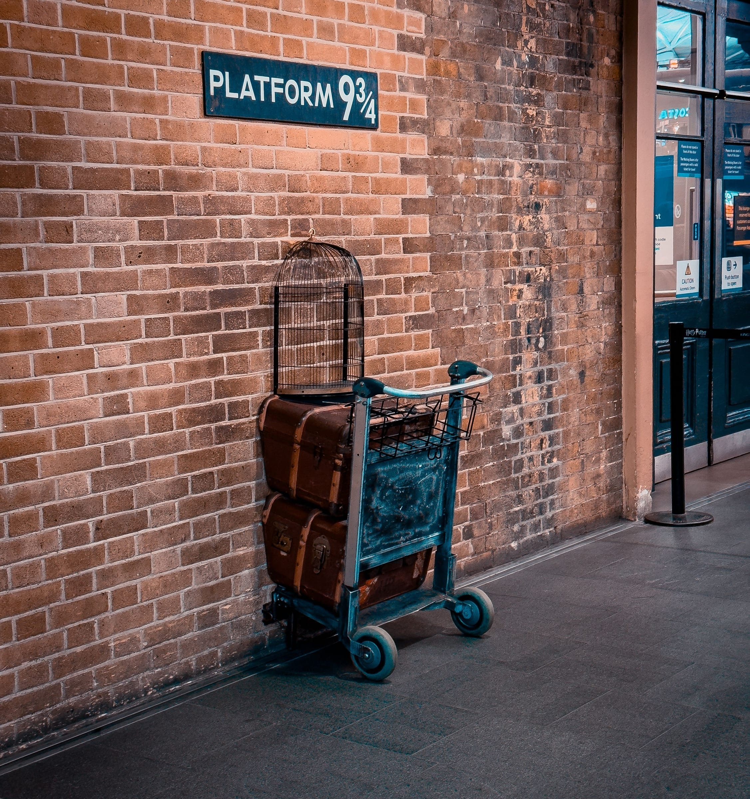
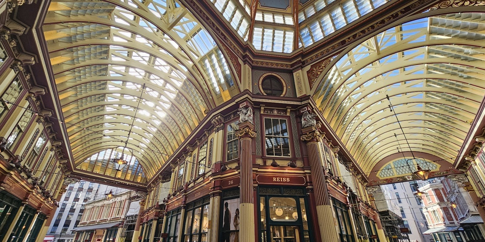
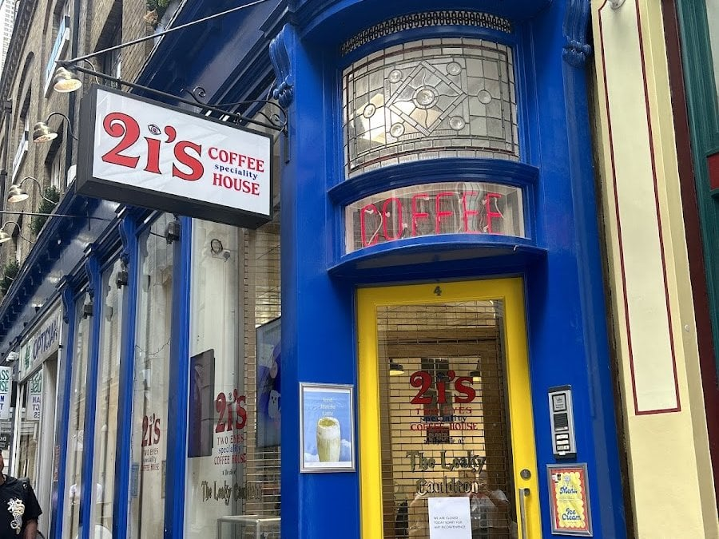
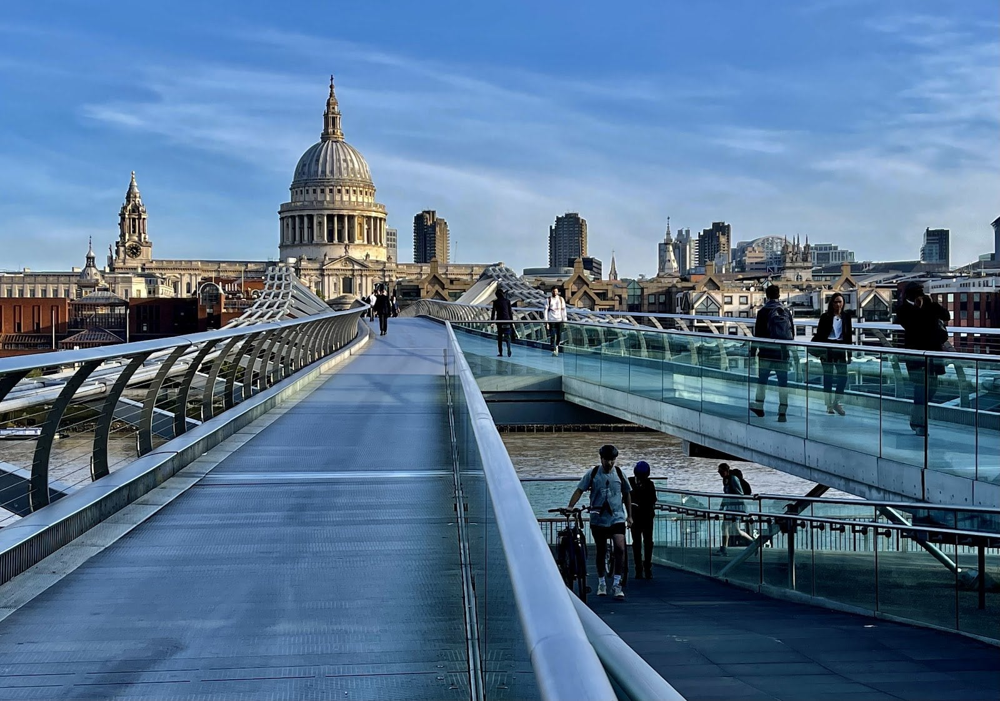
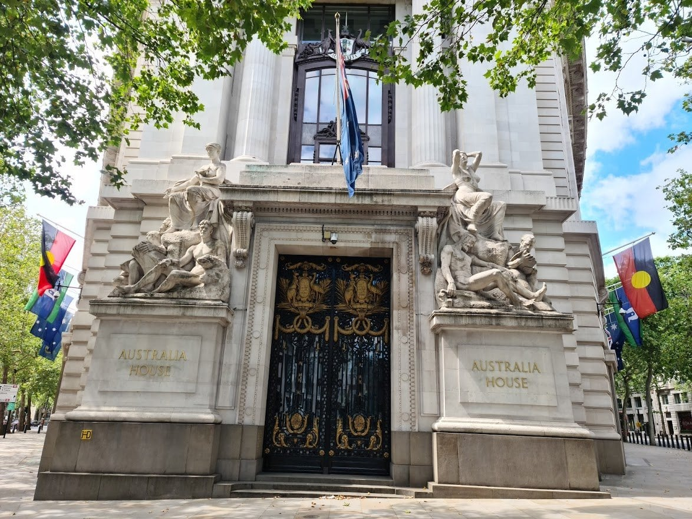
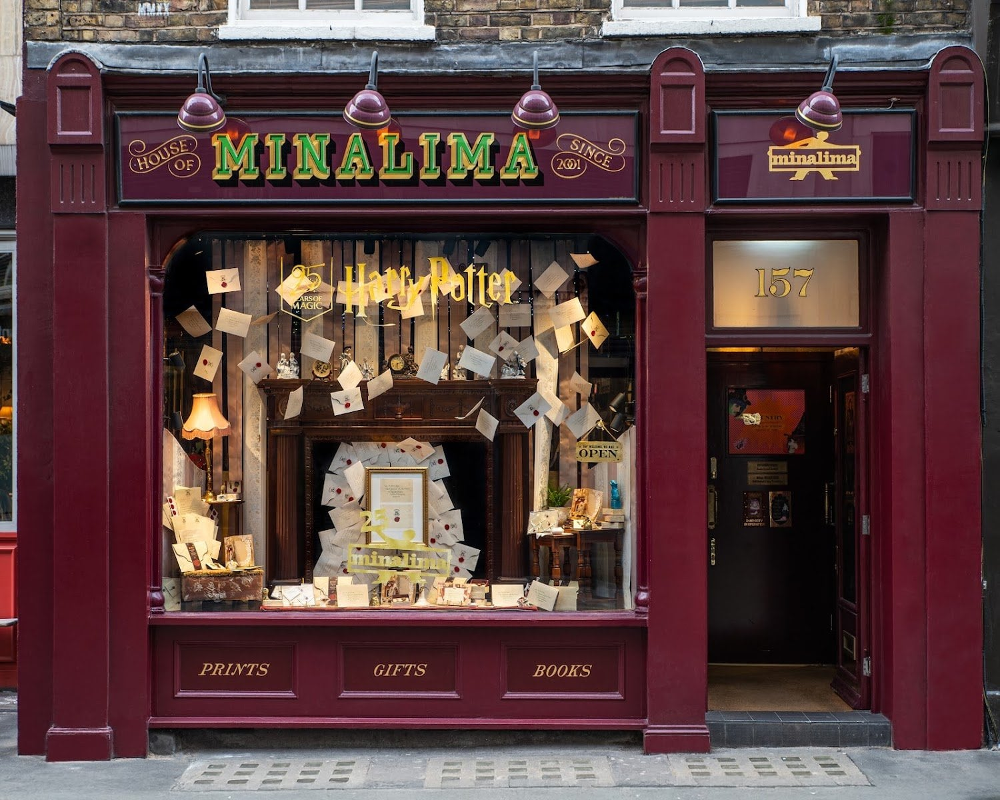
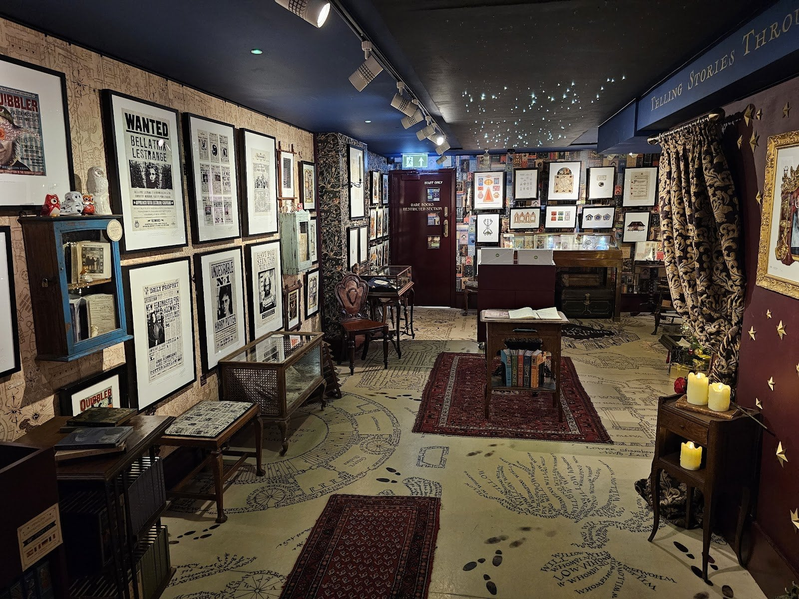
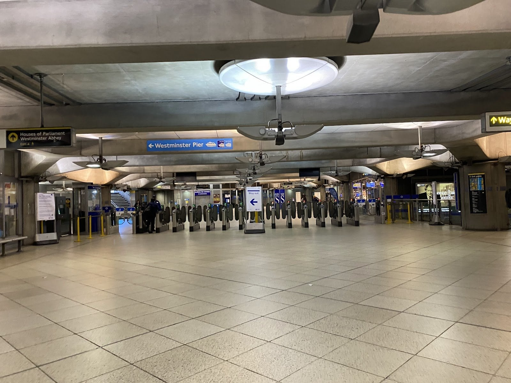
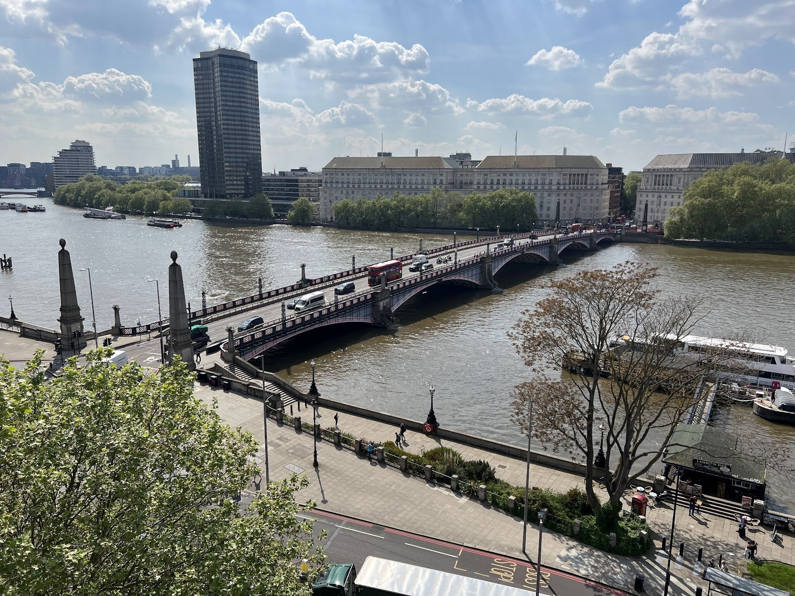
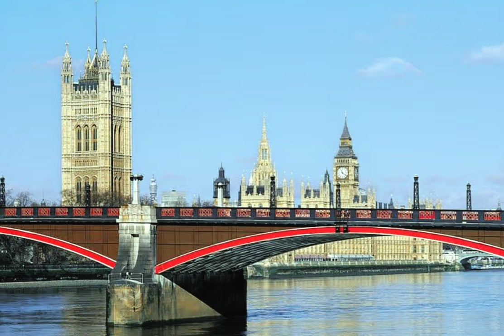

Most lists of Harry Potter locations in London are a dozen addresses in no particular order, and most of them send you to Leadenhall Market for Diagon Alley, which was a set.

**This route keeps to places the films actually used that you can still stand in.** Nine stops from the City to Westminster, in walking order: the market Hagrid walks Harry through, the door that played the Leaky Cauldron, the bridge the Death Eaters destroy, the building that played Gringotts, the Tube station Harry uses to reach the Ministry, and the bridge the Knight Bus squeezes across.

It is about **8.6km and four hours with stops**, and it splits into two halves at Australia House. Everything on it is free. Platform 9¾ is a Tube ride north, so it goes first.

For everything else Potter in London, from the Studio Tour to Cursed Child, see our [Harry Potter in London guide](/articles/harry-potter-london/).

> 💡 **The Short Version:** Be at **Platform 9¾ at 8am**, then take the **Northern line from King's Cross to Bank**. Walk it **Tuesday to Friday**: the **Leaky Cauldron door** is a coffee shop that shuts at weekends, and **Borough Market** is shut on Mondays. **City and Bankside half:** 3.7km, about two hours. **West End and Westminster half:** 4.9km, about two hours. **Leadenhall Market was not Diagon Alley**, and **Australia House** is outside only.

## The route

  

    Map of the walk, numbered in walking order
  

  

    
Loading the map…

  

  

    <i class="route-map-marker" aria-hidden="true">1</i> On the route, in walking order
    <i class="route-map-marker route-map-marker--alt" aria-hidden="true">+</i> King's Cross, before you start
  

  <noscript>
    
The map needs JavaScript. Every stop below is numbered in walking order with its nearest station.

  </noscript>

**[Open the whole route in Google Maps →](https://www.google.com/maps/dir/?api=1&origin=51.512728,-0.083395&destination=51.494543,-0.122885&waypoints=51.512454,-0.084026%7C51.505526,-0.090438%7C51.50914,-0.09856%7C51.512873,-0.115589%7C51.514459,-0.134835%7C51.510138,-0.133936%7C51.501356,-0.12493&travelmode=walking)** — all nine stops in walking order, set to walking directions. Doing it in two goes? Here are [the City and Bankside half](https://www.google.com/maps/dir/?api=1&origin=51.512728,-0.083395&destination=51.512873,-0.115589&waypoints=51.512454,-0.084026%7C51.505526,-0.090438%7C51.50914,-0.09856&travelmode=walking) and [the West End and Westminster half](https://www.google.com/maps/dir/?api=1&origin=51.512873,-0.115589&destination=51.494543,-0.122885&waypoints=51.514459,-0.134835%7C51.510138,-0.133936%7C51.501356,-0.12493&travelmode=walking).

| # | Stop | Film | Cost | Open |
| --- | --- | --- | --- | --- |
| **+** | Platform 9¾, King's Cross | Every film | Free | 8am–10pm; Sun 9am–8pm |
| **+** | St Pancras frontage | Chamber of Secrets | Free | Always |
| **1** | Leadenhall Market | Philosopher's Stone | Free | Always |
| **2** | The Leaky Cauldron door | Philosopher's Stone | Free to look | **Coffee shop weekdays only** |
| **3** | Borough Market | Prisoner of Azkaban | Free | **Closed Mondays** |
| **4** | Millennium Bridge | Half-Blood Prince | Free | Always |
| **5** | Australia House | Philosopher's Stone | Free | **Outside only** |
| **6** | House of MinaLima | The films' graphics | Free | Daily 11am–6.45pm |
| **7** | Piccadilly Circus | Deathly Hallows Part 1 | Free | Always |
| **8** | Westminster station | Order of the Phoenix | Free to the barriers | Tube hours |
| **9** | Lambeth Bridge | Prisoner of Azkaban | Free | Always |

| Half | Stops | Distance | Time with stops |
| --- | --- | --- | --- |
| City and Bankside | 1 to 5, Leadenhall Market to Australia House | 3.7km | About 2 hours |
| West End and Westminster | 5 to 9, Australia House to Lambeth Bridge | 4.9km | About 2 hours |

---

## Before you start: King's Cross and St Pancras

*The trolley at opening time. By late morning there is a queue and a barrier in front of it.*

**Platform 9¾** is the luggage trolley half-sunk into a brick wall in King's Cross's western departures concourse, outside the ticket barriers. It costs nothing and needs no train ticket; staff will take the photo on your own phone, and only the professional photographer's print is paid for. King's Cross is also where the films shot their Platform 9¾ scenes.

The trolley is only out while the Harry Potter Shop beside it is open: **8am to 10pm Monday to Saturday and 9am to 8pm on Sunday**. At 8am on a weekday you walk straight up to it.

**St Pancras**, next door, is the red-brick Gothic front on Euston Road. In *Chamber of Secrets* Harry and Ron miss the Hogwarts Express and fly the Ford Anglia over it; St Pancras International describes the scene on its own site. The frontage is a couple of minutes from the trolley.

**Then take the Northern line** (Bank branch) from King's Cross St Pancras to Bank, four stops. Leadenhall Market is five minutes' walk from the Bank exits.

## 1. Leadenhall Market

**The covered Victorian market where Hagrid walks Harry to the Leaky Cauldron** in *Harry Potter and the Philosopher's Stone*, filmed here in 2000 and 2001.

*The octagonal crossing at the centre of the market. The dragons holding shields on the columns are the City of London's.*

Most guides say it played Diagon Alley. It didn't. The market's own history page says it stood in for the Muggle London streets leading to the Leaky Cauldron. Diagon Alley was a set at Leavesden, and you can walk down it on the [Studio Tour](/articles/harry-potter-studio-tour/).

The building is the work of **Sir Horace Jones**, the City Architect who also designed Smithfield, Billingsgate and Tower Bridge. It went up in **1881**, replacing a stone market, and was listed Grade II in 1972. The City of London Corporation still owns and runs it.

The public lanes are **open 24 hours a day, seven days a week**. The shops, bars and restaurants keep City hours, so on a weekday it is full and at the weekend most shutters are down.

> ⚠️ **Scaffolding is up for maintenance works** (September 2026). The market stays fully open and walkable, but one part of it is behind boards.

## 2. The Leaky Cauldron door

Take **Bull's Head Passage**, the lane that runs from the market west to Gracechurch Street. The door that played the entrance to the Leaky Cauldron in the first film is now the front door of **Two Eyes Coffee House, 4 Bull's Head Passage**, and the coffee shop says so on its own site.

*Look for the 2i's sign hanging over the passage. The glass in the yellow door carries both names, Two Eyes and The Leaky Cauldron.*

It shares the building with the Glass House Opticians and the London Migraine Clinic, which is where the name comes from, and its profits help fund the clinic's migraine research. That is why some guides call this door an opticians: both are right.

**It opens on weekdays only:** Monday and Friday 8.30am to 3.30pm, Tuesday to Thursday 8am to 4pm. At the weekend the door is still there to photograph, but you can't go through it.

Powered by <a target="_blank" rel="sponsored" href="https://www.getyourguide.com/london-l57/">GetYourGuide</a>

## 3. Borough Market

South across **London Bridge**, about fifteen minutes.

*Prisoner of Azkaban* moved the Leaky Cauldron to this side of the river. The Knight Bus scenes that drop Harry off were shot in and around Borough Market, and the pub's entrance was a shopfront on the market's edge that was then the Chez Michele flower shop.

The market is **free to walk into** and the food stop for this half:

| Day | Market open |
| --- | --- |
| **Monday** | **Closed** |
| Tuesday to Friday | 10am – 5pm |
| Saturday | 9am – 5pm |
| Sunday | 10am – 4pm |

The streets around it are public at any hour, but on a Monday you are walking past shutters.

## 4. The Millennium Bridge

West along the river on Clink Street and Bankside, about fifteen minutes, past Southwark Cathedral and the Globe.

In the opening minutes of **Half-Blood Prince** the Death Eaters twist the bridge until it breaks and drops into the Thames. The destruction was visual effects. The filming was on the weekend of 8 and 9 March 2008, when the bridge was closed to pedestrians for a time and the river was shut between Blackfriars and Southwark bridges so a helicopter could fly low over it. None of the main cast took part.

It is a footbridge, free and **open at all hours**. Walk it south to north and St Paul's is straight ahead of you.

*A few steps on from the south end, the dome lines up with the deck.*

## 5. Australia House

From St Paul's, west down Ludgate Hill and Fleet Street and past the Royal Courts of Justice to the Strand, about twenty minutes.

**The banking hall of Australia House played Gringotts** in *Philosopher's Stone*. The director, Chris Columbus, chose it for the goblins' bank.

*The gates, with the name cut into the stone either side. The banking hall is inside, and this is as close as a visitor gets.*

The building is the **Australian High Commission**, opened by George V on 3 August 1918 and listed Grade II. It is a working diplomatic building, not a visitor attraction: **you see it from the pavement** on the Strand, at WC2B 4LA.

This is the halfway point. Temple and Holborn stations are both within about ten minutes if you are stopping here, and Somerset House, where the [Covent Garden walk](/articles/covent-garden-walk/) ends, is a few minutes west along the Strand.

## 6. House of MinaLima

North-west through Covent Garden to Soho, about twenty-two minutes.

This one was not a filming location. **Miraphora Mina and Eduardo Lima designed the graphic props for all the Harry Potter films**, working together on them from 2001. House of MinaLima is their own gallery and shop.

*The window display: Hogwarts letters pouring out of a fireplace, as they do at the Dursleys'.*

**157 Wardour Street, W1F 8WQ. Open daily 11am to 6.45pm, including bank holidays**, and free to walk in. The shop is on the ground floor with a portable ramp that won't take larger wheelchairs; the gallery is downstairs and reached only by stairs. There is no toilet.

*The Wanted posters and Daily Prophet pages on the walls are prints of the ones Mina and Lima made for the films. The floor is printed as the Marauder's Map.*

## 7. Piccadilly Circus

Down Wardour Street, about eight minutes.

In **Deathly Hallows Part 1**, when the Death Eaters break up Bill and Fleur's wedding, Harry, Ron and Hermione escape to Piccadilly Circus. In the book they land on Tottenham Court Road.

It is the busiest junction on this walk and free at any hour.

## 8. Westminster station

Down Haymarket, across Trafalgar Square and along Whitehall, about twenty minutes.

In **Order of the Phoenix** Arthur Weasley takes Harry through the ticket barriers here, among the commuters, on the way to his hearing at the Ministry of Magic. TfL closed the station for the whole of Sunday 22 October 2006 for the filming, with trains running straight through.

*The gate line in the ticket hall. Signs point to Parliament and the Abbey one way, Westminster Pier the other.*

The ticket hall is **free to walk into** during Tube hours. Anything beyond the barriers needs a fare.

## 9. Lambeth Bridge

South along Millbank past Victoria Tower Gardens, about fifteen minutes.

In **Prisoner of Azkaban** the Knight Bus, three storeys of purple, squeezes through a gap between two red London buses on this bridge.

*One red double-decker fills a lane on its own. In the film the Knight Bus squeezes between two.*

Nothing marks the spot. What you get is the view down the river to the Houses of Parliament, and the end of the walk.

*The bridge is painted mostly red for the benches of the House of Lords, the end of Parliament nearest it.*

---

## Off the route

**London Zoo's Reptile House** is where Harry talks to the python in *Philosopher's Stone*. The zoo closed that 1926 building to the public in 2023, and its reptiles moved to a new house, the Secret Life of Reptiles and Amphibians, from Easter 2024. There is no longer anything from the scene to see, so it is not on this walk.

**The Studio Tour** at Leavesden is where the sets are: Diagon Alley, the Great Hall and the Hogwarts Express. Prices, booking and the train from Euston are in our [Studio Tour guide](/articles/harry-potter-studio-tour/).

Powered by <a target="_blank" rel="sponsored" href="https://www.getyourguide.com/london-l57/">GetYourGuide</a>

## Where to eat

**Borough Market at stop three** is the food stop, Tuesday to Sunday: street food and hot counters, free to walk in. On an 8am start you reach it mid-morning, so buy something to carry.

- **Two Eyes Coffee House** (£) at stop two — coffee behind the Leaky Cauldron door, weekdays only.
- **Soho**, around stop six, is where the walk reaches lunchtime and the place to sit down. The [Soho area guide](/articles/soho-area-guide/) has where to go.

On a Monday, when Borough Market is shut, eat in Soho instead.

## The best day to go

**Tuesday to Friday.** They are the only days both the coffee shop behind the Leaky Cauldron door and Borough Market are open. On Monday the market is shut; at the weekend the coffee shop is.

| Day | What changes |
| --- | --- |
| **Monday** | **Borough Market closed.** Two Eyes 8.30am–3.30pm |
| **Tue–Thu** | Everything open. Two Eyes 8am–4pm, Borough Market 10am–5pm |
| **Friday** | Everything open. Two Eyes 8.30am–3.30pm, Borough Market 10am–5pm |
| **Saturday** | **Two Eyes closed.** Borough Market 9am–5pm and at its busiest; Leadenhall's shops mostly shut |
| **Sunday** | **Two Eyes closed.** Borough Market 10am–4pm; trolley from 9am, not 8am |

**What never closes:** Leadenhall's lanes, the Millennium Bridge, the Strand outside Australia House, Piccadilly Circus and Lambeth Bridge. House of MinaLima opens every day from 11am.

**The case for Sunday:** the City is empty, and Leadenhall Market has no office crowd. You lose the coffee behind the Leaky Cauldron door and get the arcade to yourself.

**On time of day:** an 8am start at King's Cross puts you in Leadenhall at about nine, at Borough Market as it opens, and at House of MinaLima shortly after its 11am opening.

## If you would rather be guided

The walking tours cover much the same ground with someone to tell the stories. The most-reviewed on GetYourGuide, **Magical London: Harry Potter Guided Walking Tour**, runs about two and a half hours and was from £20 in September 2026, with more than 22,000 reviews. Others, including a bus tour, are compared in [the best walking tours in London](/articles/best-walking-tours-london/#harry-potter).

Powered by <a target="_blank" rel="sponsored" href="https://www.getyourguide.com/london-l57/">GetYourGuide</a>

## Getting there and back

**Start:** King's Cross St Pancras for Platform 9¾, then Bank (Northern, Central, Waterloo & City, DLR) or Monument for Leadenhall Market. **Halfway:** Temple or Holborn, both within about ten minutes of Australia House. **Finish:** Westminster (Jubilee, District, Circle), about fifteen minutes back up Millbank from Lambeth Bridge.

The route is flat and rarely more than ten minutes from a station, so you can stop anywhere. Walked in reverse it works, but it reaches the Leaky Cauldron door late in the day, close to the coffee shop's 3.30pm or 4pm close.

## Carry on walking

- **[The City of London: Bank to Tower Bridge](/articles/city-of-london-walk/)** — starts at Bank, five minutes from Leadenhall Market, which is its third stop.
- **[Bankside and Borough](/articles/bankside-borough-walk/)** — the inn yards and theatres between Borough Market and the Millennium Bridge, the stretch stops three and four cross.
- **[Covent Garden](/articles/covent-garden-walk/)** — ends at Somerset House, a few minutes from Australia House.
- **[Westminster](/articles/westminster-walk/)** — starts at Westminster Bridge, beside stop eight.
- **[South Bank: Westminster to Tower Bridge](/articles/south-bank-walk/)** — also starts at Westminster Bridge; cross Lambeth Bridge and walk the Albert Embankment north to reach it.
- **[King's Cross to Camden along the Regent's Canal](/articles/kings-cross-camden-canal-walk/)** — starts at Granary Square, behind King's Cross, if you would rather stay north after the trolley.

## What to do with the rest of the day

- **[Harry Potter in London](/articles/harry-potter-london/)** — the Studio Tour, Cursed Child, the shops and what to skip.
- **[The Harry Potter Studio Tour](/articles/harry-potter-studio-tour/)** — tickets, extras and getting to Leavesden.
- **[London filming locations](/articles/london-filming-locations/)** — Bond, Sherlock, *Slow Horses* and the rest.
- **[The City of London area guide](/articles/city-of-london-area-guide/)** and **[the Covent Garden area guide](/articles/covent-garden-area-guide/)** — the two areas this walk crosses.
- **[London with children](/articles/london-with-children/)** — the rest of a family day.
