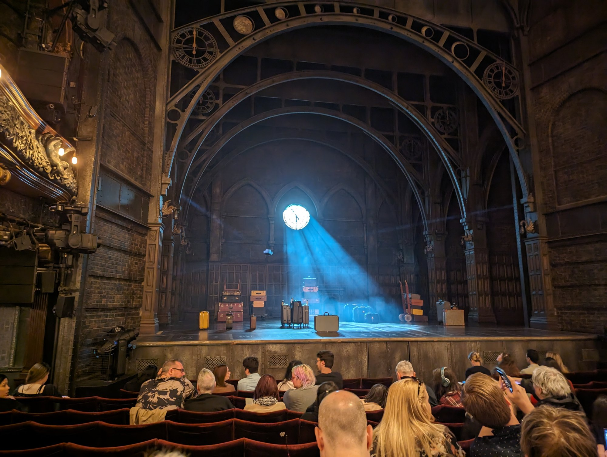

**A ticket to the Warner Bros. Studio Tour costs £58.50 for an adult, and you cannot buy one at the door.** Not because it is busy — because they genuinely do not sell them there. Everything else in this guide is cheaper than that, and roughly half of it is free.

Harry Potter is the most written-about subject in London tourism and the worst written-about. Guides still send people to a bar that closed in February, still describe a play that has changed format, and still print an old address for House of MinaLima. This page is what happens when you check every price against the operator's own website on the same day.

> 💡 **The Short Version:** **Studio Tour £58.50 adult, pre-booked only, allow four hours.** **Cursed Child becomes one play from 9 October 2026, seats from £25.** **Platform 9¾ is free and needs no ticket.** **House of MinaLima has moved to 157 Wardour Street.** **The Cauldron has closed.** And **the Great Hall was never filmed anywhere in London** — it is a set at Leavesden.

> ⚠️ **Official, licensed and unofficial are three different things.** Warner Bros. runs the Studio Tour and exactly three UK shops. The Palace Theatre production is licensed. Everything else in this guide — the themed teas, the wizard hotel rooms, the immersive bars — is somebody's own idea, trading near the theme without using its names. Several venues that did use the names no longer exist. We say which is which throughout.

## What it all costs

| What | Cost per adult | Status |
| --- | --- | --- |
| Platform 9¾ trolley and photo you take yourself | £0 | Official |
| Harry Potter Shop King's Cross | £0 to browse | Official |
| House of MinaLima, Soho | £0 | Licensed |
| Leadenhall Market, Millennium Bridge, St Pancras | £0 | Free streets |
| Tour for Muggles walking tour | £19 | Unofficial |
| Cursed Child, cheapest midweek band | £25 | Official |
| Enigma Quests wizarding escape room | £35 | Unofficial |
| Vintry & Mercer magic afternoon tea | £49.50 | Unofficial |
| Hexmoor immersive cocktail experience | £56.50 | Unofficial |
| Warner Bros. Studio Tour | £58.50 | Official |

## Warner Bros. Studio Tour London — The Making of Harry Potter

The real thing: two soundstages and a backlot of original sets, costumes and props from the eight films, at the studio where they were shot. It is **not a theme park and there are no rides** — the operator says so itself, and people who turn up expecting one are the only unhappy visitors it produces.

**Warner Bros. Studio Tour London, Studio Tour Drive, Leavesden, WD25 7LR.**

### Tickets

| Ticket | Price |
| --- | --- |
| Adult, 16 and over | £58.50 |
| Child, 5 to 15 | £47.00 |
| Family — 2 adults + 2 children, or 1 adult + 3 children | £188 |
| Under 4s | £0, but still needs a ticket |
| Essential companion / carer | £0 |
| Afternoon tea add-on, adult | £42.50 |
| Afternoon tea add-on, child | £16.50 |
| Priority parking, pre-booked online only | £10 |
| Date change admin fee | £10 |

The upper tiers exist too: a Twilight Tour with a Great Hall champagne reception from £105, a guided Deluxe Tour from £250, and breakfast and dinner packages from £127 and £157.50. Relaxed Tours, adapted for visitors with autism and related conditions, run before 10am on selected dates at the standard £58.50.

### Booking: the part people get wrong

**Every ticket must be pre-booked into a 30-minute timed entry slot, and there is no walk-up option at all.** Your booking confirmation is checked before you are allowed into the car park.

The booking window runs roughly four months ahead and rolls forward in blocks. Weekends, school holidays and December sell out first and sell out completely — capacity is strict and no tickets are held back for phone or door sales.

The one back door is arithmetic rather than a secret: tickets are non-refundable but can be moved for a £10 admin fee, so **sold-out dates quietly reopen as other people change plans.** Keep checking rather than giving up.

### Getting there from London

| Leg | Time | Cost |
| --- | --- | --- |
| London Euston to Watford Junction, off-peak single | 16-22 min | £7.20 |
| The same journey at peak | 16-22 min | £11.10 |
| Shuttle bus, Watford Junction to the Studio Tour | About 15 min | £0 |
| Car park at the Studio Tour | — | £0 |

**The shuttle bus is included in your entry ticket** — a genuine freebie that a surprising number of guides charge you for. It runs at least every half hour from 9.20am, with earlier services from 8.15am on 9am-opening days, and the last one back leaves when the tour closes.

Oyster and contactless are valid all the way to Watford Junction, which sits outside the London zones, so budget the return separately rather than assuming your daily cap swallows it. **An off-peak return is £14.40, so a full adult day out is £72.90 before you buy so much as a coffee.** The official alternative is a Golden Tours ticket-and-transfer package by branded coach from central London, from £94 — about £20 more than doing it yourself.

### How long, and what it is like

**Allow four hours minimum.** The average visit is about three and a half, there is no time limit imposed, and you are asked to arrive 20 minutes before your slot. Photography is allowed everywhere except the security search, the pre-show cinema and the green screen areas; tripods and drones are banned outright, including in the car park. The cloakroom is free.

The sets are re-dressed on a yearly cycle: a winter dressing with snow on the Great Hall, an autumn one leaning into the darker films, a spring and summer one aimed at younger visitors, and a September date marking the start of the school year, plus one-off evening dinners in December. None of it changes the core tour, and none of it is worth planning a trip around unless you have already been.

### The afternoon tea, honestly

At £42.50 per adult on top of a £58.50 ticket, this is the priciest add-on most families consider — so here is the thing the photography does not make obvious. It is served in the Food Hall beneath the enchanted ceiling, and the operator states on its own booking page that **"This dining experience does not take place in the Great Hall set."** It is an add-on only, you cannot book it without a tour ticket, and you get a 90-minute table slot, so plan your entry time around it. Vegan, vegetarian and gluten-free menus exist, plus a children's version served in a miniature trunk.

## Harry Potter and the Cursed Child

The original two-part production ends its London run on 20 September 2026. From **9 October 2026 the play runs as a single show in one sitting**, currently booking through late June 2027.

*The set is doing work before anyone walks on. The Palace was rebuilt around this production.*

### Running time and schedule

**About 2 hours 55 minutes including one interval.** No performance on Mondays. Tuesday 7pm; Wednesday 1pm and 7pm; Thursday 7pm; Friday 7pm; Saturday 1pm and 7pm; Sunday 2.30pm.

### What seats actually cost

Bands vary by night: a Saturday evening costs more at every level than a Tuesday.

| Band | Midweek evening | Saturday evening |
| --- | --- | --- |
| Cheapest | £25 | £30 |
| Second | £30 | £45 |
| Third | £50 | £60 |
| Fourth | £70 | £80 |
| Fifth | £90 | £105 |
| Top two | £115 and £145 | £135 and £175 |

### The Friday Forty

**Forty seats at £40 are released every Friday for the following week's performances**, spread through the theatre rather than dumped in the restricted-view corners. You enter through the TodayTix app between 12.01am and 1pm on Friday; the draw closes at 1pm and winners are told between 1pm and 5pm the same day. Won tickets can only be collected by the cardholder, so they cannot be given as a gift.

## Platform 9¾

*The queue, the barrier and the shop staff are all part of it. The trolley is never photographed alone.*

The trolley half-buried in a wall at King's Cross, with a member of staff to fling the scarf and a photographer to sell you the result.

**It is completely free and you need no ticket, no booking and no train.** You may take your own photographs and staff will use your phone. Only the professional print or digital file is paid for; that side is run by an outside photography company and redeemed later with a code on your receipt, so keep it. **King's Cross station, N1 9AP**, in the western departures concourse, outside the ticket barriers.

**The trolley is only out while the shop is open: 8am-10pm Monday to Saturday, 9am-8pm Sunday.** Outside those hours the wall sign is still there but the trolley is not, and during busy periods the photo queue closes an hour before the shop does — a practical last call of 9pm most days and 7pm on Sundays.

**Go first thing.** At 8am on a weekday you walk straight up. By late morning at a weekend or in school holidays the queue is long and slow. Groups of ten or more should ask staff for a time slot rather than joining the line.

## Shops

**There are exactly three official Harry Potter shops in the UK**, and the operator's own store directory is the way to tell. Everything else in London selling Harry Potter goods is a licensed retailer or an unofficial seller.

**Harry Potter Shop King's Cross** — King's Cross station, N1 9AP, open 8am-10pm Monday to Saturday and 9am-8pm Sunday. The first shop Warner Bros. opened outside an attraction, back in 2012, with five themed areas and over 5,000 props in the fit-out. Free to walk into, no ticket, no queue.

**Harry Potter Shop Oxford Street** — The Ribbon, 134-140 Oxford Street, **opening 4 November 2026**. Two floors themed as Diagon Alley, a Butterbeer counter, a full-sized Knight Bus at the back and a dragon over the Gringotts section. It will be the largest official shop in the country. Opening hours are not yet published.

**Harry Potter Shop at the Studio Tour** — Leavesden. **You cannot visit it without a valid tour ticket for that day.** Do not drive to Hertfordshire to shop.

**House of MinaLima** — **157 Wardour Street, Soho, W1F 8WQ, open daily 11am-6.45pm including bank holidays.** Miraphora Mina and Eduardo Lima designed the graphics and printed props for the films — the newspapers, the sweet wrappers, the Marauder's Map — and this is their own gallery and shop. Licensed work rather than a Warner Bros. shop, though their sections appear inside the official stores in New York and Chicago. It is free, it takes twenty minutes, and it is the most genuinely interesting thing on this list. Two warnings from the house itself: the gallery is down a flight of stairs with no alternative access, and there is no toilet, no cloakroom and no eating or drinking inside. Older guides still print 26 Greek Street — that address is out of date.

## Filming locations you can actually visit

The all-films version of this walk, with Bond, *Slow Horses* and the rest, is in our [London filming locations guide](/articles/london-filming-locations/). Here is what a Harry Potter fan actually finds on arrival.

| Location | What was filmed | Worth the trip? |
| --- | --- | --- |
| Leadenhall Market, EC3V 1LT | Diagon Alley | Yes — free, roofed, best on a weekday |
| Two Eyes Coffee House, Bull's Head Passage | The Leaky Cauldron door | Yes — but weekdays only |
| Millennium Bridge, SE1 9JE | Destroyed by Death Eaters | Yes — 5 minutes, free, great view |
| St Pancras station, N1C 4QP | The "King's Cross" exterior | Yes — 2 minutes from the trolley |
| El Pastor, 7A Stoney Street, SE1 9AA | Leaky Cauldron exterior | Only if you were eating anyway |
| Australia House, Strand, WC2B 4LA | Gringotts banking hall | Exterior only — you cannot go in |
| Great Scotland Yard, SW1A | Ministry of Magic entrance | No — the phone box was a prop |
| Claremont Square, N1 9LY | Model for Grimmauld Place | No — people live there |
| Piccadilly Circus, W1 | The apparition scene | No — it is Piccadilly Circus |
| Lambeth Bridge, SE1 | The Knight Bus squeeze | No — it is a road bridge |
| Reptile House, London Zoo, NW1 4RY | Harry talks to the snake | Only with a full zoo ticket |

**Leadenhall Market** repays the walk. The cream, maroon and green ironwork of 1881 needed no set dressing at all, which is why it reads as a set while you are standing in it. **The blue door that played the Leaky Cauldron entrance is now Two Eyes Coffee House on Bull's Head Passage** — a working speciality coffee shop that cheerfully says so on its own About page, and whose profits fund migraine research. It opens 8.30-3.30 on Monday and Friday, 8-4 Tuesday to Thursday, and **closes at weekends**, which catches out most of the people who come to photograph it.

**Great Scotland Yard is the honest disappointment.** The Ministry of Magic visitor entrance was filmed at the junction with Scotland Place, and the red telephone box was a prop, brought in for the shoot and taken away afterwards. There is a short street of offices and a hotel. The same goes for **Lambeth Bridge**, **Piccadilly Circus** and **Claremont Square** — real locations, nothing to mark them, and in Claremont Square's case a private residential terrace whose residents field this every weekend.

**St Pancras is the underrated one.** The Gothic frontage everyone thinks is King's Cross is St Pancras next door, and the flying Ford Anglia lifts off outside it. It costs nothing, it is ninety seconds from the trolley, and it is better in person than on screen — the opposite of almost everything else here.

## Themed bars, teas and experiences

This is where the internet is least reliable: London's unofficial wizarding venues have a high failure rate and the listicles never go back to check.

> ⚠️ **The Cauldron has closed.** The potion-brewing cocktail bar in Dalston that sits near the top of almost every Harry Potter guide to London is gone — the London site closed in early 2026, the Edinburgh branch has ceased trading, and the company's own web domain now redirects to a charity. If a guide still recommends it, that guide has not been checked.

**Hexmoor**, Unit 11, 127 Hackney Road, Shoreditch, E2 8GY, is the best of the current crop and the most honest about what it is. An immersive fantasy-prison theatre piece with live actors: you are processed, issued a jumpsuit and locked into a story for **1 hour 45 minutes**, with three cocktails or mocktails built into the plot. **From £56.50 including the booking fee**, rising to £65.50 for a fourth drink and a souvenir licence and £88.50 for a one-off wand. It is not an escape room and it is not Harry Potter; it is its own invented world, which is precisely why it still exists.

**Georgian House Hotel**, 35-39 St George's Drive, SW1V 4DG, runs a wizard afternoon tea in its basement dining room on **Fridays, Saturdays and Sundays, 12.30-5pm** in 90-minute slots, and rents themed bedrooms behind a bookcase door. The **potion add-on is £25 a head for two cocktails or £20 for two mocktails**; everything needs 48 hours' notice and a £10 deposit per person. Nothing here is licensed and the branding is carefully generic. Victoria is about twelve minutes' walk. Grade II listed, so no lift and no air conditioning.

**Vintry & Mercer**, 20 Garlick Hill, EC4V 2AU, serves The Magic of Afternoon Tea on **Saturdays and Sundays, noon to 5pm**, at **£49.50 per person** — £64.50 with champagne — and a children's version at **£37.50**. It is good, and it is not Harry Potter: one of the pastries is called Excalibur, which is a clue. Book it for a well-made magic-themed tea; if you want Hogwarts you will feel misled, and that is the fault of the guides filing it under Harry Potter rather than the hotel's.

**Enigma Quests**, 86 Fetter Lane, EC4A 1EQ, runs a wizarding-school escape room at **£35 per person for 60 minutes**, private bookings for teams of two to five, with a £35 surcharge on a two-person Saturday booking. Under-11s need an adult in the room with them.

Two that used to be here and no longer are: the wizarding afternoon tea at the **Great Northern Hotel** by King's Cross, whose restaurant now serves a railway-themed tea instead, and **The Potion Room** at Cutter & Squidge in Soho, which is off the menu. Both still appear in guides. Neither is bookable.

## Walking tours

**Expect £15 to £25 a head** for a two-hour small-group walk of the central locations. The best-established specialist is **Tour for Muggles**, running since 2011 at **£19 per adult, £17 per child and free for under-5s**, with private tours at a £150 booking fee plus £19 a head. General film-location operators and free tip-based walks cover much of the same ground.

The honest position: every location a walking tour visits is in the table above and free to reach yourself. What you are buying is a guide who knows which door is which and can fill the walking in between. If you enjoy being told things, £19 is well spent. If you would rather walk it yourself, you already have the route.

## Two costed days

### One day in London, no Studio Tour

King's Cross at 8am for the trolley before the queue forms, St Pancras next door, then the Tube to the City for Leadenhall and coffee at the Leaky Cauldron door. Walk to St Paul's and over the Millennium Bridge to Borough Market for lunch, then Soho for House of MinaLima. Theatre in the evening.

| Item | Cost |
| --- | --- |
| Contactless daily cap, Zones 1-2 | £8.90 |
| Coffee at Two Eyes | £4.00 |
| Lunch at Borough Market | £12.00 |
| Platform 9¾, St Pancras, Leadenhall, Millennium Bridge, MinaLima | £0.00 |
| Cursed Child, cheapest midweek band | £25.00 |
| Total per adult | £49.90 |

Without the theatre it is **£24.90 for a full day**, which makes this one of the cheapest themed days in London.

### Two days including the Studio Tour

Day one as above without the theatre. Day two: Euston at 9am, Watford Junction, shuttle, tour.

| Item | Cost |
| --- | --- |
| Day one, as above without theatre | £24.90 |
| Euston to Watford Junction, off-peak return | £14.40 |
| Shuttle bus both ways | £0.00 |
| Studio Tour, adult | £58.50 |
| London travel on day two, daily cap | £8.90 |
| Allow for food in the Food Hall | £15.00 |
| Total per adult, two days | £121.70 |

**For a family of four the Studio Tour ticket drops to £188** — £47 a head rather than £58.50 — making the two-day version roughly £370 for two adults and two children including all transport and lunches. Add the theatre and you are near £470, since children need full-price seats and under-5s are not admitted at all.

## What is not worth it

**The Ministry of Magic phone box.** There isn't one. It was a prop. Great Scotland Yard is a fifteen-minute detour to look at a street.

**Claremont Square, Lambeth Bridge and Piccadilly Circus.** Real locations, zero payoff. Nothing marks any of them, and one is somebody's front garden.

**The Reptile House at London Zoo on its own.** London Zoo is one of the most expensive attractions in the city with no partial entry. If you are going to the zoo anyway, the enclosure is marked and worth two minutes. Buying a full zoo ticket for one scene is not a good trade.

**The Alchemist, and every bar with smoking cocktails.** Perfectly good bars that have never claimed to be Harry Potter venues and aren't. If a guide lists a chain cocktail bar under Harry Potter, it has run out of things to say.

**Any "wizarding experience" that is a room with fairy lights and a cocktail.** The test is simple: does the operator publish the duration, the ticket tiers and what is included before you pay? Hexmoor does. Vague listings that promise magic and quote a price on enquiry generally do not.

**Christ Church.** People will tell you to go to Christ Church for the Great Hall. They mean **Christ Church in Oxford**, sixty miles away, whose Tudor hall inspired the set — not Christ Church Spitalfields, which has no Harry Potter connection at all. **The Great Hall itself was never filmed at any location.** It is a set at Leavesden, and the Studio Tour is the only place you can stand in it.

**Resale tickets for anything.** The Cursed Child voids them and the Studio Tour checks your confirmation before you reach the car park.

**The paid Platform 9¾ photograph, unless you want the professional one.** The queue is the same either way and your own phone is free.

> 📅 **Every price, address, opening time and policy on this page was checked against the operator's own website on 3 September 2026** — wbstudiotour.co.uk, the official Cursed Child site and Nimax box office, harrypottershop.co.uk, minalima.com and each venue's own pages. Prices move. Check before you book.

## Continue planning your London trip

- 🎬 **[London Filming Locations](/articles/london-filming-locations/)**
- 🚂 **[King's Cross Area Guide](/articles/kings-cross-area-guide/)**
- 🎭 **[London Theatre Guide](/articles/london-theatre-guide/)**
- 👨‍👩‍👧 **[London with Children](/articles/london-with-children/)**
- 💷 **[London on a Budget](/articles/london-on-a-budget/)**
- 🍰 **[Best Afternoon Tea in London](/articles/best-afternoon-tea-london/)**
- 🎟️ **[The London Pass: Is It Worth It?](/articles/london-pass-guide/)**
- 🚇 **[London Transport Costs and Fares](/articles/london-public-transport-costs-and-fares/)**

*Checked 3 September 2026 against operators' own websites.*
