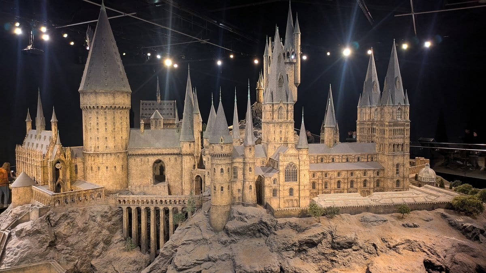
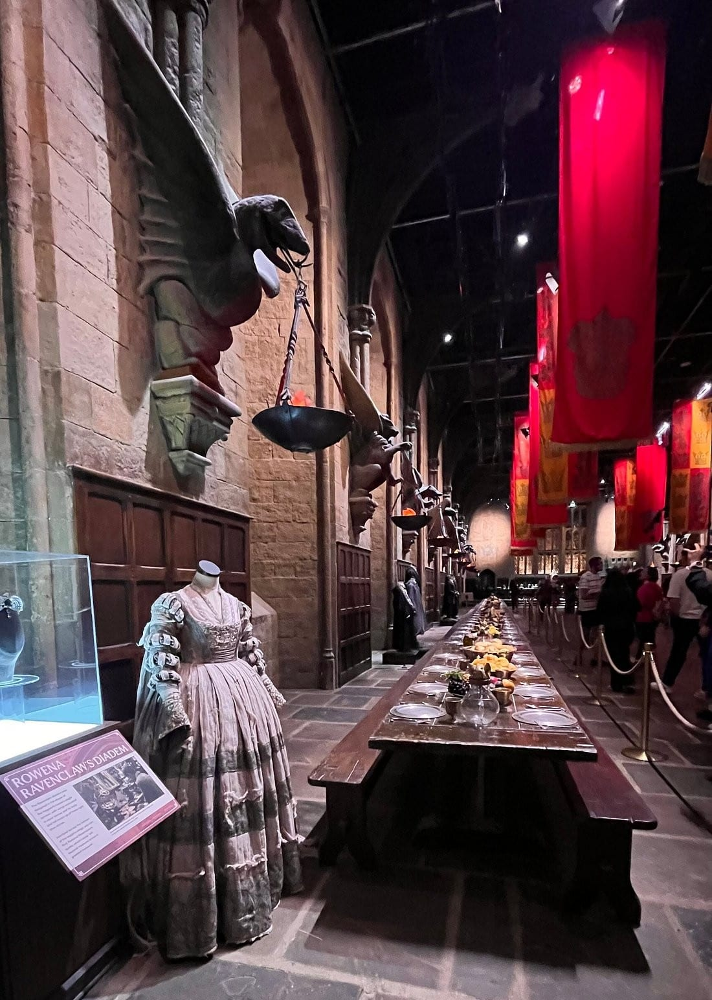
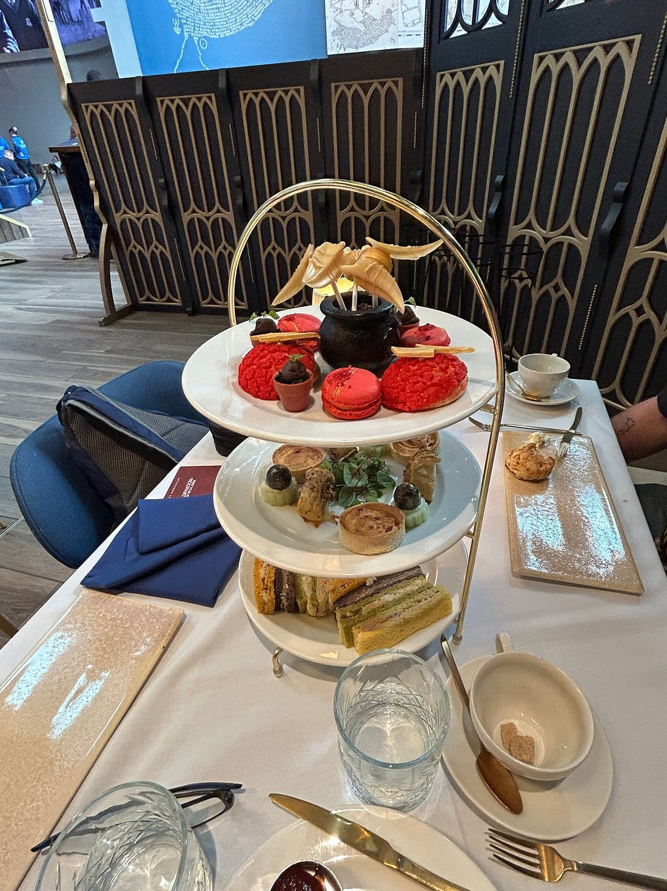
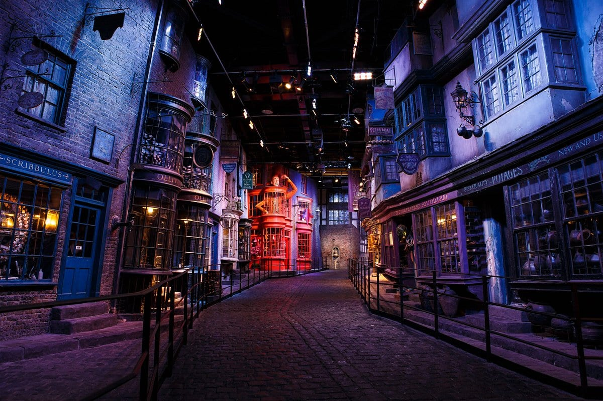
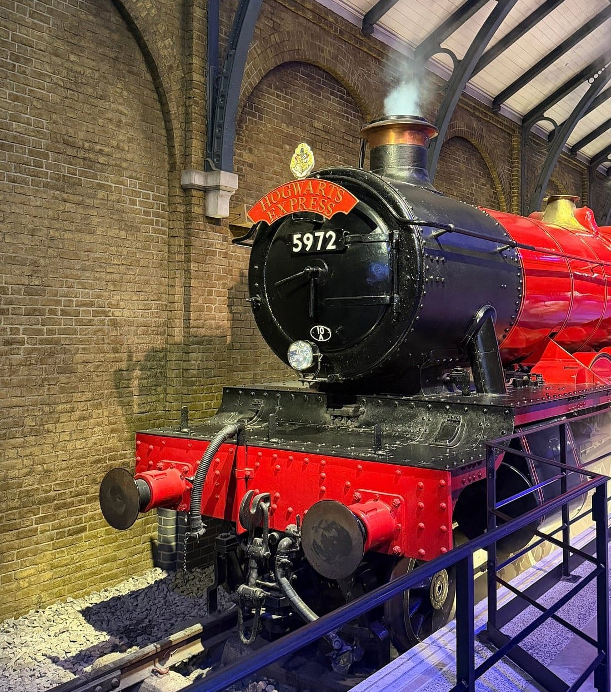

**A ticket to Warner Bros. Studio Tour London costs £58.50 for an adult, and you cannot buy one at the door.** Everything is pre-booked, in 30-minute entry slots, and nothing is held back for the day — you need a booking confirmation even to drive into the car park.

It is not a theme park. It is a walking tour of the sets, props and costumes the films were made on, at Leavesden in Hertfordshire, and it takes about three and a half hours.

> 💡 **The Short Version:** **£58.50 adult, £47.00 child, £188 for a family of four**, the same price on every date. **Book ahead** — Saturdays sell out weeks out. Get there by **train from Euston to Watford Junction (£7.20 off-peak) and the free shuttle bus**, or drive and park free. **Butterbeer is £7.95** and only sold halfway round. The **Digital Guide is £4.75 if you pre-book it**, and £1 more on the day. **Dark Arts runs to 8 November and Hogwarts in the Snow from 14 November**, both included — and the tour is **closed 9 to 13 November**.

## What it costs

| Ticket | Price |
| --- | --- |
| **Adult (16+)** | **£58.50** |
| **Child (5–15)** | **£47.00** |
| **Under 4** | Free, but still needs a booked ticket |
| **Family** | **£188.00** — two adults and two children, or one adult and three children |
| Essential companion or carer | Free |

The family price is not a separate product. Put two adults and two children in the basket and a **£23.00 saving** appears at checkout.

**The price does not move with the date.** A quiet September Tuesday and a peak Hogwarts in the Snow Saturday both charged £58.50. What changes with demand is availability, not price.

## Booking, and the rules that catch people out

- **Tickets are on sale until 31 December 2026** at the time of writing, on a rolling window the operator does not publish a schedule for.
- **Nothing is sold on the day**, by phone or at the desk.
- **Tickets are non-refundable.** Moving to another date costs **£10 per change**, by phone, before your visit date.
- **Sold-out days sometimes reopen**, precisely because other people pay that £10 to move.
- **Resale voids the ticket.** Tickets bought from auction sites or unauthorised resellers are refused at the door.
- **You get a 30-minute entry window** and cannot go in early. Miss it and entry is not guaranteed; at busy times you may have to rebook.

> ⚠️ **Arrive 20 minutes before your slot.** There is a security search, ticket collection and a cloakroom before you start. Before your entry time you can use the Food Hall, the cafés, the shop and the toilets.

## What the ticket includes

*The castle model in the Model Room, near the end of the tour.*

The tour runs in one direction through 21 sections, starting with the doors of the Great Hall opening.

**The sets:** the Great Hall, the Gryffindor common room and Dumbledore's office, Platform 9¾ with the original Hogwarts Express locomotive and a carriage you can walk into, the Forbidden Forest, Gringotts and the Lestrange vault, Diagon Alley, Professor Sprout's greenhouse, the Backlot with the Knight Bus, the Hogwarts bridge and Number Four Privet Drive, the castle model, and the Wand Room.

**Free with any ticket:** the shuttle bus from Watford Junction, car parking, the cloakroom, the Activity Passport for children, WiFi, water refill stations, manual wheelchairs and folding stools, sensory support bags, two sensory rooms and a multi-faith room. **All the seasonal content is included too** — Dark Arts and Hogwarts in the Snow cost nothing extra.

## The optional extras, and what each costs

*The Great Hall, where the tour starts.*

| Extra | Pre-booked | On the day |
| --- | --- | --- |
| **Digital Guide** (Evanna Lynch narrates) | **£4.75** | £5.75 |
| Souvenir guidebook | £7.95 | £9.95 |
| **Digital photo and video package** | **£22.50** | About £30 |
| **Butterbeer**, souvenir tankard | — | **£7.95** |
| Afternoon tea at The Hogwarts Table | £42.50 adult, £16.50 child | — |
| Happee Birthdae cake | £39.95 | — |
| **Priority parking** | **£10** | Not sold on the day |

The photo package covers the green screen broomstick flight and the printed extras, **but not the Hogwarts Express carriage photo**, which is sold separately.

**The free accessibility alternatives are worth knowing about:** audio descriptive tours, tactile tours, braille and large-print image books, induction loops, and BSL tours with a qualified interpreter, all free — the BSL tours need 14 days' notice.

Powered by <a target="_blank" rel="sponsored" href="https://www.getyourguide.com/london-l57/">GetYourGuide</a>

## The upgrades

| Package | Price | What you get |
| --- | --- | --- |
| **Twilight Tour** | **£105** | Selected Fridays. A 20-minute drink reception in the Great Hall with a glass of Champagne, then a part-guided tour of the Hogwarts sets |
| Breakfast package | £127 | Entry, a premium breakfast at The Hogwarts Table, Butterbeer in a souvenir tankard and the guidebook |
| Dinner package | £157.50 | Entry and dinner at The Hogwarts Table |
| **Deluxe Tour** | **£250** (same for children) | A 2½-hour guided tour in a small group, breakfast, priority parking, every green screen photo and video, Butterbeer, a photo at the Great Hall doors, the guidebook, and re-entry to walk round again afterwards |
| **Relaxed Tours** | £58.50 | Standard price, adapted for visitors with autism: reduced numbers, changed lighting and quieter sound from 08:00 to 10:00 on three dates a year |

**The Hogwarts Table is not in the Great Hall.** The breakfast, dinner and afternoon tea all happen in a dining room in the entrance hub, not on the set. It is the single most common disappointment, and the operator is upfront about it.

## Food, drink and Butterbeer

*Afternoon tea at The Hogwarts Table, £42.50 a head. It is in the dining room by the entrance, not on the Great Hall set.*

**Butterbeer is sold in exactly one place:** the Butterbeer Bar next to the Backlot Café, roughly halfway round. You cannot buy it before you start or after you finish.

| Butterbeer | Price |
| --- | --- |
| In a souvenir tankard | £7.95 |
| Frozen Butterbeer | £7.95 |
| Butterbeer ice cream, souvenir sundae dish | £8.45 |
| Butterbeer ice cream, waffle cone | £6.95 |
| Butterbeer latte | £5.65 |
| Sharing flight | £21.90 |

Elsewhere: the **Backlot Café** does burgers, hot dogs and salads halfway round, with outdoor seating facing the Knight Bus. In the entrance hub, before or after, the **Food Hall** serves breakfast until 11:30 and pizzas, pies and burgers after that, the **Dragon Roasted Café** does coffee and the **Frog Café** does hot chocolate, cakes and ice cream. The Food Hall closes at 20:00 at weekends and in school holidays, 17:00 otherwise.

## What is on, and when it is shut

*Diagon Alley, towards the end of the walk.*

| Feature | Dates | Extra cost |
| --- | --- | --- |
| **Dark Arts** | 16 September – 8 November 2026 | None |
| **Hogwarts in the Snow** | 14 November 2026 – 17 January 2027 | None |

**Dark Arts** puts over a hundred floating pumpkins above the Great Hall, Death Eaters through the sets, duelling in the Defence Against the Dark Arts classroom and Dementors in the Forbidden Forest. There are pyrotechnics, water-based smoke and flashing lights at Hagrid's hut, the Hogwarts Express and Diagon Alley, and from 18:00 on the Hogwarts bridge. Ask a team member if you want to bypass any of it.

> ⚠️ **The tour is closed 9–13 November 2026**, between the two seasonal runs, while the sets are redressed, and on **25 and 26 December**. On **24 and 31 December the last tour starts at 14:30**. Check the calendar before you book trains or a hotel.

## Getting there

*The Hogwarts Express, halfway round, where the green screen carriage photo is taken.*

### Train and the free shuttle, which is the cheapest way

**London Euston to Watford Junction takes 18 to 21 minutes** on London Northwestern Railway, running every few minutes. **Contactless and Oyster both work**, and the fare is **£7.20 off-peak or £11.10 peak**. The London Overground Lioness line does the same journey in 48 minutes for the same fare.

Peak fares apply northbound out of Euston only from **16:00 to 19:00 on weekdays**, so a morning trip out is off-peak even midweek.

**The shuttle bus from Watford Junction is free and included in your ticket.** It takes about 15 minutes, runs at least every half hour from 09:20 (from 08:15 on early days), and cannot be pre-booked — you show your ticket for that date at the stop. The buses are electric and wheelchair accessible, one wheelchair per journey. The last bus back leaves when the tour closes, typically 20:00 on quiet weekdays and 22:00 on busy ones.

Both stations are step-free to the platforms, and Watford Junction has staff on hand around the clock.

### Tickets bundled with travel

If you would rather not buy the two separately, the packages below include entry and the transport, and a rep who swaps your voucher for the real ticket:

- **Train and entry, about £75** — return train from Euston, the free shuttle and your ticket, which is only a little over the £58.50 door price plus the fare.
- **Coach from Victoria and entry, about £85** — a return coach, so no change of transport.
- **Hotel pickup and entry, about £155** — a private vehicle from a central London hotel, for up to eight people.

> ⚠️ **Do not buy a transfer without a ticket by mistake.** Some listings sell the coach seat only, and you will be refused boarding without your own Studio Tour ticket. Check that entry is included before you pay.

### The official coach

Golden Tours is the Studio Tour's own coach partner, leaving from **Victoria, Baker Street and King's Cross**. Return transport with entry is **£125 adult, £120 child**; transport on its own, if you already have a ticket, is **£45 adult, £40 child**. Wheelchair users are told not to book the King's Cross departure.

### Driving

**WD25 7LR**, about 50 minutes and 22 miles from central London. **Parking is free**, with blue badge bays by the entrance and Pod Point EV chargers (bring your own cable and the app). **Priority parking next to the entrance is £10** and must be booked in advance.

Every car needs a booking confirmation to get in, and **you cannot go back to the car during your visit** — so take what you need with you.

## When to go

| | Typical weekday | Weekend and peak |
| --- | --- | --- |
| First tour | 10:00 | 09:00 |
| Last tour | 16:00 | 18:30 |
| Closes | 20:00 | 22:00 |

Entry slots run every 30 minutes. Saturdays and school holidays sell out first; late-afternoon slots are the ones left when a date is nearly full, and they work well — the tour has no closing rush because there is no time limit once you are in.

Powered by <a target="_blank" rel="sponsored" href="https://www.getyourguide.com/london-l57/">GetYourGuide</a>

## What people get wrong

- **Turning up without a ticket.** You cannot buy at the door, and you cannot even reach the shop.
- **Arriving at the ticketed time**, rather than 20 minutes before it.
- **Expecting rides.** There are none. It is a walking tour of sets.
- **Bringing luggage.** Large or multiple bags are discouraged and everything goes through a scanner.
- **Bringing a dog.** Pets are refused, and cannot be left in the car either. Assistance dogs are welcome.
- **Forgetting a ticket for a toddler.** Under-4s are free but still need one booked.
- **Booking the trip before checking the calendar**, then finding the tour closed for its November changeover.

## Continue planning your London trip

- ⚡ **[Harry Potter in London](/articles/harry-potter-london/)** — the filming locations, the shops, Cursed Child and what to skip.
- 🎬 **[London filming locations](/articles/london-filming-locations/)** — Harry Potter, Bond, Paddington and more.
- 🚇 **[London transport costs and fares](/articles/london-public-transport-costs-and-fares/)** — how contactless capping works on days like this one.
- 👨‍👩‍👧 **[London with kids](/articles/london-with-children/)** — free farms, zoos and family days out.
- 🗺️ **[Day trips from London](/articles/day-trips-from-london/)** — what the others cost, how long they take, and which days they are shut.
