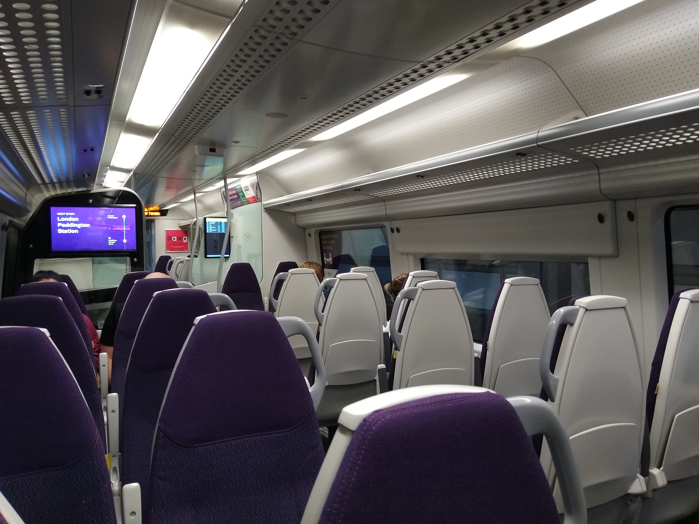

When arriving at London Heathrow (LHR), the fastest-looking train to Paddington isn't necessarily the fastest route to your hotel door. While the Heathrow Express ends strictly at Paddington, the **Elizabeth line** and **Piccadilly line** cross directly through Central London—frequently saving you a complex station transfer and second train fare.

> 💡 **Quick Verdict:**  
> - **Best for Most Travelers:** Take the **Elizabeth line** (fast, air-conditioned, step-free, and reaches West End / City / Canary Wharf directly for £15.50).  
> - **Best on a Budget:** Take the **Piccadilly line** (cheapest at £4.00–£5.90, direct to South Kensington, West End & Kings Cross).  
> - **Best for Paddington & Advance Deals:** Take the **Heathrow Express** (15 mins non-stop to Paddington, best if pre-booked for £10).  
> - **Best for Groups & Heavy Bags:** Pre-book a private transfer or take a licensed London Black Cab.

---

## Heathrow transport options at a glance

*Fares and normal travel times checked on **2 August 2026**. Times are measured from Heathrow Terminals 2 & 3; Terminal 4 or 5 can add 5–10 minutes.*

| Transport Option | Adult Cost to Central London | Journey Time | Comfort | Best For |
| --- | ---: | ---: | --- | --- |
| **Elizabeth Line** | **£15.50** *(PAYG)* | 28–45 mins | 4/5 | Most visitors, luggage & direct cross-city trips |
| **Piccadilly Line (Tube)** | **£5.90** *(Peak)* / **£4.00** *(Off-peak)* | 50–60 mins | 2/5 | Budget travelers & hotels near Piccadilly line stops |
| **Heathrow Express** | **£26.00** *(Walk-up)* / **From £10.00** *(Advance)* | 15 mins to Paddington | 5/5 | Staying near Paddington Station or pre-booked deals |
| **National Express Coach** | From **£10.00** | 45–90 mins | 3/5 | Travel to Victoria Coach Station or late-night arrivals |
| **London Black Cab** | **£70.00 – £120.00** *(Metered)* | 45–90 mins | 4/5 | Families, heavy luggage & door-to-door convenience |
| **Private Hire / Uber** | Quoted in app *(Approx £50–£90)* | 45–90 mins | 4/5 | Fixed-price pre-booked airport transfers |

---

## Which route is best for your hotel location?

| Hotel Area or Destination | Recommended Route | Why |
| --- | --- | --- |
| **Paddington** | Elizabeth Line or Heathrow Express | Both direct; Express saves 13 mins, Elizabeth line is £10.50 cheaper |
| **Bond St / Oxford St / Mayfair** | Elizabeth Line | Direct, step-free, and drops you right in the West End |
| **Soho / Bloomsbury / Tottenham Court Rd** | Elizabeth Line | Direct to Tottenham Court Road in ~35 minutes |
| **Farringdon / City / St Paul's** | Elizabeth Line | Direct cross-city connection without changing trains |
| **Liverpool St / Shoreditch** | Elizabeth Line | Direct to Liverpool Street station in ~40 minutes |
| **Canary Wharf & Stratford** | Elizabeth Line | Direct high-speed service straight into East London |
| **South Kensington / Earl's Court** | Piccadilly Line | Direct and cheap (£4.00–£5.90) |
| **Knightsbridge / Green Park** | Piccadilly Line | Direct to hotel districts in central West London |
| **Piccadilly Circus / Leicester Square** | Piccadilly Line | Direct, though station stairs can be awkward with large bags |
| **King's Cross St Pancras** | Piccadilly Line | Direct link to Eurostar and mainline rail connections |
| **Victoria** | Coach or Elizabeth line to Paddington + Taxi/Tube | Direct coach avoids Tube transfers; rail avoids traffic |
| **London Bridge / Bankside** | Elizabeth line to Farringdon, then Thameslink | Easy cross-platform interchange with luggage |

---

## 1. Elizabeth Line (Recommended for Most Visitors)

The **Elizabeth line** (purple line) is the premier choice for most travelers arriving at Heathrow. Its long, spacious, air-conditioned trains feature dedicated luggage racks, free Wi-Fi, and 100% step-free access at all central stations.

* **Key Central Stops:** Paddington (28 mins), Bond Street (35 mins), Tottenham Court Road (37 mins), Farringdon (40 mins), Liverpool Street (42 mins), Canary Wharf (48 mins).
* **Cost & Payment:** Adult single fare is **£15.50** (includes the Heathrow airport rail supplement). Tap at the ticket barrier with your contactless bank card, phone (Apple Pay / Google Pay), or Oyster card.
* **Capping:** Elizabeth line journeys from Heathrow count towards TfL daily capping.

---

## 2. Piccadilly Line (Best Budget Option)

The **Piccadilly line** (dark blue line) is London's classic Underground route to Heathrow. It serves all passenger terminals and is the cheapest direct rail link into the city centre.

* **Cost & Payment:** **£5.90** during peak hours (06:30–09:29 M-F) or **£4.00** off-peak (all other times, weekends & public holidays). Pay with contactless or Oyster.
* **Trade-Offs:** Trains take 50–60 minutes to reach Central London, lack air-conditioning, have limited luggage space, and central stations often have stairs rather than lifts.

---

Powered by <a target="_blank" rel="sponsored" href="https://www.getyourguide.com/heathrow-airport-l34745/">GetYourGuide</a>

## 3. Heathrow Express (Non-Stop to Paddington)

The **Heathrow Express** runs non-stop between Heathrow Central (Terminals 2 & 3) and London Paddington station every 15 minutes, with a 15-minute journey time.

*Legroom and luggage space built for the journey it's designed for — not a commuter train pressed into airport service.*

| Ticket Class | Walk-up Single | Advance Single *(30–90 days ahead)* | Return Ticket |
| --- | ---: | ---: | ---: |
| **Standard Class** | **£26.00** | **From £10.00** | **£30.00 – £42.00** |
| **Business First** | **£32.00** | Not offered | **£36.00 – £46.00** |

> ⚠️ **Important Heathrow Express Rules:**  
> - **Excluded from TfL Caps:** Tapping contactless or Oyster at the barrier charges the full **£26.00** walk-up fare and **does NOT count towards daily TfL caps**.  
> - **Kids Travel Free:** Children aged 15 and under travel **100% free** in Standard Class with a paying adult.  
> - **When to Use:** Only recommended if your hotel is at Paddington, or if you pre-booked the £10 advance single ticket.

---

## 4. Taxis, Private Hire & Airport Transfers

* **Official London Black Cabs:** Licensed black cabs wait at official ranks outside every terminal. Metered fare to Central London is typically **£70.00 – £120.00** (30–75 minutes depending on traffic).
* **Pre-Booked Transfers / Uber:** Private hire drivers pick up in short-stay parking garages. Quoted fares range from **£50.00 – £90.00**.
* **Drop-Off Charge:** Note that drivers dropping off passengers at Heathrow departures forecourts incur a **£5 drop-off charge**.

---

## 5. Understanding Heathrow's Terminals & Free Transfers

Heathrow operates four active passenger terminals: **Terminals 2, 3, 4, and 5**.

| Terminal | Serviced By | Rail Station Location |
| --- | --- | --- |
| **Terminals 2 & 3** | Elizabeth Line, Piccadilly Line, Heathrow Express | Shared central station linked by pedestrian subways |
| **Terminal 4** | Elizabeth Line, Piccadilly Line | Dedicated station beside Terminal 4 |
| **Terminal 5** | Elizabeth Line, Piccadilly Line, Heathrow Express | Dedicated station beneath Terminal 5 |

> 🔄 **Free Terminal Transfers:** Travel between Heathrow terminal stations on the Underground and Elizabeth line is **100% free**. Simply tap your contactless card or Oyster card (or collect a free transfer ticket at ticket machines)—no fare will be charged.

---

## Arriving at Heathrow: SIM Cards & Wi-Fi

* **Free Airport Wi-Fi:** Unlimited free Wi-Fi is available across all terminals under **_Heathrow Wi-Fi**.
* **Airport SIM Vendors:** SIM Local operates stores and vending machines in all terminals.
* **Smart Tip:** For a complete breakdown of airport SIM markups vs eSIM options, read our guide: [Should You Buy a SIM Card at the Airport?](/articles/should-you-buy-sim-card-at-airport/).

---

## Related Heathrow & Transport Guides

* 📱 [Should You Buy a SIM Card at Heathrow Airport?](/articles/should-you-buy-sim-card-at-airport/)
* 🚊 [Getting Around London: Complete Transport Overview](/articles/getting-around-london-transport-guide/)
* 💷 [London Transport Fares and Costs 2026](/articles/london-public-transport-costs-and-fares/)
* 💳 [Oyster Card vs. Contactless Guide](/articles/oyster-card-guide-london/)
* 🚇 [How to Use the London Underground](/articles/how-to-use-the-london-underground/)

---

*Information checked on 2 August 2026. Always confirm live flight status and rail schedules with [Transport for London](https://tfl.gov.uk/) and [Heathrow Airport](https://www.heathrow.com/).*
