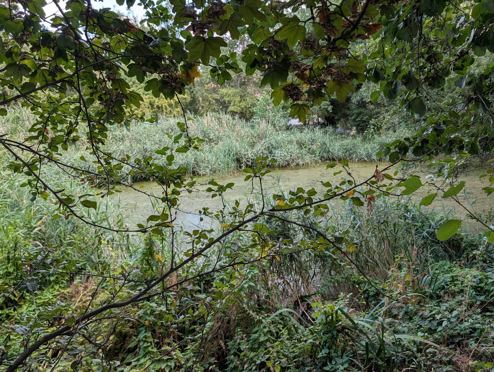
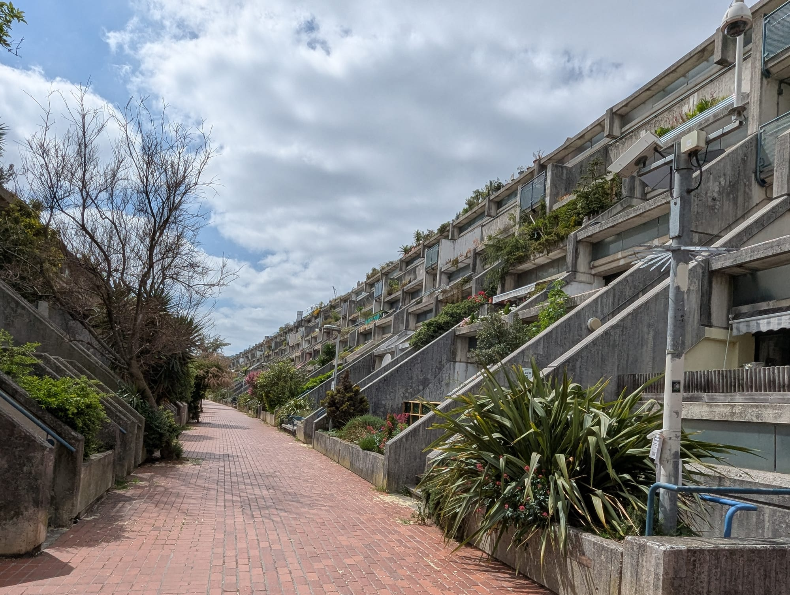
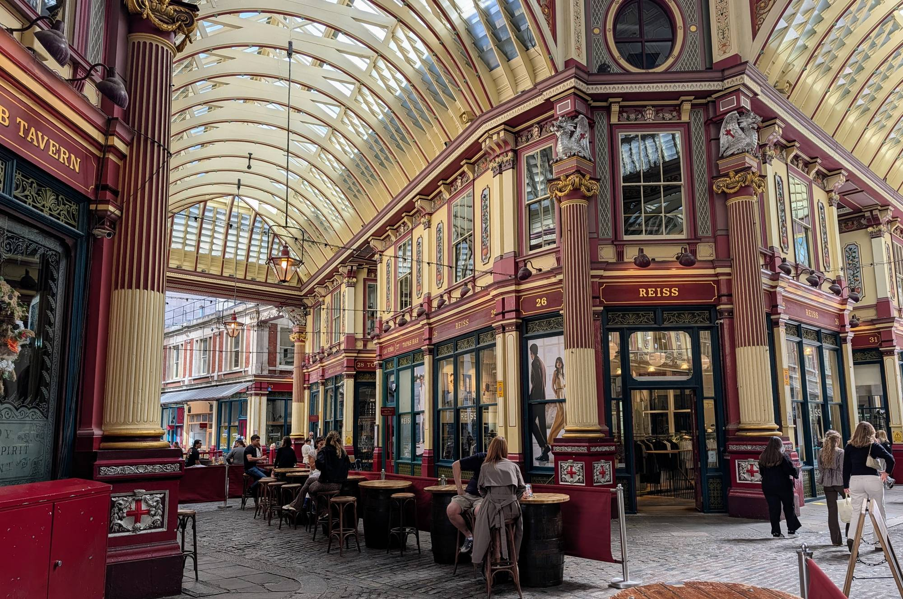

London hides things in plain sight, and then the internet finds them. A wall in the City recording ordinary people who died saving strangers is still genuinely unvisited. A bombed church full of ivy two minutes from Monument has been photographed a million times.

So this guide splits them. First the places most Londoners genuinely have not been to. Then the ones that are simply quieter than the big attractions — because calling those hidden is a lie, and with those the useful information is what time to turn up.

Almost all of it is free, and most of it takes ten minutes.

*Every place below status-checked against its own website or its custodian's site on 1 September 2026.*

> 💡 **The Short Version:** **Postman's Park** is the most affecting free thing in London and still genuinely overlooked. **The Silver Vaults** are two floors under Chancery Lane, free, and shut at lunchtime on Saturday. **The Fitzrovia Chapel** opens three days a week and no more. **The Rolling Bridge and the Fan Bridge in Paddington are both out of action** — every list still prints their timetables. And **St Dunstan in the East, Neal's Yard and Leadenhall Market are not hidden**, they are famous and small, which is a different problem.

## Where they are

| If you are near… | What to find |
| --- | --- |
| **The City** | Postman's Park, the Roman Amphitheatre, St Dunstan in the East, Leadenhall Market |
| **Holborn** | The Silver Vaults, Sir John Soane's, the Kingsway tram tunnel |
| **Covent Garden** | Cecil Court, Neal's Yard |
| **Fitzrovia** | The Fitzrovia Chapel, Colville Place, All Saints Margaret Street |
| **King's Cross** | Camley Street Natural Park, the Light Tunnel, Word on the Water |
| **Greenwich** | The foot tunnel |
| **Paddington** | The Rolling Bridge and Fan Bridge — both currently out of action |
| **Clapham** | The deep shelter tour |

---

## Genuinely obscure

The ones where you can still turn up on a weekday and have the place more or less to yourself.

### Postman's Park, the City

A small churchyard garden behind St Botolph Aldersgate, and along one side a wooden loggia holding the Watts Memorial to Heroic Self-Sacrifice: **54 hand-painted ceramic tablets naming 62 ordinary people who died saving somebody else.** Alice Ayres, a builder's daughter, who saved three children from a burning house and died of her injuries. Leigh Pitt, a print technician who drowned pulling a nine-year-old out of a canal in Thamesmead in 2007 — his tablet went up in 2009, the first added in 78 years. Reading the wall takes ten minutes and levels you. Office workers eat lunch on the benches behind you throughout. It is free and there is nothing to book. The City of London publishes no opening hours for it; in practice the gates stand open through the day and are closed around dusk. St Paul's, exit 1.

### London's Roman Amphitheatre, Guildhall

The eastern entrance, drain and wall stubs of Londinium's amphitheatre, found in 1988 while the Guildhall Art Gallery was being built above them and opened to the public in 2002. What survives is a few metres of dark stone and timber; the missing bowl is drawn around it in green light on a black floor, with the silhouettes of a crowd projected on the walls. It held six to seven thousand people, roughly a quarter of Roman London. Twenty feet below the pavement it is cold, quiet and usually empty. **Free, open daily 10am to 5pm with last admission at 4.45pm.** You can book a general admission slot or simply walk in. Free introductory tours run Tuesday to Sunday at 12.15pm and 1.15pm, no booking.

### The London Silver Vaults, Holborn

Two floors below Chancery Lane, behind a steel vault door three feet thick, a corridor of **30 independent dealers** selling antique and modern silver — cutlery, candelabra, christening mugs, vintage jewellery and watches. It opened in 1882 as the Chancery Lane Safe Deposit Company, the country's second non-bank strongroom, where the aristocracy stored the family plate while they were at their country houses. Dealers moved into the rooms in the 1930s. A bomb destroyed the building above in the Blitz; the vaults underneath survived. Nobody hassles you and nobody expects you to buy anything. **Free, no appointment: Monday to Friday 9am to 5.20pm, Saturday 9am to 12.50pm, closed Sunday and bank holidays.** The entrance is on Southampton Buildings, not Chancery Lane, which is where people fail to find it.

### The Fitzrovia Chapel

The last surviving fragment of the Middlesex Hospital, which was demolished around it — the chapel now stands alone in Pearson Square inside the Fitzroy Place development. John Loughborough Pearson began it in 1891, his son Frank finished it, and between them it took over forty years and more than forty kinds of marble. The first service was held on Christmas Day 1891. From outside it is plain red brick and easy to mistake for plant machinery. Inside is a gold mosaic ceiling and a small, very quiet room, and often you will be the only person in it. **Free and no booking, but it only opens most Mondays, Tuesdays and Wednesdays 11am to 5pm, plus at least one Sunday a month from noon.** During exhibitions it usually opens daily. Check What's On before travelling.

### All Saints, Margaret Street

Butterfield's 1859 church, one street back from Oxford Circus and completely invisible from it. This is the founding building of High Victorian Gothic and the pattern is structural rather than painted — every surface is banded brick, inlaid tile or coloured marble, worked into the fabric itself. The nave is dark, saturated and much smaller than photographs suggest, which is the point: it was built to prove a town church could be intense rather than large. **Open every day from 11am to 7pm for visiting and private prayer, free.** Mass is said at noon daily and at 6.30pm, and the choir is one of the best in London. Arriving during a service is fine, but you will be joining it rather than wandering. The entrance is through a small brick courtyard off Margaret Street.

### Colville Place, Fitzrovia

A pedestrian lane about a hundred metres long running between Charlotte Street and Whitfield Street, built from 1766 by John Colvill, a carpenter who went bankrupt on the job in 1774. Air raids took the eastern end of both terraces, and the gap is now Crabtree Fields, a small public garden. What is left is a double row of narrow three-storey brick houses, painted doors, pot plants on every step, and old lamp standards down the centre line where the two sloping pavements meet. There are no cars because there is no way in for one. **It is free, always open and a public right of way — there is no sign, nothing to buy and nothing to look at except the street.** These are people's homes, so keep the noise down. Two minutes from Goodge Street.

### Camley Street Natural Park, King's Cross

Two acres of woodland, marsh and pond wedged between the Regent's Canal and the railway lines into St Pancras. It was a coal drop for King's Cross, demolished in the 1960s, colonised by scrub, and saved from development by London Wildlife Trust, who opened it as a nature reserve in 1985. You come in off a busy street a few minutes from Granary Square and the traffic noise drops within a few steps. There are boardwalks over the water, a visitor centre and the Kingfisher Café, and kingfishers, reed warblers, Cetti's warbler, common toads and emperor dragonflies have all been recorded. Entry is free and it opens daily, but on much shorter hours than a park: **10am to 5pm April to September, and only 10am to 4pm October to March.** Assistance dogs only.

*The pond. Two minutes from a mainline terminus, with kingfishers, herons and reed warblers all recorded here.*

### The Ornamental Canal, Wapping

A **narrow channel of water running through Wapping between Tobacco Dock and Shadwell Basin**, with brick warehouse-style housing on both banks, a towpath the whole way, and almost nobody on it. It is not a canal in the working sense — it was laid out in the 1980s along the line of the filled-in London Docks, which is why it goes nowhere and simply stops at each end.

That is exactly what makes it worth the walk. **Wapping Wood** runs alongside it, planted on the filled dock itself, and the tower on the skyline as you look north-west is **Hawksmoor's St George in the East**. The whole stretch takes about fifteen minutes end to end.

**Free, open at all times, and genuinely quiet even at the weekend** — this is a residential back-water rather than an attraction, so there is nothing to buy and nothing to book. Wapping station is at the southern end and Shadwell at the northern. Best in October, when the trees along the water turn.

*The Ornamental Canal looking north-west, with St George in the East on the skyline. October, when the ivy on the buildings turns.*

### The Rolling Bridge and Fan Bridge, Paddington

Two kinetic bridges over Paddington Basin. Thomas Heatherwick's Rolling Bridge, installed in 2004, is twelve metres of eight hinged triangular segments that curl up into an octagon on the towpath. The Fan Bridge, by Knight Architects and finished in 2014, is twenty metres long and lifts in five separate fins like a hand fan. **Both are currently out of action.** Merchant Square's own page says the Fan Bridge is out of order and gives no return date; the Paddington Partnership says the same of the Rolling Bridge and points visitors back to Merchant Square. Almost every hidden London list still prints the timetables as though they were live — for the record, the Fan Bridge lifted Mondays, Wednesdays and Fridays at 11.30am, and never in high wind. The basin walkways are free and open at all hours, and there is nothing to book. Come for the water, the floating pocket park and the food, and treat any movement as a bonus.

*Alexandra Road in Camden - a Grade II&ast; listed concrete street with no cars on it at all. It is a public right of way and you can simply walk down it.*

---

Powered by <a target="_blank" rel="sponsored" href="https://www.getyourguide.com/london-l57/">GetYourGuide</a>

## Genuinely obscure, but you have to book

Two of the best things under London, and neither is something you can wander into. Both are run by the London Transport Museum, both release tickets in batches, and both sell out.

### Kingsway Tram Tunnel, Holborn

Opened in 1906 by the London County Council, this ran trams under Kingsway from Holborn down to the Embankment, linking the north and south London tram networks, and closed in 1952. More than half of it survives, along with the remains of a subterranean tram station. The tour takes you down through the gate on the street into a wet, uneven, sixty-minute walk under the road. **Tickets are £49 adult and £45 concession plus a £1.50 booking fee — not the £18 still circulating on other lists.** Dates come in batches and there are none on sale at the time of writing; the museum's page offers only a "hear when tickets go on sale" signup. **Age 14 and over, photo ID required at the gate, and flat sturdy shoes** — sandals and heels are refused. No toilets, no cloakroom. Meet at Theobalds Road and Southampton Row, WC1B 4AP.

### Clapham South Deep Shelter

One of eight deep-level shelters dug beneath Underground stations during the Second World War, opened in 1944 with bunks for 8,000 people, complete with canteen, medical posts and a warden's cabin. After the war it housed Caribbean arrivals off the *Empire Windrush* in 1948 and visitors to the Festival of Britain in 1951, and their graffiti is still on the walls. You descend eleven storeys and walk over a mile of tunnel with Northern line trains audible overhead; two guides take it, one in ARP warden costume, and the canteen and cabin have been restored to their 1940s state. **£39 adult, £36 concessions and children, 75 minutes, age 10 and over with 10 to 16s accompanied.** Tours run at 11am, 1pm and 3pm on selected dates. **Meet at the Marks & Spencer Food Hall on Balham Hill, SW12 9EA**, not at the station.

---

## Not hidden any more — just quieter than the big attractions

All of these are worth an hour. None of them is a secret. What matters here is timing, not discovery.

### St Dunstan in the East

A church stood here from about 1100. It burned in the Great Fire, Wren rebuilt it, the Blitz gutted it in 1941, and the City decided not to rebuild — in 1967 it chose to turn the shell into a garden, which opened in 1970. The tower and steeple survived and still stand. Inside the roofless nave there are climbing plants through the window tracery, a small fountain, benches and a canopy of trees where the ceiling was. It is free and needs no ticket. **There are no published opening hours** — the City of London's own garden page gives none, and the 8am-to-7pm figure repeated across other sites does not come from the Corporation; in practice the gates stand open through the day and shut around dusk. **It is not hidden. It is one of the most photographed places in the City.** Come before 9am, or on a Sunday.

### Leadenhall Market

A covered market in cream, maroon and green wrought iron, built by Horace Jones in 1881 and Grade II listed, standing directly on the site of the Roman forum and basilica — the largest such complex north of the Alps. There has been a market here since 1321. Today it holds boutiques, wine bars, restaurants and a pub, and it was filmed as the approach to Diagon Alley in the first Harry Potter film, which is exactly why it is busy. **The arcade itself is a public thoroughfare and never closes; the shops and bars inside keep City hours.** That is the whole trick to it: on a Sunday you get the ironwork, the cobbles and nobody at all, but nothing open; on a weekday lunchtime you get the market working and no room to photograph it. Free either way.

*A weekday afternoon — the market working, and the compromise this entry describes. The dragons on the shields are the City of London's own.*

### Sir John Soane's Museum, Holborn

The architect's own house at 13 Lincoln's Inn Fields, preserved by an Act of Parliament of 1833 exactly as he left it at his death in 1837 — the sarcophagus of Seti I in the basement crypt, casts stacked to the ceiling, mirrors angled to steal daylight, and rooms so tightly packed you move through them sideways. **Entry is free and there is no need to book: walk in.** It opens **Wednesday to Sunday, 10am to 5pm, with last admission usually 4.30pm, and is closed Monday and Tuesday** though it opens on bank holidays. Capacity is small, so expect to queue. **Time your visit for the Picture Room panels, which are swung open at set hours — 2pm for the Rake's Progress on the north wall, and 11am, 3pm and 4pm for the south recess.** No café, no seating, no air conditioning.

### Cecil Court, Covent Garden

A short Victorian shopping street between Charing Cross Road and St Martin's Lane, with bow windows, lamp standards and around two dozen shops, all independent and most of them dealers: Goldsboro Books for signed first editions, Marchpane for children's books, Watkins for the occult, Travis & Emery for sheet music, plus coin, medal, map, print and antiques specialists. Mozart's family lodged here in 1764, their first London address. Early film companies clustered here so thickly the trade called it Flicker Alley. It is free to walk down at any hour, **but the shops set their own hours — most keep roughly 10.30am to 5.30pm, Monday to Saturday, and a good many are closed on Sunday**, so a Sunday visit gets you a pretty empty alley and locked doors. The Diagon Alley claim is repeated everywhere and has never been confirmed by anyone.

### Neal's Yard, Covent Garden

A courtyard about twenty metres across, reached through narrow alleys off Monmouth Street and Short's Gardens. Until the 1970s it was a derelict, rat-infested yard of warehouses serving the fruit and vegetable market; in 1976 Nicholas Saunders bought one of the empty buildings and filled the yard with wholefood and natural-remedy businesses. Neal's Yard Dairy followed in 1979 and Neal's Yard Remedies in 1981. Every wall is a different colour, plants hang off every ledge, and there are now cafés, wine bars and restaurants around the edges. **It is free and always open, and it is the most photographed twenty metres in London — a dozen people with cameras fills it completely, so come before 10am.** The alleys in are genuinely easy to walk straight past; the courtyard is not a secret.

### Greenwich Foot Tunnel

A white-tiled pedestrian tunnel under the Thames, opened in 1902 by the London County Council so that workers living in Greenwich could reach the docks and shipyards on the Isle of Dogs in any weather. You enter through a glazed brick rotunda by the *Cutty Sark*, go down a spiral staircase or a lift, and come up at Island Gardens with the whole Greenwich waterfront laid out behind you across the river. It is entirely free and **open 24 hours; since the refurbishment the lifts run around the clock too, and the council publishes a live lift status page**. **You must not cycle through — dismount and walk, and e-bikes are barred altogether**, which catches out hire-bike riders. Thousands use it daily, so it is not hidden; it is simply free while most visitors pay for the DLR.

### Word on the Water, King's Cross

A 1920s Dutch barge, the *Dianti*, moored on the Regent's Canal towpath between Granary Square and the York Way bridge, trading as a bookshop. There is a wood-burning stove in the cabin, secondhand and new stock crammed floor to ceiling, and a roof deck that hosts jazz and poetry on summer weekends. It spent years being moved along the canal before the King's Cross development gave it a permanent mooring in 2015. The cabin holds about six people comfortably. **It is free to browse and opens midday to 7pm every day except Christmas Day** — later than most bookshops, but it is shut all morning, which is when a lot of people walk past it and assume it has gone. It is one of the most photographed shops in London and not remotely a secret.

### The King's Cross Light Tunnel

The pedestrian subway running from King's Cross and St Pancras under the road to King's Boulevard, Granary Square and Coal Drops Yard. It is 90 metres long and gently curved, and one whole wall is a light installation — 190 individually controllable vertical pixels behind 12mm toughened glass, designed by Allies and Morrison with Speirs Major and The Light Lab. The colour crawls and shifts as you walk through it, and the tunnel has been used as a London Fashion Week catwalk and hosted a yoga workshop. **It is free and open 7am to 8pm daily**, so it is not a route home from a late train. Be honest about what it is: tens of thousands of people walk it every week without meaning to. It is thirty good seconds, not a destination.

---

Powered by <a target="_blank" rel="sponsored" href="https://www.getyourguide.com/london-l57/">GetYourGuide</a>

## What it costs

Most of this guide is free. The exceptions are worth knowing about in advance, because two of them book out months ahead.

**Free, walk in, no ticket:**
Postman's Park, St Dunstan in the East, Leadenhall Market, Colville Place, Neal's Yard, Cecil Court, the Greenwich foot tunnel, the King's Cross light tunnel, the London Silver Vaults, All Saints Margaret Street, the Fitzrovia Chapel, the Roman Amphitheatre and **Sir John Soane's Museum** — which is free, despite being widely described as ticketed. Camley Street Natural Park is free too, on shorter hours.

**Ticketed, and worth booking early:**

* **London Transport Museum's Hidden London tours** of disused stations and tunnels are the best of these and sell out fastest. **Clapham South is £39 adult and £36 concession; the Kingsway tram tunnel is £49 and £45.** Both carry a £1.50 booking fee, and tickets are released in batches rather than sold continuously, so the answer is often "not now, sign up for the alert".
* **Dennis Severs' House**, Spitalfields — **£16 for a day visit, silent or relaxed, and £25 for the candlelit silent night visit**, which is the one to book. Walk-up tickets exist but depend on availability.
* **Leighton House**, Kensington — **£14 adult, £9 concession, £5 for ages 6 to 18**, closed Tuesdays. Some ground-floor areas are free.

**The cheapest way to see hidden London** is still to walk it. The alleys, the ghost signs, the parish boundary markers and the buried rivers cost nothing and are not signposted, which is rather the point.

---

## What to know

* **The Rolling Bridge and the Fan Bridge are both out of action.** Do not plan a morning around either. Their published lift times are still all over the internet.
* **Sir John Soane's Museum is free and unbookable.** Plenty of guides say otherwise. Just turn up, Wednesday to Sunday.
* **The tunnel tours are £39 and £49, not £18 and £22.** They also release tickets in batches, so check whether anything is on sale before you plan around them.
* **The Silver Vaults shut at 12.50pm on Saturday and all day Sunday,** and the entrance is on Southampton Buildings.
* **The Fitzrovia Chapel opens three days a week.** Mondays to Wednesdays, 11am to 5pm, plus a monthly Sunday.
* **Camley Street closes at 4pm in winter,** which is earlier than any park nearby.
* **The City of London publishes no opening hours for Postman's Park or St Dunstan in the East.** Both are daylight-only in practice.
* **Neal's Yard, St Dunstan and Leadenhall are not hidden.** They are famous and small. Early morning or Sunday is the difference between a good visit and a queue.

---

Powered by <a target="_blank" rel="sponsored" href="https://www.getyourguide.com/london-l57/">GetYourGuide</a>

## Continue planning your London trip

- 🎪 **[Free Things to Do in London](/free/)**
- 🎨 **[London's Street Art and Banksys](/articles/london-street-art/)**
- 🎬 **[London Filming Locations](/articles/london-filming-locations/)**
- 🏰 **[Historic Houses in London](/articles/historic-houses-london/)**
- 🏙️ **[City of London Area Guide](/articles/city-of-london-area-guide/)**
- 🚂 **[King's Cross Area Guide](/articles/kings-cross-area-guide/)**
