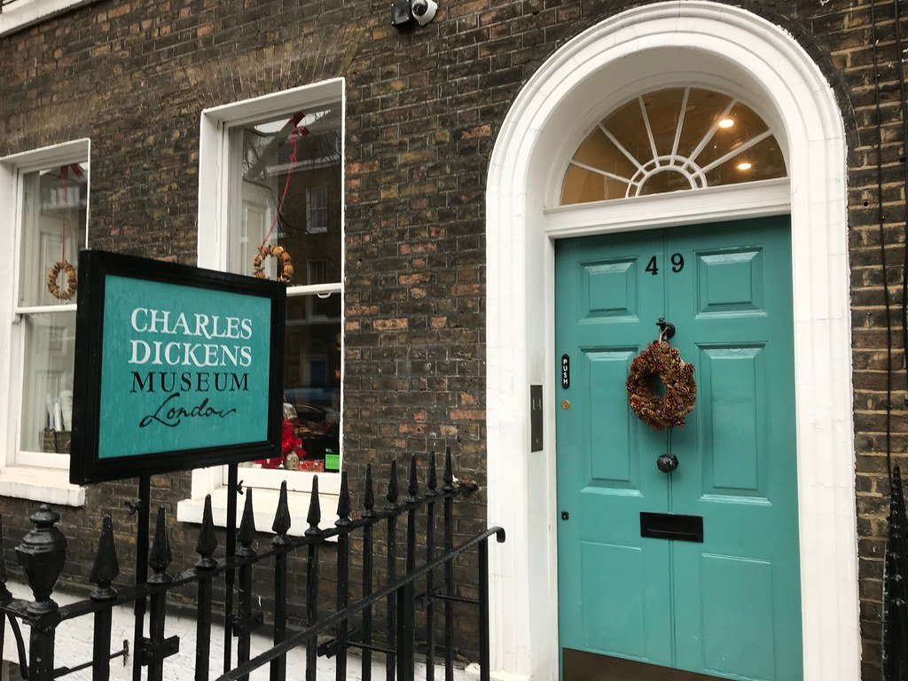
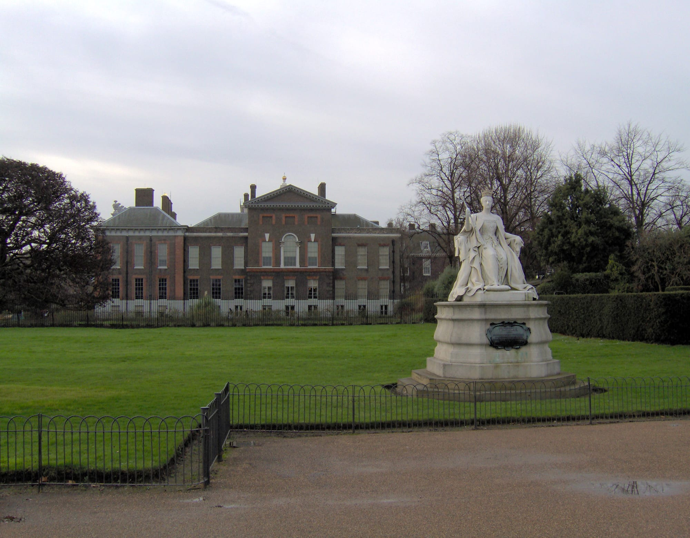
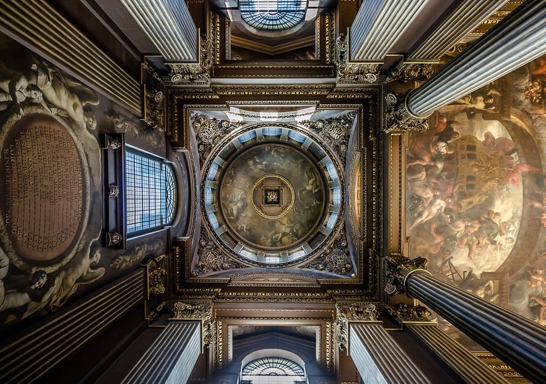
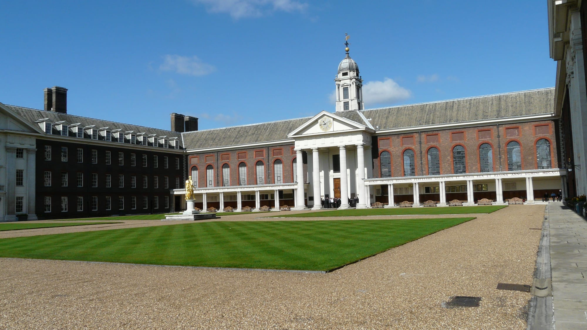
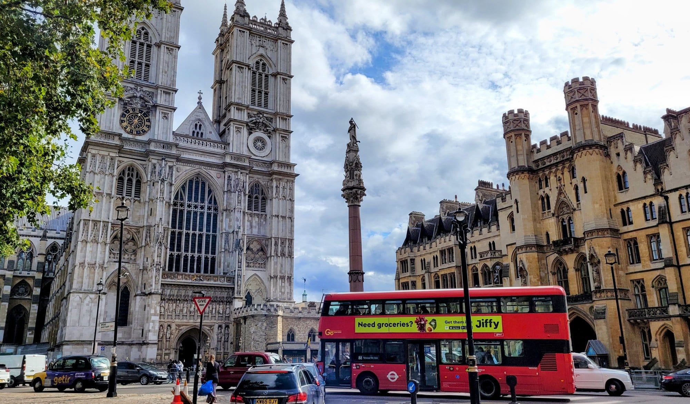

London's historic interiors range from a royal palace to a chapel that is the last surviving fragment of a demolished hospital. Several of the best are free, and the most extraordinary one is a private house nobody is allowed to change.

> 💡 **The Short Version:** **Sir John Soane's Museum** is free and the best small house museum in Britain. **Eltham Palace** is an art deco mansion grafted onto a medieval palace. **The Painted Hall** in Greenwich is Britain's Sistine Chapel. **St Dunstan in the East** is a bombed church filled with vines. And **Evensong at St Paul's** is free and better than the paid visit.

> 📘 **How we choose these (editorial note)**
> No paid placements. These are drawn from a wide spread of sources rather than any single list - the food and travel press, the big listings sites, independent blogs and specialists, video, and what Londoners recommend themselves - and cross-referenced against each other. Admission prices are the venues' own, checked August 2026. Where a building is free to enter but charges for one part of it, we have said which.

## Where they are

| If you are near… | Where to go |
| --- | --- |
| **Bloomsbury & Holborn** | Sir John Soane's Museum, Charles Dickens Museum |
| **The City** | St Paul's Cathedral, St Dunstan in the East |
| **Covent Garden** | St Paul's, the Actors' Church |
| **Westminster** | Westminster Abbey, Churchill War Rooms, Buckingham Palace |
| **Fitzrovia** | The Fitzrovia Chapel, All Saints Margaret Street |
| **Greenwich** | Old Royal Naval College, The Painted Hall, Cutty Sark |
| **Chelsea & Kensington** | Royal Hospital Chelsea, Kensington Palace, Leighton House |
| **Further out** | Hampton Court Palace, Eltham Palace, Ham House, Kenwood |

---

## House museums

### Sir John Soane's Museum, Bloomsbury

*Free · Lincoln's Inn Fields · closed Mon and Tue*

The architect's own house, **preserved by Act of Parliament exactly as he left it in 1837** — mirrors, top-lit wells, a sarcophagus in the basement, and paintings hung on hinged walls that swing open to reveal more paintings behind them.

**Time your visit around the Picture Room panels**, because they only open at set times: *A Rake's Progress* on the north wall at **2pm**, and the south recess at **11am, 3pm and 4pm**. Turn up at 12.30 and you see a wall.

**Two free tours exist that you cannot book online.** The Private Apartments run Wed, Fri and Sun at 2pm for **eight people**; the Drawing Office Thu and Sat at 2.30pm for **six**. Both are first-come, first-served on the day — ask a Visitor Assistant the moment you arrive.

**Free, no booking, Wednesday to Sunday 10am–5pm, closed Monday and Tuesday.** Capacity is small and they will queue you or close admissions early if full. Photography is allowed but **sketching is not**, and step-free access needs 24 hours' notice on 020 7405 2107 because a staff member has to operate the lift.

### Charles Dickens Museum, Bloomsbury

*£14 · Doughty Street · closed Mon and Tue*

**The only house Dickens lived in that still stands in London.** He was here under three years, from 1837, and wrote *Oliver Twist* and *Nicholas Nickleby* in it — which makes the study the point of the visit.

Five floors laid out as a working household rather than a gallery: kitchen and wash house in the basement, dining and drawing rooms, the study, the bedrooms, the nursery and the servant's room at the top. Among the objects, the copy of *David Copperfield* that went to the Antarctic on Scott's 1910 expedition.

**£14 adult, £8 child, £12 concession, and carers go free.** Wednesday to Sunday 10am–5pm, last entry an hour before, **closed Monday and Tuesday**. Admission runs in 15-minute slots and walk-ups wait if the house is full.

A platform lift reaches four of the five levels but **must be operated by staff — ask at the desk** — and the attic cannot be reached at all. Prams are not allowed in the house; there is a cloakroom.

*48 Doughty Street, where Dickens wrote Oliver Twist and Nicholas Nickleby. He lived here under three years. Photo: [Matt From London](https://www.flickr.com/photos/57868312@N00/38375015794), [CC BY 2.0](https://creativecommons.org/licenses/by/2.0/).*

### Leighton House, Kensington

*Ticketed · closed Tue · free on the first Monday of the month*

Frederic Leighton's studio-house, built around an **Arab Hall lined with seventeenth-century Damascus tiles**, a gold mosaic frieze and a fountain set into the floor. Leighton was President of the Royal Academy and built the place as much to be seen in as to work in; the studio upstairs is the other half of the point.

**The free way in: Pay What You Want, the first Monday of every month, 10am–1pm.** You can pay the full price, a little, or nothing at all — but it is **door tickets only**, so you cannot book it online, and it excludes bank holidays.

**A good deal of it is free every day regardless**: the shop, the café, the garden, the drawings gallery, the De Morgan ceramics, the Watts wall paintings and the display holding **the colour sketch for *Flaming June***.

**Open Monday and Wednesday to Sunday 10am–5.30pm, closed Tuesday**, last entry 4.30pm, and **the garden shuts at 5pm without exception**. Free volunteer-led tours run Wed–Sun at 2.30pm when a volunteer is available. Unusually for a house of this age it has **step-free access to every floor**.

### Kenwood House, Hampstead

*Free · Hampstead Heath*

**Free, permanently, under the terms of the Iveagh Bequest** — and it holds paintings most ticketed galleries would build a wing around. **Rembrandt's *Self-Portrait with Two Circles***, one of his last and largest, and **Vermeer's *The Guitar Player***, one of only about thirty-seven Vermeers anywhere. Add Gainsborough's *Countess Howe* in pink silk, plus Reynolds, Turner, Constable and Van Dyck.

The house is **Robert Adam**, and **the Great Library is the room** — restored to its original colour scheme, which is far bolder than most people expect of Adam. The Suffolk Collection of full-length Jacobean portraits is here too.

Outside, 112 acres of Humphry Repton landscape running into Hampstead Heath, with a sham bridge built purely to be looked at.

**Free, and booking is optional** — you can reserve a free day ticket online until 8.45am on the day, otherwise walk up. **House 10am–5pm in summer, 10am–4pm from late October**; the grounds open at 7am. **Free 15-minute Spotlight Talks** run Tue, Thu and Sun; paid hour-long Highlight Tours are £10 on the day, Wed, Fri and Sat.

---

## Palaces

### Hampton Court Palace

*Ticketed · weekdays cheaper than weekends*

Henry VIII's kitchens, the Tudor Great Hall and Wren's baroque state apartments — genuinely two palaces sharing one address, and the join between them is the thing to look for.

**Everything outside is included in the ticket**, which people get wrong constantly: the **maze**, the Magic Garden, the Privy Garden, the Great Fountain Garden, the Wilderness and the Kitchen Garden all come with admission. So does a multimedia guide.

Inside, the Great Hall with Henry's tapestries, the Haunted Gallery, the Wolsey Rooms, William III's baroque apartments, and the **Cumberland Art Gallery** with Rembrandt, Caravaggio and Van Dyck.

**Weekdays are cheaper than weekends** — the palace prices peak and off-peak deliberately — and anyone on **Universal Credit or several other benefits can buy £1 tickets for up to four people**, booked online in advance. They sell out.

**Two free ways in.** The **Gardens Open Days** in September, October and November admit anyone to the gardens with no ticket and no booking. And **you do not need any admission ticket to attend a service at the Chapel Royal.**

**Open daily 10am–5.30pm, last entry 4.30pm — but it takes occasional one-off closure days**, so check the date. The **Mantegna Gallery is closed until spring 2027**.

### Eltham Palace

*From £17 booked ahead · winter opening is weekends only*

A **1930s millionaire couple built an art deco house onto Henry VIII's childhood palace** — the strangest combination of buildings in London, and the one people are most surprised by.

The Courtaulds' half gives you a **circular entrance hall** lit from above and panelled by Swedish designers, **Virginia Courtauld's gold-mosaic bathroom with an onyx bath**, a reconstruction of her walk-in wardrobe, and — the detail nobody forgets — **the heated quarters built for the family's pet ring-tailed lemur, Mah-Jongg**. Then you walk into **Edward IV's medieval great hall** with its hammer-beam roof and the centuries collide.

Nineteen acres of garden outside, with a rock garden, a sunken rose garden and **London's oldest working bridge** over the moat.

**Book online by midnight the day before to pay £17 rather than £20 on the door.** The catch is the calendar: it runs daily through the summer, but from **early November to mid-February it opens weekends only**, and it closes early on some Saturdays for weddings. **The lift is out of order** at the time of writing — ask staff about the alternative.

### Kensington Palace

*Ticketed · the gardens are free · open daily*

Queen Victoria's birthplace and childhood home, and the palace where **the rooms she actually grew up in** are the exhibition — which makes it more legible than most royal interiors. The King's State Apartments are the grand half, and **William Kent's painted King's Staircase** is the single best thing in the building.

**The part almost nobody realises is free:** the Palace Gardens, and **the Sunken Garden with the statue of Diana, Princess of Wales**. No ticket, no booking — though the Sunken Garden is viewed from the Cradle Walk rather than entered.

**A third of the palace is currently shut.** The **Queen's State Apartments are closed until spring 2027** for re-presentation, which is worth knowing before you pay.

**Open daily 10am–6pm, last entry 5pm** — no closed day, unusually. **£1 tickets** are available to anyone on Universal Credit and several other benefits, up to four per household. Free 15-minute talks and a free audio guide come with admission, and there are **free BSL tours Wednesday to Sunday**, booked ahead.

*Kensington Palace, with the statue of Victoria her daughter Louise sculpted. The gardens around it, and the Diana statue in the Sunken Garden, cost nothing.*

### Buckingham Palace State Rooms

*£33 advance · summer only · closed Tue and Wed in September*

The nineteen State Rooms the King uses for official entertaining, open **only while the court is away** — in 2026 that was 9 July to 27 September. Grand Staircase, Throne Room, Picture Gallery, Ballroom.

**The date trap is September.** The palace is **closed on Tuesdays and Wednesdays throughout September**, and the last admission drops from 5.30pm to 4.30pm on 1 September. Slots are timed in 15-minute intervals and dates sell out.

**£33 booked ahead against £37 on the door**, and **£1 tickets** exist for anyone on Universal Credit and similar benefits. Whatever you pay, **convert the ticket to a 1-Year Pass at the desk** — it is free and gets you back in for a year.

**The garden is partly included**: the route leaves through it along a half-kilometre gravel path, and **the only toilets are at that end**, so go before you start. A proper guided garden walk is a separate, dearer ticket.

**No photography at all inside**, airport-style security on arrival, and **pushchairs cannot go in** and must be checked. Outside, **Changing the Guard is free** and runs year-round.

Some of the palace is behind hoardings during the reservicing works — **the White Drawing Room is closed for the whole summer opening.**

---

Powered by <a target="_blank" rel="sponsored" href="https://www.getyourguide.com/london-l57/">GetYourGuide</a>

## Greenwich

### The Painted Hall, Old Royal Naval College

*£19, under-16s free · open daily*

**3,700 square metres of baroque painting and around 200 figures**, which took James Thornhill nineteen years and is routinely called Britain's Sistine Chapel. **2026 is the 300th anniversary of its completion.** Lie on the floor — there are mirrors and beanbags for exactly that.

**Children 16 and under go free, up to four per paying adult**, which makes it one of the better-value things in London for a family. Anyone on Universal Credit pays £2. And **the £19 ticket converts to an annual pass at no extra cost** — ask at the desk, because nobody volunteers it.

Included with admission: talks every half hour from 11am to 4pm, a daily history tour, a multimedia guide in eight languages including BSL, and the Discover Greenwich museum.

**The scaffold-level ceiling tours are gone.** What replaced them is the **Secret Dome Tour** — six people at a time, up into Wren's dome, £48 — and it is **125 steps you must climb unaided**, with no step-free alternative.

**Open daily 10am–5pm, but it closes for events far more often than people expect**, sometimes all day and sometimes from mid-afternoon. Check the closures page for your date. **The lift is out of order** at the time of writing, leaving 50 steps in four flights.

*James Thornhill spent nineteen years on this ceiling. It's known as the UK's Sistine Chapel, and the comparison holds up better than you'd expect. Photo: [Maciek Lulko](https://www.flickr.com/photos/62401943@N06/10402473936), [CC BY 2.0](https://creativecommons.org/licenses/by/2.0/).*

### Old Royal Naval College

*Grounds and chapel free · daily*

Christopher Wren's riverside campus, and **the most filmed heritage site in Britain** — *Les Misérables*, *The Crown*, *Thor* and a great many others.

**What costs nothing is the point here.** The **grounds are open daily 8am to 11pm**, and the **Chapel of St Peter and St Paul is free to anyone, daily 10am–5pm**. The chapel is worth going in for: rebuilt after a fire by James "Athenian" Stuart, with a plaster ceiling in Wedgwood blue and cream, **Benjamin West's altarpiece**, and a **1789 Samuel Green organ** that is probably the largest of his still standing where he put it.

Also free to walk to: the remains of Greenwich Palace, where Henry VIII, Mary I and Elizabeth I were all born; the Nelson Room, where Nelson's body lay in state after Trafalgar; and the skittle alley of 1873, open daily from noon to 3pm.

**Only the Painted Hall is properly ticketed**, with Discover Greenwich now £3 on its own. Chapel wheelchair access is by a lift that has to be arranged in advance by email.

*Wren's colonnades at the Old Royal Naval College. The grounds are free and open until 11pm.*

---

## Churches

### St Paul's Cathedral, City of London

*£27 · free at Evensong · closed to sightseers on Sunday*

Wren's 1710 dome, the Whispering Gallery, and **528 steps in total to the Golden Gallery** — 257 to the Whispering, 376 to the Stone. The admission covers the cathedral floor, the crypt and all three galleries.

**Sightseeing is Monday to Saturday only**, doors from about 8.30am with last entry around 4pm. **New for 2026: "Dome Sundays"** open the galleries on Sunday afternoons between mid-March and late October, 12.30pm to 2pm, on a paid ticket.

> 💡 **Evensong is free, unticketed and daily** — 5pm most days, 3pm on Sunday — and you sit in the quire rather than filing past it. No booking, no dress code, about 45 minutes. It is much the better way to experience the building, and on a weekday it is when the cathedral is emptiest. **You can also pray in St Dunstan's chapel without paying for entry.**

**The dome is stairs only** and there is no lift: not advisable with vertigo, a heart condition or claustrophobia, and **prams cannot go up**. A video fly-through on the multimedia guide is the substitute. There is a **£1 sightseeing ticket** for those who qualify.

### St Dunstan in the East, City of London

*Free · 8am to 7pm or dusk*

A church has stood here since about 1100. **Wren repaired it after the Great Fire and added the tower and steeple, which survived the Blitz when the rest of the church did not.** Rather than rebuild, the City turned the shell into a public garden in 1970, and the ruin now has climbing plants over the walls and trees growing where the roof was.

It is Grade I listed, it costs nothing, and it is **two minutes from Monument** in a part of the City almost nobody walks through for pleasure. There are benches and a fountain.

**Open 8am to 7pm, or dusk if that comes first**, and closed on Christmas Day, Boxing Day and New Year's Day. Casual photography has never needed permission — **organised shoots with cast and crew still need a licence from the City**.

*St Dunstan in the East. The City decided not to rebuild it after 1941 and made a garden of the shell instead.*

### The Fitzrovia Chapel

*Free · usually Mon to Wed, plus one Sunday a month*

The **last surviving fragment of the Middlesex Hospital**, which was demolished around it — the chapel now stands alone in a modern square, and **nothing about the plain brick exterior prepares you for the inside**. Gold mosaic, and **more than forty kinds of marble**.

It was designed by **John Loughborough Pearson**, who built Truro Cathedral, begun in 1891 and finished after his death by his son. The first service was held on Christmas Day 1891 while the walls were still bare.

**Free, always, and no booking.** The catch is the opening pattern: **usually Monday to Wednesday 11am–5pm, plus at least one Sunday a month**, and **daily when an exhibition is on**. It is a small team in a historic building and they close for maintenance at short notice — **check the What's On page before travelling**. Free guided tours run regularly, sometimes led by former Middlesex Hospital staff.

Step-free, with a wheelchair lift over the two entrance steps.

*Nothing on the plain brick exterior gives this away. Photo: [The wub](https://commons.wikimedia.org/w/index.php?curid=44693137), [CC BY-SA 4.0](https://creativecommons.org/licenses/by-sa/4.0/).*

### All Saints, Margaret Street, Fitzrovia

*Free · 11am to 7pm daily*

**William Butterfield's model church**, begun 1850 and finished in 1859, and the foremost surviving example of High Victorian Gothic in Britain. **Every surface is patterned tile, marble or paint** — it is the loudest interior in London and it was meant to be.

Things worth finding rather than just standing in: the **tile friezes**, running from the prophets foretelling the Incarnation on one wall to the **Ascension of 1891**, the last tilework Butterfield added; the **Gérente window** of Enoch, Isaiah and Malachi in the north aisle, his only surviving work here; and **Alexander Gibbs's 1877 Tree of Jesse** in the west window, modelled on the fourteenth-century one at Wells.

It is red brick built round a small courtyard with a vicarage and choir school, on a site so tight that Butterfield had to build upward.

**Free, and open daily 11am to 7pm** for private prayer and visiting. Mass at noon, 11am on Sundays. Two minutes from Oxford Circus and almost entirely unvisited.

### St Paul's, the Actors' Church, Covent Garden

*Free · weekdays 9am–5.30pm · call ahead*

Inigo Jones's church of 1633, walled with memorials to actors, and nearly four hundred years old.

**The famous portico on the Piazza is a false door.** Jones designed the entrance there; the Bishop of London insisted the altar face east, so the entire church was turned around and the grand front became decoration. You go in through the garden from Bedford or Henrietta Street instead. That portico is the opening scene of *Pygmalion* and of *My Fair Lady*.

Inside: the **Thomas Arne memorial carved with the opening bars of "Rule Britannia"**, a **Grinling Gibbons carving** in the narthex, **Ellen Terry's ashes** in a monument on the south wall and **Edith Evans's** in a vault beneath the south altar, and a memorial book for the theatre profession. The garden outside is a burial ground holding several hundred people including victims of the 1665 plague.

**Free, usually open weekdays 9am to 5.30pm** — but it hosts up to 400 events a year and **closes for memorials, weddings and its ticketed garden theatre season**, so **phone 020 7836 5221 before a special trip**. There is a free self-guided tour written by the Rector, a ramp to the main entrance, and moveable pews so wheelchair space can be made anywhere.

---

Powered by <a target="_blank" rel="sponsored" href="https://www.getyourguide.com/london-l57/">GetYourGuide</a>

## Still in use

### Royal Hospital Chelsea

*Free exhibition · tours £30 · closed Mon*

Christopher Wren's hospital of 1692, **still home to the Chelsea Pensioners** in their scarlet coats, and it has recently become far more visitable than it was.

**The free part is new and most guides have not caught up.** The **Soane Stable Yard** reopened after a three-year restoration, and the **Interactive Exhibition inside it is free, no ticket, Tuesday to Sunday 9am–5pm** — the history of the hospital and the lives of the Pensioners. The yard itself is Grade II\* and was built by **Sir John Soane** between 1814 and 1817, reusing material from Wren's buildings. There is a café in the horse stalls, a shop and a post office.

**Getting inside the historic buildings means a tour, and the tour is led by a Chelsea Pensioner** — 90 minutes, 25 people, **£30 adult and £17.50 child**, not running on Mondays. It takes in Figure Court, the Great Hall with its mural of Charles II, and the **Wren Chapel of 1681, a rare unaltered Wren interior** with Sebastiano Ricci's *Resurrection* in the apse.

**Free again on Sundays**: chapel services at 9am and 11am, open to everyone, preceded by a parade of the Pensioners in Figure Court.

*The Royal Hospital Chelsea. Wren designed it in 1682 and the Chelsea Pensioners have lived here ever since.*

### Westminster Abbey

*£31 · free at services · no sightseeing on Sunday*

Every English monarch since 1066 has been crowned here, and more than three thousand people are buried or commemorated in it.

**Sightseeing is Monday to Saturday only** — 9.30am to 3.30pm on weekdays, 3pm close on Saturday — and **on Sunday the Abbey is open for services only**. Admission covers the cloisters, College Garden, Chapter House and Pyx Chamber; the Diamond Jubilee Galleries are £5 more.

**Two things nobody asks for at the desk.** A ticket bought on the Abbey's own site can be **upgraded to an annual pass free of charge** — three visits for the price of one. And **£10 on top of admission buys the verger-led tour, which is the only way to enter the Tomb of St Edward the Confessor**; general visitors cannot. It can only be arranged in person, so phone ahead to find out what is running.

> 💡 **The services are free and open to everyone.** Evensong is 5pm Monday to Friday and 3pm at weekends, in the quire. As at St Paul's, it is the better way to experience the building, and it costs nothing.

**Photography is allowed** in most of the Abbey, unusually — but never in the Shrine of St Edward, St Faith's Chapel or the Jubilee Galleries, and never during a service.

*Westminster Abbey. Sightseeing runs Monday to Saturday; on Sunday you can only get in by going to a service, which is free.*

---

## What they cost, and which are free

Historic houses are the one category where London does not give everything away — but several of the best are still free, and most of the ticketed ones have a way in that is cheaper than the headline price.

> ⚠️ **Prices moved on 2 September 2026.** A temporary government VAT cut held admission down between 25 June and 1 September; the figures on this page are the **standard rates that apply now**, not the summer ones. Westminster Abbey went back to £31 and St Paul's to £27 on that date. Check before you travel, as always.

**Three ways in that are barely advertised:**

* **£1 tickets on Universal Credit.** Hampton Court, Kensington Palace and Buckingham Palace all sell them, **up to four people per household**, with only one person showing proof. St Paul's has a £1 sightseeing ticket and the Painted Hall a £2 one. All must be booked in advance and they sell out.
* **Pay once, return for a year.** Westminster Abbey, the Painted Hall and Buckingham Palace will all convert your ticket to an annual pass **free of charge** — but only if you ask at the desk.
* **Free days at ticketed houses.** **Leighton House is Pay What You Want on the first Monday of the month, 10am–1pm**, door tickets only. **Hampton Court opens its gardens free** on set weekends in September, October and November.

**Free:**

* **Sir John Soane's Museum** — free entry, and the most extraordinary interior on this page. The old free candlelit evenings no longer appear on the museum's programme; the after-hours visits are now ticketed at £25 to £35.
* **The Wallace Collection** — a Manchester Square townhouse with one of the great private art collections in Europe, free, permanently.
* **Guildhall Art Gallery** — free, and the Roman amphitheatre in the basement is included.
* **Burgh House** in Hampstead — free, with the Hampstead Museum inside it.

**Ticketed:**

* **Strawberry Hill House**, **Leighton House**, **Syon House**, **Chiswick House**, **Eltham Palace** and **Ham House** all charge, generally £10–£20.
* **Historic Houses membership** covers many privately owned houses and pays for itself in about three visits if you are doing several.
* **English Heritage and the National Trust** each cover a different set — check which body runs a house before buying either.

**Worth knowing:** several are **seasonal**, closing entirely over winter or opening only a few days a week. Strawberry Hill and Ham House in particular are not year-round propositions, so check before travelling.

---

Powered by <a target="_blank" rel="sponsored" href="https://www.getyourguide.com/london-l57/">GetYourGuide</a>

## What to know

* **Evensong is free** at both St Paul's and Westminster Abbey, daily, and is the cheapest way inside either.
* **Sir John Soane's is very small** and entry is sometimes timed. Go early.
* **Buckingham Palace is summer-only** and sells out months ahead.
* **Historic Royal Palaces membership** covers the Tower, Hampton Court, Kensington Palace and Kew Palace — worth it if you are doing two or more.
* **The Fitzrovia Chapel and Barbican Conservatory** open on selected dates only, and the Conservatory needs a free timed ticket booked on the day. Check before travelling.

---

## Continue planning your London trip

- 🏛️ **[The Best Museums in London](/articles/best-museums-london/)**
- 🎨 **[The Best Art Galleries in London](/articles/best-galleries-london/)**
- 🍺 **[Historic Pubs and Dining Rooms in London](/articles/historic-pubs-dining-rooms-london/)**
- 🎪 **[Free Things to Do in London](/free/)**
- 👑 **[Westminster Area Guide](/articles/westminster-area-guide/)**
- ⛵ **[Greenwich Area Guide](/articles/greenwich-area-guide/)**
