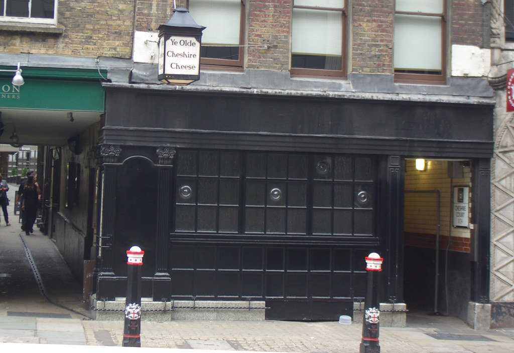
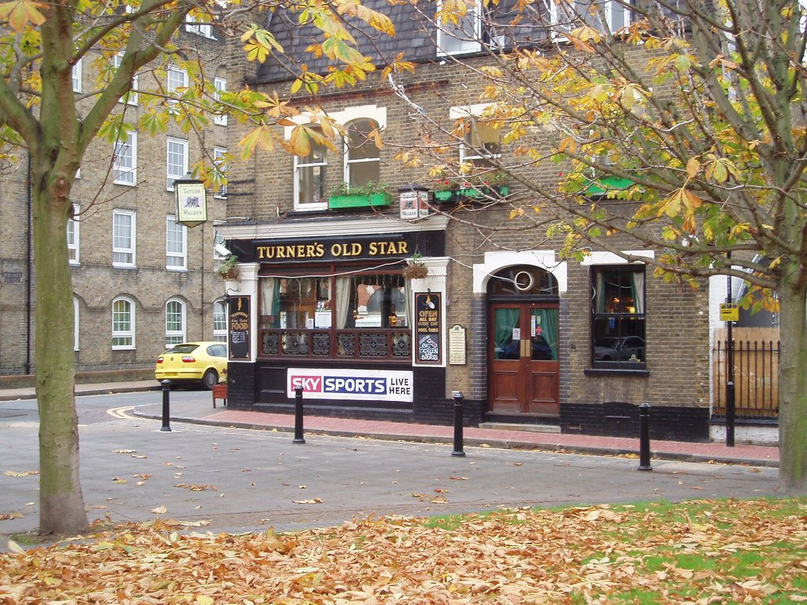
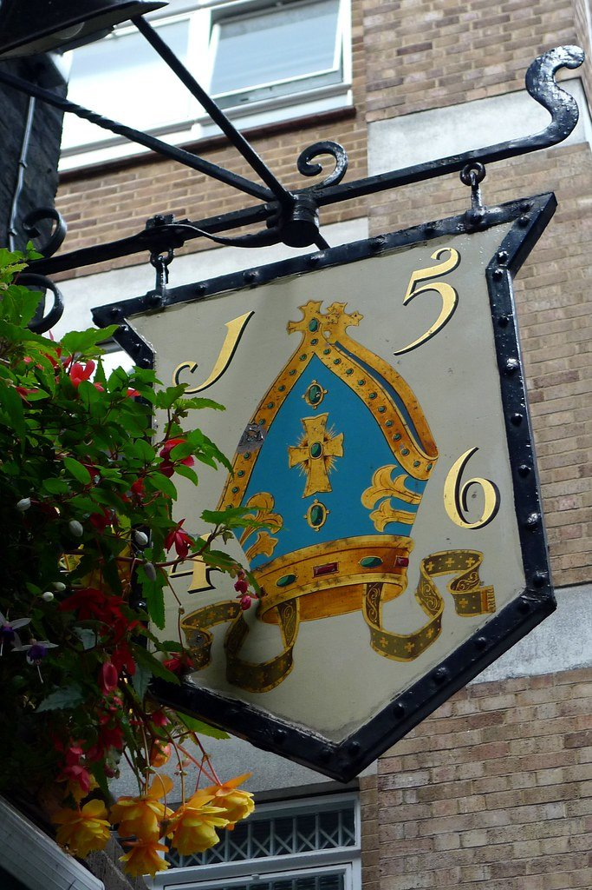

London's oldest rooms are not museums and mostly do not charge for entry. You can sit in a 1667 cellar off Fleet Street, a Thames pub that has traded for five centuries, or a 1913 banking hall, and the price of admission is a pint.

This is a guide to the **rooms worth going to for the room** — pubs, mostly, plus a handful of restaurants where the building does as much work as the kitchen.

> 💡 **The Short Version:** **Ye Olde Cheshire Cheese** is the one to see if you only see one — a warren of dark cellars rebuilt in 1667. **The Grapes** in Limehouse is Dickens's pub and Ian McKellen part-owns it. **The Town of Ramsgate** has had a pub on the site since 1545. **The Crosse Keys** is a Wetherspoons inside a 1913 banking hall. And **The Cinnamon Club** is the old Westminster Library with the shelves still up.

> 📊 **The evidence behind this guide**
> Nothing here is ranked on one visit. This pass reads **7 sources carrying 76 citations** across **45 named pubs and rooms**. **15 pubs and rooms are named by two or more independent sources.**
> **Built on:** the specialists — six of the seven publications are independent blogs and tour writers, which for this subject are the people who check the dates.
> *Evidence rebuilt 30 August 2026 · [How we rank →](/how-we-rank/)*

## Where they are

  

    Map of the historic pubs and dining rooms in London
  

  

    
Loading the interactive map…

  

  <noscript>
    
The interactive map requires JavaScript. Every entry below lists its area.

  </noscript>

| If you are near… | Where to go |
| --- | --- |
| **Fleet Street & the City** | Ye Olde Cheshire Cheese, The Crosse Keys |
| **Liverpool Street** | Hamilton Hall |
| **Wapping & Limehouse** | The Town of Ramsgate, The Captain Kidd, Turner's Old Star, The Grapes, The Prospect of Whitby |
| **Hampstead** | The Holly Bush |
| **Richmond** | The White Cross |
| **Westminster** | The Cinnamon Club |
| **Clerkenwell** | Sessions Arts Club |
| **Canary Wharf** | The Ledger Building |
| **Chelsea & Barnes** | The Fox & Pheasant, The Bull's Head |

---

## The oldest claims

### Ye Olde Cheshire Cheese, City of London

*££ · off Fleet Street · rebuilt 1667* · Cited by 3 sources

Rebuilt in **1667, immediately after the Great Fire**, down an alley off Fleet Street. A warren of dark panelled rooms and cellars on several levels, with sawdust still on some floors.

The single most atmospheric room on this page, and the easiest to walk past — the entrance is a gap in the buildings rather than a frontage.

**The food is old-school chophouse** — steak and kidney pudding, pies and a Sunday roast — under Sam Smith's ownership, which means cheap drink and **cash preferred, no music and no phones**. Walk-in; the warren of cellars means there is usually a room free even when the front bar is full.

*Rebuilt in 1667 after the Great Fire. A warren of dark rooms down an alley, and Dickens drank here. Photo: [Adam Bruderer](https://www.flickr.com/photos/50191609@N00/9622652945), [CC BY 2.0](https://creativecommons.org/licenses/by/2.0/).*

### The Town of Ramsgate, Wapping

*££ · a pub here since at least 1545*

**A pub on this spot since at least 1545** — long, narrow and dark, opening onto a small river terrace beside **Wapping Old Stairs and Execution Dock**, where pirates were hanged and left through three tides.

The cellar was reputedly used to hold convicts before transportation to Australia, and Judge Jeffreys was caught here trying to flee the country disguised as a sailor. The pub trades on none of it — there is no museum-ing, just a narrow bar and a good pint.

**££, walk-in.** Standard pub food rather than a dining room. **The river terrace is tiny and the reason to come** — go in daylight and at low tide, when the foreshore is walkable.

### The Grapes, Limehouse

*££ · 76 Narrow Street · roughly five centuries* · Cited by 3 sources

**A narrow Thames-side pub trading for roughly five centuries**, **part-owned by Sir Ian McKellen** — with the director Sean Mathias and Evgeny Lebedev. **Dickens drank here and put it into *Our Mutual Friend*** as the Six Jolly Fellowship Porters.

Pub food downstairs and a small dining room above it doing a fuller menu, with fish the thing to order given where you are sitting. There is a McKellen-donated Gandalf staff behind the bar, which is the one concession to the ownership.

**££, and book a few days ahead for the dining room. Tiny — the back balcony over the river seats very few and fills early**, so ask for it when you book or arrive before six.

### The Prospect of Whitby, Wapping

*££ · a Thames terrace* · Cited by 3 sources

**London's oldest riverside pub, trading since around 1520** — first as The Pelican, then as the Devil's Tavern, a name it earned honestly. **The 400-year-old stone floor is still there.**

Pepys and Dickens both drank here; Turner sketched from it. There is a noose hanging over the river terrace in reference to Execution Dock a few hundred yards along, which is either atmospheric or heavy-handed depending on the day.

**££, walk-in. Come for the building and the river, not the cooking** — the food is standard pub fare. **The Thames-facing terrace is the reason to time a visit for daylight.**

---

## Riverside

### The White Cross, Richmond

*££ · the towpath*

**On the towpath where the river regularly comes over the road and floods the entrance** — **there are tide tables on the wall and wellingtons by the door**, which is not a gimmick.

When the tide is high the pub is cut off and the staff hand out boots to anyone determined to leave. The rest of the time it is a straightforward, well-run Richmond pub with a garden running down to the Thames and one of the best river views in London.

**££, walk-in.** Standard pub food. **Check the tide tables before you plan to leave** — that is the entire character of the place.

### The Captain Kidd, Wapping

*££ · the biggest river terrace in Wapping*

**A converted warehouse laid out like a ship's hull**, named for the pirate hanged a few yards away at Execution Dock in 1701 — **and it has the biggest river terrace in Wapping.**

Tall, narrow and built over several floors with exposed beams and small windows onto the Thames. It is a modern conversion rather than a genuinely ancient pub, which is worth knowing — the building is old, the pub is not.

**££, walk-in.** Pub food and a Sam Smith's price list, which is the cheapest drink on this page. The terrace is the reason to come and it fills the moment the sun does.

### Turner's Old Star, Wapping

*£ · a back-street local*

**An 1830 back-street local that JMW Turner is said to have owned and run for a mistress** — and **the last plain, unrenovated pub left in Wapping**, which after the warehouse conversions around it is the whole point.

No river view, no terrace, no dining room: two small bars, a dartboard and locals. Turner reportedly inherited two cottages and turned them into this pub for Sophia Booth, though the documentation is thinner than the story.

**£, walk-in.** Come for the contrast with the riverside pubs five minutes away — this is what they all looked like before the money arrived.

**There is no kitchen** — crisps and nuts, and that is the honest answer. Come for the pub, eat at one of the riverside places five minutes away. Walk-in, cash-friendly, and cheap.

*Turner supposedly kept a mistress here. A proper backstreet local, off the tourist stretch of Wapping. Photo: [Ewan-M](https://www.flickr.com/photos/55935853@N00/2468561619), [CC BY-SA 2.0](https://creativecommons.org/licenses/by-sa/2.0/).*

---

## Extraordinary buildings, ordinary prices

### The Crosse Keys, City of London

*£ · 9 Gracechurch Street*

**The former headquarters of the Hongkong and Shanghai Banking Corporation, opened 1913** — marble columns, a glass-domed ceiling and a banking hall the length of the room, **at Wetherspoon prices**.

It is the most extravagant building in this guide by some way and the cheapest place in it to eat. The bar runs most of the length of the hall and the ceiling is worth the crick in your neck.

**£. Opens at 08:00 on weekdays for breakfast. Order at the bar or through the app — there is no table service by default and no music**, which is the house style rather than an off day.

**The food is the standard Wetherspoon menu** — burgers, curries, a full cooked breakfast — which is the point: extraordinary room, ordinary plate, and the cheapest bill in this guide.

### Hamilton Hall, Liverpool Street

*£ · the station concourse*

**The former ballroom of the Great Eastern Hotel**, off the Liverpool Street concourse — **gilded plasterwork, chandeliers and cornicing kept intact**, which is not what anyone expects from a station pub.

Grade II listed and reopened after a long refurbishment, with the ballroom decoration modelled on a salon at Versailles. Wetherspoon prices under a ceiling that belongs in a palace.

**£, walk-in. On the station concourse**, which makes it the most useful of these if you are killing time before a train rather than making a trip of it.

**Wetherspoon menu and prices** under the ballroom ceiling: cooked breakfast from 8am, burgers and pub standards after. Order at the bar or by app; there is no table service.

### The Ledger Building, Canary Wharf

*£ · West India Quay*

**An 1800 dock building on West India Quay that once held the West India Docks ledgers** — a colonnaded front, a quayside terrace, and **by some distance the cheapest place to eat or drink at Canary Wharf.**

The building predates every tower around it by nearly two centuries and the contrast from the terrace is the reason to sit outside. Wetherspoon menu and prices inside a listed dock office.

**£, walk-in. On West India Quay, a footbridge from the towers and next door to the Museum of London Docklands, which is free** — the two make an easy afternoon. Order at the bar or by app.

---

## Historic dining rooms

Restaurants rather than pubs, where the building is genuinely the reason to book.

### The Cinnamon Club, Westminster

*££££ · 7 min from St James's Park* · Cited by 3 indian sources

The **old Westminster Library**, Grade II listed, with the bookshelves still in place and the gallery still running round the room. Indian cooking, and close enough to Parliament that it fills with MPs and lobbyists whenever the House is sitting.

**This is a full Indian fine-dining room rather than a pub** — Vivek Singh cooking British game and produce with Indian spicing, and a wine list to match. **££££, closed Sunday, and it books weeks ahead.** The breakfast service is a genuine oddity worth knowing about.

### Sessions Arts Club, Clerkenwell

*££££ · a former courthouse*

**A crumbling former courthouse left deliberately unrestored** — peeling plaster, enormous windows, and no attempt whatsoever to make it look finished. The most striking dining room in London and it is not close.

The room is on the top floor of the old Clerkenwell Sessions House, reached by a lift, with twenty-foot ceilings and walls stripped back to bare plaster. The cooking is short, seasonal and European, and good enough not to be embarrassed by the setting.

**££££ and it books months ahead.** Ask for a table by the windows. The bar takes walk-ins earlier in the evening.

**The cooking is short, seasonal and European** — whole fish, slow-cooked meat and vegetable dishes that change constantly — and good enough not to be embarrassed by the room. **££££, books months ahead**; the bar takes walk-ins earlier in the evening.

### Ye Olde Cheshire Cheese and the pub dining rooms

Most of the pubs above serve food that is fine rather than the point — you are paying for the building, and the kitchen knows it. Three are the exception.

**The Holly Bush**, Hampstead — an 1807 pub up an alley off Heath Street with panelled rooms, open fires and **one of the better Sunday roasts in north London**. Book for Sunday. · Cited by 3 sources

**Ye Olde Cheshire Cheese** keeps a genuine chophouse menu — **steak and kidney pudding** and pies, under Sam Smith's ownership, so cash preferred and no music.

**The Seven Stars** in Holborn cooks a short changing menu out of a galley behind the bar that is materially better than anything else on this page, in fewer than thirty seats.

---

## The listed interiors

Age is the wrong measure for several of London's best pubs. These are protected for what is inside them.

### The Blackfriar, Blackfriars

*££ · 174 Queen Victoria Street · Grade II\** · Cited by 2 sources

**The finest surviving Arts and Crafts pub interior in Britain**, and the highest-listed pub on this page after The George.

Built around 1875 and remodelled in 1905 and 1917 by H. Fuller Clark with sculptors Frederick Callcott and Henry Poole: variegated marble, brass, mosaic, copper reliefs and bronze friars, wrapped round a wedge-shaped corner site. The Dominican friary that stood here is the source of the theme, not of the pub.

**It was saved from demolition by a campaign led by John Betjeman**, which is most of why it is still standing. Note it is Grade II*, not Grade II — its own marketing undersells it.

**Standard pub food** — pies, fish and chips, a Sunday roast — which is not why anyone comes. Walk-in, and go mid-afternoon on a weekday when the City crowd has gone and you can actually look at the carvings.

### The George, Southwark

*££ · 75–77 Borough High Street · Grade I* · Cited by 2 sources

**London's last galleried coaching inn**, and per CAMRA the only purpose-built pub in the city listed **Grade I**.

The current building dates precisely to **1676–77**, put up immediately after the Southwark Fire destroyed its predecessor — which makes it the only pub in this guide whose age is beyond argument. What survives is one range of what once enclosed three sides of the courtyard; two tiers of galleries remain on the west half, the lower on cantilevered beams, the upper on wooden Doric columns.

**Owned by the National Trust since 1937** and operated under lease by Greene King. Dickens knew it and put it in *Little Dorrit*.

**Pub food and a Sunday roast**, served in the galleried bars and the courtyard. Walk-in. **Owned by the National Trust and the last galleried coaching inn in London** — the courtyard is the thing to see, and it is at its best on a summer evening.

### The Guinea, Mayfair

*£££ · 30–32 Bruton Place · CAMRA three-star interior* · Cited by 2 sources

A Mayfair mews pub with **an interior CAMRA rates three-star — of outstanding national historic importance**, the highest rating of any pub here. It is not statutorily listed at all, which is a good illustration of how little the two systems overlap.

Rebuilt in 1741 and licensed in 1754. The Guinea Grill behind it opened in **1952** and claims to be London's original steakhouse; the pies have won awards and the beef is the reason Mayfair keeps coming back.

### The Viaduct Tavern, Holborn

*££ · 126 Newgate Street · Grade II* · Cited by 2 sources

One of the best-surviving **Victorian gin palaces** in London — etched and gilded glass, three pre-Raphaelite-style painted panels, and a rare surviving cashier's booth. Built 1874–75 and remodelled by Arthur Dixon around 1900.

> ⚠️ **Currently closed, reopening 3 September 2026.** Closed Sundays thereafter.

The cellars are widely sold as Newgate Prison cells. Newgate did stand across the road, but the evidence points to these being storage cellars — and the pub's own site makes no such claim.

**Standard pub food** — pies, burgers, a roast on Sunday. Walk-in. **Ask at the bar to see the cellars**, said to be old Newgate holding cells; they will usually take you down if it is quiet.

### Ye Olde Mitre, Holborn

*££ · 1 Ely Court · closed Sundays* · Cited by 3 sources

Hidden up an alley off Ely Place, a private road that was legally part of Cambridgeshire — which is the genuinely interesting thing about it, along with the preserved cherry tree trunk in the front bar.

A Fuller's pub, and **food is bar snacks and toasties only**, so come for a pint rather than dinner. Closed Sundays.

*The sign in Ely Court, carrying the mitre and the 1546 date. It is the only thing marking the alley, and easy to walk past twice. Photo: [Ewan-M](https://www.flickr.com/photos/55935853@N00/4224779897), [CC BY-SA 2.0](https://creativecommons.org/licenses/by-sa/2.0/).*

### The Seven Stars, Holborn

*££ · 53 Carey Street · no reservations* · Cited by 5 sources

Behind the Royal Courts of Justice, tiny, and with **the best food of any pub in this section** — a blackboard menu that changes daily and no reservations.

Grade II listed, partly timber-framed under painted brick, with a jettied bay that may once have been a separate building.

**The kitchen is better than the room suggests** — a short, changing menu of proper cooking rather than pub standards, from a tiny galley behind the bar. Walk-in, and it is very small: fewer than thirty seats, and the barristers from the Royal Courts opposite have first claim on them at lunch.

### The Old Bell Tavern, Fleet Street

*££ · 95 Fleet Street · a pie house* · Cited by 2 sources

A seventeenth-century tavern directly behind St Bride's, the printers' and journalists' church, and a survivor of the whole Fleet Street newspaper era. Stained glass and an old wooden staircase remain.

Now a Nicholson's **pie house**, and the food is better than the average heritage pub by some margin.

**Pub food** — pies, fish and chips, a roast on Sunday — in a tavern built by Wren to house the masons rebuilding St Bride's after the Great Fire. Walk-in, and quietest in the late afternoon.

### The Mayflower, Rotherhithe

*££ · 117 Rotherhithe Street · river terrace* · Cited by 4 sources

The Pilgrims' ship sailed from **the landing steps next door** in 1620, and the mooring point is still visible at low tide from the pub's small river terrace.

Be clear about what the building is: put up around 1780 as the Shippe Inn, bomb-damaged in the war, and given its Tudor-style interior in a **1957 refurbishment** — when it took the Mayflower name. A well-executed antiquarian reconstruction rather than surviving 17th-century fabric, and none the worse for it.

**Pub food with a strong pie list and a Sunday roast**, eaten on a jetty terrace built out over the Thames. Walk-in, though the terrace fills fast. **It still sells British and American postage stamps**, a licence held since the crew of the Mayflower sailed from the steps outside.

### The Spaniards Inn, Hampstead

*££ · Spaniards Road · by the Heath* · Cited by 3 sources

A seventeenth-century brick and weatherboarded inn on the edge of Hampstead Heath, with the old toll house opposite still narrowing the road to a single lane.

The Dick Turpin stories attached to it are folklore — he was born in Essex and died in York, and nothing places him here.

**Proper pub food and one of the better Sunday roasts in north London**, in a 1585 inn with a garden that is the reason to come in summer. Walk-in, but **book for Sunday** — it is the obvious end point for a Hampstead Heath walk and the whole of north London knows it.

---

## What those dates on the signs actually mean

Almost every old London pub advertises a founding year, and **almost none of those years survives contact with the record**. It is worth knowing which is which before you plan a day around one.

| The pub claims | What is documented |
| --- | --- |
| **The Guinea**, 1423 | Rebuilt 1741, licensed 1754. CAMRA calls the old date "highly unlikely" — and gives it as 1473, where the pub says 1423 |
| **Ye Olde Mitre**, 1546 | The building is from about 1773. A 227-year gap |
| **The Spaniards Inn**, 1585 | Building is 17th century; the earliest hard record is a licence granted in 1721 |
| **The Seven Stars**, 1602 | Historic England says "perhaps... dated 1602"; the fabric is probably 1680s, and maps show fields on the site until about 1700 |
| **The Mayflower**, 1620 implied | 1620 is when the ship sailed. The building is about 1780 and the interior is from 1957 |
| **The George**, 1676 | **1676–77, documented.** The only one beyond argument |
| **The Old Bell**, "built by Wren" | 17th century, undated. The Wren attribution is traditional |
| **The Viaduct Tavern**, 1869 | Built 1874–75. 1869 is when the viaduct opened, not the pub |
| **The Blackfriar**, c.1875 | c.1875. Makes no inflated claim, and is the best interior of the lot |

**The pattern is consistent: every pre-1676 claim on this page is traditional rather than evidenced.** Not one is supported by documentary proof of a business trading continuously from the year on the sign.

If you want a defensible answer to "which is oldest": **The Seven Stars** has the best case, because Historic England itself records the 1602 date in the official listing rather than leaving it to the pub — but even that entry hedges, and the building you stand in is probably eighty years younger. **The George is the oldest whose date nobody disputes.**

---

## What to know

* **"Oldest pub in London" is unprovable.** Several have good claims and none has a decisive one. Enjoy the argument.
* **Wapping is the best concentration** — Town of Ramsgate, Captain Kidd, Prospect of Whitby and Turner's Old Star are within fifteen minutes of each other along the river.
* **Check the tide** if you are going to The White Cross specifically for the flooding.
* **The Grapes is very small.** Go early or midweek.
* **Wetherspoons rules apply** at The Crosse Keys, Hamilton Hall and The Ledger Building — order at the bar or by app, no music, no table service.

Powered by <a target="_blank" rel="sponsored" href="https://www.getyourguide.com/london-l57/">GetYourGuide</a>

---

Powered by <a target="_blank" rel="sponsored" href="https://www.getyourguide.com/london-l57/">GetYourGuide</a>

## Continue planning your London trip

- 🥩 **[The Best Sunday Roast in London](/articles/best-sunday-roast-london/)**
- 🫖 **[The Best Afternoon Tea in London](/articles/best-afternoon-tea-london/)**
- 🎪 **[Unusual Restaurants in London](/articles/unusual-restaurants-london/)**
- 🍽️ **[Eat in London: Restaurants, Food Markets & Quick Food Hub](/articles/eat-in-london-guide/)**
- ⚓ **[Wapping Area Guide](/articles/wapping-area-guide/)**
- 🏙️ **[City of London Area Guide](/articles/city-of-london-area-guide/)**
