A hotel that lists a pool can mean a 25-metre lane under Knightsbridge, a warm vitality pool you float in, or a rooftop that closes for the winter. Every hotel below was checked on its own website for the length, whether hotel guests swim free, and when children are allowed in.

> 💡 **The Short Version:** For a swim above the rooftops, **[art'otel Battersea Power Station](#artotel-london-battersea-power-station)** has a heated rooftop pool on the 16th floor, open all year, and **[The Berkeley](#the-berkeley)**, named by 21 of the 31 sources, more than any other hotel, has a rooftop pool open in spring and summer only. With children, **[The Savoy](#the-savoy)** lets them swim from 9am to 5pm daily and **[London Marriott Hotel County Hall](#london-marriott-hotel-county-hall)** has a 25-metre pool free to guests. For proper lengths, **[Bulgari](#bulgari-hotel-london)**, **[The Peninsula](#the-peninsula-london)** and **[Mandarin Oriental Mayfair](#mandarin-oriental-mayfair)** each have 25 metres. **Corinthia London is on 11 of the lists, and its spa has vitality pools, not a lap pool.**

> 📊 **The evidence behind this guide.**
> Nothing here is ranked on one stay. This pass reads **31 sources carrying 251 citations** across **61 named hotels**: the travel and lifestyle press (Time Out, Condé Nast Traveller, Tatler, Esquire, The Independent, the Evening Standard, DesignMyNight, Country & Town House), London and hotel specialists (Secret London, The Sauce, The Hotel Guru, The Rooftop Guide), family-travel blogs (Globetotting, Wanderlust Chloe, Flashpacking Family, MummyTravels, A Suffolk Mum), a Mumsnet Talk thread and six YouTube channels. **40 hotels are named by two or more independent sources.** The pool rules on each entry come from the hotel's own website.
> *Evidence rebuilt 29 September 2026 · [How we rank →](/how-we-rank/)*

| Hotel | Pool | Children | Station | The catch |
| --- | --- | --- | --- | --- |
| **The Berkeley** | Rooftop, heated, open-air | Welcome, no set hours | Knightsbridge | Spring and summer only |
| **art'otel Battersea** | Rooftop infinity, 16th floor | Under-16s 6am–noon | Battersea Power Station | Can close for private events |
| **Virgin Hotels Shoreditch** | Rooftop, year-round | 18 and under 7am–3pm | Old Street | Adults 21+ only after 3pm; no reservations |
| **Shangri-La The Shard** | Level 52 infinity pool | 9–11am, 3–5pm | London Bridge | Book a slot; adults 6am–6pm |
| **The Ned** | Rooftop (club) and basement | Rooftop 7–10am | Bank | Rooftop is the members' club; spa free if booked direct |
| **One Aldwych** | 18m, chlorine-free | Set hours daily | Temple | Weekday children's hours break for lunch |
| **The Langham** | 16m, in a bank vault | 8am–noon, 4–6pm | Oxford Circus | No children midday |
| **The Savoy** | Glass-roofed atrium pool | 9am–5pm daily | Charing Cross | Pool shared with treatment guests |
| **Marriott County Hall** | 25m, heated | Supervised | Waterloo | No lifeguard; shared with club members |
| **Park Plaza Westminster Bridge** | 15m | 8am–8pm | Waterloo | Sessions booked only after arrival |
| **Canary Riverside Plaza** | 20m infinity lap pool | 8.30–10.30am | Canary Wharf | Children's window is two hours |
| **The Westin London City** | 12m plus vitality pool | 8–10.30am, 2–4.30pm | Mansion House | A short pool |
| **Bulgari** | 25m, stone-clad | Age 8+, set hours | Knightsbridge | No children under 8 |
| **The Peninsula** | 25m, subterranean | Not published | Hyde Park Corner | About £1,100 a night |
| **Mandarin Oriental Mayfair** | 25m, heated | 18+ unless parent consents | Oxford Circus | Written consent for under-18s |
| **Mandarin Oriental Hyde Park** | 17m, twin-lane | Minimum age 18 | Knightsbridge | Not for a family swim |
| **Pan Pacific** | 18.5m infinity | Set hours | Liverpool Street | City view, not a rooftop |
| **Hotel Café Royal** | 18m lap pool | Ages 5–16, set hours | Piccadilly Circus | Shared with Akasha members |
| **Four Seasons Tower Bridge** | Pool plus vitality pool | 6.30–11am, 2–6pm | Tower Hill | Spa closes at 8pm |
| **Haymarket Hotel** | 18m, underground | Not published | Piccadilly Circus | Also an events venue |
| **The Carlton Tower** | 20m, indoor | Not published | Knightsbridge | Shared with club members |
| **The Marylebone** | 18m, in Third Space | Ages 5–17, set hours | Bond Street | It is a members' gym |
| **The Dilly** | 11.5m by 12.75m | Not published | Piccadilly Circus | Square, not a lap pool |
| **Leonardo Royal St Paul's** | 16.6m | Set hours weekdays | St Paul's | Spa open to non-guests |
| **Novotel Blackfriars** | Indoor, 1.2m deep | Not published | Southwark | Book an hour slot |
| **Town Hall Hotel** | 14m, skylights | Not published | Bethnal Green | A Tube ride from the West End |

## Rooftop and sky-high pools

### The Berkeley

*Knightsbridge · Station: Knightsbridge · Heated rooftop pool, spring and summer only · Cited by 21 sources · [Hotels.com](hotel:the-berkeley)*

The pool is on the roof, heated and open to the sky, looking over the red-brick rooftops of Belgravia to Hyde Park. The hotel's own pool page says it is **exclusively for hotel guests** and sells no day pass, and that it **operates seasonally during spring and summer**. The Berkeley calls it a favourite for sunny family days, and publishes no separate children's hours. A rooftop bar opens in the same months, bookable by outside guests. The hotel is a Maybourne hotel, sister to Claridge's and The Connaught, a short walk from Hyde Park Corner. The one thing that decides a booking: from autumn to early spring there is no rooftop swim, so book around the dates, not the photos.

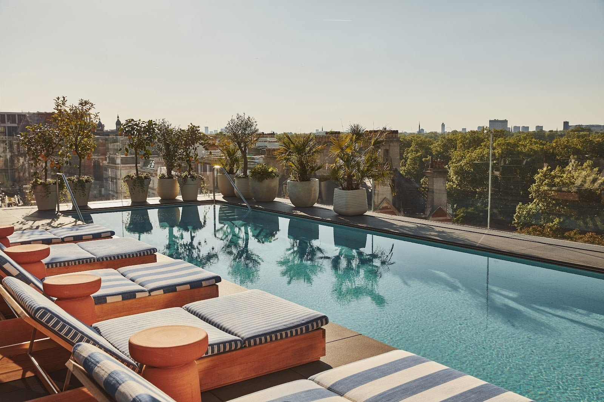

### art'otel London Battersea Power Station

*Battersea · Station: Battersea Power Station · Heated rooftop infinity pool, all year · About £320 a night · Cited by 12 sources · [Hotels.com](hotel:artotel-battersea-power-station)*

The heated infinity pool is on the 16th floor, and you can swim to the edge and sit face to face with the power station's chimneys. It is **open all year**, for hotel guests only, **from 6am to 11pm**, with loungers on a first-come basis. **Under-16s swim from 6am to noon** only. The wellness floor adds a sauna, a steam room and three treatment rooms, and aqua aerobics runs on the roof on Mondays and Tuesdays. The hotel warns the pool can close for private events. The one thing that decides a booking: with children, the afternoon is adults' time, so plan the swim before lunch.

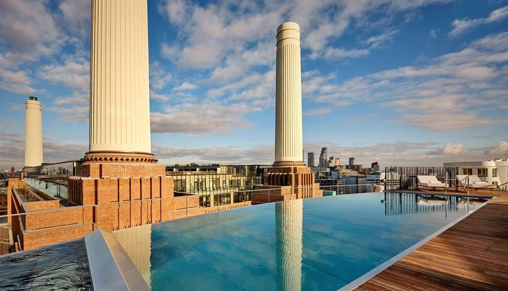

### Virgin Hotels London-Shoreditch

*Shoreditch · Station: Old Street · Rooftop pool on level 7, all year · About £250 a night · Cited by 10 sources · [Hotels.com](hotel:mondrian-shoreditch)*

The rooftop pool on level 7 is **open all year and heated through the winter**, run by Blue Marlin Ibiza with the restaurant beside it, and it is shared between hotel guests and members of the 45 London club. There are **no reservations**: it is first come, first served, and the hotel suggests arriving early when it is busy. **Children and anyone 18 and under swim from 7am to 3pm**; from 3pm to 9pm the pool is **adults aged 21 and over** only. The Sauce, which lists every central hotel pool, notes it is only four feet deep. The building was The Curtain, then Mondrian Shoreditch, before Virgin took it over in 2024. The one thing that decides a booking: it is a pool for a drink in the sun, not for lengths.

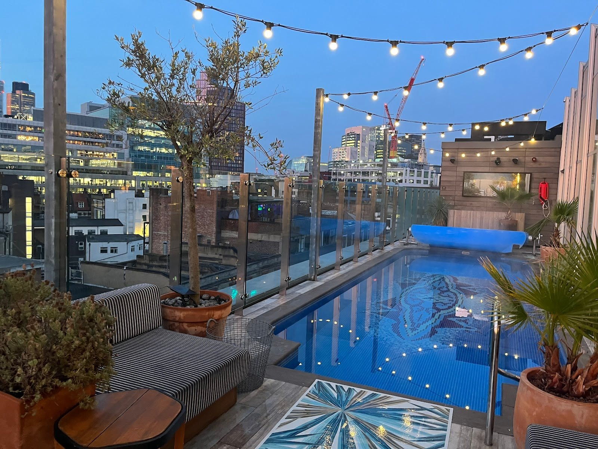

### Shangri-La The Shard

*London Bridge · Station: London Bridge · Infinity Sky Pool on level 52 · About £550 a night · Cited by 16 sources · [Hotels.com](hotel:shangri-la-the-shard)*

The Sky Pool is on **level 52 of The Shard**, the highest swimming pool in London and Western Europe by the hotel's own account, with a sauna and a 24-hour gym alongside. The hotel occupies 18 floors from level 34 up. Swimming is **free for hotel guests but needs a booked slot**, which you can request when you book the room or on arrival. **Adults swim from 6am to 6pm; children from 9 to 11am and 3 to 5pm.** On Wednesday to Saturday evenings the pool area becomes part of GŎNG, the bar on the same floor. The one thing that decides a booking: swimming ends at 6pm, so request a slot with the room.

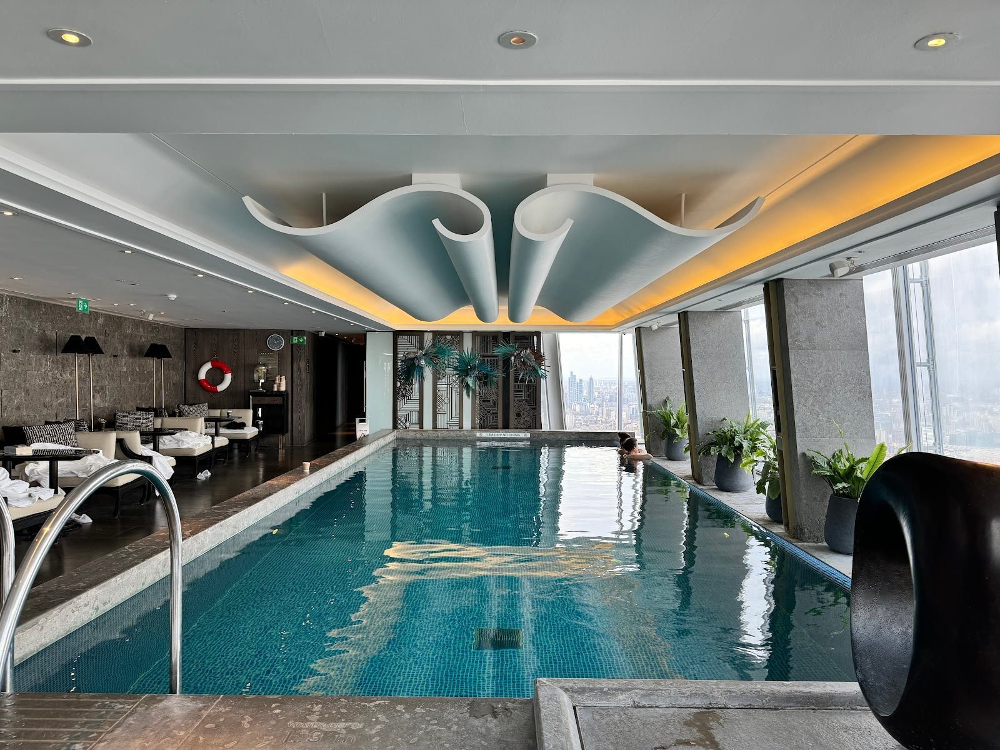

### The Ned

*City of London · Station: Bank · Rooftop club pool and basement spa pool · About £400 a night · Cited by 13 sources · [Hotels.com](hotel:the-ned)*

The Ned has two pools, and the famous one is not simply the hotel's. The heated rooftop pool, overlooking the skyline beside two converted domes, is part of **Ned's Club, for members and their guests over 18**; the hotel's FAQ lets hotel guests bring children up **between 7am and 10am daily**. The basement pool sits in the spa, which is **always adults only** (18 and over), and **hotel guests who book direct get complimentary day spa access** while they stay. Above it are the old banking hall and its restaurants, 250 bedrooms and every room with a double bed. The one thing that decides a booking: book on The Ned's own site if the spa pool matters, and don't count on the rooftop. Our [members' clubs guide](/articles/private-members-clubs-london/) has what Ned's Club costs to join.

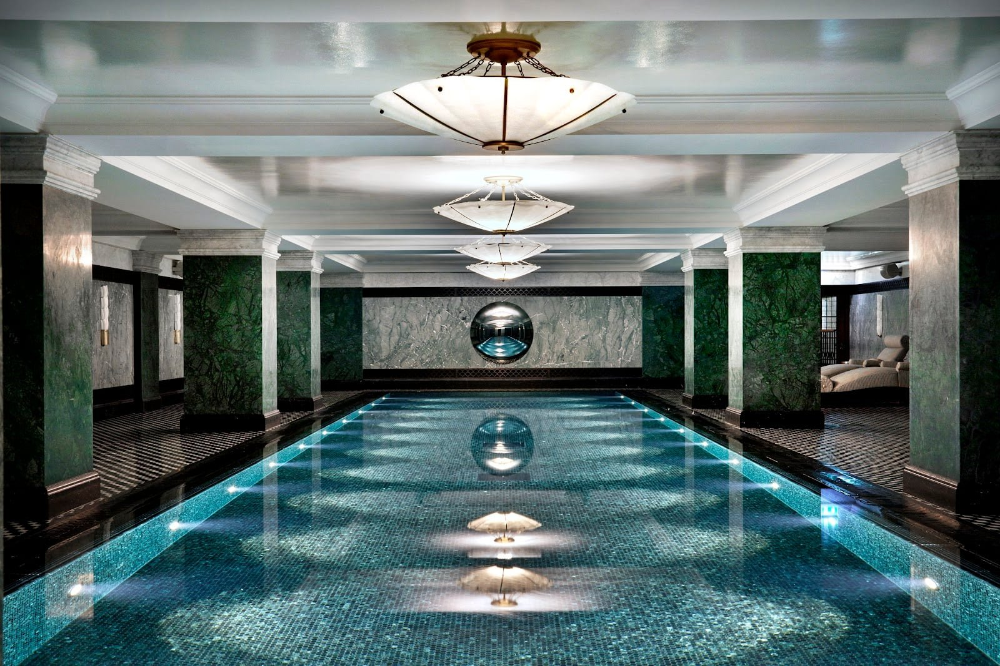

Powered by <a target="_blank" rel="sponsored" href="https://www.getyourguide.com/london-l57/">GetYourGuide</a>

## Pools that welcome children

### One Aldwych

*Covent Garden · Station: Temple · 18m chlorine-free lap pool · Cited by 8 sources · [Hotels.com](hotelscom:141466)*

The 18-metre lap pool is hidden under the hotel and cleaned by a mineral system rather than chlorine, with a steam room and sauna beside it. It opens 6.30am to 9pm on weekdays and 8am to 8pm at weekends. **Children swim on weekdays from 9 to 11.30am and 2 to 5.30pm, and all day from 9am to 5.30pm at weekends and bank holidays.** Health club members share it. Covent Garden, the Strand theatres and Somerset House are a few minutes' walk. The one thing that decides a booking: the weekday children's session breaks between 11.30am and 2pm, which suits a morning swim and an afternoon out.

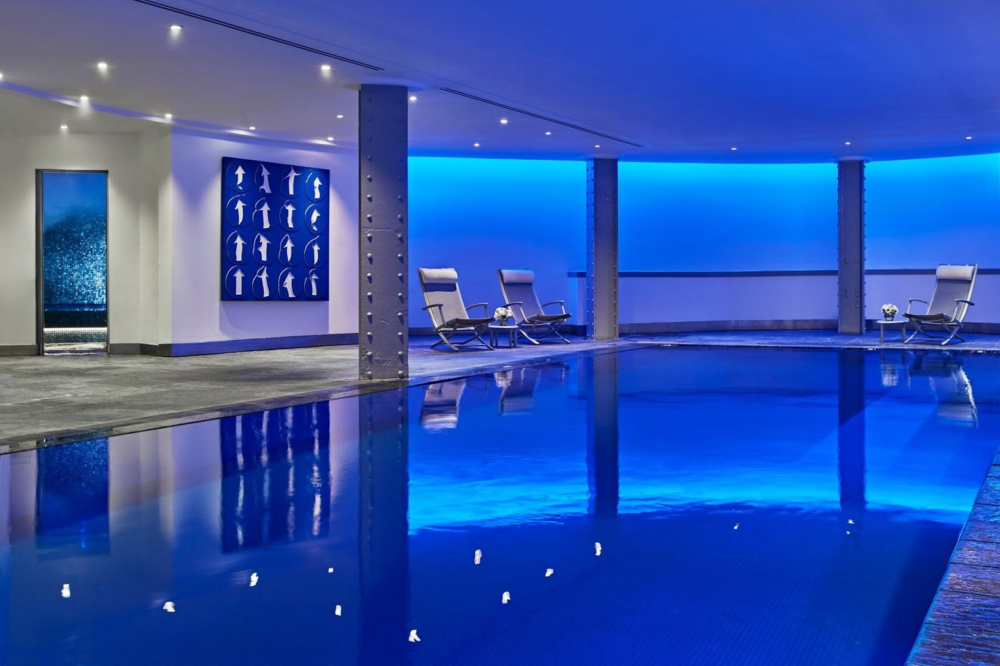

### The Langham

*Marylebone · Station: Oxford Circus · 16m pool in a former bank vault · About £550 a night · Cited by 9 sources · [Hotels.com](hotel:the-langham-london)*

The Langham's 16-metre indoor pool was once a bank vault, and the steam rooms, sauna and contemplation lounge of its Chuan Body + Soul spa sit beside it. It is open **7am to 9pm**. **Under-16s are welcome from 8am to noon and 4 to 6pm with an adult**, but not in the steam rooms or sauna. The hotel opened in 1865 on Portland Place, a few minutes' walk from Oxford Circus and Regent's Park. The one thing that decides a booking: there is no children's swim between noon and 4pm, so the pool fits a morning or a late afternoon.

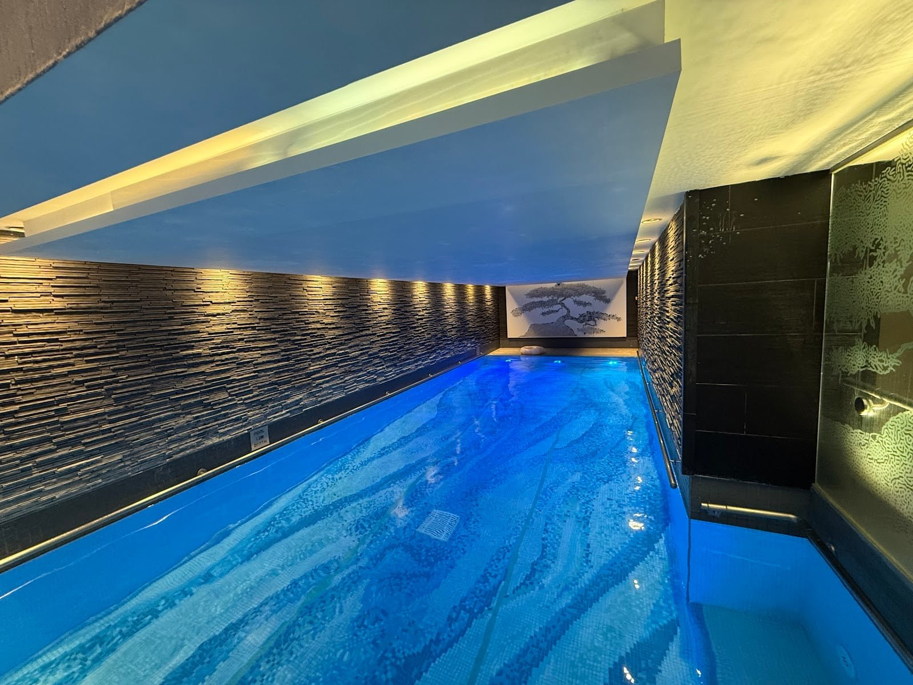

### The Savoy

*Covent Garden · Station: Charing Cross · Heated glass-roofed atrium pool · About £700 a night · Cited by 3 sources · [Hotels.com](hotelscom:172847)*

The heated atrium pool is lit through a glass roof and has a jet-stream to swim against, with a sauna and steam room alongside. **Access is included for every in-house guest**, and for outside guests who have booked a treatment. It opens **7am to 9pm on weekdays and 8am to 8pm at weekends**, and **children swim from 9am to 5pm every day**, weekends included. The Savoy opened in 1889 on the Strand, between Covent Garden and the river, as the first purpose-built deluxe hotel in Britain. The one thing that decides a booking: children can swim through the whole working day, seven days a week.

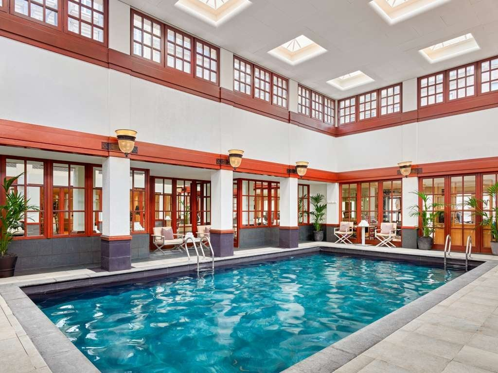

### London Marriott Hotel County Hall

*South Bank · Station: Waterloo · 25m heated indoor pool · Cited by 6 sources · [Hotels.com](hotel:marriott-county-hall)*

The pool is in **The Club at County Hall**, the hotel's own health club: a **25-metre heated indoor pool** with a gym, **free to hotel guests** and open **7am to 9pm**. The club also sells memberships, including a family one, so you share the water with local members. **There is no lifeguard**: children under 16 must be supervised by an adult, and 16 to 18-year-olds can swim alone but cannot supervise younger ones. The hotel is in the old County Hall beside the London Eye, across the river from Big Ben. The one thing that decides a booking: bring a grown-up to the poolside for every child under 16.

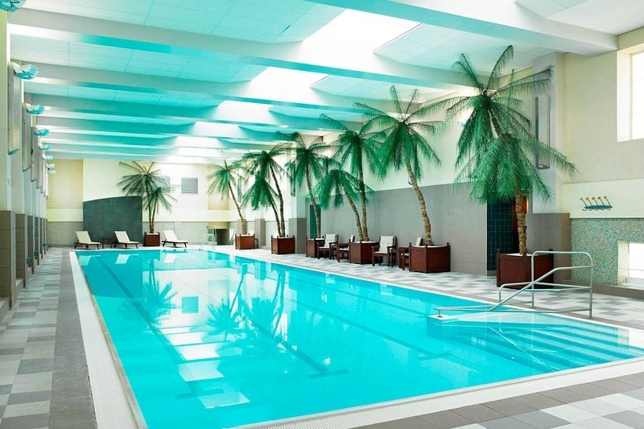

### Park Plaza Westminster Bridge

*South Bank · Station: Waterloo · 15m indoor pool · Cited by 6 sources · [Hotels.com](hotelscom:h3113039)*

The **15-metre indoor pool** is below ground in the Mandara Spa, with a sauna and steam rooms, and it is **open 8am to 8pm for adults and children alike**, with under-16s accompanied. Because it is busy, **swims are booked in sessions, and only once you have arrived**; A Suffolk Mum, who stayed with two children, found it smaller than the hotel's size suggests but big enough to play. Outsiders can buy two hours of the spa for £45. It is a conference hotel for up to 700 people, at the south end of Westminster Bridge, with the London Eye a short walk along the river. The one thing that decides a booking: book the pool session at check-in, not later.

### Canary Riverside Plaza

*Canary Wharf · Station: Canary Wharf · 20m infinity lap pool next door · Cited by 6 sources · [Hotels.com](hotelscom:h519049)*

The pool is in the **adjoining health club, free to hotel guests**: a **20-metre infinity lap pool** with hydrotherapy pools, saunas and steam rooms, open 6am to 9.30pm Monday to Thursday, to 8.30pm on Fridays and 8am to 7.30pm at weekends. **Children under 16 may swim daily from 8.30 to 10.30am.** Rooms start at 37 square metres, with Thames or skyline views, and the hotel is now part of IHG's Vignette Collection. The one thing that decides a booking: the children's window is two hours in the morning, and nothing after.

### The Westin London City

*City of London · Station: Mansion House · 12m pool and vitality pool · Cited by 4 sources · [Hotels.com](hotelscom:2217694656)*

The Heavenly Spa has a **12-metre swimming pool and a vitality pool**, **complimentary to hotel guests** and open 8am to 8pm. **Children under 16 swim from 8 to 10.30am and 2 to 4.30pm**, always with an adult, and cannot use the fitness studio. The hotel is on Upper Thames Street, beside the Thames path and a few minutes from St Paul's Cathedral, with the Millennium Bridge across to Tate Modern. The one thing that decides a booking: at 12 metres it is a pool to play in, not a lap pool.

Powered by <a target="_blank" rel="sponsored" href="https://www.getyourguide.com/london-l57/">GetYourGuide</a>

## Spa pools, mostly for adults

### Bulgari Hotel London

*Knightsbridge · Station: Knightsbridge · 25m pool and vitality pool · Cited by 5 sources · [Hotels.com](hotelscom:402984)*

The **25-metre pool** is lined with colonnades, loungers and cabanas, clad in the Vicenza stone the hotel calls the signature of great Italian architecture, with a vitality pool of massage jets beside it. It is open **7.30am to 8pm every day**. **Children aged 8 and over can swim from 8 to 10am and 4 to 6pm**; younger children cannot. Harrods is a few minutes' walk along Knightsbridge. The one thing that decides a booking: no children under 8, and older ones only in two two-hour sessions a day.

### The Peninsula London

*Belgravia · Station: Hyde Park Corner · 25m heated subterranean pool · About £1,100 a night · Cited by 3 sources · [Hotels.com](hotel:the-peninsula-london)*

The **25-metre heated pool** fills an underground chamber lined with mosaic landscapes, under light panels that change through the day to imitate sunlight, and it has underwater speakers, poolside loungers and all-day poolside dining. It is open to **hotel guests from 7am to 9pm**. The hotel has 190 rooms by Peter Marino, many looking over Hyde Park Corner and Wellington Arch. The one thing that decides a booking: the price, at about £1,100 a night, and the hotel publishes no children's pool times.

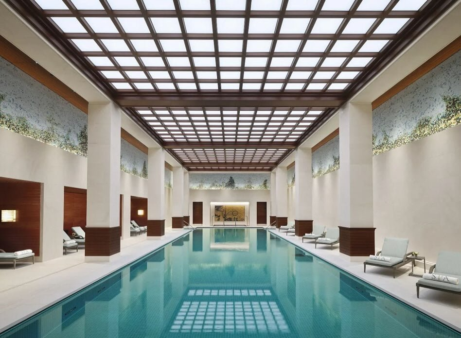

### Mandarin Oriental Mayfair

*Mayfair · Station: Oxford Circus · 25m heated indoor pool · About £850 a night · Cited by 2 sources · [Hotels.com](hotel:mandarin-oriental-mayfair)*

The **25-metre heated indoor pool** comes with vitality pools, a sauna, a steam room and an experience shower, and **in-house guests use the pool, sauna, steam room and fitness centre free**. The hotel is on Hanover Square, a few minutes from Oxford Circus and Bond Street. **The minimum age for the spa and fitness centre is 18 without written consent from a parent or guardian**, and the hotel asks families to contact the spa about children. The one thing that decides a booking: with children, arrange consent before the trip, not at the poolside.

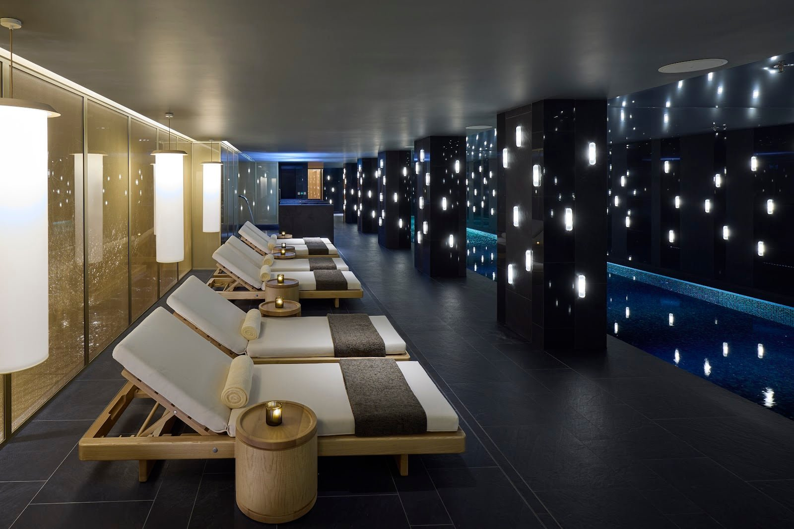

### Mandarin Oriental Hyde Park

*Knightsbridge · Station: Knightsbridge · 17m twin-lane pool · Cited by 5 sources · [Hotels.com](hotel:mandarin-oriental-hyde-park)*

The **17-metre twin-lane pool** is stainless steel, with a lap timer, for **hotel guests and Bodyspace members**, next to a spa with an amethyst crystal steam room and a vitality pool. **The minimum age for the spa and fitness centre is 18**, and the hotel refers families to the spa for children's services. Hyde Park is across the road, and Harrods a short walk. The one thing that decides a booking: this is a pool for adults doing lengths, not for a family afternoon.

### Pan Pacific London

*City of London · Station: Liverpool Street · 18.5m infinity pool · Cited by 5 sources · [Hotels.com](hotelscom:2162317984)*

The **18.5-metre temperature-controlled infinity pool** looks out over the City from the hotel's Sensory Spa and Wellbeing floor, with saunas and steam rooms in the changing rooms. It opens **6.30am to 9pm**. **Children up to 16 swim on weekdays from 9 to 11am and 3 to 5pm, and at weekends from 7 to 9am and 4 to 6pm**, and there is a spa menu for children aged 5 to 16. In a City A.M. video in June 2026, Ailsa Anderson of Eastern City picked it as her hotel pool. The one thing that decides a booking: the weekend children's sessions start at 7am.

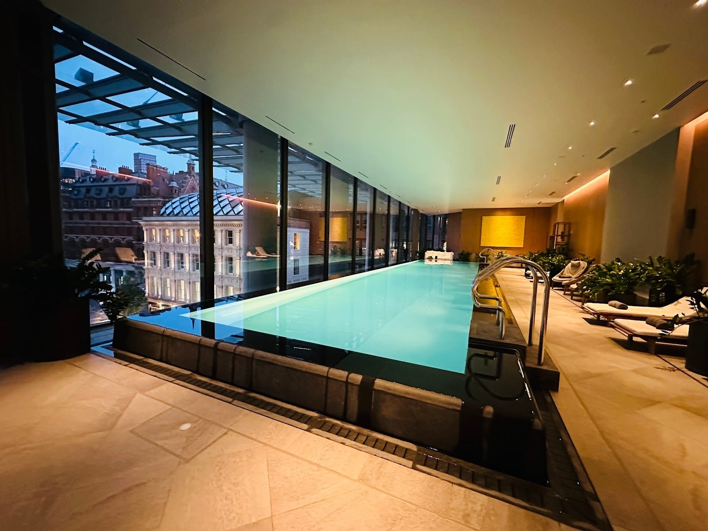

### Hotel Café Royal

*Soho · Station: Piccadilly Circus · 18m lap pool · About £600 a night · Cited by 4 sources · [Hotels.com](hotel:hotel-cafe-royal)*

Akasha Spa, under Regent Street, has an **18-metre lap pool** and a jacuzzi, a marble hammam, a sauna and a separate Watsu pool for water therapy, open **7.15am to 9pm**. It is shared with Akasha's members. **Junior guests aged 5 to 16 swim with an adult on weekdays from 9 to 10.30am and 4 to 5.30pm, and at weekends from 9 to 11am and 4 to 6pm**; the gym is 16 and over. Piccadilly Circus is at the end of the street. The one thing that decides a booking: the weekday children's sessions are 90 minutes each.

### Four Seasons Hotel London at Tower Bridge

*City of London · Station: Tower Hill · Indoor pool and vitality pool · Cited by 4 sources · [Hotels.com](hotel:four-seasons-tower-bridge)*

The spa's indoor swimming pool and vitality pool sit inside a restored landmark building on Trinity Square, with a hammam, sauna and steam rooms. Hotel guests use the facilities from **6.30am to 8pm**, and **children's pool hours are 6.30 to 11am and 2 to 6pm**. Two guests can hire the whole pool privately from 8 to 10pm, with champagne. The Tower of London is across the road. The one thing that decides a booking: children can swim through most of the morning and afternoon, but the spa closes at 8pm.

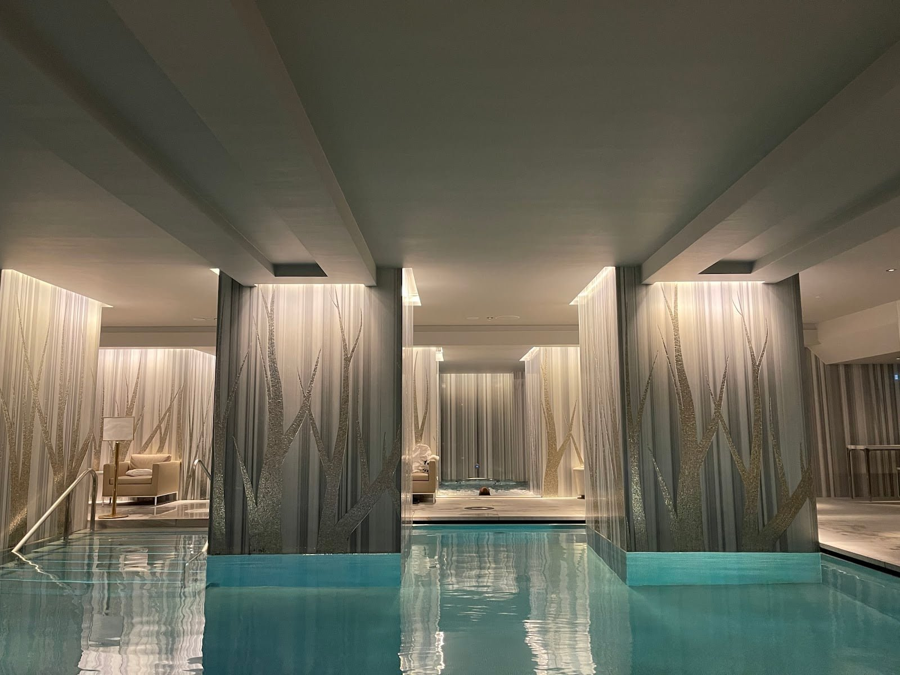

### Haymarket Hotel

*West End · Station: Piccadilly Circus · 18m underground pool · Cited by 5 sources · [Hotels.com](hotelscom:254265)*

The **18-metre pool** is underground, overlooked by a pewter bar, and **in-house guests have full access** to it. It is a Firmdale hotel, decorated by Kit Kemp, next door to the Theatre Royal Haymarket and five minutes from Trafalgar Square and Leicester Square. The pool doubles as one of the hotel's event spaces, and outside guests can book a swim with lunch in the restaurant upstairs. The one thing that decides a booking: it suits a swim between a matinee and dinner, with the theatre next door.

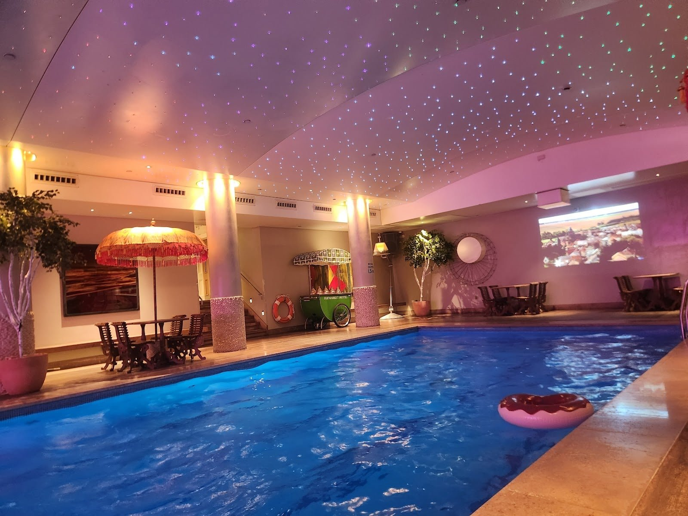

### The Carlton Tower Jumeirah

*Knightsbridge · Station: Knightsbridge · 20m indoor pool · Cited by 4 sources · [Hotels.com](hotel:jumeirah-carlton-tower)*

The **20-metre indoor pool** and jacuzzi belong to The Peak Fitness Club and Spa, with a Himalayan salt sauna, a steam room and five treatment rooms. The club serves hotel guests and outside members together. The hotel is on Cadogan Place, between Sloane Street and Knightsbridge. The one thing that decides a booking: the pool is shared with a members' club, so expect company at the usual gym hours.

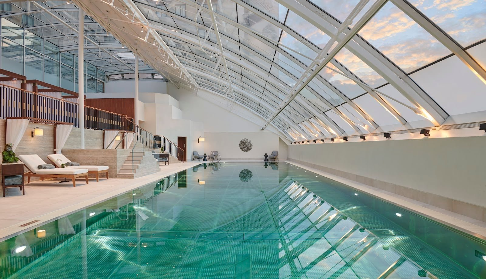

### The Marylebone

*Marylebone · Station: Bond Street · 18m pool at Third Space · Cited by 2 sources · [Hotels.com](hotelscom:120639)*

Hotel guests get **complimentary access to Third Space**, the members' health club in the building, with an **18-metre pool**, a sauna and a steam room. **Children aged 5 to 17 can swim from 10am to noon and 3 to 5pm with an adult**; nobody under 18 may use the gym. Marylebone High Street is round the corner and Bond Street station a few minutes away. The one thing that decides a booking: you share the pool with Third Space's own members.

## Pools away from the grand hotels

### The Dilly

*Piccadilly · Station: Piccadilly Circus · 11.5m by 12.75m indoor pool · Cited by 5 sources · [Hotels.com](hotelscom:117617)*

The Health Club under The Dilly has **an indoor pool 11.5 by 12.75 metres and 1.5 metres deep**, with arches over the water and a steam room, and it is **complimentary for hotel guests**, alongside a gym and two squash courts. Local members share it, and swimming lessons are sold on top. The hotel is on Piccadilly itself, a short walk from Piccadilly Circus and Green Park. The one thing that decides a booking: the pool is almost square, which suits play and a slow swim more than lengths.

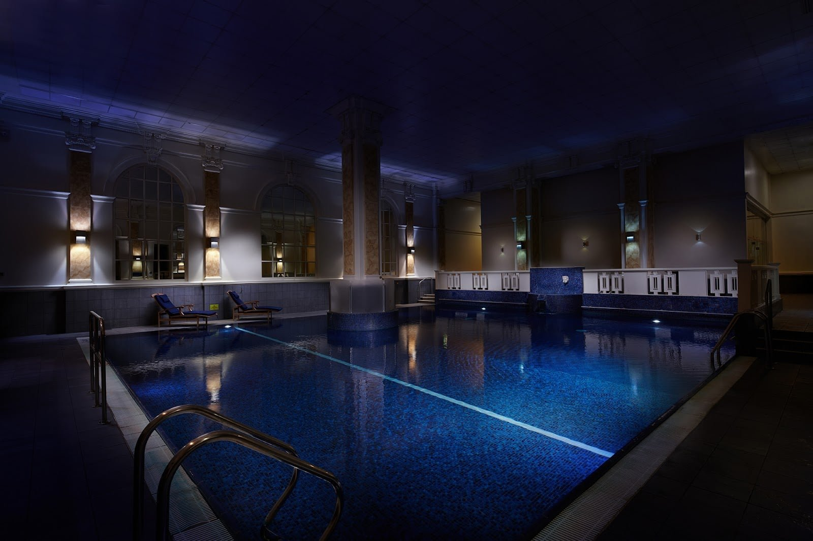

### Leonardo Royal London St Paul's

*City of London · Station: St Paul's · 16.6m heated indoor pool · Cited by 3 sources · [Hotels.com](hotelscom:275564)*

The **16.6-metre heated indoor pool** is in Rena Spa, with a spa pool, a steam room and a sauna, and **guests use the facilities until check-out**. It opens 6.30am to 10pm on weekdays, 7am to 10pm on Saturdays and 7am to 9pm on Sundays. **Children swim on weekdays from 9.30 to 11.30am, 2.30 to 4.30pm and 8 to 10pm, and at any time at weekends.** A Suffolk Mum notes quadruple rooms for a family of four. The one thing that decides a booking: at weekends there are no children's limits at all.

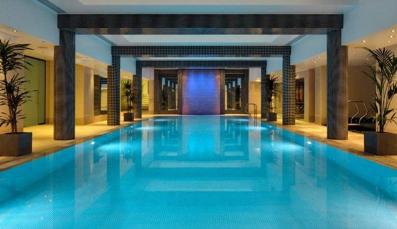

### Novotel London Blackfriars

*Southwark · Station: Southwark · Indoor heated pool, 1.2m deep · Cited by 4 sources · [Hotels.com](hotelscom:421375)*

The **indoor heated pool is 1.2 metres deep and 12 metres wide**, with a whirlpool jet and a combined sauna and steam room called a saunarium. The hotel recommends **booking an hour's slot in advance**. It is on Blackfriars Road near Southwark station, a walk from Tate Modern, the South Bank and, over Blackfriars Bridge, St Paul's. The one thing that decides a booking: the pool runs in hour slots, so book yours when you book the room.

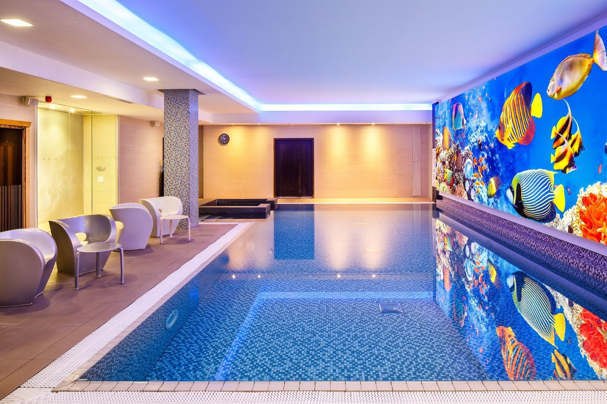

### Town Hall Hotel

*Bethnal Green · Station: Bethnal Green · 14m heated pool · About £220 a night · Cited by 2 sources · [Hotels.com](hotel:town-hall-hotel)*

The **14-metre heated pool** has skylights and loungers and is **open to guests every day**, beside a gym with Peloton bikes. The hotel is a 1910 town hall with its council chamber and marble staircases intact, and some rooms are apartments with kitchens. Dogs are welcome but kept away from the pool. The Central line from Bethnal Green runs direct to Liverpool Street and the West End. The one thing that decides a booking: it is in Bethnal Green, so the West End sights are a Tube ride, not a walk.

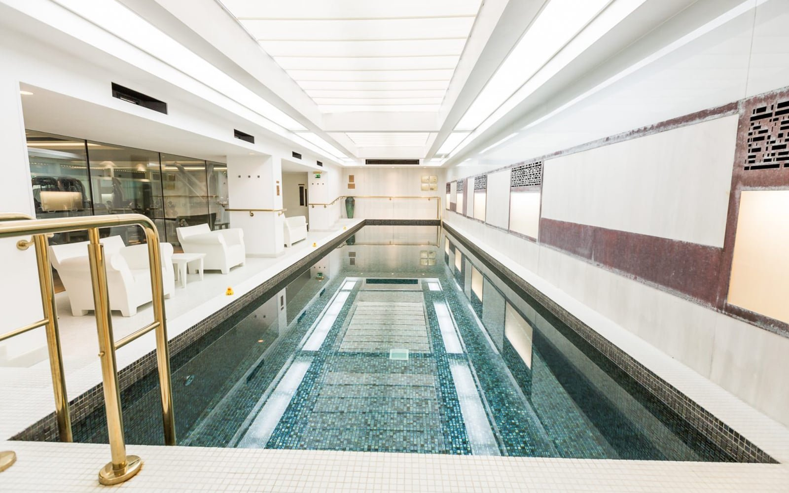

## On the pool lists, but not a swimming pool

### Corinthia London

*Whitehall · Station: Embankment · Two vitality pools and a hydrotherapy pool · Cited by 11 sources · [Hotels.com](hotel:corinthia-london)*

Corinthia is on 11 of the pool lists, and its spa, Biome, has **two vitality pools and a hydrotherapy pool** on a thermal floor, with an amphitheatre sauna, a steam room, an ice fountain and heated marble loungers. The spa's own description is "a gentle swim". It is free to hotel guests at any hour, and **family swimming is 8 to 10am and 4 to 5pm**. The one thing that decides a booking: it is a warm pool to relax in, not a pool for lengths.

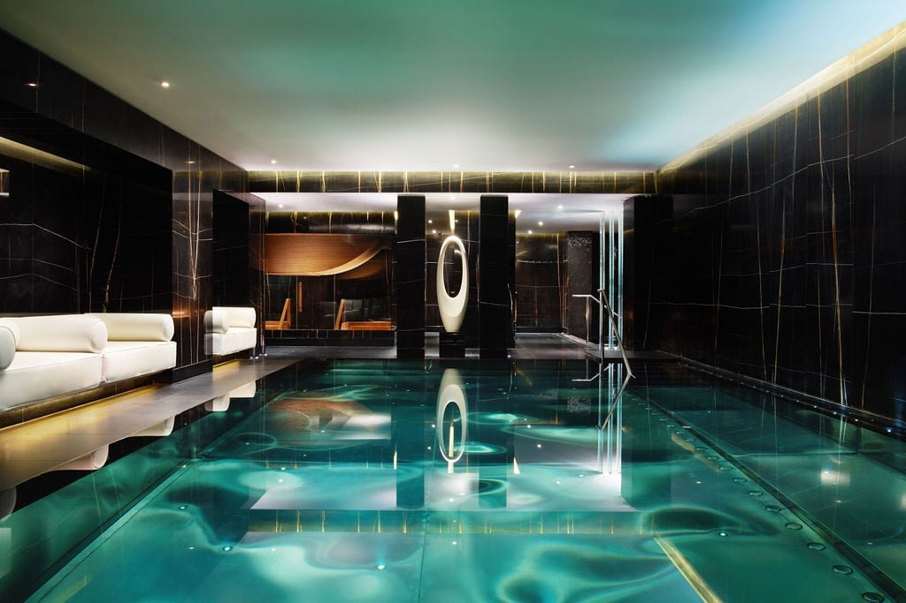

### The Landmark London

*Marylebone · Station: Marylebone · Vitality pool · Cited by 5 sources · [Hotels.com](hotel:the-landmark-london)*

The Landmark's relaunched spa lists its facilities as a Finnish sauna, an aromatic steam room, **a vitality pool**, a 24-hour gym and five treatment rooms, and gives **children's hours of 9 to 11am and 3 to 5pm** within spa hours of 7am to 9.30pm. The hotel faces Marylebone station, and breakfast is served under the palms of its glass-roofed Winter Garden. The one thing that decides a booking: it is a warm pool for a family soak, not for lengths.

### St Pancras London, Autograph Collection

*King's Cross · Station: King's Cross St Pancras · Relaxation pool with hydro loungers · Cited by 5 sources · [Hotels.com](hotelscom:360456)*

The spa, in the Victorian steam kitchens of the old Midland Grand, has a softly lit **relaxation pool with hydro loungers**, which the hotel also calls a hydrotherapy pool, plus a sauna, a steam room and six treatment rooms. Non-residents buy spa day passes of about four hours. The hotel was renamed from St Pancras Renaissance in 2025. The one thing that decides a booking: stay for the building and the Eurostar, not for a swim.

Powered by <a target="_blank" rel="sponsored" href="https://www.getyourguide.com/london-l57/">GetYourGuide</a>

## Before you book

**Seasonal pools.** The Berkeley's rooftop pool operates in spring and summer only. The rooftop pools at art'otel Battersea and Virgin Hotels are open all year.

**Pools you book.** Shangri-La needs a booked slot for the Sky Pool, Park Plaza Westminster Bridge books sessions only after arrival, and Novotel Blackfriars runs hour slots. Virgin Hotels takes no reservations at all.

**Age limits.** Mandarin Oriental Hyde Park's spa and fitness centre are 18 and over; Mandarin Oriental Mayfair's are 18 and over without a parent's written consent. The Ned's spa is 18 and over. Virgin Hotels' pool is adults aged 21 and over from 3pm, and Bulgari admits no children under 8.

**Swimming without staying.** The Berkeley sells no pool day pass. Park Plaza Westminster Bridge sells two hours of its spa for £45, and Corinthia's Spa Experience Pass is £175 on weekdays and £200 at weekends. For a swim anywhere in London without a hotel bill, our [London gyms guide](/articles/best-gyms-london/#where-to-swim) prices the council pools and lidos, from £3.20 a swim.

*Pool sizes, hours and children's times are from each hotel's own website, read on 29 September 2026; hotels change them, so confirm when you book.*

## Continue planning your London trip

- 👨‍👩‍👧 **[Best Family Hotels in London](/articles/best-family-hotels-london/)** - which room sleeps two adults and two children; County Hall, The Berkeley, Mandarin Oriental Hyde Park and Town Hall are there too
- 🧭 **[Best Areas to Stay in London](/articles/best-areas-to-stay-in-london/)** - which part of the city to sleep in before you choose the pool
- 🐕 **[Dog-Friendly Hotels in London](/articles/dog-friendly-hotels-london/)** - The Langham and Mandarin Oriental Hyde Park take dogs too: the fee, the weight limit and where the dog can go
- 🏊 **[Best Gyms in London](/articles/best-gyms-london/)** - day passes, the 50-metre public pools and the lidos
- 🏨 Area stay guides for the hotels above: [Chelsea and Knightsbridge](/articles/where-to-stay-chelsea/), [Mayfair](/articles/where-to-stay-mayfair/), [Marylebone](/articles/where-to-stay-marylebone/), [Covent Garden](/articles/where-to-stay-covent-garden/), [Soho and the West End](/articles/where-to-stay-soho-west-end/), [Westminster](/articles/where-to-stay-westminster/), [South Bank](/articles/where-to-stay-south-bank/), [City of London](/articles/where-to-stay-city-of-london/), [Bermondsey and London Bridge](/articles/where-to-stay-bermondsey/), [Shoreditch](/articles/where-to-stay-shoreditch/), [Canary Wharf](/articles/where-to-stay-canary-wharf/) and [King's Cross](/articles/where-to-stay-kings-cross/)
