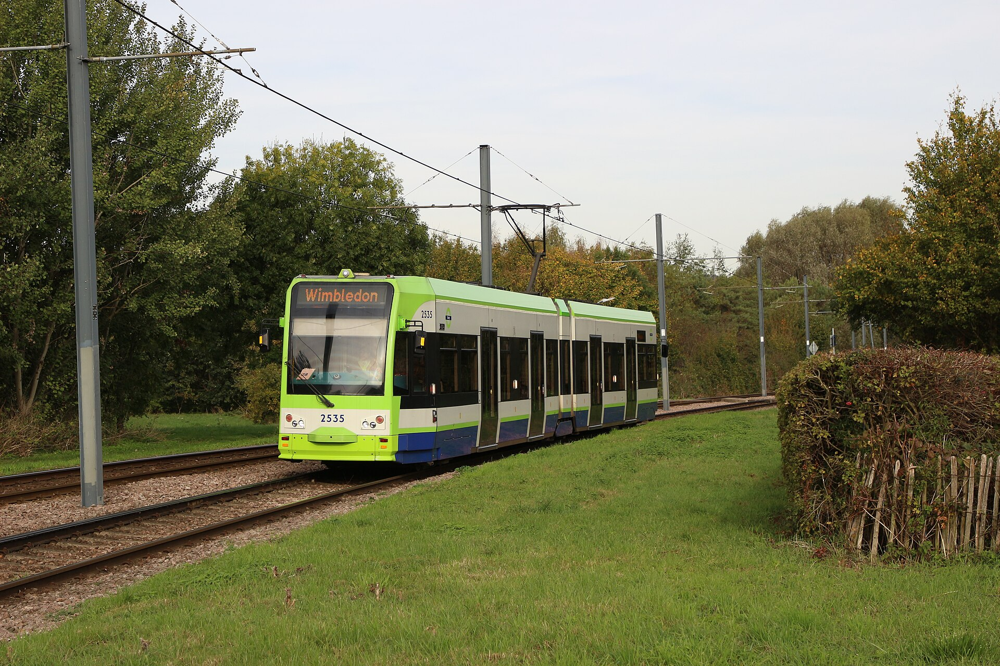

London's iconic red double-decker buses are far more than a scenic attraction—they are the backbone of the city's surface transit network. Buses reach neighbourhoods with no nearby Tube stations, avoid long station walks, and let you experience London at street level for just **£1.75 per ride**.

> 💡 **Bus & Tram Snapshot:**  
> - **Flat Fare:** All London bus and tram journeys cost a flat **£1.75** (no peak rates, no distance zones).  
> - **Touch In ONLY:** Always tap your contactless bank card, phone, or Oyster card ONCE on the yellow reader beside the driver as you board. **Never touch out** when exiting.  
> - **Hopper Fare:** Make unlimited bus and tram transfers within **60 minutes** of your first tap for just **£1.75**.  
> - **100% Cashless:** Drivers do not accept cash. Every passenger must tap their own card or phone.

---

## Bus vs. Underground: Which should you choose?

| Feature | London Bus | London Underground (Tube) |
| --- | --- | --- |
| **Single Adult Fare** | Flat **£1.75** everywhere | **£3.00 – £5.90** *(Zone 1–2)* |
| **Sightseeing & Views** | 🌟 Top deck front seats offer scenic views | Underground in dark tunnels |
| **Speed & Timing** | Subject to road traffic & diversions | High-speed, fixed schedules |
| **Accessibility** | 100% low-floor with wheelchair ramps | ~33% step-free stations |
| **Night Travel** | 24-hour routes & N-prefixed night buses | 24-hour Night Tube *(5 lines, Fri/Sat only)* |
| **Luggage Space** | Limited floor space for large suitcases | Dedicated luggage areas on newer lines |

> 🚀 **When to take the bus:** Choose a bus for short hops (1–4 stops), when travelling with a stroller/wheelchair, when avoiding station stairs, or when taking in the sights. Take the Tube or Elizabeth line when heading to an airport or timed appointment.

---

## 5 Golden rules of riding a London bus

> 🌟 **Golden Rules of London Buses:**  
> 1. **Signal the Driver:** Stand visible at the bus stop flag and extend your arm out to signal the driver to stop.  
> 2. **Touch In Once:** Touch your card or device flat against the yellow reader beside the driver when boarding. Wait for the green light.  
> 3. **Never Touch Out:** Unlike the Tube, touching out on a bus is unnecessary and will confuse the card reader!  
> 4. **Press the Red STOP Button:** When your stop is next, press the red **STOP** button to request the driver to pull over.  
> 5. **Exit Through the Middle Doors:** Exit using the middle doors on double-decker buses so boarding passengers can enter at the front.

---

## How the Hopper Fare works

The **Hopper fare** is TfL's automatic transfer discount system for buses and trams.

* **60-Minute Window:** Board as many TfL buses or trams as you want within **60 minutes** of your first tap, and you will only be charged a total of **£1.75**.
* **Automatic Discount:** Simply tap in on every bus you board. The TfL system recognizes the same card/device and automatically waives the extra £1.75 charges.

### Mixing Buses and the Underground

> ⚠️ **Tube transfers are NOT free:** Taking a bus and the Tube charges two separate fares. The 60-minute Hopper window applies strictly to **bus and tram** transfers.

| Journey Combination | What You Pay |
| --- | --- |
| **Bus ➔ Bus** *(within 60 mins)* | **£1.75** total *(Hopper fare)* |
| **Bus ➔ Tube** | £1.75 bus fare + Underground Tube fare |
| **Bus ➔ Tube ➔ Bus** *(within 60 mins of 1st bus)* | **£1.75** for both buses + Underground Tube fare |
| **Bus ➔ Bus** *(after 60 mins)* | £1.75 + £1.75 = **£3.50** |

---

## The Weekend Hopper trial has ended

> ℹ️ **This offer is over.** To mark ten years of the Hopper fare, TfL ran an
> **unlimited Weekend Hopper** from 25 July to 31 August 2026: a single £1.75
> fare bought a whole Saturday or Sunday of bus and tram travel, so a full
> weekend cost £3.50. It ended at 23:59 on Monday 31 August 2026 and **has not
> been extended or made permanent**. Normal fares apply again — £1.75 a
> journey, £5.25 daily cap, with the sixty-minute Hopper as described above.
>
> It is worth checking TfL nearer next summer. A trial that ran once may run
> again, but nothing has been announced.

---

Powered by <a target="_blank" rel="sponsored" href="https://www.getyourguide.com/london-l57/">GetYourGuide</a>

## Top 4 sightseeing bus routes for visitors

Instead of booking expensive private tours, sit on the top deck at the front window of these iconic regular red TfL bus routes for just **£1.75**:

| Route Number | Useful Sightseeing Section | Key Landmarks Passed |
| --- | --- | --- |
| **[Route 24](https://tfl.gov.uk/bus/route/24/)** | Camden Town ➔ Soho ➔ Victoria | Camden Market, Theatreland, Trafalgar Square, Whitehall, Big Ben, Westminster Abbey, Victoria. |
| **[Route 15](https://tfl.gov.uk/bus/route/15/)** | Trafalgar Square ➔ Tower Hill | Trafalgar Square, Strand, St Paul's Cathedral, Monument, Tower of London, Tower Bridge. |
| **[Route 11](https://tfl.gov.uk/bus/route/11/)** | Waterloo ➔ Fulham | Waterloo, Westminster, Victoria Station, Sloane Square, King's Road Chelsea. |
| **[Superloop](https://tfl.gov.uk/modes/buses/superloop)** | Outer London Express | Rapid express orbital routes bypassing Central London congestion. |

---

## Open-top Hop-On Hop-Off sightseeing buses

If you prefer live or multi-language audio commentary with dedicated stops right outside major attractions (Buckingham Palace, Tower of London, Eye), private open-top **Hop-On Hop-Off Sightseeing Buses** (Big Bus, Tootbus, Golden Tours) offer 24, 48, or 72-hour pass options.

* **Private Tours:** Hop-On Hop-Off buses are private tours, not TfL public buses. They **do not accept Oyster or contactless taps**.
* **River Cruise Included:** Most 24-hour and 48-hour passes include a free Thames river cruise ticket.

---

## How to use London Trams

London Trams operate across South London surrounding **Croydon, Wimbledon, Beckenham Junction, and New Addington**, connecting directly with London Overground and National Rail lines.

*A London Tram in the Croydon area. Photo: [Alex Noble](https://commons.wikimedia.org/wiki/File:20181023-Croydon-Trams-2535.jpg), released under [CC0](https://creativecommons.org/publicdomain/zero/1.0/).*

### Tram Boarding & Fare Rules
1. **Tap on the Platform:** Touch your Oyster or contactless card on the yellow reader at the tram stop **before stepping onto the tram**.
2. **Never Touch Out:** Do not touch out after exiting the tram.
3. **Wimbledon Interchange Rule:** When interchanging at Wimbledon station, touch the dedicated **tram-only reader on Platform 10**.
4. **Fares:** Tram fares match bus fares (£1.75 flat rate) and are included in the 60-minute Hopper. All tram stops feature step-free street-to-tram access.

---

## 8 Common bus & tram mistakes to avoid

1. **Touching out when leaving a bus:** Touching out is unnecessary and can confuse the fare reader!
2. **Waiting at the wrong stop flag letter:** Major stations have multiple bus stops (A, B, C, D) spread across adjacent streets—match the letter flag in your app.
3. **Forgetting to signal the driver:** Drivers will not stop unless you extend your arm to signal.
4. **Using different devices:** Tapping in with a bank card on Bus 1 and Apple Pay on Bus 2 counts as two different cards (charging £1.75 twice).
5. **Trying to pay cash:** London buses have been 100% cashless since 2014.
6. **Pressing the STOP button too late:** Press the red button right after the bus leaves the stop prior to yours.
7. **Forgetting the Wimbledon Platform 10 tap:** When transferring to trams at Wimbledon, tap the platform 10 validator.
8. **Not checking weekend road closures:** Major events (parades, marathons, demonstrations) cause central bus diversions—check live status on **TfL Go**.

---

## Related London Transport Guides

* 🚊 [Getting Around London: Complete Transport Overview](/articles/getting-around-london-transport-guide/)
* 🚇 [How to Use the London Underground](/articles/how-to-use-the-london-underground/)
* 💷 [London Transport Fares and Costs 2026](/articles/london-public-transport-costs-and-fares/)
* 💳 [Oyster Card vs. Contactless Guide](/articles/oyster-card-guide-london/)
* 🚢 [How to Use London River Boats](/articles/how-to-use-london-river-boats/)

---

*Information checked on 2 August 2026. Always verify live bus arrivals and route diversions with [Transport for London](https://tfl.gov.uk/).*
