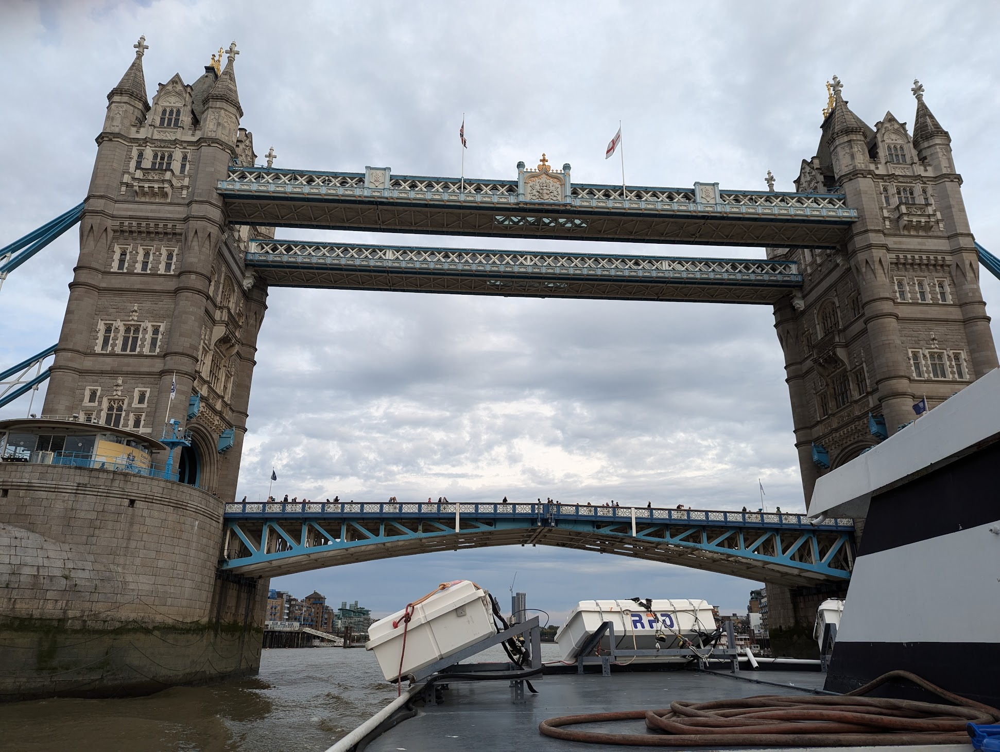

The Thames can be part of London's public-transport network or an attraction in its own right. The important first step is deciding whether you need a scheduled boat that takes you from A to B, a narrated sightseeing cruise, or a pre-booked experience such as a speedboat, lunch cruise or comedy night.

Uber Boat by Thames Clippers is the service most people mean by a London **river taxi**. TfL calls it the River Bus, although it is privately operated and uses a separate fare system.

> **The short version:** use the River Bus for practical, scenic travel between piers; buy a Hop-on Hop-off ticket only if you expect to make several substantial journeys in one day; choose a sightseeing cruise for commentary; and book speedboat, dining and comedy experiences separately. River fares do not count towards TfL daily or weekly caps.

## River Bus, sightseeing cruise or experience?

| Type | Best for | Can it replace another journey? | How you pay |
| --- | --- | --- | --- |
| Uber Boat River Bus | Travelling between west, central and east London while seeing the river | Yes | Oyster, contactless, app, website or pier ticket |
| Hop-on Hop-off River Bus ticket | Several scheduled River Bus journeys in one or two days | Yes | Buy from Uber Boat by Thames Clippers |
| Sightseeing cruise | Commentary and a leisurely tour | Sometimes, if the cruise calls at more than one pier | Buy from the cruise operator |
| Speedboat | A fast ride and entertainment | No; treat it as an attraction | Pre-book with the operator |
| Dining or afternoon-tea cruise | A meal with river views | No | Pre-book with the operator |
| Comedy or themed boat | A timed evening experience | No | Pre-book the event ticket |

Do not assume that a ticket sold for one company can be used with another. An Uber Boat day ticket, for example, does not admit you to City Cruises, Thames Rockets or a special comedy charter.

## How the River Bus works

Uber Boat by Thames Clippers operates scheduled services between piers from Putney in the west to Barking Riverside in the east. Not every service calls at every pier, and the western end has fewer sailings than the central section.

For a normal journey:

1. Use the [Uber Boat journey planner](https://www.thamesclippers.com/plan-your-journey) to find the correct pier, route and departure.
2. Arrive at least five minutes early. Busy sailings board on a first-come, first-served basis.
3. If using Oyster or contactless, wait until staff ask you to **touch in** at the reader beside the boarding ramp.
4. Check the boat's destination before boarding.
5. **Touch out** when you leave the boat. At an interchange, touch out and touch in again as instructed.

Each passenger needs a separate Oyster or contactless card. Use the same physical card or device at both ends; a bank card and the same card stored in a phone are treated as different payment methods.

You cannot top up an Oyster card at a pier, so check the balance beforehand. River Bus spending is not included in Tube, rail, bus or tram caps, and a rail journey does not include a connecting boat.

## River Bus zones

The network has three fare zones. Your ticket must cover every zone through which the boat travels.

| Zone | Broad area | Useful examples |
| --- | --- | --- |
| West | Putney to Battersea Power Station | Putney, Wandsworth and Battersea |
| Central | Battersea Power Station to Canary Wharf | Westminster, London Eye, Bankside, London Bridge, Tower and Canary Wharf |
| East | Canary Wharf to Barking Riverside | Greenwich, North Greenwich, Woolwich and Barking Riverside |

Tower to Greenwich therefore needs a **Central and East** ticket. Putney to Westminster needs **Central and West**, while Putney to Greenwich crosses **all zones**.

Use the operator's [river travel zones and pier guide](https://www.thamesclippers.com/plan-your-journey) before buying, particularly if your journey begins or ends close to a zone boundary. TfL's [River Services map](https://content.tfl.gov.uk/riverservices-map.pdf) is also useful for seeing the piers along the Thames at a glance.

## Current River Bus single fares

The table below shows adult single fares checked on **28 July 2026**. Uber Boat is temporarily charging different Oyster and contactless rates according to the time of travel until 31 October 2026. Its labels are unusual: the weekday morning commuter period is called **off-peak**, while evenings, weekends and bank holidays are currently classed as **peak**.

| Zones travelled | Oyster/contactless: Mon–Fri 06:35–09:27 | Oyster/contactless: all other times | Online/app single | Pier single |
| --- | ---: | ---: | ---: | ---: |
| East only | £6.20 | £7.40 | £7.20 | £9.40 |
| West only | £6.20 | £7.40 | £7.20 | £9.40 |
| Central only | £9.90 | £11.90 | £11.70 | £16.40 |
| Central and East | £11.40 | £13.70 | £13.50 | £17.70 |
| Central and West | £11.40 | £13.70 | £13.50 | £17.70 |
| All zones | £19.30 | £22.90 | £22.70 | £24.70 |

The online/app and pier prices above are temporary summer prices from **5 July to 31 August 2026**. The time-based Oyster and contactless trial lasts until **31 October 2026**, after which the operator says those fares will revert to the lower off-peak rates. Check the [live Uber Boat ticket page](https://www.thamesclippers.com/plan-your-journey/ticket-information) if travelling later.

The best single fare therefore depends on when you sail. During the current trial, Oyster or contactless is cheapest on a weekday morning; at most other times, buying in the app is slightly cheaper. Avoid buying at the pier when a suitable app ticket is available.

## Day tickets, returns and regular-travel options

| Ticket or discount | Current adult price | When it makes sense |
| --- | ---: | --- |
| One-day Hop-on Hop-off, online/app | £29.30 | Unlimited River Bus travel for one calendar day; useful for several stops |
| One-day Hop-on Hop-off, at pier | £32.60 | Same travel, but dearer than buying digitally |
| Two-day Hop-on Hop-off, online/app | £48.80 | Two calendar days of River Bus sightseeing |
| One-day family ticket, online/app | £58.70 | Two adults and up to three children |
| Two-day family ticket, online/app | £97.60 | The same family group over two days |
| Selected Cross River single | £4.10 | A short crossing rather than a journey along the Thames |
| Cross River 20-ticket saver | £57.40 | Regular crossings; £2.87 each when all are used |

The summer day-ticket prices above apply through **31 August 2026**. A one-day ticket is not automatically the cheapest choice. Compare it with the exact singles you intend to make: two short journeys can cost less, while three substantial journeys usually make the freedom to hop on and off more valuable.

The £4.10 Cross River fare applies only between:

- Barking Riverside and Woolwich (Royal Arsenal);
- Greenland (Surrey Quays) and Canary Wharf;
- Rotherhithe and Canary Wharf.

Regular travellers can also compare Commuter AM, carnet and weekly, monthly or annual season tickets on the [commuter ticket page](https://www.thamesclippers.com/commuters/commuter-tickets). Commuter AM is an app-only discount for journeys made between 05:00 and 09:30 on weekdays. Do the calculation for your exact zones rather than assuming a season ticket is cheapest.

### Discounts

- Children aged 5–15 and eligible concession holders generally receive 50% off adult fares; children aged four and under travel free.
- A TfL-issued Travelcard gives one third off many standard River Bus fares, but it does not make the boat free.
- A Travelcard loaded onto Oyster can apply its discount automatically. A paper Travelcard requires a discounted ticket from the app, website, machine or ticket office.
- Freedom Pass holders cannot simply touch in and out for the discount; they should buy the appropriate concession ticket.
- Cross River fares do not receive the normal child, concession or Travelcard discounts.

Check the operator's eligibility rules before relying on a discount.

## Recommended River Bus routes

### Westminster or London Eye to Greenwich

This is one of the best river journeys for first-time visitors. You pass the central skyline, the City, Tower Bridge, historic riverside warehouses and Docklands before arriving near the Cutty Sark and the Old Royal Naval College.

*Tower Bridge is one of the highlights of the Westminster or London Eye-to-Greenwich journey: the boat passes directly underneath it, giving you one of the most dynamic views of the iconic bridge.*

It requires a Central and East fare. Travel one way by boat and return by DLR, Southeastern or the Elizabeth line to avoid repeating the same route.

### Tower to Greenwich

Choose this shorter version if you already plan to visit the Tower of London or Tower Bridge. It retains some of the most interesting eastern scenery and is a practical transfer between two major sightseeing areas.

### Battersea Power Station to Tower

This Central-zone journey passes several bridges, Westminster, the South Bank and the City. Begin or finish with the riverside spaces and restaurants around the restored power station.

### Putney to central London

The western approach is greener and calmer than the busiest central section, passing stretches associated with rowing and residential riverside London. Services are less frequent and are strongest on weekdays, so plan around the RB6 timetable rather than arriving speculatively.

### Canary Wharf cross-river trips

Rotherhithe or Greenland to Canary Wharf takes only a few minutes and uses the special £4.10 fare. It is a useful local crossing with connections to the Jubilee line, Elizabeth line and DLR rather than a long sightseeing trip.

### Central London to The O2

North Greenwich Pier is beside The O2. The scheduled River Bus makes an enjoyable outward journey, while selected events have bookable post-show services. Do not assume there will be a special boat after every concert: check the [event service calendar](https://www.thamesclippers.com/whats-on-and-offers/the-o2-post-show-services) before relying on it.

## A one-day Thames itinerary

To make good use of a Hop-on Hop-off ticket:

1. Start at Battersea Power Station and sail to Westminster or London Eye.
2. Walk the South Bank to Bankside, visiting Tate Modern or Borough Market.
3. Rejoin at Bankside or London Bridge City and sail east to Greenwich.
4. Explore the Cutty Sark, Royal Observatory and Greenwich Park.
5. Continue to North Greenwich for The O2 or the London Cable Car, then return towards central London.

This plan uses the boat for real transfers rather than repeatedly sailing the same central stretch. Check the final return sailing before spending the evening in Greenwich or North Greenwich.

## Useful piers for attractions

| Pier | Nearby places |
| --- | --- |
| Battersea Power Station | Power station complex, riverside park and Battersea |
| Westminster | Parliament, Westminster Abbey, St James's Park and Churchill War Rooms |
| London Eye (Waterloo) | London Eye, South Bank, National Theatre and Waterloo |
| Embankment | Trafalgar Square, Covent Garden and the National Gallery |
| Bankside | Tate Modern, Shakespeare's Globe, St Paul's via Millennium Bridge |
| London Bridge City | Borough Market, the Shard and Tower Bridge |
| Tower | Tower of London, Tower Bridge and the City |
| Canary Wharf | Docklands, shopping, Elizabeth line, Jubilee line and DLR |
| Greenwich | Cutty Sark, Old Royal Naval College, market and Royal Observatory |
| North Greenwich | The O2 and London Cable Car |
| Woolwich (Royal Arsenal) | Woolwich Works and Elizabeth line |

Pier names are not always identical to the nearest station name. Allow walking time, especially with luggage or a timed attraction.

## River Bus or Underground?

Choose the River Bus when:

- the journey itself is part of the experience;
- both destinations are close to useful piers;
- you want open-air views or a climate-controlled cabin;
- a direct sailing avoids an awkward rail interchange;
- you are travelling with a bicycle, which can normally be carried free.

Choose rail when:

- arrival time matters;
- the destination is far from the river;
- you need a frequent late-evening service;
- you want the journey included in an ordinary TfL cap;
- poor weather would remove much of the benefit.

The River Bus has seating, a café bar and toilets on most vessels. Bikes and dogs are accepted subject to the operator's conditions and available space.

Most piers and boats are step-free, but the operator currently identifies **Cadogan, London Bridge City and Wandsworth Riverside Quarter** as exceptions. Millbank also has a temporary step-free-access issue at the time of writing. Check the specific pier page before travelling with a wheelchair, mobility aid or pram.

## Sightseeing cruises

A sightseeing cruise is a better choice than the River Bus when live or recorded commentary matters more than reaching a destination.

| Operator | Typical format | Best for |
| --- | --- | --- |
| [City Cruises](https://www.cityexperiences.com/london/city-cruises/) | Sightseeing services and a 24-hour hop-on/off product | A traditional narrated cruise with several central piers |
| [London Eye River Cruise](https://www.londoneye.com/tickets-and-prices/general-tickets/river-cruise/) | 40-minute circular cruise from London Eye Pier | A compact cruise returning to the same place |
| [Thames River Sightseeing](https://www.thamesriversightseeing.com/) | Westminster, Tower and Greenwich services | Sightseeing while transferring between central London and Greenwich |
| [Thames River Boats](https://www.thamesriverboats.net/) | Longer western sailings towards Kew, Richmond and Hampton Court | A seasonal day out beyond central London |
| [Turks Launches](https://www.turks.co.uk/) | Richmond, Kingston and Hampton Court trips | A quieter Upper Thames journey |

At the time of checking, City Cruises advertised its 24-hour sightseeing ticket from **£23 per adult**, while the 40-minute London Eye circular cruise displayed selected adult departures from **£15.50**. These are operator prices, not TfL fares, and can change by date.

Oyster and contactless pay as you go are not normally used directly for sightseeing cruises. TfL says Oyster credit may be used to buy a paper ticket from some pier ticket offices, but that is different from touching in.

## Speedboat experiences

Speedboats are thrill rides, not transport. They combine a slower narrated central section with a high-speed run where river rules permit.

| Operator and example | Approximate duration | Current advertised adult price |
| --- | ---: | ---: |
| [Thames Rockets: Thames Icons or Ultimate London Adventure](https://www.thamesrockets.com/thames-river-experiences/) | 60 minutes | From £59.95 |
| [Thames Rockets: Rebel London](https://www.thamesrockets.com/thames-river-experiences/) | 75 minutes | From £59.95 |
| [Thames Rockets: Thames Barrier Voyage](https://www.thamesrockets.com/thames-river-experiences/) | 90 minutes | From £79.95 |
| [Thames RIB Experience](https://thamesribexperience.com/the-experience) | Several routes, including short Tower and longer Barrier trips | Check the live date and route |

Pre-book, arrive early and read the medical, pregnancy, minimum-age and accessibility restrictions. Warm, waterproof layers are sensible even on a mild day.

## Lunch, afternoon tea and evening cruises

These are the closest match to a Thames “meal deal”: the food and cruise are sold together as one timed experience. They are not cheap transport, and drinks, premium window seating or upgrades may cost extra.

| City Cruises experience | What is included | Current advertised price |
| --- | --- | ---: |
| [Lunch cruise](https://www.cityexperiences.com/london/city-cruises/lunch-cruise-river-thames/) | 1 hour 45 minutes, two-course meal and commentary | From £38 |
| [Afternoon tea cruise](https://www.cityexperiences.com/london/city-cruises/afternoon-tea-cruise-river-thames/) | 90 minutes, sandwiches, cakes, scones, tea and coffee | From £59 |
| [Evening cruise](https://www.cityexperiences.com/london/city-cruises/evening-cruise-river-thames/) | Two hours, sparkling wine, canapés and live music | From £42 |
| [Jazz dinner cruise](https://www.cityexperiences.com/london/city-cruises/jazz-cruise-river-thames/) | Evening meal and live jazz | From £119 |
| [Murder Mystery dinner cruise](https://www.cityexperiences.com/london/city-cruises/murder-mystery-dinner-cruise/) | Three hours, three-course meal and interactive show | From £109 |

Prices are starting figures displayed on 28 July 2026 and can vary by date. Book directly, disclose dietary requirements in advance and check what is included before comparing two offers.

## The River Bus Comedy Night

The comedy boat does exist. [River Bus Comedy Night](https://www.thamesclippers.com/whats-on-and-offers/river-bus-comedy-night) is a special Uber Boat by Thames Clippers charter rather than a performance on a normal scheduled service.

The current format is:

- a 100-minute stand-up show during a round trip from Embankment Pier;
- doors at 18:30, sailing from 19:00 to 21:00;
- tickets at **£20**;
- an onboard café bar selling drinks and snacks;
- admission for adults aged 18 and over.

Dates listed when this guide was checked included 15 October, 13 November and 3 December 2026. Ordinary River Bus singles, day tickets and season tickets are not valid; the comedy ticket must be bought in advance.

## Other ways to experience the Thames

- **Walk the Thames Path:** free and best for stopping whenever a view, pub, market or historic site interests you.
- **Cycle riverside sections:** useful where the route is comfortable and legal, but pedestrians have priority on shared paths and not every bank is continuous.
- **Woolwich Ferry:** a free vehicle and passenger crossing between Woolwich and North Woolwich; check service status before making a special trip.
- **London Cable Car:** a separate paid crossing between North Greenwich and Royal Docks. It travels over rather than along the river, but combines well with a River Bus trip.
- **Kayaking and small-group activities:** available from specialist operators on selected stretches, with tides, ability requirements and safety rules determining the route.

For a first visit, a scheduled boat to Greenwich gives the best balance of transport and sightseeing. Add a speedboat, meal or comedy cruise only if that particular experience is the point of the outing.

## Common mistakes

- Assuming River Bus fares count towards the ordinary TfL cap.
- Forgetting to touch out or using a different device at the destination.
- Buying a day ticket for only one short return journey.
- Arriving at the station rather than allowing time to reach the pier.
- Assuming every boat calls at every pier.
- Confusing a narrated sightseeing cruise with the scheduled River Bus.
- Expecting an Oyster card to admit you to a dining, speedboat or comedy experience.
- Relying on a post-event sailing without checking that it operates that night.
- Missing the last boat home from Greenwich or North Greenwich.

## Related London transport guides

- [Getting Around London: Complete Transport Overview](/articles/getting-around-london-transport-guide/)
- [London Public Transport Costs and Fares](/articles/london-public-transport-costs-and-fares/)
- [Oyster Card or Contactless?](/articles/oyster-card-guide-london/)
- [How to Use the London Underground](/articles/how-to-use-the-london-underground/)
- [How to Use London Buses and Trams](/articles/how-to-use-london-buses-and-trams/)

---

*Fares, offers, access information and event dates checked on 28 July 2026. River timetables and commercial experience prices can change, so verify the live operator page before booking.*
