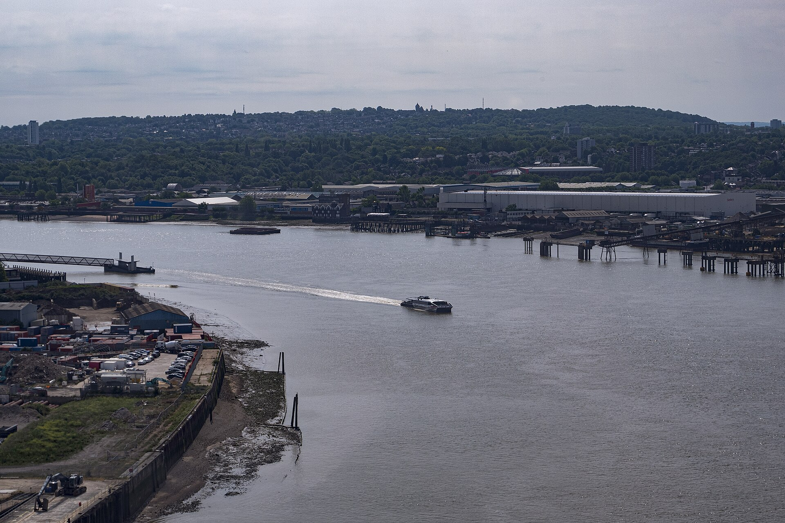
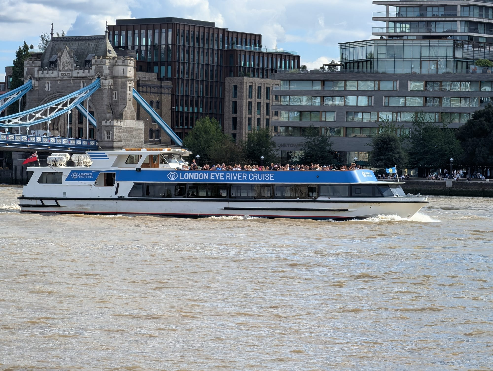
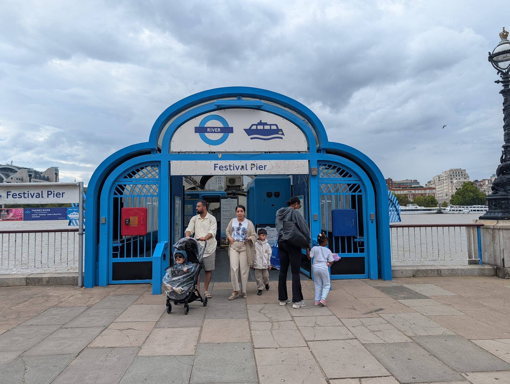

Travelling along the River Thames is one of the most enjoyable ways to see London. Whether you board **Uber Boat by Thames Clippers** for a fast commute, take a narrated sightseeing cruise under Tower Bridge, or book a high-speed Thames Rocket experience, boat travel combines scenic sightseeing with real transit.

> 💡 **River Boat Snapshot:**  
> - **Transit vs Cruise:** **Uber Boat by Thames Clippers** (River Bus) is London's scheduled river transit system. Narrated cruises and dining boats are private tours.  
> - **How to Pay:** Tap in AND touch out at pier gate readers using contactless or Oyster cards.  
> - **No TfL Capping:** River fares are billed separately and **do NOT count towards daily Underground/bus fare caps**.  
> - **Travelcard Savings:** Valid Travelcard holders receive a **33% discount (1/3 off)** on standard River Bus fares!

---

## River Bus, Sightseeing Cruise or Experience?

| Option Type | Best For | Oyster / Contactless Accepted? | Key Difference |
| --- | --- | --- | --- |
| **Uber Boat (River Bus)** | Scenic point-to-point transit (e.g. Westminster to Greenwich) | **Yes** *(Touch in & out at pier)* | Scheduled transit boats; climate-controlled indoor cabins & open back decks |
| **Hop-on Hop-off River Pass** | Making 3+ boat journeys in one day | Buy in app or pier | Unlimited River Bus travel for 24 or 48 hours |
| **Sightseeing Cruise (City Cruises)** | Narrated tours with live commentary | No *(Pre-booked ticket)* | Focuses on history & commentary; calls at major central piers |
| **Thames Rockets (Speedboat)** | High-speed thrill ride & entertainment | No *(Pre-booked ticket)* | 35-knot speedboat ride with music & guide |
| **Dining & Afternoon Tea Cruises** | Lunch, dinner, or tea with river views | No *(Pre-booked ticket)* | Timed 90–120 minute dining experience on the water |

---

## 4 Golden rules of Thames river travel

> 🌟 **Golden Rules of River Boats:**  
> 1. **Touch In AND Touch Out:** Unlike London buses, you MUST tap your contactless or Oyster card on the reader beside the boarding ramp when boarding AND alighting at piers.  
> 2. **Use the Same Device:** Tapping in with a physical bank card and out with Apple Pay results in two maximum fare charges!  
> 3. **Check Pier Step-Free Access:** While most piers are 100% step-free, check pier ramp access if travelling with wheelchairs or heavy strollers.  
> 4. **Check Boat Direction:** Double-check whether the approaching boat is heading Eastbound (towards Greenwich/Barking) or Westbound (towards Westminster/Battersea).

---

## Uber Boat by Thames Clippers: Fares & Zones

Uber Boat operates across three distinct fare zones: **West Zone** (Putney to Battersea), **Central Zone** (Battersea to Canary Wharf), and **East Zone** (Canary Wharf to Barking Riverside).

  <h4 style="margin-top: 0; color: #0f172a; border-bottom: 2px solid #0284c7; padding-bottom: 8px; font-size: 1.05rem;">🗺️ Thames River Bus Pier Route by Zone</h4>
  
  

    WEST ZONE
    
Putney ➔ Wandsworth Riverside ➔ Battersea Power Station Pier

  

  
  

    CENTRAL ZONE
    
Westminster ➔ London Eye ➔ Embankment ➔ Bankside ➔ London Bridge City ➔ Tower Pier

  

  

    EAST ZONE
    
Canary Wharf ➔ Greenwich ➔ North Greenwich (The O2) ➔ Woolwich ➔ Barking Riverside

  

> 🗺️ **Official Thames River Maps:**  
> * 📄 **[Download Official TfL River Services Map (PDF)](https://content.tfl.gov.uk/riverservices-map.pdf)** — Full Transport for London schematic map showing all river bus piers, Tube interchanges, and landmark connections.  
> * 🌐 **[View Interactive Uber Boat Route Map & Timetables](https://www.thamesclippers.com/plan-your-journey/route-map)** — Live interactive pier map with real-time boat tracking and departure schedules.

*An Uber Boat by Thames Clippers. Photo: [Simon](https://commons.wikimedia.org/wiki/File:Thames_Clipper_Uber_Boat.jpg), [CC BY 2.0](https://creativecommons.org/licenses/by/2.0/).*

### 2026 Pay-As-You-Go Fares

*Fares checked on **2 August 2026**.*

| Zones Travelled | Contactless / Oyster (Off-Peak) | Contactless / Oyster (Peak 06:35–09:27) | Online / App Single | Pier Gate Single |
| --- | ---: | ---: | ---: | ---: |
| **Central Zone Only** | **£9.90** | **£11.90** | **£11.70** | **£16.40** |
| **Central & East** | **£11.40** | **£13.70** | **£13.50** | **£17.70** |
| **Central & West** | **£11.40** | **£13.70** | **£13.50** | **£17.70** |
| **All Zones (West + Central + East)** | **£19.30** | **£22.90** | **£22.70** | **£24.70** |

> 💳 **Smart Tip:** Tapping Oyster or contactless is almost always cheaper than buying paper tickets at the pier ticket office! Valid Travelcard holders save an extra **33%**.

---

Powered by <a target="_blank" rel="sponsored" href="https://www.getyourguide.com/london-l57/">GetYourGuide</a>

## Top 3 scenic river boat routes for visitors

### 1. Westminster / London Eye ➔ Greenwich (The Ultimate Tourist Route)

*A narrated sightseeing cruise, not a river bus. Both use the same piers, which is the single most common mix-up.*
The quintessential Thames river trip! Board at Westminster Pier or London Eye Pier and sail past the Houses of Parliament, South Bank, St Paul's, and the skyscrapers of the City, before cruising **directly beneath Tower Bridge** to reach historic Greenwich (*Cutty Sark*, Royal Observatory).
* **Zones:** Central & East Zone (£11.40 off-peak PAYG).

*Cruising directly under Tower Bridge is the highlight of the Westminster-to-Greenwich river trip.*

### 2. Battersea Power Station ➔ Tower Hill
Explore the restored Battersea Power Station, then board a river boat past Westminster, Big Ben, and the South Bank to land at Tower Pier right beside the Tower of London and Tower Bridge.
* **Zones:** Central Zone Only (£9.90 off-peak PAYG).

### 3. Canary Wharf ➔ Greenwich Shortcut
A fast 10-minute river hop linking Docklands skyscrapers with Greenwich maritime heritage.
* **Zones:** Central & East Zone.

---

## Key piers and nearby London landmarks

| Pier Name | Nearest Underground / Rail Station | Top Nearby Landmarks |
| --- | --- | --- |
| **Westminster Pier** | Westminster (District, Circle, Jubilee) | Parliament, Big Ben, Westminster Abbey, Churchill War Rooms |
| **London Eye Pier** | Waterloo (Jubilee, Northern, Bakerloo) | London Eye, South Bank, Sea Life Aquarium |
| **Bankside Pier** | Blackfriars / Southwark | Tate Modern, Shakespeare's Globe, Millennium Bridge |
| **London Bridge City** | London Bridge (Northern, Jubilee) | Borough Market, The Shard, HMS Belfast |
| **Tower Pier** | Tower Hill (District, Circle) | Tower of London, Tower Bridge |
| **Canary Wharf Pier** | Canary Wharf (Elizabeth Line, Jubilee, DLR) | Docklands, Financial District, Museum of London Docklands |
| **Greenwich Pier** | Cutty Sark (DLR) | Cutty Sark, Old Royal Naval College, Greenwich Market |
| **North Greenwich Pier** | North Greenwich (Jubilee) | The O2 Arena, IFS Cloud Cable Car |
| **Battersea Power Station Pier** | Battersea Power Station (Northern) | Battersea Power Station, Lift 109, Riverside Dining |

*Festival Pier, in front of the Royal Festival Hall. Piers are signed from the walkway rather than the road, which is why people walk past them.*

---

## Thames Speedboat Thrill Rides

If you want an adrenaline-filled sightseeing adventure rather than a gentle cruise, high-speed **Rigid Inflatable Boats (RIBs)** operate thrilling high-speed tours along the River Thames. Powered by twin 440hp engines, these speedboats hit speeds up to **30–35 knots (approx 40 mph)** on the open water.

### How Speedboat Tours Work
* **Central Sightseeing (12 Knots):** From departure (usually London Eye Pier, Westminster, or Boardwalk Pier), the boat travels at a controlled 12 knots past Big Ben, Parliament, and St Paul's while an actor/comedian guide provides live commentary.
* **High-Speed Blast (35 Knots):** Once the speedboat passes **Tower Bridge**, the skipper hits full throttle! The boat blasts past Canary Wharf, Greenwich, and down towards the **Thames Barrier** with sharp turns, soundtrack music, and spray.

### Top Speedboat Experiences Compared

| Speedboat Tour | Operator | Departure Pier | Typical Duration | Highlights | Starting Price |
| --- | --- | --- | --- | --- | ---: |
| **Ultimate London Adventure** | Thames Rockets | London Eye Pier | 50 mins | Central sightseeing + 35-knot high-speed twists to Canary Wharf | From **£59.95** |
| **Thames Barrier Expedition** | Thames Rockets | London Eye Pier | 80 mins | Extended high-speed voyage past Greenwich down to the Thames Barrier | From **£79.95** |
| **Canary Wharf RIB Sprint** | Thames RIB Experience | Embankment / Tower Pier | 50 mins | High-powered RIB blast past Docklands skyscrapers | From **£55.00** |

> 🚤 **Essential Speedboat Tips:**  
> - **Clothing & Gear:** Lifejackets and high-quality waterproof jackets are provided. Dress warmly, as wind chill on open water at 35 knots is intense even in summer!  
> - **Pre-Booking Required:** Speedboat tours have strict capacity limits (typically 12–16 passengers per RIB) and sell out quickly on weekends.  
> - **Health Restrictions:** RIB speedboats are **not suitable** for pregnant women, travelers with back or neck conditions, or very young children.

---

## Lunch, Afternoon Tea & Dining Cruises

If you want to combine sightseeing with a meal or celebratory event, Thames dining cruises offer timed food and cruise packages:

| Experience Type | Typical Duration | Highlights | Starting Price (Approx) |
| --- | --- | --- | ---: |
| **Lunch Cruise** | 1 hr 45 mins | 2-course meal with central skyline views | From **£38** |
| **Afternoon Tea Cruise** | 90 mins | Scones, sandwiches, cakes, tea & coffee | From **£59** |
| **Evening Dinner Cruise** | 2 – 3 hours | 3-course dinner, wine & live entertainment | From **£42 – £119** |
| **Murder Mystery Dinner Cruise** | 3 hours | 3-course dinner with an interactive theatrical show | From **£109** |

> 🍷 **Dining Cruise Rules:** Dining cruises are private experiences. Pre-booking in advance is required; contactless taps and Oyster pay-as-you-go are **not accepted**.

---

## The River Bus Comedy Night

Looking for evening entertainment on the water? The [River Bus Comedy Night](https://www.thamesclippers.com/whats-on-and-offers/river-bus-comedy-night) is a special live stand-up comedy show hosted aboard an Uber Boat by Thames Clippers vessel:

* **Format:** A **100-minute stand-up comedy show** featuring top UK comedians while cruising along the Thames.
* **Departure:** Sails round-trip from **Embankment Pier** (Doors 18:30, sailing 19:00 to 21:00).
* **Tickets:** Approximately **£20 per ticket** (must be pre-booked online; adult 18+ event).
* **Onboard Amenities:** Fully licensed café bar serving alcoholic beverages, soft drinks, and snacks throughout the show.

> 🎟️ **Booking Tip:** Regular River Bus tickets, Oyster cards, and day passes are invalid for the comedy night—tickets must be purchased specifically for the event date in advance!

---

Powered by <a target="_blank" rel="sponsored" href="https://www.getyourguide.com/london-l57/">GetYourGuide</a>

## 7 Common river boat mistakes to avoid

1. **Assuming river fares count towards daily Tube caps:** River Bus fares are billed separately and do NOT count towards daily TfL capping limits.
2. **Forgetting to touch out:** Touching in without touching out charges an incomplete maximum fare.
3. **Buying paper tickets at the pier:** Pier office tickets cost up to **£16.40** vs. **£9.90** with contactless!
4. **Buying a Day Pass for just one trip:** Single pay-as-you-go tickets are cheaper unless making 3+ long boat journeys in a day.
5. **Confusing Uber Boat with sightseeing cruises:** Uber Boat is a fast transit ferry without audio commentary; City Cruises provides live narrated tours.
6. **Missing the 33% Travelcard discount:** Present or tap your Travelcard to get 1/3 off river fares.
7. **Missing the last boat back from Greenwich:** Night sailings end earlier than Tube trains—check final pier departure times!

---

## Related London Transport Guides

* 🚊 [Getting Around London: Complete Transport Overview](/articles/getting-around-london-transport-guide/)
* 💷 [London Transport Fares & Costs 2026](/articles/london-public-transport-costs-and-fares/)
* 🚇 [How to Use the London Underground](/articles/how-to-use-the-london-underground/)
* 🚌 [How to Use London Buses and Trams](/articles/how-to-use-london-buses-and-trams/)
* 💳 [Oyster Card vs. Contactless Guide](/articles/oyster-card-guide-london/)

---

*Information and fares checked on 2 August 2026. Always verify live sailing timetables with [Transport for London](https://tfl.gov.uk/) and [Uber Boat by Thames Clippers](https://www.thamesclippers.com/).*
