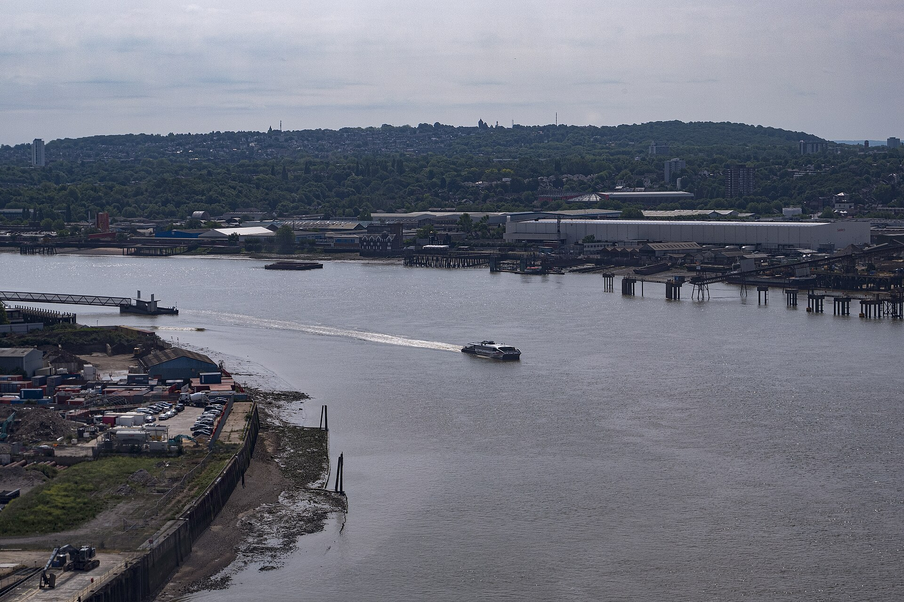
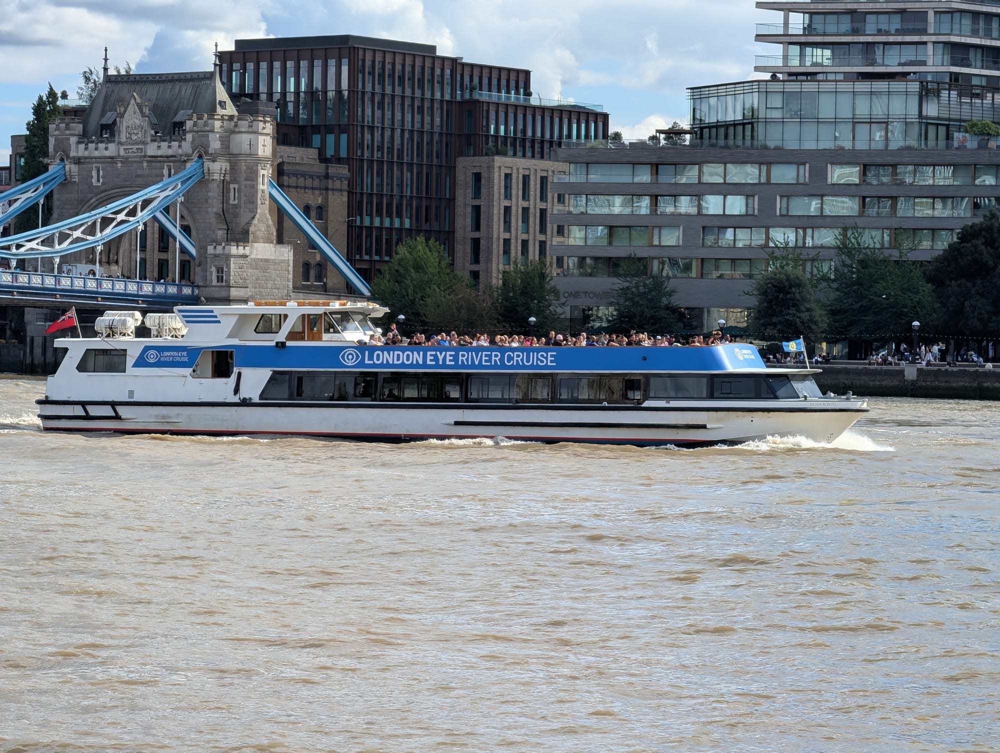
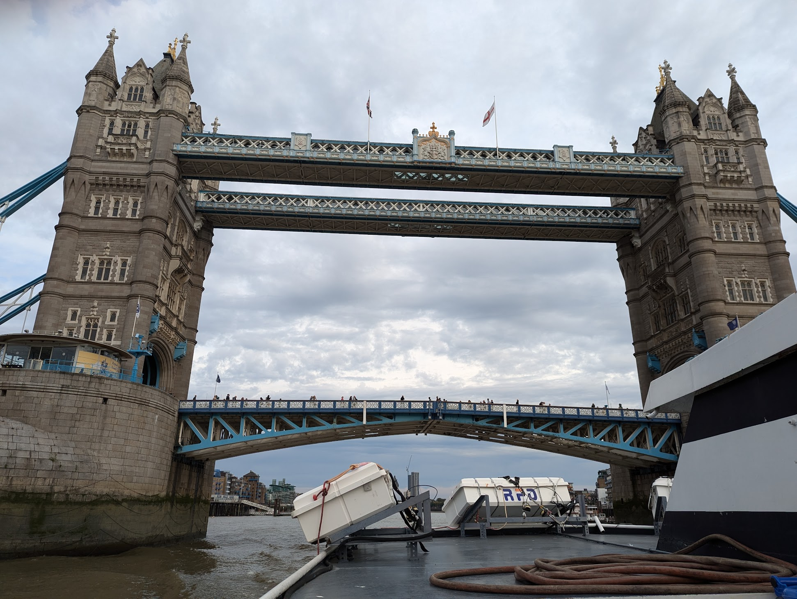
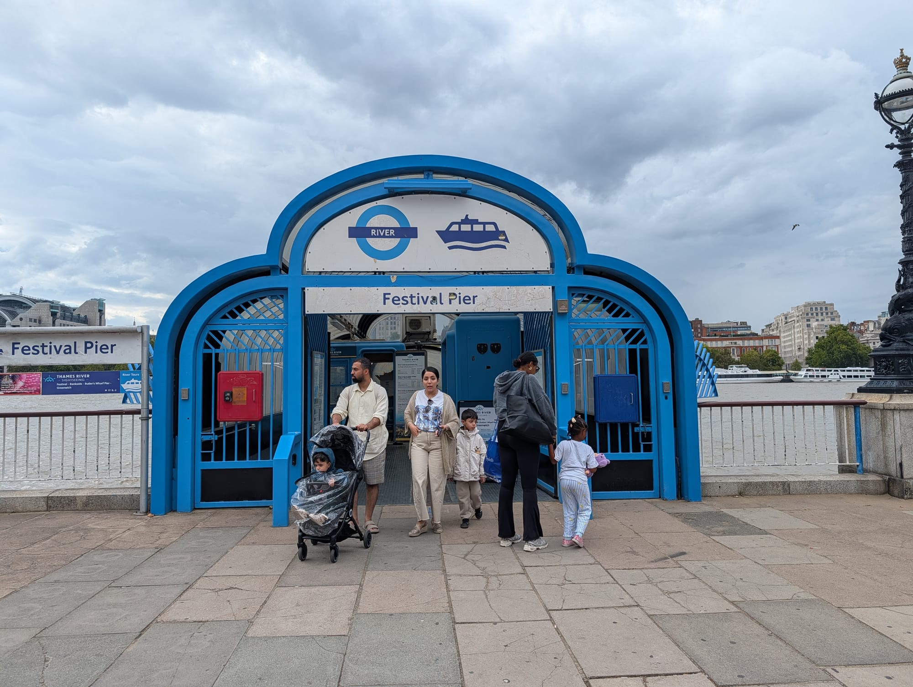

Three different things run on the Thames and they are easy to confuse: **Uber Boat by Thames Clippers** is scheduled transit you pay for by tapping a card, [narrated sightseeing cruises](/articles/thames-river-cruises-london/) are pre-booked tours, and the Thames Rockets speedboats are a ride. They share the same piers.

> 💡 **River Boat Snapshot:**  
> - **Transit vs Cruise:** **Uber Boat by Thames Clippers** (River Bus) is London's scheduled river transit system. Narrated cruises and dining boats are private tours.  
> - **How to Pay:** Tap in AND touch out at pier gate readers using contactless or Oyster cards.  
> - **No TfL Capping:** River fares are billed separately and **do NOT count towards daily Underground/bus fare caps**.  
> - **Travelcard Savings:** Valid Travelcard holders receive a **33% discount (1/3 off)** on standard River Bus fares!

---

## River Bus, Sightseeing Cruise or Experience?

| Option Type | Best For | Oyster / Contactless Accepted? | Key Difference |
| --- | --- | --- | --- |
| **Uber Boat (River Bus)** | Scenic point-to-point transit (e.g. Westminster to Greenwich) | **Yes** *(Touch in & out at pier)* | Scheduled transit boats; climate-controlled indoor cabins & open back decks |
| **Hop-on Hop-off River Pass** | Making 3+ boat journeys in one day | Buy in app or pier | Unlimited River Bus travel for 24 or 48 hours |
| **Sightseeing Cruise (City Cruises)** | Narrated tours with live commentary | No *(Pre-booked ticket)* | Focuses on history & commentary; calls at major central piers |
| **Thames Rockets (Speedboat)** | High-speed thrill ride & entertainment | No *(Pre-booked ticket)* | 35-knot speedboat ride with music & guide |
| **Dining & Afternoon Tea Cruises** | Lunch, dinner, or tea with river views | No *(Pre-booked ticket)* | Timed 90–120 minute dining experience on the water |

---

## 4 Golden rules of Thames river travel

> 🌟 **Golden Rules of River Boats:**  
> 1. **Touch In AND Touch Out:** Unlike London buses, you MUST tap your contactless or Oyster card on the reader beside the boarding ramp when boarding AND alighting at piers.  
> 2. **Use the Same Device:** Tapping in with a physical bank card and out with Apple Pay results in two maximum fare charges!  
> 3. **Check Pier Step-Free Access:** Uber Boat by Thames Clippers says every pier it serves is step-free except **Cadogan, London Bridge City and Wandsworth Riverside Quarter**, where the boarding brow gets too steep on some tides. See our [step-free London guide](/articles/step-free-london/) for the alternatives and the 50% disabled fare.  
> 4. **Check Boat Direction:** Double-check whether the approaching boat is heading Eastbound (towards Greenwich/Barking) or Westbound (towards Westminster/Battersea).

---

## Uber Boat by Thames Clippers: Fares & Zones

Uber Boat operates across three distinct fare zones: **West Zone** (Putney to Battersea), **Central Zone** (Battersea to Canary Wharf), and **East Zone** (Canary Wharf to Barking Riverside).

  <h4 style="margin-top: 0; color: #0f172a; border-bottom: 2px solid #0284c7; padding-bottom: 8px; font-size: 1.05rem;">🗺️ Thames River Bus Pier Route by Zone</h4>
  
  

    WEST ZONE
    
Putney ➔ Wandsworth Riverside ➔ Battersea Power Station Pier

  

  
  

    CENTRAL ZONE
    
Westminster ➔ London Eye ➔ Embankment ➔ Bankside ➔ London Bridge City ➔ Tower Pier

  

  

    EAST ZONE
    
Canary Wharf ➔ Greenwich ➔ North Greenwich (The O2) ➔ Woolwich ➔ Barking Riverside

  

> 🗺️ **Official Thames River Maps:**  
> * 📄 **[Download Official TfL River Services Map (PDF)](https://content.tfl.gov.uk/riverservices-map.pdf)** — Full Transport for London schematic map showing all river bus piers, Tube interchanges, and landmark connections.  
> * 🌐 **[View Interactive Uber Boat Route Map & Timetables](https://www.thamesclippers.com/plan-your-journey/route-map)** — Live interactive pier map with real-time boat tracking and departure schedules.

*Photo: [Simon](https://commons.wikimedia.org/wiki/File:Thames_Clipper_Uber_Boat.jpg), [CC BY 2.0](https://creativecommons.org/licenses/by/2.0/).*

### 2026 Pay-As-You-Go Fares

*Fares checked on **2 August 2026**.*

| Zones Travelled | Contactless / Oyster (Off-Peak: Mon–Fri 06:35–09:27) | Contactless / Oyster (Peak: all other times, and all weekend) | Online / App Single | Pier Gate Single |
| --- | ---: | ---: | ---: | ---: |
| **Central Zone Only** | **£9.90** | **£11.90** | **£11.70** | **£16.40** |
| **Central & East** | **£11.40** | **£13.70** | **£13.50** | **£17.70** |
| **Central & West** | **£11.40** | **£13.70** | **£13.50** | **£17.70** |
| **All Zones (West + Central + East)** | **£19.30** | **£22.90** | **£22.70** | **£24.70** |

> 💳 **Smart Tip:** Tapping Oyster or contactless is almost always cheaper than buying paper tickets at the pier ticket office! Valid Travelcard holders save an extra **33%**. For one long journey, the <a href="https://www.getyourguide.com/activity/-t413091?partner_id=WWP7I0R&amp;cmp=how-to-use-london-river-boats" target="_blank" rel="sponsored nofollow noopener" data-affiliate="gyg">Uber Boat single river ticket on GetYourGuide</a> is cheaper still: **from £9.80** in September 2026 for one trip between any two piers from Battersea Power Station to Barking Riverside, rated 4.0 from 1,116 reviews. It doesn't cover Putney or Wandsworth.

---

Powered by <a target="_blank" rel="sponsored" href="https://www.getyourguide.com/london-l57/">GetYourGuide</a>

## Top 3 scenic river boat routes for visitors

### 1. Westminster / London Eye ➔ Greenwich

*A sightseeing cruise, not a river bus.*
Board at Westminster Pier or London Eye Pier and sail past the Houses of Parliament, South Bank, St Paul's, and the skyscrapers of the City, before passing **directly beneath Tower Bridge** to reach Greenwich (*Cutty Sark*, Royal Observatory).
* **Zones:** Central & East Zone (£11.40 off-peak PAYG).
* **With commentary:** City Cruises sails Westminster, London Eye, Tower and Greenwich piers with the captain talking. Its <a href="https://www.getyourguide.com/activity/-t1382143?partner_id=WWP7I0R&amp;cmp=how-to-use-london-river-boats" target="_blank" rel="sponsored nofollow noopener" data-affiliate="gyg">one-day unlimited river pass</a> is **from £9** on GetYourGuide, 4.5 from 816 reviews: less than one Uber Boat fare to Greenwich.

*Passing beneath Tower Bridge.*

### 2. Battersea Power Station ➔ Tower Hill
Explore the restored Battersea Power Station, then board a river boat past Westminster, Big Ben, and the South Bank to land at Tower Pier right beside the Tower of London and Tower Bridge.
* **Zones:** Central Zone Only (£9.90 off-peak PAYG).

### 3. Canary Wharf ➔ Greenwich Shortcut
A fast 10-minute river hop linking Docklands skyscrapers with Greenwich maritime heritage.
* **Zones:** Central & East Zone.

---

## Key piers and nearby London landmarks

| Pier Name | Nearest Underground / Rail Station | Top Nearby Landmarks |
| --- | --- | --- |
| **Westminster Pier** | Westminster (District, Circle, Jubilee) | Parliament, Big Ben, Westminster Abbey, Churchill War Rooms |
| **London Eye Pier** | Waterloo (Jubilee, Northern, Bakerloo) | London Eye, South Bank, Sea Life Aquarium |
| **Bankside Pier** | Blackfriars / Southwark | Tate Modern, Shakespeare's Globe, Millennium Bridge |
| **London Bridge City** | London Bridge (Northern, Jubilee) | Borough Market, The Shard, HMS Belfast |
| **Tower Pier** | Tower Hill (District, Circle) | Tower of London, Tower Bridge |
| **Canary Wharf Pier** | Canary Wharf (Elizabeth Line, Jubilee, DLR) | Docklands, Financial District, Museum of London Docklands |
| **Greenwich Pier** | Cutty Sark (DLR) | Cutty Sark, Old Royal Naval College, Greenwich Market |
| **North Greenwich Pier** | North Greenwich (Jubilee) | The O2 Arena, IFS Cloud Cable Car |
| **Battersea Power Station Pier** | Battersea Power Station (Northern) | Battersea Power Station, Lift 109, Riverside Dining |

Piers are signed from the riverside walkway rather than the road above, so it's easy to walk straight past one.

*Festival Pier, by the Royal Festival Hall.*

---

## Speedboats and dining cruises

Thames Rockets speedboats and the lunch, afternoon tea and dinner boats are pre-booked tours, not River Bus services, so Oyster and contactless do not work on them. Prices, piers and which one to book are in our guide to [Thames river cruises](/articles/thames-river-cruises-london/).

---

## The River Bus Comedy Night

The [River Bus Comedy Night](https://www.thamesclippers.com/whats-on-and-offers/river-bus-comedy-night) is a live stand-up show aboard an Uber Boat by Thames Clippers vessel:

* **Format:** A **100-minute stand-up comedy show** featuring top UK comedians while cruising along the Thames.
* **Departure:** Sails round-trip from **Embankment Pier** (Doors 18:30, sailing 19:00 to 21:00).
* **Tickets:** Approximately **£20 per ticket** (must be pre-booked online; adult 18+ event).
* **Onboard Amenities:** Fully licensed café bar serving alcoholic beverages, soft drinks, and snacks throughout the show.

> 🎟️ **Booking Tip:** Regular River Bus tickets, Oyster cards, and day passes are invalid for the comedy night—tickets must be purchased specifically for the event date in advance!

---

## 7 Common river boat mistakes to avoid

1. **Assuming river fares count towards daily Tube caps:** River Bus fares are billed separately and do NOT count towards daily TfL capping limits.
2. **Forgetting to touch out:** Touching in without touching out charges an incomplete maximum fare.
3. **Buying paper tickets at the pier:** Pier office tickets cost up to **£16.40** vs. **£9.90** with contactless!
4. **Buying a Day Pass for just one trip:** Single pay-as-you-go tickets are cheaper unless making 3+ long boat journeys in a day.
5. **Confusing Uber Boat with sightseeing cruises:** Uber Boat is a fast transit ferry without audio commentary; City Cruises provides live narrated tours.
6. **Missing the 33% Travelcard discount:** Present or tap your Travelcard to get 1/3 off river fares.
7. **Missing the last boat back from Greenwich:** Night sailings end earlier than Tube trains—check final pier departure times!

---

Powered by <a target="_blank" rel="sponsored" href="https://www.getyourguide.com/london-l57/">GetYourGuide</a>

## Related London Transport Guides

- 🌇 **[The Best Rooftop and Riverside Restaurants in London](/articles/best-rooftop-restaurants-london/)** — the riverside rooms worth getting off the boat for
* 🚊 [Getting Around London: Complete Transport Overview](/articles/getting-around-london-transport-guide/)
* 💷 [London Transport Fares & Costs 2026](/articles/london-public-transport-costs-and-fares/)
* 🚇 [How to Use the London Underground](/articles/how-to-use-the-london-underground/)
* 🚌 [How to Use London Buses and Trams](/articles/how-to-use-london-buses-and-trams/)
* 💳 [Oyster Card vs. Contactless Guide](/articles/oyster-card-guide-london/)
* ♿ [Step-Free London](/articles/step-free-london/) – Accessible piers, stations and attractions

---

*Information and fares checked on 2 August 2026. Always verify live sailing timetables with [Transport for London](https://tfl.gov.uk/) and [Uber Boat by Thames Clippers](https://www.thamesclippers.com/).*
