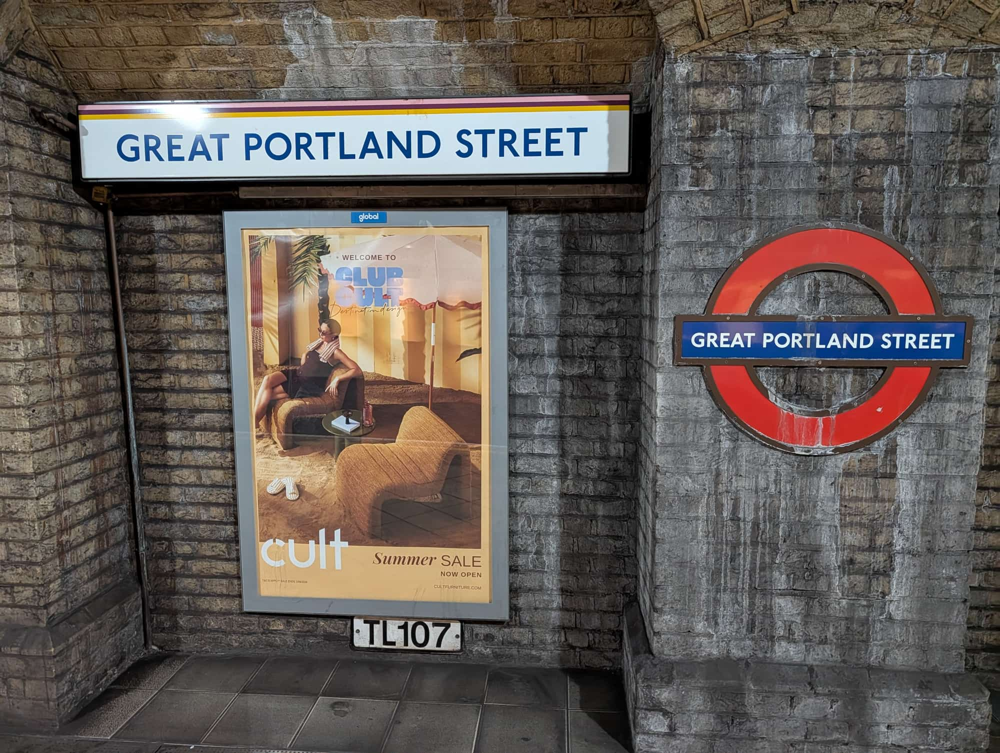
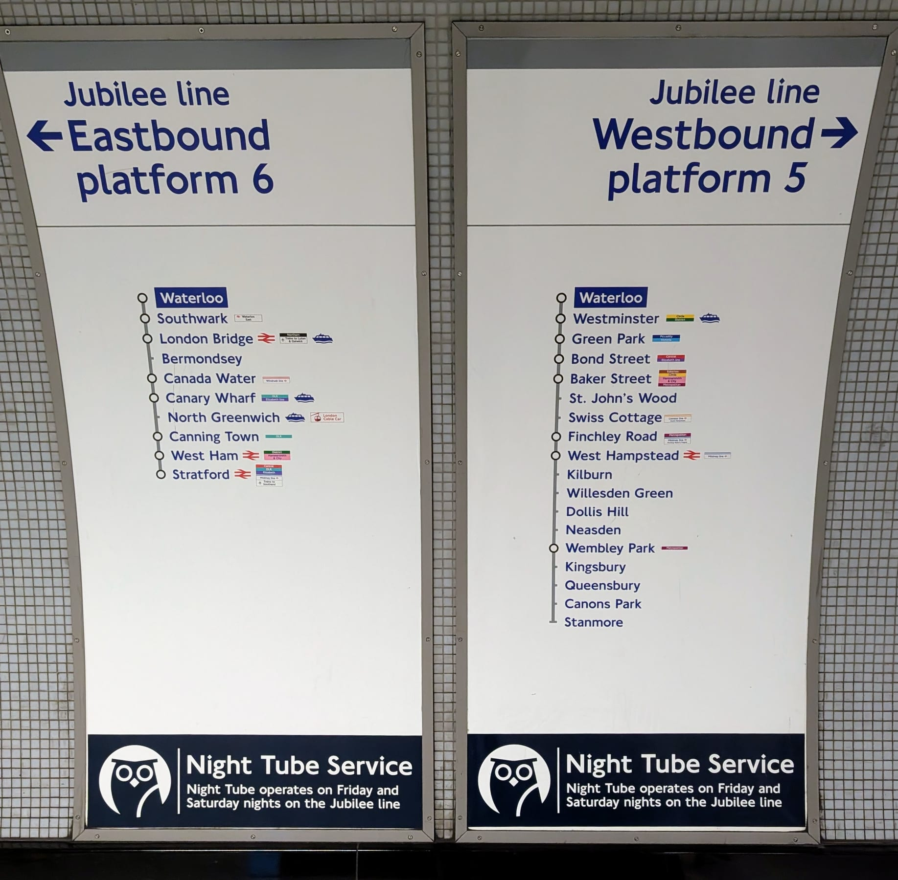
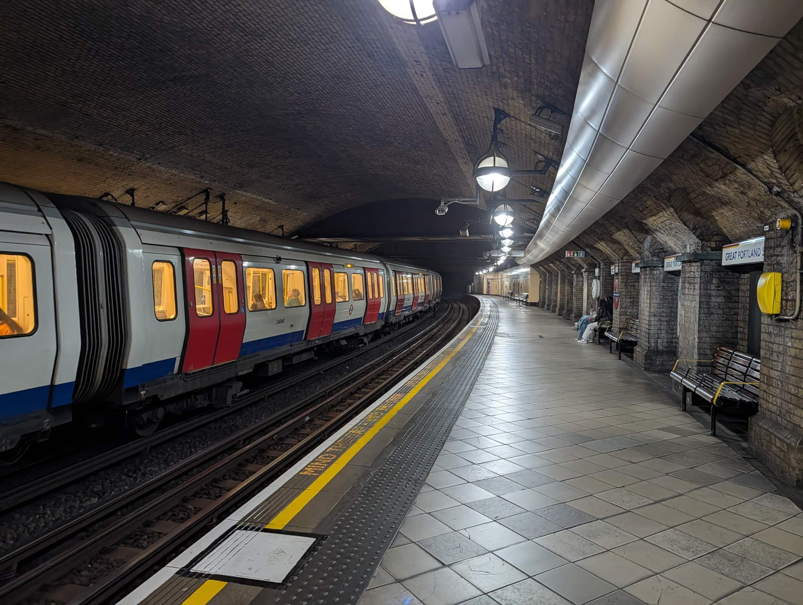
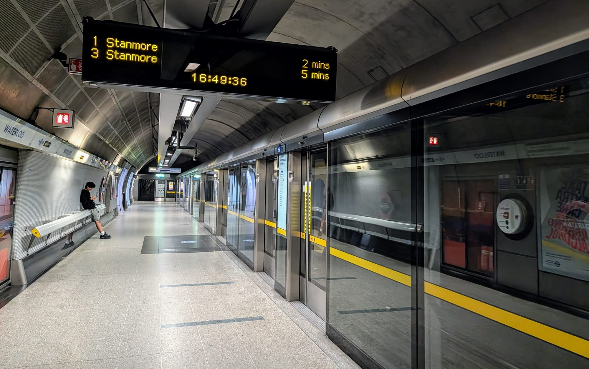
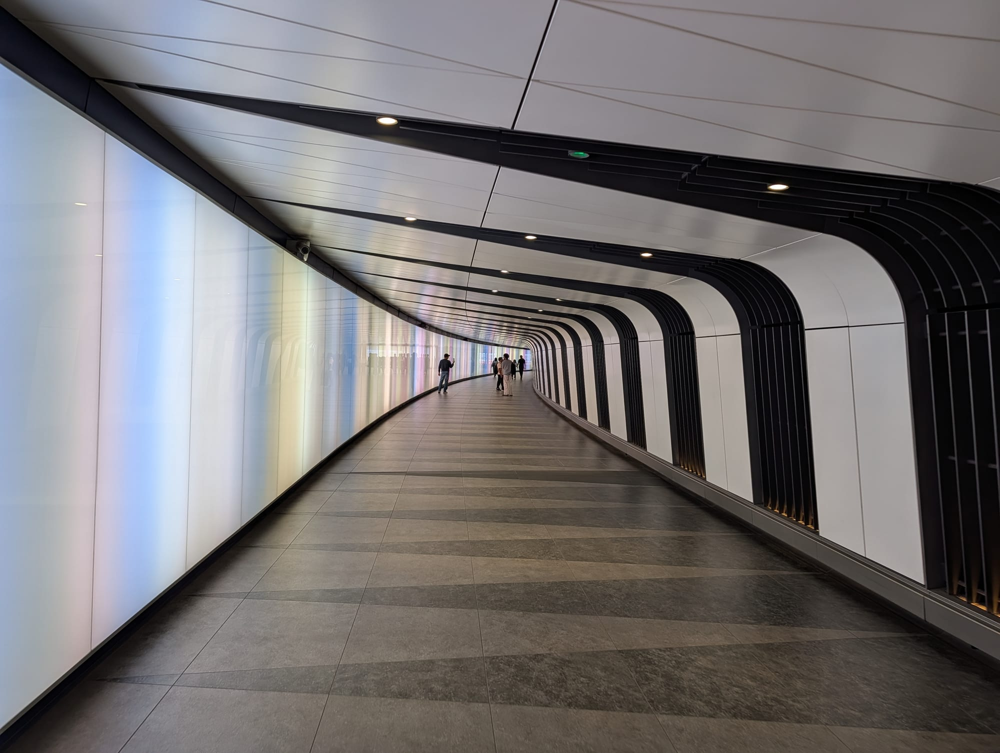

The London Underground—famously known as **the Tube**—is the world's oldest underground railway network and the fastest way to travel across Central London. With 11 color-coded lines serving 272 stations, it can look intimidating on a map, but the basic routine is simple once you know the rules.

> 💡 **First-Time Tube Snapshot:**  
> - **How to Pay:** Tap in and tap out at ticket barriers using the exact same contactless bank card, phone (Apple/Google Pay), or Oyster card.  
> - **Navigating:** Look for line names (e.g., *Piccadilly line*) and cardinal directions (*Northbound / Southbound / Eastbound / Westbound*), not just individual station names.  
> - **Fares:** Automatic daily capping ensures you never pay more than the daily maximum (£8.90 for Zones 1–2).
> - **Weekend Closures:** TfL regularly conducts track maintenance on weekends. Always check line status on the TfL Go app before travelling on Saturday or Sunday.

---

## Which line to take

The eleven Tube lines differ more than the map suggests — some are air-conditioned and some are not, some run all night and most do not, and a few are far easier to navigate than others.

Rather than repeat it here, that comparison lives in one place: **[the Tube and rail lines guide](/articles/london-tube-and-rail-lines-guide/)** rates all eleven on crowding, comfort, air-conditioning, Night Tube and ease of use, and lists the attractions each one serves with the station and the best exit.

The rest of this page is about using the network once you have picked a line.

## How to pay: Contactless vs. Oyster

For almost all adult visitors, tapping a **contactless bank card or mobile wallet (Apple Pay / Google Pay)** is the cheapest and most convenient payment method.

| Payment Method | Adult Single (Zone 1) | Daily Cap (Zones 1–2) | Setup Required |
| --- | ---: | ---: | --- |
| **Contactless Card / Phone** | **£3.10** *(Peak)* / **£3.00** *(Off-peak)* | **£8.90** | None—just tap at the gate |
| **Oyster Card** | **£3.10** *(Peak)* / **£3.00** *(Off-peak)* | **£8.90** | Buy for £10.50 fee & load credit |
| **Paper Single Ticket** | **£6.70** | None *(No capping)* | Must buy at machine *(Avoid!)* |

> ⚠️ **Critical Payment Rules:**  
> 1. **Use the exact same device:** Tapping in with a physical bank card and tapping out with Apple Pay on your phone counts as two separate cards. You will be charged two incomplete maximum fares (£9.40 each)!  
> 2. **One card per person:** Every traveler over 11 must tap their own separate card or phone. Two people cannot share one card.  
> 3. **Avoid Card Clash:** Keep your payment card separate from other contactless cards so the yellow reader doesn't charge the wrong card.

For full pricing details, peak hours, and Travelcard comparisons, read our complete guide to [London Transport Fares and Costs 2026](/articles/london-public-transport-costs-and-fares/).

---

## Taking a Tube journey: Step by step

### Step 1: Find the station & touch in

*Every platform repeats the station name inside the roundel. It is the quickest way to confirm where you are when a train pulls in.*

Look for the famous red-and-blue Underground roundel outside. Touch your card or device flat against the **yellow reader** on the right side of the ticket barrier. Wait for the green light and a single chime before walking through. Use the wider gates if carrying large luggage or a stroller.

### Step 2: Follow the color-coded line signs
Inside the station, follow the overhead signs matching your line's color. Directional signs indicate the compass heading and final destination (e.g. *"Piccadilly line Eastbound towards Cockfosters"*).

*Jubilee line signs at Waterloo. **You do not need to know which compass direction you want — the sign lists every station on that platform's line.** Find your stop in one of the two lists and take that platform. Here, eastbound platform 6 runs to Stratford via London Bridge and Canary Wharf; westbound platform 5 runs to Stanmore via Westminster and Baker Street.*

### Step 3: Check the platform display

*Great Portland Street, one of the original 1863 cut-and-cover stations. The wide, shallow tunnels here are shared by the Circle, Hammersmith & City and Metropolitan lines.*

Electronic digital displays on the platform show the destination and arrival time of upcoming trains. 

*The display gives the destination first and the wait second — here two trains to Stanmore, two and five minutes away. **The destination is the part that matters**, because it tells you which branch the train takes. The glass platform edge doors are particular to the Jubilee line's 1999 extension; most of the network has an open platform edge.*
> 🛑 **Check the Branch:** Lines like the Northern, District, and Piccadilly lines split into multiple branches. Always verify the train's destination on the platform display screen before boarding!

### Step 4: Boarding & train etiquette
* **Stand to the sides:** Stand behind the yellow platform safety line and allow passengers to exit the train completely before stepping aboard.
* **Move inside:** Walk down the aisle inside the carriage to make space for others near the doors.

### Step 5: Interchanging between lines
If your route requires changing lines (e.g., from the Victoria line to the District line), follow the colored transfer signs (*"Way Out & Line Transfers"*). You remain inside the ticketed area and **do not touch out** during an interchange.

### Step 6: Touch out at your final station
Touch the exact same card or device to the yellow reader at your exit station barrier to complete your journey and calculate your fare.

---

Powered by <a target="_blank" rel="sponsored" href="https://www.getyourguide.com/london-l57/">GetYourGuide</a>

## Essential Tube etiquette & golden rules

To travel smoothly like a local, keep these key unwritten rules in mind:

> 🌟 **Golden Rules of Tube Etiquette:**  
> 1. **Stand on the Right on Escalators:** Always stand on the right side of escalators. The left side is strictly reserved for people walking up or down!  
> 2. **Have your card ready:** Have your phone or card out and ready BEFORE reaching the ticket barrier. Stopping directly in front of the gate blocks moving crowds behind you.  
> 3. **Give up priority seats:** Offer designated priority seats to elderly passengers, pregnant women, or travelers with disabilities.  
> 4. **Keep bags off seats:** Keep backpacks and luggage on the floor between your feet or on your lap during busy hours.

---

## When does the Underground run? (Operating Hours)

London Underground trains operate 7 days a week, with operating hours varying slightly between weekdays, weekends, and specific lines:

| Day of the Week | First Trains (Start Time) | Last Trains (End Time) | Operating Notes |
| --- | --- | --- | --- |
| **Monday – Thursday** | **05:00 – 05:30 AM** | **00:30 – 01:00 AM** | First trains leave outer terminals around 05:00; last central trains depart around 00:30–01:00 AM. |
| **Friday** | **05:00 – 05:30 AM** | **00:30 – 01:00 AM** *(or 24 Hours on Night Tube lines)* | Standard lines close ~01:00 AM. **5 core lines** (Central, Jubilee, Northern, Piccadilly, Victoria) run 24 hours non-stop. |
| **Saturday** | **05:00 – 05:30 AM** *(or 24 Hours on Night Tube lines)* | **00:30 – 01:00 AM** *(or 24 Hours on Night Tube lines)* | Standard lines close ~01:00 AM. **5 core lines** (Central, Jubilee, Northern, Piccadilly, Victoria) run 24 hours non-stop. |
| **Sunday** | **06:30 – 07:00 AM** | **23:30 – 23:45 PM** | Starts ~1.5 hours later; last trains leave earlier before midnight across all lines. |

> 🌙 **Important Night Tube Exception:**  
> 24-hour weekend continuous service operates **ONLY on 5 lines** (Central, Jubilee, Northern - Charing Cross branch, Piccadilly, Victoria). Standard Tube lines close at their regular times (~00:30–01:00 AM) on Friday and Saturday nights (note: the **Waterloo & City line** is closed entirely on Saturdays, Sundays, and Bank Holidays!).

> 💡 **TfL Fare Day Definition:**  
> TfL's daily ticketing system operates on a **04:30 to 04:29** clock. Any journey made before 04:29 AM counts towards the previous day's daily fare cap!

---

## Night Tube & weekend closures

### Night Tube (24-Hour Weekend Travel)
On **Friday and Saturday nights**, 24-hour service operates across six lines:
* **Central Line**
* **Jubilee Line**
* **Northern Line** *(Charing Cross branch)*
* **Piccadilly Line**
* **Victoria Line**
* **Windrush Line** *(the former East London Overground route, which TfL now counts as Night Tube)*

Standard off-peak fares apply, and night journeys count towards the previous day's daily capping threshold (the TfL fare day runs from 04:30 to 04:29).

### Weekend Engineering Work
TfL frequently performs track maintenance and signaling upgrades over weekends. Before heading out on Saturday or Sunday—especially for airport flights or theatre shows—check the [TfL Planned Closures Page](https://tfl.gov.uk/status-updates/planned-track-closures) or use the **TfL Go App**.

*The King's Cross Lightwall, on the pedestrian tunnel between King's Cross St Pancras Tube and the main line stations. It is the quickest way between the two and the signage is easy to miss — follow signs for St Pancras International rather than trying to go back up to street level.*

---

## Step-free access & travelling with luggage

Not all Underground stations have step-free access:
* **White Wheelchair Symbol on Tube Maps:** Step-free access from street to platform level (there may still be a step or gap onto the train).
* **Blue Wheelchair Symbol on Tube Maps:** 100% step-free access from street all the way onto the train carriage.

> 🧳 **Luggage Tip:** Trains on the **Elizabeth line** and **District line** feature spacious walk-through carriages with dedicated luggage racks. Older deep-level lines (like the Central or Piccadilly lines) have tight doorways and no luggage racks—use wide ticket gates at stations!

---

## WiFi and phone signal underground

Two different things get muddled here, and the difference decides whether you can use your phone on a moving train.

**Free WiFi is at stations, not on trains.** Virtually every Underground station has it on the platforms and in ticket halls, across every line, and has done for years. It drops the moment the train pulls out. Useful for checking a message while you wait; no use at all between stops.

**Mobile signal in the tunnels is a separate, rolling build.** TfL and Boldyn Networks are fitting 4G and 5G section by section, with all four UK networks — EE, O2, Three and Vodafone — and it goes live a few stations and tunnel stretches at a time rather than line by line.

### What stays true whatever month you read this

* **The Elizabeth line is the one to take if you need to work.** It was finished end to end in December 2024 and is the only line with genuine onboard WiFi as well as signal, plus air conditioning and room for luggage.
* **Everywhere else, assume you are offline between stations.** Download your map, your tickets and anything you want to read before you go down. The TfL Go app plans journeys offline; a browser tab does not.
* **Coverage arrives by tunnel section, not by line.** A line is rarely all-or-nothing — the Victoria line had signal in the Vauxhall to Pimlico tunnel while the rest of it still went dark.
* **A gap is not a fault.** If a call drops between two stations on a line you were told is covered, you have crossed into a section that is not finished.

> 📶 **As of 6 September 2026:** roughly 60% of Underground stations have 4G and 5G, and TfL expects the whole network covered by the end of 2026. The Elizabeth line is complete. The remaining work this year is on the Victoria, Jubilee, Bakerloo and Piccadilly lines and the last Circle and District sections.
>
> **We have deliberately not listed stations**, because the list changes every few weeks and a stale one is worse than none. [TfL's connectivity page](https://tfl.gov.uk/travel-information/improvements-and-projects/improving-digital-connectivity-on-our-network) is the live version — check it if signal matters for a specific journey.

**If being reachable underground genuinely matters** — you are working, or meeting someone off a train — route the journey on the Elizabeth line where you can. It is the only line where that is a safe assumption today.
---

Powered by <a target="_blank" rel="sponsored" href="https://www.getyourguide.com/london-l57/">GetYourGuide</a>

## 7 Common Tube mistakes to avoid

1. **Using different devices:** Tapping in with your physical bank card and out with Apple Pay triggers two incomplete maximum fares.
2. **Forgetting to tap out:** Triggers an automatic maximum fare charge (up to £9.40 in Zone 1–6).
3. **Standing on the left on escalators:** Always stand on the right!
4. **Boarding the wrong train branch:** Check the electronic platform sign destination before boarding split lines (District/Northern/Piccadilly).
5. **Buying paper single tickets:** Single paper tickets cost **£6.70** in Zone 1 vs. **£3.10** with contactless!
6. **Treating the Tube map as a street map:** Many central stations (e.g. Covent Garden to Leicester Square) are just a 4-minute walk apart at street level.
7. **Not checking lift status:** If traveling with heavy bags or a wheelchair, verify lift operating status on the TfL Go app beforehand.

---

## Related London Transport Guides

* 🚊 [Getting Around London: Complete Transport Overview](/articles/getting-around-london-transport-guide/)
* 💷 [London Transport Fares & Costs 2026](/articles/london-public-transport-costs-and-fares/)
* 💳 [Oyster Card vs. Contactless Guide](/articles/oyster-card-guide-london/)
* 🗺️ [London Tube and Rail Lines Guide](/articles/london-tube-and-rail-lines-guide/)
* ✈️ [Heathrow Airport to London Transport Guide](/articles/heathrow-airport-to-london/)

---

*Information checked on 2 August 2026. Always verify live travel status using [Transport for London](https://tfl.gov.uk/).*
