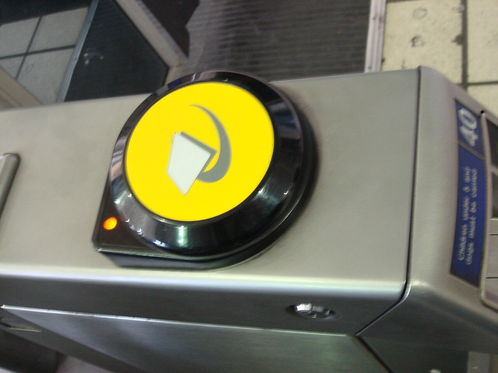

The London Underground can look complicated on first encounter, but the basic routine is straightforward: plan your route, use the same card or device to enter and leave, follow the coloured line signs and check the destination shown on the front of the train.

Once you have made one or two journeys, the Tube usually becomes one of the simplest ways to cross London.

> **The short version:** use contactless or Oyster, touch in at the start and out at the end, know the name of the line and its direction, and let passengers leave the train before you board.

## Before your first journey

Download the official [TfL Go app](https://tfl.gov.uk/maps_/tfl-go) or use the [TfL Journey Planner](https://tfl.gov.uk/plan-a-journey/) before leaving your accommodation. Both can show current disruption, route options and step-free information.

For each journey, make a note of four things:

1. Your starting station.
2. The Underground line you need.
3. The direction of travel, normally shown by the final station or branch.
4. The station where you leave the train or change lines.

The Tube map is a diagram rather than a geographically accurate street map. Two stations that appear separated on the map can occasionally be close enough to walk between, while some interchanges involve a surprisingly long walk underground.

## Contactless or Oyster: how to pay

For most adult visitors, paying as you go with a contactless bank card, phone or watch is the easiest option. Oyster cards provide a useful alternative if your bank card is not accepted, if it would attract overseas transaction charges, or if you prefer to keep travel spending separate.

The [complete Oyster card guide](/articles/oyster-card-guide-london/) compares both options, explains the £10.50 card fee and lists every type of London transport where Oyster is accepted.

TfL applies daily and weekly caps to eligible pay-as-you-go journeys. This means that after enough qualifying journeys, further travel within the relevant zones will not increase the fare beyond the applicable cap. TfL says pay as you go with daily capping is cheaper than buying a Day Travelcard for travel in Zones 1–9.

*The yellow reader used for Oyster and contactless payments. Photo: [Oxyman](https://commons.wikimedia.org/wiki/File:TfL_Oyster_Card_reader.jpg), [CC BY-SA 3.0](https://creativecommons.org/licenses/by-sa/3.0/).*

### Always use the same card or device

Touch the yellow reader at the beginning and end of every Underground journey. Wait for the green light and a single beep before walking through the gate.

The payment method must be exactly the same at both ends. If you enter using a physical bank card and leave using the same card through Apple Pay or Google Pay, TfL sees two separate payment methods. That can create incomplete journeys and maximum fares.

Each traveller needs a separate card, device, Oyster card or ticket. Two adults cannot pass the same contactless card back and forth at the gate.

Keep other contactless cards away from the reader to avoid **card clash**, where the system charges a different card from the one you intended to use.

## Understanding London’s fare zones

London’s rail network is divided into nine fare zones. Zone 1 covers the centre, and most major visitor attractions are in Zones 1 and 2. Heathrow Airport is in Zone 6.

Your fare depends partly on the zones crossed and the time of travel. Peak fares generally apply Monday to Friday from 06:30–09:30 and 16:00–19:00, with some exceptions. Fare rules and prices can change, so use TfL’s [Single Fare Finder](https://tfl.gov.uk/fares/find-fares/single-fare-finder) when the exact cost matters.

You do not need to choose zones in advance when using contactless or Oyster pay as you go. The system calculates the fare from your entry and exit records.

## Taking a Tube journey, step by step

### 1. Find the correct station entrance

Look for the red and blue Underground roundel. Larger stations can have several entrances, and using the one closest to your required line can save a considerable walk.

### 2. Touch in

Place your card or device flat against the yellow reader. Do not remove it until the reader confirms acceptance. Wider gates are available for passengers with luggage, wheelchairs or pushchairs.

### 3. Follow the line signs

Station signs use the same colours as the Tube map. Follow the signs for your line, then check the direction.

Directions might be described as northbound, southbound, eastbound or westbound. They can also be shown using a terminating station, such as “Victoria line southbound towards Brixton”.

Some lines divide into branches. The Northern, District, Metropolitan and Piccadilly lines are examples where checking the destination displayed on the platform and train is particularly important.

### 4. Check the platform display

Electronic displays show the destination and expected arrival time of the next trains. If the first train is not going to your required branch, let it leave and wait for the correct service.

### 5. Let passengers off first

Stand to the side of the doors and allow people to leave before boarding. Move down inside the carriage where possible, and keep bags out of the doorway.

### 6. Change lines if necessary

Leave the train and follow the coloured signs for your next line. You normally remain inside the paid area and do not touch out during an interchange.

There are exceptions known as **out-of-station interchanges**, where a recognised connection involves leaving one station and entering another nearby station. TfL normally links these journeys automatically when they are completed within the permitted time.

### 7. Touch out at your destination

Use the same card or device at the exit gate. Missing a touch in or touch out can result in an incomplete journey and a maximum fare.

## Travelling at busy times

Weekday commuting periods can be extremely crowded, particularly from approximately 07:30–09:30 and 16:30–18:30.

If your plans are flexible:

- Travel after the morning rush.
- Avoid changing at the busiest central stations when an easy alternative exists.
- Allow extra time when carrying luggage.
- Step away from platform entrances before stopping to check your phone.
- Have your card or device ready before reaching the gate.

During hot weather, carry water. Much of the network is deep underground and not every train is air-conditioned.

## Escalators, lifts and station etiquette

On Underground escalators, stand on the right and leave the left side clear for people walking. Hold the handrail, keep luggage secure and take particular care when stepping on and off.

Let people leave lifts and trains before entering. Avoid stopping immediately beyond ticket gates or at the bottom of escalators, where passengers are moving behind you.

TfL advises passengers to remain behind the yellow platform line, keep loose clothing and bags away from closing doors, and ask staff rather than attempting to retrieve anything dropped onto the tracks.

## Accessibility and travelling with luggage

Do not assume that every Underground station is step-free. TfL currently describes around a third of Tube stations as step-free, but the level of access varies.

On TfL maps:

- A blue wheelchair symbol indicates step-free access from street to train.
- A white wheelchair symbol indicates step-free access from street to platform, but there may still be a step or gap when boarding.

Use TfL Go or the [step-free journey information](https://tfl.gov.uk/transport-accessibility/wheelchair-access-and-avoiding-stairs) to plan ahead, and check for lift closures immediately before travelling. Station staff can help arrange ramps and alternative accessible routes.

Passengers with large suitcases, pushchairs or limited mobility should use lifts rather than escalators where possible. Not every station has a lift, so sometimes a slightly longer route will be much easier.

## When does the Underground run?

First and last train times vary by station and line. Most Tube services operate from early morning until around midnight, but you should check the exact final connection rather than relying on a general closing time.

The Night Tube runs on Friday and Saturday nights on the Central, Jubilee, Northern, Piccadilly and Victoria lines. Not every branch or station is served, and planned engineering work can affect overnight journeys. Check [TfL’s Night Tube information](https://tfl.gov.uk/campaign/tube-improvements/the-future-of-the-tube/night-tube) before travelling late.

## Common mistakes to avoid

- **Using different devices:** a bank card and the same card loaded onto a phone are treated separately.
- **Forgetting to touch out:** this can produce a maximum fare.
- **Taking the right line in the wrong direction:** check the destination stations listed on platform signs.
- **Boarding the wrong branch:** read the destination on the departure display.
- **Assuming every station is step-free:** check the accessibility symbols and live lift status.
- **Buying an expensive paper single ticket unnecessarily:** compare it with contactless or Oyster pay as you go.
- **Following the Tube map as if it were a street map:** check whether walking would be quicker for short central journeys.

## A simple first journey

For your first trip, choose a journey with no interchange if possible. Arrive outside the busiest commuting period, keep your route open on your phone and read the signs rather than following the crowd.

If you become uncertain, step to one side and ask a member of staff. Tube, Elizabeth line and London Overground stations are staffed whenever services are running.

Londoners may move quickly, but the system is designed to be navigated through repeated signs, line colours and station names. Take a moment to confirm each step and there is rarely any need to rush.

---

*Information checked on 28 July 2026. Fares, services, engineering work and accessibility can change; verify time-sensitive details with [Transport for London](https://tfl.gov.uk/) before travelling.*

### Research sources

- [TfL: Best ways for visitors to pay](https://tfl.gov.uk/travel-information/visiting-london/getting-around-london/best-ways-for-visitors-to-pay)
- [TfL: How to pay the right fare](https://tfl.gov.uk/fares/pay-the-right-fare)
- [TfL: Wheelchair access and avoiding stairs](https://tfl.gov.uk/transport-accessibility/wheelchair-access-and-avoiding-stairs)
- [TfL: The Night Tube](https://tfl.gov.uk/campaign/tube-improvements/the-future-of-the-tube/night-tube)
- [TfL: Tips for staying safe while you travel](https://tfl.gov.uk/travel-information/safety/staying-safe)
