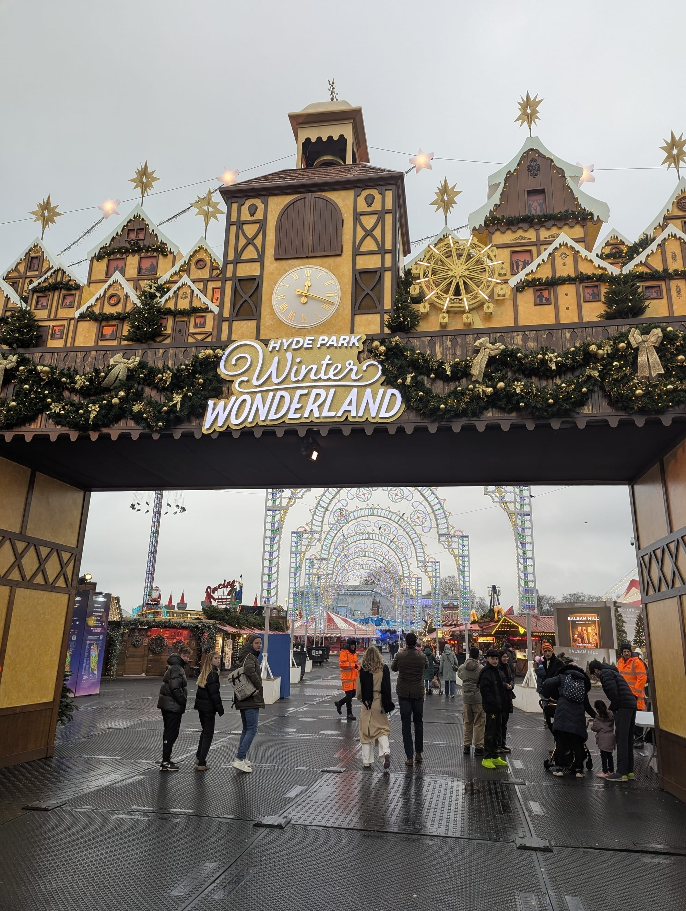
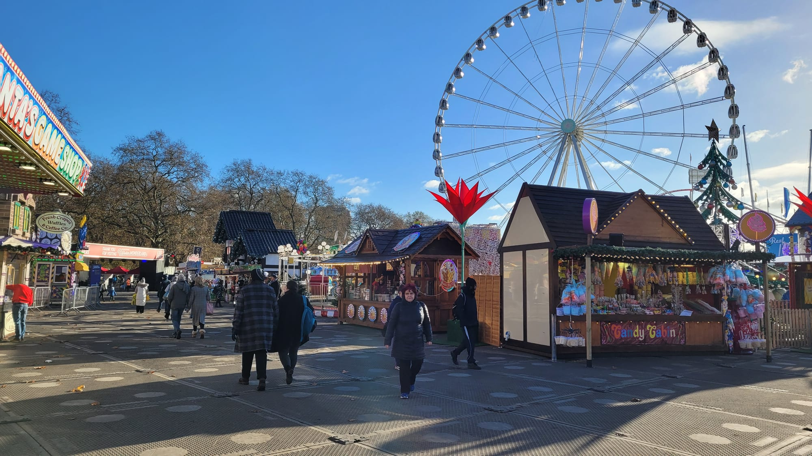
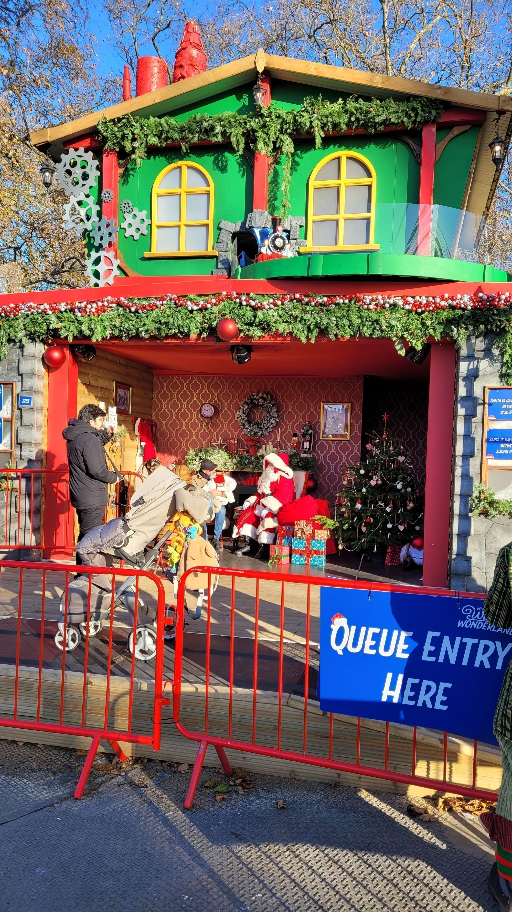
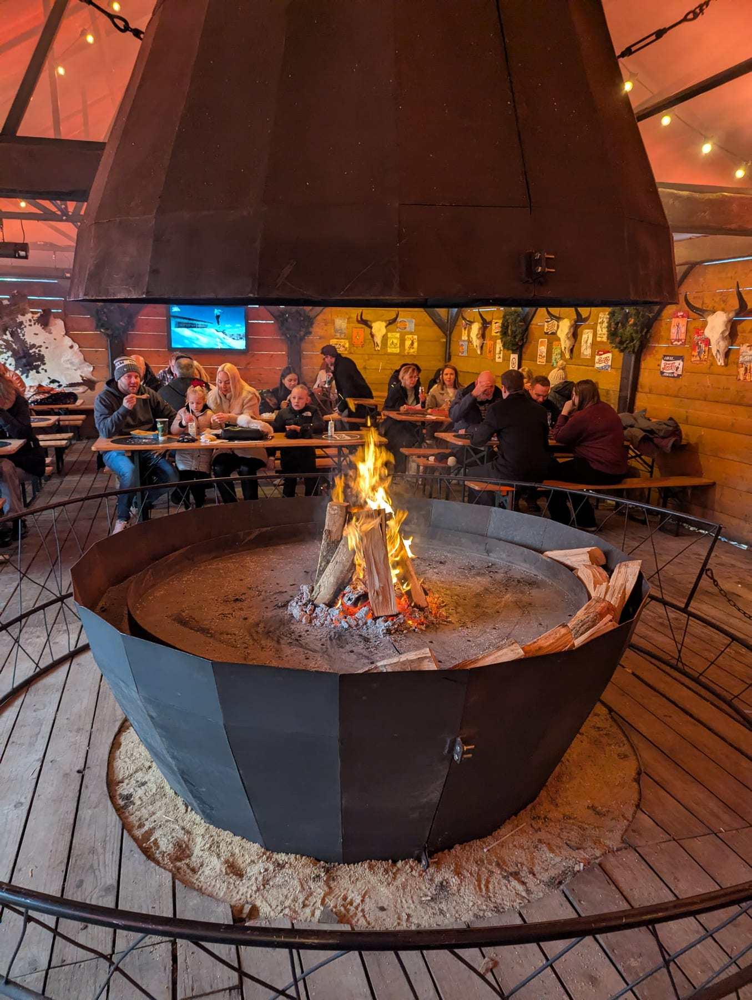
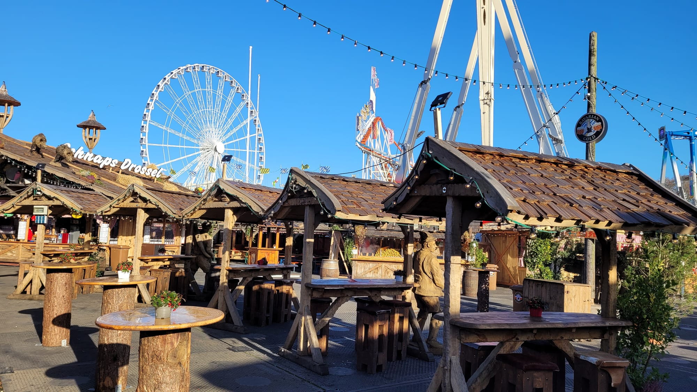
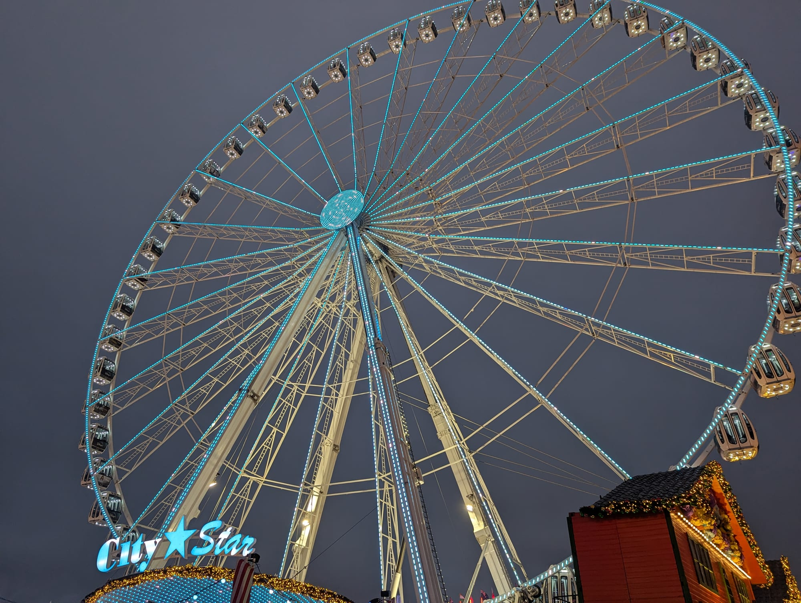
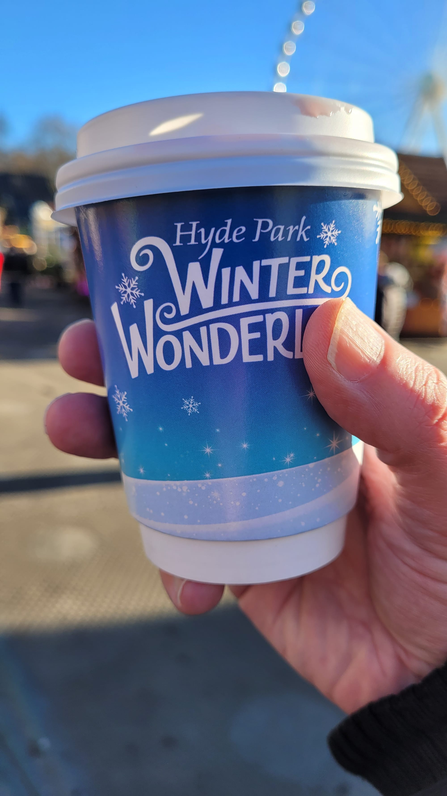

**Hyde Park Winter Wonderland runs from Thursday 19 November 2026 to Sunday 3 January 2027**, and this year it opens every single day except Christmas Day. Entry starts at £1. Almost everything inside costs extra.

That gap between the two is the whole thing. Half a million £1 tickets get people through the gate; the ice rink is £19.25 at peak, the circus £19.80, and a two-person ice-sculpting station £78.65. It is possible to have a lovely evening here for the price of a bus fare, and it is possible to spend £200 without noticing. This guide is every published price, so you can decide which trip you are taking.

---

## The short version

- **Dates:** 19 November 2026 – 3 January 2027. **Closed Christmas Day only** — last year it also shut on three November dates, and this year it does not.
- **Hours:** closes **10pm** every night, **last entry 21:30**. Most days open 10am, but a long list of quieter dates open at 11am or noon.
- **Entry:** **£1 / £5.50 / £8.25** in advance, booking fees included. More on the door.
- **The money trick:** spend **£25 online in one transaction** and entry is free.
- **Quietest:** Monday to Wednesday daytime, late November. Which is also the cheapest.
- **Free inside:** Santa's Grotto, all live music, the Christmas Market, the light arches, every bar to walk into.
- **Everything else costs**, including every single ride.

*Through the gate: Luminarie Lane's arches are the free bit, and they are the best-looking thing on the site.*

---

## Getting in

### Entry is ticketed, timed, and one-way

Everybody needs an entry ticket — as the organisers put it, whether you are 2 or 92. **Children aged two and under are free but still need a ticket issued.** Entry runs in **one-hour arrival slots** from 10:00 through to a final 20:00–21:30 slot, and once you are in you can stay until close.

**There is no re-entry.** Once your ticket is scanned it is spent, so do not plan to nip out for dinner and come back.

| Band | Advance price | When it applies |
| --- | --- | --- |
| **Off-peak** | **£1.00** | Monday to Thursday throughout November |
| **Standard** | **£5.50** | Many mornings and afternoons |
| **Peak** | **£8.25** | Weekends, and most later slots |

New for 2026, **booking fees are included** — the site's phrasing is that the first price is always the final price. Advance prices run until 23:59 the day before. You can buy on the door but will pay more; the walk-up price is not published anywhere, and the only clue is the repeated phrase "free entry worth up to £9.50 per person".

> 💡 **The single biggest saving.** Spend **£25 or more in one online transaction** on rides, attractions, passes or food meal deals and **your entry ticket is free**. Every additional £25 unlocks another one. It is online only, and it is why a group booking a couple of attractions should never pay for entry at all.

### Which gate

Four gates, and they are a long walk apart once you are inside.

| Gate | Side | Nearest stations | Opens onto |
| --- | --- | --- | --- |
| **Red** | East | Bond Street, Marble Arch | Santa Land, Thrillville |
| **Blue** | South | Hyde Park Corner, Green Park, Victoria | Ice rink, Show Town, Christmas Market |
| **Green** | West | Knightsbridge, High Street Kensington | Bavarian Village, Market Square |
| **Gold** | North | Marble Arch, Paddington | Arctic Circle, Luminarie Lane |

**Hyde Park Corner, Knightsbridge and Marble Arch are closest and busiest, and can close when crowds build.** The official advice is to use **Victoria** (19 minutes' walk), **Bond Street** (14), **Paddington** (12) or **Green Park** (17) instead. Red Gate is described by the organisers as the family entrance and is typically the quietest of the four.

**Security is 100% bag searches at every gate.** Bags must be **A4 or smaller** — handbags and small rucksacks only. Suitcases, scooters and bikes are refused, and **there is no left luggage on site**; the nearest is Victoria station.

---

## Everything that costs money inside

All prices below are **advance** prices from the operator's own tables, and all three-column figures are off-peak / standard / peak. Because the pricing band follows your *entry* slot, a quiet weekday in November is cheaper on the attractions too — often by a third.

### The Ice Rink

*Skater's Corner · 45-minute sessions, hourly, 10:00–21:00 · skate hire included*

The UK's largest open-air rink, laid around the park's Victorian bandstand. Arrive twenty minutes early. Age 3 and up, and children aged 3–12 must be accompanied by an adult who is actually skating.

| | Off-peak | Standard | Peak |
| --- | --- | --- | --- |
| Adult | £12.65 | £17.05 | £19.25 |
| Child | £9.35 | £11.55 | £13.75 |
| Family | £37.40 | £46.20 | £55.00 |
| Concession | £11.65 | £16.05 | £18.25 |
| Ice Guide | £39.50 | £39.50 | £39.50 |

**The cloakroom is £2 per item and it is compulsory for bags**, which catches people out at the barrier. No phones or cameras on the ice. Wheelchairs are allowed on the ice with the motors off, and there are ramps in and out. Penguin skate aids exist for children under a metre tall, sold on the day — the price is not published.

### Magical Ice Kingdom presents Neverland

*Arctic Circle · anytime entry, 10:00–21:00 · 15–20 minutes*

Five hundred tonnes of carved ice and snow, this year on a Peter Pan theme, in partnership with Great Ormond Street Hospital Charity. **It is around −10°C inside** — buggies are welcome and it is wheelchair accessible, but dress for it properly rather than optimistically.

| | Off-peak | Standard | Peak |
| --- | --- | --- | --- |
| Adult | £10.20 | £12.95 | £14.60 |
| Child | £8.00 | £10.75 | £12.40 |
| Family | £32.00 | £43.00 | £49.60 |
| Concession | £9.20 | £11.95 | £13.60 |

### The Giant Wheel

*Thrillville · 10-minute flight, 10:00–21:30*

Seventy metres, and billed as the world's largest transportable observation wheel. At busy times you share a pod with strangers, which is worth knowing before you pay for the view.

| | Off-peak | Standard | Peak |
| --- | --- | --- | --- |
| Adult / teen | £8.80 | £9.90 | £12.10 |
| Child | £6.60 | £7.70 | £9.90 |
| Family | £26.40 | £30.80 | £39.60 |
| Concession | £7.80 | £8.90 | £11.10 |
| **Private pod, up to 6** | **£46.20** | **£52.80** | **£61.60** |

Fast-track is a flat upgrade on top: £5.50 adult, £3.30 child, £13.20 family, £22.00 for a private pod.

*A weekday morning, and you can see the ground. This is what the £1 slots buy you.*

### Bar Ice

*Arctic Circle · 20-minute session, 11:00–21:20 · a cocktail included*

New theme for 2026: an Arctic snow cave, with a live DJ, in association with Mixtons Cocktails. Parka and gloves are provided; it is −10°C. **Under-12s are not admitted after 7pm**, under-18s must be with an adult, and **everyone over two pays the full adult price**.

| | Off-peak | Standard | Peak |
| --- | --- | --- | --- |
| Admission | £17.05 | £18.70 | £19.80 |

### Real Ice Slide

*Arctic Circle · hourly, 10:00–21:30 · two slides included*

**£5.50 flat**, at every price band. Minimum height 90cm; 3–12s need an adult. It is the only attraction on site that is not wheelchair accessible.

### Ice Sculpting Workshops

*Arctic Circle · 40 minutes · age 12+*

**£67.65 standard, £78.65 peak — and that is per two-person station, not per person.** Tools provided, and the ticket includes free entry into the Magical Ice Kingdom afterwards, which takes some of the sting out. Under-18s need an adult.

### Gandeys K-Pop Dragon Circus

*Show Town · 55 minutes · 14:00, 16:00 and 18:00, plus 12:00 and 20:00 on selected days*

**This is the big change for 2026.** Gandeys replaces both Zippos Christmas Circus — Winter Wonderland's resident big top since 2009 — and Cirque Berserk. If you are coming back expecting Zippos, it is not Zippos.

All ages, no height restriction, but flashing lights, loud music and dark staging. **No pushchairs inside the big top**; there is a buggy park for ticket holders during the show only.

| | Off-peak | Standard | Peak |
| --- | --- | --- | --- |
| Adult | £13.75 | £17.60 | £19.80 |
| Adult, ringside | £15.95 | £19.80 | £22.00 |
| Child | £10.45 | £14.30 | £16.50 |
| Child, ringside | £12.65 | £16.50 | £18.70 |
| Family | £41.80 | £57.20 | £66.00 |
| Family, ringside | £50.60 | £66.00 | £74.80 |

---

Powered by <a target="_blank" rel="sponsored" href="https://www.getyourguide.com/london-l57/">GetYourGuide</a>

## The rides

**Every ride costs extra**, without exception, and none are included in entry. Advance prices:

| Ride | Zone | Standard | Fast-track | Restriction |
| --- | --- | --- | --- | --- |
| Munich Looping | Thrillville | £12.00 | £15.00 | 1.3m–1.95m, 8+ |
| Blizzard | Thrillville | £9.90 | £13.20 | 1.4m+ |
| Wilde Maus XXL | Bavarian Village | £9.90 / £7.70 child | £13.00 / £11.00 | 1.2m+, 6+ |
| The Hangover *(85m drop)* | Thrillville | £9.50 | £13.00 | 1.4m+ |
| Dr Archibald VR | Bavarian Village | £9.50 | £13.00 | 1.3m+, 10+, until 5pm |
| Dr Archibald VR **Horror** | Bavarian Village | £9.50 | £13.00 | 1.3m+, 10+, from 5pm |
| Aeronaut Starflyer *(80m)* | Thrillville | £8.80 | £12.10 | 1.2m+ |
| Airborne | Thrillville | £8.80 | £12.10 | 1.4m+ |
| The XXL *(47m pendulum)* | Thrillville | £8.50 | £12.00 | 1.4m+ |
| Ice Mountain | Arctic Circle | £7.70 / £5.50 child | £11.00 / £8.80 | 1.2m+ |
| Euro Coaster | Thrillville | £7.50 / £5.50 child | — | 1.2m+ |
| The Time Machine | Santa Land | £7.50 / £5.50 child | — | 1.2m+ |
| Haunted Mansion | Thrillville | £7.50 / £5.50 child | — | 1m+ |
| Snow Jet | Arctic Circle | £6.50 / £5.50 child | — | 4+ |
| Après-Ski Party Funhouse | Arctic Circle | £5.50 | — | 1m+, 4+ |

Ride tickets are valid all day on your booked date and can be redeemed whenever you like.

> ⏱️ **Ride the big ones early.** That "valid all day" is the most useful line on your ticket, and almost nobody uses it. **Queues for the headline rides — Munich Looping, The Hangover, the Giant Wheel — can pass an hour once the site fills**, which is most of a Friday evening and all of a December weekend. The same queue is a few minutes at opening or in the first hour after lunch.
>
> So do it in that order: **ride first, browse second.** Get the rides you actually care about done while the site is quiet, then spend the busy hours in the market, the bars and the free music, where a crowd costs you nothing and arguably improves it. Doing it the other way round — arriving, wandering, then joining a queue at eight o'clock — is how people end up paying £12 to stand in the cold.
>
> Fast-track is the paid version of this, at roughly £3 to £4 a ride. Going early is the free version, and it works on everything at once.

### Four ways to pay for rides

1. **Pre-book online** — cheapest.
2. **Tap and Ride** — contactless straight at the ride.
3. **Ride tokens** from the on-site booths, **£1 each**, same-day only, non-refundable. Everyone riding needs a token, including a parent riding alongside a child. **How many tokens each ride costs is not published anywhere**, which makes budgeting on the day genuinely difficult.
4. **Ride & Game Credit**, new for 2026 — pre-pay £20, £30 or £50 online and save up to 10%. It works on any ride and at any of the 70-plus games stalls, is shareable with family through the app, and **unused credit stays valid all season** rather than expiring on the day. £30 or £50 also unlocks free entry.

### Passes, if you are doing several

All are online only, and all unlock free entry.

| Pass | Price | Covers |
| --- | --- | --- |
| **Coaster Pass** *(new)* | **£43.10** | Euro Coaster, Ice Mountain, Wilde Maus XXL, Time Machine, Munich Looping — with fast track on the last three |
| **Five Peaks Ride Pass** | **£49.00** | Munich Looping, The Hangover, Aeronaut Starflyer, Airborne, Blizzard — **all with fast track** |
| **Explorer Pass** *(new)* | **£27.45** | Real Ice Slide, Haunted Mansion, Snow Jet, Après-Ski Funhouse and the **Pirate Ship**, which is not sold any other way |
| **Santa Land Unlimited** | **£27.50** | Unlimited all-day access to 16+ children's rides |

**Santa Land Unlimited becomes a wristband on arrival**, is tied to one person, and children must be **1m tall** to ride. It covers the bumper cars, carousel, Christmas Tree Ride, Cups & Saucers, Dragon's Nest, Flying Jumbos, the trains and the rest — but **not the Time Machine**, which is a £3 child / £4 adult supplement on the day.

### Packages

Online only, each includes **£20 of Ride & Game Credit**, and each unlocks free entry.

- **Arctic Adventure — from £44.50 adult.** Ice skating, Magical Ice Kingdom and Real Ice Slide, 10% off each.
- **Festive Favourites — from £48.10 adult.** Bar Ice, Real Ice Slide and the Giant Wheel, with free anytime fast-track on the wheel.
- **Show Town Spectacular — from £40.20 adult** *(new)*. Gandeys Circus and the Giant Wheel, again with the wheel's fast-track thrown in.
- **Santa Land Package — from £36.50 child.** Santa Land Unlimited plus a Jingle Bell Bistro meal deal.

---

## What is free once you are inside

This is the part most coverage skips, and it is the difference between a £1 evening and a £100 one.

**Santa's Grotto is free**, 10am–6pm daily, first come first served with no booking. Well-behaved children get a gift, Mrs Claus appears on the balcony, and the organisers bill it as the largest free grotto in London. **The queue is outside and it closes early on busy days**, so go before lunch rather than after dark.

Alongside it, the **Elves' Workshop** is also free: puzzles, giant cogs, a stamp for your postcard, Santa's autograph and a sit in the sleigh.

*Free, unbookable, and outdoors until you reach the door. Mornings are the answer.*

### All the live music is free

Every band, DJ and acoustic set on every stage is included in your entry ticket. The organisers' own phrasing is that you simply turn up at your chosen location.

**Where it happens:** the **Bavarian Hall** (live bands in lederhosen, DJs, dancing), the **Fire Pit Bar & Stage** (bands and DJ sets around fire pits, with marshmallows), the **ice rink bandstand**, **Explorer's Rest** in the Arctic Circle for acoustic sets and DJs, the **Market Square** bandstand, the **Star Bar**, the **Carousel Bar** — a working carousel that is also a bar — and the new **Après-Ski Party Resort** in Thrillville.

**Thirty-one acts are booked for the season**, including Soul Town, The Chaps, Das Brass, TFI Britpop, The Disco Flames, Nova Soul, The Santa Babies and a roster of resident DJs. The Bavarian Village names its own regulars: Frontal – Party Pur, Zac Bauman "The Showman", Luigi "The Machine" and Kirstie Loren.

> ⚠️ **The 2026-27 music schedule has not been published.** All 31 performer pages on the official site are empty stubs with no dates, times or venues, and the site's own show calendar is still headed "2025". The acts are confirmed; when each plays is not. The same applies to the **Winter Wonderland Parade** — it runs on selected days through Santa Land and lasts an hour, but the dates currently listed on the official site are last year's, and three of them fall before this year's opening day.

### And also free

The **Christmas Market** — 60-plus traders next to the ice rink, best reached through Blue Gate. **Luminarie Lane** and its market, with 50,260 new bulbs this year. **Market Square**, with its bandstand, fire pits and weekend artisan market under the tipis. **Family Fun Day on Sunday 3 January 2027**, the final day, which adds free arts and crafts, face painting and a children's comedy show.

Every bar is free to walk into — **Bar Narnia** with a wardrobe you can step through, **The Christmas Tree Arms** with real cut trees and a first-floor balcony, **Thor's Tipi Bar**, the Fire Pit, the Carousel Bar, the slowly rotating **Luminarie Bar**, the Princess Bar, Circus Bar, Wonderbar!, Star Bar and Explorer's Rest. You pay for drinks; you do not pay to get in.

*Thor's Tipi Bar. Three heated tipis, an open fire in the middle of each, and no admission charge — the warmest free seat on the site, and the one that fills first when it rains.*

---

Powered by <a target="_blank" rel="sponsored" href="https://www.getyourguide.com/london-l57/">GetYourGuide</a>

## Food and drink

**Over 50 named street food traders**, plus 60-plus in the Christmas Market. The roster reads like a London street-food festival: Yorkshire Pudding Wraps, Bad Boy Pizza Society, The Cheese Wheel, Burger and Beyond, Truffle Burger, The Mac Factory, Only Jerkin, E8 Fish, Shawarma Bros, Jollof Mama, Little Bao Boy, Chimney Cakes Lady, Churros Olé, The Jolly Hog and dozens more. Dietary tags — vegan, vegetarian, gluten-free, halal, children's portions — are published per trader.

The zones are the **Street Food Village** in Thrillville, **The Sleigh-By**, **Candy Cane Lane** for desserts, the **Luminarie Market**, **Market Square**, and **Jingle Bell Bistro** in Santa Land, which bills itself as the world's first street food market just for children — no half portions, no children's menu, and adult options alongside.

*Dusk is when the site properly turns on. It is also when the entry price is highest.*

### The only published food prices

| Item | Price |
| --- | --- |
| Jingle Bell Bistro meal deal | **from £11.50** |
| Bavarian Village meal deal — bratwurst, a topping, and a drink | **from £12.50** |
| Jolly Hog meal deal — smoky hot dog and seasoned fries | **£11.00** |
| £40 Bavarian Village credit voucher, bought for £36 | **£36.00** |

> ℹ️ **No individual dish or drink price is published anywhere, including mulled wine.** The Bavarian Village menus list dishes without prices, and the only downloadable menu PDFs on that site date from 2022. Budget from the meal deals above rather than from anything you read elsewhere. A **deposit applies to steins and mulled wine mugs** — its existence is confirmed, because credit vouchers explicitly cannot be spent on it, but the amount is not stated.

The operator's own budget guidance is **£10–£20** to walk round with a snack, **£40–£70** for a few rides plus food and drinks, and **£80 and up** for several attractions, games and souvenirs. Most visitors stay four to five hours.

**Cash still works**, but every bar, stall, ride and token booth takes contactless.

### The Bavarian Village, and the bit people get wrong

Your entry ticket gets you *into* the Bavarian Village — the Hall, the new **Almhütte** and **Café Bavaria** — but **it does not guarantee you a place inside them**.

Three rules matter:

- **Wednesday to Sunday, the Bavarian Hall closes at 5pm** to reset for the evening. Guests without a table package can re-enter from **6:15pm**, subject to space.
- **The evening session, 6pm to 10pm, is 18+ only.** Passport, EU ID card or driving licence, checked on ID scanners. No exceptions.
- If you want a guaranteed seat at a table on a December weekend, that is a **table package**, and they are not cheap.

*The Bavarian Village on a clear afternoon, before the evening session and its 18+ rule kick in.*

### Table packages

All include **free entry tickets for the whole table**, a Green Gate entrance, fast-track check-in, a wristband to skip the Hall queue, coat and bag storage, and a four-hour table (1pm–5pm or 6pm–10pm). Prices are per table, VAT included, and vary by how busy the date is.

| Package | Low | Lively | Very lively | Prime time |
| --- | --- | --- | --- | --- |
| **Gracy's VIP** — max 10, private bar, table service, private toilets, raised stage view, 40 premium drinks and a meal each | £1,000 | £1,100 | £1,300 | £1,700 |
| **Bavarian Hall** — up to 10, near the stage, 40 house drinks and a meal each | £700 | £900 | £1,000 | £1,150 |
| **Mary & Me Champagne Bar** — max 6, VIP check-in and toilets | £600 | £675 | £750 | £900 |

Gracy's VIP and the Bavarian Hall both seat a **minimum of ten**. Venues can be privately hired from groups of 70. Corporate party packages start at 20 people and are **enquiry-only** — no prices are published.

---

## When to go

### The organisers' own answer

**Quietest:** Monday to Wednesday during the day; and Thursday, Friday, Saturday and Sunday mornings before noon. Late November or early December rather than the final weeks of the year.

**Busiest:** Thursday and Friday evenings, and the whole weekend, plus the entire school-holiday stretch from around 18 December. Expect queues to get in as well as queues for rides.

### Why the quiet slot is also the cheap one

The pricing band follows your entry slot, so an off-peak arrival puts every attraction you buy into off-peak pricing too. The gap is not small:

| | Off-peak | Peak | Difference |
| --- | --- | --- | --- |
| Family on the Giant Wheel | £26.40 | £39.60 | **+50%** |
| Family at the ice rink | £37.40 | £55.00 | **+47%** |
| Family at the circus | £41.80 | £66.00 | **+58%** |
| Family at the Magical Ice Kingdom | £32.00 | £49.60 | **+55%** |

**A Monday or Tuesday afternoon in the last week of November is the answer to almost every question on this page.** Entry costs £1, the attractions cost a third less, and the queues are shortest.

The trade-off is honest: it will be light when you arrive, and much of what makes the site look like the photographs is the lighting. Book a mid-afternoon slot and you get the quiet *and* the dusk, which is the best of both.

*The wheel at dusk, from below. Arrive mid-afternoon on a quiet weekday and you get the short queues and this.*

### Booking ahead

Peak slots do sell out in advance, and advance pricing ends at 23:59 the day before. **No specific lead time is published** — there is no official "book six weeks ahead" guidance — but December weekends are the ones that go.

---

## Practical detail

**Weather.** Open in rain, snow or shine, and **there are no weather refunds**. The ice rink runs in all conditions; bring spare socks.

**Changing your mind.** Tickets are non-refundable and non-exchangeable, **but you can reschedule free of charge up to 72 hours before your visit** through See Tickets. This is the most useful thing on this page after the £25 rule. There are no refunds for arriving late to a timed attraction.

If an attraction is closed outright you are automatically entitled to a refund; if it is cut short mid-session, a refund is at the operator's discretion.

**At closing time.** Rides shut by 10pm, and **ride and attraction queues can close up to an hour early** so everyone waiting can be cleared. Santa's Grotto queue closes early on busy days. On the way out you are asked to keep the noise down through Bayswater, Mayfair and Knightsbridge.

**What you cannot bring.** No open bottles — sealed water and empty reusable bottles are fine. No outside food except baby food or medically required food, and no outside alcohol. **No fancy dress**, or anything that could form part of a costume. Also banned: chairs and stools, banners and flags, sound systems, musical instruments, glass, drones, air horns, spray paint, sky lanterns, flares, and nitrous oxide.

**Dogs are allowed** on a lead in the event itself, though not into any ride or attraction. The guidance around the −10°C spaces is unusually frank about why that rule exists.

**Children.** Free wristbands you can write a phone number on are available on arrival — ask, because they are not offered. Set a meeting point.

**Getting home on Boxing Day:** there is **no Elizabeth line on 26 December**, and TfL runs a Boxing Day timetable.

---

## Accessibility

Better than the temporary-site format suggests, and the operator publishes real detail rather than a paragraph.

- **All four gates are step-free**, with accessible queuing lanes, and the whole site is laid with temporary trackway.
- **Every attraction except the Real Ice Slide is wheelchair accessible.** Wheelchairs are allowed on the ice with ramps in and out, electric chairs with motors off, and there is a public viewing platform at the rink.
- **Accessible toilets at all six main blocks**, plus behind the Bavarian Hall and the Fire Pit, **two High Dependency Units** and **Changing Places facilities**. All need a **RADAR key** — if you do not have one, box offices and information points will bring you one.
- **A heated, covered, enclosed quiet space** sits at the north of the site near the family entrance, with neutral lighting and no music. There is also a **Santa Land Chill Space** with facilities for warming food and bottles.
- **A free Essential Companion ticket** is available through the Nimbus Disability Access Card scheme — you need a +1 or +2 on an Access Card, or a **free Winter Wonderland Digital Access Pass** (apply via Nimbus, valid three years, allow seven days). **The companion wristband also gives free entry to rides** when accompanying the ticket holder.
- Shows in the Megadome have **hearing loops**. There is a dedicated accessibility manager and trained Accessibility Champions on site, and published Access, Sensory and Ride Accessibility guides.
- **Step-free stations:** Green Park, Victoria, Paddington and Bond Street. Hyde Park Corner and Marble Arch are explicitly advised against.

Two honest limitations from the operator: **there are no accessible fast-track options on most rides**, because separate queue lines are not possible; and you must be able to take part in an evacuation — possibly stairs, at height, in low light — or be accompanied by someone who can ensure it. Accessible parking guidance is on 020 8233 5400.

**No relaxed or quiet sessions are advertised, and wheelchair hire is not mentioned anywhere** — assume you need to bring your own, and ring to check if it matters.

---

Powered by <a target="_blank" rel="sponsored" href="https://www.getyourguide.com/london-l57/">GetYourGuide</a>

## What has changed for 2026

**Open every day but Christmas Day.** Last season also closed on three November dates; this year there are no midweek closures at all, and the season runs two days longer at the end.

**Gandeys K-Pop Dragon Circus replaces Zippos** — the resident Christmas circus since 2009 — **and Cirque Berserk**. This is the biggest single change on the site.

**Magical Ice Kingdom presents Neverland**, a new Peter Pan theme, after the elemental realms of 2025 and Alice in Wonderland the year before.

**Bar Ice becomes an Arctic snow cave** with a live DJ, and there are two brand-new Bavarian Village venues, the **Almhütte** and **Café Bavaria**, plus an **Après-Ski Party Resort** in Thrillville.

**On the commercial side:** the Coaster Pass, Explorer Pass, Show Town Spectacular package and standalone Ride & Game Credit are all new, booking fees are now inclusive, and the two top table packages each gained a fourth drink per person.

> ⚠️ **A warning about the official site.** Several live pages are still carrying 2025 information: the dates section of the Getting Here page, the Show Town zone page (which still lists Zippos and Cirque Berserk), the show calendar, the parade dates, and four FAQ answers with out-of-date pass prices. The **tickets guide** and the individual **attraction pages** are the current ones. If a figure you find elsewhere disagrees with this guide, check which page it came from.

---

## Continue planning your Christmas

- 🎄 **[Christmas in London](/articles/christmas-in-london/)** — markets, lights, ice rinks and light trails, and what has quietly stopped running
- 🎡 **[The Best Views in London](/articles/best-views-london/)** — if the Giant Wheel gave you a taste for it
- 🍽️ **[The Best Street Food in London](/articles/best-street-food-london/)** — where the Winter Wonderland traders go the rest of the year
- 🚇 **[Getting Around London](/articles/getting-around-london-transport-guide/)** — including what runs on Christmas Day, which is nothing
