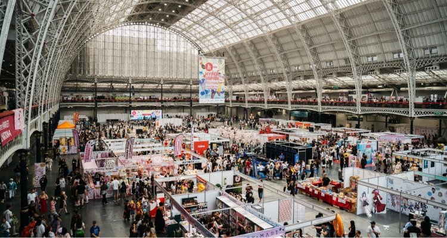

HYPER JAPAN calls itself the UK's biggest Japanese culture event, and for three days a year it takes over Olympia's Grand Hall with a food market, a stage running idol pop to taiko drumming, and enough cosplay to make the District line home worth timing carefully. The 2026 festival ran Friday 24 to Sunday 26 July; 2027 dates haven't been announced.

> 💡 **The Short Version:** A single day starts at **£28.35** for Friday, rising to **£41.55** for Saturday and **£31.50** for Sunday, all including booking fees. A **3 Day Pass** covering the whole run is **£78.75**. **Friday** — the shortest day and the cheapest ticket — is the quietest session; **Saturday** carries the Cosplay Masquerade, most of the headline music and the highest price. Cosplay is welcome, but metal blades, gun-shaped props and anything over 1.5m wide are banned outright. The nearest station is **Kensington (Olympia)**, on the Overground's Mildmay line every day; the District line's direct shuttle from Earl's Court only runs at weekends.

## Tickets: what each one gets you

Every ticket is for a specific day and time slot — HYPER JAPAN doesn't sell a walk-up single "session" ticket beyond that. Prices below are the 2026 festival's, including Gigantic's booking fee.

| Ticket | Price | What it gets you |
| --- | --- | --- |
| **Friday General Admission** | £28.35 | Entry Friday 12:00–20:00 only — the shortest, cheapest day |
| **Saturday General Admission** | £41.55 | Entry Saturday 10:00–20:00 — the longest day, the Cosplay Masquerade and most headline stage slots |
| **Sunday General Admission** | £31.50 | Entry Sunday 10:00–17:00, including the Hyper Fashion Show |
| **2 Day Pass** | £69.30 | Saturday 10:00 through Sunday 17:00 |
| **3 Day Pass** | £78.75 | All three days, Friday 12:00 through Sunday 17:00 |
| **Tomodachi Bundle** | From about £110 (5 tickets, Sunday early bird) to about £173 (Saturday) | Five General Admission tickets for one day, bought in multiples of five — a group discount, not a separate ticket type |
| **Children 10 and under** | Free | Up to three per full-price adult ticket, but still needs reserving |
| **Carer ticket** | Free | Alongside a full-price adult ticket, with proof of disability (PIP, DLA, Blue Badge or Access Card) |

Workshops and meet-and-greets sit on top of a day ticket, not replacing one: the Awaodori dance workshop ran £17.81 and Japanese mask-making £38.16 in 2026, each bookable only alongside an entry ticket for the same date, and the smaller sessions (mask-making in particular) sold out days ahead. A day ticket also does not include re-entry by default — leave the hall and you queue again at the main entrance, wristband in hand.

## Which day to pick

**Friday is the one to book if you want space to look at the market.** It's the only weekday of the three, it runs just eight hours against Saturday's ten, and HYPER JAPAN prices it a third cheaper than Saturday — a fair signal of where the organiser expects the smaller crowd. Friday's stage still runs a full programme (rock band The Sixth Lie, taiko soloist Takuya Taniguchi and singer-songwriter UPIKO among 2026's line-up), just without the Saturday-only Cosplay Masquerade or the acts scheduled for the busiest slots.

**Saturday is the one to avoid if you dislike queuing.** It's the longest day, it's priced highest, and it carries the Cosplay Masquerade, the headline anisong sets and the day most families attend. HYPER JAPAN's own advice for busy periods is to arrive early for anything you don't want to miss, since popular shows can hit capacity and hold visitors at the door until space frees up.

## What's inside: the market

The market runs food, drink and craft stalls, not one themed "street" — HYPER JAPAN dropped its dedicated Sake Experience area for 2026, but sake was still poured everywhere: **KANPAI**, the UK's first sake brewery, alongside umeshu and sake specifically imported from four producers in Wakayama Prefecture, plus Suntory Toki whisky and Ozeki and MIO sparkling sake on the drinks side. On the food side, **Dragonfly Foods** brought UK-handmade organic tofu, **Kewpie** its mayonnaise, and **Japan Centre** — the Panton Street shop that's also the best walk-in Japanese food counter in the West End, covered in our [Japanese restaurants guide](/articles/best-japanese-restaurants-london/) — ran its own stall alongside importers like Taste of Japan and Unisnacks.

*The market floor at Olympia.*

**Bring cash as a backup.** HYPER JAPAN says it's working towards a cashless event, but there are no cash machines inside the venue and some traders still only take cash.

## Cosplay: what's allowed and what isn't

Cosplay is actively encouraged — there's a dedicated Cosplay Masquerade on the Saturday stage — but the rules are specific and checked at the door:

- **No metal blades of any kind**, sharp or blunt: swords, axes, kunai, or costume weapons with metal parts.
- **No gun-shaped props**, regardless of what they're made from, including airsoft and BB guns.
- **No bokken, nunchucks or knuckledusters**, and no hard bats, clubs or golf clubs.
- **No laser pointers, drones, vuvuzelas or silly string.**
- **Nothing over 1.5m wide or 2m tall** — large wings, banners and puppets included.
- **No flame, smoke, or exposed electrical arcs** built into a costume or prop.
- **No fetish wear or nudity** as general attire.

Staff can search bags and props on entry, and the organiser reserves the right to turn away anything that doesn't meet the rules on the day — better to check a specific prop against the list before building a costume around it.

## The stage: what it actually sounds like

HYPER JAPAN's stage moves between genres inside a single hour, not sticking to one: 2026 ran J-rock bands (**The Sixth Lie**, **QUEEN BEE**, **Re:O**), anisong vocalists (**Eir Aoi**, known for theme songs across the anime charts), idol acts (**UPIKO**, **Sacred Fleramo**), a viral dance troupe (**avantgardey**), and traditional performance sitting right alongside it — **Gagaku** court music, **Awa Odori** festival dance, a **Shorinji Kempo** martial arts demonstration and taiko soloist Takuya Taniguchi. Sunday closed with the **Hyper Fashion Show**, and Sunday afternoon also carried a voice actor conversation with **Chiaki Kobayashi** (Frieren, Hell's Paradise). None of it needs an add-on ticket — the stage programme is included in day entry, only the smaller hands-on workshops cost extra.

## Getting to Olympia

**Kensington (Olympia)** station sits at the venue's own entrance, on Olympia Way — a different station from High Street Kensington, a 15-minute walk away, so check which one a map app is sending you to.

> ⚠️ **The District line doesn't reliably reach Olympia on a Friday.** Its shuttle from Earl's Court is a weekend-and-public-holiday service — for the Friday session, plan on the Overground from the start rather than assuming the Tube map's direct line will be running.

- **London Overground's Mildmay line** runs every day HYPER JAPAN is open, roughly every 15 minutes off-peak, one way to **Clapham Junction** and the other via Willesden Junction to **Stratford**.
- **Southern services** call roughly hourly, to **East Croydon** and **Watford Junction**.
- **The District line** only runs a direct shuttle to Kensington (Olympia) from Earl's Court at weekends and on public holidays, plus occasionally when Olympia has an event on — so it's likely to run across the Saturday and Sunday sessions, but check TfL before relying on it for the Friday session, since a weekday shuttle isn't guaranteed. On a weekday, change at **West Brompton** from the District line onto the Overground instead.
- **Parking** has to be pre-booked through the venue, ideally more than 24 hours ahead, with cost depending on length of stay.

Olympia is step-free, with lifts to the accessible entrance, which shares the main entrance, not a separate route.

## Where to stay

For the shortest walk, **[Hyatt Regency London Olympia](hotel:hyatt-regency-london-olympia)** sits inside the redeveloped Olympia site itself, about a minute from the station, at roughly £220 a night. For less money, **[Premier Inn London Kensington (Olympia)](https://www.premierinn.com/gb/en/hotels/england/greater-london/london/london-kensington-olympia.html)** on West Cromwell Road has air conditioning in every room and is a short walk from Earl's Court station. Our [where to stay in Kensington guide](/articles/where-to-stay-kensington/) covers both in full, along with cheaper options in Earl's Court, and our [Kensington area guide](/articles/kensington-area-guide/) covers the neighbourhood itself — Holland Park's Kyoto Garden is a fitting stop either side of the festival.

## Other anime and J-culture events in London

HYPER JAPAN isn't the only date on this calendar:

- **AnimeCon London**, 3–4 October 2026, also at Olympia, from £25 — a two-day anime and manga convention with a Cosplay Catwalk, Artist Alley and voice actor guests including Justin Briner and Jason Liebrecht.
- **[MCM Comic Con London](/articles/mcm-comic-con-london/)**, 23–25 October 2026 at ExCeL — the UK's biggest pop culture convention, wider than anime alone, spanning comics, gaming and film and TV guests.

Our [exhibitions and conventions calendar](/articles/exhibitions-conventions-london/) tracks these and the rest of London's convention year in one place. Olympia's Grand Hall doesn't stand empty between them, either — **[The Ideal Home Show](/articles/ideal-home-show-london/)** takes over the same halls 2–11 April 2027, at the same station and the same nearby hotels covered on this page.

## 2027 dates and a winter edition

HYPER JAPAN hadn't announced 2027 dates as of late September 2026. The 2026 festival ran Friday 24 to Sunday 26 July, and exhibitor registration for that show had opened by late January 2026 — so a 2027 announcement is more likely to land over the winter than close to summer 2027. There's no HYPER JAPAN Christmas market or winter edition planned in London in 2026: Olympia's own festive events in winter 2026, the Spirit of Christmas Fair and the Ideal Christmas Show, run independently of HYPER JAPAN.
