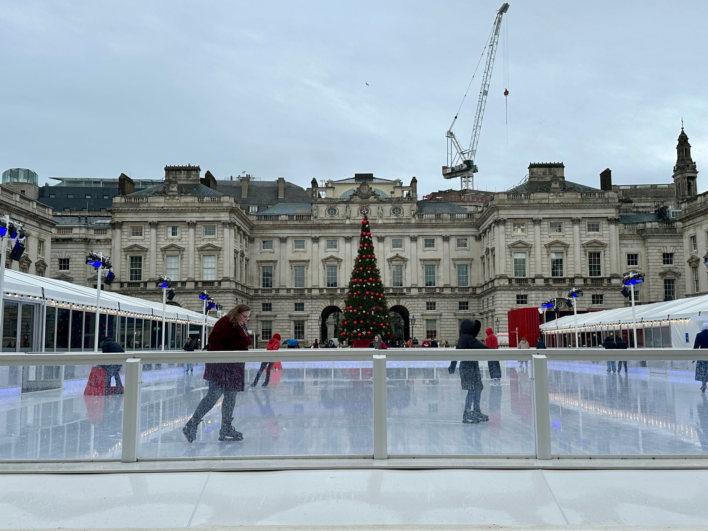
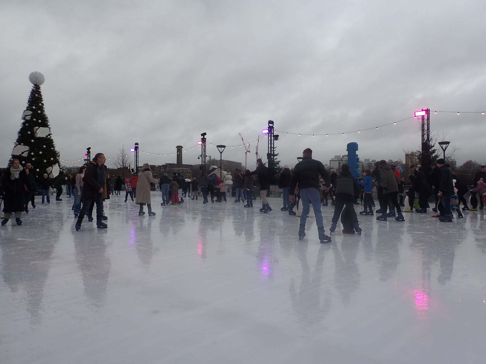

London's outdoor rinks go up in the first three weeks of November and come down in the first days of January. Five are confirmed for 2026-27, in a Georgian courtyard, a Tudor palace, a Greenwich palace, the riverside at Battersea and the middle of Hyde Park. Three that people still search for are not running.

> 💡 **The Short Version:** **Somerset House** is the classic: an 18th-century courtyard and a 40ft tree, **11 November 2026 to 10 January 2027**, adults **£13–£28.50**, children **£11–£15**, plus **£1.50 a ticket**. It went on sale on **25 September**; prices vary through the run, and early booking gets the lowest. **Hampton Court Palace** (20 November to 3 January, adults £19.50–£21.50) is the one with the Tudor backdrop. **Battersea Power Station's Glide** opens first, on **6 November**, with three rinks and a 200-metre riverside trail. **The Queen's House** in Greenwich (18 November to 3 January) is the quieter one. **Winter Wonderland's** rink is the biggest, but you need an entry ticket on top. **Not running:** the Natural History Museum (closed for good), Canary Wharf (a break in 2026) and the Tower of London. Every outdoor rink closes on **Christmas Day**, and sessions last **45 minutes**.

*Dates, prices and rules are from each rink's own site in late September 2026.*

---

> 🧭 **Plan the rest of it:** [Christmas in London](/articles/christmas-in-london/) · [Hyde Park Winter Wonderland](/articles/hyde-park-winter-wonderland/) · [Christmas lights walk](/articles/christmas-lights-walk-london/) · [Christmas Day restaurants](/articles/christmas-day-restaurants-london/) · [New Year's Eve](/articles/new-years-eve-london/)

## The rinks at a glance

| Rink | Where | 2026-27 dates | Adult price | The catch |
| --- | --- | --- | --- | --- |
| **Somerset House** | Strand, WC2 | 11 Nov – 10 Jan | £13–£28.50 + £1.50 fee | Prices vary by session; book early for the lowest |
| **Hampton Court Palace** | East Molesey, Surrey | 20 Nov – 3 Jan | £19.50 off-peak, £21.50 peak | 35 minutes by train from Waterloo |
| **Glide, Battersea Power Station** | Battersea, SW11 | 6 Nov – 3 Jan | Adult, child, family and student tickets | Sold out online means sold out on the door |
| **The Queen's House** | Greenwich, SE10 | 18 Nov – 3 Jan | Early bird £15.12–£24.19 with booking fee | Discounts only on set weekday sessions |
| **Winter Wonderland** | Hyde Park, W2 | 19 Nov – 3 Jan | £12.65–£19.25 | A separate entry ticket, £1–£8.25, as well |
| **Alexandra Palace** (indoor) | Wood Green, N22 | Open all year; Festive Skate dates not yet announced | £11.75 off-peak, £12.75 peak | Up a steep hill, and indoors |
| **Leicester Square** | West End, WC2 | 2026 dates not yet announced; 2025 ran 1 Nov – 4 Jan | Not yet published | 2026 season not yet confirmed |

Every outdoor rink skates in the rain, and none refunds for bad weather unless the rink itself cancels the session. All five confirmed rinks include skate hire in the ticket.

---

## Somerset House

*Somerset House in December 2025. Photo: Matt Brown, [CC BY 4.0](https://creativecommons.org/licenses/by/4.0/), via [Wikimedia Commons](https://commons.wikimedia.org/wiki/File:Somerset_House_ice_rink_2025-12-09.jpg).*

**The rink fills the Edmond J. Safra Fountain Court**, the quadrangle behind the Strand, with the building on all four sides and a 40ft Christmas tree. After dark, Skate Lates bring DJs to selected evenings from 12 November, and a first K-pop party on the ice is booked for **Monday 23 November**. Watching is free: anyone can walk into the courtyard, the viewing platform or the rinkside Virgin Atlantic Clubhouse without a ticket.

**Eat and drink:** The Chalet by Jimmy Garcia serves raclette with charcuterie and potatoes, from 12 November to 31 December. It keeps short hours: closed Monday to Wednesday in November, dinner only on Mondays and Tuesdays in December, and closed on several dates in both months. The huts in the courtyard do hot chocolate and German hot dogs without the booking.

**Dates and hours:** **Wednesday 11 November 2026 to Sunday 10 January 2027**, a week longer than any other outdoor rink. Sessions start on the hour from 11am to 9pm, with 9am, 10am and 10pm sessions on selected dates. Each lasts **45 minutes**; arrive 30 minutes early for skates. Three 90-minute sessions run at noon on 11, 17 and 23 November. Christmas Eve's last session is 5pm, **Christmas Day is closed**, Boxing Day and New Year's Day start at noon, and New Year's Eve's last session is 5pm.

**Price and booking:** adults **£13 to £28.50**, children 12 and under **£11 to £15**, plus a **£1.50 fee per ticket**. Tickets went on public sale at **10am on Friday 25 September 2026**, and Somerset House says prices vary through the run, with the lowest going to early bookers. A family booking (at least one adult and one child family ticket, up to three children per adult) takes 10% off automatically. Concessions are 20% off for students, Blue Light Card holders and those on Universal Credit, Pension Credit or PIP, at the 11am, 12pm, 1pm and 2pm sessions on weekdays from 11 to 27 November and 4 to 8 January. Book at [somersethouse.org.uk](https://www.somersethouse.org.uk/whats-on/skate-somerset-house).

**Children:** under-13s must be on the ice with an adult, one adult to five children. Skates start at a child's size 6, which the rink says fits a child of about two. Skate aids are for children aged 8 and under, first come first served, and cannot be booked.

**Getting there:** Temple station is 2 minutes' walk; Covent Garden, Charing Cross and Embankment are about 8.

**The one thing that decides it:** a small number of tickets for each session are held back for the box office in Seamen's Hall and sold from opening until noon, up to six per person, so a sold-out day is not always lost. Somerset House is **cashless**, and bags must go in the cloakroom: the first item is free and each one after is £2. Exchanges cost £4.50 a ticket and close 48 hours before the session.

---

## Hampton Court Palace

**The rink sits in front of Henry VIII's palace**, and the skate exchange and café have been redesigned on the palace's Orangery, in rustic wood and greenery. The operator promises fewer skaters than before. Weekends bring live ice sculpting and a Skating Santa on dates still to be announced, and every Sunday from 6pm to 9pm is a Sunday Session aimed at families.

**Eat and drink:** coffee and hot chocolate from Department of Coffee & Social Affairs, croissants, sausage rolls and sandwiches from Deelight Bakery, and mulled wine, hot toddies and festive cocktails.

**Dates:** **Friday 20 November 2026 to Sunday 3 January 2027**. Sessions last up to **45 minutes**; arrive 30 to 40 minutes early.

**Price and booking:**

| Ticket | Off-peak | Peak |
| --- | --- | --- |
| Adult (13+) | £19.50 | £21.50 |
| Student, with ID | £18.00 | £21.50 |
| Child (3–12) | £14.50 | £16.00 |
| Family (2 adults + 2 children, or 1 + 3) | £59.50 | £65.50 |
| Wheelchair user, carer free | £15.00 | £15.00 |

Groups of ten or more get a further discount. Bookings are open at [hamptoncourtpalaceicerink.co.uk](https://www.hamptoncourtpalaceicerink.co.uk/opening-times-prices/). You can move a booking to another session up to 48 hours before, but the booking fee is not refunded.

**Children:** no one under 3 on the ice; under-13s with an adult aged 18 or over, up to five children per adult. Skate aids are £6 on the day, first come first served, and staff measure each child before handing one over. Bob skates start at a child's size 6.5.

**Getting there:** Hampton Court station, on South Western Railway from Waterloo in about 35 minutes, is across the bridge from the palace gates.

**The one thing that decides it:** it is the only rink here outside central London, so allow half a day. The rink ticket does not get you into the palace, whose own Christmas walkthrough, The Winter Palace, needs palace admission (see [Christmas in London](/articles/christmas-in-london/)). The site is **cashless**.

---

## Glide at Battersea Power Station

*The rink at Battersea Power Station in December 2022, with penguin skate aids on the ice. Photo: Marathon, [CC BY-SA 2.0](https://creativecommons.org/licenses/by-sa/2.0/), via [Wikimedia Commons](https://commons.wikimedia.org/wiki/File:The_ice_rink_at_Battersea_Power_Station_-_geograph.org.uk_-_7373655.jpg).*

**Not one rectangle but three linked rinks and a 200-metre skate trail** along the Thames, laid out in front of the power station with a 30ft tree in the middle. Vintage fairground rides and a churros stand sit alongside.

**Eat and drink:** the Glass House bar looks over the ice and is free to walk into, skating or not. For the rest of the power station's restaurants, see our [Battersea area guide](/articles/battersea-area-guide/).

**Dates and hours:** **Friday 6 November 2026 to Sunday 3 January 2027**, the earliest opening of the season. Sessions last about **45 minutes**; arrive 40 minutes early. On weekday mornings early in the season, Extended Skate sessions let you stay on until 2.40pm (6 to 20 November) or 1.40pm (23 November to 4 December). The last session is 9pm on Christmas Eve and Boxing Day and 8pm on New Year's Day. **Christmas Day is closed**, and **New Year's Eve** adds a New Year's Skate from 11pm to 12.15am.

**Price and booking:** adult (13+), child (3–12), family (2 adults and 2 children, or 1 and 3) and wheelchair-user tickets, sold by session on the [Glide booking calendar](https://glidebatterseapowerstation.co.uk/tickets/), with a **£2.50 fee per order**. Student tickets, with ID, include a drink at the Glass House and are sold for Monday to Thursday sessions up to 10 December. An unlimited season pass is **£290**. You can move to another date up to a week ahead for £3 a ticket plus any price difference; there are no refunds.

**Children:** 3 and over only, and children 3 to 12 must be with an adult aged 18 or over who is skating. Thirty penguin skate aids are hired at the counter for **£6**, first come first served, for children under a metre tall in skates. Bob skates, two blades that strap on over a shoe, start at a child's size 6.

**Getting there:** Battersea Power Station station on the Northern line (Charing Cross branch) is a short walk; Uber Boat stops at Battersea Power Station Pier, five minutes away.

**The one thing that decides it:** the box office sells on the day, sometimes at a higher price, but when a session has **sold out online there is nothing left at the door**. Cloakroom £2 for small items, £4 for large.

---

## The Queen's House, Greenwich

**The rink is laid beside Inigo Jones's Queen's House**, inside the Maritime Greenwich World Heritage Site, with Canary Wharf across the river. The Queen's House itself is free, so you can go in before your session.

**Eat and drink:** the Zero Degrees café beside the viewing area.

**Dates and hours:** **Wednesday 18 November 2026 to Sunday 3 January 2027**, **10am to 9pm**. Sessions last **45 minutes**; arrive 30 to 40 minutes early.

**Price and booking:** the [booking page](https://events.liveit.io/the-queens-house-ice-rink/queens-house-ice-rink-2026/) lists early-bird adult tickets at **£15.12** for a standard session, **£22.18** peak and **£24.19** super-peak, and children (3–12) at **£10.08**, **£17.64** and **£20.16**, each including the per-ticket booking fee. Peak means weekends and holidays. For 2026 the rink also runs:

- **Kids skate free** on Tuesdays from 4pm to 6pm, 23 November to 18 December, with a paying adult.
- **Parent and Mini Skater**, a quieter session on weekdays from 2pm to 3pm, 18 November to 18 December, £15 for the two.
- **SEND sessions** on Mondays from 3pm to 4pm, 23 November to 18 December.
- **Students** skate for £10 on Tuesdays and Wednesdays, 18 November to 18 December.

**Children:** no under-3s on the ice; under-13s with an adult aged 18 or over, up to five children per adult. Skate aids are **£5**, first come first served, for children under 130cm, and Snowman aids are there for anyone under 16. Helmets are free.

**Getting there:** Greenwich and Maze Hill stations are each about 10 minutes' walk, and Greenwich Pier is a few minutes for the Uber Boat. The [Greenwich area guide](/articles/greenwich-area-guide/) covers the rest of the day.

**The one thing that decides it:** it runs more discounted sessions than any other rink here, and the kids-skate-free Tuesdays make it the cheapest for a family before Christmas. The site is cashless; cloakroom £2 an item.

---

## Hyde Park Winter Wonderland

**The UK's largest open-air rink**, by the operator's count, is laid around the Victorian bandstand in Winter Wonderland, open **Thursday 19 November 2026 to Sunday 3 January 2027**, every day but Christmas Day. Sessions are **45 minutes**, on the hour from 10am to 9pm, with skate hire included.

| | Off-peak | Standard | Peak |
| --- | --- | --- | --- |
| Adult | £12.65 | £17.05 | £19.25 |
| Child | £9.35 | £11.55 | £13.75 |
| Family | £37.40 | £46.20 | £55.00 |

**The catch is the entry ticket.** Everyone needs one to get through the gate, £1 off-peak to £8.25 peak in advance, unless you spend £25 online in one transaction, which makes entry free. The pricing band follows your entry slot, so an off-peak weekday puts the rink into off-peak pricing too. Age 3 and up; bags go in a compulsory £2 cloakroom. Blue Gate, by Hyde Park Corner station, is nearest the rink.

Every price, gate and quiet time is in our **[Hyde Park Winter Wonderland guide](/articles/hyde-park-winter-wonderland/)**.

---

## Alexandra Palace

**A permanent indoor rink** at Ally Pally, open all year, that turns into **Festive Skate** at Christmas: a tree, lights, Christmas music and falling snow, with mince pies, mulled wine and Baileys hot chocolate in the East Court Café. **2026 dates are not yet announced; last season's ran to 5 January 2026.** Festive Skate sessions last 90 minutes.

**Price:** standard **£11.75 off-peak, £12.75 peak**; under-12s £10.50–£11.50; under-5s £7.75–£8.75; over-65s £10.50–£11.50. Skate hire is included, in sizes from a baby 6 to an adult 13. Seal, penguin and snowman skate aids are **£7.50**, sold at the rink and not online. Adults who are not skating but are supervising under-16s need a spectator ticket, from £2.50.

**Children:** under-8s must be accompanied on the ice.

**Getting there:** Alexandra Palace station (Great Northern, from Moorgate and King's Cross), then a steep walk up through the park, or the W3 bus from Wood Green. Book at [alexandrapalace.com](https://www.alexandrapalace.com/the-ice-rink/book-a-skate/).

**The one thing that decides it:** it is indoors, so no wet ice and no rain, and it is the cheapest skate in this guide.

---

## Leicester Square

**Skate Leicester Square**, Underbelly's circular rink in the middle of the square, ran last winter from **1 November 2025 to 4 January 2026**, from 10am to 10pm next to the Christmas market stalls. **Its 2026 dates are not yet announced.** Leicester Square station is a minute's walk. If it returns, it is the most central rink in London and the easiest to add to an evening in the West End; its [site](https://www.skateleicestersquare.co.uk/) will carry the dates.

---

## The rinks that are not running

- **Natural History Museum.** The museum's rink has **closed for good** after 16 years. The gardens it stood on have been turned into wildlife gardens, which are free to walk round. Somerset House is a straight run from South Kensington to Temple on the District or Circle line.
- **Canary Wharf.** Ice Rink Canary Wharf is **taking a break for the 2026 season** and will not operate this winter. Canary Wharf's Winter Lights, in January, go ahead; see the [Canary Wharf area guide](/articles/canary-wharf-area-guide/).
- **Tower of London.** The moat rink ran in the mid-2010s, and **no rink is announced for 2026**.

## Skating out of season

The outdoor rinks all close in early January. From then until November, skate indoors at [Alexandra Palace](https://www.alexandrapalace.com/the-ice-rink/book-a-skate/), [Queens](https://queens.london/) in Bayswater, the two Olympic-size rinks at [Lee Valley Ice Centre](https://www.better.org.uk/leisure-centre/lee-valley/ice-centre) in Leyton, or Streatham.

---

## Before you go

**Arrive 30 to 40 minutes early.** Every session is timed from its start, not from when you get your skates on, and a late arrival gets only what is left.

**Wear thick socks and gloves, and bring spare socks.** Outdoor ice carries surface water in rain or mild weather, so a fall means wet clothes.

**Book online.** Somerset House keeps a few tickets for each session at its box office until noon, but at Glide a session that has sold out online has no door tickets left.

**All five outdoor rinks are closed on Christmas Day**, and Somerset House's last sessions on Christmas Eve and New Year's Eve start at 5pm. For the day itself, see our [Christmas Day restaurants guide](/articles/christmas-day-restaurants-london/); for the lights, the [Christmas lights walk](/articles/christmas-lights-walk-london/) runs past Covent Garden, 8 minutes from Somerset House.

## Related guides

- 🎄 **[Christmas in London](/articles/christmas-in-london/)**: the markets, light trails, grottos and what has stopped running
- 🎡 **[Hyde Park Winter Wonderland](/articles/hyde-park-winter-wonderland/)**: every price, gate and quiet time
- ✨ **[Christmas lights walk](/articles/christmas-lights-walk-london/)**: Oxford Street to Trafalgar Square in ten stops
- 🍽️ **[Christmas Day restaurants](/articles/christmas-day-restaurants-london/)**: where to eat on the 25th
- 🎆 **[New Year's Eve in London](/articles/new-years-eve-london/)**: fireworks tickets and the alternatives
- 🏙️ **Area guides for the rinks:** [Covent Garden](/articles/covent-garden-area-guide/) · [Battersea](/articles/battersea-area-guide/) · [Greenwich](/articles/greenwich-area-guide/) · [Canary Wharf](/articles/canary-wharf-area-guide/)
