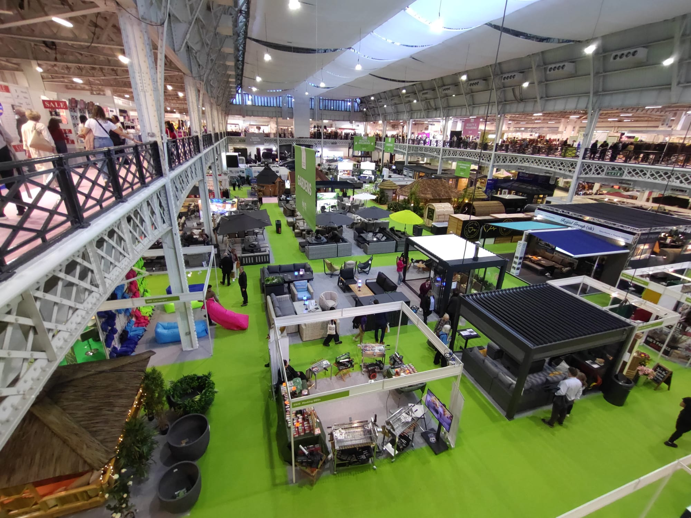
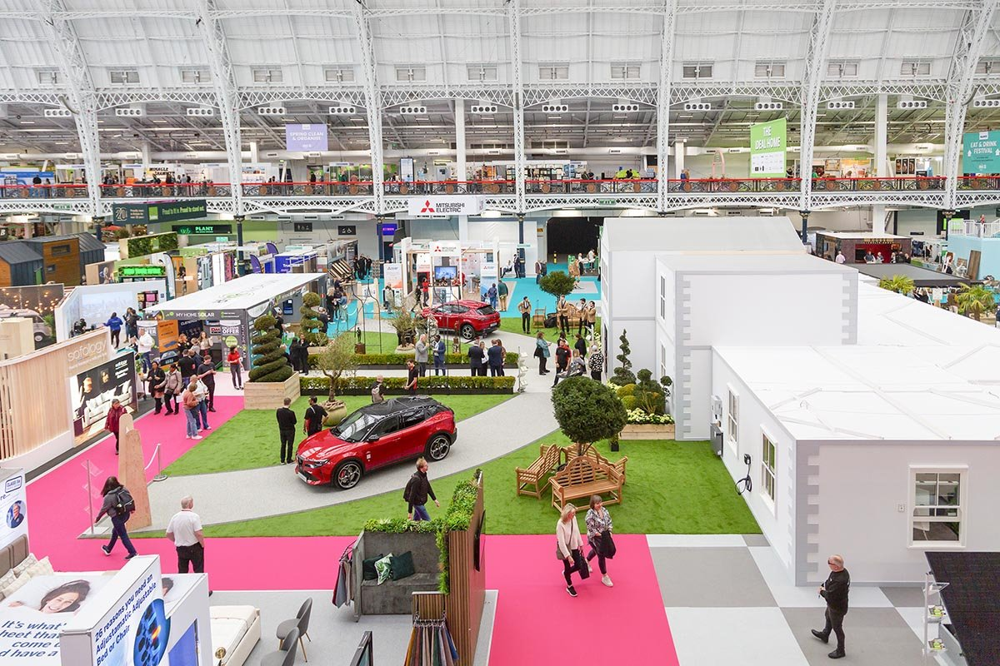
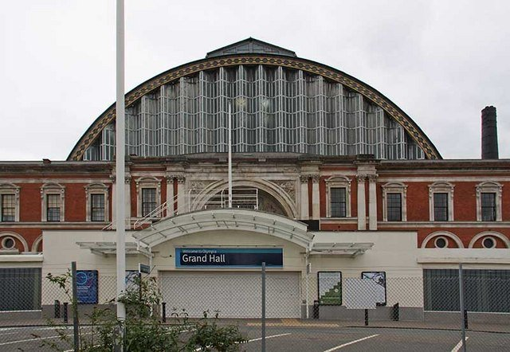

**The Ideal Home Show returns to Olympia London from Friday 2 to Sunday 11 April 2027**, ten days and two full weekends of show homes, gardens, kitchens and the food hall that comes free with every ticket. It has run at some London venue every year since 1908, and the 2026 edition — 10 to 19 April — drew more than 136,000 visitors to over 600 exhibitors.

The show itself does not sell weekday and weekend tickets at different prices for 2027, at least not yet. What it does have, already, is a real gap between the cheapest way in and the one with a goody bag and a glass of prosecco attached.

> 💡 **The Short Version:** **2–11 April 2027, Olympia London.** General Admission from **£12** in advance; **VIP is £50** with a lounge, prosecco and a goody bag worth up to £75; a **Tipsy Workshop ticket is from £40**. **Children under 15 go free** with a paying adult. No weekday/weekend price split announced for 2027 yet — the 2026 show charged £14 midweek and £16 at the weekend. Aim for a **weekday morning in the second week** for the calmest visit. Get there on **London Overground or Southern Rail to Kensington (Olympia)** — the District line Tube only runs there at weekends. **Pre-book parking**; spaces are limited and Olympia sits inside the ULEZ.

## Tickets and prices

| Ticket | Price | What you get | Sells out? |
| --- | --- | --- | --- |
| **General Admission (advance)** | **From £12** | Full-day entry to every hall — the Show Home, Ideal Gardens, Smart Home, DIY Live, Stage Talks and the co-located Eat & Drink Festival | Popular weekend afternoons book up closest to the date |
| **VIP** | **£50** | Everything above, plus the private VIP Lounge, a goody bag worth up to £75, a complimentary glass of prosecco, unlimited tea, coffee and water, and free cloakroom | Yes — VIP is a limited daily allocation |
| **Tipsy Workshop** | **From £40** | Full show entry plus a hosted, hands-on craft, floral, décor or chocolate-making session with a glass of fizz and a keepsake to take home | Sessions run at fixed times through the day and are capped |
| **Group (10 or more)** | On enquiry | A discounted rate for parties, clubs, schools or tour groups, booked as one reservation | — |
| **Children under 15** | Free | Free entry with a paying adult ticket | — |

Every ticket is sold through See Tickets, the show's official partner, and is issued as an e-ticket only — print it or show it on your phone. Tickets are non-refundable, but you can move to a different day for the price difference between a weekday and a weekend ticket, once that split exists.

**Advance is always cheaper than the door.** Walk-up tickets are sold on-site, but the show does not publish a door price on its own site, so treat the advance figures above as the ones to plan around and book ahead rather than assume you can turn up and pay less.

## What's actually in the show

The **Show Home** is the anchor exhibit every year, and for 2027 its theme is **Global Living** — a run of rooms, each styled after a different corner of the world, built around design, culture and lifestyle rather than one single look. Around it sit the show's other permanent sections:

- **Ideal Gardens** — outdoor living, planting and garden buildings laid out on artificial turf, with a strong lean towards sustainability and pet-friendly design for 2027.
- **The Design Studio** — free one-to-one consultations with professional interior designers; bring photos or plans of your own room and book a slot in advance closer to the show.
- **Smart Home**, presented by TV technologist Jason Bradbury — the latest connected appliances and home tech, demonstrated rather than just displayed.
- **DIY Live** and the **BBQ Academy**, sponsored by La Española — live, stage-based demonstrations rather than static stands.
- **Tipsy Workshops** — the hands-on paid sessions in crafts, florals, home décor and chocolate-making, each with a complimentary glass of fizz.
- **Stage Talks** — celebrity guests and industry experts across the show's stages. Past years have featured Martin Lewis, George Clarke, Nick Knowles and Alice Beer; the 2027 line-up has not been announced yet.

*Ideal Gardens, seen from the mezzanine.*

*The show floor at Olympia.*

### The Eat & Drink Festival is included, not an add-on

Every Ideal Home Show ticket also covers the **Eat & Drink Festival**, run alongside it in the same halls rather than behind a separate gate. Expect live demonstrations from chefs, street food and cocktail stalls under the banner "The Great Eat", and the **Artisan Producer's Market** for food and drink to take home. Beyond that, ordinary food and drink stalls and seating areas are dotted through the venue for a quicker stop between halls.

## Which day to go

There's no published "quiet day" league table from the organiser, but two real facts point the same way. First, the show's own copy pitches a **weekday out** against a **weekend full of inspiration** — marketing language that is really telling you which one is the fuller day. Second, **weekday hours are shorter**: 10am to 5pm against 10am to 6pm at the weekend, which fits a thinner rather than a longer weekday programme.

Put those together and a **weekday morning in the second week** — once the opening-weekend crowd has thinned out — is the best bet if you want room to sit through a Stage Talk or get a Design Studio slot without a wait. The two weekends inside the run, 3–4 and 10–11 April 2027, are the busiest points, particularly the closing Sunday.

## Getting to Olympia

The venue is **Olympia London, Hammersmith Road, London W14 8UX**, and its own station, **Kensington (Olympia)**, sits right next to it in Zone 2 — but it isn't a stop most Tube maps show as fully served, which catches people out.

*Olympia's Grand Hall entrance.*

**By Overground and rail, every day:** Kensington (Olympia) is served by London Overground's Mildmay line, with direct trains from Clapham Junction, Shepherd's Bush, Willesden Junction, West Hampstead and Stratford, plus Southern Rail services to and from Watford Junction. If you're coming from Clapham Junction, a train towards Milton Keynes from Platform 16 does the trip in about 10 minutes; the Overground from Platform 2 runs more often. Three or more people travelling together can use **GroupSave** for a third off rail fares.

**By District line, weekends only:** the District line runs directly between Earl's Court and Kensington (Olympia) on Saturdays and Sundays — check before you travel, as it isn't guaranteed. **Monday to Friday**, change at West Brompton for a two-minute Overground hop, or walk from **West Kensington** (8 minutes) or **Barons Court** (9 minutes).

**By Central, Piccadilly or Circle line:** change at **Shepherd's Bush** for a two-minute Overground link on the Central line; from the Piccadilly line, Barons Court is a 9-minute walk; from the Circle line, High Street Kensington is a 12-minute walk or a 4-minute bus ride.

**By bus:** routes 9, 23, 27, 28, 49 and 391 all stop a short walk from the venue, with N9, N23, N27 and N28 running through the night.

**By coach:** National Express services arrive at Victoria Coach Station; from there it's the District line one stop to West Brompton, then a one-stop Overground hop to Kensington (Olympia).

## Parking

Olympia has on-site parking, but **spaces are limited and pre-booking is strongly advised** rather than optional. Pre-booked cars and vans enter from **Blythe Road or Sinclair Road** — not Olympia Way, which is not open to visitor traffic.

| Duration | Pay on the day | Pre-booked |
| --- | --- | --- |
| Up to 1 hour | £8 | — |
| 1–2 hours | £13 | — |
| 2–4 hours | £23 | — |
| 4–6 hours | £29 | — |
| 6–10 hours | £33 | — |
| 10–24 hours | £46 | **£40** |
| Full-day pre-book rate | — | **£35** |

A £1.50 booking fee applies to every booking. Tickets are valid from 7am Monday to Saturday, or 8am on Sunday, until the car park closes. **Disabled bays are first-come, first-served**, though pre-booking guarantees you a space in the motor rail car park even if the bay itself isn't. Olympia sits inside the **Ultra Low Emission Zone**, so check your vehicle is compliant before you drive in.

## Where to stay

Two hotels sit inside the rebuilt Olympia complex itself, a minute's walk from the show's doors: **[Hyatt Regency London Olympia](hotel:hyatt-regency-london-olympia)**, a full-service hotel from about £220 a night, and the cheaper **[citizenM London Olympia](hotel:citizenm-london-olympia)**, from about £150, with its compact design rooms just across the site. Our **[where to stay in Kensington, Earl's Court and Olympia](/articles/where-to-stay-kensington/)** guide covers both in more detail, along with cheaper options a short Overground or bus ride away in Earl's Court.

## The Ideal Christmas Show

Olympia's Grand Hall also hosts a separate seasonal event from the same organiser, Media 10: **The Ideal Christmas Show**, running **26–29 November 2026**, with tickets from £16 and its own VIP upgrade. It's a Christmas shopping and entertainment day — more than 300 brands, festive workshops and live music — rather than a home-improvement show, so don't confuse the two if you're planning an Olympia trip before the Ideal Home Show comes back in April.

## Continue planning your visit

- 🏛️ **[Kensington Area Guide](/articles/kensington-area-guide/)** — Kensington Palace, Holland Park and the Kyoto Garden, on Olympia's doorstep.
- 🛏️ **[Where to Stay in Kensington, Earl's Court and Olympia](/articles/where-to-stay-kensington/)** — every hotel near the show, sorted by price and distance from the station.
- 🎪 **[Exhibitions and Conventions in London](/articles/exhibitions-conventions-london/)** — every major show at Olympia, ExCeL and beyond, in one calendar.
- 🚇 **[Getting Around London](/articles/getting-around-london-transport-guide/)** — how contactless capping and the Overground work if this is your first stop in the city.
