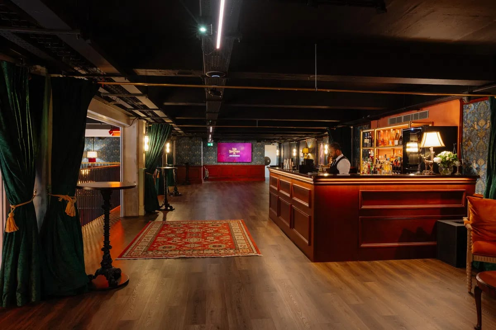
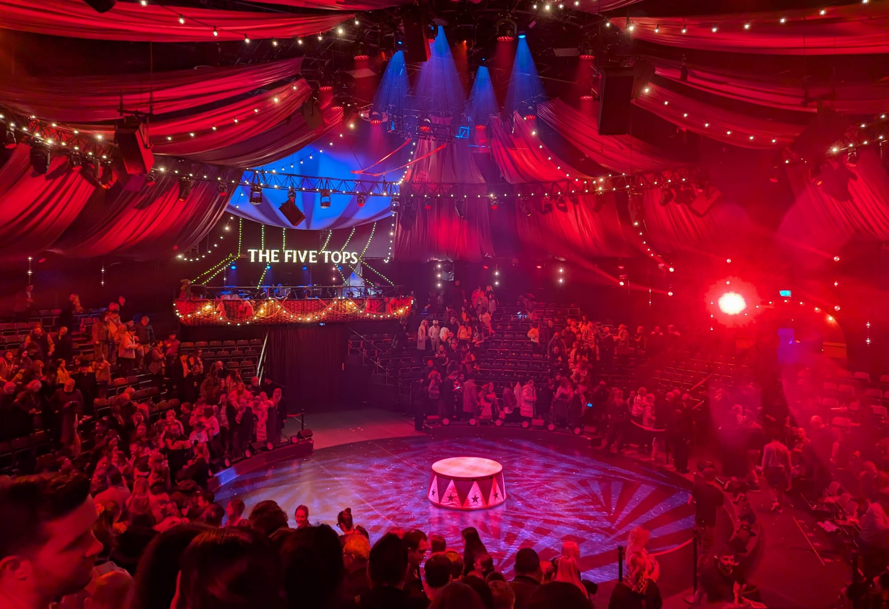
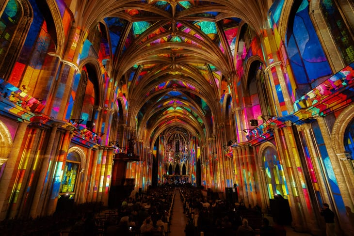
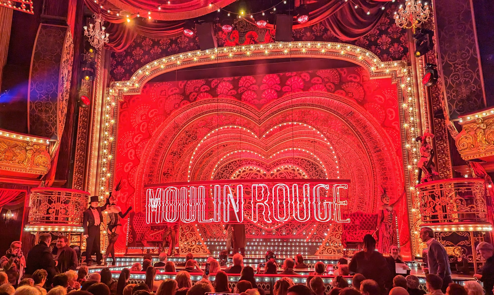
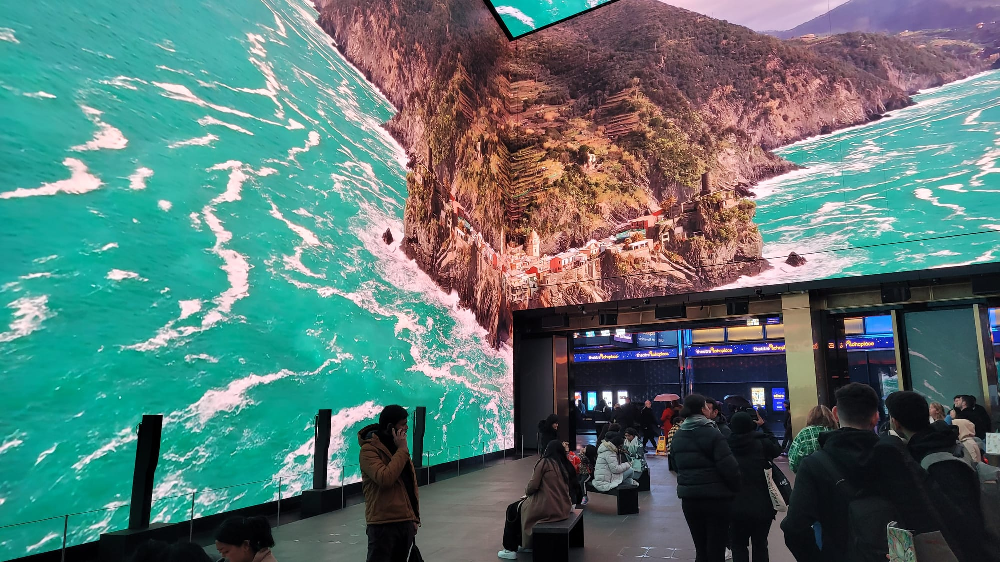

Immersive shows are the fastest-closing category of anything to do in London, and it is not close. **Three of the biggest names in the city shut in the first half of 2026 alone.**

That is the actual problem with picking one. Every other guide to this subject is a list of things that were open when it was written, and most were written a while ago — so the single most useful thing here is not a ranking. It is a status.

> 💡 **The Short Version:** **Bridge Command** is the most genuinely interactive thing in London — you crew a starship with a real job. **Mamma Mia! The Party** is the big night out. **Faulty Towers** is the funniest and you cannot hide from it. **Frameless** is the one for people who hate being spoken to. **Outernet is free.** And **Jeff Wayne's War of the Worlds, Vikings and the Gunpowder Plot have all closed** — do not let an old listicle send you there.

> 📊 **How this guide is put together**
> This is **not a consensus ranking** like our restaurant guides. There is no award for immersive theatre and the editorial lists go stale within months, so ranking would be the wrong tool.
> Instead **every experience below was checked against its own website**, and the ones that have closed are listed by name with their closing dates rather than quietly dropped — because those are exactly the ones people search for.
> *Status checked 1 September 2026 · [How we rank →](/how-we-rank/)*

---

## Where they are

  

    Map of London's immersive experiences
  

  

    
Loading the interactive map…

  

  

    <i class="restaurant-map-key restaurant-map-key--editorial" aria-hidden="true"></i> Theatre, dining and attractions
    <i class="restaurant-map-key restaurant-map-key--streetfood" aria-hidden="true"></i> Projection, gaming and VR
  

  <noscript>
    
The interactive map requires JavaScript. Every experience below lists its venue and nearest station.

  </noscript>

---

## Still open, at a glance

**Prices are the advertised adult starting price and they move constantly** — several of these use dynamic pricing, so treat them as a floor rather than a quote.

| Experience | Type | Area | From | Do you have to join in? |
| --- | --- | --- | --- | --- |
| **Bridge Command** | Live gaming | Vauxhall | £49 | **Yes — you have a job** |
| **The Traitors: Live Experience** | Game show | Covent Garden | £29.50 | **Yes — you are a player** |
| **Faulty Towers** | Dining comedy | Bloomsbury | £65.50 | **Yes — there is no back row** |
| **Alcotraz** | Cocktails | Shoreditch | £51 | **Yes — you smuggle** |
| **Moonshine Saloon** | Cocktails | Aldgate | £39.99 | Yes |
| **Hexmoor** | Cocktails | Shoreditch | £48 | Yes |
| **The Murdér Express** | Dining | Bethnal Green | £74.50 | Encouraged |
| **Mamma Mia! The Party** | Dining and party | North Greenwich | £120 off-peak | Dancing, not acting |
| **Peaky Blinders: Underworld** | Attraction | London Bridge | **£19.95 online** | Some |
| **The Crystal Maze** | Gaming | Piccadilly Circus | £26.50 | **Yes — constantly** |
| **Monopoly Lifesized** | Gaming | Fitzrovia | £54 | **Yes** |
| **Sherlock: The Game Is Now** | Escape rooms | White City | £30 | Yes |
| **COLAB Theatre** | Immersive theatre | Borough | not published | Yes |
| **Moulin Rouge! The Musical** | Musical with in-set seating | Piccadilly Circus | see below | **Only at the Can Can tables** |
| **Witness for the Prosecution** | Theatre in a real chamber | Waterloo | £29.50 under-26 | Only if you have a jury seat |
| **ABBA Voyage** | Virtual concert | Pudding Mill Lane | £40.50 | No |
| **Frameless** | Projection art | Marble Arch | see below | No |
| **LUMINISCENCE** | Projection concert | Victoria | £27.50 | No · **ends 27 Sept** |
| **Lightroom: David Bowie** | Projection | King's Cross | £25 | No |
| **Outernet** | Projection | Tottenham Court Rd | **Free** | No |
| **The London Dungeon** | Attraction | Waterloo | see below | You may be picked on |
| **Shrek's Adventure!** | Family attraction | Waterloo | see below | Gently |
| **Paddington Bear Experience** | Family attraction | Waterloo | £34 | Gently |
| **COME ALIVE!** | Circus spectacular | Earls Court | £58 | **In the pre-show, yes** |
| **Arcade Arena** | Gaming | Lambeth | £30 | **Yes — three of them** |
| **Immersive Gamebox** | Gaming | 3 sites | £37 | Yes |
| **Sandbox VR** | Full-body VR | Holborn | £35 | Yes |

---

## Opening in the next six months

Worth reading before you book anything above, because four of these are big enough to change what you would choose — and one of them opens this week.

### Absurd City, Westfield London — 15 October 2026

*80,000 sq ft · White City · self-guided, non-linear*

**The largest of them, by a distance.** Wake The Tiger — whose Bristol original coined the phrase "amazement park" — is taking the entire space that used to be KidZania and filling it with what it calls Europe's largest immersive art experience.

The conceit: an interdimensional travel agency portals you into **Absurd City**, a domed metropolis in a parallel world called Meridia, run by a digital mascot named REX who would like you to know that **everything is fine**. It very obviously is not, and you can either stroll through the surreal installations and enjoy the visuals, or join an underground resistance called the Wunderground and work out what REX is actually doing. **It is non-linear and self-guided** — there is no start time you can miss and no wrong way round.

**There is a Nowhere Bar**, and **adult-only After Hours nights run every other Friday, 7pm to midnight**, arriving any time between 7 and 9.30pm.

> ⚠️ **Two things they have not finished.** The **accessibility guides and maps are not written yet** — the venue says so plainly and points you at the Bristol equivalents in the meantime. And the **Calm Sessions for SEND and neurodivergent visitors are deliberately being held back to 2027**, so the team can learn the building first. That is a defensible decision, honestly stated, but it means the quiet sessions are not there at opening.

### Larger Than Life: Wallace & Gromit, Lightroom — 14 October 2026 to 4 January 2027

*Adults from £25, students and under-18s from £15, under-3s free in selected slots · 50 minutes · King's Cross*

**Aardman's 50th anniversary, on four eleven-metre walls and the floor.** It runs on a loop with no fixed beginning or end, tickets are sold in half-hour slots, and **you can stay for more than one loop** if there is room — which is the detail that makes Lightroom better value than it looks.

It is not just clips. It goes from the kitchen table where Peter Lord and David Sproxton started, through the train chase in *The Wrong Trousers*, to the sets, the props and the animators at work — with new animation made for the space. Written and designed by 59 Studio, directed by Nicol Scott, made with the Aardman production team.

**Access performances are already scheduled**, which is rare this far out: **five BSL showings** (29 November, 4, 7, 12 and 22 December) and **five relaxed showings** (6, 8, 15 and 21 December, and 2 January). A £2 transaction fee applies per order.

### Phantom Peak, Westfield Stratford City — 4 December 2026

*Adults £39.90–£65.10, under-18s £29.40–£53.55, plus 5% booking fee*

**The Canada Water original closed after 625 performances, and this is the rebuild** — bigger, multi-level and, crucially, **accessible**, which the old warehouse site was not.

Three districts rather than one yard: **Old Town**, the underground industrial mining town; the **Town Square**, with a Town Hall and the in-world Thirsty Frontier Saloon; and **Lakeside**, built around an indoor lake with a memorial garden and the Church of the Cosmic Platypus. You roam it freely, pick up story threads from characters, and follow whichever you like.

**Two add-ons, both bought at the same time as the ticket.** The **Puzzle Hunt** is £7.88 for a 30-minute designed-by-escape-room-people hunt across the whole town. The **VIP Tourist Experience** is £20 and new for Stratford — a 30-minute pre-show where you arrive by train carriage and are met in character.

**Pricing is dynamic and rises as slots fill**, so the £39.90 floor is an early-booking price rather than a walk-up one. There is a themed bar open seven days a week whether or not you have a ticket.

### Secret Cinema: Pirates of the Caribbean, Greenwich Peninsula — 16 February to 25 April 2027

*Standing from £49, seated from £69 · about 2 hours 15 minutes · 10 weeks only*

*The Curse of the Black Pearl*, staged at Secret Cinema's Greenwich Peninsula site with live performance, stunts, a live band and cinematic-scale sets. **Ten weeks only**, five minutes' walk from North Greenwich.

**The seated tier is worth understanding before you buy.** "Roam and Return" at £69 does not restrict you — you can explore exactly as standing ticket holders do, but you have a seat to go back to. For a two-and-a-quarter-hour show that is mostly on your feet, that is what the extra £20 buys.

### Punchdrunk's next London production — no date

Teased with no details at all. The only public sign it exists is that VIP tickets to their September film screening carry priority booking for it. If you care, that is currently the whole route in.

---

Powered by <a target="_blank" rel="sponsored" href="https://www.getyourguide.com/london-l57/">GetYourGuide</a>

## The ones where you actually do something

The distinction that matters more than genre. In these, you have a role, and standing at the back is not an option.

### Arcade Arena, Lambeth

*From £30 one game, £45 two, £50 all three · opens Saturday 5 September 2026*

**Three separate games in one building, from the team behind The Crystal Maze Experience** — Little Lion Entertainment, who know how to build this sort of thing and have run Chaos Karts in Manchester for years.

**Chaos Karts** is the proven one: real electric karts on a real track, with the whole floor and walls projected so you are racing through a game world rather than round a circuit, complete with weapons and a leaderboard. The Manchester reviews consistently reach for the same comparison, which is Mario Kart, and a session is six races rather than one.

**PAC-MAN LIVE EXPERIENCE** puts you in an illuminated maze as PAC-MAN — collecting power, avoiding ghosts, against the clock, in teams. It is the first in London.

**Alien Invasion** is the new one and the reason to pay attention: you join the Cosmic Cadets against an extraterrestrial threat in what is billed as **the UK's first immersive drone experience**. It debuts here.

**The £50 three-game ticket is the one that makes sense** — £30 for a single game is a lot for one activity, and £50 for all three is barely more than the price of two.

> ⚠️ **Book before you travel, and check the address.** It is at **26 Lambeth High Street, SE1 7SJ** — reported by Time Out rather than published by the venue, whose own site still had an empty address field four days before opening. Despite the press describing it as Southbank, that postcode is Albert Embankment: **Vauxhall and Lambeth North are your stations, not Waterloo.** Nothing on the site states an age or height limit for the London venue either, and Chaos Karts elsewhere has a minimum height — worth a phone call if you are bringing small children.

### Bridge Command, Vauxhall

*From £49 · 16+ · allow 2 hours · two minutes from Vauxhall*

**The most genuinely interactive thing in London**, and the one to pick if you have been disappointed by "immersive" meaning "a corridor with a projector in it".

You crew a full-scale starship bridge with an actual job — Comms, Weapons, Helm, Science — at a console that really works, alongside live actors playing your senior officers. **There are no VR headsets.** The mission responds to what you decide, so the pace is yours and the ending is not fixed.

**You cannot hide, because the ship needs your station manned.** That is the whole appeal for some people and the reason others should book something else.

**16+**, with private Cadet Missions for ages 11 and up where the crew adjust the difficulty. Ticket includes a drink. **Unusually for this genre, the venue and the set are designed to be wheelchair-accessible throughout.**

### The Traitors: Live Experience, Covent Garden

*From £29.50 · mostly 18+ · allow 3 hours*

The full Round Table format from the television series — **Traitors, Faithfuls, murders and banishments** — with you as a player rather than a spectator. Two hours of game, plus onboarding and a bar either side.

**You will be mixed in with strangers** unless you book a private table, which is either the appeal or the problem depending on the group you arrive with.

**Most sessions are strictly 18+.** There are clearly labelled Family Friendly slots, recommended 14+ and open from 12 — and the gameplay in those is identical, murders included, so a twelve-year-old may be sitting next to you plotting your removal.

**£29.50 tickets are available in every time slot**, first come first served, which makes it one of the better-value things on this page.

*The bar you are held in before the game starts. Doors open 45 minutes early, which is deliberate — you are meant to be sizing up the strangers you are about to play against.*

### COME ALIVE! The Greatest Showman Circus Spectacular, Earls Court

*From £58 · 5+ · show runs 1hr 40 including interval · arrive an hour early · West Brompton*

**The thing to understand about this one is that the show is only half of it.** Most "immersive" West End productions dress a foyer and call it a world. Here the pre-show is a genuine second venue, and if you turn up at curtain-up you have paid full price for roughly half of what you bought.

**The whole building was purpose-built for it.** The Empress Space at Earls Court — most recently the BBC Earth Experience — was converted into what the production calls the Empress Museum, with **a 700-seat Big Top constructed inside it** for the performance itself. This is not a theatre that took a booking. It is a venue made for one show, and it is the world premiere of that show.

**Before the Big Top, you walk through an invented circus world**, and the production's own map names every part of it: the **Zoetrope Bar**, the **Balloon Bar**, the **Empress Diner**, a **Costume Department**, the **Barker Stage**, **The Nest**, the **Night Sky Tent**, **Happy Medium**, **The Cloud** and the **Beasts Cage**. There are close-up performances throughout, characters in role, and food and drink built into the theming rather than sold from a trestle table.

**So arrive when the doors open, not when the show starts** — 6.30pm for evening performances, 1.30pm for matinees, a full hour before curtain. The production says so itself, and it is the single most useful instruction on this page.

The show that follows is circus crossed with musical theatre: a new story inspired by the film, with the Pasek and Paul songs — *This Is Me*, *Rewrite the Stars*, *A Million Dreams*, *The Greatest Show* — performed live around aerial and acrobatic work in the round.

**Booking to April 2027**, running Wednesday to Sunday, seven shows a week. **Tickets start at £58** and climb steeply through premium and VIP tiers. **Under-5s are not admitted, including babes in arms.**

*The 700-seat Big Top, built inside the Empress Museum. The audience is wrapped around a circus ring rather than facing a proscenium — and everything you walk through to reach this room is part of the show.*

### Faulty Towers The Dining Experience, Bloomsbury

*From £65.50 · about 2 hours · Russell Square*

Basil, Sybil and Manuel serve you a three-course dinner in a Bloomsbury hotel, and **roughly 70% of it is improvised.** In its thirteenth year at this venue, which for immersive dining is close to geological.

**You are a hotel guest rather than an audience**, so being spoken to, argued with and roped in is not a risk — it is the product. There is genuinely no back row.

The obvious caution: if the thought of a waiter making you part of the joke fills you with dread, this is the single worst thing on this page for you and Frameless is the right answer instead.

### Alcotraz, Shoreditch and Moonshine Saloon, Aldgate

*From £51 and £39.99 · both 18+ · 1 hour 45*

Two from the same stable, both built on the same idea: **you smuggle your own booze past someone whose job is to catch you.**

**Alcotraz** puts you in an orange jumpsuit in Cell Block 212 and the Warden is the obstacle; **Moonshine Saloon** is Prohibition-era and does the same trick with bootlegging. Both let you pay extra to be cast as a specific character, first come first served, which is worth doing if your group has someone who will enjoy it and worth avoiding if it does not.

**Both 18+ with ID.** At Alcotraz, **book one of the step-free sentences — 11:30, 13:45, 16:10, 18:35 or 21:00 — if you need guaranteed accessible entry.**

### The Crystal Maze LIVE Experience, Piccadilly Circus

*£26.50–£58 · strictly 9+ · about 75 minutes on your feet*

Aztec, Medieval, Industrial and Futuristic zones and then the Crystal Dome, in teams of up to eight. It has been running long enough to be a permanent fixture rather than a fad.

**The age rule is enforced at 9**, one adult per five minors, and **participation is prohibited at any stage of pregnancy** — which catches people out.

**Full wheelchair access is not available** because of the building; there are adapted routes and some adapted games only. Call before booking rather than turning up hopeful.

### Monopoly Lifesized, Fitzrovia

*From £54 · 9+ · Goodge Street*

You are the token. Four boards, **52 escape-room-style challenge rooms**, a drinks trolley that finds you mid-game, and a great deal of running about.

It is faster and more physical than it sounds — you are on your feet the whole way round, and the rooms are timed, so a slow team loses the board rather than the game.

**9+ enforced**, under-16s need an adult, teams cap at six, and **there are no latecomers** — arrive fifteen minutes early or lose the slot. The venue states lift access to all four boards, but ring ahead if that matters.

---

Powered by <a target="_blank" rel="sponsored" href="https://www.getyourguide.com/london-l57/">GetYourGuide</a>

## Immersive dining and cabaret

### Mamma Mia! The Party, North Greenwich

*£120 off-peak to £246 · 5+ · about 4 hours · booking to April 2027*

A four-course Greek sharing menu in a taverna set while a Sandi Toksvig romance plays out around, above and below you — then the tables clear and it becomes an ABBA disco.

**The cheap way in is Tier C at £154 peak or £120 off-peak**, which is a restricted view behind pillars. Off-peak means Wednesday to Friday evenings and Sunday. Prices are dynamic and are not held while you decide.

**Nothing is demanded of you except dancing**, which makes it the big-night-out option rather than the participation option. **Tables are pre-allocated and you may be seated with strangers.**

Step-free with wheelchair spaces, and there are BSL-signed and captioned performances. Haze, flames and continual flashing lights throughout.

### The Murdér Express, Bethnal Green

*From £74.50 · 5+ at early shows · 2 hours*

A 1937 dining car that never leaves Pedley Street, three courses, and a murder. **The producers actively want you in character** — this is not a show you watch over dinner.

**Children from 5 are allowed but only at shows before 8pm**, everyone pays the full adult price, and there is a dress code: dress for dinner, not for the office.

Step-free from the street to the bar and an accessible bathroom, but **there are three steps up into the train** with a ramp available for most wheelchairs — tell them in advance.

### Hexmoor, Shoreditch

*£48–£88.50 · 1 hour 45*

A fantasy prison beneath Shoreditch where dark magic has been outlawed. You are processed on arrival, issued a uniform, and put in a cell with people you have never met.

The guards, inmates and allies around you all want different things, and working out who to trust is the game. **Three contraband potions are built into the story** rather than ordered from a bar, with clue-hunting and hidden messages between them.

**Tiers run £56.50, £65.50 and £88.50**, all including the booking fee, for one hour forty-five. It is the most theatrical of the three cocktail experiences on this page and the one that asks most of you.

### CHAT NOIR!, West Kensington

*From £99.85 · **ends September 2026***

1890s Paris in the Lost Estate's hands: a three-course French banquet, absinthe rituals, magic, mime and cabaret. **Seated, so participation is optional** — the rare immersive dinner where you can genuinely just eat and watch.

Evenings at 6.45pm Tuesday to Sunday, with weekend matinees at 12.45pm. Described as an accessible venue, though it is worth ringing the box office rather than assuming.

**It closes this month.** The same company brings back its Christmas Carol feast for the 2026 season, staged at the site of Dickens's first public reading of it — presale sign-up is open now.

---

## Look, don't touch

Nobody will speak to you at any of these, which for a lot of people is the whole point.

### Frameless, Marble Arch

*Permanent · all ages by day, 18+ at Lates*

**The UK's largest permanent immersive art experience** — four galleries, more than forty works by Van Gogh, Monet, Klimt, Dali, Kandinsky and Canaletto, projected floor to ceiling with an original score.

Allow **at least two hours**, and note last entry is two hours before closing. **Friday and Saturday evening Lates are 18+**, and under-18s have to be out by 4pm on those days.

*Frameless. The projection runs onto the floor as well as the walls, which is what separates it from a gallery with a big screen in it.*

Good accessibility provision: chilled sessions, deaf and hard-of-hearing support, and **a free carer ticket with any paid ticket**. The website prices dynamically rather than publishing a figure, so check on the day you want.

### LUMINISCENCE, Westminster Cathedral

*From £27.50 · **ends 27 September 2026** · 50 minutes · Victoria*

**A 360-degree projection concert inside Westminster Cathedral**, which is a far stranger and better setting than a purpose-built room — the video mapping runs across the cathedral's own mosaics, domes and pillars rather than onto blank walls built to receive it.

It is **not** a silent light show. There is a **live 14-piece orchestra and the Lux Aeterna choir**, and a commissioned script narrated by **Hugh Bonneville** telling the story of London. That combination — live musicians in a working cathedral, under projection — is unlike anything else on this page.

**Three tiers, and the difference is the music, not the seat.** Standard from £32.50, **choir performances from £27.50**, and **Orchestra Nights, every Saturday through September, from £42.90.** Children 5–18 are cheaper and under-5s go free.

**Fifty minutes, arrive twenty minutes early, and there is no late entry** — the doors shut. It runs until **27 September 2026**.

Level access through the main entrance, though there are steps into the individual chapels. A hearing loop and transcription are available on request, service animals are welcome, and there is **no strobe lighting**, though there are flashing lights. Reduced tickets for over-65s, students and disabled visitors.

*LUMINISCENCE. Stained-glass patterns thrown across arches, pillars and ceiling, with the orchestra playing at the far end.*

### Lightroom: David Bowie — You're Not Alone, King's Cross

*From £25, students and under-18s £15 · to 10 January 2027*

360-degree projection built from performance footage, rarely heard interviews and material from the David Bowie archive that has not been shown before. It is a purpose-built room in King's Cross rather than a converted space, and the sound is the half people underrate.

You sit or stand as you like and nobody performs at you. **Slots run every half hour**, tickets are £25 for adults and **£15 for students and under-18s**, plus a £2 transaction fee per order. BSL showings are offered.

**Wallace & Gromit: Larger Than Life opens here on 14 October 2026**, from £25, if the Bowie one has gone by the time you read this.

### Moulin Rouge! The Musical, Piccadilly Theatre

*Can Can tables · Piccadilly Circus · book months ahead*

**A West End musical rather than an immersive show, but the room does the work.** The Piccadilly Theatre has been rebuilt into the Moulin Rouge itself: the auditorium is dressed floor to ceiling, an elephant on one side and a windmill on the other, and it starts working on you well before the curtain does.

**The seats to want are the Can Can Tables.** A handful of tables at the very front of the stalls, level with the stage, with the show happening on all sides of you rather than in front of you. It is the closest the West End gets to sitting inside the set — though you are still watching, not taking part.

**There are nine tables of two — eighteen seats a performance.** That is the whole reason they vanish: not demand alone, but that the supply is tiny. **Book months ahead**, and do not count on returns appearing.

*The Piccadilly Theatre dressed as the Moulin Rouge. The Can Can tables sit at the foot of that stage, inside the lit frame rather than looking at it.*

### ABBA Voyage, Pudding Mill Lane

*From £40.50 seated, £57 dance floor · booking to May 2027 · about 100 minutes*

Digital ABBA and a ten-piece live band in a purpose-built arena opposite the DLR station. **The dance floor is where you want to be**, and **16–25s can get £35 dance floor tickets**. Half-price child tickets run to the end of December.

**The strict no-phones policy is enforced**, and it is much of why it works — a room of ten thousand people none of whom are filming is now a genuinely unusual thing.

**Dance Booths** seat up to 44 with their own bar if you are a group. The box office at Pudding Mill Lane DLR opens two hours before. Wheelchair spaces, ambulant seating and transfer-friendly seats are all available, and ear defenders are free but limited, first come first served.

### Outernet, Tottenham Court Road

*Free · permanent · no booking*

Wraparound 4K screens in the Now Building beside Tottenham Court Road station, running a rotating programme of large-scale digital art, some of it interactive.

The programme rotates — recent pieces have included a butterfly trail, an enchanted forest and a rain installation — and some of it responds to you as you move.

**It is free, there is no ticket and there is no booking**, which makes it comfortably the best-value thing on this page and a genuinely good twenty minutes if you are passing. Download the app if you want to time your visit to a particular piece rather than take what is playing.

*The Now Building at Outernet, beside Tottenham Court Road station. Four storeys of screen on every side, and nobody takes a ticket off you at the door.*

---

Powered by <a target="_blank" rel="sponsored" href="https://www.getyourguide.com/london-l57/">GetYourGuide</a>

## For children

### Shrek's Adventure! and the Paddington Bear Experience, Waterloo

Both at County Hall and both built for young families rather than tolerating them.

**Shrek's Adventure** runs live actors and a DreamWorks 4D bus ride, gently guided throughout. **The Paddington Bear Experience** puts you on the train to 32 Windsor Gardens to help the Browns prepare for the Marmalade Day Festival — themed rooms, puzzles and character meets, aimed squarely at under-10s.

**One serious access limitation at Paddington:** the fire evacuation procedure means **only one wheelchair user per hour**, on quarter-past slots. Book well ahead.

### The London Dungeon, Waterloo

Next door to both, and a different proposition — **live actors who single people out**, a drop ride, and a thousand years of London's grimmest history played for laughs. Jack the Ripper and Sweeney Todd are the set pieces.

Be honest with yourself about the picking-on: the actors work the crowd hard and being chosen is part of the design. Younger or shy children find it genuinely frightening rather than fun, which is the opposite of the two attractions beside it.

There is an adults-only after-hours strand, and combined tickets with the London Eye and a five-attraction pass both work out considerably cheaper per venue. Wheelchair timeslot booking and BSL tours are available.

> ⚠️ **Check the price before you book any of the three.** All were running a reduced-VAT summer offer that ended on **1 September 2026**, so the headline prices you may still see quoted elsewhere are about to be higher.

---

## Closed — and worth saying so

This is the section other guides leave out, and it is the reason people turn up at locked doors.

* **Jeff Wayne's The War of the Worlds** — **closed 30 April 2026** with no notice, after seven years, when the company licensed to operate it ceased trading. A £400,000 upgrade had just been completed. The producers say they are "actively exploring ways to bring the immersive experience back in a different way", with no timeline.
* **Elvis Evolution** — closed in the same collapse, in **April 2026**, after nine months.
* **Vikings: The Immersive Experience** — a limited run that ended **29 June 2026**.
* **Squid Game: The Experience** — **closed 4 January 2026.**
* **The Gunpowder Plot Immersive Experience** — **closed 28 February 2025.**
* **Otherworld VR** — both London sites closed in **2024**.
* **Tomb Raider: The LIVE Experience** — closed **30 December 2023**.
* **The Great Gatsby** immersive — closed in London **January 2023**; still running in New York.
* **Punchdrunk's The Burnt City** — closed **September 2023**, and Punchdrunk has had **no immersive walkthrough show in London since**.

**Dark rather than dead:**

* **You Me Bum Bum Train** — the genre's holy grail, and currently nothing to book. The last run ended in 2025 and there is no ballot open. **The mailing list on its own site is the only route in**, and the gap before the previous run was eight years, so join it and forget about it. The site asks you not to research the show, which is sound advice: the less you know, the better it works.
* **Phantom Peak** — returns **4 December 2026** at Westfield Stratford after moving from Canada Water.
* **Swamp Motel** and **Les Enfants Terribles** — both still trading, neither currently running a public ticketed London show.
* **Darkfield** — on tour, with no London dates on their own schedule.

---

## What to know

* **Check the show is still running before you book anything, from any source.** This genre closes venues at a rate nothing else in London matches, and three major ones went in the first half of 2026 alone.
* **Decide first whether you want to participate.** It splits the field almost perfectly. Bridge Command, Faulty Towers, Alcotraz, The Traitors and the gaming ones require you to perform; Frameless, Lightroom, ABBA Voyage and Outernet ask nothing.
* **Book online rather than at the door.** Peaky Blinders is **£19.95 online against £29.95 on the door** — a 33% difference for the same thing.
* **Age limits are stricter here than anywhere else.** Bridge Command and Peaky Blinders are 16+, Alcotraz and Moonshine Saloon 18+, most Traitors sessions 18+, and the Crystal Maze and Monopoly enforce a hard 9.
* **Accessibility varies enormously and is not correlated with price.** Bridge Command and Peaky Blinders are designed for step-free access throughout; the Crystal Maze cannot offer it at all, and Paddington can take **one wheelchair user per hour**.

---

Powered by <a target="_blank" rel="sponsored" href="https://www.getyourguide.com/london-l57/">GetYourGuide</a>

## Continue planning your London trip

- 🎭 **[The Best Live Music Venues in London](/articles/best-live-music-venues-london/)**
- 🎬 **[The Best Independent Cinemas in London](/articles/best-cinemas-london/)**
- 🍸 **[The Best Cocktail Bars in London](/articles/best-cocktail-bars-london/)**
- 🎲 **[Competitive Socialising in London](/articles/competitive-socialising-london/)**
- 🗺️ **[Unusual Restaurants in London](/articles/unusual-restaurants-london/)**

---

*This guide is independent and contains no paid placements. Every experience was status-checked against its own website on 1 September 2026 — but this category changes faster than any other, so confirm before booking.*
