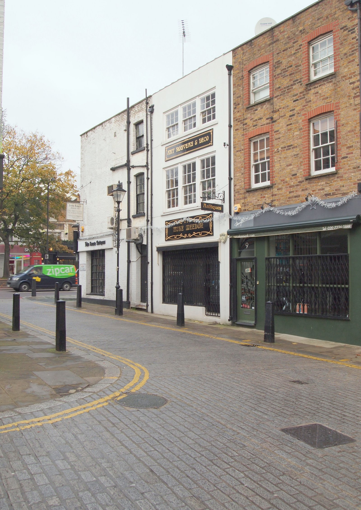
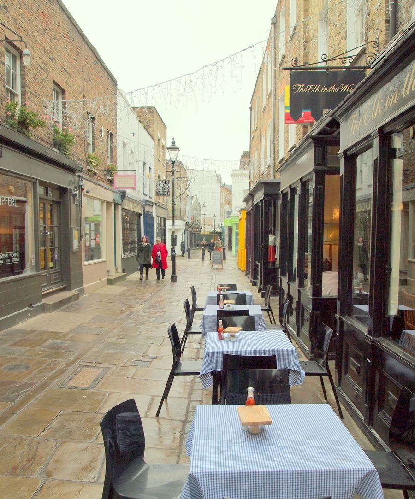
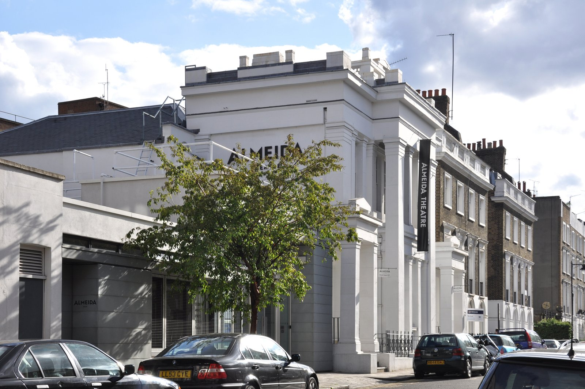
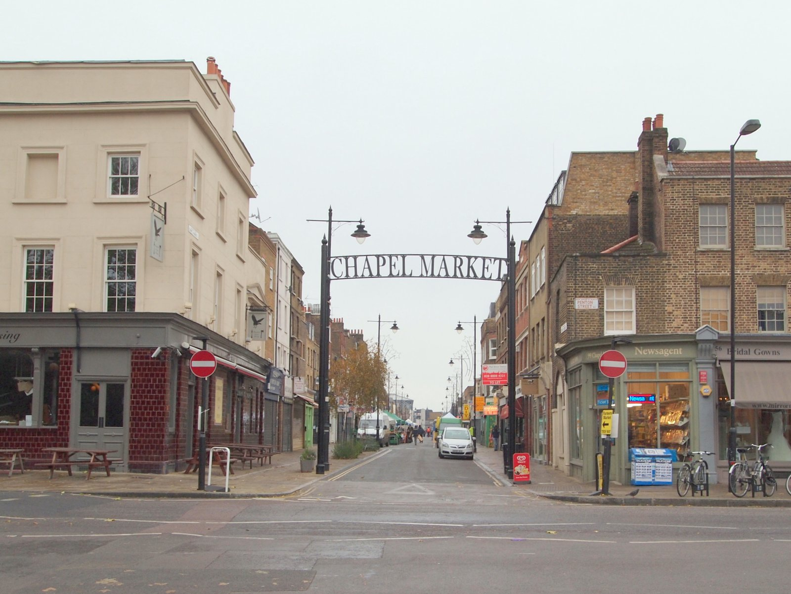

Islington is a mile of Georgian terrace running north from Angel, and it has more restaurants along it than almost any comparable stretch in London. It also has two well-regarded small theatres, a Gothic chapel that doubles as a music venue, and a lane of antique shops that predates almost all of it.

There are no landmarks here. Islington is a place to eat, drink, browse and see something in the evening.

Islington has its own share of the commemorative plaques marking where notable people lived or worked - see them on our [interactive map](/plaques/?area=islington).

## Why visit — and who should skip it

**Come here if** you want dinner and a show without West End prices, or you like antiques and secondhand books. The Almeida punches well above its 325 seats, and the Union Chapel is the most atmospheric small venue in London.

**Skip it if** you are sightseeing. There is nothing here to photograph and nothing to queue for. Islington rewards an evening far more than an afternoon.

## Top sights and activities

1. **Camden Passage** — A narrow pedestrian lane off Upper Street lined with antique dealers, vintage shops and arcades. The market runs **Wednesdays and Saturdays**; the shops open most days.
2. **Upper Street** — A mile of restaurants and bars from Angel to Highbury Corner, at every price point.
3. **The Almeida Theatre** — 325 seats in a converted Victorian literary institute, with a reputation far larger than its size. Book well ahead.
4. **Union Chapel** — A working Congregational church and a music venue, with gigs held in the Gothic octagon and the audience seated in the original pews.
5. **Sadler's Wells** — Britain's leading dance house, at the southern end near Angel. Contemporary dance, flamenco, hip hop and ballet.

Powered by <a target="_blank" rel="sponsored" href="https://www.getyourguide.com/london-l57/">GetYourGuide</a>

6. **Chapel Market** — A traditional London street market off Liverpool Road, running most days. Fruit and veg, household goods and no pretensions.
7. **The Regent's Canal and Islington Tunnel** — The canal vanishes into a 960-metre tunnel at City Road Basin. There is no towpath; a signed street route crosses over the top.

*Camden Passage, an alley of antique dealers behind Upper Street. Busiest for the market on Wednesdays and Saturdays. Photo: [David Hallam-Jones](https://commons.wikimedia.org/w/index.php?curid=122641586), [CC BY-SA 2.0](https://creativecommons.org/licenses/by-sa/2.0/).*

## Key streets and micro-districts

### Angel and the southern end
Around the Tube station. Sadler's Wells, Chapel Market and the entrance to Camden Passage.

### Camden Passage
Off Upper Street behind the Angel. Antique arcades, small shops and a handful of good cafes.

It has nothing to do with Camden Town, beyond sharing a namesake — both were named after Charles Pratt, 1st Earl Camden, whose title was given to streets and land across north London in the 1760s. The passage itself was laid out in 1767 as a back alley behind the houses on what was then Islington High Street, and only took the Camden name during the 1800s.

The **antiques trade** dates to the 1960s, when the market was founded by John Payton with the borough's backing and drew over 350 dealers at its peak. That number has shrunk as Islington rents have risen, but **Pierrepont Arcade** still runs a general antiques market most days plus a dedicated vintage clothing market on Thursdays. One well-known casualty: **The Mall Antiques Arcade**, a converted Victorian tram shed that once housed 35 dealers, closed in 2008 and is now an Amazon Fresh — a number of older guides still send people to look for it.

*The passage doubles as a place to eat as much as to browse — the café tables come out whatever the market is doing.*

The **Camden Head** pub, at the Islington Green end, hosts **Angel Comedy Club** every night of the week — genuinely free entry, and well enough regarded that Time Out has called it a "comedy institution." Arrive early; it fills up.

### Upper Street
The spine, running north to Highbury Corner. Restaurants, bars, the Almeida and the Little Angel puppet theatre.

### Barnsbury and the garden squares
West of Upper Street. Gibson Square, Lonsdale Square and Thornhill Square — quiet Georgian terraces almost nobody walks through.

### Highbury and the northern end
Beyond Highbury Corner. Highbury Fields, the Union Chapel and the residential streets around the old Arsenal stadium site.

*The Almeida. Three hundred and twenty-five seats, and a habit of sending its productions to the West End. Photo: [Photo: Andreas Praefcke](https://commons.wikimedia.org/w/index.php?curid=15582698), [CC BY 3.0](https://creativecommons.org/licenses/by/3.0/).*

## Where to eat and drink

| Spot | Style | Price | Why go |
| --- | --- | --- | --- |
| **Ottolenghi Islington** | Middle Eastern deli | ££ | The original branch on Upper Street; the counter salads are the point |
| **Trullo** | Italian | £££ | Highbury Corner; charcoal-grilled and hand-rolled pasta |
| **Afghan Kitchen** | Afghan | £ | Tiny, cash-friendly, long-running Camden Passage institution |
| **The Castle** | Pub | ££ | Corner pub off Upper Street with a roof terrace |
| **Gallipoli** | Turkish | ££ | Upper Street mainstay; loud, cheap and busy |
| **Chapel Market stalls** | Street market | £ | Everyday food and produce, no tourists |

*Chapel Market, a working street market rather than a curated one. Fruit and veg, and cheaper than anywhere on Upper Street. Photo: [David Hallam-Jones](https://commons.wikimedia.org/w/index.php?curid=122596944), [CC BY-SA 2.0](https://creativecommons.org/licenses/by-sa/2.0/).*

## Getting there

**By Tube.** **Angel** (Northern) serves the southern end and has the longest escalator on the network at 60 metres. **Highbury & Islington** (Victoria, Overground) serves the north.

**By Overground.** Highbury & Islington connects east to Hackney and Stratford, and south to Shoreditch and Whitechapel — often faster than going via central London.

**Best exit.** From Angel, turn right out of the station and Camden Passage is two minutes north, opposite the old Angel building.

**On foot.** Twenty minutes west to King's Cross, twenty-five south-east to Shoreditch.

## How long to spend, and when to go

| If you have | Do this |
| --- | --- |
| **Two hours** | Camden Passage and the southern end of Upper Street |
| **Half a day** | Add Chapel Market and the Barnsbury garden squares |
| **An evening** | Dinner on Upper Street and a show at the Almeida or Union Chapel |

**Best time:** Wednesday or Saturday for the Camden Passage antique market, then stay for the evening.

**Book ahead:** The Almeida, Sadler's Wells and Union Chapel gigs all sell out regularly.

## Suggested route

1. **Start:** Angel station. North to **Camden Passage** for the antique arcades.
2. **Chapel Market:** West across Liverpool Road for the street market.
3. **Upper Street:** North past the **Almeida Theatre**.
4. **Barnsbury:** West into **Gibson Square** and the quiet Georgian terraces.
5. **Highbury Corner:** North to **Highbury Fields** and the **Union Chapel**.
6. **Finish:** Dinner on Upper Street, or the Overground east to Hackney.

## Common mistakes to avoid

1. **Confusing Camden Passage with Camden Market.** Different places, two miles apart.
2. **Coming for the antique market on the wrong day.** Wednesdays and Saturdays.
3. **Trying to follow the canal towpath through Islington.** It goes into a tunnel with no path. Follow the signed street route.
4. **Treating Islington as a daytime sightseeing stop.** There is nothing to see. Come for the evening.
5. **Not booking the Almeida.** 325 seats and a national reputation — it sells out.
6. **Walking the whole of Upper Street.** It is a mile. The interesting half is the southern end.

## Where to stay

Well connected, genuinely residential, and good value for somewhere this close to the centre.

- **Angel** — Mid-range hotels near the Tube, walkable to King's Cross and the City.
- **Highbury** — Quieter and cheaper, on the Victoria line and Overground.
- **King's Cross** — Twenty minutes west, with far better rail connections.
