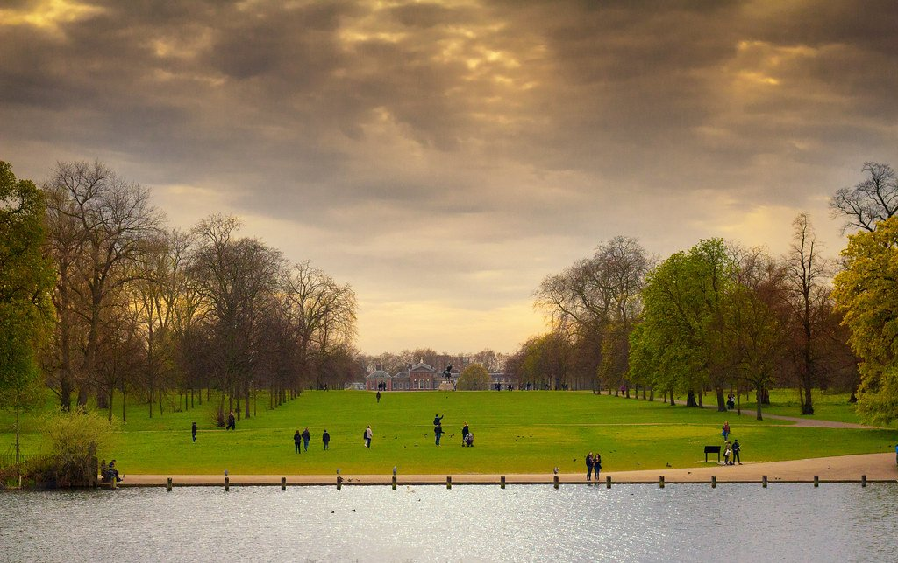

Kensington is the stretch between Notting Hill and the museums: a royal palace, two very different parks, and a high street that is calmer than anything comparable in central London.

It is also where several of London's best-known sights actually sit — Kensington Palace, the Albert Memorial and the Serpentine galleries are all here, in Kensington Gardens rather than Hyde Park, which is the adjoining park to the east.

Kensington has its own share of the commemorative plaques marking where notable people lived or worked - see them on our [interactive map](/plaques/?area=kensington).

## Why visit — and who should skip it

**Come here if** you want gardens. Between Kensington Gardens, Holland Park and the Kyoto Garden, this is the greenest walkable district in central London, and almost all of it is free.

**Skip it if** you are short on time and already doing South Kensington's museums. The two adjoin and cover similar ground for a visitor — if you only have one afternoon in west London, the free museums will give you more.

## Top sights and activities

1. **Kensington Palace** — A royal residence since 1689 and the birthplace of Queen Victoria. The State Apartments are ticketed; the **Sunken Garden** beside it is free and one of the best formal gardens in the city.
2. **Kensington Gardens** — 265 acres. The Albert Memorial, the Italian Gardens at the north end, the Peter Pan statue and the Diana Memorial Playground.
3. **Holland Park and the Kyoto Garden** — A Japanese garden given by Kyoto in 1991, with a tiered waterfall, koi and peacocks. Free, small, and the best twenty minutes in the area.
4. **The Design Museum** — In the former Commonwealth Institute, under a swooping 1962 roof. The permanent gallery is free.
5. **Leighton House** — The purpose-built studio-home of the Victorian painter Frederic Leighton, with an Arab Hall lined in Damascus tiles. Small, ticketed and extraordinary.
6. **Serpentine Galleries** — Two free contemporary art spaces in Kensington Gardens, with the annual summer **Pavilion** commissioned from a different architect each year.
7. **Opera Holland Park** — Summer opera under canvas in the ruins of Holland House, cheaper and far less formal than the major houses.

*The Round Pond in Kensington Gardens, with the palace beyond it. The gardens close at dusk; Hyde Park next door does not. Photo: [Ray in Manila](https://www.flickr.com/photos/21186555@N07/27960679866), [CC BY 2.0](https://creativecommons.org/licenses/by/2.0/).*

## Key streets and micro-districts

### Kensington High Street
The main road, and a high street that was once a genuine rival to Oxford Street before the department stores went. What survives is the chains, and one thing that is unlike anywhere else in London.

**Kensington Roof Gardens** sit a hundred feet up on top of the old Derry & Toms building — an acre and a half laid out in 1938 as a Spanish garden, a Tudor garden and an English woodland, with mature trees growing in rooftop soil and flamingos that have lived up there for decades.

**Access has never been reliable.** The gardens have opened and closed with successive owners and are not a public park, so check before you build an afternoon around them. The street itself is a five-minute walk end to end from High Street Kensington station.

### Kensington Gardens and the palace
North-east, and the reason most people come. **Kensington Palace is ticketed**; the gardens around it are free, which is the distinction that catches people out.

Free and worth the walk: the **Sunken Garden**, the **Albert Memorial**, the two **Serpentine galleries** — which run free contemporary art shows and a new architectural pavilion each summer — the **Italian Gardens** at the Lancaster Gate end, and the **Diana Memorial Playground**.

**The gardens open at 6am and close at dusk**, and are considerably quieter than Hyde Park next door despite being continuous with it.

### Holland Park
North-west, and **the best park in this part of London by a distance** — twenty-two hectares, half of it genuine woodland rather than mown grass, which is rare this far in.

The **Kyoto Garden** is the one people photograph: a Japanese garden given to the borough in 1991, with a tiered waterfall, koi, and **peacocks that wander through it** and are entirely unbothered by anyone. The **Dutch Garden** has formal beds in front of the surviving wing of Holland House, and an **opera canopy** stands over the ruins for a summer season.

**Free and open daily.** Come on a weekday morning if you want the Kyoto Garden without a queue for the same photograph.

### Kensington Church Street
Running north towards Notting Hill, and **the antiques street of west London** — dealers in furniture, ceramics and Asian art, most of them by appointment or looking as though they would prefer to be.

At the top stands the **Churchill Arms**, buried under thousands of flowers in summer and around ninety Christmas trees in December, with a Thai kitchen in the conservatory at the back.

**It is a steady uphill walk**, about ten minutes from High Street Kensington to Notting Hill Gate, and the shops keep their own hours rather than a high street's — expect a good number shut on a Monday.

### Holland Park Avenue and Campden Hill
The stucco terraces and private garden squares between the two parks — among the most expensive residential streets in Britain, and almost entirely without shops, cafés or anything to do.

**That is the appeal, and the limit.** It is a genuinely lovely twenty minutes on foot between Holland Park and Notting Hill Gate, past white-fronted houses and communal gardens you cannot enter, and there is nothing at the end of it but another main road.

Walk it as a link between the two parks rather than as a destination.

Powered by <a target="_blank" rel="sponsored" href="https://www.getyourguide.com/london-l57/">GetYourGuide</a>

## Where to eat and drink

| Spot | Style | Price | Why go |
| --- | --- | --- | --- |
| **The Belvedere** | Modern British | £££ | In Holland Park itself, in a former ballroom |
| **The Churchill Arms** | Historic pub, Thai kitchen | ££ | Kensington Church Street; buried in flowers in summer |
| **Kensington Palace Pavilion** | Cafe | ££ | Beside the palace, with garden seating |
| **The Ivy Kensington Brasserie** | Modern European | £££ | High Street; reliable and good for a long lunch |
| **Holland Park Cafe** | Park cafe | £ | Beside the Kyoto Garden and the sports pitches |
| **Whole Foods Kensington** | Food hall | £ | The practical option; large hot counter upstairs |

## Getting there

**By Tube.** **High Street Kensington** (District, Circle) is central to everything. **Holland Park** (Central) is closest to the Kyoto Garden. **Queensway** (Central) serves the north side of Kensington Gardens.

**Best exit.** From High Street Kensington, turn right for Holland Park and the Design Museum, or left and north up Kensington Church Street for Notting Hill.

**On foot.** Fifteen minutes to Notting Hill, fifteen to South Kensington, twenty across the gardens to Paddington.

**Note:** Kensington Gardens closes at dusk and Holland Park gates shut at nightfall. Both open at first light.

## How long to spend, and when to go

| If you have | Do this |
| --- | --- |
| **Two hours** | Holland Park, the Kyoto Garden and the Design Museum |
| **Half a day** | Add Kensington Gardens, the Sunken Garden and the Albert Memorial |
| **A full day** | Add Kensington Palace and Leighton House |

**Best time:** First thing. The Kyoto Garden is small and gets busy from mid-morning, and the peacocks are most active early.

**Seasonal:** The Serpentine Pavilion runs June to October. Opera Holland Park runs June to August. The Sunken Garden is at its best in late spring.

## Suggested half-day route

1. **Start:** Holland Park station. South into **Holland Park**.
2. **Kyoto Garden:** The waterfall, the koi pond and the peacocks.
3. **Design Museum:** At the park's southern edge; the free gallery.
4. **Kensington High Street:** East, with a detour up **Kensington Church Street** for the Churchill Arms.
5. **Kensington Gardens:** North-east to **Kensington Palace** and the **Sunken Garden**.
6. **Finish:** The **Albert Memorial** and the Serpentine galleries, or south into South Kensington.

## Common mistakes to avoid

1. **Thinking Kensington Palace is in Hyde Park.** It is in Kensington Gardens, the adjoining park to the west.
2. **Allowing an afternoon for the Kyoto Garden.** It is small. Twenty minutes, then the rest of Holland Park.
3. **Paying for the Design Museum's free gallery.** The permanent collection is free; only temporary shows are ticketed.
4. **Arriving after dusk.** Both parks close their gates at nightfall.
5. **Missing Leighton House.** It is ten minutes west of Holland Park and unlike anything else in London.
6. **Doing this and South Kensington on the same afternoon.** They adjoin, but both deserve their own half day.

Powered by <a target="_blank" rel="sponsored" href="https://www.getyourguide.com/london-l57/">GetYourGuide</a>

## Where to stay

Quiet, green and well connected, with prices to match the postcode.

- **Kensington High Street** — Larger hotels on the District and Circle lines, walkable to both parks.
- **Holland Park and Campden Hill** — Townhouse hotels in the quietest streets, at a premium.
- **Earl's Court** — Ten minutes south, considerably cheaper, same District line access.
