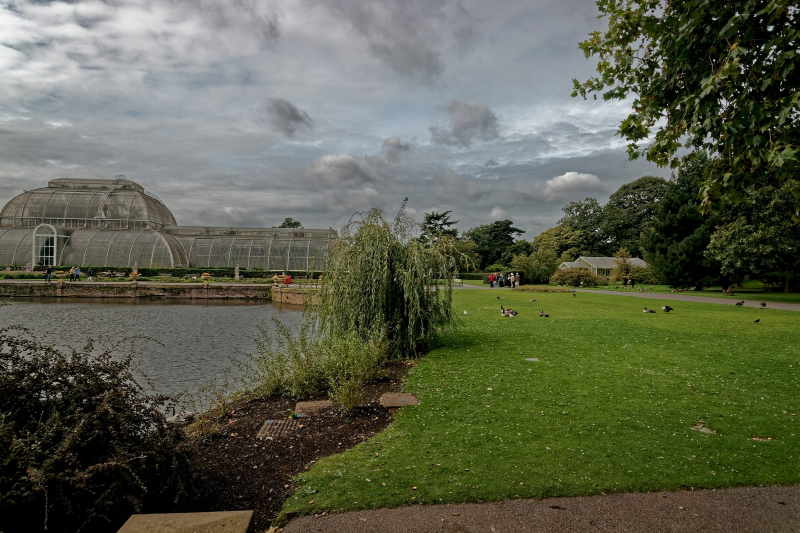
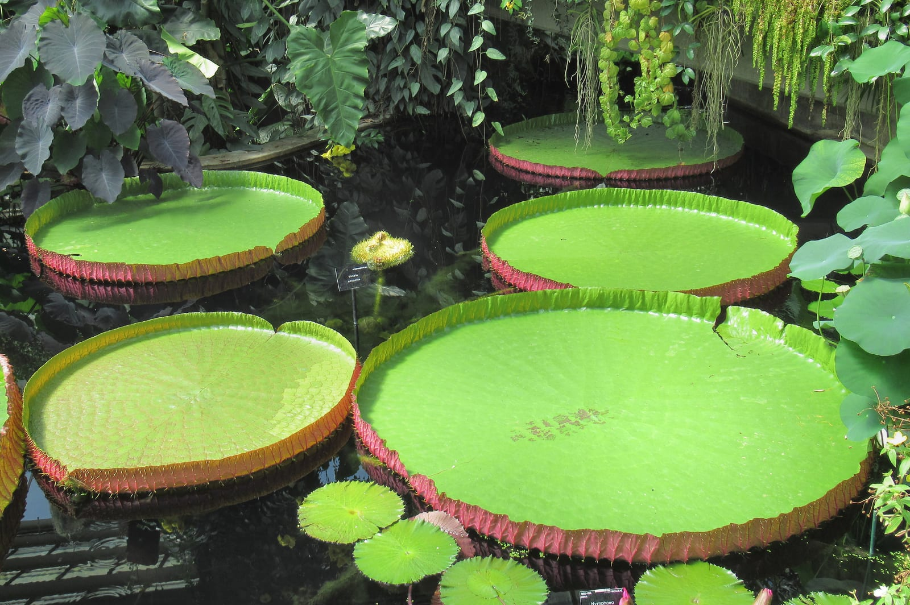
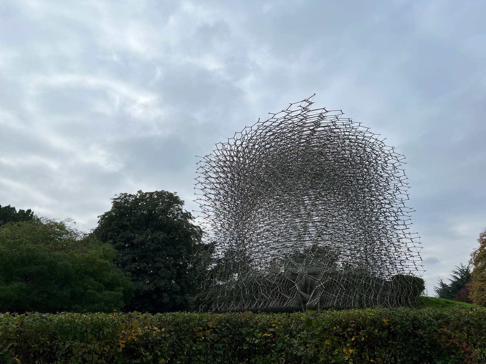
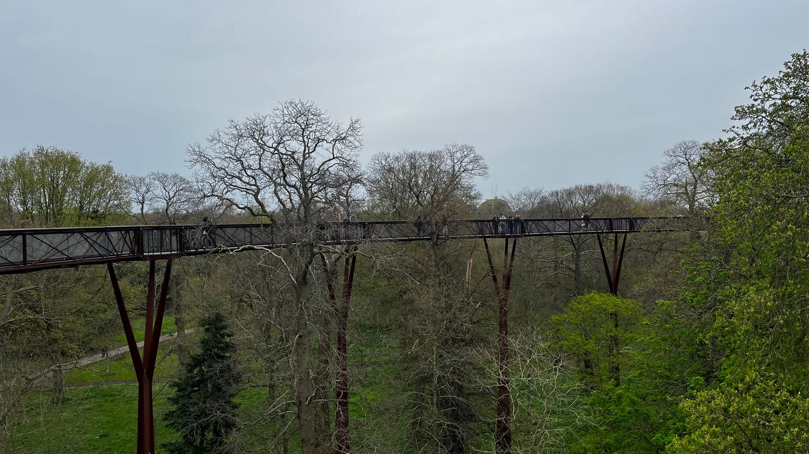
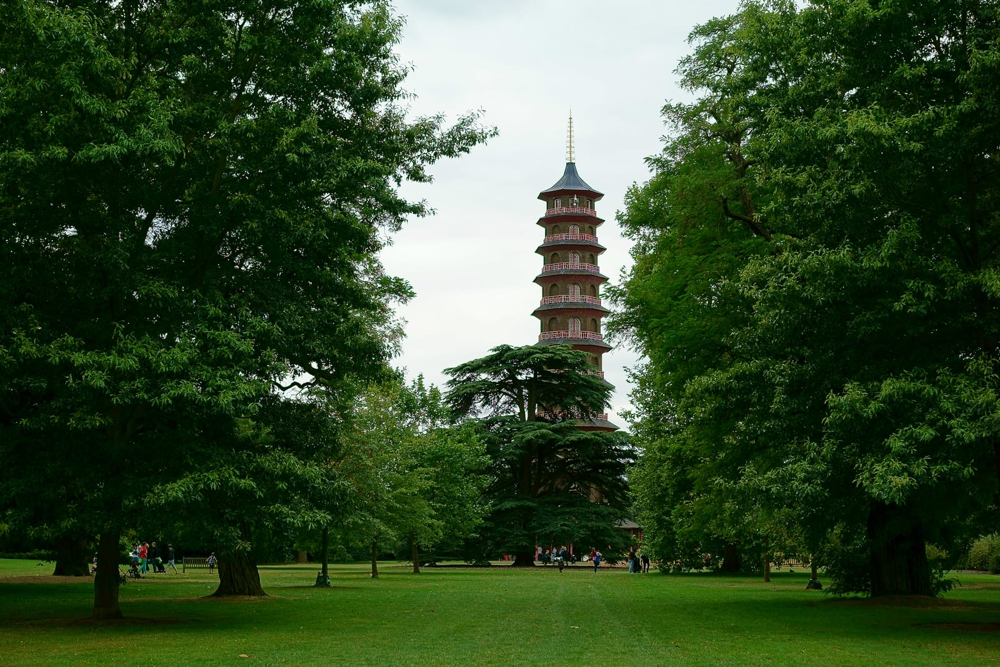
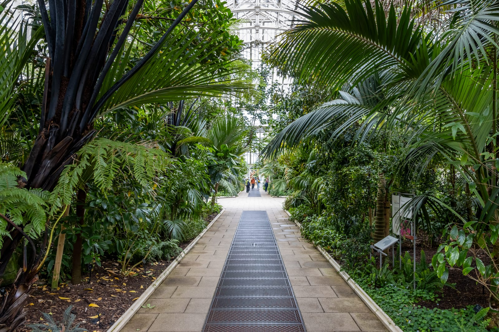

Kew Gardens is a 320-acre UNESCO World Heritage Site on the Thames in southwest London, with more than 50,000 living plants, three major glasshouse complexes, an 18-metre treetop walkway and an 18th-century Chinese pagoda.

It's also easy to under-plan a visit: a casual 90-minute stroll leaves you stranded between pavilions, having spent the whole visit power-walking across open lawns instead of going inside anything.

> 💡 **The Short Version:**
> - **Time needed:** Allow at least **4 hours** — Kew covers **320 acres**, and anything under 3 hours means rushed walking between distant points.
> - **Which gate:** **Victoria Gate** for the Tube (District line) or the Mildmay line (London Overground) into **Kew Gardens station**, 500m away. **Elizabeth Gate** for South Western Railway into **Kew Bridge station**, 800m away. From **2 November 2026 to 29 January 2027**, **Lion Gate is open weekends only**.
> - **2026 tickets:** Adult is **£25 online / £28 at the gate** in peak season (**2 September–31 October**), dropping to **£17 / £20** off-peak. Children (4–15) are **£2 online / £4 at the gate**; concessions for disabled visitors and over-65s are **£23 online peak / £15 off-peak**. Book direct or through <a href="https://www.getyourguide.com/s/?q=Kew+Gardens+London&amp;partner_id=WWP7I0R&amp;cmp=kew-gardens-guide" target="_blank" rel="sponsored nofollow noopener" data-affiliate="gyg">Kew Gardens entry tickets on GetYourGuide</a>.
> - **£10 Tuesdays:** Every **Tuesday from 8 September to 29 December 2026**, adult entry drops to **£10 online** — a bounded promotion, not a standing offer.
> - **Winter warning:** From **12 November 2026**, last entry is **2.30pm** and the gates shut at **3.15pm** — almost four hours earlier than in September.

---

## 2026 ticket prices and booking

Kew runs seasonal pricing: peak from 2 September to 31 October, off-peak from 1 November to 31 January. Buying online saves £3 per adult against the gate price, in both seasons, and avoids the ticket queue on sunny weekends.

| Ticket | Peak online | Peak gate | Off-peak online | Off-peak gate | Notes |
| :--- | ---: | ---: | ---: | ---: | :--- |
| **Adult** | **£25.00** | £28.00 | **£17.00** | £20.00 | Excludes the optional donation |
| **Child (4–15)** | **£2.00** | £4.00 | **£2.00** | £4.00 | Flat rate from 2 September 2026; under-4s free |
| Concession | £23.00 | £26.00 | £15.00 | £18.00 | Disabled visitors and over-65s; ID may be checked at the gate |
| Young adult (16–29) / student | £10.00 | £12.00 | £7.00 | £10.00 | Proof of age, or an NUS or university card |
| Universal Credit / Pension Credit | £1.00 | £1.00 | £1.00 | £1.00 | One per claimant, plus up to 4 guest tickets |

Every **Tuesday from 8 September to 29 December 2026**, £10 Tuesdays brings adult entry down to £10 online (£11 with the optional donation) — a bounded promotion for that run of Tuesdays, not a standing offer.

*Prices above exclude the optional Gift Aid donation at checkout. Add at least 10% and, if you're a UK taxpayer, Kew can reclaim tax on the whole amount you pay.*

Tickets can be bought direct or via authorised ticketing platforms such as <a href="https://www.getyourguide.com/s/?q=Kew+Gardens+London&amp;partner_id=WWP7I0R&amp;cmp=kew-gardens-guide" target="_blank" rel="sponsored nofollow noopener" data-affiliate="gyg">Kew Gardens entry tickets on GetYourGuide</a>, which include free cancellation up to 24 hours before entry. Check live date availability below:

---

## Which gate to use, and how to get there

Kew Gardens has four public entry gates spread around its multi-kilometre perimeter. Arriving at the wrong gate can add 20 minutes of roadside walking before you're even inside.

| Gate | Arrive by | Walk | What is just inside |
| --- | --- | --- | --- |
| **Victoria** | Kew Gardens station, District line and the Mildmay line | 500m, about 5 min | The Palm House, the pond, and the shop and cafe at Victoria Plaza |
| **Elizabeth** | Kew Bridge station, South Western Railway from Waterloo | 800m, about 10 min | Kew Palace and the Princess of Wales Conservatory |
| **Lion** | Richmond station, or the 65 bus towards Ealing Broadway | 15 min on foot from Richmond | The Great Pagoda and the Temperate House |
| **Brentford** | Ferry Lane car park, off the A307 | At the gate | The lake and the Sackler Crossing, and the quietest corner of the Gardens |

### 1. Victoria Gate (for the Tube and Overground)
- **Nearest station:** **Kew Gardens** (District line and the Mildmay line, London Overground; Zone 3).
- **Walking distance:** 500 metres, about five minutes, signposted from the station.
- **Why choose it:** This is the most practical entry point. It places you immediately beside the **Palm House**, the ornamental pond, and the Victoria Plaza shop and café.

### 2. Elizabeth Gate (north entrance, by the river)
- **Nearest station:** **Kew Bridge** (South Western Railway from London Waterloo via Vauxhall and Clapham Junction; no level access at the station).
- **Walking distance:** 800 metres, about ten minutes, across Kew Bridge and past Kew Green.
- **Why choose it:** Best if you're arriving on National Rail from Waterloo. Leads directly into the **Princess of Wales Conservatory** and **Kew Palace**.

### 3. Lion Gate (south entrance)
- **Nearest station:** **Richmond** (District line, Overground and SWR fast trains) — 15 minutes' walk, or the **65 bus** towards Ealing Broadway.
- **Why choose it:** The closest gate to **The Great Pagoda** and the **Temperate House**.

> ⚠️ **Lion Gate is weekends only from 2 November 2026 to 29 January 2027.** It's closed Monday to Friday over that stretch. Victoria, Elizabeth and Brentford Gates stay open daily throughout.

### 4. Brentford Gate (west entrance, for driving)
- **Access:** Ferry Lane, off the A307 Kew Road.
- **Car parking:** Kew's visitor car park at Ferry Lane (TW9 3AF) costs **£10 a day**, paid by card at the meter or the paybyphone app. No charge for motorcycles or mopeds, and blue badge holders park free. Spaces are limited and go first come, first served; on selected weekends in peak season, the **Herbarium car park** opens as overflow once Ferry Lane fills. Kew sits inside the **Ultra Low Emission Zone**, though not the Congestion Charge zone.

---

Powered by <a target="_blank" rel="sponsored" href="https://www.getyourguide.com/london-l57/">GetYourGuide</a>

## A four-hour circuit

Kew is 320 acres, and walking it aimlessly leads to fatigue. This clockwise route starts at Victoria Gate and takes in the glasshouses, the Hive, the Treetop Walkway and the Great Pagoda without doubling back.

*The Palm House, completed in 1848 by Decimus Burton and Richard Turner. Photo: Txllxt TxllxT (CC BY-SA 4.0).*

### Stop 1: The Palm House and pond (0–45 minutes)
Enter via Victoria Gate and head directly to the Palm House. Designed by Decimus Burton and engineer Richard Turner and completed in 1848, the building is constructed from curved wrought-iron ribs without internal supporting columns — borrowing construction methods from the Victorian shipbuilding industry.

Inside, temperatures are held at 21–27°C with high relative humidity. It houses tropical rainforest specimens, including the world's oldest potted plant: an Eastern Cape giant cycad (*Encephalartos altensteinii*) brought to Britain from South Africa by botanist Francis Masson in 1775.

> **Wipe your lens before you go in.** Camera lenses, smartphones and glasses fog up instantly on entry during colder months. Give them two minutes to acclimatise, then climb the cast-iron spiral staircase to the elevated walkway for a view over the canopy.

### Stop 2: The Princess of Wales Conservatory and Rock Garden (45–90 minutes)
Walk north along the Broad Walk towards the northern perimeter. The **Princess of Wales Conservatory**, opened by Diana, Princess of Wales in 1987, is an energy-efficient multi-level glasshouse containing ten distinct climatic zones controlled by automated environmental systems.

*Giant Amazonian waterlilies (Victoria amazonica) in the wet tropical zone of the Princess of Wales Conservatory. Photo: AndyScott (CC BY-SA 4.0).*

Key zones inside:
- **The Wet Tropical Basin:** Home to the giant Amazonian waterlilies (*Victoria amazonica* and *Victoria cruziana*), whose buoyant leaves span over two metres across and can support significant weight.
- **The Arid Zone:** Housing towering column cacti, agave, and desert succulents from Madagascar and the Americas.
- **Carnivorous Plants:** Displays of Venus flytraps, sundews, and pitcher plants (*Nepenthes*).

Exiting the conservatory, cut through the adjacent **Rock Garden**, one of the oldest and largest continuous man-made alpine rock gardens in the world, built from Sussex sandstone.

### Stop 3: The Hive and arboretum (90–135 minutes)
Head southwest through the arboretum towards the centre of the estate.

*The Hive, an aluminium architectural installation responding in real time to bee activity. Photo: Eddie Johnston (CC BY-SA 4.0).*

At **17 metres tall**, **The Hive** rises out of a wildflower meadow near Elizabeth Gate — a lattice of 170,000 aluminium parts and 1,000 LED lights, built for the UK Pavilion at the 2015 Milan Expo before it moved to Kew. Artist Wolfgang Buttress designed it to respond in real time to a working bee colony in the Gardens: the lights pulse with the bees' vibrations, and a musical soundscape plays every note in the key of C — the pitch bees buzz in. It won a Landscape Institute Award in 2016.

The path in is wheelchair-accessible, though the gradient can feel steep for self-propelled users, and Kew cannot accommodate mobility scooters inside. **The Hive is closed from 28 to 30 September 2026.**

### Stop 4: The Treetop Walkway and Rhizotron (135–175 minutes)
Continue south towards the southwestern woodlands to reach the **Xstrata Treetop Walkway**, designed by Marks Barfield Architects (the architectural firm responsible for the London Eye).

*The Xstrata Treetop Walkway, rising 18 metres into the canopy. Photo: Bryn Holmes (CC BY-SA 2.0).*

- **Height:** 18 metres (59 feet) above ground level.
- **Length:** 200-metre circular walkway made of weathered Corten steel.
- **Experience:** The walkway puts you level with the crowns of mature sweet chestnuts, limes, and English oaks. The structure is engineered to sway slightly in moderate winds. Lift access is available for wheelchair users and those with restricted mobility.
- **The Rhizotron:** At the base of the walkway, an underground chamber built into an artificial earth mound provides cross-sectional views into living tree root systems, soil fungi networks, and subterranean ecology.

### Stop 5: The Great Pagoda (175–205 minutes)
Follow the southern path towards Lion Gate. Here stands **The Great Pagoda**, completed in 1762 by Sir William Chambers as a gift for Princess Augusta.

*The Great Pagoda, designed by Sir William Chambers in 1762. Photo: Peter Trimming (CC BY-SA 2.0).*

- **The dragons:** The 2018 restoration reinstated all **80 dragons** along the eaves, each carved from gilded wood, matching the original 18th-century design. The originals were removed in 1784 — rumoured to have been sold to settle George IV's gambling debts, though Historic Royal Palaces believes they had simply rotted, being made of wood.
- **Climbing the Pagoda:** Open daily until **27 September 2026**, 11am to a last timeslot at 4pm. You need a Kew Gardens ticket first, then book a Pagoda slot as an Optional Extra, or separately if you already have Gardens entry. Nearest entrance: Lion Gate.

> ⚠️ **The Pagoda closes for the season on 28 September 2026.** Along with Kew Palace and Queen Charlotte's Cottage, it stays shut until spring 2027.

### Stop 6: The Temperate House (205–240 minutes)
Finish your circuit at the centrepiece of the southern gardens: the **Temperate House**.

*Inside the Temperate House, the world's largest surviving Victorian glasshouse. Photo: Mike Peel (CC BY-SA 4.0).*

The Temperate House is the largest surviving Victorian glasshouse in the world. It is twice the size of the Palm House, covering 4,880 square metres. Designed by Decimus Burton in 1860, it took 39 years to finish and reopened in May 2018 following a five-year, £41-million restoration during which 69,000 panes of glass were replaced.

Unlike the humid tropical atmosphere of the Palm House, the Temperate House maintains a cooler, Mediterranean-to-subtropical climate. It houses 1,500 species from five temperate regions: Africa, Australia, New Zealand, the Americas, and Asia.

Notable specimens:
- ***Encephalartos woodii* (Wood's Cycad):** One of the rarest plants on the planet. Discovered in South Africa in 1895, it is extinct in the wild. Only male specimens have ever been found, meaning natural sexual reproduction is impossible; all living plants are clones of that single original specimen.
- ***Dombeya mauritiana*:** A flowering tree from Mauritius that was believed entirely extinct until a single wild specimen was spotted in a Mauritian cliff forest and successfully propagated at Kew.

From the Temperate House, walk 8 minutes north along the Pagoda Vista back to Victoria Gate to exit.

---

## Which glasshouse to see first

If your schedule is tight and you can't visit all three major glasshouse complexes, use this comparison to choose:

| Glasshouse | Architectural style | Atmosphere and climate | Key highlight | Best for |
| :--- | :--- | :--- | :--- | :--- |
| **Palm House** | 1848 Victorian curved wrought iron | Dense, humid tropical heat (21–27°C, 80%+ humidity) | 1775 Eastern Cape cycad, elevated canopy gallery | Architecture fans and rainforest species |
| **Temperate House** | 1860–1899 grand Victorian iron and stone | Airy, temperate, moderate warmth | World's rarest extinct-in-the-wild cycads (*Encephalartos woodii*) | Spacious walking, photography, rare species |
| **Princess of Wales** | 1987 modern low-profile conservatory | 10 zoned microclimates (arid desert to wet tropical) | Giant Amazonian waterlilies, carnivorous plants, orchids | Plant diversity and interactive climate shifts |

Accessibility differs between them: the Temperate House and Alpine House take wheelchairs and mobility scooters, the Palm House takes wheelchairs but not scooters, and the Princess of Wales Conservatory takes both on its ground floor only.

---

## Seasonal hours and daily timing

Operating hours at Kew change across the year:

| Dates | Gates open | Last entry | Gates close |
| :--- | :--- | :--- | :--- |
| **1–30 September 2026** | 10am | **6pm** | 7pm |
| **1–24 October 2026** | 10am | **5pm** | 6pm |
| **25 October–11 November 2026** | 10am | **3pm** | 4pm |
| **12 November 2026–3 January 2027** | 10am | **2.30pm** | 3.15pm |

Glasshouses close earlier than the gardens overall — 5pm through September 2026.

> ⚠️ **Winter hours are much shorter.** From 12 November 2026 to 3 January 2027, last entry is 2.30pm and the gates close at 3.15pm — almost four hours earlier than in September. Lion Gate is also weekends-only for most of this stretch.

---

Powered by <a target="_blank" rel="sponsored" href="https://www.getyourguide.com/london-l57/">GetYourGuide</a>

## Practical information

### Food, drink and picnics
- **The Orangery:** Coffee, cakes and light meals in an 18th-century building near Elizabeth Gate — the informal option for a coffee break or lunch. Closes at 4pm on selected dates, including 25 and 26 September and 2 and 3 October 2026.
- **The Botanical Brasserie:** A separate, all-day restaurant with modern British breakfast, lunch and afternoon tea. Mains run £23.50–£32 at lunch. You need a Kew Gardens ticket before you can book a table.
- **Pavilion Bar & Grill:** Near the Temperate House. Burgers and Mediterranean-inspired dishes grilled on charcoal or smoked over wood, with outdoor terrace seating.
- **Victoria Plaza Café:** At Victoria Gate. Coffee, cakes, sandwiches and snacks, for a quick stop.
- **Picnics:** Bring your own food onto the grass — but leave the barbecue and picnic furniture at home; neither is allowed.

### Accessibility and mobility
- **Terrain:** The Gardens are largely flat, with tarmac paths in most places, which suits wheelchairs and prams.
- **Free wheelchairs:** A limited number are available at all four public entry gates, first come, first served — no need to book.
- **Mobility scooters:** Bring your own pavement-use scooter (up to 4mph), or book one of Kew's mobility scooters in advance from Brentford, Victoria or Elizabeth Gate — not Lion Gate. The Palm House and the Hive can't take a mobility scooter regardless of which one you bring.

### What people get wrong
1. **Underestimating the walk between gates.** The four gates sit far apart around the perimeter — wear comfortable shoes if you're entering at one and leaving by another.
2. **Missing the winter cutoff.** From 12 November, last entry is 2.30pm and the gates shut at 3.15pm — arriving at 2pm leaves barely an hour.
3. **Relying on the car park.** Ferry Lane fills on busy days; the Herbarium car park only opens as overflow on selected peak-season weekends.
4. **Paying full price at the gate.** Online tickets are £3 cheaper per adult than the gate price, in both peak and off-peak season.

---

## Continue planning your London trip

- 🌇 **[The Best Rooftop and Riverside Restaurants in London](/articles/best-rooftop-restaurants-london/)** — including the riverside rooms a short walk from the gate
- 🌳 **[London's Best Parks and Gardens](/articles/best-parks-gardens-london/)** — 17 green spaces compared across the city.
- 🦌 **[Richmond Area Guide](/articles/richmond-area-guide/)** — the park, the river and Richmond Hill, just south of Kew.
- 👨‍👩‍👧 **[London with Children](/articles/london-with-children/)** — more family days out, including which ones are free.
- 🚇 **[Getting Around London: Transport Guide](/articles/getting-around-london-transport-guide/)** — how the Tube, Overground and contactless fares work.
- 🏛️ **[Tower of London Guide](/articles/tower-of-london-guide/)** — how to see the Crown Jewels without a 90-minute queue.

---

*Prices and opening hours are Kew's own, checked 19 September 2026.*
