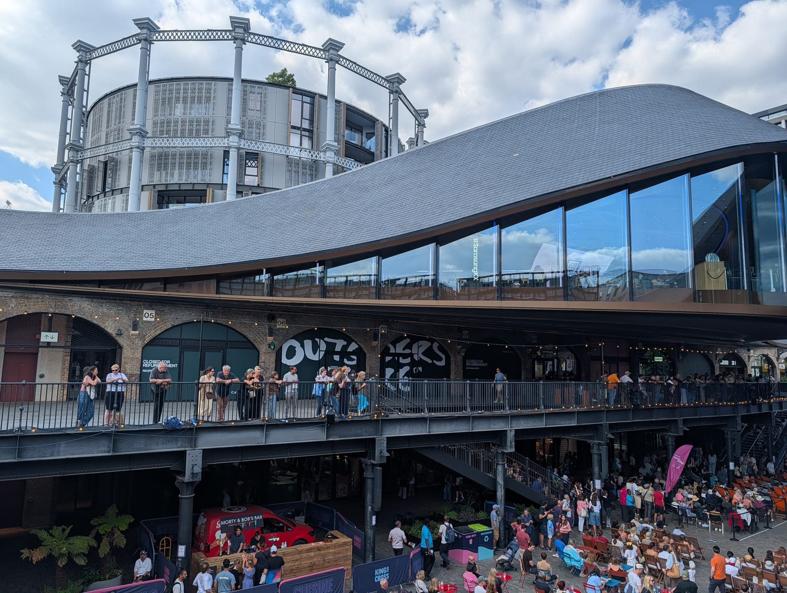
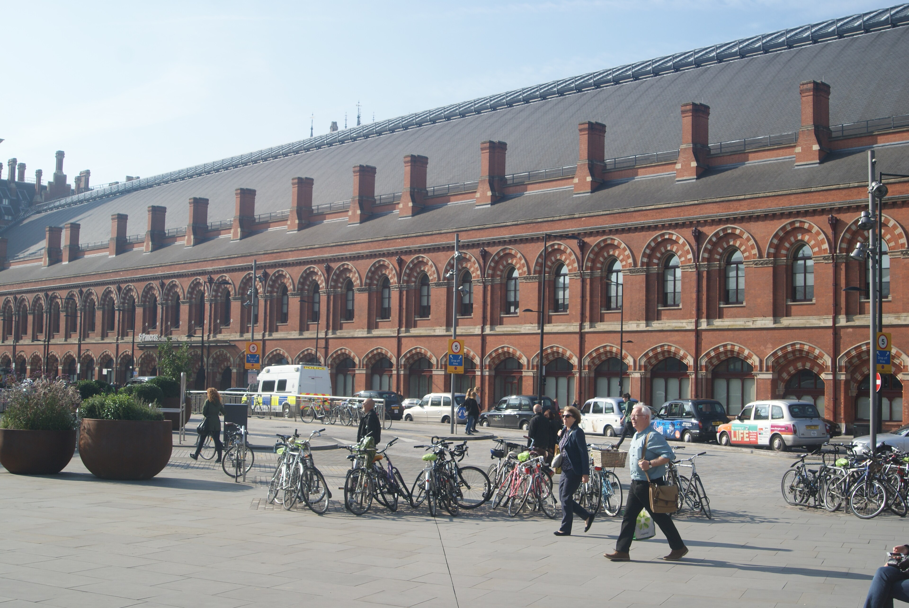
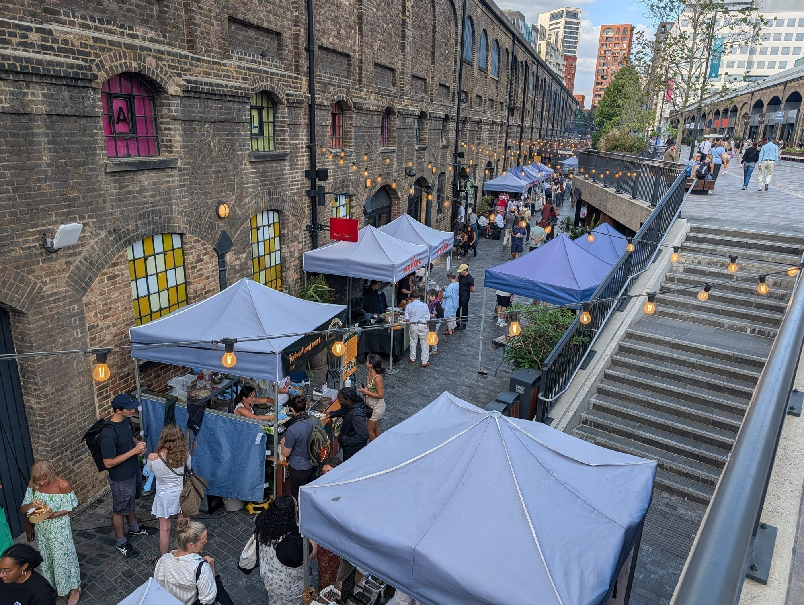
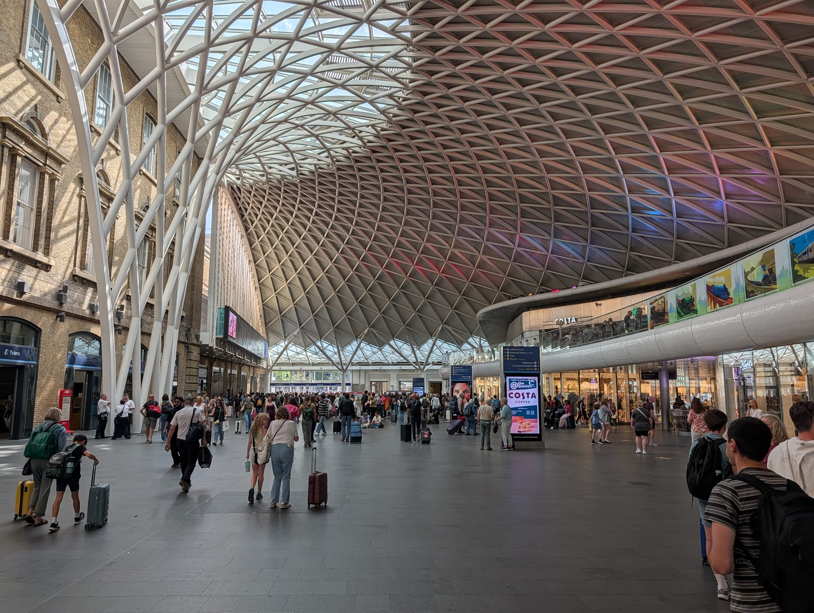
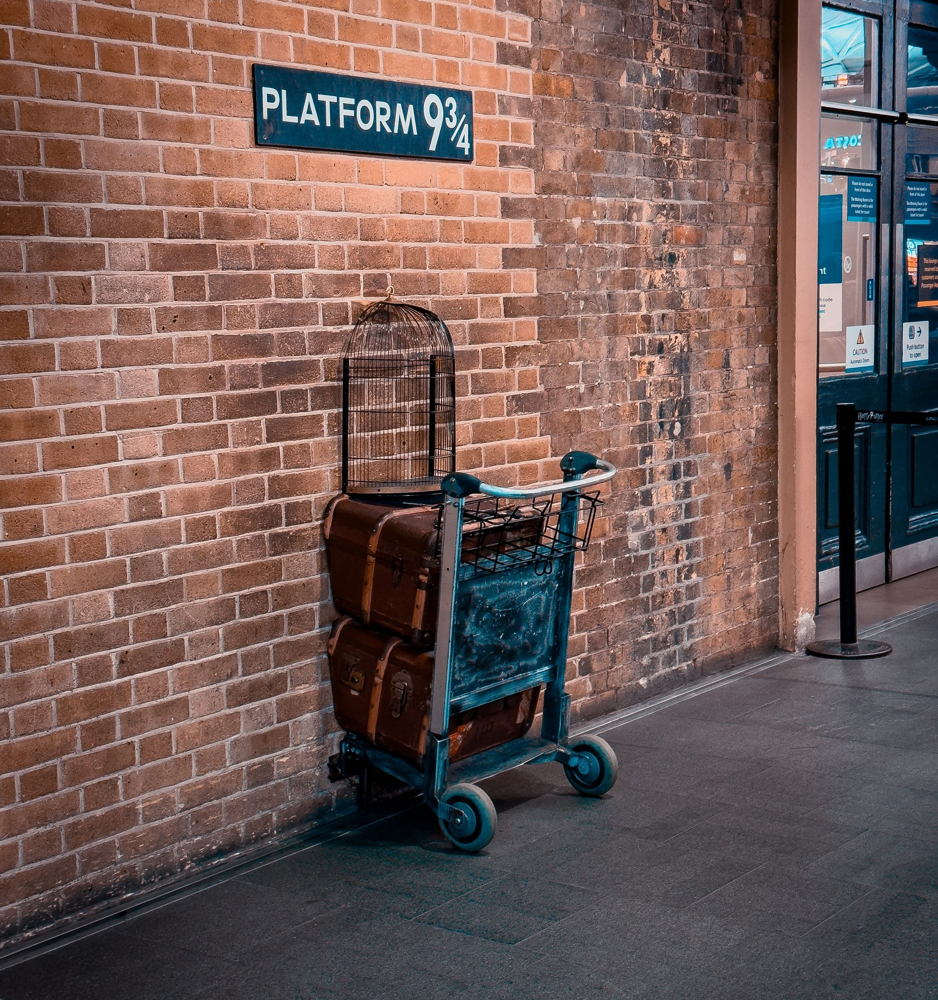
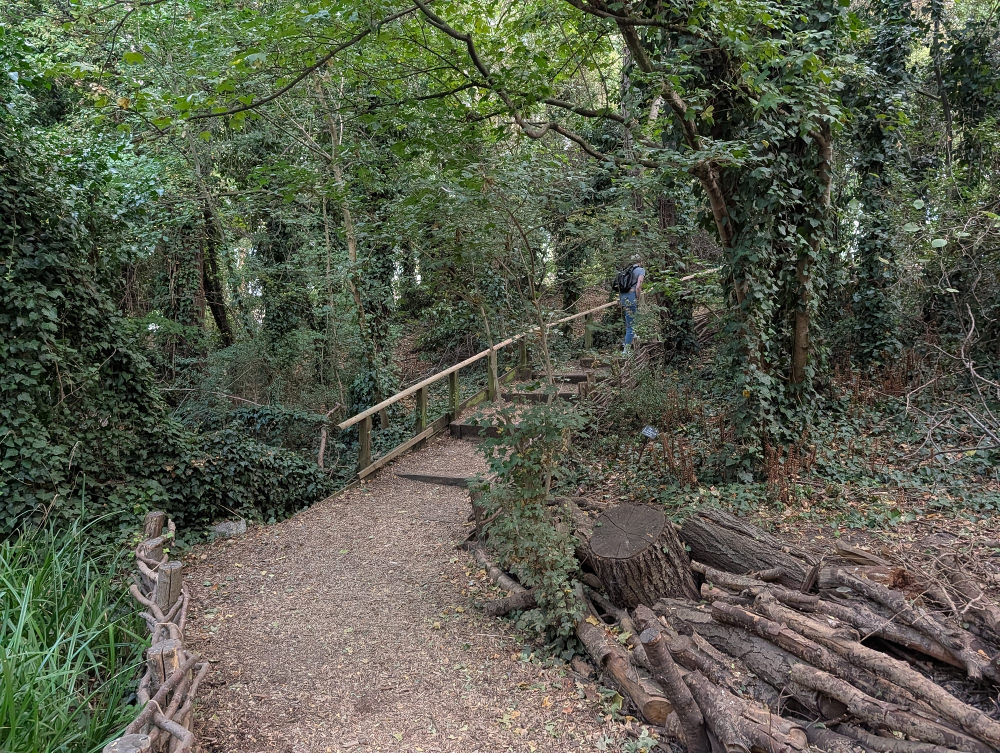

King's Cross is the most complete piece of urban redevelopment in modern London. Until about 2007 the 67 acres behind the two stations were derelict railway goods yards with a reputation to match. They are now squares, canalside terraces, a university campus in a Victorian granary, and the best free exhibition space in the city.

It is also the point where two great stations, six Tube lines, the Eurostar and the Regent's Canal all meet, which makes it the most useful arrival point in London.

King's Cross has its own share of the commemorative plaques marking where notable people lived or worked - see them on our [interactive map](/plaques/?area=kings-cross).

## Why visit — and who should skip it

**Come here if** you are interested in what cities do with industrial land, or you want a canal walk, or you have an hour before a train. The area is compact, entirely walkable and mostly free.

**Skip it if** you want historic London. Almost everything here is either Victorian railway infrastructure or built in the last twenty years. There is no medieval street pattern and nothing older than the 1850s worth seeking out.

## Top sights and activities

1. **Coal Drops Yard** — Two 1850s coal warehouses joined by Thomas Heatherwick with a swooping kissing-roof. Independent shops, restaurants and a cobbled yard.

*The kissing-roof, seen from below. The two original warehouse roofs were extended until they touched.*
2. **The British Library Treasures Gallery** — Magna Carta, the Lindisfarne Gospels, Leonardo's notebook, Handel's Messiah in his own hand, and Beatles lyrics scribbled on envelopes. Free, and one of the great rooms in London.
3. **Granary Square** — 1,000 choreographed fountains in front of Central Saint Martins. Children play in them all summer; the steps down to the canal are the best sitting spot in the area.
4. **Platform 9¾** — The trolley in the wall at King's Cross station, in the western concourse rather than on a platform. Free to queue, paid for the photo.
5. **The Regent's Canal towpath** — West to Camden in 30 minutes, past St Pancras Lock and the Camley Street nature reserve.
6. **St Pancras station** — George Gilbert Scott's Gothic hotel frontage and Barlow's iron trainshed, saved from demolition by John Betjeman, whose statue stands on the upper concourse.
7. **Camley Street Natural Park** — Two acres of wetland between the canal and the railway. Free, and genuinely a surprise.

## Key streets and micro-districts

*St Pancras International. Photo: [Robert Lamb](https://commons.wikimedia.org/wiki/File:View_of_St._Pancras_station_from_outside_King%27s_Cross_station_-_geograph.org.uk_-_4668700.jpg), [CC BY-SA 2.0](https://creativecommons.org/licenses/by-sa/2.0/).*

### Granary Square and Coal Drops Yard

The centre of the redevelopment, and the part worth walking even if you buy nothing. **Granary Square has more than a thousand choreographed fountains** set flush into the paving, free, lit at night and switched off in winter — children run through them all summer and nobody minds.

**The granary building itself is Central Saint Martins**, an art school rather than a shop, so the ground floor is open and the crowd is students.

**Coal Drops Yard** is the shopping half, in Victorian arches built in the 1850s to drop coal from rail wagons into carts below, with Thomas Heatherwick's two roofs kissing in the middle. Free to walk through.

**The canal steps below the square are the best free seat in King's Cross** — a wide flight of stone terraces down to the water, facing west, and they fill on a warm evening.

**It is dead early and busiest from mid-afternoon.** The shops keep normal retail hours but the bars and the steps run late, so evening is the better visit.

*The entrance to Coal Drops Yard. The arches were built in the 1850s to drop coal from rail wagons into carts below.*

*The upper level, which runs stalls and events through the summer.*

### The two stations

**King's Cross for the north of England and Scotland; St Pancras for Eurostar, Thameslink and the East Midlands.** They are two minutes apart, they look nothing alike, and confusing them is the single most expensive mistake you can make here — leave margin if you are changing between them.

**St Pancras is the beautiful one.** Barlow's 1868 train shed was the largest single-span structure in the world when it opened, and the Gothic hotel frontage on Euston Road is a separate building bolted to the front of it. Both are free to walk into.

**King's Cross has the Western Concourse**, opened in 2012 — a single steel fan springing from one central funnel, and **Platform 9¾ is against the wall on the left**, outside the ticket barriers.

**The trolley is free to look at and free to photograph yourself.** The staff photographer is optional and will use your phone. Expect a long wait at weekends and in school holidays; first thing in the morning is the only reliably quiet slot, and the shop beside it needs no queue at all.

*The Western Concourse, opened in 2012. The lattice is a single fan of steel springing from one central funnel — and Platform 9¾ is against the wall on the left.*

*The Platform 9¾ trolley. Queuing is free; the photograph taken by the staff photographer is not, and the shop beside it is where the queue ends.*

### Regent's Canal and St Pancras Lock

Behind Granary Square, and the way out of King's Cross that most visitors never take. **The towpath runs west to Camden Lock in about forty minutes on foot**, flat and continuous, passing the zoo and Regent's Park — it is free, and it is a considerably better journey than the Northern line.

**St Pancras Lock** is a working lock you can stand beside, with the **gasholder frames** behind it: cast-iron Victorian guide frames, dismantled and re-erected here, **three now holding flats and the fourth left empty as a circular park**. Gasholder Park is free, open, and roofed in a mirrored canopy.

**Word of Mouth to Camden and Little Venice** runs from the same water if you would rather sit than walk.

**Go west rather than east.** The towpath towards Islington disappears into the Islington Tunnel after ten minutes and you have to come up onto the road.

*The canal steps below Granary Square — the best place to sit in King's Cross, and free.*

*St Pancras Lock, with the gasholder frames behind. Three of them now hold flats; the fourth is a park.*

### Camley Street Natural Park
Off the towpath between the canal and the railway. **Two acres of woodland, marsh and pond**, made a nature reserve in 1984 on the site of a former coal drop — and the fastest way to stop hearing King's Cross without leaving it.

**It is free, and the mainline into St Pancras runs along the far side**, which is the surprise of the place: kingfishers and reed beds with a Eurostar going past behind the trees.

It is small enough to walk in twenty minutes and there is a visitor centre and café by the entrance. **Hours are shorter than a park's** — it closes in the late afternoon and is not open every day of the week, so check before making the walk. Access is from Camley Street, or down from the towpath.

*Camley Street. The mainline into St Pancras runs along the far side of this, which is the surprise of the place.*

Free, with a visitor centre and a café. It keeps daytime hours and closes earlier in winter, so check if you are making a trip for it rather than passing on the towpath.

### Caledonian Road and Keystone Crescent

North of the stations, and ordinary working London the moment you cross the canal — kebab shops, hardware stores and buses, with none of the redevelopment money that stopped at Granary Square.

**Keystone Crescent is the reason to walk up.** A tiny double crescent of 1840s terraces, reputedly **the tightest radius of any terrace crescent in Europe**, tucked off the main road and easy to walk straight past. It is a residential street with nothing to buy and no marker.

**Free, always open, and it takes five minutes.** Combine it with the walk to Camden along the canal rather than making a trip of it on its own — Caledonian Road station is about eight minutes further north if you would rather not walk back.

### Somers Town and the British Library

West of the stations, between Euston Road and Camden, and a quiet residential pocket most visitors never enter.

**The British Library is free and it is the reason to come.** The **Treasures gallery** holds Magna Carta, Leonardo's notebook, Shakespeare's First Folio, Handel's *Messiah* in his own hand and the Beatles' lyrics on the back of envelopes — no ticket, no booking, and it takes an hour. The reading rooms need a reader's pass; the Treasures gallery does not.

**Its piazza is one of the better free places to sit** in this part of London, with Paolozzi's huge bronze Newton at the centre.

**The Francis Crick Institute** next door is a working research building, but its ground-floor exhibition space is free and open to the public.

**The Library closes earlier than you would expect on Sundays**, and the Treasures gallery keeps its own hours separate from the building's — worth checking if it is the only reason you are going.

Powered by <a target="_blank" rel="sponsored" href="https://www.getyourguide.com/london-l57/">GetYourGuide</a>

## Where to eat and drink

| Spot | Style | Price | Why go |
| --- | --- | --- | --- |
| **Dishoom King's Cross** | Bombay-inspired Indian | ££ | In a former transit shed; the biggest of the group |
| **Caravan** | All-day dining | ££ | In the granary building on Granary Square |
| **The German Gymnasium** | Grand European | £££ | An 1865 gymnasium beside St Pancras |
| **Vermuteria** | Bar and cafe | ££ | In Coal Drops Yard, with a cycling theme |

## Getting there

**By Tube.** **King's Cross St Pancras** is the busiest interchange in the network: Piccadilly, Victoria, Northern, Circle, Metropolitan and Hammersmith & City. Allow extra time — the walk between some platforms is several minutes.

**By rail.** King's Cross for the East Coast Main Line. St Pancras for **Eurostar**, East Midlands and Thameslink. Thameslink runs direct to **Gatwick** and **Luton Airport Parkway** from St Pancras — see the [Gatwick guide](/articles/gatwick-airport-to-london/) and [Luton guide](/articles/luton-airport-to-london/).

**Best exit.** Follow signs for **"King's Cross Square"** for the stations and Platform 9¾, or **"Granary Square"** for Coal Drops Yard and the canal.

## How long to spend, and when to go

| If you have | Do this |
| --- | --- |
| **One hour** | Granary Square, Coal Drops Yard and the canal steps |
| **Half a day** | Add the British Library Treasures Gallery and Camley Street |
| **A full day** | Walk the canal to Camden and back, or on to Regent's Park |

**Best time:** Summer afternoons for the fountains and the canal steps, which is when the area is at its best. The British Library is quietest first thing.

**Note:** Coal Drops Yard shops keep normal retail hours; the restaurants run later. The canal towpath is unlit in places and best walked in daylight.

## Suggested two-hour walking route

1. **Start:** King's Cross St Pancras, **King's Cross Square** exit. See **Platform 9¾** inside the station if the queue is short.
2. **St Pancras:** Next door for the trainshed and the Betjeman statue.
3. **British Library:** Two minutes west for the **Treasures Gallery**. Free.
4. **Granary Square:** North past the fountains to **Coal Drops Yard**.
5. **The canal:** Down the steps to the towpath and west to **St Pancras Lock**.
6. **Finish:** **Camley Street Natural Park**, or keep walking to Camden.

Powered by <a target="_blank" rel="sponsored" href="https://www.getyourguide.com/london-l57/">GetYourGuide</a>

## Common mistakes to avoid

1. **Going to the wrong station.** King's Cross and St Pancras are separate. Check whether your ticket says Eurostar or East Coast.
2. **Looking for Platform 9¾ on a platform.** It is in the western concourse, behind the ticket barriers for the actual platforms.
3. **Underestimating the Tube interchange.** Six lines meet here and some connections involve a long walk. Allow ten minutes.
4. **Missing the British Library.** It looks like an office block from the road. The Treasures Gallery inside is world class and free.
5. **Taking the Tube to Camden.** The canal walk is 30 minutes, flat and far better.
6. **Expecting old London.** Almost nothing here predates the 1850s, and most of it postdates 2010.

## Where to stay

The best-connected base in London, especially for Eurostar or trips north, and much improved from its old reputation.

- **King's Cross and Pentonville Road** — Large modern hotels beside the stations. Convenient and functional.
- **St Pancras Renaissance** — The Gothic hotel in the station frontage itself, if the budget allows.
- **Bloomsbury** — Fifteen minutes south, quieter and better value, still walkable to the Eurostar.
