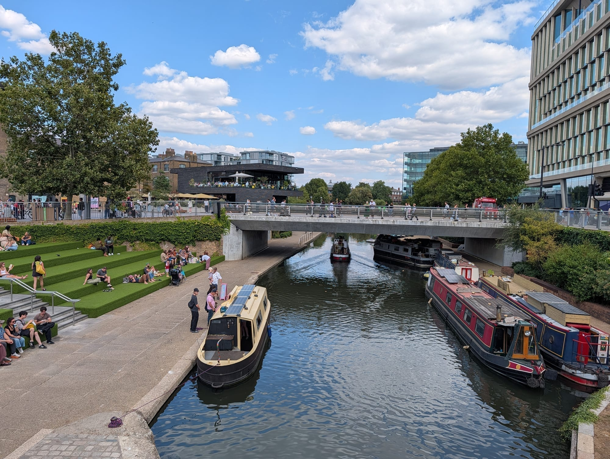
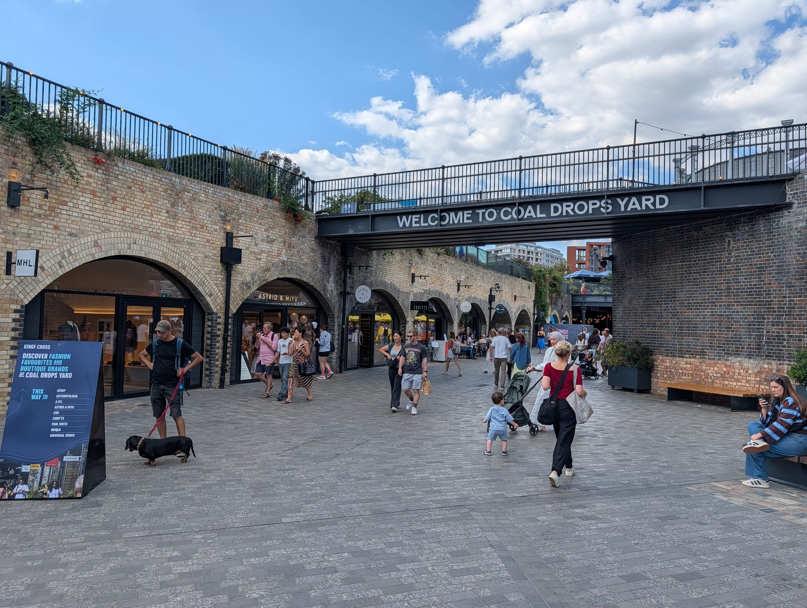
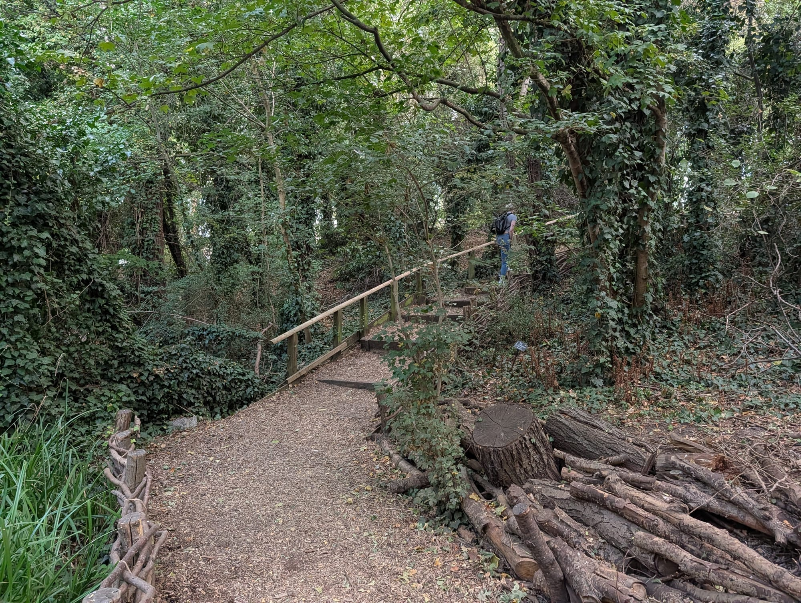
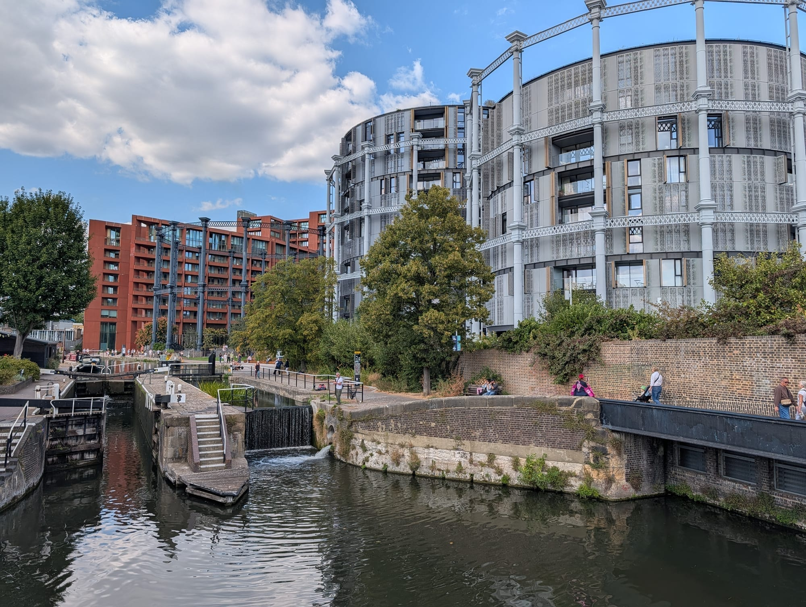
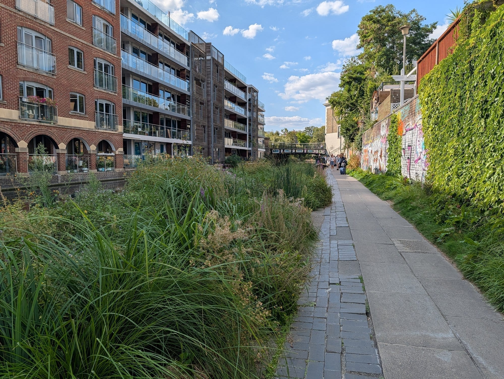
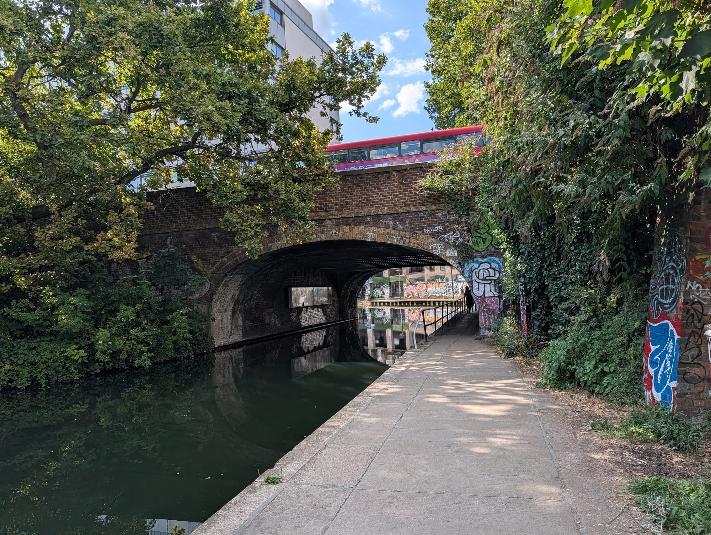
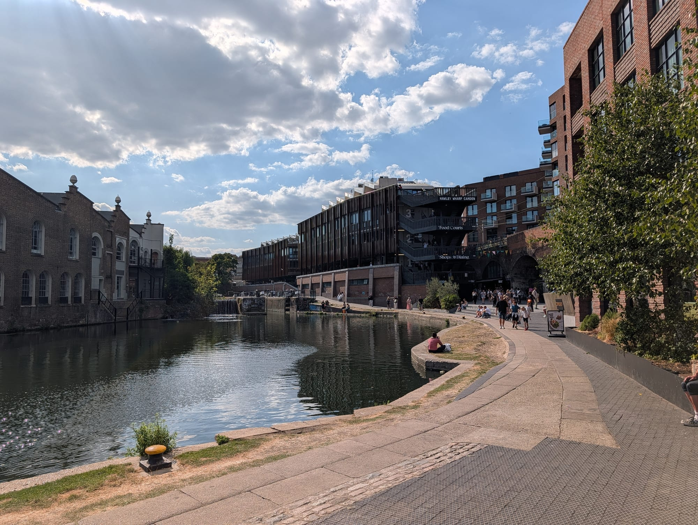
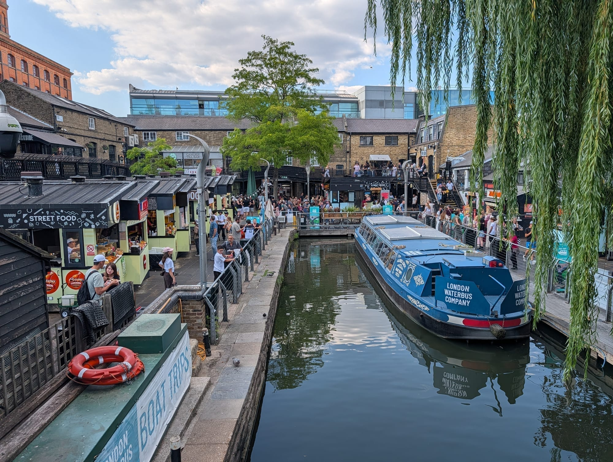
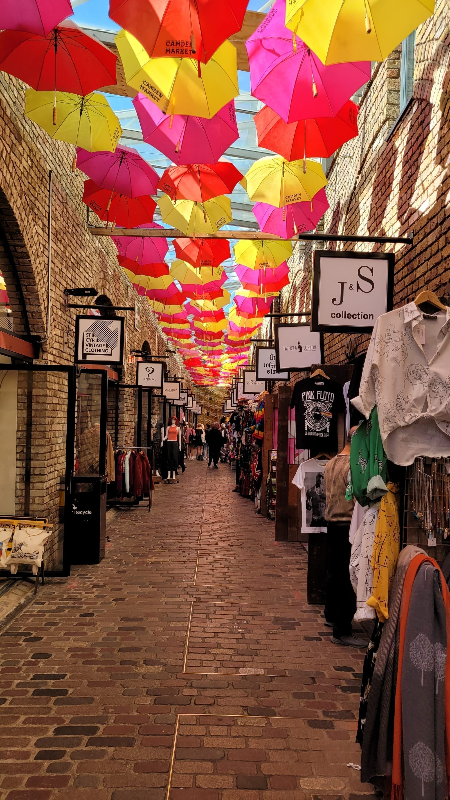

Most people get from King's Cross to Camden on the Northern line, which is quick and shows you nothing. The alternative is a towpath that runs the whole way, is flat, is free, and passes a nature reserve, three working locks and a Victorian gasholder with a lawn inside it.

**This walk goes east to west**, from Granary Square to Camden Market: ten numbered stops over about **1.5 miles**, of which **1.2 miles is towpath**. It takes about **an hour** with stops, or twenty-five minutes if you put your head down and walk it.

The direction matters more than it looks. Done this way you get the built end first, the empty stretch in the middle, and the locks and the market at the finish — which is where you want to be when you are hungry.

For the areas at either end, see the [King's Cross area guide](/articles/kings-cross-area-guide/) and the [Camden area guide](/articles/camden-area-guide/). This is the walking route version of the journey between them.

> 💡 **The Short Version:** Start at **Granary Square** and finish at **Camden Market**. The one stop with a clock on it is **Camley Street Natural Park** — free, on the far bank, and it shuts at **4pm from October to March**. **Camden Market runs 10am to 7pm every day**, bank holidays included. If you want to see a lock actually working, come **before 3.30pm**: Camden's three locks are currently closed to boats overnight because of the drought. And there is a fenced-off stretch of towpath near Camley Street with a **floating pontoon** round it — you do not need a diversion.

## The route

  

    Map of the walk, numbered in walking order
  

  

    
Loading the map…

  

  

    <i class="route-map-marker" aria-hidden="true">1</i> On the route, in walking order
    <i class="route-map-marker route-map-marker--alt" aria-hidden="true">+</i> Optional detour
  

  <noscript>
    
The map needs JavaScript. Every stop below is numbered in walking order with its nearest station.

  </noscript>

**[Open the whole route in Google Maps →](https://www.google.com/maps/dir/?api=1&origin=51.535238,-0.125401&destination=51.542309,-0.147946&waypoints=51.535798,-0.126666%7C51.534970,-0.127094%7C51.536211,-0.127826%7C51.538251,-0.131996%7C51.541035,-0.140200%7C51.541589,-0.142431%7C51.541665,-0.143980%7C51.541117,-0.145725&travelmode=walking)** — all ten stops in walking order, set to walking directions, which is the version to put on your phone.

| # | Stop | Cost | Open |
| --- | --- | --- | --- |
| **1** | Granary Square | Free | Always; fountains in daylight |
| **2** | Coal Drops Yard & Bagley Walk | Free | Yard 10am–11pm; shops from 11am |
| **3** | Camley Street Natural Park | **Free** | **10am–5pm, 4pm in winter** |
| **4** | St Pancras Lock & the gasholders | Free | Always |
| **5** | The quiet mile | Free | Always |
| **6** | Camden Street bridge | Free | Always |
| **7** | Kentish Town Road Lock | Free | Always |
| **8** | Hawley Lock & Hawley Wharf | Free to walk | Food halls 11.30am–11pm |
| **9** | Camden Lock | Free | Always |
| **10** | Camden Market & the Stables | Free | **10am–7pm daily** |
| **+** | Word on the Water | Free to browse | Midday–7pm daily |

---

## 1. Granary Square

*The steps below the square. They are the best free seat in King's Cross and the start of the walk is at the bottom of them.*

**This was a canal basin.** That is the thing to hold on to for the next hour: the square you are standing on is where barges unloaded goods for the rest of London, and the water you are about to walk beside is the reason any of it is here.

The square has **more than 1,000 choreographed fountains** set flush into the paving, each one individually controlled and lit. They are **open daily and run during daylight hours**, and they are free — children go through them all summer and nobody stops them. Townshend Landscape Architects designed the square; The Fountain Workshop built the fountains.

**Go down the steps to the water.** The wide flight of stone terraces on the north side of the square drops straight onto the towpath, and it faces west, which is why it fills on a warm evening.

> 💡 **If you came by Tube, come up through the tunnel.** The **King's Cross Tunnel** runs 90 metres under the road from the stations to King's Boulevard, with an LED art wall of 190 individually controllable vertical pixels along one side, designed by Allies & Morrison with Speirs Major and The Light Lab. It is free and **open 7am to 8pm daily** — so it works on the way there and not on the way back from a late train.

## 2. Coal Drops Yard and Bagley Walk

*A Victorian viaduct that carried an elevated railway, with the coal dropped from the wagons into the stores below. You can walk in from the towpath without going back up to the square.*

**Coal stores under a railway viaduct, now shops.** Trains ran along the top and tipped coal into the arches underneath; the two warehouse roofs have since been extended until they meet in the middle, which is the shape everyone photographs. **You can get into the yard directly from the towpath**, which most people do not realise — and there is a ramp down to the water behind The Lighterman if you want to go the other way.

**The yard is open to visitors 10am to 11pm.** The shops keep shorter hours than that: **Monday to Saturday 11am to 7pm, Sunday 11am to 5pm.** So an early start gets you an empty cobbled yard and a closed shutter, which is a fair trade.

**The part almost nobody finds is above your head.** **Bagley Walk** is an elevated park on the old railway viaduct, curving along the line of the canal — canal and Camley Street Natural Park on one side, Coal Drops Yard on the other. It runs from Somers Town Bridge past the Fish and Coal Building, now Tom Dixon's headquarters and the Coal Office restaurant, and slopes gently down to Granary Square. Dan Pearson planted it, with liquorice, strawberries and figs among the ornamentals.

It takes its name from **Bagleys**, the 1990s King's Cross nightclub.

Powered by <a target="_blank" rel="sponsored" href="https://www.getyourguide.com/london-l57/">GetYourGuide</a>

## 3. Camley Street Natural Park

*Woodchip underfoot, logs stacked along the edge, and a mainline terminus two minutes away. This is the surprise of the walk.*

**Two acres of woodland, marsh and pond on the far bank, and the best thing on this route.** It was a coal drop for the railways into King's Cross, demolished in the 1960s, colonised by nature, and saved from development by London Wildlife Trust, who opened it as a reserve in 1985. It is a Local Nature Reserve and a Site of Metropolitan Importance for Nature Conservation.

**Cross at Somers Town Bridge.** The footbridge links the towpath side with Camley Street, gives the best view of St Pancras Lock on the way over, and is worth two seconds of attention in its own right — Moxon Architects and Arup put only 15mm of steel between the top of the deck and the underside.

Kingfisher, Cetti's warbler, reed warbler, reed bunting, emperor dragonfly and common toad have all been recorded here. The Trust has also floated **reedbeds into the canal itself** along this stretch, which nest birds and shelter fish and take nutrients out of the water — you can see them from the towpath without going in at all.

Inside there is a visitor centre, accessible toilets, baby-changing and the **Kingfisher Café**, which keeps the reserve's hours.

> ⚠️ **This is the one stop with a clock on it.** It opens **10am to 5pm April to September** and **10am to 4pm October to March**, every day. A late-afternoon walk in winter arrives to a locked gate, and there is no way around it. **Assistance dogs only** — worth knowing before you set out with one.

Underfoot: the main path down to the pond dipping platform has an accessible surface; the rest of the reserve is woodchip, and there are **steep steps with handrails** at the southern end.

## 4. St Pancras Lock and the gasholders

*St Pancras Lock, with the gasholder frames behind. Three of them hold flats. The fourth holds a lawn.*

Back on the towpath and a working lock, with the **St Pancras Cruising Club** immediately beyond it. You can stand at the balance beam and look straight down into the chamber.

Behind it, the cast-iron **gasholder frames** — dismantled piece by piece from the far bank, restored, and re-erected here. Three of them now wrap around a circular apartment building. The fourth is **Gasholder Park**, and it is free: the frame of **Gasholder No. 8**, the largest of the King's Cross holders, which once held **1.1 million cubic feet of gas** and now encases a sculpted canopy and a circular lawn.

It is a few steps up off the towpath and takes four minutes. Do it.

## 5. The quiet mile

*Past Camley Street the planting on the bank stops being municipal and starts being deliberate. This is the stretch nobody photographs.*

**From here to Camden there is nothing to buy and nowhere to go.** That is the point of it. The canal runs behind the backs of things — moored boats, allotment-scale gardens, an estate or two, and a run of bridges where the path goes dark and cold for a few seconds at a time.

The moorings along this stretch are **Camden's eco-moorings**, wired with electric power bollards on the bank so boats can plug in rather than run a diesel generator.

You are walking the **Regent's Canal**, driven through north London under John Nash and carrying coal, goods and building materials from 1820 until the 1960s. There is no tunnel on this section and no road to cross: the towpath is unbroken from Granary Square to Camden Lock.

> ⚠️ **There is a fenced-off stretch just past Camley Street, and you can still walk it.** The Canal & River Trust has closed about **35 metres** of towpath north-west of the Camley Street access, from **1 July 2026 to 4 January 2027**, for a new footbridge being built over the canal. Rather than divert walkers onto the road, they have floated a **three-metre-wide pontoon** into the canal alongside the closed path, so you carry straight on. **From January 2027 the bridge deck goes in over the water under a six-week winter stoppage** — check the [Trust's notices](https://canalrivertrust.org.uk/notices) before you travel if you are walking after Christmas.

## 6. Camden Street bridge

*The bus is the giveaway that you are back in a city. The graffiti under this bridge is repainted constantly and none of it will be there next year.*

**This is where the walk changes.** The bridges start coming every couple of hundred metres, the walls get painted, and the noise comes back.

It is also the **easiest place to cut the walk short**: Camden Road Overground is up off the towpath and a couple of minutes away, which is useful if the weather has turned or you have run out of afternoon. If you carry on, you have about **seven minutes of actual walking** left to Camden Lock.

## 7. Kentish Town Road Lock

The first of Camden's three locks, and the one nobody stops at — which makes it the best of them to actually watch, because there is room to stand.

The Canal & River Trust numbers them **downwards** as you walk west: this is **Lock 3**, Hawley is Lock 2, and Camden Lock is Lock 1. All three sit inside **300 metres**, which is why the boats bunch up here and why walking is quicker than floating.

> ⚠️ **Come before 3.30pm if you want to see a lock work.** Because of the drought, the Trust has closed **all three Camden locks to boats between 3.30pm and 9am**, ongoing since 26 August 2026 and under review from 24 September. Outside those hours the gates simply do not open, so an evening walk gets you the architecture and still water.

## 8. Hawley Lock and Hawley Wharf

*Hawley Wharf from the towpath. The food halls above run four hours later than the market does, which is the single most useful thing to know about the Camden end of this walk.*

Lock 2, with **Hawley Wharf** stacked above it on Chalk Farm Road — the newest quarter of Camden Market and the answer to the single most common timing problem on this walk.

**The food halls run 11.30am to 11pm, seven days, bank holidays included.** The retail units keep shorter and stranger hours: **noon to 6pm Monday to Wednesday, 11am to 6pm Thursday, 11am to 7pm Friday and Saturday, 11am to 6pm Sunday.**

So if you arrive at seven in the evening and the market is shuttered, this is where the day carries on.

Powered by <a target="_blank" rel="sponsored" href="https://www.getyourguide.com/london-l57/">GetYourGuide</a>

## 9. Camden Lock

*Camden Lock. The market grew around the water, not the other way round.*

**Properly, this is Hampstead Road Lock**, and it is **two chambers side by side** — the Canal & River Trust calls them 1A and 1B, which is why the sign and the map never quite agree with each other.

It is the busiest stretch of canal on this walk by a distance, and it is worth standing still in for a few minutes. The market crowds cross the bridge above you, the boats queue below, and the whole reason Camden took the shape it did is the drop in the water directly under your feet.

> ⚠️ **A boat through here is slower than it looks.** One of the paddles at Lock 1B has been chained off since April and the Trust's notice was still live in September, and the Trust's own advice is that the lock takes longer to fill. If you have stopped to watch, give it longer than you were planning to.

## 10. Camden Market and the Stables

*The end of the walk. Come off the towpath at the lock and you are in it immediately, which is either the best or the worst thing about finishing here.*

**Open 10am to 7pm, Monday to Sunday, bank holidays included** — which makes it one of the few big London markets with no day-of-the-week trap at all. Individual traders set their own hours, so the edges of the day are thinner than the middle.

**On Thursdays it runs a Night Market**, with traders staying open until **9pm**. That is the single best evening on this walk, and almost nobody plans around it.

Keep going north-west up Chalk Farm Road for the **Stables**, the largest of the markets. It was a network of saddlers' workshops, tack rooms, stables and a horse hospital, and the listed cobbled yards are still the shape the horses left. A towpath exists because horses towed the boats along it — so the last stop on this walk and the first mile of it were built for the same animal. That is the reason to finish here rather than at the lock.

The [Camden area guide](/articles/camden-area-guide/) breaks the five markets apart and says which is which.

---

## The detour: Word on the Water

Worth its own section because it is two minutes in the wrong direction and people miss it for exactly that reason.

**Word on the Water is a bookshop on a barge**, moored on the towpath between Granary Square and the York Way bridge — so it is **east** of where this walk starts, and you have to walk away from Camden to reach it.

It is **free to browse and open midday to 7pm, every day except Christmas Day**. The morning half of that is the catch: a lot of people walk past at ten, see it shut, and assume it has moved on.

Do it first, before you go down the steps and turn west. Ten minutes there and back.

## Where to eat

The walk has a **hard gap in the middle**. Between Camley Street and Camden there is nothing at all — the best part of a mile of towpath with no café, no shop and no pub you can count on. Eat at one end or the other.

**At the King's Cross end.** Coal Drops Yard's restaurants and the Granary Square terraces, or the **Kingfisher Café** inside Camley Street Natural Park, which does coffee, cake and bagels outdoors and keeps the reserve's hours — 10am to 5pm in summer, 10am to 4pm in winter. It is the quietest place to sit on the whole route.

**At the Camden end.** The food stalls around Camden Lock are the reason a lot of people do this walk, and they run on the market's hours: **10am to 7pm daily**. If you are late, **Hawley Wharf's food halls go to 11pm**, seven days.

**If you are walking at 7.30pm on a Tuesday**, the answer is Hawley Wharf and nothing else. Plan for it.

## The best day to go

**Any day. There is no closed day on this route** — which is unusual for a London walk, and it is the strongest argument for this one.

| Day | What you get |
| --- | --- |
| **Mon–Wed** | Everything open, market at its emptiest. Hawley Wharf's shops start at noon |
| **Thursday** | The best day: **Camden's Night Market runs to 9pm** |
| **Fri–Sat** | Market and food halls at full tilt. Towpath busy with cyclists |
| **Sunday** | Camden at its most crowded. Coal Drops Yard shuts at 5pm |
| **Bank holidays** | Camden Market and Hawley Wharf both open as normal |

**What sets the timing is not the day but the hour.** Three clocks matter, and they run in the wrong order for a lazy start:

- **Camley Street Natural Park** shuts at **4pm** from October to March, and it is stop three.
- **Camden's locks close to boats at 3.30pm** while the drought restriction holds, so a working lock is a morning sight.
- **Camden Market shuts at 7pm** — but Hawley Wharf runs to 11pm, so the day does not end there.

**Start at 10am** and everything above lands on the right side of its clock. Start at 3pm in January and you will get a good walk, a dark towpath and a locked reserve.

**On the season:** the fountains at Granary Square run in daylight hours, the reserve's summer hours give you an extra one, and the middle mile is genuinely better in autumn, when the bank planting has gone over and you can see the water.

Powered by <a target="_blank" rel="sponsored" href="https://www.getyourguide.com/london-l57/">GetYourGuide</a>

## Getting there and back

**Start:** King's Cross St Pancras — Piccadilly, Victoria, Northern, Circle, Metropolitan and Hammersmith & City, plus both mainline stations. Follow signs for **Granary Square** rather than King's Cross Square, or take the light tunnel to King's Boulevard and walk north.

**Finish:** **Camden Town** (Northern) is five minutes from the market and the most crowded station in the area. **Chalk Farm** (Northern) is ten minutes and much easier. **Camden Road** (Overground) is eight minutes, and it is also the mid-route escape hatch at stop six.

The towpath itself is **flat and step-free the whole way** — no locks to climb, no tunnels to walk over, and a ramp down to the water behind The Lighterman at the King's Cross end. It never leaves the canal for more than a couple of minutes. The one exception is stop three: inside Camley Street Natural Park the paths are woodchip and there are steep steps at the southern end, though the main path to the pond dipping platform is on an accessible surface.

> ⚠️ **The towpath is shared, and the Trust has a code for it.** *Share the Space, Drop your Pace* — **pedestrians have priority**, cyclists must slow down for others, and e-scooters, motorbikes and modified e-bikes are not allowed at all. Dogs must be under close control and cleaned up after, which matters more here than on a park path: the canal is unfenced, deep and steep-sided for the entire route.

Walked in reverse it still works, and Camden to King's Cross is the version most Londoners do. It just ends at a station rather than a lunch.

## What to do with the rest of the day

- **[The King's Cross area guide](/articles/kings-cross-area-guide/)** — the British Library, Platform 9¾, Keystone Crescent and where to stay.
- **[The Camden area guide](/articles/camden-area-guide/)** — which of the five markets is which, the boat trips, and Primrose Hill.
- **[The best canal walks in London](/articles/best-canal-walks-london/)** — the other four sections of the Regent's Canal, including the two tunnels with no towpath.
- **[Free things to do in London](/free/)** — every stop on this walk costs nothing.
