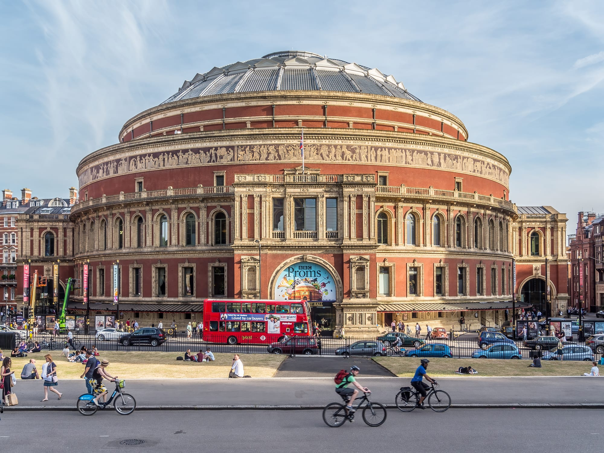
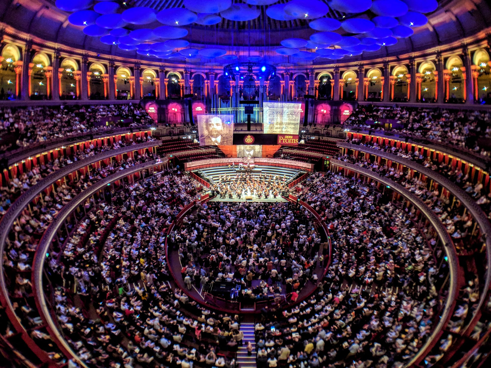

**Most Last Night of the Proms tickets are allocated by ballot, and the cheapest way in is not a ballot at all.** A standing Day Promming ticket costs £8, goes on sale online at 9.30am on the day of the concert, and is limited to two per booker.

> 💡 **The Short Version:** The BBC sells Last Night tickets five ways: an **Open Ballot** (200 seats, £101.96 or £165.20 in 2026), a **Five-Concert Ballot** (book five other concerts at the Royal Albert Hall first), a **general sale of leftovers**, a **Whole Season Pass**, and **£8 Day Promming** tickets online from **9.30am on the day**. **Two tickets per booker** on every route. The ballots close months ahead: in 2026 the Five-Concert Ballot closed on **4 June** and the Open Ballot on **9 July**, for a concert on **12 September**.

*Dates, prices and rules are the BBC's published 2026 figures for the concert on Saturday 12 September 2026.*

---

## The five routes

Prices include the booking fee, which on Last Night bookings is 2% of the total plus £2.00 per ticket. All routes cap you at **two tickets per booker**.

| Route | 2026 dates | Price | Watch out for |
| --- | --- | --- | --- |
| **Open Ballot** | Opened Saturday 16 May 2026, closed midnight Thursday 9 July 2026 | £165.20 Centre Stalls (100 seats), £101.96 Front Circle (100 seats) | Enter on the BBC's online form; it is a ballot, so entry is no guarantee |
| **Five-Concert Ballot** | Closed midnight Thursday 4 June 2026; tickets issued Friday 4 September 2026 | By seating section | You must buy tickets for at least five other Royal Albert Hall concerts and tick the ballot opt-in box; the other tickets are not refunded if you lose |
| **General sale of leftovers** | 9am Friday 17 July 2026 | By seating section | Only what the ballots left; two per booker |
| **Whole Season Pass** | Claim window: 11am on Friday 11 September 2026 to 9am on the day | Pass price | Holders must claim their Last Night ticket online; claim after 9.30am and entry is not guaranteed |
| **Day Promming** | 9.30am on the day, online | £8 including fees | Standing, in the Arena or Gallery; up to two tickets |

The BBC's page for the concert is the official source: [Last Night of the Proms tickets information](https://www.bbc.co.uk/programmes/articles/2rPWYtVGJ0v7McXqWLjRCSg/last-night-tickets-information). Bookings go through the [Royal Albert Hall](https://www.royalalberthall.com/).

## The £8 route in detail

**Day Promming is the way in that needs no luck and no advance planning.** Promming means standing in the Arena or the Gallery at the Royal Albert Hall, and the BBC puts the supply at around 1,000 standing places for each concert. For the Last Night in 2026 the tickets were:

- **£8 including fees**, online from **9.30am on the day**, up to two per booker.
- **Queue details** came from the Royal Albert Hall's website, which the BBC said would publish them from Friday 4 September 2026.

**There is a second £8 route for regular Prommers.** A limited number of Last Night Promming tickets are reserved for people who have attended five or more concerts in the Promming areas. You buy one ticket each, in person at the Door 12 box office, on presentation of your used e-tickets. In 2026 the releases were at 9am on Tuesday 21 July, Monday 17 August and Monday 7 September.

*The Royal Albert Hall in Proms season, with the BBC Proms banner over the entrance. Photo: [Ermell](https://commons.wikimedia.org/wiki/File:London_Royal_Albert_Hall-20130715-RM-175050.jpg), [CC BY-SA 4.0](https://creativecommons.org/licenses/by-sa/4.0/).*

## The two ballots

**The Open Ballot** has 200 seats: 100 in the Centre Stalls at £165.20 and 100 in the Front Circle at £101.96. You enter online.

**The Five-Concert Ballot** rewards people who book other Royal Albert Hall concerts. Buy tickets for at least five of them, tick the ballot opt-in box when booking (or tell the box office, if you book by phone, in person or by post), and you can apply for up to two Last Night tickets. If you win, you are not obliged to buy if your preferred section is unavailable or you change your mind. If you lose, the other tickets stand and are not refunded, so only enter if you want the five concerts anyway.

**For a wheelchair space**, there is a separate Five-Concert Ballot that can only be entered by phone, on the Hall's Access Information Line, **020 7070 4410**. The 2026 deadline was 5pm on Thursday 4 June 2026. The online Open Ballot also takes wheelchair applicants.

## The concert

The 2026 Last Night ran from **7.15pm to about 10.30pm** at the Royal Albert Hall, with a 20-minute interval. Sakari Oramo conducted the BBC Symphony Orchestra and Chorus, with Yuja Wang on piano and Nicky Spence as tenor. The second half ends with the Fantasia on British Sea-Songs, *Rule, Britannia!*, *Land of Hope and Glory*, *Jerusalem*, the National Anthem and *Auld Lang Syne*.

*Inside the Royal Albert Hall during a Prom, with the standing Arena in front of the stage. Photo: [Ed g2s](https://commons.wikimedia.org/wiki/File:Royal_Albert_Hall,_BBC_Proms_2017.jpg), [CC BY-SA 4.0](https://creativecommons.org/licenses/by-sa/4.0/).*

## If you miss out

- **Watch it.** The 2026 Last Night was shown on BBC Two (first half) and BBC One (second half), broadcast live on BBC Radio 3, with catch-up on iPlayer and BBC Sounds.
- **Go to a different Prom.** The 2026 season ran from 17 July to 12 September with 86 concerts. The BBC said it expected to sell around 70,000 £8 Promming tickets across the season, and the same Day Promming rule applies to most concerts: £8 online from 9.30am on the day, up to two per booker.
- **Book the Hall.** The Royal Albert Hall runs guided tours of the auditorium, which is the way to see it without a ticket for a concert.

Powered by <a target="_blank" rel="sponsored" href="https://www.getyourguide.com/london-l57/">GetYourGuide</a>

## Planning the next one

The timetable above is the BBC's 2026 one. Proms booking for 2026 opened on Saturday 16 May 2026, after a Proms Planner phase from 21 April to 15 May, and the two ballots closed in June and July. The BBC Proms site publishes each season's dates.

More London nights the public can get into, from award-ceremony red carpets to premieres, are in [award ceremonies in London](/articles/award-ceremonies-london/).

---

## Continue planning your London trip

- 🏆 **[Award ceremonies in London](/articles/award-ceremonies-london/)** — which nights the public can get into, and how
- 🌟 **[BAFTA Red Carpet Tickets](/articles/bafta-red-carpet/)** — free fan-pen places outside the Royal Festival Hall
- 🎬 **[How to See Stars at a London Film Premiere](/articles/film-premieres-london/)** — fan pens, ballots and ticketed premieres
- 🍂 **[Things to Do in London in September](/articles/things-to-do-in-london-in-september/)** — the Last Night and the rest of the month
- 🏛️ **[South Kensington Area Guide](/articles/south-kensington-area-guide/)** — the Royal Albert Hall and the museums round it
