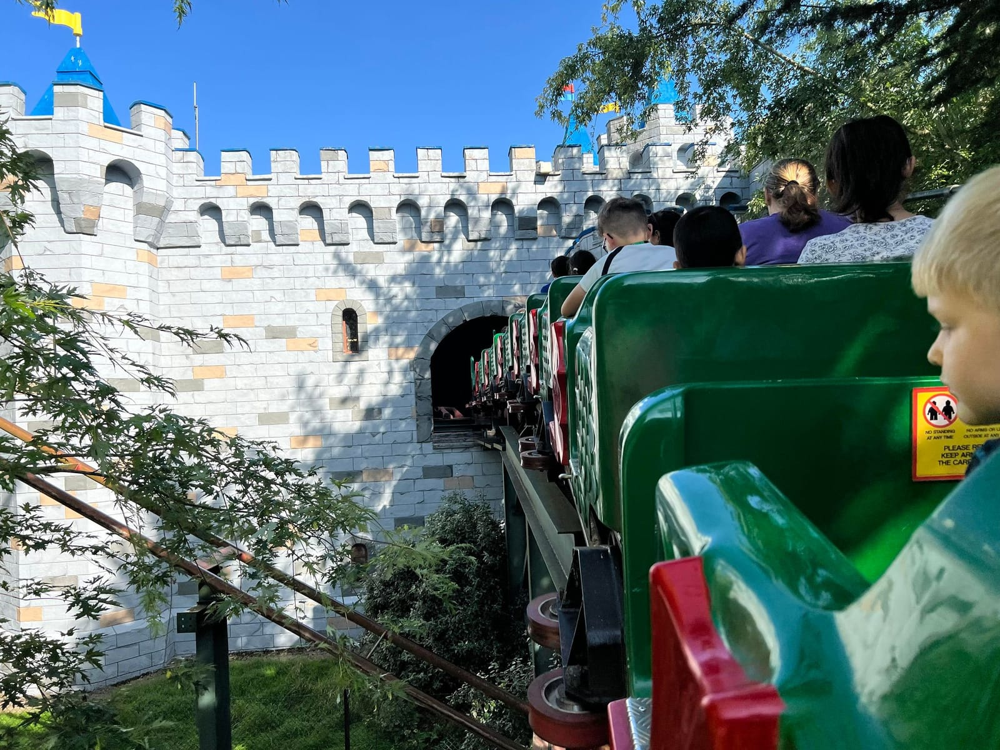
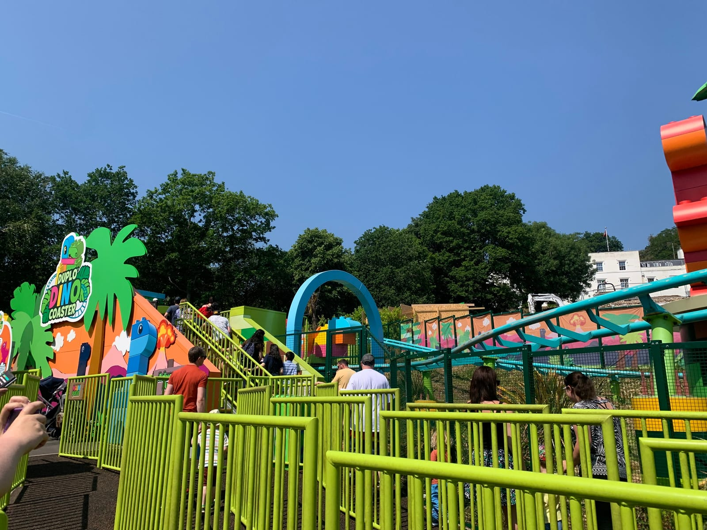
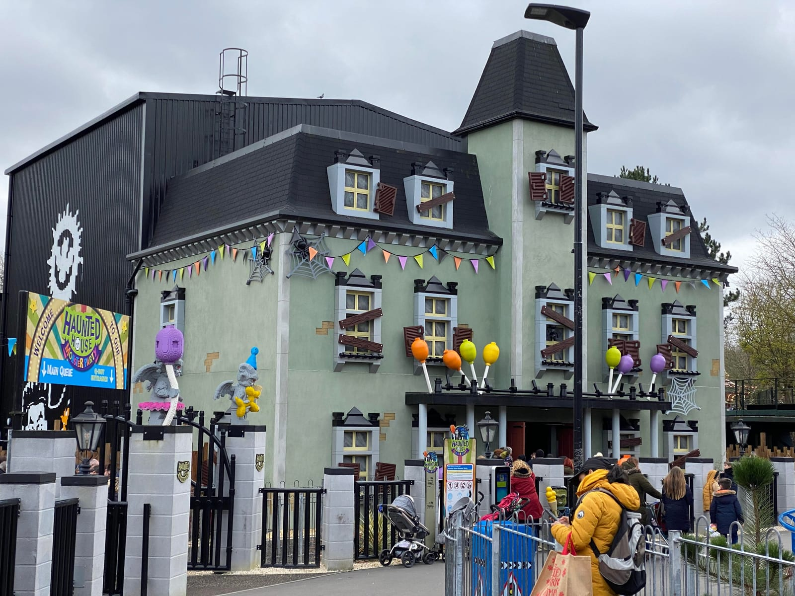

**LEGOLAND Windsor costs from £32 a person booked online at least a day ahead, and £68 if you buy on the day.** That gap is the whole ticket strategy: LEGOLAND charges the same for adults and children, lets anyone under 90cm in free, and keeps its lowest prices for off-peak dates booked at least five days out.

LEGOLAND designs it for children aged 2 to 12: over 55 rides and attractions on a steep hillside two miles from Windsor town centre. From London it is a train and a short bus ride, or one direct bus from Victoria.

> 💡 **The Short Version:** **Built for ages 2 to 12**; under-90cm children are free, and the fastest coaster tops out at 30mph. **Tickets from £32 online, booked at least a day ahead; £68 on the day.** Go by **train to Windsor and the 702 or 703 bus** (about 15 minutes, £3), or the **702 direct from Victoria**. Parking is **£13 online, £15 on the day**. Arriving by National Rail? The **Days Out Guide takes a third off**. **Would rather keep the option to cancel?** <a href="https://www.getyourguide.com/activity/-t111115?partner_id=WWP7I0R&amp;cmp=legoland-windsor-day-trip" target="_blank" rel="sponsored nofollow noopener" data-affiliate="gyg">GetYourGuide sells the same ticket from £32</a> with free cancellation up to 24 hours ahead, which LEGOLAND's own tickets do not have. **The trap is the calendar:** the park is shut most weekdays from November to February, and closed outright from **3 January to 10 February 2027**.

## What tickets cost

| Ticket | Price |
| --- | --- |
| **Online, booked a day or more ahead** | **From £32**, rising on busier dates |
| **Bought on the day**, online or at the gate | **£68** |
| **Under 90cm**, measured in shoes | Free |
| Adult and Pre-schooler, one adult and one child aged 4 or under | £29 online, term-time weekdays only |
| Brick or Treat (Halloween) days | From £37 online |
| LEGOLAND at Christmas days | From £34 online, £68 on the day |

*Prices for October 2026 onwards, from LEGOLAND's own booking pages.*

**There is no family ticket and no child rate.** Everyone over 90cm pays the same, adult or child, and LEGOLAND offers no senior or non-rider price. Children under 14 must be with someone aged 18 or over.

**Book at least five days ahead for the lowest price.** The online discount only applies to tickets bought at least 24 hours before the visit; LEGOLAND says its best online price needs five days' notice. Buy on the morning of your visit, even on your phone in the car park, and you pay £68.

**Tickets are non-refundable.** You can move the date yourself through LEGOLAND's Manage My Booking up to 24 hours before, to a comparable date within seven days of the original, up to three times. A weekday ticket cannot be moved to a weekend.

**Everyone pre-books, pass holders included.** LEGOLAND manages capacity this way, and on peak days the park can fill.

### The cheapest legitimate routes

- **Arrive by National Rail and use the Days Out Guide.** Merlin's offer takes **a third off the online advance price** for up to six people, with a valid National Rail ticket for each. It runs from 1 June 2026 to 31 May 2027, during the main season only, and must be booked through [daysoutguide.co.uk](https://www.daysoutguide.co.uk/legoland-windsor-resort) by 23:00 the night before. A contactless tap does not count as a train ticket: our [National Rail 2FOR1 guide](/articles/national-rail-2for1-london-attractions/) explains what does.
- **The Adult and Pre-schooler ticket** is £29 for one adult and one child aged 4 or under, on term-time weekdays, bought online at least a day ahead. Any extra children under 90cm still go free.
- **The LEGOLAND Annual Pass is £64**, and covers Brick or Treat and Christmas. Two visits on £32 days already cost the same.
- **A Merlin Annual Pass** also covers Chessington, SEA LIFE and the rest of Merlin's 20-plus UK attractions: Essential £139, Gold £239 (includes free parking at LEGOLAND), Platinum £299 (no exclusion dates and one free One Shot Fastrack per visit).

LEGOLAND's own site lists no two-for-one offer. The Days Out Guide discount above is a third off, not half.

## Booking through GetYourGuide

Two products are worth knowing about:

- **The <a href="https://www.getyourguide.com/activity/-t111115?partner_id=WWP7I0R&amp;cmp=legoland-windsor-day-trip" target="_blank" rel="sponsored nofollow noopener" data-affiliate="gyg">LEGOLAND entrance ticket</a>, from £32**, sold by LEGOLAND itself and rated 4.4 from 488 reviews. The price is the same; the difference is **free cancellation up to 24 hours before**, where a ticket bought direct is non-refundable. Under-90cm tickets are collected free at the gate.
- **The <a href="https://www.getyourguide.com/activity/-t645578?partner_id=WWP7I0R&amp;cmp=legoland-windsor-day-trip" target="_blank" rel="sponsored nofollow noopener" data-affiliate="gyg">LEGOLAND Windsor Resort Express</a>, £85**, run by Evan Evans: park entry and a coach from Victoria Coach Station, about an hour each way, with about six hours in the park. It is rated 4.0 from 140 reviews. Against a £32 ticket and two £3 bus fares, an adult pays roughly £47 for the coach seat.

Powered by <a target="_blank" rel="sponsored" href="https://www.getyourguide.com/london-l57/">GetYourGuide</a>

**For a family, book the ticket and take the train or the 702.** The coach saves a change at Slough and a 15-minute bus ride, at about £47 a seat.

## Getting there from London

### Train and the 702 or 703 bus

| Route | Train | Off-peak fare | Then |
| --- | --- | --- | --- |
| **Paddington → Windsor & Eton Central** | 28–38 minutes, change at Slough | **£7.90** | 3-minute walk to the bus stop |
| **Waterloo → Windsor & Eton Riverside** | 53 minutes, direct | **£8.90** | 5-minute walk to the bus stop |

*Single fares on contactless; our [Windsor guide](/articles/windsor-day-trip/) has the peak times and the Oyster rules for both stations.*

**From either station, walk to the Windsor Parish Church stop and take the 702 or 703.** Between them they run about every half hour to LEGOLAND's main entrance, in about 15 minutes, and every single fare on Reading Buses' Windsor Express routes is **capped at £3**. The buses take cash, contactless and the Windsor Express app. LEGOLAND mentions a separate shuttle from near both stations, but says it is chargeable and not run by the park; the 702 and 703 are the ones with a published fare.

### The 702 direct from Victoria

Reading Buses' **702** runs **hourly from Buckingham Palace Road, Victoria**, through Hyde Park Corner, the Royal Albert Hall, Kensington and Hammersmith to LEGOLAND's main entrance. It takes **about two hours**, for the same **£3 single** or a **£6 return** bought on the bus. In the timetable that started on 28 March 2026, the Saturday 07:30 from Victoria reaches the gate at 09:23: cheap, but slow next to the train, and easiest for anyone staying in west London.

### Driving

The postcode is **SL4 4AY**, on the B3022 two miles from Windsor, about 25 miles from central London; LEGOLAND allows 60 to 90 minutes. Leave the M4 at junction 6, the M3 at junction 3 or the M25 at junction 13, and follow the brown signs once you are near: LEGOLAND warns that some sat-navs send drivers into a residential street.

| Parking | Price |
| --- | --- |
| **General**, opposite the main entrance | **£13 booked online**, £15 on the day |
| **Priority**, next to the entrance | £18, last entry 12:00 |
| Merlin Gold and Platinum passes, on-site hotel guests | Free |

The barriers read number plates, so add your registration when you book. Going home, turn right at the LEGOLAND roundabout for the M25, M3 and M4 rather than heading back through Windsor.

## When it is open

| Period | Days | Hours |
| --- | --- | --- |
| **October 2026** | Daily except Wednesday 7 October | 10:00 to 16:30 on term-time weekdays, to 17:00 on Fridays, to 18:00 at weekends and in half-term |
| **Brick or Treat** | 10–11 October and 17 October to 1 November 2026 | 10:00 to 18:00 |
| **November 2026** | Saturday 7 and Saturday 21 November only, plus a pass holders' day on 8 November | 10:00 to 17:00 |
| **LEGOLAND at Christmas** | 28–29 November, 5–6, 12–14 and 17–23 December 2026, 27 December to 2 January 2027 | 10:00 to 17:00 |
| **February 2027** | 11–13, 15–22 and 27–28 February | 10:00 to 16:30 or 17:00 |
| **2027 main season** | Daily from 12 March 2027, apart from some term-time Wednesdays | 10:00 to 16:30–18:00 |

**Last entry is an hour before closing**, and ride queues close up to 30 minutes before the park does. The 2027 term-time Wednesday closures in the calendar so far are 17 March, 21 and 28 April, 12 and 19 May, and 15, 22 and 29 September; check [LEGOLAND's opening calendar](https://www.legoland.co.uk/plan-your-day/before-you-visit/opening-hours/) before you book trains.

> ⚠️ **LEGOLAND is closed 24 to 26 December 2026 and from 3 January to 10 February 2027.** Outside the Christmas dates, November and January are almost entirely shut. The water play areas, Splash Safari and Drench Towers, only open from May half-term to early September.

## Rides, and who they suit

*The Dragon. Photo: [DingRawD](https://commons.wikimedia.org/wiki/File:The_Dragon_@_Legoland_Windsor.jpg), [CC BY-SA 4.0](https://creativecommons.org/licenses/by-sa/4.0/).*

The park is laid out in 11 themed lands down a hillside, with the entrance at the top and the hotels at the bottom. The **Hill Train** links the two ends, saving a walk of about 600 metres that is steep in places.

- **The Dragon**, in Knight's Kingdom, is the park's fastest coaster at up to 30mph, starting inside the castle.
- **LEGO City Driving School**: children drive an electric car round LEGO City on their own after a road-safety video, and every driver gets a LEGOLAND driving licence at the end. Riders must be 1.1m to 1.5m and under 13; parents watch from the side.
- **Minifigure Speedway**, in Bricktopia, is a duelling coaster that races forwards and then in reverse.
- **Flight of the Sky Lion**, in LEGO Mythica, is a flying theatre ride, the first in the UK according to LEGOLAND.
- **Pirate Falls: Treasure Quest** is the log flume, and you will get wet.
- **Miniland** has scenes from Europe, the USA and London built from close to 40 million bricks, and needs no queue at all.

For under-fives, **DUPLO Valley** has the gentlest rides: the DUPLO Express train, Fairy Tale Brook boats, the DUPLO Dino Coaster for 90cm and up, and Hopsy's Hideaway to meet the DUPLO bunny.

### Height restrictions

| Ride | Minimum height | Must ride with someone 16+ if under |
| --- | --- | --- |
| LEGO City Driving School | 1.1m (maximum 1.5m, and not over 13) | Rides alone |
| Autumn's Riding Adventure | 1.2m | — |
| Minifigure Speedway | 1.05m | — |
| L-Drivers | 0.9m (maximum 1.1m) | Rides alone |
| The Dragon | 1.0m | 1.3m |
| Hydra's Challenge | 1.0m | 1.3m |
| Pirate Falls: Treasure Quest | 1.0m | 1.3m |
| Jolly Rocker | 1.0m | 1.3m |
| Flight of the Sky Lion | 1.0m | 1.2m |
| Fire & Ice Freefall | 1.0m | 1.2m |
| Dragon's Apprentice | 0.9m | 1.3m |
| DUPLO Dino Coaster | 0.9m | — |
| Haunted House Monster Party | 0.9m | 1.2m |
| Fire Academy, Spinning Spider, Merlin's Challenge | 0.9m | 1.3m |
| LEGO NINJAGO The Ride | None | 1.2m |
| Laser Raiders, Deep Sea Adventure, Coastguard HQ | None | 1.3m |

*From [LEGOLAND's height restrictions page](https://www.legoland.co.uk/plan-your-day/useful-guides/height-restrictions/). Children are measured in their shoes.*

**The first height cut-off is 90cm.** Below it a child gets in free but cannot go on the rides with a 90cm minimum, even with an adult. Rides with no minimum include Deep Sea Adventure, Coastguard HQ, Laser Raiders, Balloon School, NINJAGO and the LEGOLAND Express. At 1m almost everything except Driving School, Minifigure Speedway and Autumn's Riding Adventure opens up.

*The DUPLO Dino Coaster. Photo: [Lachlan](https://commons.wikimedia.org/wiki/File:Duplo_Dino_Coaster_-_geograph.org.uk_-_8239362.jpg), [CC BY-SA 2.0](https://creativecommons.org/licenses/by-sa/2.0/).*

## Beating the queues

**Go on a term-time Tuesday or Thursday, and avoid August.** Across 2025, queue-times.com, which logs LEGOLAND's own published wait times, put the park's average crowd level at **89% in August** against **26% in March**, and at **66% on Saturdays** against **34% on Thursdays**. Nine of the ten busiest days of 2025 fell in August, October half-term or the Easter holidays.

**The longest average waits in 2025** were Flight of the Sky Lion (34 minutes), Coastguard HQ (33), Fire Academy (31), Pirate Falls (30) and Laser Raiders (29). Do two of those before 11:00.

**Start at the back of the park.** Rides open at 10:00, and LEGOLAND's own advice is that the attractions near the entrance are busiest in the morning; it suggests The Dragon, Driving School, Pirate Falls and LEGO Mythica first thing or late in the afternoon. The LEGO Store is quietest between 12:00 and 16:00, and anything you buy can wait at Shopper Services until you leave.

### Fastrack

| Fastrack | Price per person | What you get |
| --- | --- | --- |
| **Bronze** | From £15 | 3 rides, not Hydra's Challenge, Flight of the Sky Lion or Coastguard HQ |
| **Silver** | From £29 | 6 rides, any Fastrack ride |
| **Gold** | From £75 | Unlimited Fastrack all day |
| One Shot | Varies | One ride, while they last |

Fastrack does not include park entry. Each ticket is for one person, has no time slots, and scans once every three minutes; numbers are limited, so book ahead for a busy day. It replaced the older Reserve & Ride system, which some guides still describe.

**Ride Access Pass** is LEGOLAND's queueing help for disabled guests, pre-booked through its app. LEGOLAND says it will move to virtual queuing from the end of 2026, with the same eligibility.

## Food, bags and lockers

- **Picnics are allowed.** Seating is mostly benches without tables and there is little cover, so on a wet day plan around the restaurants. Leave a cool box in the car and get a hand stamp to go out for it.
- **Food outlets are cashless.** City Walk Pizza & Pasta is an all-you-can-eat buffet; Pirate's Burger Kitchen, Farmer Joe's Chicken Company and the Skyline Bar cover the rest. A Coca-Cola Freestyle cup with unlimited refills is £16 bought online.
- **Lockers take a £1 coin, cash only**, and are not refundable. They measure 55 x 30 x 40cm and stand around the park, including near the main entrance. Bags cannot go on some rides.
- **Every bag is searched.** No glass, bottle openers, knives, alcohol, drones, or scooters and skateboards; the park sits on a hill, so scooters and children's tricycles are left at Guest Services.
- **Re-entry is free with a hand stamp** from the entrance turnstiles.

## Halloween and Christmas

*Haunted House Monster Party. Photo: [Coz4836](https://commons.wikimedia.org/wiki/File:Haunted_House_Monster_Party.jpg), [CC BY-SA 4.0](https://creativecommons.org/licenses/by-sa/4.0/).*

**Brick or Treat** runs on **10–11 October and from 17 October to 1 November 2026**, with tickets from £37 online. It is Halloween for young children rather than a scare event: Lord Vampyre's House Party show, a Monster Jam show, a disco on The Dragon, LEGO Monsters to meet, and the usual rides. Costumes are encouraged; full face masks and imitation weapons are not allowed. For scare mazes aimed at teenagers, our [Halloween in London guide](/articles/halloween-london/) covers Thorpe Park's Fright Nights.

**LEGOLAND at Christmas** runs on the selected dates in the opening table, from 21 November 2026 to 2 January 2027, with tickets from £34 online and £68 on the day. Over 20 rides run, including The Dragon, NINJAGO and Driving School, alongside festive shows and LEGO Santa. Meeting Father Christmas in his grotto is **from £27.50 per child** extra, with a LEGO gift, and does not include entry. More festive days out are in our [Christmas in London guide](/articles/christmas-in-london/).

## Staying over

LEGOLAND's three on-site hotels are sold as short breaks that include a day's park ticket, breakfast, free parking and **Early Park Access**, rides before the gates open to day visitors. Short breaks start **from £91 a person** for a family of four at the Resort Hotel, and LEGOLAND puts a standard room at the Resort or Castle Hotel from about £220 a night.

- **[The LEGOLAND Resort Hotel](https://www.legoland.co.uk/short-breaks/accommodation/the-legoland-resort-hotel/)**, LEGOLAND's site — on site at the bottom of the hill, with themed rooms (pirate, adventure, NINJAGO, LEGO Friends) and an indoor pirate splash pool. It closes 24 to 26 December.
- **[The LEGOLAND Castle Hotel](https://www.legoland.co.uk/short-breaks/accommodation/the-legoland-castle-hotel/)**, LEGOLAND's site — next door, knight and wizard rooms, with use of the Resort Hotel's pool and playroom.
- **[LEGOLAND Woodland Village](https://www.legoland.co.uk/short-breaks/accommodation/legoland-woodland-village/)**, LEGOLAND's site — lodges for five or seven and glamping-style barrels for four, a few minutes' walk from the main entrance. Christmas breaks here start from £85 a person.

Windsor itself is two miles away; our [Windsor day trip guide](/articles/windsor-day-trip/) covers the castle and the town, which make a second day rather than an add-on.

## What people get wrong

- **Buying on the day.** Even online from the car park, it is £68.
- **Paying for a toddler.** Under 90cm, in shoes, is free whatever their age.
- **Going on a closed day.** Most of November, January and early February, and some term-time Wednesdays.
- **Bringing teenagers for thrills.** The fastest coaster tops out at 30mph; [Thorpe Park](/articles/thorpe-park-day-trip/) is built for them.
- **Booking Bronze Fastrack for the longest queues.** It excludes Flight of the Sky Lion, Coastguard HQ and Hydra's Challenge.
- **Tapping in with contactless and then trying the Days Out Guide discount.** It needs a National Rail ticket.
- **Bringing a scooter.** It stays at Guest Services all day.

## Continue planning your London trip

- 🎢 **[Theme parks near London](/articles/theme-parks-near-london/)** — every park within a day trip, compared on price, travel and age.
- 🐷 **[Paultons Park](/articles/paultons-park-day-trip/)** — Peppa Pig World and over 70 rides in the New Forest, under-1m free.
- 🦁 **[Chessington World of Adventures](/articles/chessington-world-of-adventures-day-trip/)** — Merlin's other park for younger children, with a zoo, in Zone 6.
- 🎢 **[Thorpe Park](/articles/thorpe-park-day-trip/)** — the Merlin park built for teenagers and thrill rides.
- 🏰 **[Windsor](/articles/windsor-day-trip/)** — the castle, the Long Walk and the river, two miles from the gate.
- 🎟️ **[National Rail 2FOR1](/articles/national-rail-2for1-london-attractions/)** — which train tickets unlock the Days Out Guide offers.
- 👨‍👩‍👧 **[London with kids](/articles/london-with-children/)** — free farms, zoos and family days out in the city.
- 🗺️ **[Day trips from London](/articles/day-trips-from-london/)** — what the others cost, how long they take, and which days they are shut.
