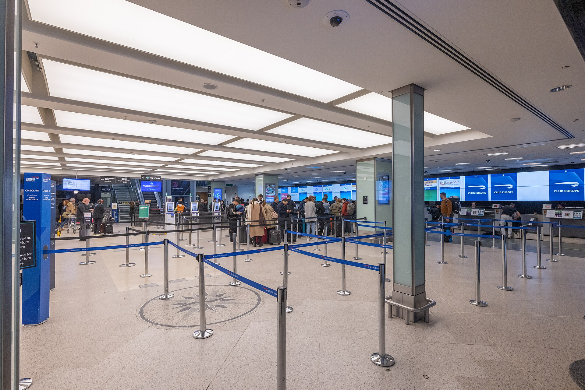

London City Airport (LCY) is the most centrally located airport in London, situated just 6 miles (10 km) east of the City of London in Zone 3.

> 💡 **Quick Verdict: London City Airport to London (2026)**  
> - **Cheapest & Fastest Route:** **Docklands Light Railway (DLR)**. Standard TfL Zone 3-to-1 pay-as-you-go fare (**£3.40 off-peak** / **£4.10 peak**).  
> - **Direct Access:** The DLR station is physically attached to the airport terminal (a 2-minute covered walk).  
> - **Best Connections:**  
>   - Change at **Custom House** (2 stops) for the **Elizabeth Line** to Liverpool Street, Farringdon, and Paddington.  
>   - Change at **Canning Town** (2 stops) for the **Jubilee Line** to London Bridge, Westminster, and Waterloo.  
> - **Full TfL Acceptance:** Contactless bank cards, Apple/Google Pay, Oyster cards, and Travelcards are fully valid!

---

## London City Transport Options Compared

*Fares and travel times checked on **2 August 2026**.*

| Transport Option | Central Destination | Journey Time | Single Adult Fare (Contactless / PAYG) | Best Used For |
| --- | --- | --- | --- | --- |
| **DLR ➔ Custom House (Elizabeth Line)** | Liverpool Street / Paddington | 20–35 mins | **£3.40** *(Off-Peak)* / **£4.10** *(Peak)* | **Fastest route** to West End, City & Paddington |
| **DLR ➔ Canning Town (Jubilee Line)** | London Bridge / Westminster | 20–30 mins | **£3.40** *(Off-Peak)* / **£4.10** *(Peak)* | Direct to South Bank, Westminster & Waterloo |
| **DLR Direct** | Bank Station / City of London | 22 mins | **£3.40** *(Off-Peak)* / **£4.10** *(Peak)* | Direct to the Financial District & Bank |
| **Black Cab / Uber** | Door-to-door anywhere in London | 15–40 mins | **£30.00 – £60.00** | Door-to-door convenience & heavy luggage |

---

## Which route is best for your hotel area?

| Hotel Area or Landmark | Recommended DLR Route | Why Take This Route? |
| --- | --- | --- |
| **Bank, Monument, The City** | **DLR Direct to Bank** | Direct train in 22 mins. |
| **Liverpool Street, Farringdon, Paddington** | **DLR ➔ Custom House ➔ Elizabeth Line** | Fast step-free Elizabeth line interchange (Custom House). |
| **London Bridge, Waterloo, Westminster** | **DLR ➔ Canning Town ➔ Jubilee Line** | Fast interchange to high-frequency Jubilee line trains. |
| **Canary Wharf & Docklands** | **DLR ➔ Poplar or Westferry** | Direct DLR connection in under 15 mins. |
| **ExCeL London (Custom House)** | **DLR Direct** | Just 2 stops away on the DLR. |

---

## Book Airport Transfers & Experiences

---

Powered by <a target="_blank" rel="sponsored" href="https://www.getyourguide.com/london-l57/">GetYourGuide</a>

## DLR Station & Terminal Accessibility

London City Airport has **one single compact terminal**.

*London City Airport terminal. Photo: [Arne Müseler](https://commons.wikimedia.org/wiki/File:London_City_Airport_Terminal.jpg), [CC BY-SA 3.0 DE](https://creativecommons.org/licenses/by-sa/3.0/de/deed.en).*

* **100% Step-Free Access:** The DLR station features lifts and level access between the terminal concourse and platforms.
* **TfL Fare Capping:** All journeys count automatically towards standard daily TfL fare caps.

---

## 5 Common London City transit mistakes to avoid

1. **Paying for private taxis into Central London unnecessarily:** The DLR costs **£3.40 off-peak** and reaches Bank in 22 minutes without road traffic.
2. **Going all the way to Bank when heading to Paddington:** Change at **Custom House** for the Elizabeth line—it saves over 15 minutes!
3. **Switching payment devices between taps:** Tapping in with a card and out with Apple Pay results in two maximum fare penalties.
4. **Forgetting weekend operating hours:** London City Airport closes earlier on Saturdays (~13:00) due to local noise regulations.
5. **Overpaying for paper single tickets:** Contactless or Oyster pay-as-you-go is automatic and significantly cheaper.

---

## Related London Transport Guides

* ✈️ [Heathrow Airport to London Transport Guide](/articles/heathrow-airport-to-london/)
* ✈️ [Gatwick Airport to London Transport Guide](/articles/gatwick-airport-to-london/)
* 🚊 [Getting Around London: Complete Transport Overview](/articles/getting-around-london-transport-guide/)
* 💷 [London Transport Fares and Costs 2026](/articles/london-public-transport-costs-and-fares/)

---

*Fares and travel times checked on 2 August 2026. Always verify live timetables with [Transport for London](https://tfl.gov.uk/).*
