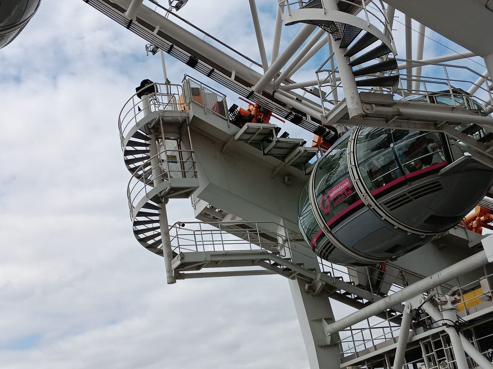
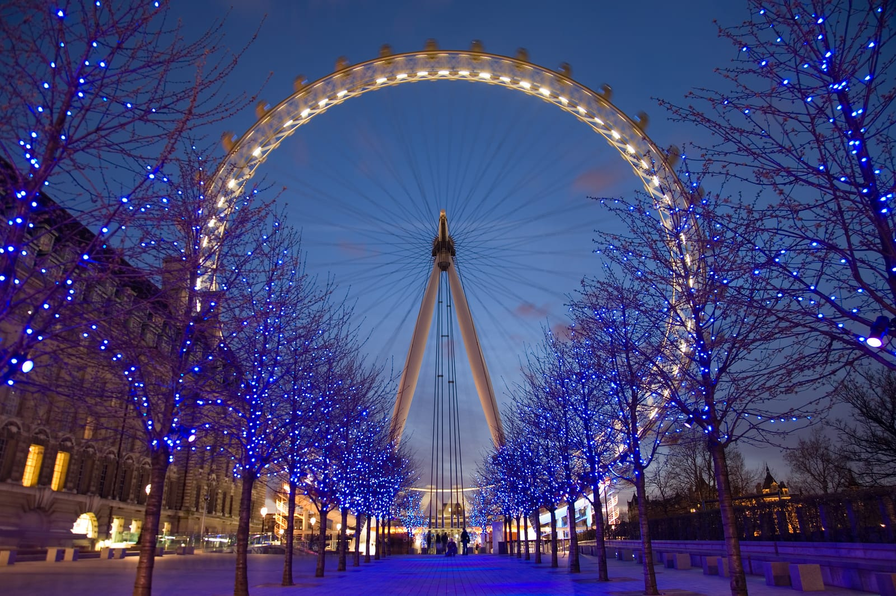
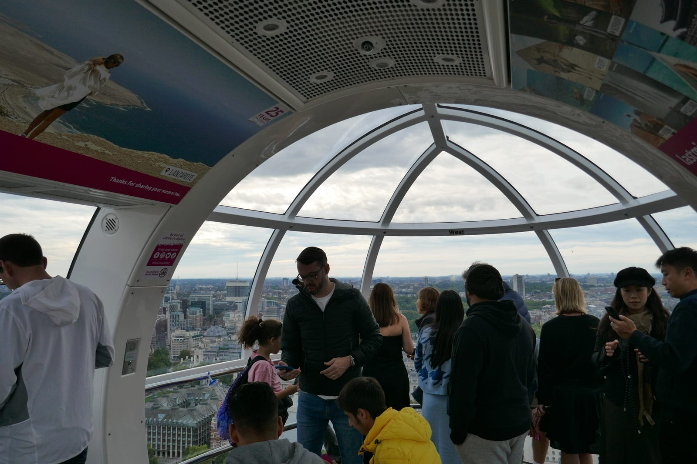
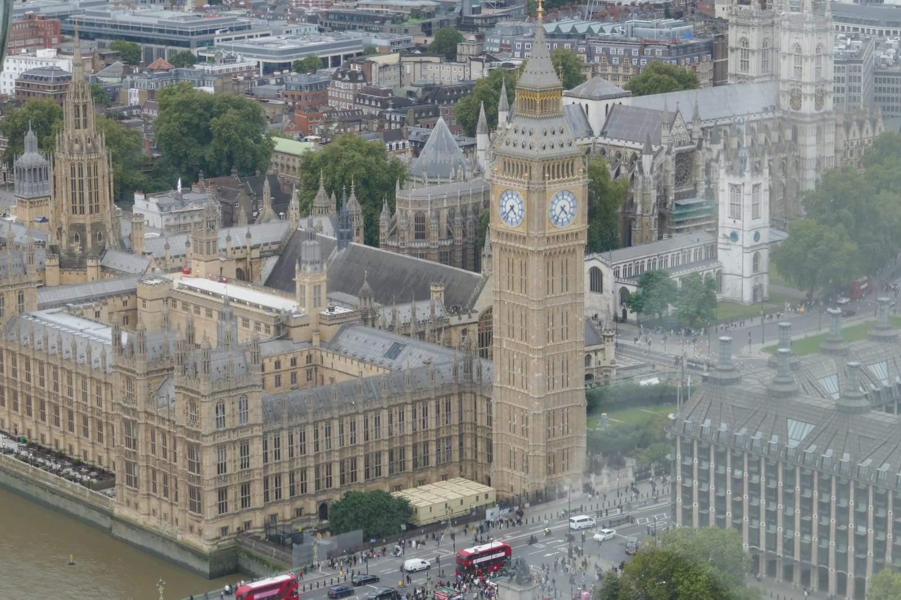

> 💡 **The Short Version:**
> - **Never buy at the gate:** Walk-up adult tickets cost **£39**; online advance slots start **from £29**. Book online.
> - **The best-value ticket isn't the Eye alone:** Merlin's five-attraction bundle (the Eye, Madame Tussauds, SEA LIFE, the Dungeon and Shrek's Adventure) runs **from £59 online against £184 bought separately**. The Eye-plus-Tussauds combo is **from £49 against £78 separately**. <a href="https://www.getyourguide.com/activity/-t26207?partner_id=WWP7I0R&amp;cmp=london-eye-guide" target="_blank" rel="sponsored nofollow noopener" data-affiliate="gyg">The London Pass on GetYourGuide</a> adds the Eye to 100+ other sights, including the Tower of London and Westminster Abbey.
> - **Fast Track, priced honestly:** Standard queues run 20 to 30 minutes on a quiet day and 5 to 10 for Fast Track, rising to an hour or more at peak times. Flexi Fast Track costs **from £49 online / £54 at the gate** against Standard's **from £29 / £39** — a gap of roughly £20 online and £15 at the gate, not a flat £15 add-on.
> - **The sunset rule:** Check the sunset time for your date and book a slot **30 minutes prior**. You board in daylight, reach the 135-metre apex during dusk, and see Parliament and the bridges light up on the descent.
> - **Weather:** Tickets are non-refundable, but not inflexible — reschedule for free up to an hour before arrival (up to 24 hours, three times, on a multi-attraction ticket) through the booking portal.
> - **Luggage:** Suitcases can't ride the wheel, but the ticket hall stores them for **£5 an item (£25 overnight)** and folds buggies in for free.

---

Standing 135 metres (443 feet) tall over the South Bank of the River Thames, the London Eye is the world's largest cantilevered observation wheel. Designed by Marks Barfield Architects for the millennium celebrations in 2000, the structure carries 32 climate-controlled glass capsules on an exterior spindle, providing uninterrupted 360-degree views across London up to 40 kilometres (25 miles) on clear days.

It is also one of Britain's most congested paid attractions. Approximately 3.5 million people ride it every year, creating long bottlenecks along the South Bank promenade between County Hall and Jubilee Gardens. Turning up without a booking risks the wait the operator itself quotes — 20 to 30 minutes on a quiet day, rising to an hour or more at peak times — on top of the higher £39 walk-up price.

---

## 2026 ticket prices and booking options

The London Eye is operated by **Merlin Entertainments** and uses dynamic pricing: tickets cost more during weekends, school holidays, and peak summer dates than during off-peak midweek periods.

| Ticket Type | Adult (16+) | Child (2–15) | Under 2 | Key Details |
| :--- | :--- | :--- | :--- | :--- |
| **Standard Admission (Online Advance)** | **From £29** | **From £26** | **Free** | Timed entry slot. Price rises with demand. |
| **Standard Admission (Walk-Up)** | **£39** | **£35** | **Free** | Box-office price at County Hall on the day. |
| **Flexi Fast Track (Online Advance)** | **From £49** | — | **Free** | Dedicated priority lane; valid any time on your chosen day. |
| **Flexi Fast Track (Walk-Up)** | **£54** | — | **Free** | Bought on the day at the priority desk. |
| **London Eye + River Cruise Combo** | **£45.00 – £52.00** | **£39.00 – £45.00** | **Free** | Pairs the flight with a 40-minute circular Thames cruise from London Eye Pier. |
| **London Eye + Madame Tussauds Combo** | **From £49** | — | **Free** | £78 bought separately; visit Tussauds within 7 days of your Eye slot. |
| **5-Attraction Merlin Bundle** | **From £59** | — | **Free** | The Eye, Tussauds, SEA LIFE, the Dungeon and Shrek's Adventure — £184 bought separately. |
| **The London Pass (Go City)** | **Included** | **Included** | **Free** | 100+ London attractions included. Requires free advance reservation on the Go City portal. |
| **Merlin Annual Pass** | **Included** | **Included** | **Free** | Pre-booking fee required (£1–£5) depending on pass tier; excluded on select peak dates. |

All tickets bought directly online require selecting a timed entry slot. If you arrive late, staff will fit you into the next available standard boarding group, but waits can be prolonged during peak afternoons.

You can inspect current dates, live slot capacity, and entry times using the booking tool below:

Powered by <a target="_blank" rel="sponsored" href="https://www.getyourguide.com/london-l57/">GetYourGuide</a>

---

## Is Fast Track worth it?

The upgrade is officially called Flexi Fast Track: it buys a dedicated priority lane on the boarding ramp and, unlike Standard tickets, lets you turn up any time on your chosen day rather than a fixed slot. It costs from £49 online or a flat £54 at the gate, against Standard's from £29 online or £39 at the gate — a gap of roughly £20 online and £15 at the gate, not the flat £15 add-on it's sometimes sold as.

*The boarding platform beside County Hall. Photo: [Simiprof](https://commons.wikimedia.org/wiki/File:London_Eye_boarding_platform.jpg), [CC0 1.0](https://creativecommons.org/publicdomain/zero/1.0/).*

The London Eye's own guidance on wait times: **20 to 30 minutes for Standard and 5 to 10 minutes for Fast Track on a quiet day, rising to an hour or more during peak periods.**

### When Fast Track is worth it
- **Weekends, school holidays and summer afternoons:** this is when the Standard queue is most likely to reach that "hour or more" band. Fast Track's separate lane keeps its advantage even when the main queue backs up.
- **Sunset flights:** slots within an hour of dusk are the most sought-after of the day, and the standard line bunches up as everyone converges on the same window.
- **Travelling with young children or anyone who finds standing difficult:** the standard queue is an outdoor zigzag with no seating; Fast Track removes most of the time spent in it.

### When Fast Track isn't worth it
- **Midweek, term-time, off-peak months:** on the operator's own numbers, a 20-to-30-minute Standard queue against a 5-to-10-minute Fast Track one saves at most 25 minutes for £15 to £20 — a weak trade outside peak times.
- **Opening slots:** the first flights of the day have the least backlog, so there's little queue left for Fast Track to cut.

---

## Combination tickets and the London Pass

If the London Eye is only one component of a wider sightseeing trip, buying an individual ticket is usually the most expensive approach. There are two distinct routes to save:

### 1. Merlin multi-attraction combination tickets
Merlin Entertainments operates several major commercial attractions within a few minutes' walk of the London Eye on the South Bank:
- **SEA LIFE London Aquarium** (inside County Hall, right next to the wheel entrance)
- **The London Dungeon** (inside County Hall)
- **Shrek's Adventure! London** (inside County Hall)
- **Madame Tussauds London** (on Marylebone Road, near Baker Street tube)

Every multi-attraction ticket gives you 7 days to visit the rest and can be rescheduled free up to three times. The two worth knowing:
- **The five-attraction bundle:** the Eye, Madame Tussauds, SEA LIFE London Aquarium, the London Dungeon and Shrek's Adventure, from £59 online against £184 bought separately — the best per-attraction value Merlin sells here. See the [multi-attraction tickets page](https://www.londoneye.com/tickets-and-prices/multi-attraction-tickets/) for current dates.
- **London Eye + Madame Tussauds:** from £49 online against £78 separately. Book a <a href="https://www.getyourguide.com/activity/-t432130?partner_id=WWP7I0R&amp;cmp=london-eye-guide" target="_blank" rel="sponsored nofollow noopener" data-affiliate="gyg">London Eye and Madame Tussauds combination ticket on GetYourGuide</a>.
- **London Eye + Thames River Cruise:** Combines your flight with a 40-minute circular sightseeing cruise departing directly from London Eye Pier at the base of the wheel. Book the <a href="https://www.getyourguide.com/activity/-t193403?partner_id=WWP7I0R&amp;cmp=london-eye-guide" target="_blank" rel="sponsored nofollow noopener" data-affiliate="gyg">London Eye River Cruise combo on GetYourGuide</a>.
- **London Eye + SEA LIFE London Aquarium:** Particularly convenient for families, as both attractions share the same South Bank riverside forecourt.

Powered by <a target="_blank" rel="sponsored" href="https://www.getyourguide.com/london-l57/">GetYourGuide</a>

### 2. The London Pass (Go City): 100+ London attractions
For travellers planning to visit London's premier historical monuments and museums alongside the London Eye, **The London Pass by Go City** is the most comprehensive sightseeing pass available.

The London Pass includes standard entry to the London Eye, alongside headline paid landmarks (values as listed by londonpass.com):
- **[Tower of London](/articles/tower-of-london-guide/)** (up to £37)
- **[Westminster Abbey](/articles/westminster-abbey-guide/)** (up to £31)
- **St Paul's Cathedral** (up to £27)
- **[Kew Gardens](/articles/kew-gardens-guide/)** (up to £22)
- **Tower Bridge Exhibition** (up to £18)
- **Uber Boat by Thames Clippers** 1-Day River Roamer (£24.00 value)
- **The View from The Shard** (£26.00–£32.00 value)
- **Windsor Castle** (up to £36)

#### Does the London Pass save money?
Individual adult advance tickets for the London Eye (from £29), the Tower of London (up to £37) and Westminster Abbey (up to £31) already add up to as much as £97 for three sights in a single day — close to the cost of a multi-day London Pass on its own. For our complete arithmetic and rules on when a pass is worth it, read our dedicated [London Pass Guide](/articles/london-pass-guide/).

#### How London Eye booking works with the London Pass
While many historic sites on the pass admit visitors on arrival, **the London Eye requires pass holders to pre-book a timed reservation slot online**:
1. Purchase your pass online (e.g. <a href="https://www.getyourguide.com/activity/-t26207?partner_id=WWP7I0R&amp;cmp=london-eye-guide" target="_blank" rel="sponsored nofollow noopener" data-affiliate="gyg">The London Pass on GetYourGuide</a>, which provides mobile pass vouchers and 24-hour cancellation flexibility).
2. Open the dedicated Go City reservation portal link provided in your booking confirmation.
3. Select your desired date and timed flight slot for the London Eye to generate a zero-balance entry reservation.
4. On the day of your visit, head to the South Bank boarding ramp with both your London Eye booking confirmation and your active London Pass QR code.

You can check pass prices, duration options (1 to 10 days), and real-time pass availability using the widget below:

Powered by <a target="_blank" rel="sponsored" href="https://www.getyourguide.com/london-l57/">GetYourGuide</a>

---

## Timing a sunset flight

The London Eye offers its most dramatic visual panorama during the transition from late daylight to illuminated night. Planning your booking around official sunset gives you three distinct perspectives across a single 30-minute revolution.

*The wheel illuminated at twilight. Photo: [David Iliff (Diliff)](https://commons.wikimedia.org/wiki/File:London_Eye_Twilight_April_2006.jpg), [CC BY 2.5](https://creativecommons.org/licenses/by/2.5/).*

### The 30-minute booking formula
To catch all three lighting phases, look up the exact sunset time for your visiting date and book a ticket slot **30 minutes before official sunset**.

Here is how the timing unfolds during your visit:
1. **Boarding window (T minus 30 mins):** You join the boarding queue. After ticket scanning and security, you step into the capsule shortly after.
2. **Ascent in daylight (T minus 15 mins):** As your pod climbs towards the top, you look out over Central London in clear, natural evening daylight.
3. **Apex at golden hour (T to T plus 5 mins):** At 135 metres, the sun dips to the horizon behind the Palace of Westminster, casting warm light across the river and the West End.
4. **Descent into night (T plus 5 to T plus 15 mins):** As the wheel brings your capsule down, the lamps on Westminster Bridge, the floodlights of Big Ben, and the office towers in the City and Canary Wharf switch on.

### London sunset reference guide

| Month | Approximate Sunset | Target Booking Slot | Notes |
| :--- | :--- | :--- | :--- |
| **January** | 16:15 – 16:45 | **15:45 – 16:00** | Earliest evening slots; combines well with winter South Bank lights. |
| **April** | 19:40 – 20:20 | **19:15 – 19:30** | British Summer Time begins; clear spring sunsets. |
| **July** | 21:00 – 21:20 | **20:30 – 20:45** | Long summer twilight; check late attraction closing hours. |
| **October** | 17:45 – 18:35 | **17:15 – 17:45** | Sunset shifts rapidly through autumn; confirm exact date. |

---

## Inside the capsule: what you see from the top

Each of the London Eye's 32 capsules accommodates up to 25 passengers. The capsules are mounted on the exterior of the wheel rim rather than suspended beneath it, which ensures an uninterrupted view in every direction.

*Inside one of the 32 capsules. Photo: [LittleRoamingChief](https://commons.wikimedia.org/wiki/File:2024--15_September--London_Eye_Capsule_interior.jpg), [CC BY 2.0](https://creativecommons.org/licenses/by/2.0/).*

Capsules feature perimeter double-curved laminated safety glass, dual air-conditioning and heating systems, and a wooden bench positioned centrally to leave the perimeter free for photography.

Unlike traditional fairground Ferris wheels, the ride is smooth and stable. Rubber tyres drive the rim, eliminating the swaying of a chain-driven wheel even in strong river breezes.

*The Palace of Westminster and Big Ben viewed from the apex of the rotation. Photo: [LittleRoamingChief](https://commons.wikimedia.org/wiki/File:2024--15_September--_Palace_of_Westminster_from_the_London_Eye.jpg), [CC BY 2.0](https://creativecommons.org/licenses/by/2.0/).*

### Key landmarks from the 135-metre apex
- **Looking west and south-west:** Directly opposite sits the Palace of Westminster and the Elizabeth Tower (Big Ben). Behind Parliament lies Westminster Abbey, Victoria Tower Gardens, and the green canopy of St James's Park, Green Park, and Buckingham Palace.
- **Looking north:** The curve of the Thames sweeps past Victoria Embankment towards Charing Cross railway bridge and Somerset House. On clear days, the BT Tower in Fitzrovia stands out against the northern ridge of Hampstead Heath.
- **Looking east:** Follow the river downstream past Waterloo Bridge towards St Paul's Cathedral and the high-rise cluster of the City of London (including The Gherkin, 22 Bishopsgate, and 20 Fenchurch Street). The jagged silhouette of The Shard rises directly across London Bridge.
- **Distance horizon:** On clear days with high atmospheric pressure, visibility extends 40 kilometres to Windsor Castle to the west and the chalk hills of the North Downs to the south.

---

## Weather, fog and rescheduling

London's weather can turn over a single afternoon. The wheel turns in rain, fog and light snow, closing only for severe storms or sustained gale-force winds.

### Low cloud and mist
The apex of the wheel reaches 135 metres. London's low cloud ceiling on rainy days regularly drops below 100 metres. When this happens, the upper third of your rotation takes place inside dense cloud, reducing visibility across the river to zero.

### Refunds and rescheduling
Tickets bought direct from londoneye.com are non-refundable and non-transferable, but not fixed to the forecast. A Standard or Fast Track ticket can be rescheduled for free up to one hour before your arrival slot, through the operator's own [booking portal](https://www.londoneye.com/plan-your-visit/information-and-support/manage-your-booking/). A multi-attraction ticket — the Tussauds combo or the five-attraction bundle — can be rescheduled free up to three times, any time up to 24 hours before arrival.

### If you'd rather cancel than reschedule
A <a href="https://www.getyourguide.com/activity/-t170451?partner_id=WWP7I0R&amp;cmp=london-eye-guide" target="_blank" rel="sponsored nofollow noopener" data-affiliate="gyg">London Eye timed entry ticket on GetYourGuide</a> matches official advance pricing and adds free cancellation up to 24 hours before your slot.

To plan around the forecast:
1. **Check the 48-hour forecast.** The Met Office two days out is a fair guide to whether the apex will be sitting in cloud.
2. **Move the slot, don't gamble on it.** If the outlook is poor, reschedule your direct booking to a clearer time up to an hour before arrival.
3. **Book closer to the day in shoulder season.** In spring and autumn, waiting until 24 to 48 hours out gives you a clearer read on conditions before you commit.

---

## Getting there, security and luggage

### Nearest stations and walking routes
- **Waterloo Station (Bakerloo, Jubilee, Northern, Waterloo & City lines + South Western Railway):** The most direct route. Take the South Bank exit and walk five minutes through York Road or Jubilee Gardens directly to the riverside.
- **Westminster Station (Circle, District, and Jubilee lines):** Exit onto Bridge Street and walk across Westminster Bridge. This route takes seven minutes and provides classic photographic views of the wheel reflected in the river.
- **Charing Cross / Embankment Stations (Bakerloo, Northern, District, Circle lines):** Walk across the Golden Jubilee pedestrian footbridge alongside Hungerford Bridge. The stroll takes ten minutes and descends directly into Jubilee Gardens.

### Security screening
Every passenger must pass through security screening in the marquee before entering the boarding ramp. Security staff inspect all bags and use walkthrough metal detectors and handheld scanner wands.

### Luggage and storage
Large suitcases and bulky bags can't ride the capsule itself — security will ask you to check them in. The ticket hall runs its own storage desk for exactly that: **£5 per item**, collected by 7pm the same day, or **£25** if you leave something overnight. Buggies and pushchairs can either be folded and carried into the capsule, or left at the same desk for free, also collected by 7pm.

If you'd rather not carry a case to County Hall at all, the staffed **Excess Baggage Company** counter on the main concourse of Waterloo station (open daily from 07:00 to 23:00) is a five-minute walk away. See our dedicated [luggage storage in London guide](/articles/luggage-storage-london/) for pricing and nearby app-based drop points.

### Wheelchair and accessibility access
The London Eye is fully step-free:
- Boarding ramps have gentle gradients, and staff temporarily slow or halt the wheel rotation to position wheelchair boarding ramps securely against the capsule threshold.
- Due to safety evacuation regulations, only **two wheelchair users are permitted per capsule**, and a maximum of **eight wheelchairs** may be on the wheel at any one time.
- Wheelchair slots must be booked in advance online to secure an allocated time. Carers receive a complimentary companion ticket when booking.

---

## Continue planning your London trip

- 🏛️ **[South Bank Area Guide](/articles/south-bank-area-guide/)** — street performers, cultural centres, and dining along the riverside.
- 🚶 **[South Bank Walk](/articles/south-bank-walk/)** — self-guided walking route from Westminster Bridge to Tower Bridge.
- 🏛️ **[Westminster Area Guide](/articles/westminster-area-guide/)** — Big Ben, Parliament, and royal landmarks directly across the river.
- 🎟️ **[The London Pass Guide](/articles/london-pass-guide/)** — honest maths, included attractions, and when a sightseeing pass saves money.
- 🗺️ **[Three Days in London Itinerary](/articles/three-days-in-london-itinerary/)** — an efficient Zone 1 plan that fits the London Eye into a central London day.
- 🚤 **[How to Use London River Boats](/articles/how-to-use-london-river-boats/)** — scenic Uber Boat by Thames Clippers services departing from London Eye Pier.
- 🧳 **[Luggage Storage in London](/articles/luggage-storage-london/)** — station left luggage desks and affordable bag drop services near Waterloo.
- ♿ **[Step-Free London](/articles/step-free-london/)** — accessible stations, piers and attractions across the city.
