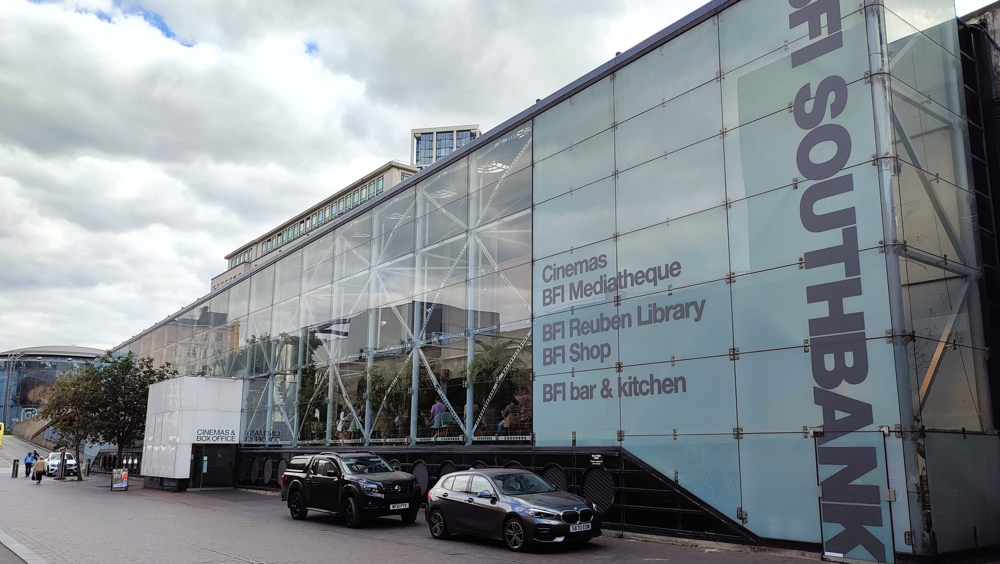

The BFI London Film Festival runs **7 to 18 October 2026**, its 70th edition. It is the largest public film event in the UK, and unlike Cannes or Venice it is built for ordinary ticket-buyers rather than accredited industry — most of the programme is on general sale, and most of it is affordable.

The part that catches people out is the calendar. **The programme is out — it landed on 2 September** — but general sale does not open until **17 September**, and by then the handful of screenings everyone wants are largely gone. **Elsinore** opens the festival on 7 October and **The Debut** closes it on the 18th; both galas are at the Royal Festival Hall.

> 💡 **The Short Version:** The programme is live. Tickets go on **general sale at 10am on 17 September** — but **BFI Members book from 10 September**, a week earlier, and membership is **£44**. If you are **16 to 25**, join **BFI 25 & Under** first: it is free, and it makes every festival ticket **£6**. Standard tickets start at **£10 plus a £1 booking fee**. If a screening sells out, there is a **fresh release at 10am on 1 October**, another **at 10am every festival morning**, face-value resale on **Twickets**, and a **returns and standby queue** at the venue on the night.

---

## The dates that matter

| Date | Time | What happens |
| --- | --- | --- |
| **Wed 2 September** | 11am | Full programme revealed — done |
| **Wed 9 September** | 10am | Priority booking opens — BFI Patrons |
| **Thu 10 September** | 10am | Priority booking opens — BFI Members |
| **Thu 17 September** | 10am | **Tickets on general sale** |
| **Thu 1 October** | 10am | Extra tickets released |
| **Wed 7 – Sun 18 October** | — | The festival itself |

Two things follow from this. The first is that if you want a specific screening badly, the decision about membership has to be made before 10 September, not on the morning of general sale. The second is that 1 October is a genuine second chance that most people miss — it is a real release of held-back stock, not a token gesture.

---

## What it costs

**Tickets start at £10, or £6 if you are 25 or under**, plus a £1 booking fee that Members and Patrons do not pay. These are the confirmed 2026 prices, from the festival's own booking page:

| Screening type | 2026 price |
| --- | --- |
| Weekday matinee, before 5pm | £13 |
| Evenings, and weekend matinees | £18 |
| Gala premiere, Royal Festival Hall | £21–£30 |
| **Opening and Closing Night Gala** | £40 |
| Repeat matinee of a gala, weekday / weekend | £16 / £18 |
| Special Presentation, premiere | £21 |
| Special Presentation, matinee weekday / weekend | £16 / £18 |
| Surprise Film | £21 |
| Family strand | £10 adult, £6 child |
| Relaxed screenings | £6 |
| **Anyone 25 and under, anything** | **£6** |

Treat these as a guide rather than a quote — they are last year's figures, and the 2026 set will be confirmed on 2 September.

Two prices for 2026 are already fixed, and both are fundraising tickets rather than ordinary admission: **£1,000** for the Opening Night Gala, which includes red-carpet arrival and receptions either side of the film, and **£250** for the Closing Night Gala, which does not. These exist to raise money for the BFI. They are not the normal way in, and standard gala tickets for both films go on sale with everything else.

### If you are 25 or under, read this first

**BFI 25 & Under is free to join, open to anyone aged 16 to 25, and makes London Film Festival tickets £6.**

It is worth being precise about this, because the scheme has two different rates and people conflate them. The same free membership gets you **£4** tickets for regular year-round screenings at BFI Southbank, and **£6** tickets for the London Film Festival and BFI Flare. So a festival ticket at £6 is the correct price, not an error.

At £6 against a £13–£18 standard ticket, this is the largest discount available to anyone at the festival, and it costs nothing to set up. Do it before 17 September.

### Other concessions

Reduced prices are available to over-60s, students with valid ID, and anyone on Universal Credit, Pension Credit or Jobseeker's Allowance. The last of those was **£6** on the day in 2025, but it requires signing up in person at the box office beforehand with two documents proving eligibility — not something you can do online on the morning. Concessions do not apply to Screen Talks or screenings at the Southbank Centre.

**Access:** companion tickets are free for guests who need support, with a CEA Card, Access Card, National Disability Card or National Carers Card accepted as proof. Book on **020 7960 2102** and quote ACCESS. Every festival venue is step-free except the Prince Charles Cinema.

---

Powered by <a target="_blank" rel="sponsored" href="https://www.getyourguide.com/london-l57/">GetYourGuide</a>

## Is BFI Membership worth it?

Membership costs **£44 a year** paying by direct debit without a printed programme, £54 with one, or £60 as a one-off card payment. It gets you priority booking from 10 September, no booking fees, two free tickets for standard BFI Southbank screenings, and up to £2.50 off Southbank and IMAX tickets.

The honest arithmetic, if the festival is the only reason you are considering it:

- The **booking fee saving is £1 a ticket**. To recover £44 on that alone you would need to buy 44 tickets.
- The **two free tickets** and the **£2.50 discount** are Southbank benefits, useful year-round but not at the festival.
- What you are actually buying is **seven days of priority**, from 10 September instead of 17 September.

So: if you go to BFI Southbank through the year anyway, membership pays for itself comfortably on the free tickets and the per-ticket discount. If you turn up once a year for the festival, it does not pay for itself in cash — it buys you a head start on the screenings that sell out. Whether that is worth £44 depends entirely on whether there is a specific film you would be disappointed to miss.

The **Patron** tiers — £2,000, £6,500 and £15,000 — get you one further day of priority, on 9 September, along with a personalised booking service. That is a philanthropic decision rather than a ticketing one.

---

## Where it happens

*BFI Southbank is the festival's centre of gravity, and its box office handles the standby queue for Royal Festival Hall screenings too.*

Seven London venues for 2026:

- **BFI Southbank** — the hub, and where most of the programme screens
- **Royal Festival Hall** — the galas, including both Opening and Closing Night, and the Surprise Film
- **BFI IMAX**, Waterloo
- **Curzon Soho**
- **Prince Charles Cinema**, Leicester Square
- **ICA**, The Mall
- **Vue West End**, Leicester Square

The festival is not exclusively a London event. Selected films play at **ten partner cinemas around the UK** — Broadway Nottingham, Chapter Cardiff, Glasgow Film Theatre, HOME Manchester, MAC Birmingham, Queen's Film Theatre Belfast, Showroom Sheffield, Tyneside Newcastle, Filmhouse Edinburgh and Watershed Bristol — and a selection streams UK-wide on **BFI Player**. Press and industry screenings run separately at Picturehouse Central.

If you are booking several films in a day, check the venues before you check the times. Southbank to Leicester Square is about 20 minutes on foot across Waterloo Bridge, and the festival schedules screenings tightly enough that a cross-river gap can catch you out.

---

## What is already announced

The full programme arrives on 2 September, but three things are confirmed.

**The Opening Night Gala** is *Elsinore*, at the Royal Festival Hall on Wednesday 7 October. Directed by Simon Stone and written by Stephen Beresford, it tells the true story of the actor Ian Charleson preparing to play Hamlet at the National Theatre while facing HIV/AIDS, with Andrew Scott and Olivia Colman leading a cast that includes Billie Piper, Johnny Flynn and Luke Thompson.

**The Closing Night Gala** is *The Debut*, getting its UK premiere on the evening of Sunday 18 October. It is Jesse Eisenberg's follow-up to *A Real Pain*, which itself premiered at this festival in 2024, and he directs and stars alongside Julianne Moore, Paul Giamatti and Halle Bailey.

**The Official Competition** — ten films in the running for Best Film, with the award announced on 18 October:

| Film | Director |
| --- | --- |
| *7 Miles Out* | Carol Morley |
| *Act 3* | Christine Molloy and Joe Lawlor |
| *Glaxo* | Benjamín Naishtat |
| *Imperium* | Sergei Loznitsa |
| *Ketticè* | Giovanni Tortorici |
| *Look Back* | Hirokazu Koreeda |
| *My Notes on Mars* | Lili Horvát |
| *The Difficult Bride* | Rubaiyat Hossain |
| *The Idiot(s)* | Małgorzata Szumowska and Michal Englert |
| *Woman Unknown* | May el-Toukhy |

Winners are announced on **Sunday 18 October**. There are four juried awards — Best Film from the Official Competition, the **Grierson Award** for documentary, the **Sutherland Award** for a first feature, and the **Short Film Award** — plus separate **Audience Awards** voted for by ticket-holders, which are decided after the festival closes rather than on the night.

The festival also runs **LFF for Free** most years — free talks, short film programmes, immersive and VR work and family workshops, largely at BFI Southbank across the two festival weekends. In 2025 those tickets opened separately in early October, first-come-first-served, two per person. The 2026 free programme is announced with everything else on 2 September.

### How the programme is organised

The strands have been stable for years, and they are the fastest way to navigate a programme of this size once it lands. Alongside the **Galas** and the four competitions, films are grouped as **Love**, **Debate**, **Laugh**, **Dare**, **Thrill**, **Cult**, **Journey**, **Create** and **Family**, with **Treasures** for restored archive classics, **Experimenta** for artist and experimental film, and **Expanded** for immersive and XR work.

For scale: the 2025 edition ran 247 features, shorts, series and immersive works from 79 countries across the same 12 days. The 2026 figure is published on 2 September, but expect something comparable — which is the useful context for the sold-out panic below. A dozen or so screenings sell out in minutes. Several hundred do not.

---

Powered by <a target="_blank" rel="sponsored" href="https://www.getyourguide.com/london-l57/">GetYourGuide</a>

## Getting tickets on the day of sale

**Be ready at 10am, not at 10.05am.** The screenings that sell out do so in the first few minutes, and they are a predictable set: the Opening and Closing Night Galas, the other red-carpet gala premieres, the Surprise Film, and anything with a well-known director or cast attached.

A few things worth knowing before you start clicking:

**Log in first.** You need to be signed in to the BFI's booking site to see prices and to book. Doing that at 09:58 rather than 10:00 is free time.

**There was a two-ticket limit per film in 2025**, with more allowed for family screenings. Expect something similar. It applies during the priority windows and lifts at general sale.

**Book the second screening, not the premiere.** Most films in the programme screen more than once, and the repeat is very often a weekday matinee at £13–£16 rather than a £21–£30 gala. The premiere is where the red carpet, the director introduction and the competition are; the second screening is the same film, cheaper and far easier to get. If you want to see the film rather than the event, book the repeat.

**The wider programme is not the problem.** The galas are a dozen or so screenings out of several hundred. The competition titles, the documentary strand, the archive restorations in Treasures and the short film programmes do not go in the first minutes. If your plan is "see four interesting films in October" rather than "attend the Opening Night Gala", general sale on 17 September is perfectly adequate.

---

## If it has already sold out

Four routes, in the order worth trying them.

### 1. The 1 October release, and the daily 10am release

**Extra tickets go on sale at 10am on Thursday 1 October.** This is held-back stock across the programme, and it is the single best chance at something that vanished in September.

Once the festival starts, **more tickets are released online at 10am each morning** for that day's screenings. This is particularly worth doing for Royal Festival Hall screenings, because it is a large venue and production holds are released late.

### 2. Twickets

Returned and unwanted tickets are resold through **Twickets**, where London Film Festival tickets have been listed under official festival pages for the past couple of years. The relevant thing about Twickets is the price cap: it is a face-value resale platform, so a ticket is listed at what the original buyer paid, plus Twickets' own fee. You are not bidding against anyone.

Search for "BFI London Film Festival" at [twickets.live](https://www.twickets.live/en/uk) once general sale has been and gone — there is nothing to see before then, because nobody has tickets to return yet. Set an alert for the screening you want rather than refreshing.

It works in the other direction too: if you end up with a ticket you cannot use, listing it there is how you get your money back without breaking the BFI's resale rules.

### 3. Returns at the box office

**Go to the venue box office 45 minutes before the screening** and ask whether any tickets have been returned. Staff check returns first, and if there are none they will point you at the standby queue.

### 4. The standby queue

**Join it 30 minutes before the screening starts. Standby tickets are released 15 minutes before the film.**

One detail that catches people out: **for Royal Festival Hall screenings, the standby queue is at BFI Southbank**, in the Atrium box office, not at the Southbank Centre itself. Turning up at the RFH doors will cost you your place.

Standby is a genuine route rather than a formality — festival screenings have a high no-show rate, particularly for weekday matinees and late-evening slots — but it is not a guarantee, and it is a poor plan for the galas.

---

Powered by <a target="_blank" rel="sponsored" href="https://www.getyourguide.com/london-l57/">GetYourGuide</a>

## What not to do

**Do not buy above face value.** The BFI's terms cap resale at 20% above the face value shown on the ticket, and state that it may cancel the original booking if that is breached. A ticket bought for triple the price from a stranger can simply be void when it is scanned, and you will have no way to recover the money.

**Be careful with social media resale.** Tickets do circulate in Facebook groups and on X, and some of those are genuine people who cannot make a screening. There is no protection if they are not, and no way to verify a ticket before you pay. Twickets exists precisely to solve this problem.

**If you are a member, do not resell priority-window tickets for profit.** The BFI's membership terms say it can cancel your membership without notice or refund for using priority booking for commercial gain.

---

## A practical plan

If you want to do the festival properly without overthinking it:

1. **Now** — if you are 16 to 25, join BFI 25 & Under. It is free and makes every ticket £6.
2. **Before 10 September** — decide on membership. £44, and only worth it if a specific sold-out screening matters to you or you use BFI Southbank year-round.
3. **2 September, 11am** — read the programme. Note which films have a second or third screening.
4. **17 September, 10am** — book, at general sale. Prioritise the films with only one screening; the rest you can come back for.
5. **1 October, 10am** — check the extra release for anything you missed.
6. **During the festival** — 10am online each morning, then returns at 45 minutes and standby at 30 minutes for anything still out of reach.

---

*Ticket prices for 2026 are confirmed when the programme is published on 2 September 2026 — the price table above is last year's, included as a guide. Everything else here is confirmed on the BFI's own listings.*
